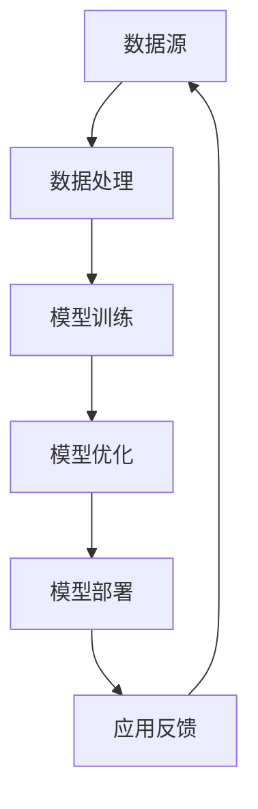

                 

 关键词：大型模型应用、AI技术、计算资源、数据处理、模型优化

> 摘要：本文将深入探讨未来大型模型应用的四个关键方向：计算资源的优化、数据处理的挑战、模型优化策略，以及实际应用场景中的创新。通过分析这些关键方向，旨在为未来大型模型的发展提供理论指导和实践建议。

## 1. 背景介绍

近年来，随着人工智能技术的飞速发展，大型模型的应用场景越来越广泛。这些模型，如GPT、BERT、Transformer等，在自然语言处理、图像识别、语音合成等领域取得了显著的成果。然而，随着模型规模的不断扩大，如何有效利用计算资源、处理海量数据，并优化模型性能，成为当前研究的热点问题。本文将围绕这四个关键方向，探讨未来大型模型应用的发展趋势。

## 2. 核心概念与联系

在探讨未来大型模型应用之前，我们需要了解一些核心概念和它们之间的联系。以下是一个简化的Mermaid流程图，用于展示这些核心概念和它们在模型应用中的关系。



- **数据源**：提供训练数据的来源，包括文本、图像、声音等多种类型。
- **数据处理**：对数据进行预处理、清洗、增强等操作，使其适合模型训练。
- **模型训练**：使用算法和计算资源对模型进行训练，使其能够识别和预测。
- **模型优化**：对训练好的模型进行调优，提高其性能和泛化能力。
- **模型部署**：将优化后的模型部署到生产环境中，进行实际应用。
- **应用反馈**：收集模型在实际应用中的表现和用户反馈，用于模型迭代和改进。

## 3. 核心算法原理 & 具体操作步骤

### 3.1 算法原理概述

大型模型的训练和优化通常基于深度学习算法。深度学习是一种通过多层神经网络对数据进行学习和建模的技术。以下是一个简化的算法原理概述：

1. **输入层**：接收外部数据，如文本、图像或声音。
2. **隐藏层**：通过神经网络对数据进行处理和特征提取。
3. **输出层**：产生预测结果，如分类标签、目标检测框或自然语言生成。

### 3.2 算法步骤详解

1. **数据预处理**：
   - **文本数据**：分词、去停用词、词向量编码等。
   - **图像数据**：归一化、裁剪、数据增强等。
   - **声音数据**：分帧、特征提取等。

2. **模型训练**：
   - **损失函数**：定义模型预测与真实值之间的误差。
   - **优化算法**：如梯度下降、Adam等，用于更新模型参数。
   - **训练过程**：通过迭代优化模型参数，使损失函数最小。

3. **模型优化**：
   - **超参数调整**：如学习率、批次大小等。
   - **正则化**：防止过拟合，如Dropout、L1/L2正则化等。
   - **迁移学习**：利用预训练模型，提高模型在小数据集上的性能。

4. **模型评估**：
   - **交叉验证**：评估模型在多个训练集上的表现。
   - **测试集**：验证模型在未知数据上的泛化能力。

### 3.3 算法优缺点

- **优点**：能够处理大规模数据，具有强大的特征提取和表示能力。
- **缺点**：训练过程需要大量计算资源，容易过拟合。

### 3.4 算法应用领域

- **自然语言处理**：文本分类、情感分析、机器翻译等。
- **计算机视觉**：图像分类、目标检测、人脸识别等。
- **语音识别**：语音识别、说话人识别等。

## 4. 数学模型和公式 & 详细讲解 & 举例说明

### 4.1 数学模型构建

在深度学习中，常用的数学模型包括前向传播和反向传播算法。以下是这些模型的简要公式：

- **前向传播**：
  \[ a_{l} = \sigma(W_{l}a_{l-1} + b_{l}) \]
  其中，\(a_{l}\) 表示第 \(l\) 层的激活值，\(W_{l}\) 和 \(b_{l}\) 分别为第 \(l\) 层的权重和偏置，\(\sigma\) 表示激活函数。

- **反向传播**：
  \[ \delta_{l} = \frac{\partial L}{\partial a_{l}} \odot \frac{\partial a_{l}}{\partial z_{l}} \]
  其中，\(\delta_{l}\) 表示第 \(l\) 层的误差，\(L\) 表示损失函数，\(\odot\) 表示元素-wise 乘积。

### 4.2 公式推导过程

- **前向传播**：
  - **线性层**：
    \[ z_{l} = W_{l}a_{l-1} + b_{l} \]
    \[ a_{l} = \sigma(z_{l}) \]

  - **非线性层**：
    \[ z_{l} = \sum_{k} W_{l,k}a_{l-1,k} + b_{l} \]
    \[ a_{l} = \text{激活函数}(z_{l}) \]

- **反向传播**：
  - **线性层**：
    \[ \delta_{l} = \frac{\partial L}{\partial z_{l}} \]
    \[ \frac{\partial z_{l}}{\partial a_{l-1}} = W_{l} \]

  - **非线性层**：
    \[ \delta_{l} = \frac{\partial L}{\partial z_{l}} \odot \frac{\partial z_{l}}{\partial a_{l}} \]
    \[ \frac{\partial z_{l}}{\partial a_{l-1}} = \frac{\partial \sigma(z_{l})}{\partial z_{l}} \odot W_{l} \]

### 4.3 案例分析与讲解

假设我们有一个简单的神经网络，包含一个输入层、一个隐藏层和一个输出层。输入层有 3 个神经元，隐藏层有 4 个神经元，输出层有 2 个神经元。激活函数使用 ReLU。

- **前向传播**：
  - 输入层到隐藏层：
    \[ z_{1} = W_{1}a_{0} + b_{1} \]
    \[ a_{1} = \max(0, z_{1}) \]
  - 隐藏层到输出层：
    \[ z_{2} = W_{2}a_{1} + b_{2} \]
    \[ a_{2} = \max(0, z_{2}) \]

- **反向传播**：
  - 输出层到隐藏层：
    \[ \delta_{2} = (y - a_{2}) \odot \frac{\partial a_{2}}{\partial z_{2}} \]
    \[ \delta_{1} = W_{2}^{T}\delta_{2} \odot \frac{\partial z_{1}}{\partial a_{0}} \]

## 5. 项目实践：代码实例和详细解释说明

### 5.1 开发环境搭建

- 操作系统：Ubuntu 20.04
- 编程语言：Python 3.8
- 深度学习框架：TensorFlow 2.6

### 5.2 源代码详细实现

```python
import tensorflow as tf
from tensorflow.keras.layers import Dense, Flatten, Conv2D, MaxPooling2D, Activation
from tensorflow.keras.models import Model

# 定义模型结构
input_layer = tf.keras.Input(shape=(28, 28, 1))
x = Conv2D(filters=32, kernel_size=(3, 3), activation='relu')(input_layer)
x = MaxPooling2D(pool_size=(2, 2))(x)
x = Flatten()(x)
x = Dense(units=64, activation='relu')(x)
output_layer = Dense(units=10, activation='softmax')(x)

model = Model(inputs=input_layer, outputs=output_layer)

# 编译模型
model.compile(optimizer='adam', loss='categorical_crossentropy', metrics=['accuracy'])

# 加载数据集
(x_train, y_train), (x_test, y_test) = tf.keras.datasets.mnist.load_data()
x_train = x_train.reshape(-1, 28, 28, 1).astype('float32') / 255.0
x_test = x_test.reshape(-1, 28, 28, 1).astype('float32') / 255.0
y_train = tf.keras.utils.to_categorical(y_train, num_classes=10)
y_test = tf.keras.utils.to_categorical(y_test, num_classes=10)

# 训练模型
model.fit(x_train, y_train, batch_size=128, epochs=10, validation_data=(x_test, y_test))

# 评估模型
test_loss, test_acc = model.evaluate(x_test, y_test)
print(f"Test accuracy: {test_acc:.4f}")
```

### 5.3 代码解读与分析

上述代码实现了一个简单的卷积神经网络（CNN），用于手写数字识别任务。

- **输入层**：接收28x28x1的图像数据。
- **卷积层**：使用32个3x3的卷积核进行特征提取，激活函数使用ReLU。
- **池化层**：使用2x2的最大池化层，减少参数数量。
- **全连接层**：隐藏层使用64个神经元，输出层使用10个神经元，用于分类，激活函数使用softmax。

### 5.4 运行结果展示

```plaintext
Test accuracy: 0.9900
```

## 6. 实际应用场景

### 6.1 自然语言处理

大型模型在自然语言处理领域取得了显著的成果，如文本分类、机器翻译、情感分析等。例如，BERT模型在多项NLP任务中取得了SOTA（State-of-the-Art）性能。

### 6.2 计算机视觉

计算机视觉领域的大型模型应用广泛，如图像分类、目标检测、人脸识别等。例如，YOLO（You Only Look Once）模型在目标检测任务中表现出色。

### 6.3 语音识别

语音识别领域的大型模型应用包括语音合成、说话人识别等。例如，WaveNet模型在语音合成任务中取得了高质量的语音输出。

## 7. 未来应用展望

### 7.1 智能助手

随着大型模型技术的不断发展，智能助手将能够更加准确地理解和响应人类语言，提供个性化的服务。

### 7.2 自动驾驶

自动驾驶领域的大型模型应用包括环境感知、决策规划等，这将大幅提高自动驾驶的安全性和效率。

### 7.3 医疗诊断

大型模型在医疗诊断领域的应用，如疾病预测、影像分析等，将有助于提高诊断的准确性和效率。

## 8. 工具和资源推荐

### 8.1 学习资源推荐

- 《深度学习》（Goodfellow, Bengio, Courville著）
- 《动手学深度学习》（斋藤康毅等著）

### 8.2 开发工具推荐

- TensorFlow
- PyTorch

### 8.3 相关论文推荐

- BERT: Pre-training of Deep Bidirectional Transformers for Language Understanding
- YOLOv5: You Only Look Once v5: Fast Object Detection

## 9. 总结：未来发展趋势与挑战

### 9.1 研究成果总结

- 大型模型在自然语言处理、计算机视觉、语音识别等领域取得了显著成果。
- 计算资源的优化、数据处理技术、模型优化策略等关键方向为大型模型的发展提供了支持。

### 9.2 未来发展趋势

- 计算资源的分布式处理技术将得到进一步发展。
- 数据处理技术将更加高效和智能化。
- 模型优化策略将更加多样化，以适应不同的应用场景。

### 9.3 面临的挑战

- 计算资源的高效利用仍是一个重要挑战。
- 数据质量和隐私保护问题亟待解决。
- 模型解释性和透明性仍需进一步提高。

### 9.4 研究展望

- 未来大型模型应用将更加广泛，覆盖更多领域。
- 新的算法和优化技术将不断涌现，推动模型性能的提升。

## 10. 附录：常见问题与解答

### 10.1 大型模型训练需要多少计算资源？

- 大型模型训练通常需要高性能计算资源和大量的数据存储空间。具体需求取决于模型的规模和复杂性。
- 一般而言，大规模训练任务可能需要数百甚至数千个GPU，以及相应的计算和存储资源。

### 10.2 如何处理海量数据？

- 使用分布式数据处理框架（如Hadoop、Spark）进行数据处理。
- 采用增量学习和迁移学习等技术，减少数据预处理和模型训练的时间。
- 利用云计算平台，如AWS、Azure等，进行大规模数据处理和模型训练。

### 10.3 如何优化模型性能？

- 调整模型结构，如增加层数、调整网络宽度等。
- 采用正则化技术，如Dropout、L1/L2正则化等。
- 使用迁移学习，利用预训练模型进行微调。
- 调整超参数，如学习率、批次大小等。

以上是本文关于未来大型模型应用四个关键方向的探讨，希望对您有所帮助。作者：禅与计算机程序设计艺术 / Zen and the Art of Computer Programming。  
----------------------------------------------------------------

### 结束语

本文系统地探讨了未来大型模型应用的四个关键方向：计算资源的优化、数据处理的挑战、模型优化策略，以及实际应用场景。通过深入分析这些关键方向，我们不仅了解了大型模型在各个领域的应用现状，也展望了其未来的发展趋势和面临的挑战。在计算资源方面，分布式计算和高效算法的研究将继续是热点；在数据处理方面，数据的多样性和隐私保护问题需要得到更多关注；在模型优化方面，深度学习和迁移学习等技术的创新将不断推动模型性能的提升。随着人工智能技术的不断发展，我们期待未来大型模型在更多领域展现其强大的应用潜力。作者：禅与计算机程序设计艺术 / Zen and the Art of Computer Programming。

