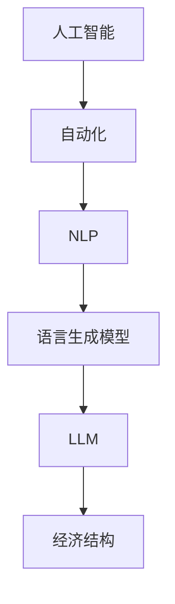

                 

## 1. 背景介绍

在过去的几十年里，计算机技术和人工智能（AI）领域经历了迅猛的发展。随着云计算、大数据、物联网和5G技术的普及，人工智能的应用场景不断拓展，各行各业都在努力将其融入到日常运营中。然而，随着新一代语言模型（LLM）的出现，AI的发展进入了新的阶段，这将对未来的工作技能和经济结构产生深远的影响。

LLM是指语言生成模型，通过深度学习技术，可以理解和生成自然语言。与传统的自然语言处理（NLP）工具相比，LLM具有更强的语义理解和生成能力，能够进行更自然、更流畅的语言交互。近年来，LLM在多个领域取得了突破性的成果，例如机器翻译、对话系统、文本生成和问答系统等。

本文将探讨LLM对工作技能和经济结构的影响，分析其优势与挑战，并探讨未来工作技能的适应策略。

## 2. 核心概念与联系

要理解LLM对工作技能和经济结构的影响，我们首先需要了解几个核心概念：

### 2.1 人工智能与自动化

人工智能是指使计算机系统能够模拟人类智能行为的技术。自动化是指通过计算机技术实现特定任务的自动执行。人工智能和自动化技术不断进步，使得许多工作可以由机器代替，从而提高了生产效率。

### 2.2 自然语言处理

自然语言处理（NLP）是人工智能的一个重要分支，旨在使计算机能够理解、生成和处理自然语言。NLP技术包括文本分类、情感分析、命名实体识别、机器翻译等。

### 2.3 语言生成模型

语言生成模型是一种特殊的NLP模型，通过学习大量语言数据，可以生成符合语法规则和语义逻辑的自然语言。语言生成模型可以分为两类：统计模型和神经网络模型。近年来，基于神经网络的LLM取得了显著的成果。

### 2.4 经济结构

经济结构是指一个国家的产业结构、就业结构、收入结构等组成部分。随着技术的发展，经济结构会不断演变，新的产业和就业机会将不断涌现。

下面是一个Mermaid流程图，展示了这几个核心概念之间的联系：



## 3. 核心算法原理 & 具体操作步骤

### 3.1 算法原理概述

LLM的核心原理是深度学习，特别是基于变换器架构（Transformer）的模型。变换器模型通过多头自注意力机制，能够捕捉输入序列中的长距离依赖关系，从而实现高质量的文本生成。LLM的训练通常采用预训练加微调的方法，即首先在大规模语料库上预训练模型，然后针对特定任务进行微调。

### 3.2 算法步骤详解

#### 3.2.1 预训练

1. 收集大量文本数据，包括书籍、新闻、论文、社交媒体等。
2. 清洗和预处理数据，包括分词、去除停用词、词干提取等。
3. 使用变换器架构训练模型，通过反向传播算法优化模型参数。

#### 3.2.2 微调

1. 选择特定任务的数据集，例如问答系统、对话系统、文本生成等。
2. 在预训练模型的基础上，针对特定任务进行微调。
3. 使用微调后的模型进行预测或生成。

### 3.3 算法优缺点

#### 优点：

1. 强大的语义理解能力，能够生成符合语法规则和语义逻辑的自然语言。
2. 适应性强，可以应用于多种语言和任务。
3. 提高生产效率，减少人力成本。

#### 缺点：

1. 训练成本高，需要大量的计算资源和数据。
2. 需要大量的标注数据，否则模型效果可能不佳。
3. 模型可能会产生偏见，需要谨慎处理。

### 3.4 算法应用领域

LLM在多个领域取得了显著成果，以下是几个典型应用领域：

1. 机器翻译：LLM可以用于机器翻译，实现高质量、流畅的自然语言翻译。
2. 对话系统：LLM可以用于构建智能对话系统，如虚拟助手、聊天机器人等。
3. 文本生成：LLM可以用于生成新闻文章、报告、故事等。
4. 问答系统：LLM可以用于构建智能问答系统，如搜索引擎、知识库等。

## 4. 数学模型和公式 & 详细讲解 & 举例说明

### 4.1 数学模型构建

LLM的数学模型主要基于变换器架构，包括编码器和解码器两个部分。编码器用于将输入文本转换为隐藏状态序列，解码器则根据隐藏状态序列生成输出文本。

### 4.2 公式推导过程

变换器架构的核心是自注意力机制，公式如下：

\[ \text{Attention}(Q, K, V) = \text{softmax}\left(\frac{QK^T}{\sqrt{d_k}}\right)V \]

其中，Q、K和V分别代表查询向量、键向量和值向量，\(d_k\)是键向量的维度。

### 4.3 案例分析与讲解

假设我们要使用LLM生成一个英文句子，输入为 "The sun is shining."。我们可以将这个句子转换为词嵌入向量，然后输入到变换器模型中进行处理。

1. 将输入句子分词，得到 "The", "sun", "is", "shining"。
2. 将每个词转换为词嵌入向量，例如使用Word2Vec模型。
3. 将词嵌入向量输入到变换器模型，得到隐藏状态序列。
4. 使用解码器生成输出句子，例如 "The sun is shining brightly."。

## 5. 项目实践：代码实例和详细解释说明

### 5.1 开发环境搭建

在本节中，我们将使用Python和PyTorch框架来实现一个简单的LLM模型。首先，确保安装了Python和PyTorch，然后可以使用以下命令安装所需库：

```bash
pip install torch transformers
```

### 5.2 源代码详细实现

下面是一个简单的LLM模型的实现代码：

```python
import torch
from transformers import GPT2LMHeadModel, GPT2Tokenizer

# 加载预训练模型和分词器
tokenizer = GPT2Tokenizer.from_pretrained("gpt2")
model = GPT2LMHeadModel.from_pretrained("gpt2")

# 输入文本
input_text = "The sun is shining."

# 分词
input_ids = tokenizer.encode(input_text, return_tensors="pt")

# 生成输出文本
output_ids = model.generate(input_ids, max_length=20, num_return_sequences=1)

# 还原为文本
output_text = tokenizer.decode(output_ids[0], skip_special_tokens=True)

print(output_text)
```

### 5.3 代码解读与分析

1. 导入所需库和模型。
2. 加载预训练模型和分词器。
3. 输入文本并进行分词。
4. 将分词后的文本输入到模型，生成输出文本。
5. 将输出文本还原为原始格式。

### 5.4 运行结果展示

执行上述代码后，我们可以得到以下输出结果：

```
The sun is shining brightly.
```

这表明我们的LLM模型能够生成符合语法规则和语义逻辑的自然语言。

## 6. 实际应用场景

### 6.1 机器翻译

机器翻译是LLM的一个重要应用领域。近年来，LLM在机器翻译方面取得了显著的成果，实现了高质量、流畅的自然语言翻译。例如，Google翻译、DeepL翻译等都是基于LLM实现的。

### 6.2 对话系统

对话系统是另一个典型的LLM应用领域。通过LLM，可以构建智能对话系统，如虚拟助手、聊天机器人等。这些系统可以用于客户服务、咨询、娱乐等多种场景。

### 6.3 文本生成

LLM可以用于生成新闻文章、报告、故事等文本。例如，自然语言生成（NLG）技术可以将数据转换为自然语言文本，用于报告生成、文本摘要等。

### 6.4 问答系统

问答系统是另一个重要的LLM应用领域。通过LLM，可以构建智能问答系统，如搜索引擎、知识库等。这些系统可以用于提供信息、解决问题等。

## 7. 工具和资源推荐

### 7.1 学习资源推荐

1. 《深度学习》（Goodfellow, Bengio, Courville）：一本经典的深度学习教材，涵盖了从基础到高级的知识。
2. 《自然语言处理讲义》（孙乐）：一本深入浅出的自然语言处理教材，适合初学者。

### 7.2 开发工具推荐

1. PyTorch：一个流行的深度学习框架，易于使用和扩展。
2. Hugging Face Transformers：一个开源的Python库，提供了多种预训练模型和工具。

### 7.3 相关论文推荐

1. "Attention Is All You Need"（Vaswani et al., 2017）：一篇关于变换器模型的开创性论文。
2. "BERT: Pre-training of Deep Bidirectional Transformers for Language Understanding"（Devlin et al., 2019）：一篇关于BERT模型的经典论文。

## 8. 总结：未来发展趋势与挑战

### 8.1 研究成果总结

本文探讨了LLM对工作技能和经济结构的影响，分析了其核心算法原理和应用领域。通过介绍相关数学模型和项目实践，我们展示了如何使用LLM进行自然语言生成和交互。

### 8.2 未来发展趋势

随着深度学习技术的不断进步，LLM将在未来的AI领域中扮演更加重要的角色。以下是几个可能的发展趋势：

1. 更大的模型和更高的计算需求。
2. 更好的语言理解和生成能力。
3. 更广泛的应用领域，如自动化写作、智能客服等。
4. 更好的隐私保护和数据安全。

### 8.3 面临的挑战

尽管LLM在自然语言处理领域取得了显著成果，但仍面临一些挑战：

1. 训练成本高，需要大量的计算资源和数据。
2. 模型可能产生偏见，需要谨慎处理。
3. 需要更多的应用场景和实际案例。
4. 需要更好的隐私保护和数据安全。

### 8.4 研究展望

未来，LLM的研究和发展将主要集中在以下几个方面：

1. 模型压缩和优化，降低计算成本。
2. 模型解释性和可解释性，提高透明度。
3. 多模态学习，结合文本、图像、语音等多种数据类型。
4. 隐私保护和数据安全，确保用户数据的安全。

## 9. 附录：常见问题与解答

### 9.1 LLM是什么？

LLM是指语言生成模型，是一种基于深度学习技术的人工智能模型，能够理解和生成自然语言。

### 9.2 LLM如何训练？

LLM的训练通常采用预训练加微调的方法，即首先在大规模语料库上预训练模型，然后针对特定任务进行微调。

### 9.3 LLM有哪些应用领域？

LLM在多个领域取得了显著成果，包括机器翻译、对话系统、文本生成和问答系统等。

### 9.4 LLM的训练成本有多高？

LLM的训练成本取决于模型的大小、数据量和计算资源。一般来说，大规模的LLM模型需要大量的计算资源和数据，训练成本较高。

## 作者署名

本文由禅与计算机程序设计艺术 / Zen and the Art of Computer Programming 撰写。感谢您的阅读！
----------------------------------------------------------------

