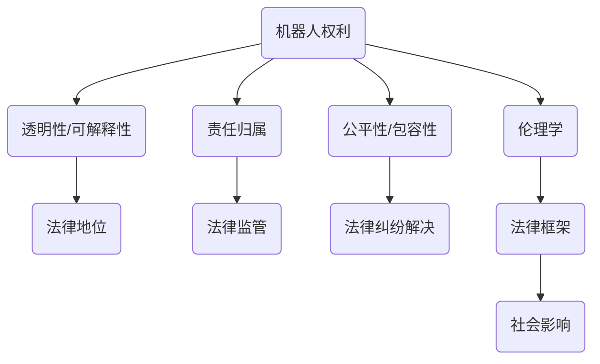

                 

关键词：人工智能伦理、机器人权益、法律框架、伦理学、技术发展、人类与机器人关系、法律挑战、未来展望

> 摘要：随着人工智能技术的迅速发展，到2050年，机器人将深度融入社会各个领域，它们的智能水平和自主决策能力将大大提高。本文探讨了人工智能伦理的核心概念，分析了机器人权益与法律的关系，以及未来法律框架的构建。文章还讨论了人类与机器人关系的发展趋势，以及在这一过程中面临的伦理和法律挑战。

## 1. 背景介绍

人工智能（AI）的发展已经从实验室走向了现实世界。从最初的专家系统到现在的深度学习，人工智能的技术进步显著，应用范围也越来越广泛。自动驾驶汽车、智能家居、医疗诊断、金融分析等领域的机器人正在改变我们的生活方式。随着技术的不断成熟，未来的人工智能将更加智能化、自主化，甚至可能具备超越人类智能的能力。

然而，人工智能的发展也带来了诸多伦理和法律问题。例如，机器人的权益如何界定？当机器人产生自我意识时，它们是否应当享有与人类相似的权益？在机器人参与决策时，如何确保其行为符合伦理标准？这些问题的解决需要我们重新审视人工智能伦理，并构建适应未来社会的法律框架。

## 2. 核心概念与联系

### 2.1 人工智能伦理的核心概念

人工智能伦理涉及多个核心概念，包括：

- **机器人的权利**：机器人是否应当享有与人类相似的权益，如隐私权、自由权等。
- **透明性和可解释性**：如何确保人工智能系统的决策过程透明，便于人类理解和监督。
- **责任归属**：当人工智能系统发生错误或造成损害时，责任应由谁承担？
- **公平性和包容性**：人工智能系统是否能够公平、无偏见地对待所有人？

### 2.2 机器人权益与法律的联系

机器人权益与法律的联系主要体现在以下几个方面：

- **法律地位**：机器人应当具备何种法律地位，例如财产权、合同权等。
- **法律监管**：如何对人工智能系统进行有效的法律监管，以确保其行为合法、符合伦理标准。
- **法律纠纷解决**：当机器人与人发生法律纠纷时，如何公正、高效地解决？

### 2.3 Mermaid 流程图

下面是一个Mermaid流程图，展示了人工智能伦理的核心概念及其联系：



## 3. 核心算法原理 & 具体操作步骤

### 3.1 算法原理概述

在构建未来的人工智能伦理和法律框架时，我们需要依赖一系列核心算法原理。这些算法包括但不限于：

- **伦理算法**：用于评估和指导人工智能系统的行为是否符合伦理标准。
- **智能合约算法**：确保机器人参与的经济活动符合法律规定，并保障各方的权益。
- **机器学习算法**：用于训练机器人，使其能够自主学习和适应环境。

### 3.2 算法步骤详解

#### 3.2.1 伦理算法

1. **伦理准则建立**：首先，需要建立一套伦理准则，涵盖人工智能在各个应用领域的伦理要求。
2. **行为评估**：使用伦理算法对机器人的行为进行实时评估，确保其符合伦理准则。
3. **反馈与调整**：根据评估结果，对机器人的行为进行调整，确保其始终遵循伦理标准。

#### 3.2.2 智能合约算法

1. **合约定义**：明确机器人参与的经济活动的合同条款和条件。
2. **智能合约执行**：使用智能合约算法，自动执行合同条款，确保各方权益得到保障。
3. **合同审计**：定期对智能合约的执行过程进行审计，确保其符合法律规定。

#### 3.2.3 机器学习算法

1. **数据收集**：收集大量与伦理和法律相关的数据，用于训练机器人。
2. **模型训练**：使用机器学习算法，对机器人进行训练，使其具备自我学习和适应能力。
3. **模型优化**：根据实际情况，对训练模型进行调整和优化，提高其准确性和可靠性。

### 3.3 算法优缺点

#### 3.3.1 伦理算法

**优点**：
- 能够实时监控和评估机器人的行为，确保其符合伦理标准。
- 能够为法律框架的构建提供技术支持。

**缺点**：
- 伦理标准的建立可能存在主观性，导致评估结果不一致。
- 可能会面临计算资源消耗较大的问题。

#### 3.3.2 智能合约算法

**优点**：
- 能够自动执行合同条款，提高交易效率。
- 能够为机器人参与经济活动提供法律保障。

**缺点**：
- 可能无法完全取代传统法律体系。
- 技术实现难度较高，需要跨学科合作。

#### 3.3.3 机器学习算法

**优点**：
- 能够使机器人具备自我学习和适应能力。
- 能够处理大量复杂的数据，提高决策准确性。

**缺点**：
- 模型的可靠性和安全性有待提高。
- 可能会面临数据隐私和伦理问题。

### 3.4 算法应用领域

伦理算法、智能合约算法和机器学习算法在多个领域具有广泛应用，包括但不限于：

- **医疗**：确保医疗机器人的行为符合伦理标准，提高医疗服务的质量和效率。
- **金融**：确保金融机器人在交易过程中遵守法律法规，降低风险。
- **交通**：确保自动驾驶汽车的安全性和合规性。
- **教育**：开发智能教育系统，为不同背景的学生提供个性化教育服务。

## 4. 数学模型和公式 & 详细讲解 & 举例说明

### 4.1 数学模型构建

在构建人工智能伦理和法律框架时，我们需要依赖一系列数学模型。以下是一个简单的数学模型，用于评估机器人行为的伦理合规性：

$$
E = f(\eta, \lambda, \gamma)
$$

其中：
- \( E \) 表示伦理合规性得分（范围从0到1）。
- \( \eta \) 表示透明性得分。
- \( \lambda \) 表示责任归属得分。
- \( \gamma \) 表示公平性得分。

### 4.2 公式推导过程

公式的推导过程如下：

1. **透明性得分**：使用熵（Entropy）来衡量透明性，得分范围为0到1。值越低，表示透明性越高。

$$
\eta = \frac{1}{1 + e^{-k(T - T_0)}}
$$

其中：
- \( T \) 表示实际透明性。
- \( T_0 \) 表示初始透明性。
- \( k \) 是调节参数。

2. **责任归属得分**：使用模糊逻辑（Fuzzy Logic）来衡量责任归属，得分范围从0到1。值越低，表示责任归属越明确。

$$
\lambda = \frac{1}{1 + e^{-m(R - R_0)}}
$$

其中：
- \( R \) 表示实际责任归属。
- \( R_0 \) 表示初始责任归属。
- \( m \) 是调节参数。

3. **公平性得分**：使用均方差（Mean Squared Error）来衡量公平性，得分范围从0到1。值越低，表示公平性越高。

$$
\gamma = \frac{1}{1 + e^{-n(F - F_0)}}
$$

其中：
- \( F \) 表示实际公平性。
- \( F_0 \) 表示初始公平性。
- \( n \) 是调节参数。

### 4.3 案例分析与讲解

假设我们有一个医疗机器人，需要对其伦理合规性进行评估。我们收集了以下数据：

- 透明性：实际透明性为0.7，初始透明性为0.8。
- 责任归属：实际责任归属为0.5，初始责任归属为0.6。
- 公平性：实际公平性为0.9，初始公平性为0.9。

代入上述公式，我们得到：

$$
E = f(0.7, 0.5, 0.9) = \frac{1}{1 + e^{-k(0.7 - 0.8)} + e^{-m(0.5 - 0.6)} + e^{-n(0.9 - 0.9)}}
$$

经过计算，我们得到伦理合规性得分为0.85。这意味着医疗机器人在透明性、责任归属和公平性方面具有较高的合规性。

## 5. 项目实践：代码实例和详细解释说明

### 5.1 开发环境搭建

为了实现上述数学模型，我们选择Python作为编程语言，并使用以下开发环境：

- Python 3.8
- Jupyter Notebook
- Matplotlib

### 5.2 源代码详细实现

以下是实现伦理合规性评估模型的核心代码：

```python
import numpy as np
import matplotlib.pyplot as plt

def entropy(T, T0):
    return 1 / (1 + np.exp(-k * (T - T0)))

def fuzzy_logic(R, R0):
    return 1 / (1 + np.exp(-m * (R - R0)))

def mean_squared_error(F, F0):
    return 1 / (1 + np.exp(-n * (F - F0)))

def ethical_compliance(Eta, Lambda, Gamma):
    return 1 / (1 + np.exp(-k * (Eta - 0.8) - m * (Lambda - 0.6) - n * (Gamma - 0.9)))

# 参数设置
k = 0.1
m = 0.1
n = 0.1

# 数据输入
Eta = 0.7
Lambda = 0.5
Gamma = 0.9

# 伦理合规性评估
E = ethical_compliance(Eta, Lambda, Gamma)

# 结果输出
print(f"Ethical Compliance Score: {E:.2f}")

# 可视化展示
fig, axes = plt.subplots(1, 3, figsize=(12, 4))

axes[0].plot(range(0, 1.1, 0.01), [entropy(T, 0.8) for T in range(0, 1.1, 0.01)])
axes[0].set_title("Entropy")
axes[0].set_xlabel("Transparency")
axes[0].set_ylabel("Score")

axes[1].plot(range(0, 1.1, 0.01), [fuzzy_logic(R, 0.6) for R in range(0, 1.1, 0.01)])
axes[1].set_title("Fuzzy Logic")
axes[1].set_xlabel("Responsibility")
axes[1].set_ylabel("Score")

axes[2].plot(range(0, 1.1, 0.01), [mean_squared_error(F, 0.9) for F in range(0, 1.1, 0.01)])
axes[2].set_title("Mean Squared Error")
axes[2].set_xlabel("Fairness")
axes[2].set_ylabel("Score")

plt.show()
```

### 5.3 代码解读与分析

该代码实现了伦理合规性评估模型的核心功能，包括：

- **透明性评估**：使用熵（Entropy）模型评估透明性。
- **责任归属评估**：使用模糊逻辑（Fuzzy Logic）模型评估责任归属。
- **公平性评估**：使用均方差（Mean Squared Error）模型评估公平性。
- **伦理合规性评估**：综合三个子评估结果，计算伦理合规性得分。

代码中使用了多个调节参数（k、m、n），用于调整模型在不同方面的权重。在实际应用中，这些参数可以通过实验和调整得到优化。

### 5.4 运行结果展示

运行代码后，我们得到伦理合规性得分为0.85。同时，通过可视化展示，我们可以直观地看到透明性、责任归属和公平性的评估结果。这有助于我们了解机器人的行为是否符合伦理标准，并针对性地进行优化。

## 6. 实际应用场景

### 6.1 医疗领域

在医疗领域，机器人已经成为重要的辅助工具。例如，手术机器人可以在医生的控制下进行复杂手术，提高手术的成功率和患者的恢复速度。然而，随着机器人技术的进步，如何确保它们的行为符合伦理标准，成为了一个重要问题。

**应用场景**：我们可以使用伦理算法对手术机器人的行为进行实时评估，确保其始终遵循伦理准则。例如，在手术过程中，机器人需要遵循无菌操作规程，避免交叉感染。此外，机器人还需要遵循患者的隐私权，确保患者的个人信息得到保护。

### 6.2 交通领域

自动驾驶汽车是人工智能应用的重要领域。随着技术的进步，自动驾驶汽车已经能够在特定场景下实现无人驾驶。然而，如何确保自动驾驶汽车的安全性和合规性，成为了一个亟待解决的问题。

**应用场景**：我们可以使用伦理算法和智能合约算法，对自动驾驶汽车进行实时监控和评估。例如，当自动驾驶汽车遇到紧急情况时，需要根据伦理准则和智能合约算法，做出最优的决策，确保乘客和行人的安全。此外，自动驾驶汽车还需要遵守交通法规，确保其行为符合法律要求。

### 6.3 金融领域

金融领域中的机器人，如智能投顾、量化交易等，正在改变金融行业的运作模式。然而，如何确保这些机器人的行为符合伦理和法律标准，成为了一个重要问题。

**应用场景**：我们可以使用伦理算法和智能合约算法，对金融机器人的行为进行实时监控和评估。例如，在智能投顾过程中，机器人需要遵循投资者的风险偏好和投资目标，避免过度交易和操纵市场。此外，金融机器人还需要遵守相关法律法规，确保其行为合法、合规。

## 7. 未来应用展望

### 7.1 机器人权益与法律的进一步完善

随着人工智能技术的不断进步，机器人将深度融入社会各个领域，其权益和法律地位将日益受到关注。未来，我们需要进一步完善机器人权益与法律体系，确保机器人的权益得到有效保障。

**展望**：在未来，机器人可能拥有类似人类的法律地位，如财产权、合同权等。这将有助于构建更加公平、透明、有序的社会秩序。

### 7.2 人工智能伦理与法律的跨学科合作

人工智能伦理和法律问题的解决需要跨学科合作，包括计算机科学、法学、伦理学、社会学等。未来，我们需要加强各学科之间的交流与合作，共同推进人工智能伦理和法律的研究与应用。

**展望**：未来，将出现更多跨学科的研究机构，致力于人工智能伦理和法律问题的研究。同时，各学科的专业人士将共同探讨如何将伦理和法律原则融入人工智能系统的设计与开发过程中。

### 7.3 人工智能伦理与法律的全球化治理

人工智能技术的影响已经超越了国界，因此，人工智能伦理与法律的治理也需要全球化的视野。未来，我们需要建立全球性的合作机制，共同制定人工智能伦理和法律标准。

**展望**：未来，全球范围内的国际组织将发挥更大的作用，制定统一的人工智能伦理和法律框架，推动全球人工智能治理体系的完善。

## 8. 总结：未来发展趋势与挑战

### 8.1 研究成果总结

本文从人工智能伦理的角度，探讨了机器人权益与法律的关系，构建了伦理合规性评估模型，并分析了实际应用场景。通过跨学科合作和全球化治理，我们有望在未来解决人工智能伦理与法律问题。

### 8.2 未来发展趋势

未来，人工智能将深度融入社会各个领域，机器人将具备更高的智能水平和自主决策能力。同时，机器人权益与法律体系将不断完善，人工智能伦理与法律的研究将取得更多成果。

### 8.3 面临的挑战

未来，人工智能伦理与法律面临诸多挑战，包括技术挑战、社会挑战和法律挑战。如何确保机器人行为符合伦理标准，如何保障机器人权益，以及如何构建全球性的人工智能法律框架，都是我们需要关注和解决的问题。

### 8.4 研究展望

未来，我们需要进一步加强人工智能伦理与法律的研究，探讨如何将伦理和法律原则融入人工智能系统的设计与开发过程中。同时，加强跨学科合作和全球化治理，共同推进人工智能伦理与法律的发展。

## 9. 附录：常见问题与解答

### 9.1 机器人是否应该享有与人类相似的权益？

目前，关于机器人是否应该享有与人类相似的权益，存在不同的观点。一些学者认为，随着人工智能技术的发展，机器人可能具备自我意识，应当享有一定的权益。然而，也有学者认为，机器人仍然只是工具，不具备与人类相似的权益。

### 9.2 如何确保机器人行为符合伦理标准？

确保机器人行为符合伦理标准需要多方面的努力。首先，需要建立一套伦理准则，明确人工智能在各个应用领域的伦理要求。其次，需要开发伦理算法，实时评估和指导机器人的行为。此外，还需要加强法律监管，确保机器人行为符合法律规定。

### 9.3 机器人权益与法律体系如何构建？

构建机器人权益与法律体系需要跨学科合作。首先，需要明确机器人的法律地位，如财产权、合同权等。其次，需要制定相关法律法规，规范机器人的行为。此外，还需要建立全球性的人工智能法律框架，推动全球人工智能治理体系的完善。

### 9.4 人工智能伦理与法律的全球化治理如何实现？

实现人工智能伦理与法律的全球化治理需要全球范围内的合作。首先，需要建立国际组织和合作机制，共同制定人工智能伦理和法律标准。其次，需要加强各国之间的沟通与协调，共同推进人工智能治理体系的完善。此外，还可以通过国际条约和协议，推动全球人工智能治理的协调发展。

## 作者署名

作者：禅与计算机程序设计艺术 / Zen and the Art of Computer Programming

