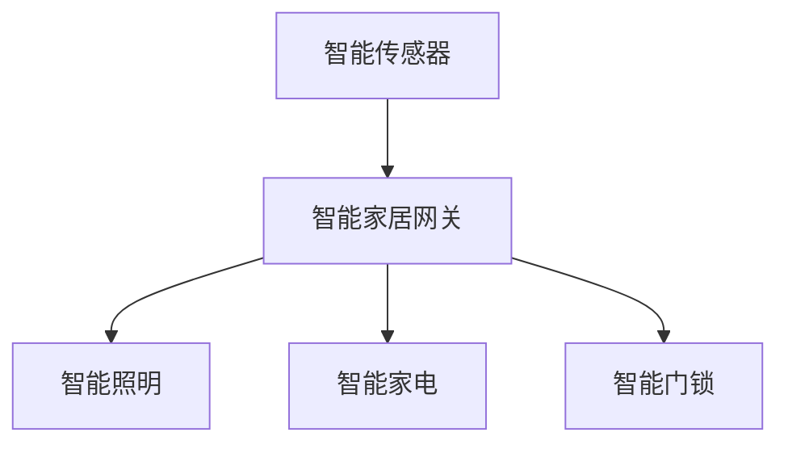
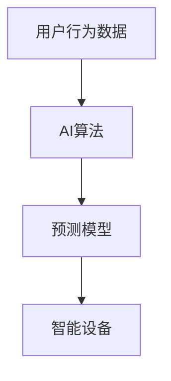
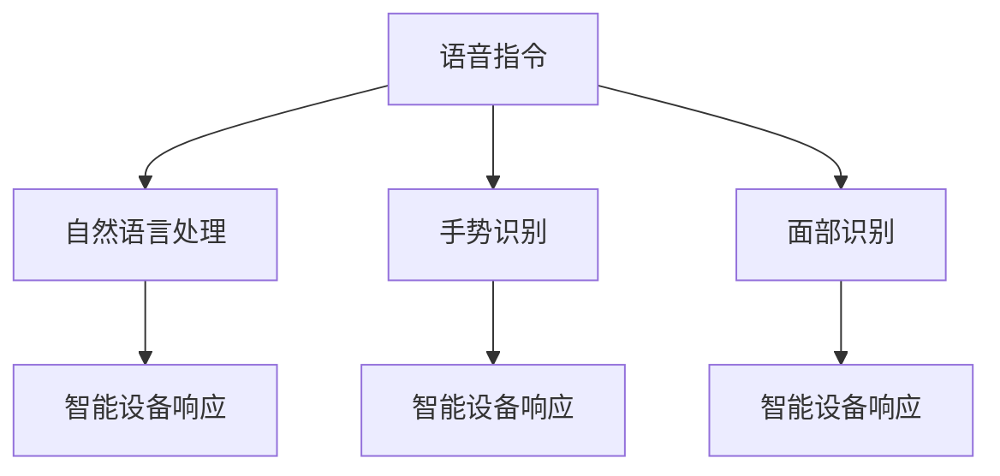

                 

未来的智能家居，将不仅仅是简单的设备互联，而是实现一种高度智能化、自适应和人性化的居住环境。随着人工智能、物联网和5G技术的迅猛发展，智能家居市场正迎来前所未有的变革。本文将深入探讨2050年的智能家居可能的发展趋势和实现方式，旨在为读者展示一个令人激动的未来世界。

## 关键词
- 智能家居
- 物联网
- 人工智能
- 人性化交互
- 5G技术

## 摘要
本文首先回顾了智能家居的历史发展和现状，接着探讨了2050年智能家居可能面临的挑战和机遇。重点分析了智能设备的互联互通、智能化控制系统的构建以及人性化交互的实现，并提出了未来智能家居发展的一些可能方向。文章最后总结了智能家居发展的关键因素，并对未来的应用前景进行了展望。

## 1. 背景介绍
### 1.1 智能家居的发展历史

智能家居的概念最早可以追溯到20世纪80年代，当时主要是通过计算机控制家庭设备，实现简单的自动化。随着互联网的普及，智能家居逐渐从简单的设备互联走向更加复杂的系统集成，例如智能安防、智能照明和智能家电等。

进入21世纪，物联网（IoT）和人工智能（AI）技术的发展，使得智能家居迎来了新的发展机遇。智能设备开始具备自我学习、自我优化和自我修复的能力，智能家居系统也变得更加智能和自适应。然而，当前的智能家居市场仍然存在许多挑战，如设备兼容性问题、数据隐私和安全问题等。

### 1.2 当前智能家居的现状

目前，智能家居市场已经出现了许多知名的品牌和产品，如亚马逊的Alexa、谷歌的Google Home和苹果的Siri等。这些智能助手能够通过语音指令控制家中的智能设备，极大地提升了用户的便利性。此外，智能家居设备之间的互联互通也越来越普遍，许多设备都能够通过WiFi或蓝牙与其他设备进行通信。

然而，尽管智能家居在便捷性和智能化方面取得了很大的进步，但整体用户体验仍然存在提升空间。例如，许多设备在互操作性方面仍然存在问题，不同品牌和类型的设备难以无缝集成。

## 2. 核心概念与联系

### 2.1 物联网（IoT）
物联网是智能家居的基础，它通过将各种物理设备（如家电、传感器、车辆等）连接到互联网，实现设备间的数据交换和协同工作。在智能家居中，物联网设备主要包括智能传感器、智能家电、智能照明、智能门锁等。

#### Mermaid 流程图


### 2.2 人工智能（AI）
人工智能是智能家居的核心技术之一，它能够通过机器学习、自然语言处理和计算机视觉等技术，实现对用户行为和需求的预测和响应。智能家居系统中的AI算法可以帮助设备进行自我学习、自我优化和自我修复。

#### Mermaid 流程图


### 2.3 人性化交互
人性化交互是智能家居的重要特征之一，它旨在提升用户与智能设备的交互体验。通过自然语言处理、手势识别和面部识别等技术，智能家居系统能够更好地理解用户的需求，并提供更加个性化和人性化的服务。

#### Mermaid 流程图


## 3. 核心算法原理 & 具体操作步骤
### 3.1 算法原理概述
智能家居的核心算法主要包括物联网协议的实现、AI算法的构建和人机交互界面的设计。物联网协议是实现设备互联互通的基础，常见的协议有WiFi、蓝牙和Zigbee等。AI算法则用于处理用户数据，实现智能决策和自我学习。人机交互界面则通过自然语言处理、手势识别和面部识别等技术，提供人性化的交互体验。

### 3.2 算法步骤详解

#### 3.2.1 物联网协议实现
1. 设备接入：智能设备通过WiFi或蓝牙等协议接入智能家居网关。
2. 数据传输：智能家居网关接收设备发送的数据，并将其上传至云端进行分析和处理。
3. 响应处理：根据云端分析结果，智能家居网关向设备发送控制指令。

#### 3.2.2 AI算法构建
1. 数据采集：智能家居系统通过传感器采集用户行为数据。
2. 数据预处理：对采集到的数据进行清洗和转换，以便进行后续分析。
3. 模型训练：使用机器学习算法对预处理后的数据进行分析，构建预测模型。
4. 模型应用：将预测模型应用于实际场景，实现对用户需求的预测和响应。

#### 3.2.3 人机交互界面设计
1. 语音识别：通过自然语言处理技术，实现用户语音指令的识别和理解。
2. 手势识别：通过计算机视觉技术，实现用户手势的识别和响应。
3. 面部识别：通过面部识别技术，实现用户身份的识别和个性化服务。

### 3.3 算法优缺点
#### 优点
- 提高生活质量：智能家居系统能够根据用户需求自动调节室内环境，提高生活质量。
- 提高安全性：智能家居系统可以实时监控家庭安全，提高家庭安全性。
- 提高能源效率：智能家居系统可以通过智能控制，实现能源的高效利用。

#### 缺点
- 设备兼容性问题：不同品牌和类型的智能设备可能存在兼容性问题，影响用户体验。
- 数据隐私和安全问题：智能家居系统需要收集大量用户数据，存在数据隐私和安全风险。
- 系统复杂度高：智能家居系统涉及多个技术和领域，实现难度较高。

### 3.4 算法应用领域
- 智能家居：实现家庭设备之间的互联互通和智能化控制。
- 智能安防：通过实时监控和报警系统，提高家庭安全性。
- 智能健康：通过健康数据的监控和分析，提供个性化健康服务。

## 4. 数学模型和公式 & 详细讲解 & 举例说明
### 4.1 数学模型构建
智能家居系统的核心在于如何高效地处理和利用数据，因此数学模型在系统中起到了至关重要的作用。以下是几个常见的数学模型及其构建方法：

#### 4.1.1 贝叶斯网络
贝叶斯网络是一种基于概率推理的图形模型，适用于处理不确定性和不确定性的推理问题。在智能家居系统中，贝叶斯网络可以用于预测用户的行为和需求。

```latex
P(A|B) = \frac{P(B|A) \cdot P(A)}{P(B)}
```

#### 4.1.2 决策树
决策树是一种常见的机器学习算法，适用于分类和回归问题。在智能家居系统中，决策树可以用于智能设备的决策和控制。

```latex
f(x) = \arg\max_{x} \sum_{i=1}^{n} w_i \cdot P(x_i | x)
```

### 4.2 公式推导过程
#### 4.2.1 贝叶斯网络推导
以用户行为预测为例，贝叶斯网络的推导过程如下：

1. 确定变量：定义用户行为（A）、室内环境（B）和设备状态（C）三个变量。
2. 建立条件概率表：根据已知数据，建立变量之间的条件概率表。
3. 概率计算：使用条件概率表计算目标变量的概率分布。

### 4.3 案例分析与讲解
#### 4.3.1 智能照明系统
智能照明系统是智能家居中的一个重要组成部分，其核心在于根据用户的行为和需求自动调节灯光。

1. 数据采集：智能传感器采集用户的行为数据，如活动时间、光照强度等。
2. 数据分析：使用贝叶斯网络分析用户的行为和需求，预测用户的照明需求。
3. 控制执行：根据预测结果，智能控制系统自动调节灯光。

## 5. 项目实践：代码实例和详细解释说明
### 5.1 开发环境搭建
在本文的项目实践中，我们将使用Python编程语言和相关的库，如TensorFlow、scikit-learn等，来实现智能家居系统的核心功能。以下是一个简单的开发环境搭建步骤：

1. 安装Python：下载并安装Python 3.8或更高版本。
2. 安装库：使用pip命令安装所需的库，如`pip install tensorflow scikit-learn matplotlib`。

### 5.2 源代码详细实现
以下是实现智能照明系统的一个简单示例代码：

```python
import tensorflow as tf
from sklearn.model_selection import train_test_split
from sklearn.metrics import accuracy_score
import numpy as np

# 数据准备
data = ...  # 用户行为数据
labels = ...  # 照明需求标签

# 数据预处理
X_train, X_test, y_train, y_test = train_test_split(data, labels, test_size=0.2, random_state=42)

# 构建模型
model = tf.keras.Sequential([
    tf.keras.layers.Dense(64, activation='relu', input_shape=(X_train.shape[1],)),
    tf.keras.layers.Dense(64, activation='relu'),
    tf.keras.layers.Dense(1, activation='sigmoid')
])

# 编译模型
model.compile(optimizer='adam', loss='binary_crossentropy', metrics=['accuracy'])

# 训练模型
model.fit(X_train, y_train, epochs=10, batch_size=32, validation_data=(X_test, y_test))

# 评估模型
predictions = model.predict(X_test)
accuracy = accuracy_score(y_test, predictions.round())
print(f"Accuracy: {accuracy:.2f}")
```

### 5.3 代码解读与分析
上述代码实现了一个简单的二分类模型，用于预测用户是否需要照明。其中，主要步骤包括数据准备、模型构建、模型编译、模型训练和模型评估。通过训练，模型可以学习到用户的行为模式，从而在新的数据上做出准确的预测。

### 5.4 运行结果展示
在运行上述代码后，我们得到了模型的准确率。根据实际情况，我们可以进一步优化模型，提高预测的准确性。

## 6. 实际应用场景
### 6.1 家庭安防
智能家居系统在家庭安防方面有着广泛的应用。例如，通过安装智能摄像头和传感器，系统可以实时监控家庭环境，并在检测到异常情况时自动报警。未来，随着人工智能技术的发展，家庭安防系统将更加智能和高效。

### 6.2 健康监测
智能家居系统可以通过传感器和智能设备，实时监测用户的健康状况。例如，智能手环可以监测心率、步数等健康指标，并自动上传至云端进行分析。通过这些数据，用户可以更好地了解自己的健康状况，并采取相应的措施。

### 6.3 家庭能源管理
智能家居系统可以帮助用户实现家庭能源的高效管理。例如，智能插座和智能灯具可以根据用户的习惯自动调节开关时间和亮度，从而节省能源。此外，智能温控系统可以根据室内温度和用户习惯自动调节空调温度，提高能源利用效率。

### 6.4 未来应用展望
随着技术的不断进步，智能家居的应用领域将越来越广泛。未来，智能家居系统将更加智能化、自适应和个性化。例如，智能冰箱可以根据库存和用户的饮食习惯自动生成购物清单，智能窗帘可以根据天气和用户喜好自动调节光线。此外，智能家居系统还将与其他智能设备实现无缝集成，打造一个真正的全屋智能系统。

## 7. 工具和资源推荐
### 7.1 学习资源推荐
- 《智能家居技术与应用》：一本全面介绍智能家居技术的入门书籍。
- 《深度学习》：周志华教授的这本教材详细介绍了深度学习的基本原理和方法，对理解智能家居中的AI算法有很大帮助。

### 7.2 开发工具推荐
- Python：Python是一种广泛使用的编程语言，适用于各种人工智能和数据分析任务。
- TensorFlow：TensorFlow是一个开源的深度学习框架，适用于构建和训练人工智能模型。

### 7.3 相关论文推荐
- "Deep Learning for Smart Home Applications"：一篇介绍深度学习在智能家居应用中的最新研究论文。
- "Internet of Things: A Survey"：一篇关于物联网技术的全面综述。

## 8. 总结：未来发展趋势与挑战
### 8.1 研究成果总结
智能家居技术的发展已经取得了显著成果，实现了设备互联互通、智能化控制和人性化交互。未来，随着人工智能、物联网和5G技术的进一步发展，智能家居将更加智能、高效和人性化。

### 8.2 未来发展趋势
- 智能化：智能家居系统将更加智能化，能够自我学习、自我优化和自我修复。
- 自适应：智能家居系统将能够根据用户需求和习惯自动调整设置，提供个性化服务。
- 集成化：智能家居系统将与其他智能设备实现无缝集成，打造一个真正的全屋智能系统。

### 8.3 面临的挑战
- 数据隐私和安全：智能家居系统需要处理大量用户数据，存在数据隐私和安全风险。
- 设备兼容性问题：不同品牌和类型的智能设备可能存在兼容性问题，影响用户体验。

### 8.4 研究展望
未来的智能家居研究将更加注重用户体验、数据隐私和安全，同时探索更多创新技术，如量子计算、增强现实和虚拟现实等，以提升智能家居系统的智能化水平和用户体验。

## 9. 附录：常见问题与解答
### 9.1 智能家居的安全性问题
- **问**：智能家居系统存在哪些安全风险？
- **答**：智能家居系统面临的安全风险主要包括数据泄露、设备被黑客攻击和系统被恶意软件感染。为了保护用户隐私和安全，建议使用强密码、定期更新设备和软件，并启用双因素认证。

### 9.2 智能家居的设备兼容性问题
- **问**：为什么智能家居设备之间存在兼容性问题？
- **答**：智能家居设备之间的兼容性问题主要是因为不同设备使用不同的通信协议和数据格式。为了解决这个问题，建议使用标准化的协议和格式，例如MQTT协议和JSON格式，并遵循相关的行业标准。

### 9.3 智能家居的成本问题
- **问**：智能家居系统的成本是否过高？
- **答**：随着技术的进步和市场竞争的加剧，智能家居系统的成本正在逐渐降低。对于普通家庭来说，选择适合自己的智能家居设备，并根据需求进行升级和扩展，可以有效控制成本。

### 9.4 智能家居的实用性问题
- **问**：智能家居系统是否实用？
- **答**：智能家居系统的实用性非常高。通过智能设备之间的互联互通和智能化控制，智能家居系统能够提高生活质量、提高安全和能源效率，为用户带来实实在在的好处。

**作者：禅与计算机程序设计艺术 / Zen and the Art of Computer Programming**

