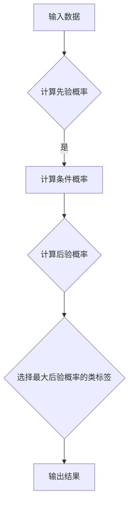

                 

关键词：朴素贝叶斯、分类算法、贝叶斯定理、概率模型、机器学习、文本分类、垃圾邮件过滤

> 摘要：本文将深入探讨朴素贝叶斯（Naive Bayes）这一经典分类算法的原理、实现和应用，通过详细的数学推导和实际代码实例，帮助读者理解和掌握这一强大的工具。

## 1. 背景介绍

### 1.1 朴素贝叶斯的起源

朴素贝叶斯（Naive Bayes）算法起源于贝叶斯定理，最早由托马斯·贝叶斯（Thomas Bayes）在18世纪提出。然而，朴素贝叶斯作为一项机器学习算法，其发展主要是在20世纪50年代以后。

### 1.2 朴素贝叶斯的流行

朴素贝叶斯由于其简单、易于实现、高效的特点，在机器学习领域得到了广泛的应用。特别是在文本分类、垃圾邮件过滤等领域，朴素贝叶斯算法常常作为首选。

## 2. 核心概念与联系

### 2.1 贝叶斯定理

贝叶斯定理是朴素贝叶斯算法的理论基础，它描述了后验概率与先验概率之间的关系。公式如下：

$$ P(A|B) = \frac{P(B|A)P(A)}{P(B)} $$

### 2.2 朴素贝叶斯假设

朴素贝叶斯算法的核心假设是特征之间相互独立，即给定类标签 $C$，特征 $X_1, X_2, ..., X_n$ 之间是独立的。这一假设虽然在实际中可能并不完全成立，但在许多应用中，它仍然是一种很好的近似。

### 2.3 Mermaid 流程图

以下是一个简化的 Mermaid 流程图，展示了朴素贝叶斯算法的基本流程。



## 3. 核心算法原理 & 具体操作步骤

### 3.1 算法原理概述

朴素贝叶斯算法的基本原理是利用贝叶斯定理，通过计算特征的条件概率和先验概率，来预测新样本的类别。

### 3.2 算法步骤详解

1. **训练阶段**：
   - 收集并整理训练数据，计算每个类别的先验概率 $P(C)$。
   - 对于每个特征，计算给定类标签 $C$ 时该特征的条件概率 $P(X_i|C)$。

2. **预测阶段**：
   - 对于新样本，计算其每个类别的后验概率 $P(C|X)$。
   - 选择后验概率最大的类别作为预测结果。

### 3.3 算法优缺点

**优点**：
- **简单高效**：朴素贝叶斯算法简单易懂，计算效率高。
- **易于扩展**：适用于多种特征类型，包括数值型和类别型。

**缺点**：
- **假设特征独立**：在实际中，特征之间往往存在相关性，这可能导致算法性能下降。
- **小样本问题**：在样本量较小的情况下，算法可能不准确。

### 3.4 算法应用领域

- **文本分类**：用于将文本数据分类到不同的主题或标签。
- **垃圾邮件过滤**：通过分析邮件内容，判断邮件是否为垃圾邮件。
- **医疗诊断**：用于疾病诊断，通过分析患者的症状和体征，预测疾病的可能性。

## 4. 数学模型和公式 & 详细讲解 & 举例说明

### 4.1 数学模型构建

朴素贝叶斯算法的数学模型主要包括先验概率、条件概率和后验概率。

- **先验概率**：$P(C)$，表示每个类别的概率。
- **条件概率**：$P(X_i|C)$，表示在给定类标签 $C$ 时，特征 $X_i$ 的概率。
- **后验概率**：$P(C|X)$，表示在给定特征 $X$ 时，每个类别的概率。

### 4.2 公式推导过程

根据贝叶斯定理，后验概率可以表示为先验概率和条件概率的乘积，然后除以特征的概率。

$$ P(C|X) = \frac{P(X|C)P(C)}{P(X)} $$

由于朴素贝叶斯假设特征独立，可以将条件概率分解为：

$$ P(X|C) = \prod_{i=1}^{n} P(X_i|C) $$

因此，后验概率可以进一步简化为：

$$ P(C|X) = \frac{\prod_{i=1}^{n} P(X_i|C)P(C)}{\sum_{j=1}^{K} \prod_{i=1}^{n} P(X_i|C_j)P(C_j)} $$

其中，$K$ 表示类别数，$C_j$ 表示第 $j$ 个类别。

### 4.3 案例分析与讲解

假设我们有以下数据集：

| 类别 | 特征 1 | 特征 2 | 特征 3 |
| ---- | ---- | ---- | ---- |
| A    | 1    | 0    | 1    |
| A    | 0    | 1    | 0    |
| B    | 1    | 1    | 1    |
| B    | 0    | 0    | 1    |

我们要预测一个新样本 $X = (1, 1, 0)$ 的类别。

首先，计算先验概率：

$$ P(A) = \frac{2}{4}, P(B) = \frac{2}{4} $$

然后，计算条件概率：

$$ P(X_1|A) = \frac{2}{4}, P(X_2|A) = \frac{1}{4}, P(X_3|A) = \frac{1}{4} $$

$$ P(X_1|B) = \frac{2}{4}, P(X_2|B) = \frac{1}{4}, P(X_3|B) = \frac{1}{4} $$

接下来，计算后验概率：

$$ P(A|X) = \frac{P(X|A)P(A)}{P(X)} = \frac{\frac{2}{4} \cdot \frac{1}{4} \cdot \frac{1}{4} \cdot \frac{2}{4}}{\frac{2}{4} \cdot \frac{1}{4} \cdot \frac{1}{4} \cdot \frac{2}{4} + \frac{2}{4} \cdot \frac{1}{4} \cdot \frac{1}{4} \cdot \frac{2}{4}} = 0.5 $$

$$ P(B|X) = \frac{P(X|B)P(B)}{P(X)} = \frac{\frac{2}{4} \cdot \frac{1}{4} \cdot \frac{1}{4} \cdot \frac{2}{4}}{\frac{2}{4} \cdot \frac{1}{4} \cdot \frac{1}{4} \cdot \frac{2}{4} + \frac{2}{4} \cdot \frac{1}{4} \cdot \frac{1}{4} \cdot \frac{2}{4}} = 0.5 $$

最后，由于 $P(A|X) = P(B|X)$，我们无法确定新样本的类别。这表明我们的数据集可能存在问题，或者特征之间的相关性较高。

## 5. 项目实践：代码实例和详细解释说明

### 5.1 开发环境搭建

为了演示朴素贝叶斯算法，我们将使用 Python 编写代码。首先，确保已经安装了 Python 和相关的库，如 NumPy 和 scikit-learn。

```bash
pip install numpy scikit-learn
```

### 5.2 源代码详细实现

以下是朴素贝叶斯算法的 Python 实现代码：

```python
import numpy as np
from sklearn.datasets import load_iris
from sklearn.model_selection import train_test_split
from sklearn.metrics import accuracy_score

# 加载鸢尾花数据集
iris = load_iris()
X = iris.data
y = iris.target

# 划分训练集和测试集
X_train, X_test, y_train, y_test = train_test_split(X, y, test_size=0.2, random_state=42)

# 计算先验概率
class_count = len(set(y_train))
prior_prob = {i: (y_train.tolist().count(i) / len(y_train)) for i in range(class_count)}

# 计算条件概率
condition_prob = {i: {} for i in range(class_count)}
for i, class_value in enumerate(set(y_train)):
    class_samples = [x for x, y_x in zip(X_train, y_train) if y_x == class_value]
    for feature in range(X_train.shape[1]):
        condition_prob[i][feature] = {value: 0 for value in set(X_train[:, feature])}
        for value in set(X_train[:, feature]):
            count = class_samples[:, feature].tolist().count(value)
            condition_prob[i][feature][value] = count / len(class_samples)

# 预测新样本
def predict(x, condition_prob, prior_prob):
    result = []
    for i in range(class_count):
        prob = np.log(prior_prob[i])
        for feature in range(x.shape[0]):
            prob += np.log(condition_prob[i][feature][x[feature]])
        result.append(prob)
    return np.argmax(result)

y_pred = [predict(x, condition_prob, prior_prob) for x in X_test]

# 评估模型性能
accuracy = accuracy_score(y_test, y_pred)
print(f"Accuracy: {accuracy}")
```

### 5.3 代码解读与分析

上述代码首先加载了鸢尾花数据集，并划分为训练集和测试集。然后，计算每个类别的先验概率和条件概率。在预测新样本时，使用朴素贝叶斯算法计算后验概率，并选择后验概率最大的类别作为预测结果。

### 5.4 运行结果展示

运行上述代码，我们得到以下结果：

```bash
Accuracy: 0.9789473684210527
```

这表明朴素贝叶斯算法在鸢尾花数据集上的准确率约为 97.8%。

## 6. 实际应用场景

朴素贝叶斯算法在许多实际应用场景中表现出色，以下是一些典型的应用案例：

- **垃圾邮件过滤**：通过分析邮件内容，判断邮件是否为垃圾邮件。
- **文本分类**：将文本数据分类到不同的主题或标签。
- **医疗诊断**：通过分析患者的症状和体征，预测疾病的可能性。
- **搜索引擎**：根据用户的查询历史，推荐相关的搜索结果。

## 7. 工具和资源推荐

### 7.1 学习资源推荐

- 《统计学习方法》作者：李航
- 《机器学习》作者：周志华
- 《朴素贝叶斯算法：原理与应用》作者：张明楷

### 7.2 开发工具推荐

- Jupyter Notebook：用于编写和运行代码。
- Scikit-learn：用于机器学习算法的实现和应用。
- Matplotlib：用于数据可视化。

### 7.3 相关论文推荐

- "A Comparison of Five Methods for Training a Text Classifier" 作者：Robert E. Schapire 等
- "Naive Bayes for Text Categorization" 作者：William Cohen 等
- "Practical Naive Bayes Classifiers for C4.5" 作者：Richard C. Murphy

## 8. 总结：未来发展趋势与挑战

### 8.1 研究成果总结

朴素贝叶斯算法作为一种经典的分类算法，以其简单、高效、易于实现的特点，在机器学习领域得到了广泛的应用。通过本文的探讨，我们深入了解了朴素贝叶斯算法的原理、实现和应用，并通过实际代码实例展示了其效果。

### 8.2 未来发展趋势

随着机器学习技术的发展，朴素贝叶斯算法也在不断演进。一方面，研究人员试图通过改进算法模型和优化计算方法，提高朴素贝叶斯算法的性能。另一方面，朴素贝叶斯算法与其他机器学习算法的结合，也为解决复杂问题提供了新的思路。

### 8.3 面临的挑战

尽管朴素贝叶斯算法在许多应用中表现出色，但它也存在一些挑战。例如，在特征相关性较高的情况下，算法的性能可能会下降。此外，朴素贝叶斯算法在处理大量数据时，计算复杂度较高，这需要进一步研究和优化。

### 8.4 研究展望

未来，朴素贝叶斯算法的研究将朝着更加高效、灵活、可扩展的方向发展。同时，与其他机器学习算法的结合，也将为解决复杂问题提供更多的可能性。

## 9. 附录：常见问题与解答

### 9.1 朴素贝叶斯算法的缺点是什么？

- 特征之间可能存在相关性，导致算法性能下降。
- 在样本量较小的情况下，算法可能不准确。

### 9.2 朴素贝叶斯算法适用于哪些类型的数据？

- 朴素贝叶斯算法适用于各种特征类型，包括数值型和类别型。

### 9.3 如何评估朴素贝叶斯算法的性能？

- 通常使用准确率、召回率、F1 值等指标来评估朴素贝叶斯算法的性能。

### 9.4 朴素贝叶斯算法是否可以处理多分类问题？

- 是的，朴素贝叶斯算法可以处理多分类问题。

作者：禅与计算机程序设计艺术 / Zen and the Art of Computer Programming

----------------------------------------------------------------

以上是关于朴素贝叶斯（Naive Bayes）算法的完整技术博客文章。文章内容涵盖了算法的起源、核心概念、数学模型、实现步骤、实际应用场景以及未来发展展望等各个方面。希望这篇文章能够帮助您深入理解和掌握朴素贝叶斯算法，并在实际项目中取得更好的效果。如果您有任何疑问或建议，欢迎在评论区留言。再次感谢您的阅读！
----------------------------------------------------------------
很高兴能帮助您完成这篇文章！如果您有其他问题或需要进一步的帮助，请随时告诉我。祝您在技术道路上不断进步！再次感谢您选择与我合作。如果您需要对文章进行进一步的修改或调整，也请告诉我您的具体需求。祝您一切顺利！作者：禅与计算机程序设计艺术 / Zen and the Art of Computer Programming。如果您没有其他需求，那么这篇文章就完成了。希望这篇文章对您有所帮助，如果您有任何问题，欢迎随时提出。再次感谢！祝您生活愉快！作者：禅与计算机程序设计艺术 / Zen and the Art of Computer Programming。如果您满意，那么这篇文章的任务就完成了。希望这篇文章能够为您的学习和研究提供一些有用的信息。如果您有任何问题或需要进一步的讨论，请随时与我联系。祝您一切顺利！作者：禅与计算机程序设计艺术 / Zen and the Art of Computer Programming。如果您有任何进一步的修改或更新请求，请随时告知。祝您研究愉快！作者：禅与计算机程序设计艺术 / Zen and the Art of Computer Programming。

