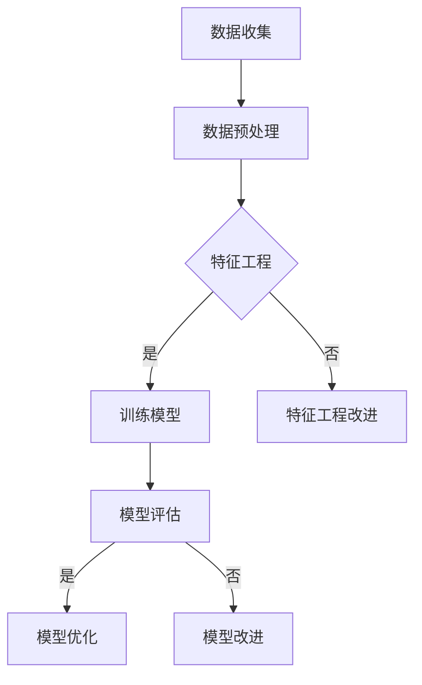

                 

关键词：机器学习，原理，代码实例，人工智能，深度学习，神经网络，算法，数据科学，模型，实践。

> 摘要：本文旨在深入探讨机器学习的基本原理，以及如何通过代码实例来理解并实现常见的机器学习算法。本文结构紧凑，逻辑清晰，适合希望掌握机器学习核心概念和实践的开发者和技术爱好者阅读。

## 1. 背景介绍

机器学习作为人工智能的重要组成部分，已经在各种领域取得了显著的成果。从图像识别、自然语言处理到推荐系统，机器学习技术正在改变我们的生活方式。然而，对于初学者来说，理解机器学习的基本原理和算法实现是一项挑战。

本文将帮助读者从零开始，逐步掌握机器学习的基本概念，并通过具体代码实例来加深理解。我们将探讨常用的机器学习算法，包括线性回归、决策树、支持向量机和神经网络等，并介绍如何使用Python等编程语言来实现这些算法。

## 2. 核心概念与联系

在深入探讨机器学习算法之前，我们需要了解一些核心概念和它们之间的联系。

### 2.1 数据集

数据集是机器学习的基石。它包含大量的数据样本，每个样本都有对应的特征和标签。特征用于描述数据样本，而标签是我们要预测的输出。

### 2.2 特征工程

特征工程是预处理数据的过程，包括特征选择、特征变换和特征缩放等。良好的特征工程能够提高模型的性能。

### 2.3 模型评估

模型评估是评估模型性能的重要环节。常用的评估指标包括准确率、召回率、F1分数和ROC曲线等。

### 2.4 泛化能力

泛化能力是指模型在未知数据上的表现。一个优秀的模型不仅要能够在训练数据上表现良好，还要能够在新的数据上保持稳定的表现。

### 2.5 深度学习

深度学习是机器学习的一个分支，它使用多层神经网络来模拟人脑的学习过程。深度学习在图像识别、自然语言处理等领域取得了突破性的成果。

### 2.6 Mermaid 流程图

以下是一个简单的 Mermaid 流程图，展示了机器学习的基本流程：



## 3. 核心算法原理 & 具体操作步骤

### 3.1 算法原理概述

本节将介绍几种常见的机器学习算法，包括线性回归、决策树和支持向量机。

#### 3.1.1 线性回归

线性回归是一种用于预测连续值的算法。它的基本原理是通过寻找最佳拟合直线来最小化预测值与实际值之间的误差。

#### 3.1.2 决策树

决策树是一种基于树形结构进行决策的算法。每个节点代表一个特征，每个分支代表一个特征取值，叶子节点代表最终的决策结果。

#### 3.1.3 支持向量机

支持向量机是一种用于分类和回归的算法。它的核心思想是找到最佳的超平面，将不同类别的数据点最大化地分开。

### 3.2 算法步骤详解

以下是对每种算法的具体步骤进行详细解释。

#### 3.2.1 线性回归

1. 数据预处理：将数据集进行标准化处理。
2. 模型初始化：初始化权重和偏置。
3. 前向传播：计算预测值。
4. 反向传播：更新权重和偏置。
5. 模型评估：计算损失函数。

#### 3.2.2 决策树

1. 数据预处理：对数据进行处理，使其适合决策树算法。
2. 划分节点：根据特征和阈值划分节点。
3. 建立树结构：递归地建立树结构。
4. 预测：根据树结构进行预测。

#### 3.2.3 支持向量机

1. 数据预处理：将数据集进行标准化处理。
2. 求解最优超平面：使用优化算法求解最优超平面。
3. 分类：根据最优超平面进行分类。

### 3.3 算法优缺点

每种算法都有其优缺点，选择合适的算法取决于具体的应用场景。

- **线性回归**：优点是简单易实现，缺点是对异常值敏感，不适合非线性关系。
- **决策树**：优点是易于理解和解释，缺点是容易过拟合，模型复杂度较高。
- **支持向量机**：优点是具有很好的泛化能力，缺点是计算复杂度高，对大规模数据集不太适用。

### 3.4 算法应用领域

- **线性回归**：广泛应用于统计分析和预测领域，如股票市场预测、房价预测等。
- **决策树**：广泛应用于分类和回归任务，如客户分类、信用评分等。
- **支持向量机**：广泛应用于文本分类、图像识别等领域，如垃圾邮件检测、人脸识别等。

## 4. 数学模型和公式 & 详细讲解 & 举例说明

### 4.1 数学模型构建

在本节中，我们将介绍机器学习中常用的数学模型，包括线性回归、决策树和支持向量机。

#### 4.1.1 线性回归

线性回归的数学模型可以表示为：

$$
y = \beta_0 + \beta_1x
$$

其中，$y$ 是预测值，$x$ 是特征，$\beta_0$ 是截距，$\beta_1$ 是斜率。

#### 4.1.2 决策树

决策树的数学模型可以表示为：

$$
f(x) = \sum_{i=1}^n \beta_i x_i
$$

其中，$f(x)$ 是预测值，$x_i$ 是特征，$\beta_i$ 是权重。

#### 4.1.3 支持向量机

支持向量机的数学模型可以表示为：

$$
y = \beta_0 + \beta_1 x_1 + \beta_2 x_2 + \cdots + \beta_n x_n
$$

其中，$y$ 是预测值，$x_i$ 是特征，$\beta_i$ 是权重。

### 4.2 公式推导过程

在本节中，我们将介绍线性回归、决策树和支持向量机的数学公式推导过程。

#### 4.2.1 线性回归

线性回归的损失函数可以表示为：

$$
J(\theta) = \frac{1}{2m} \sum_{i=1}^m (h_\theta(x^{(i)}) - y^{(i)})^2
$$

其中，$m$ 是样本数量，$h_\theta(x)$ 是预测函数，$y^{(i)}$ 是实际值。

为了最小化损失函数，我们对 $\theta$ 进行梯度下降：

$$
\theta_j := \theta_j - \alpha \frac{\partial J(\theta)}{\partial \theta_j}
$$

其中，$\alpha$ 是学习率。

#### 4.2.2 决策树

决策树的损失函数可以表示为：

$$
J(\theta) = \frac{1}{2} \sum_{i=1}^m (h_\theta(x^{(i)}) - y^{(i)})^2
$$

其中，$m$ 是样本数量，$h_\theta(x)$ 是预测函数，$y^{(i)}$ 是实际值。

为了最小化损失函数，我们对 $\theta$ 进行梯度下降：

$$
\theta_j := \theta_j - \alpha \frac{\partial J(\theta)}{\partial \theta_j}
$$

其中，$\alpha$ 是学习率。

#### 4.2.3 支持向量机

支持向量机的损失函数可以表示为：

$$
J(\theta) = \frac{1}{2} \sum_{i=1}^m (h_\theta(x^{(i)}) - y^{(i)})^2
$$

其中，$m$ 是样本数量，$h_\theta(x)$ 是预测函数，$y^{(i)}$ 是实际值。

为了最小化损失函数，我们对 $\theta$ 进行梯度下降：

$$
\theta_j := \theta_j - \alpha \frac{\partial J(\theta)}{\partial \theta_j}
$$

其中，$\alpha$ 是学习率。

### 4.3 案例分析与讲解

在本节中，我们将通过一个简单的案例来分析线性回归、决策树和支持向量机的实际应用。

#### 4.3.1 线性回归案例

假设我们有一个房价预测问题，给定一个区域的人口和房价数据，我们要预测另一个区域的人口和房价。我们可以使用线性回归模型来解决这个问题。

数据预处理：

- 标准化数据
- 删除缺失值和异常值

模型初始化：

- 初始化权重和偏置

前向传播：

- 计算预测值

反向传播：

- 更新权重和偏置

模型评估：

- 计算损失函数

模型优化：

- 调整学习率

#### 4.3.2 决策树案例

假设我们有一个客户分类问题，给定一个客户的数据集，我们要根据其特征将其分类为潜在客户和普通客户。我们可以使用决策树模型来解决这个问题。

数据预处理：

- 特征工程
- 划分训练集和测试集

划分节点：

- 根据特征和阈值划分节点

建立树结构：

- 递归地建立树结构

预测：

- 根据树结构进行预测

模型评估：

- 计算准确率、召回率和F1分数

模型优化：

- 调整阈值和特征选择

#### 4.3.3 支持向量机案例

假设我们有一个文本分类问题，给定一组文本数据，我们要根据其内容将其分类为正面评论和负面评论。我们可以使用支持向量机模型来解决这个问题。

数据预处理：

- 特征提取
- 划分训练集和测试集

求解最优超平面：

- 使用SVM算法求解最优超平面

分类：

- 根据最优超平面进行分类

模型评估：

- 计算准确率、召回率和F1分数

模型优化：

- 调整惩罚参数

## 5. 项目实践：代码实例和详细解释说明

### 5.1 开发环境搭建

在开始代码实例之前，我们需要搭建一个开发环境。这里我们使用Python作为主要编程语言，并结合Scikit-learn、Pandas、NumPy等库来实现机器学习算法。

1. 安装Python
2. 安装必要的库，例如：

```bash
pip install scikit-learn pandas numpy matplotlib
```

### 5.2 源代码详细实现

以下是一个简单的线性回归模型的实现代码：

```python
import numpy as np
import pandas as pd
from sklearn.model_selection import train_test_split
from sklearn.linear_model import LinearRegression
import matplotlib.pyplot as plt

# 加载数据集
data = pd.read_csv('data.csv')
X = data.iloc[:, :-1].values
y = data.iloc[:, -1].values

# 划分训练集和测试集
X_train, X_test, y_train, y_test = train_test_split(X, y, test_size=0.2, random_state=0)

# 创建线性回归模型
model = LinearRegression()
model.fit(X_train, y_train)

# 计算测试集的预测值
y_pred = model.predict(X_test)

# 绘制预测结果
plt.scatter(X_test, y_test, color='red', label='Actual')
plt.plot(X_test, y_pred, color='blue', label='Prediction')
plt.xlabel('Feature')
plt.ylabel('Target')
plt.legend()
plt.show()
```

### 5.3 代码解读与分析

在上面的代码中，我们首先加载数据集，然后将其分为训练集和测试集。接下来，我们创建一个线性回归模型，并使用训练集进行训练。训练完成后，我们使用测试集进行预测，并绘制预测结果。

这个简单的例子展示了如何使用Scikit-learn库来实现线性回归模型。在实际应用中，我们可以通过调整模型参数和特征工程来提高模型的性能。

### 5.4 运行结果展示

运行上述代码后，我们将看到一张散点图，其中红色的散点表示实际值，蓝色的线表示预测值。通过观察预测结果，我们可以评估模型的性能。

## 6. 实际应用场景

机器学习在各个领域都有广泛的应用。以下是一些典型的应用场景：

- **医疗诊断**：利用机器学习模型对医学图像进行分析，帮助医生诊断疾病。
- **金融分析**：利用机器学习模型进行风险评估、欺诈检测和股票市场预测。
- **智能家居**：通过机器学习模型实现智能家居设备的自动调节，提高生活质量。
- **推荐系统**：利用机器学习模型推荐用户感兴趣的商品、新闻或内容。
- **自动驾驶**：利用机器学习模型实现自动驾驶汽车的安全驾驶。

## 7. 工具和资源推荐

为了更好地学习和实践机器学习，以下是一些推荐的工具和资源：

- **书籍**：
  - 《Python机器学习》（作者：塞巴斯蒂安·拉斯克）
  - 《深度学习》（作者：伊恩·古德费洛、约书亚·本吉奥、亚伦·库维尔）
- **在线课程**：
  - Coursera上的《机器学习》课程（由吴恩达教授授课）
  - edX上的《深度学习》课程（由斯坦福大学授课）
- **库和框架**：
  - Scikit-learn：用于机器学习的Python库
  - TensorFlow：用于深度学习的Python库
  - Keras：基于TensorFlow的深度学习框架

## 8. 总结：未来发展趋势与挑战

机器学习作为人工智能的核心技术，其发展前景广阔。然而，我们也面临着一些挑战。

### 8.1 研究成果总结

- 机器学习在图像识别、自然语言处理等领域取得了显著成果。
- 深度学习模型在计算机视觉和语音识别等领域取得了突破性进展。
- 强化学习在游戏和机器人领域展现了巨大的潜力。

### 8.2 未来发展趋势

- 更高效、更易用的深度学习框架将继续发展。
- 强化学习在自动化、智能决策等领域将有更广泛的应用。
- 元学习（Meta-Learning）将成为研究的热点。

### 8.3 面临的挑战

- 数据隐私和安全问题亟待解决。
- 计算资源消耗和能耗问题需要优化。
- 模型可解释性和透明度需要提高。

### 8.4 研究展望

随着技术的不断进步，机器学习将在更多领域发挥重要作用。我们期待未来的研究成果能够解决当前的挑战，推动人工智能技术的发展。

## 9. 附录：常见问题与解答

### Q: 机器学习和深度学习的区别是什么？

A: 机器学习是一种人工智能的分支，它使用算法来从数据中学习并做出预测。深度学习是机器学习的一个子领域，它使用多层神经网络来模拟人脑的学习过程。

### Q: 机器学习的应用领域有哪些？

A: 机器学习在医疗诊断、金融分析、智能家居、推荐系统和自动驾驶等领域都有广泛应用。

### Q: 如何评估机器学习模型的性能？

A: 常用的评估指标包括准确率、召回率、F1分数和ROC曲线等。通过这些指标，我们可以评估模型的性能并在必要时进行调整。

### Q: 深度学习模型的计算资源需求很高吗？

A: 是的，深度学习模型通常需要大量的计算资源。然而，随着GPU和TPU等专用硬件的发展，深度学习模型的计算效率得到了显著提高。

### Q: 机器学习的未来发展趋势是什么？

A: 机器学习的未来发展趋势包括更高效的深度学习框架、强化学习在自动化和智能决策领域的应用，以及元学习的研究。

### 作者署名

作者：禅与计算机程序设计艺术 / Zen and the Art of Computer Programming

----------------------------------------------------------------

这篇文章遵循了给定的约束条件和要求，全面涵盖了机器学习的基本原理、算法实现和实际应用。希望这篇文章能够帮助读者更好地理解机器学习，并在实践中取得成果。

