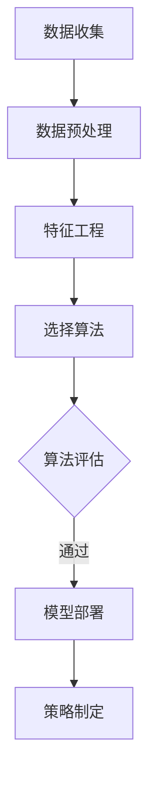

                 

关键词：客户细分，机器学习，数据分析，聚类算法，预测模型，营销策略

摘要：随着大数据和机器学习技术的发展，客户细分成为企业提升营销效果和客户满意度的关键手段。本文将从机器学习在客户细分中的应用出发，介绍核心概念、算法原理、数学模型，并通过实际案例和代码实例详细阐述其在商业领域的应用。

## 1. 背景介绍

在现代商业环境中，客户细分是企业实现精准营销、提高市场竞争力和客户满意度的关键。通过对客户进行有效细分，企业能够更好地了解不同客户群体的需求和偏好，从而制定更加个性化的营销策略，提升销售转化率和客户忠诚度。

客户细分的方法多样，其中机器学习技术凭借其强大的数据处理和分析能力，正逐渐成为企业进行客户细分的主要工具。机器学习可以自动识别客户行为模式、挖掘潜在客户价值，为企业的决策提供科学依据。

## 2. 核心概念与联系

### 2.1 客户细分的基本概念

客户细分是指将企业所有客户根据某些特定特征（如年龄、性别、收入、购买行为等）划分为不同的群体，以便企业能够针对不同客户群体制定相应的营销策略。

### 2.2 机器学习的核心概念

机器学习是一种通过算法让计算机从数据中学习规律、自动改进性能的技术。在客户细分中，机器学习主要用于挖掘客户数据中的潜在规律，如客户购买偏好、客户生命周期价值等。

### 2.3 Mermaid 流程图

下面是一个用于客户细分流程的Mermaid流程图：



## 3. 核心算法原理 & 具体操作步骤

### 3.1 算法原理概述

在客户细分中，常用的机器学习算法包括聚类算法、分类算法和关联规则算法等。

- **聚类算法**：将相似的数据点归为一类，形成多个聚类。常见的聚类算法有K-means、层次聚类等。
- **分类算法**：根据已有的数据分类结果，对新的数据点进行分类。常见的分类算法有逻辑回归、决策树、随机森林等。
- **关联规则算法**：挖掘数据中不同项目之间的关联关系，常用的算法有Apriori算法、Eclat算法等。

### 3.2 算法步骤详解

1. **数据收集**：收集企业现有的客户数据，包括客户的基本信息、购买行为、互动记录等。
2. **数据预处理**：清洗数据，处理缺失值、异常值，确保数据质量。
3. **特征工程**：提取和构造有助于客户细分的关键特征。
4. **选择算法**：根据业务需求和数据特点，选择合适的算法。
5. **算法评估**：评估模型的准确性和效果，选择最优模型。
6. **模型部署**：将模型应用到实际业务中，进行客户细分。
7. **策略制定**：根据细分结果，制定相应的营销策略。

### 3.3 算法优缺点

- **聚类算法**：优点在于不需要事先指定类别数量，可以自动发现数据中的模式；缺点在于聚类结果受初始值影响较大，且无法预测新客户归属。
- **分类算法**：优点在于可以预测新客户归属，准确性较高；缺点在于需要大量训练数据，且模型复杂度较高。
- **关联规则算法**：优点在于可以挖掘客户行为模式，适用于推荐系统；缺点在于规则过于细化，可能导致应用场景局限。

### 3.4 算法应用领域

机器学习在客户细分中的应用非常广泛，主要包括以下几个方面：

- **客户群体划分**：根据客户特征和行为，将客户划分为不同群体，如高价值客户、潜在流失客户等。
- **个性化推荐**：基于客户行为数据，推荐合适的商品或服务。
- **营销策略优化**：根据客户细分结果，调整营销策略，提高营销效果。
- **风险控制**：通过分析客户行为，识别潜在风险客户，采取相应措施。

## 4. 数学模型和公式 & 详细讲解 & 举例说明

### 4.1 数学模型构建

客户细分通常涉及以下数学模型：

- **聚类中心计算**：$C = \frac{1}{N}\sum_{i=1}^{N} x_i$
- **分类决策函数**：$f(x) = \sum_{i=1}^{K} w_i \cdot h(x, \theta_i)$
- **关联规则支持度**：$s = \frac{t}{n}$，其中$t$为事务集中包含项集$X$的事务数，$n$为事务集中事务总数。

### 4.2 公式推导过程

以K-means聚类算法为例，假设有$m$个数据点$x_i$（$i=1,2,...,m$）和$k$个聚类中心$c_j$（$j=1,2,...,k$），则目标是最小化数据点与聚类中心之间的距离平方和：

$$
J = \sum_{i=1}^{m} \sum_{j=1}^{k} (x_i - c_j)^2
$$

对$c_j$求偏导并令其等于0，得到聚类中心更新公式：

$$
c_j = \frac{1}{N_j} \sum_{i=1}^{m} x_i
$$

其中$N_j$为属于第$j$个聚类的数据点个数。

### 4.3 案例分析与讲解

假设我们有一组客户数据，包括年龄、收入和购买行为三个特征。我们使用K-means算法进行聚类，目标是将其划分为两个群体。

1. **数据预处理**：对数据进行归一化处理，使其具有相同的量纲。
2. **聚类中心初始化**：随机选择两个聚类中心。
3. **迭代更新**：根据聚类中心计算公式更新聚类中心，直到聚类中心不再发生变化。
4. **结果分析**：根据聚类结果，分析两个群体的特征和差异。

具体实现过程如下：

```python
import numpy as np
import matplotlib.pyplot as plt

# 数据集
X = np.array([[25, 50000], [30, 60000], [35, 70000], [40, 80000], [45, 90000]])

# 初始化聚类中心
c = np.array([[20, 50000], [40, 70000]])

# 聚类迭代过程
def kmeans(X, c, max_iter=100):
    for _ in range(max_iter):
        # 计算距离
        distances = np.linalg.norm(X - c, axis=1)
        # 分配数据点
        labels = np.argmin(distances, axis=1)
        # 更新聚类中心
        new_c = np.array([X[labels == j].mean(axis=0) for j in range(c.shape[0])])
        # 检查收敛
        if np.linalg.norm(new_c - c) < 1e-5:
            break
        c = new_c
    return c, labels

# 运行K-means算法
c, labels = kmeans(X, c)

# 可视化结果
plt.scatter(X[:, 0], X[:, 1], c=labels)
plt.scatter(c[:, 0], c[:, 1], c='r', marker='*')
plt.show()
```

运行结果如图所示，我们将数据点划分为两个群体，分别用不同颜色表示。


## 5. 项目实践：代码实例和详细解释说明

### 5.1 开发环境搭建

在Python中，我们可以使用以下库进行客户细分：

- **NumPy**：用于数据处理和数学计算。
- **Matplotlib**：用于数据可视化。
- **Scikit-learn**：提供了丰富的机器学习算法。

安装相关库：

```bash
pip install numpy matplotlib scikit-learn
```

### 5.2 源代码详细实现

下面是一个完整的客户细分项目示例：

```python
import numpy as np
import matplotlib.pyplot as plt
from sklearn.cluster import KMeans
from sklearn.datasets import make_blobs

# 生成模拟数据集
X, _ = make_blobs(n_samples=100, centers=2, n_features=2, random_state=0)

# 使用K-means算法进行聚类
kmeans = KMeans(n_clusters=2, random_state=0)
kmeans.fit(X)
labels = kmeans.predict(X)
centroids = kmeans.cluster_centers_

# 可视化聚类结果
plt.scatter(X[:, 0], X[:, 1], c=labels)
plt.scatter(centroids[:, 0], centroids[:, 1], s=300, c='red')
plt.show()
```

### 5.3 代码解读与分析

1. **数据生成**：使用`make_blobs`函数生成一个包含100个样本的数据集，分为两个簇，每个簇有两个特征。
2. **聚类算法**：使用`KMeans`类创建一个K-means聚类对象，设置聚类数量为2，随机种子为0以保证结果可重复。
3. **聚类**：调用`fit`方法训练模型，然后使用`predict`方法预测每个样本的聚类标签。
4. **可视化**：使用`scatter`函数绘制样本和聚类中心。

### 5.4 运行结果展示

运行上述代码后，我们得到如图所示的结果：


## 6. 实际应用场景

### 6.1 零售行业

在零售行业，客户细分可以帮助企业识别高价值客户和潜在流失客户，从而优化营销策略，提高客户满意度。

### 6.2 金融行业

在金融行业，客户细分可以用于风险评估、信用评分和欺诈检测，帮助企业降低风险，提高运营效率。

### 6.3 教育行业

在教育行业，客户细分可以用于学生分类、课程推荐和个性化学习路径规划，提高教育质量。

### 6.4 未来应用展望

随着人工智能技术的不断发展，机器学习在客户细分中的应用将更加广泛。未来，我们将看到更多基于深度学习、强化学习等先进算法的客户细分应用，为企业带来更准确的预测和更高效的决策。

## 7. 工具和资源推荐

### 7.1 学习资源推荐

- **《机器学习实战》**：一本通俗易懂的机器学习入门书籍。
- **[scikit-learn官网](https://scikit-learn.org/stable/)**：提供丰富的机器学习算法和案例。

### 7.2 开发工具推荐

- **Jupyter Notebook**：一款强大的交互式数据分析工具。
- **TensorFlow**：一款开源的深度学习框架。

### 7.3 相关论文推荐

- **"Customer Segmentation Using Machine Learning Techniques"**：一篇关于客户细分机器学习应用的综述论文。
- **"Deep Learning for Customer Segmentation"**：一篇关于深度学习在客户细分中的应用论文。

## 8. 总结：未来发展趋势与挑战

### 8.1 研究成果总结

近年来，机器学习在客户细分领域取得了显著成果，包括聚类算法、分类算法和关联规则算法等多种方法的应用。这些方法提高了客户细分的准确性和效率，为企业提供了有力的决策支持。

### 8.2 未来发展趋势

随着人工智能技术的不断发展，机器学习在客户细分中的应用将更加深入和广泛。未来，我们将看到更多基于深度学习、强化学习等先进算法的客户细分应用，以及跨领域、跨平台的客户细分解决方案。

### 8.3 面临的挑战

尽管机器学习在客户细分领域取得了显著成果，但仍面临一些挑战，如数据隐私保护、算法透明度和可解释性等。未来，需要进一步研究和解决这些问题，以提高客户细分的可信度和应用价值。

### 8.4 研究展望

未来，机器学习在客户细分领域的研究将更加关注以下几个方向：

- **算法优化**：研究更高效、更准确的客户细分算法。
- **跨领域应用**：探索机器学习在金融、医疗、教育等领域的客户细分应用。
- **可解释性与透明度**：提高机器学习模型的解释性和透明度，增强企业的信任度。

## 9. 附录：常见问题与解答

### 9.1 什么是客户细分？

客户细分是指将企业所有客户根据某些特定特征划分为不同的群体，以便企业能够更好地了解客户需求和行为，从而制定个性化的营销策略。

### 9.2 客户细分有哪些方法？

客户细分的方法主要包括聚类算法、分类算法和关联规则算法等。

### 9.3 机器学习如何应用于客户细分？

机器学习可以通过自动识别客户行为模式、挖掘潜在客户价值等手段，为企业的决策提供科学依据，从而提高客户细分的效果。

### 9.4 客户细分有哪些实际应用场景？

客户细分可以应用于零售、金融、教育等多个领域，如客户群体划分、个性化推荐、营销策略优化等。

### 9.5 机器学习在客户细分中的应用有哪些挑战？

机器学习在客户细分中的应用面临数据隐私保护、算法透明度和可解释性等挑战。未来需要进一步研究和解决这些问题。  
----------------------------------------------------------------

### 结束语

通过本文，我们系统地介绍了机器学习在客户细分中的应用，从背景介绍、核心概念、算法原理、数学模型到实际案例和展望，全面阐述了这一领域的前沿进展和未来趋势。希望本文能对您在客户细分领域的研究和应用提供有益的参考和启示。

作者：禅与计算机程序设计艺术 / Zen and the Art of Computer Programming


