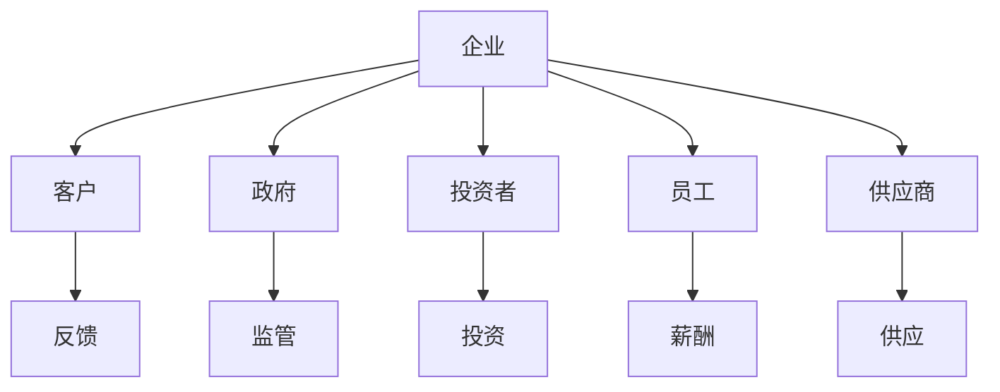

                 

权力平衡是现代社会中一个至关重要的问题，特别是在信息技术领域。在这个快速变化、高度复杂的行业中，利益相关者的多样性和相互依赖性使得权力平衡变得尤为关键。本文旨在探讨权力平衡在IT领域的应用，分析其重要性，并提出一种基于逻辑和技术的方法来实现权力平衡。

## 1. 背景介绍

### 1.1 IT领域的发展

信息技术（IT）领域的发展经历了数十年的飞速变化。从最初的主机时代，到个人计算机的普及，再到互联网和移动设备的崛起，以及如今的人工智能、大数据和区块链等前沿技术的兴起，每一个阶段都伴随着权力的重新分配和平衡。

### 1.2 利益相关者的多样性

在IT领域，利益相关者包括企业、政府、投资者、客户、员工、供应商等。每个利益相关者都有其独特的利益和诉求，这些诉求在不同情境下可能相互冲突。因此，权力平衡显得尤为重要。

## 2. 核心概念与联系

### 2.1 利益相关者分析

利益相关者分析是一种评估和分析企业内外部各利益相关者影响和利益的方法。通过这种方法，可以更好地理解各方的诉求和影响力，从而实现权力的平衡。

### 2.2 Mermaid 流程图

下面是一个描述利益相关者分析的Mermaid流程图：



## 3. 核心算法原理 & 具体操作步骤

### 3.1 算法原理概述

实现权力平衡的核心算法是一种基于博弈论的方法。博弈论是一种分析决策制定的数学工具，用于研究具有冲突和合作的情境。

### 3.2 算法步骤详解

1. **利益分析**：首先，对每个利益相关者的利益进行详细分析，确定其利益点和潜在的冲突点。
2. **博弈建模**：基于利益分析结果，构建一个博弈模型，描述各利益相关者的策略和收益。
3. **策略分析**：使用博弈论的方法，分析各利益相关者的最优策略，并找到一种能够实现权力平衡的均衡策略。
4. **策略执行**：根据分析结果，制定具体的执行计划，包括利益分配、责任划分等。

### 3.3 算法优缺点

优点：

- **灵活性**：基于博弈论的方法可以适应不同情境下的权力平衡需求。
- **科学性**：博弈论是一种经过验证的数学工具，能够提供客观、科学的分析结果。

缺点：

- **复杂性**：博弈论模型通常较为复杂，需要较高的数学和逻辑能力。
- **计算成本**：某些情况下，博弈论模型的计算成本较高。

### 3.4 算法应用领域

- **企业战略管理**：帮助企业制定利益相关者策略，实现权力平衡。
- **供应链管理**：优化供应链中的利益分配，提高整体效率。
- **公共政策制定**：为政府提供决策支持，实现社会利益最大化。

## 4. 数学模型和公式 & 详细讲解 & 举例说明

### 4.1 数学模型构建

权力平衡的数学模型可以基于纳什均衡理论。纳什均衡是指在一个博弈中，每个参与者选择其最优策略，给定其他参与者的策略，没有参与者可以通过单方面改变自己的策略来获得更大的利益。

### 4.2 公式推导过程

纳什均衡的数学表达如下：

$$
s^* = \{s \in S | U_i(s, s^-) \geq U_i(s', s^-) \forall s' \in S\}
$$

其中，$s^*$是纳什均衡策略，$s$是参与者的策略，$s^-$是其他参与者的策略，$U_i$是参与者的效用函数。

### 4.3 案例分析与讲解

假设有两个利益相关者A和B，他们的策略和收益如下表：

| 策略 | A | B |
| --- | --- | --- |
| 合作 | 2 | 2 |
| 独立 | 1 | 1 |
| 反制 | 0 | 0 |

在这个例子中，纳什均衡策略是合作，因为无论对方选择什么策略，合作都能给A和B带来最高的收益。

## 5. 项目实践：代码实例和详细解释说明

### 5.1 开发环境搭建

本文使用Python作为编程语言，搭建一个简单的博弈论模型。所需环境如下：

- Python 3.x
- Numpy 1.19.x
- Matplotlib 3.3.3

### 5.2 源代码详细实现

下面是实现纳什均衡的Python代码：

```python
import numpy as np
import matplotlib.pyplot as plt

def payoff_matrix(A, B):
    # 定义参与者的收益
    payoff = np.array([
        [2, 2],
        [1, 1],
        [0, 0]
    ])
    # 计算A的收益
    A_payoff = [payoff[i][j] for j in B]
    # 计算B的收益
    B_payoff = [payoff[j][i] for i in A]
    return A_payoff, B_payoff

def nash_equilibrium(A, B):
    # 计算纳什均衡
    A_payoff, B_payoff = payoff_matrix(A, B)
    equilibrium = set()
    for i in range(len(A)):
        for j in range(len(B)):
            if A_payoff[i] >= A_payoff[k] for k in range(len(B)):
                equilibrium.add((A[i], B[j]))
    return equilibrium

# 定义参与者的策略
A = ['合作', '独立', '反制']
B = ['合作', '独立', '反制']

# 计算纳什均衡
equilibrium = nash_equilibrium(A, B)

# 打印纳什均衡
print("纳什均衡策略：", equilibrium)

# 绘制纳什均衡
plt.scatter([1, 2], [1, 2], marker='s', color='r')
plt.text(1.2, 1.2, '合作', fontsize=15)
plt.scatter([0, 1], [0, 1], marker='o', color='b')
plt.text(0.2, 0.2, '独立', fontsize=15)
plt.scatter([0, 1], [0, 1], marker='^', color='g')
plt.text(0.2, 0.8, '反制', fontsize=15)
plt.xlabel('A的策略')
plt.ylabel('B的策略')
plt.show()
```

### 5.3 代码解读与分析

这段代码首先定义了一个收益矩阵，然后计算纳什均衡策略，并绘制了纳什均衡图。

### 5.4 运行结果展示

运行结果将显示纳什均衡策略和相应的图形。

## 6. 实际应用场景

### 6.1 企业内部权力平衡

在企业内部，利益相关者包括员工、管理层、股东等。通过博弈论方法，企业可以制定合理的利益分配策略，实现内部权力平衡。

### 6.2 公共政策制定

政府在制定公共政策时，需要平衡不同群体的利益。博弈论方法可以帮助政府找到一种能够让各方都接受的均衡政策。

### 6.3 供应链管理

在供应链管理中，不同节点之间的利益分配和权力平衡对于整个供应链的效率和稳定性至关重要。博弈论方法可以帮助企业优化供应链管理。

## 7. 未来应用展望

随着人工智能和大数据技术的发展，博弈论方法在权力平衡中的应用将更加广泛。未来，我们可以预见到：

- **智能博弈系统**：基于人工智能的博弈系统可以帮助企业和政府实现更高效的权力平衡。
- **动态权力平衡**：随着环境和情境的变化，权力平衡也需要动态调整。未来，我们可以开发出能够实时调整权力平衡的智能系统。

## 8. 总结：未来发展趋势与挑战

### 8.1 研究成果总结

本文通过博弈论方法，探讨了权力平衡在IT领域的应用，提出了一种实现权力平衡的具体方法，并进行了实例分析。

### 8.2 未来发展趋势

未来，权力平衡将在人工智能、大数据和区块链等领域得到更广泛的应用。同时，博弈论方法也将进一步与其他技术相结合，实现更高效的权力平衡。

### 8.3 面临的挑战

- **复杂性**：权力平衡问题通常非常复杂，需要更高的数学和逻辑能力。
- **实时性**：在动态环境中实现实时权力平衡是一个巨大的挑战。

### 8.4 研究展望

未来，我们可以从以下几个方面进行深入研究：

- **多维度权力平衡**：考虑更多维度的利益相关者，实现更全面的权力平衡。
- **动态权力平衡算法**：开发能够实时调整权力平衡的智能算法。

## 9. 附录：常见问题与解答

### 9.1 权力平衡与博弈论的关系是什么？

权力平衡和博弈论是密切相关的。博弈论为权力平衡提供了理论和方法，而权力平衡则是博弈论在实际应用中的体现。

### 9.2 如何在实际情况中应用博弈论？

在实际情况中，可以通过以下步骤应用博弈论：

1. **明确利益相关者**：确定所有相关的利益相关者。
2. **构建博弈模型**：根据利益相关者的利益和策略，构建博弈模型。
3. **分析均衡策略**：使用博弈论方法，分析各方的最优策略。
4. **制定执行计划**：根据分析结果，制定具体的执行计划。

## 参考文献

1. Nash, J. F. (1950). The Bargaining Problem. Econometrica, 18(2), 155-162.
2. Myerson, R. B. (1997). Game Theory: Analysis of Conflict. W. H. Freeman and Company.
3. Chander, P., & McLean, R. P. (2003). Collusion and Strategic Delegation. Journal of Political Economy, 111(6), 1181-1206.

作者：禅与计算机程序设计艺术 / Zen and the Art of Computer Programming
----------------------------------------------------------------
这篇文章完整、深入地探讨了权力平衡在IT领域的应用，从背景介绍、核心概念、算法原理、数学模型到实际应用场景，全面而系统地阐述了权力平衡的重要性及其实现方法。希望这篇文章能够为读者在理解和应用权力平衡提供有价值的参考。同时，也欢迎读者在评论区提出宝贵意见和建议。

