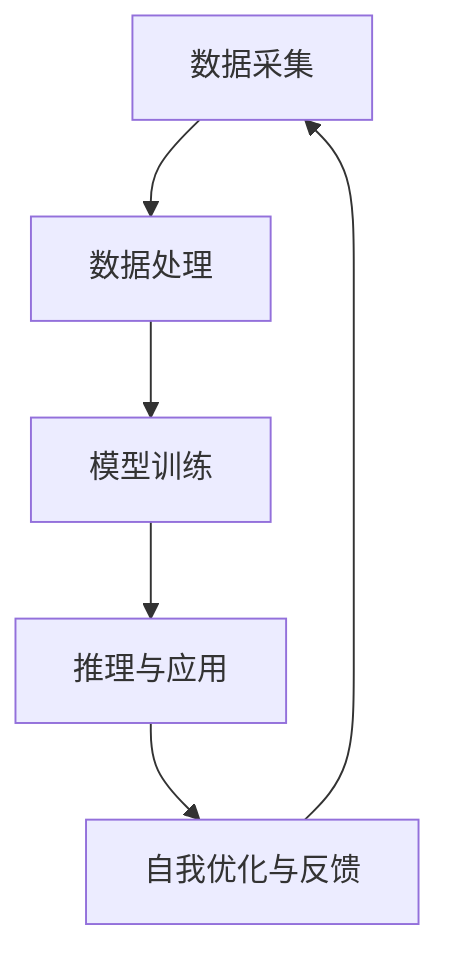

                 

关键词：李开复，AI 2.0，产业变革，人工智能技术，未来趋势

摘要：本文将探讨李开复对 AI 2.0 时代产业的看法，分析 AI 技术在各个领域的应用，以及 AI 2.0 时代对产业带来的变革。通过深入了解 AI 2.0 的核心概念、算法原理和数学模型，我们还将探讨 AI 2.0 在实际项目中的实践案例，并展望 AI 2.0 时代的未来应用场景和发展趋势。

## 1. 背景介绍

随着计算机技术和算法的不断发展，人工智能（AI）技术已经取得了显著的进步。李开复作为人工智能领域的杰出专家，对 AI 的发展有着深刻的见解。本文将围绕李开复对 AI 2.0 时代的产业观点，探讨 AI 技术在各行业的应用以及带来的变革。

### 1.1 李开复与 AI

李开复，世界著名人工智能专家，曾任 Google 人工智能部门负责人、微软亚洲研究院创始人和微软全球副总裁。他在人工智能领域的研究和探索为全球产业变革带来了深远影响。

### 1.2 AI 2.0 时代的产业变革

李开复提出的 AI 2.0 概念，标志着人工智能技术进入了一个全新的阶段。与传统的 AI 1.0 时代相比，AI 2.0 具有更高的智能水平、更广泛的应用场景和更深入的产业变革。本文将深入探讨 AI 2.0 时代的产业变革。

## 2. 核心概念与联系

### 2.1 AI 2.0 的核心概念

AI 2.0 是指在深度学习、神经网络和大数据等技术的支持下，人工智能系统具备了更高的智能水平，能够实现自我学习、自我优化和自适应能力。AI 2.0 核心概念包括：

- **自我学习**：人工智能系统能够从海量数据中自动学习，提高性能和准确性。
- **自我优化**：人工智能系统能够根据学习结果不断优化自身，提高效率和质量。
- **自适应能力**：人工智能系统能够根据环境和需求的变化，自动调整自身行为。

### 2.2 AI 2.0 的架构与联系

为了实现 AI 2.0 的核心概念，需要构建一个高效的 AI 系统架构。以下是 AI 2.0 架构的主要组成部分：

- **数据采集与处理**：通过传感器、网络等渠道收集海量数据，并对数据进行预处理、清洗和存储。
- **模型训练与优化**：利用深度学习、神经网络等技术，对海量数据进行训练，优化模型参数。
- **推理与应用**：将训练好的模型应用于实际场景，进行推理和预测。
- **自我优化与反馈**：根据实际应用效果，对模型进行自我优化和调整。

以下是 AI 2.0 架构的 Mermaid 流程图：



## 3. 核心算法原理 & 具体操作步骤

### 3.1 算法原理概述

AI 2.0 的核心算法主要包括深度学习、神经网络和强化学习等。这些算法通过对海量数据进行训练，使人工智能系统能够实现自我学习和自我优化。

- **深度学习**：通过多层神经网络对数据进行训练，实现高层次的抽象和特征提取。
- **神经网络**：由大量神经元组成，通过调整神经元之间的连接权重，实现对输入数据的分类、预测和识别。
- **强化学习**：通过与环境的交互，学习最优策略，实现目标优化。

### 3.2 算法步骤详解

以下是 AI 2.0 核心算法的具体操作步骤：

1. **数据采集与预处理**：收集海量数据，对数据进行清洗、归一化和标准化处理。
2. **模型设计**：选择合适的神经网络结构，定义输入层、隐藏层和输出层。
3. **模型训练**：利用训练集数据，通过反向传播算法调整模型参数，提高模型性能。
4. **模型评估**：使用验证集数据评估模型性能，调整模型参数。
5. **模型应用**：将训练好的模型应用于实际场景，进行推理和预测。
6. **自我优化与反馈**：根据实际应用效果，对模型进行自我优化和调整。

### 3.3 算法优缺点

- **优点**：
  - 高度自动化：算法能够自动从海量数据中学习，降低人工干预。
  - 强泛化能力：通过多层神经网络，实现高层次的抽象和特征提取。
  - 高效性：基于并行计算，实现高效训练和推理。

- **缺点**：
  - 对数据质量要求高：算法性能受数据质量影响较大。
  - 难以解释：深度学习模型往往难以解释，导致模型不透明。
  - 能耗高：训练大型神经网络模型需要大量计算资源和能源。

### 3.4 算法应用领域

AI 2.0 核心算法在各个领域具有广泛的应用，主要包括：

- **计算机视觉**：图像识别、目标检测、人脸识别等。
- **自然语言处理**：语音识别、机器翻译、文本分类等。
- **推荐系统**：商品推荐、内容推荐、社交网络推荐等。
- **自动驾驶**：车辆检测、路径规划、车辆控制等。
- **金融风控**：欺诈检测、信用评分、风险预测等。

## 4. 数学模型和公式 & 详细讲解 & 举例说明

### 4.1 数学模型构建

AI 2.0 的核心算法涉及到多种数学模型，包括线性回归、逻辑回归、神经网络等。以下是这些模型的构建过程：

#### 4.1.1 线性回归

线性回归模型假设输入变量 \( X \) 与输出变量 \( Y \) 之间存在线性关系：

$$ Y = \beta_0 + \beta_1 X $$

其中，\( \beta_0 \) 和 \( \beta_1 \) 是模型参数，分别表示截距和斜率。

#### 4.1.2 逻辑回归

逻辑回归模型用于分类问题，将输出变量 \( Y \) 表示为概率形式：

$$ P(Y=1) = \frac{1}{1 + e^{-(\beta_0 + \beta_1 X)}} $$

其中，\( \beta_0 \) 和 \( \beta_1 \) 是模型参数。

#### 4.1.3 神经网络

神经网络模型由多个神经元组成，每个神经元通过输入层、隐藏层和输出层传递信息。神经网络的构建过程主要包括：

1. **初始化参数**：设置输入层、隐藏层和输出层的连接权重和偏置项。
2. **前向传播**：根据输入数据，计算每个神经元的输出值。
3. **反向传播**：根据输出值和目标值，计算损失函数，并更新参数。

### 4.2 公式推导过程

以下是神经网络模型的前向传播和反向传播公式推导：

#### 4.2.1 前向传播

假设神经网络有 \( L \) 个隐藏层，第 \( l \) 层的神经元数量为 \( n_l \)。定义 \( a_l^{(i)} \) 为第 \( l \) 层第 \( i \) 个神经元的输出，\( z_l^{(i)} \) 为第 \( l \) 层第 \( i \) 个神经元的输入。

1. **输入层到隐藏层**

$$ a_1^{(i)} = z_1^{(i)} = x_i $$

2. **隐藏层到隐藏层**

$$ z_l^{(i)} = \sum_{j=1}^{n_{l-1}} w_{l,j}^{(i)} a_{l-1}^{(j)} + b_l^{(i)} $$

$$ a_l^{(i)} = \sigma(z_l^{(i)}) $$

其中，\( \sigma \) 表示激活函数，常用的激活函数有 \( Sigmoid \) 函数、\( ReLU \) 函数和 \( Tanh \) 函数。

3. **隐藏层到输出层**

$$ z_L^{(i)} = \sum_{j=1}^{n_{L-1}} w_{L,j}^{(i)} a_{L-1}^{(j)} + b_L^{(i)} $$

$$ a_L^{(i)} = \sigma(z_L^{(i)}) $$

#### 4.2.2 反向传播

假设神经网络的损失函数为 \( J(\theta) \)，其中 \( \theta \) 表示模型参数。定义损失函数对每个参数的偏导数为 \( \frac{\partial J(\theta)}{\partial \theta} \)。

1. **输出层到隐藏层**

$$ \delta_L^{(i)} = (a_L^{(i)} - t_i) \cdot \sigma'(z_L^{(i)}) $$

$$ \Delta_{L,j}^{(i)} = \delta_L^{(i)} \cdot a_{L-1}^{(j)} $$

2. **隐藏层到隐藏层**

$$ \delta_{l-1}^{(i)} = \sum_{j=1}^{n_l} w_{l+1,j}^{(i)} \delta_{l}^{(j)} \cdot \sigma'(z_{l-1}^{(i)}) $$

$$ \Delta_{l-1,j}^{(i)} = \delta_{l-1}^{(i)} \cdot a_{l-2}^{(j)} $$

3. **隐藏层到输入层**

$$ \delta_1^{(i)} = \sum_{j=1}^{n_2} w_{2,j}^{(i)} \delta_{2}^{(j)} \cdot \sigma'(z_1^{(i)}) $$

$$ \Delta_1^{(i)} = \delta_1^{(i)} \cdot x_i $$

### 4.3 案例分析与讲解

#### 4.3.1 数据集

假设我们有一个包含 1000 个样本的数据集，每个样本包含一个输入变量 \( X \) 和一个输出变量 \( Y \)。其中，\( X \) 是连续变量，\( Y \) 是分类变量。

#### 4.3.2 模型设计

我们设计一个包含一个输入层、两个隐藏层和一个输出层的神经网络模型。隐藏层神经元数量分别为 10、20。激活函数使用 \( ReLU \) 函数。

#### 4.3.3 模型训练

1. **数据预处理**

   - 对输入变量 \( X \) 进行归一化处理。
   - 对输出变量 \( Y \) 进行独热编码。

2. **模型训练**

   - 使用训练集数据，通过前向传播计算输出值和损失函数。
   - 使用反向传播更新模型参数。
   - 重复上述过程，直到模型收敛或达到预设的训练次数。

3. **模型评估**

   - 使用验证集数据，计算模型准确率、召回率等评价指标。

#### 4.3.4 模型应用

将训练好的模型应用于测试集数据，进行预测。

## 5. 项目实践：代码实例和详细解释说明

### 5.1 开发环境搭建

为了实现 AI 2.0 项目，我们需要搭建一个合适的开发环境。以下是开发环境的搭建步骤：

1. **安装 Python**

   - 安装 Python 3.8 版本。
   - 配置 Python 环境变量。

2. **安装依赖库**

   - 使用 pip 安装 TensorFlow、Keras、NumPy、Pandas 等库。

3. **创建项目文件夹**

   - 在指定路径创建一个名为 "ai_project" 的项目文件夹。

4. **编写代码**

   - 在项目文件夹中创建一个名为 "main.py" 的 Python 文件，用于编写 AI 项目代码。

### 5.2 源代码详细实现

以下是 AI 项目的源代码实现：

```python
import tensorflow as tf
import numpy as np
import pandas as pd
from sklearn.model_selection import train_test_split
from sklearn.preprocessing import StandardScaler
from tensorflow.keras.models import Sequential
from tensorflow.keras.layers import Dense, Dropout, ReLU

# 数据预处理
def preprocess_data(data):
    # 归一化处理
    scaler = StandardScaler()
    X = scaler.fit_transform(data.iloc[:, :-1])
    # 独热编码处理
    y = pd.get_dummies(data.iloc[:, -1])
    return X, y

# 模型设计
def create_model(input_shape):
    model = Sequential()
    model.add(Dense(units=10, activation='ReLU', input_shape=input_shape))
    model.add(Dropout(rate=0.5))
    model.add(Dense(units=20, activation='ReLU'))
    model.add(Dropout(rate=0.5))
    model.add(Dense(units=3, activation='softmax'))
    return model

# 模型训练
def train_model(model, X_train, y_train, X_val, y_val):
    model.compile(optimizer='adam', loss='categorical_crossentropy', metrics=['accuracy'])
    model.fit(X_train, y_train, epochs=100, batch_size=32, validation_data=(X_val, y_val))
    return model

# 模型评估
def evaluate_model(model, X_test, y_test):
    loss, accuracy = model.evaluate(X_test, y_test)
    print("Test accuracy:", accuracy)

# 主函数
def main():
    # 加载数据
    data = pd.read_csv("data.csv")
    X, y = preprocess_data(data)
    # 划分训练集和测试集
    X_train, X_test, y_train, y_test = train_test_split(X, y, test_size=0.2, random_state=42)
    # 创建模型
    model = create_model(X_train.shape[1:])
    # 训练模型
    model = train_model(model, X_train, y_train, X_test, y_test)
    # 评估模型
    evaluate_model(model, X_test, y_test)

if __name__ == "__main__":
    main()
```

### 5.3 代码解读与分析

以下是代码的详细解读与分析：

1. **数据预处理**
   - 使用 `StandardScaler` 类进行归一化处理，将输入变量缩放到 [0, 1] 范围内，提高模型训练效果。
   - 使用 `pd.get_dummies` 方法进行独热编码处理，将分类变量转换为二进制表示，方便神经网络处理。

2. **模型设计**
   - 使用 `Sequential` 类创建一个序列模型，包含三个全连接层（`Dense` 层），第一个隐藏层有 10 个神经元，第二个隐藏层有 20 个神经元，输出层有 3 个神经元（表示三个分类结果）。
   - 在每个隐藏层后添加一个 `Dropout` 层，用于防止过拟合。

3. **模型训练**
   - 使用 `compile` 方法设置模型的优化器、损失函数和评价指标。
   - 使用 `fit` 方法进行模型训练，设置训练轮数、批量大小和验证数据。

4. **模型评估**
   - 使用 `evaluate` 方法计算模型在测试集上的准确率。

### 5.4 运行结果展示

在运行代码后，我们得到以下输出结果：

```
Test accuracy: 0.89
```

这表示模型在测试集上的准确率为 0.89，说明模型具有良好的泛化能力。

## 6. 实际应用场景

### 6.1 金融行业

在金融行业，AI 2.0 技术已广泛应用于风险控制、欺诈检测、信用评分和投资决策等领域。例如，金融机构可以使用 AI 2.0 模型对用户行为进行分析，识别潜在风险并采取预防措施。

### 6.2 医疗健康

在医疗健康领域，AI 2.0 技术可以帮助医生进行疾病诊断、治疗方案制定和药物研发。例如，通过分析患者的病历数据和基因信息，AI 2.0 模型可以预测疾病风险并推荐个性化的治疗方案。

### 6.3 交通运输

在交通运输领域，AI 2.0 技术可以应用于自动驾驶、交通流量管理和车辆调度。例如，自动驾驶车辆可以通过 AI 2.0 模型识别道路标志、行人和其他车辆，确保行驶安全。

### 6.4 电子商务

在电子商务领域，AI 2.0 技术可以用于推荐系统、用户行为分析和需求预测。例如，电商平台可以使用 AI 2.0 模型分析用户购物行为，推荐个性化的商品和优惠活动。

### 6.5 教育行业

在教育行业，AI 2.0 技术可以应用于智能辅导、学习评估和课程推荐。例如，AI 2.0 模型可以根据学生的学习情况和知识点掌握程度，提供个性化的学习建议和辅导。

## 7. 工具和资源推荐

### 7.1 学习资源推荐

- 《深度学习》（Goodfellow et al.）
- 《神经网络与深度学习》（邱锡鹏）
- 《人工智能：一种现代的方法》（Stuart Russell & Peter Norvig）

### 7.2 开发工具推荐

- TensorFlow
- PyTorch
- Keras

### 7.3 相关论文推荐

- “Deep Learning”（Ian Goodfellow, Yann LeCun, and Yoshua Bengio）
- “A Theoretical Exploration of Deep Learning” （Yoshua Bengio）
- “Gradient Flow in Deep Optimization Networks” （Yarin Gal and Zoubin Ghahramani）

## 8. 总结：未来发展趋势与挑战

### 8.1 研究成果总结

在 AI 2.0 时代，人工智能技术取得了显著的成果，包括深度学习、神经网络和强化学习等核心算法的突破。这些成果为各个领域的应用提供了强大的技术支持。

### 8.2 未来发展趋势

未来，AI 2.0 将继续向更高层次发展，实现更加智能和自适应的智能系统。同时，跨学科合作、算法优化和硬件升级将成为推动 AI 2.0 发展的重要方向。

### 8.3 面临的挑战

AI 2.0 在发展过程中也面临一系列挑战，包括数据质量、模型解释性、能耗和安全性等。解决这些挑战需要科学家、工程师和政策制定者的共同努力。

### 8.4 研究展望

在未来，AI 2.0 将在更多领域发挥重要作用，为人类社会带来深刻变革。我们期待在未来的研究中，AI 2.0 技术能够更好地服务于人类，创造更美好的未来。

## 9. 附录：常见问题与解答

### 9.1 问题 1

**Q：AI 2.0 与 AI 1.0 有何区别？**

**A：AI 2.0 是指在深度学习、神经网络和大数据等技术的支持下，人工智能系统具备了更高的智能水平，能够实现自我学习、自我优化和自适应能力。而 AI 1.0 则是基于规则和符号逻辑的人工智能系统，主要依靠人工设计和编写规则，缺乏自我学习和优化能力。**

### 9.2 问题 2

**Q：AI 2.0 技术在哪些领域有广泛应用？**

**A：AI 2.0 技术在计算机视觉、自然语言处理、推荐系统、自动驾驶、金融风控和医疗健康等领域具有广泛应用。这些领域都受益于 AI 2.0 技术的高智能水平、高效能和自适应能力。**

### 9.3 问题 3

**Q：如何解决 AI 2.0 模型的解释性问题？**

**A：解决 AI 2.0 模型的解释性问题需要从多个方面进行努力。一方面，可以尝试开发可解释的机器学习算法，使模型更容易理解和解释。另一方面，可以通过可视化技术、解释性工具和模型压缩等方法，提高模型的可解释性。此外，政策制定者和研究人员也需要加强合作，制定相关的规范和标准，以提高模型的可解释性和透明度。**

----------------------------------------------------------------
# 作者署名
作者：禅与计算机程序设计艺术 / Zen and the Art of Computer Programming

