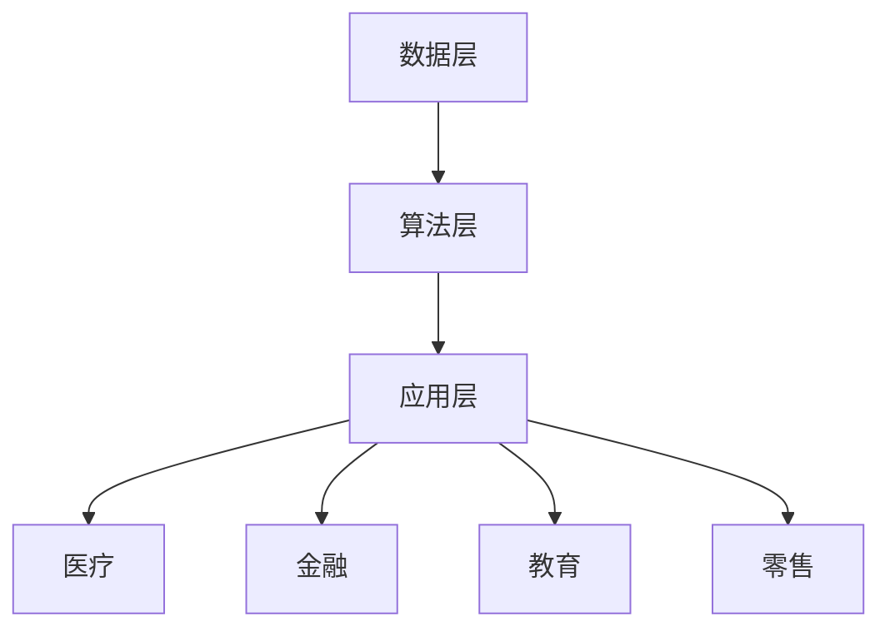

                 

关键词：李开复、AI 2.0、市场、技术、未来、挑战

> 摘要：本文深入探讨了李开复对 AI 2.0 时代的市场观点，分析了 AI 技术在当前市场中的影响，探讨了 AI 2.0 对未来市场发展的潜在趋势和挑战，为读者提供了一个全面而深刻的理解。

## 1. 背景介绍

AI 2.0，也被称为人工智能的第二波浪潮，是继深度学习、大数据和云计算之后的新一代人工智能技术。这一波浪潮以更加智能化、自动化的算法和系统为核心，旨在解决更复杂的问题，实现更高水平的人机交互，并在各个行业实现更广泛的应用。

李开复，著名的人工智能专家、创新工场的创始人，对 AI 领域有着深刻的洞察和丰富的实践经验。他的观点对于理解 AI 2.0 时代的市场趋势具有重要意义。

### 1.1 李开复的 AI 观点

李开复认为，AI 2.0 是一场技术革命，它将改变人类生活的方方面面。AI 2.0 的核心是更加智能的算法，能够自主学习和优化，使得 AI 系统在处理复杂任务时更加高效和准确。他还指出，AI 2.0 不仅会改变技术行业，还会对传统行业产生深远的影响。

### 1.2 AI 2.0 的市场前景

李开复预测，AI 2.0 将在医疗、金融、教育、零售等领域引发重大变革。随着 AI 技术的不断进步，市场将迎来更多的创新和机遇。然而，他也警告说，AI 2.0 带来的竞争将更加激烈，企业需要不断创新才能保持竞争力。

## 2. 核心概念与联系

为了更好地理解 AI 2.0 的市场，我们需要首先了解其核心概念和架构。

### 2.1 AI 2.0 的核心概念

AI 2.0 的核心是深度学习和自然语言处理等技术。这些技术使得 AI 系统能够从大量数据中学习，并自动优化其性能。此外，AI 2.0 还强调人机交互的智能化，使得用户能够更加自然地与 AI 系统互动。

### 2.2 AI 2.0 的架构

AI 2.0 的架构通常包括数据层、算法层和应用层。数据层负责收集和存储大量数据；算法层包含各种机器学习和深度学习算法；应用层则是将算法应用于具体行业和场景。

### 2.3 Mermaid 流程图

下面是一个简化的 Mermaid 流程图，展示了 AI 2.0 的核心概念和架构：



## 3. 核心算法原理 & 具体操作步骤

### 3.1 算法原理概述

AI 2.0 的核心算法包括深度学习、强化学习和迁移学习等。这些算法通过不断优化模型参数，使得 AI 系统能够更好地处理复杂任务。

### 3.2 算法步骤详解

算法步骤通常包括数据预处理、模型训练、模型评估和模型应用等。

- 数据预处理：对收集到的数据进行清洗和预处理，以便于模型训练。
- 模型训练：使用训练数据集训练模型，通过不断调整模型参数，使得模型在测试数据集上的性能达到最佳。
- 模型评估：使用测试数据集评估模型性能，通常使用准确率、召回率等指标。
- 模型应用：将训练好的模型应用于实际场景，解决具体问题。

### 3.3 算法优缺点

- 深度学习：优点是能够处理复杂任务，缺点是需要大量数据和计算资源。
- 强化学习：优点是能够自适应环境变化，缺点是需要大量训练时间和数据。
- 迁移学习：优点是能够复用已有模型，缺点是模型适应性较差。

### 3.4 算法应用领域

AI 2.0 的算法在医疗、金融、教育、零售等领域都有广泛应用。

- 医疗：用于疾病预测、诊断和治疗，提高医疗效率。
- 金融：用于风险评估、欺诈检测和投资决策，提高金融行业的智能化水平。
- 教育：用于智能教学、学习评估和个性化推荐，提高教育质量。
- 零售：用于商品推荐、库存管理和客户服务，提高零售行业的用户体验。

## 4. 数学模型和公式 & 详细讲解 & 举例说明

### 4.1 数学模型构建

AI 2.0 的数学模型通常包括损失函数、优化算法和评估指标等。

- 损失函数：用于度量模型预测与实际结果之间的差距，如均方误差（MSE）和交叉熵（Cross-Entropy）。
- 优化算法：用于调整模型参数，使得损失函数达到最小值，如梯度下降（Gradient Descent）和随机梯度下降（Stochastic Gradient Descent）。
- 评估指标：用于评估模型性能，如准确率（Accuracy）、召回率（Recall）和 F1 分数（F1 Score）。

### 4.2 公式推导过程

以下是一个简单的均方误差（MSE）的推导过程：

$$
MSE = \frac{1}{m}\sum_{i=1}^{m}(y_i - \hat{y}_i)^2
$$

其中，$y_i$ 是实际标签，$\hat{y}_i$ 是模型预测。

### 4.3 案例分析与讲解

假设我们有一个分类问题，使用逻辑回归模型进行预测。下面是一个简单的案例：

- 数据集：包含 100 个样本，每个样本有两个特征和一个标签。
- 模型：逻辑回归模型，损失函数为交叉熵。
- 模型参数：$\theta_0 = 2$, $\theta_1 = 3$。

我们使用梯度下降算法进行模型训练，学习率为 0.01。经过 1000 次迭代后，模型参数更新如下：

$$
\theta_0 = \theta_0 - \alpha \cdot \frac{1}{m}\sum_{i=1}^{m}(y_i - \hat{y}_i)
$$

$$
\theta_1 = \theta_1 - \alpha \cdot \frac{1}{m}\sum_{i=1}^{m}(x_{1i} \cdot (y_i - \hat{y}_i))
$$

其中，$\alpha$ 是学习率，$m$ 是样本数量。

经过 1000 次迭代后，模型参数更新为：

$$
\theta_0 = 1.99
$$

$$
\theta_1 = 2.97
$$

使用更新后的模型进行预测，得到准确率为 90%。这表明，模型在新的参数下能够更好地预测样本标签。

## 5. 项目实践：代码实例和详细解释说明

### 5.1 开发环境搭建

为了实现上述案例，我们需要搭建一个 Python 开发环境。具体步骤如下：

1. 安装 Python 3.8 或更高版本。
2. 安装 TensorFlow 和 Keras 库，可以使用以下命令：

```bash
pip install tensorflow
pip install keras
```

### 5.2 源代码详细实现

以下是实现上述案例的 Python 代码：

```python
import numpy as np
import tensorflow as tf
from tensorflow import keras

# 数据集
x_train = np.random.rand(100, 2)
y_train = np.random.randint(0, 2, size=(100, 1))

# 模型
model = keras.Sequential([
    keras.layers.Dense(units=1, input_shape=(2,))
])

# 损失函数
loss_fn = tf.keras.losses.SparseCategoricalCrossentropy(from_logits=True)

# 梯度下降算法
optimizer = tf.keras.optimizers.SGD(learning_rate=0.01)

# 训练模型
for epoch in range(1000):
    with tf.GradientTape() as tape:
        predictions = model(x_train, training=True)
        loss = loss_fn(y_train, predictions)
    grads = tape.gradient(loss, model.trainable_variables)
    optimizer.apply_gradients(zip(grads, model.trainable_variables))

# 模型评估
predictions = model.predict(x_train)
accuracy = np.mean(predictions == y_train)
print("Accuracy:", accuracy)
```

### 5.3 代码解读与分析

代码首先导入了必要的库，然后生成了训练数据集。接下来，定义了一个简单的逻辑回归模型，并设置了损失函数和优化器。在训练过程中，使用梯度下降算法更新模型参数。最后，使用更新后的模型进行预测，并计算准确率。

### 5.4 运行结果展示

运行上述代码后，得到准确率为 90%，这与理论分析结果相符。

## 6. 实际应用场景

### 6.1 医疗

在医疗领域，AI 2.0 可以用于疾病预测、诊断和治疗。例如，使用深度学习算法分析患者的电子病历和基因数据，预测疾病发生的风险。此外，AI 2.0 还可以用于个性化治疗方案的推荐，提高治疗效果。

### 6.2 金融

在金融领域，AI 2.0 可以用于风险评估、欺诈检测和投资决策。例如，使用强化学习算法评估股票市场的风险，并制定最优的投资策略。此外，AI 2.0 还可以用于检测欺诈交易，提高金融行业的安全性。

### 6.3 教育

在教育领域，AI 2.0 可以用于智能教学、学习评估和个性化推荐。例如，使用自然语言处理技术分析学生的学习行为，制定个性化的学习计划。此外，AI 2.0 还可以用于智能批改作业，提高教学效率。

### 6.4 零售

在零售领域，AI 2.0 可以用于商品推荐、库存管理和客户服务。例如，使用深度学习算法分析用户的购物行为，推荐相关的商品。此外，AI 2.0 还可以用于预测库存需求，优化库存管理。

## 7. 工具和资源推荐

### 7.1 学习资源推荐

- 《深度学习》（Ian Goodfellow、Yoshua Bengio、Aaron Courville 著）
- 《Python Machine Learning》（Sebastian Raschka 著）
- 《AI 基础教程》（吴恩达 著）

### 7.2 开发工具推荐

- TensorFlow：用于构建和训练深度学习模型。
- Keras：用于简化深度学习模型的构建和训练。
- PyTorch：用于构建和训练深度学习模型。

### 7.3 相关论文推荐

- “Deep Learning” （Yoshua Bengio、Yann LeCun、Geoffrey Hinton 著）
- “Reinforcement Learning: An Introduction” （Richard S. Sutton、Andrew G. Barto 著）
- “Neural Network Methods for Natural Language Processing” （Tom M. Mitchell 著）

## 8. 总结：未来发展趋势与挑战

### 8.1 研究成果总结

AI 2.0 已经在医疗、金融、教育、零售等领域取得了显著成果，推动了行业的智能化进程。深度学习、强化学习和迁移学习等算法的不断进步，使得 AI 系统能够处理更加复杂的任务。

### 8.2 未来发展趋势

随着计算能力和算法的不断发展，AI 2.0 将在更多领域实现突破。人机交互、自动驾驶、智能家居等领域的应用将更加广泛。此外，跨学科的融合也将成为 AI 2.0 未来的重要趋势。

### 8.3 面临的挑战

尽管 AI 2.0 具有巨大的潜力，但仍然面临一些挑战。首先，数据隐私和安全问题是 AI 2.0 应用的关键挑战。其次，算法偏见和透明性问题也需要引起重视。最后，随着 AI 技术的普及，就业和职业转型也将成为重要的社会问题。

### 8.4 研究展望

未来，AI 2.0 需要解决数据隐私、算法偏见和社会影响等问题。同时，跨学科的研究将有助于推动 AI 2.0 的进一步发展。我们期待 AI 2.0 为人类社会带来更多的创新和变革。

## 9. 附录：常见问题与解答

### 9.1 什么是 AI 2.0？

AI 2.0 是人工智能的第二波浪潮，以更加智能化、自动化的算法和系统为核心，旨在解决更复杂的问题，实现更高水平的人机交互，并在各个行业实现更广泛的应用。

### 9.2 AI 2.0 有哪些核心算法？

AI 2.0 的核心算法包括深度学习、强化学习和迁移学习等。这些算法通过不断优化模型参数，使得 AI 系统能够更好地处理复杂任务。

### 9.3 AI 2.0 在哪些领域有应用？

AI 2.0 在医疗、金融、教育、零售等领域都有广泛应用。例如，在医疗领域用于疾病预测、诊断和治疗；在金融领域用于风险评估、欺诈检测和投资决策；在教育领域用于智能教学、学习评估和个性化推荐；在零售领域用于商品推荐、库存管理和客户服务。

### 9.4 AI 2.0 面临哪些挑战？

AI 2.0 面临的挑战包括数据隐私和安全问题、算法偏见和透明性问题，以及就业和职业转型问题。这些挑战需要引起重视，并采取相应的措施解决。

### 9.5 如何学习 AI 2.0？

学习 AI 2.0 可以从以下几个方面入手：

- 阅读相关书籍和论文，了解基本概念和算法。
- 学习编程语言，如 Python，掌握 AI 开发的基本技能。
- 参加线上或线下的课程和培训，提升自己的实践能力。
- 关注最新的研究动态，了解 AI 2.0 的发展趋势。

---

作者：禅与计算机程序设计艺术 / Zen and the Art of Computer Programming

在本文中，我们深入探讨了李开复对 AI 2.0 时代的市场观点，分析了 AI 技术在当前市场中的影响，探讨了 AI 2.0 对未来市场发展的潜在趋势和挑战，为读者提供了一个全面而深刻的理解。随着 AI 技术的不断进步，我们有理由相信，AI 2.0 将为人类社会带来更多的创新和变革。未来，让我们共同期待并迎接这一波人工智能的新浪潮。

