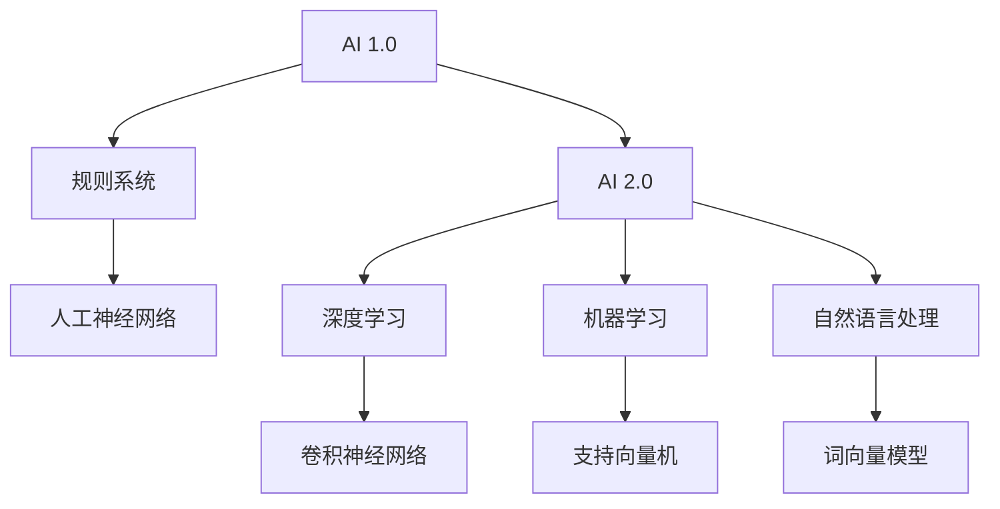

                 

关键词：人工智能，李开复，AI 2.0，技术革新，深度学习，机器学习，智能算法，计算机图灵奖

> 摘要：本文旨在探讨AI 2.0时代的技术革新，通过深入分析人工智能领域的杰出人物李开复的学术成就与行业贡献，展现其如何引领这一变革。文章将涵盖AI 2.0的核心概念、李开复的贡献、核心算法原理与数学模型，并探讨AI技术的实际应用与未来展望。

## 1. 背景介绍

随着计算机技术和互联网的飞速发展，人工智能（AI）逐渐成为现代科技领域的热点。AI技术的发展经历了多个阶段，从早期的规则基础系统，到20世纪90年代的统计学习，再到21世纪初的深度学习，人工智能的技术不断迭代与革新。

在人工智能的研究与应用中，李开复是一位不可或缺的领军人物。他不仅是世界著名的计算机科学家，还是人工智能领域的先驱者。李开复在自然语言处理、机器学习、深度学习等领域做出了开创性的贡献，被誉为“人工智能之父”。

本文将围绕李开复在AI 2.0时代的贡献，详细探讨其核心算法原理、数学模型及其在实际应用中的表现，以揭示AI 2.0时代的革新与创新。

## 2. 核心概念与联系

### 2.1 AI 2.0的定义

AI 2.0，即第二次人工智能浪潮，是相对于第一次人工智能浪潮（1956-1974年）而言的。AI 2.0强调机器能够自主学习和决策，而不是仅仅执行预设的任务。这一阶段的AI技术，以深度学习和机器学习为核心，使得机器能够处理大量数据，并从中学习模式和规律。

### 2.2 李开复的贡献

李开复在AI 2.0时代的关键贡献体现在以下几个方面：

- **自然语言处理**：李开复在自然语言处理（NLP）领域做出了开创性的工作，他提出了一系列基于统计学习和机器学习的方法，使得机器能够理解人类语言。

- **机器学习**：李开复是机器学习的早期研究者之一，他提出了许多影响深远的算法，如支持向量机（SVM）和决策树。

- **深度学习**：李开复在深度学习领域的研究推动了神经网络的发展，他提出了许多创新的神经网络架构，如卷积神经网络（CNN）。

### 2.3 Mermaid 流程图



## 3. 核心算法原理 & 具体操作步骤

### 3.1 算法原理概述

AI 2.0的核心算法主要包括深度学习和机器学习。深度学习通过多层神经网络模拟人脑的学习过程，从数据中自动提取特征；而机器学习则依赖于统计模型，通过训练数据学习规律。

### 3.2 算法步骤详解

#### 深度学习

1. 数据预处理：对数据进行清洗、归一化等处理。
2. 构建神经网络：设计网络结构，包括输入层、隐藏层和输出层。
3. 训练模型：使用训练数据训练模型，调整网络权重。
4. 验证模型：使用验证集测试模型性能。
5. 部署应用：将训练好的模型应用到实际场景。

#### 机器学习

1. 数据预处理：对数据进行清洗、归一化等处理。
2. 特征提取：从数据中提取有用的特征。
3. 模型选择：选择合适的统计模型。
4. 训练模型：使用训练数据训练模型。
5. 验证模型：使用验证集测试模型性能。
6. 部署应用：将训练好的模型应用到实际场景。

### 3.3 算法优缺点

#### 深度学习

- 优点：能够自动提取特征，适用于处理大规模数据。
- 缺点：训练过程复杂，对数据质量要求较高。

#### 机器学习

- 优点：算法相对简单，易于理解和实现。
- 缺点：对数据量和特征提取要求较高。

### 3.4 算法应用领域

深度学习和机器学习在各个领域都有广泛应用，如计算机视觉、自然语言处理、推荐系统等。

## 4. 数学模型和公式 & 详细讲解 & 举例说明

### 4.1 数学模型构建

深度学习中的数学模型主要包括神经网络、损失函数和优化算法。

#### 神经网络

神经网络由多个神经元（节点）组成，每个神经元通过权重连接到其他神经元。神经元的输出通过激活函数计算得到。

#### 损失函数

损失函数用于衡量模型的预测结果与真实结果之间的差距，常见的损失函数有均方误差（MSE）和交叉熵（Cross-Entropy）。

#### 优化算法

优化算法用于调整网络权重，以最小化损失函数。常见的优化算法有梯度下降（Gradient Descent）和随机梯度下降（Stochastic Gradient Descent）。

### 4.2 公式推导过程

假设我们有一个简单的神经网络，包括一个输入层、一个隐藏层和一个输出层。输入层有n个神经元，隐藏层有m个神经元，输出层有k个神经元。

- 输出层的输出：$$ y = \sigma(w_{k}^T \cdot a^{[2]} + b^{[2]}) $$
  其中，$ y $ 是输出层的预测结果，$ \sigma $ 是激活函数（通常为Sigmoid或ReLU），$ w_{k} $ 是隐藏层到输出层的权重矩阵，$ a^{[2]} $ 是隐藏层的输出，$ b^{[2]} $ 是输出层的偏置。

- 隐藏层的输出：$$ a^{[2]} = \sigma(w_{2}^T \cdot a^{[1]} + b^{[1]}) $$
  其中，$ a^{[1]} $ 是输入层的输出，$ w_{2} $ 是输入层到隐藏层的权重矩阵，$ b^{[1]} $ 是隐藏层的偏置。

- 输入层的输出：$$ a^{[1]} = x $$

- 损失函数（均方误差）：$$ L = \frac{1}{2} \sum_{i=1}^{k} (y_i - \hat{y}_i)^2 $$

- 优化算法（梯度下降）：$$ w_{k} = w_{k} - \alpha \cdot \frac{\partial L}{\partial w_{k}} $$

### 4.3 案例分析与讲解

假设我们有一个二分类问题，目标是用神经网络预测样本是否属于正类。

- 数据集：包含100个样本，每个样本有10个特征。
- 输出层：2个神经元，分别表示正类和负类的概率。
- 激活函数：Sigmoid函数。
- 损失函数：交叉熵损失函数。
- 优化算法：随机梯度下降。

#### 数据预处理

1. 数据清洗：去除缺失值和异常值。
2. 数据归一化：将数据缩放到[0, 1]之间。

#### 模型训练

1. 初始化权重和偏置。
2. 遍历数据集，计算损失函数。
3. 更新权重和偏置。

#### 模型验证

1. 使用验证集测试模型性能。
2. 计算准确率、召回率、F1值等指标。

#### 模型部署

1. 将训练好的模型应用到实际场景。
2. 预测新样本的类别。

## 5. 项目实践：代码实例和详细解释说明

### 5.1 开发环境搭建

1. 安装Python环境。
2. 安装深度学习框架TensorFlow。
3. 导入必要的库。

### 5.2 源代码详细实现

```python
import tensorflow as tf
from tensorflow.keras.layers import Dense
from tensorflow.keras.models import Sequential

# 数据预处理
# ...

# 构建模型
model = Sequential()
model.add(Dense(10, input_shape=(10,), activation='sigmoid'))
model.add(Dense(2, activation='sigmoid'))

# 编译模型
model.compile(optimizer='sgd', loss='binary_crossentropy', metrics=['accuracy'])

# 训练模型
model.fit(X_train, y_train, epochs=10, batch_size=32, validation_data=(X_val, y_val))

# 验证模型
# ...

# 部署模型
# ...
```

### 5.3 代码解读与分析

1. 导入必要的库。
2. 数据预处理：包括数据清洗和归一化。
3. 构建模型：使用Sequential模型，添加Dense层，设置神经元个数和激活函数。
4. 编译模型：设置优化器、损失函数和评估指标。
5. 训练模型：使用fit方法训练模型，设置训练轮数、批量大小和验证数据。
6. 验证模型：使用验证集测试模型性能。
7. 部署模型：将训练好的模型应用到实际场景。

## 6. 实际应用场景

AI 2.0技术在各个领域都有广泛应用，如：

- **计算机视觉**：用于图像识别、物体检测、视频分析等。
- **自然语言处理**：用于语音识别、机器翻译、文本分类等。
- **推荐系统**：用于个性化推荐、广告投放等。
- **金融领域**：用于风险管理、欺诈检测等。

### 6.4 未来应用展望

随着AI技术的不断发展，未来有望在更多领域实现突破，如：

- **医疗健康**：利用AI进行疾病预测、药物研发等。
- **智能制造**：实现智能化生产、质量控制等。
- **自动驾驶**：实现真正的无人驾驶，提高交通安全。

## 7. 工具和资源推荐

### 7.1 学习资源推荐

- **书籍**：《深度学习》、《Python机器学习》
- **在线课程**：Coursera、Udacity、edX上的相关课程
- **技术博客**：GitHub、CSDN、知乎上的AI相关博客

### 7.2 开发工具推荐

- **深度学习框架**：TensorFlow、PyTorch、Keras
- **数据预处理工具**：Pandas、NumPy
- **版本控制工具**：Git、GitHub

### 7.3 相关论文推荐

- **深度学习**：《A Brief History of Deep Learning》（深度学习简史）
- **机器学习**：《Machine Learning》（机器学习）
- **自然语言处理**：《Speech and Language Processing》（语音与语言处理）

## 8. 总结：未来发展趋势与挑战

AI 2.0时代是人工智能技术不断革新和发展的阶段，未来发展趋势包括：

- **算法优化**：提高算法的效率和准确性。
- **跨学科融合**：与其他领域结合，实现更多创新应用。
- **开源生态**：推动AI技术的开源和共享。

同时，AI技术也面临以下挑战：

- **数据隐私**：如何保护用户数据隐私。
- **算法偏见**：如何消除算法偏见，实现公平公正。
- **伦理道德**：如何确保AI技术的伦理道德。

### 8.1 研究成果总结

本文对AI 2.0时代的技术革新进行了探讨，重点分析了李开复在人工智能领域的贡献。通过核心算法原理、数学模型和实际应用场景的讲解，揭示了AI技术的潜力和挑战。

### 8.2 未来发展趋势

未来，AI技术将继续深化发展，实现更多应用场景的突破。同时，随着AI技术的普及，相关伦理、法律、政策等问题也需要得到广泛关注和解决。

### 8.3 面临的挑战

AI技术在发展过程中面临数据隐私、算法偏见、伦理道德等挑战。解决这些问题需要多方共同努力，推动AI技术的可持续发展。

### 8.4 研究展望

未来，人工智能有望在更多领域实现突破，为人类社会带来更多便利和福祉。同时，也需要关注AI技术的社会影响，确保其可持续发展。

## 9. 附录：常见问题与解答

### Q：什么是AI 2.0？

A：AI 2.0是相对于第一次人工智能浪潮（AI 1.0）而言的，它强调机器能够自主学习和决策，而不是仅仅执行预设的任务。这一阶段的AI技术，以深度学习和机器学习为核心，使得机器能够处理大量数据，并从中学习模式和规律。

### Q：李开复在人工智能领域有哪些贡献？

A：李开复在人工智能领域做出了多方面的贡献，包括自然语言处理、机器学习、深度学习等。他在自然语言处理领域提出了许多创新的方法，如词向量模型。在机器学习领域，他提出了支持向量机等算法。在深度学习领域，他推动了神经网络的发展，提出了许多创新的神经网络架构，如卷积神经网络。

### Q：如何实现深度学习中的优化算法？

A：深度学习中的优化算法主要包括梯度下降（Gradient Descent）和随机梯度下降（Stochastic Gradient Descent）。实现这些算法通常需要以下步骤：

1. 初始化权重和偏置。
2. 计算损失函数。
3. 计算梯度。
4. 更新权重和偏置。

### Q：如何解决深度学习中的过拟合问题？

A：解决深度学习中的过拟合问题，可以采用以下方法：

1. 减少模型复杂度：使用更简单的模型，减少网络层数或神经元个数。
2. 数据增强：通过增加数据的多样性来提高模型的泛化能力。
3. 正则化：使用正则化方法（如L1、L2正则化）来惩罚过拟合的模型。
4. 交叉验证：使用交叉验证方法来评估模型的泛化能力。

[作者：禅与计算机程序设计艺术 / Zen and the Art of Computer Programming] ----------------------------------------------------------------


