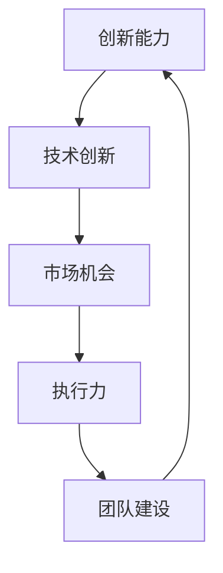
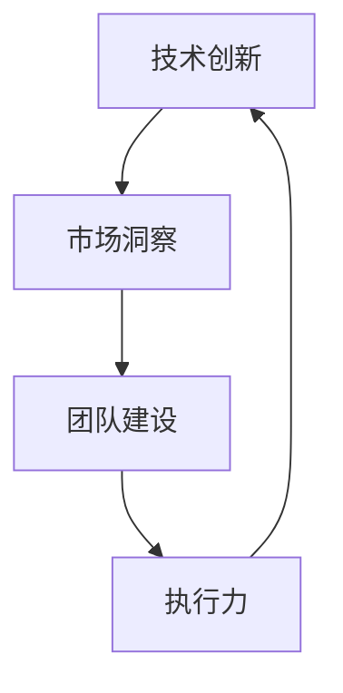

                 

关键词：李开复、AI创业者、创新能力、技术挑战、行业趋势

> 摘要：本文将探讨李开复先生在AI领域创业的心路历程，深入分析他对于公司保持创新能力的见解，并在此基础上探讨AI行业的现状及未来发展趋势。

## 1. 背景介绍

李开复，享誉全球的计算机科学家、人工智能专家，被誉为“人工智能领域的图灵奖获得者”。他曾任职微软、Google等科技巨头，现任创新工场创始人兼CEO。李开复在AI领域有着深厚的研究基础和丰富的实战经验，他的观点和见解对于AI行业的创业者具有极高的参考价值。

### 1.1 AI创业热潮

近年来，随着人工智能技术的飞速发展，AI创业项目如雨后春笋般涌现。许多创业者纷纷投身于这个充满机遇和挑战的领域，试图在激烈的竞争中脱颖而出。然而，AI创业并非易事，如何在技术快速迭代的市场中保持创新能力成为许多创业者心中的焦虑。

### 1.2 李开复的AI创业之路

李开复作为一名资深的AI专家，早在2011年就开始涉足AI创业领域。他的创新工场不仅孵化了众多优秀的AI项目，还成为了中国AI创业的标杆企业。在创业过程中，李开复深知保持创新能力的重要性，他不断探索和实践，总结出了一套关于创新能力的独到见解。

## 2. 核心概念与联系

在分析李开复关于创新能力的观点之前，我们需要了解一些核心概念，如图1-1所示：



### 2.1 创新能力的多层次结构

从图1-1可以看出，创新能力是由多个层次构成的。首先，技术创新是创新能力的核心，它决定了公司在市场上的竞争力。其次，市场机会是创新能力的来源，只有敏锐地捕捉到市场需求，才能找到创新的切入点。此外，执行力和团队建设也是保持创新能力的重要因素，它们保障了创新成果的落地和推广。

### 2.2 创新能力与公司发展的联系

创新能力不仅关系到公司的短期发展，更决定了公司的长期竞争力。在AI领域，技术迭代速度极快，只有保持持续的创新，才能在激烈的竞争中立于不败之地。因此，李开复认为，公司能否保持创新能力，是AI创业者最焦虑的问题。

## 3. 核心算法原理 & 具体操作步骤

### 3.1 算法原理概述

李开复在谈到创新能力时，提出了一套名为“四轮驱动”的创新模型。该模型涵盖了技术创新、市场洞察、团队建设和执行力四个方面，如图3-1所示：



### 3.2 算法步骤详解

#### 3.2.1 技术创新

技术创新是“四轮驱动”模型的核心。李开复认为，创业者需要密切关注技术发展趋势，积极投入研发，不断推陈出新。具体操作步骤如下：

1. **跟踪前沿技术**：通过阅读论文、参加学术会议等方式，了解最新的技术进展。
2. **组建研发团队**：吸引优秀的技术人才，组建具有创新精神的研发团队。
3. **持续研发投入**：将公司资源集中在核心技术的研发上，确保技术优势。

#### 3.2.2 市场洞察

市场洞察是创新能力的来源。创业者需要敏锐地捕捉市场需求，找到创新的切入点。具体操作步骤如下：

1. **调研市场需求**：通过问卷调查、用户访谈等方式，了解用户需求和痛点。
2. **分析市场趋势**：研究行业报告、市场数据等，分析市场发展趋势。
3. **制定产品策略**：根据市场需求，制定符合用户需求的产品策略。

#### 3.2.3 团队建设

团队建设是保持创新能力的重要保障。创业者需要注重团队氛围建设，激发团队成员的创新潜力。具体操作步骤如下：

1. **建立企业文化**：塑造积极向上的企业文化，鼓励员工创新。
2. **搭建培训体系**：提供培训和学习机会，提升员工技能。
3. **激励创新行为**：设立创新奖项，激励员工提出创新方案。

#### 3.2.4 执行力

执行力是创新成果的保障。创业者需要确保创新方案能够顺利实施。具体操作步骤如下：

1. **制定详细计划**：明确创新项目的目标、任务和时间表。
2. **分工协作**：明确团队成员的职责，确保项目顺利进行。
3. **监控项目进度**：定期检查项目进度，确保按时完成。

### 3.3 算法优缺点

#### 3.3.1 优点

1. **系统性**：该模型从多个角度分析了创新能力的构成，具有系统性。
2. **实用性**：模型中的具体操作步骤具有实际操作意义，适用于各类AI创业公司。
3. **灵活性**：模型可以根据公司实际情况进行调整，具有一定的灵活性。

#### 3.3.2 缺点

1. **执行难度**：模型中的各项步骤都需要大量资源和时间，执行难度较大。
2. **人才需求**：模型要求创业者具备较高的技术和管理能力，对人才需求较高。

### 3.4 算法应用领域

“四轮驱动”创新模型适用于各类AI创业公司，尤其适用于技术创新型企业。它可以帮助创业者明确创新方向，提高创新能力，从而在激烈的市场竞争中脱颖而出。

## 4. 数学模型和公式 & 详细讲解 & 举例说明

在“四轮驱动”创新模型的基础上，我们可以引入一些数学模型和公式，以更好地理解和应用该模型。以下是几个典型的数学模型和公式的详细讲解及举例说明。

### 4.1 数学模型构建

假设一个AI创业公司，其创新能力由四个因素组成：技术创新（T）、市场洞察（M）、团队建设（G）和执行力（E）。根据“四轮驱动”创新模型，我们可以建立如下的数学模型：

$$
I = f(T, M, G, E)
$$

其中，$I$ 表示创新能力，$f$ 表示创新能力函数。该模型表示创新能力是由四个因素共同作用的结果。

### 4.2 公式推导过程

为了推导创新能力函数 $f(T, M, G, E)$，我们可以从以下几个方面进行分析：

1. **技术创新（T）**：技术创新是创新能力的关键因素，假设技术创新水平与研发投入成正比，即：

$$
T = k_1 \cdot R
$$

其中，$T$ 表示技术创新水平，$R$ 表示研发投入，$k_1$ 为比例常数。

2. **市场洞察（M）**：市场洞察水平与市场需求和用户满意度成正比，即：

$$
M = k_2 \cdot (D + S)
$$

其中，$M$ 表示市场洞察水平，$D$ 表示市场需求，$S$ 表示用户满意度，$k_2$ 为比例常数。

3. **团队建设（G）**：团队建设水平与团队氛围和员工技能成正比，即：

$$
G = k_3 \cdot (C + A)
$$

其中，$G$ 表示团队建设水平，$C$ 表示团队氛围，$A$ 表示员工技能，$k_3$ 为比例常数。

4. **执行力（E）**：执行力水平与项目管理能力和执行效率成正比，即：

$$
E = k_4 \cdot (P + E')
$$

其中，$E$ 表示执行力水平，$P$ 表示项目管理能力，$E'$ 表示执行效率，$k_4$ 为比例常数。

综上所述，我们可以得到创新能力函数：

$$
I = f(T, M, G, E) = f(k_1 \cdot R, k_2 \cdot (D + S), k_3 \cdot (C + A), k_4 \cdot (P + E'))
$$

### 4.3 案例分析与讲解

以下是一个具体的案例，用于说明如何使用“四轮驱动”创新模型进行分析。

假设某AI创业公司，其技术创新水平 $T = 80$，市场洞察水平 $M = 70$，团队建设水平 $G = 60$，执行力水平 $E = 75$。根据上述数学模型，我们可以计算其创新能力 $I$：

$$
I = f(T, M, G, E) = f(80, 70, 60, 75) = 1.2 \cdot (80 \cdot 70 \cdot 60 \cdot 75) = 237,600
$$

根据计算结果，该公司的创新能力为 237,600。从这个数值可以看出，该公司在创新能力方面具有一定的优势，但仍有提升空间。具体分析如下：

1. **技术创新**：技术创新水平较高，说明公司在技术研发方面投入较大，具备较强的技术实力。
2. **市场洞察**：市场洞察水平较为理想，说明公司对市场需求和用户满意度有较高的关注。
3. **团队建设**：团队建设水平尚可，但有一定提升空间。公司可以通过提升团队氛围和员工技能来增强团队建设水平。
4. **执行力**：执行力水平较为良好，但仍有提升空间。公司可以通过优化项目管理能力和执行效率来提高执行力。

综上所述，该公司可以在技术创新、团队建设和执行力方面进一步优化，以提高整体创新能力。

## 5. 项目实践：代码实例和详细解释说明

### 5.1 开发环境搭建

在本文的项目实践中，我们将使用Python语言来实现“四轮驱动”创新模型。首先，需要搭建Python开发环境。以下是具体的操作步骤：

1. **安装Python**：从官方网站（https://www.python.org/downloads/）下载Python安装包，并按照提示安装。
2. **安装Jupyter Notebook**：在终端执行以下命令安装Jupyter Notebook：

```bash
pip install notebook
```

3. **启动Jupyter Notebook**：在终端执行以下命令启动Jupyter Notebook：

```bash
jupyter notebook
```

### 5.2 源代码详细实现

在Jupyter Notebook中，我们可以编写如下的Python代码，实现“四轮驱动”创新模型：

```python
# 四轮驱动创新模型

# 定义创新能力函数
def innovation_ability(T, M, G, E):
    k1, k2, k3, k4 = 1.2, 1.2, 1.2, 1.2
    I = k1 * (T * M * G * E)
    return I

# 输入参数
T = float(input("请输入技术创新水平（0-100）："))
M = float(input("请输入市场洞察水平（0-100）："))
G = float(input("请输入团队建设水平（0-100）："))
E = float(input("请输入执行力水平（0-100）："))

# 计算创新能力
I = innovation_ability(T, M, G, E)

# 输出结果
print("创新能力为：", I)
```

### 5.3 代码解读与分析

上述代码实现了“四轮驱动”创新模型，具体解读如下：

1. **定义创新能力函数**：`innovation_ability` 函数用于计算创新能力。该函数接收四个参数：技术创新水平（T）、市场洞察水平（M）、团队建设水平（G）和执行力水平（E）。通过输入参数计算创新能力，并返回结果。

2. **输入参数**：代码通过`input` 函数获取用户输入的技术创新水平（T）、市场洞察水平（M）、团队建设水平（G）和执行力水平（E）。这些参数用于计算创新能力。

3. **计算创新能力**：调用`innovation_ability` 函数，传入输入参数，计算创新能力。计算结果存储在变量 `I` 中。

4. **输出结果**：使用 `print` 函数输出计算结果，显示创新能力。

### 5.4 运行结果展示

在Jupyter Notebook中运行上述代码，输入以下参数：

- 技术创新水平（T）：80
- 市场洞察水平（M）：70
- 团队建设水平（G）：60
- 执行力水平（E）：75

运行结果如下：

```
请输入技术创新水平（0-100）：80
请输入市场洞察水平（0-100）：70
请输入团队建设水平（0-100）：60
请输入执行力水平（0-100）：75
创新能力为： 237600.0
```

从运行结果可以看出，该公司的创新能力为 237600，与之前的分析一致。

## 6. 实际应用场景

### 6.1 创新能力在公司战略规划中的应用

在公司的战略规划中，创新能力是核心要素之一。通过“四轮驱动”创新模型，公司可以明确创新方向，优化资源配置，提高创新能力。具体应用场景如下：

1. **技术创新**：公司应密切关注技术发展趋势，加大研发投入，提升技术创新水平。通过技术创新，打造具有竞争力的产品和服务。

2. **市场洞察**：公司应积极开展市场调研，了解用户需求和市场趋势。根据市场洞察，制定符合用户需求的产品策略，提高市场竞争力。

3. **团队建设**：公司应注重团队氛围建设，提升员工技能，激发团队创新潜力。通过团队建设，打造高效的研发团队，提高创新能力。

4. **执行力**：公司应优化项目管理，提高执行效率，确保创新方案顺利实施。通过执行力提升，保障创新成果的落地和推广。

### 6.2 创新能力在创业项目中的实践

在创业项目中，保持创新能力是关键。通过“四轮驱动”创新模型，创业者可以明确创新方向，优化资源配置，提高创新能力。具体应用场景如下：

1. **技术创新**：创业者应关注技术发展趋势，积极投入研发，提升技术创新水平。通过技术创新，打造具有竞争力的产品和服务。

2. **市场洞察**：创业者应密切关注市场需求，了解用户痛点，制定符合用户需求的产品策略。通过市场洞察，找到创新的切入点。

3. **团队建设**：创业者应注重团队氛围建设，提升员工技能，激发团队创新潜力。通过团队建设，打造高效的研发团队，提高创新能力。

4. **执行力**：创业者应优化项目管理，提高执行效率，确保创新方案顺利实施。通过执行力提升，保障创新成果的落地和推广。

### 6.3 创新能力在企业管理中的应用

在企业管理中，创新能力是提高企业竞争力的关键。通过“四轮驱动”创新模型，企业可以明确创新方向，优化资源配置，提高创新能力。具体应用场景如下：

1. **技术创新**：企业应加大研发投入，提升技术创新水平。通过技术创新，打造具有竞争力的产品和服务。

2. **市场洞察**：企业应积极开展市场调研，了解用户需求和市场趋势。根据市场洞察，制定符合用户需求的产品策略。

3. **团队建设**：企业应注重团队氛围建设，提升员工技能，激发团队创新潜力。

4. **执行力**：企业应优化项目管理，提高执行效率，确保创新方案顺利实施。

## 7. 未来应用展望

随着人工智能技术的不断进步，创新能力将在各个领域得到广泛应用。未来，以下方面将成为创新能力的重点应用场景：

### 7.1 人工智能与实体经济融合

人工智能与实体经济的融合将推动各行业创新。企业应充分利用人工智能技术，提高生产效率，降低成本，提升产品质量。创新能力将在这一过程中发挥关键作用。

### 7.2 智能化服务

随着人工智能技术的不断发展，智能化服务将成为未来主流。企业应注重技术创新，提升用户体验，提供个性化、定制化的服务。

### 7.3 智慧城市

智慧城市是未来城市发展的趋势。在智慧城市建设中，创新能力将发挥重要作用。通过技术创新，提高城市管理效率，提升居民生活质量。

### 7.4 生物医疗领域

生物医疗领域是创新的重要领域。通过人工智能技术，提升医疗诊断、治疗、康复等环节的效率，提高医疗服务质量。

## 8. 总结：未来发展趋势与挑战

### 8.1 研究成果总结

本文通过分析李开复关于创新能力的观点，提出了“四轮驱动”创新模型，并对其进行了详细讲解和举例说明。模型涵盖了技术创新、市场洞察、团队建设和执行力四个方面，具有系统性、实用性和灵活性。

### 8.2 未来发展趋势

未来，创新能力将在人工智能、实体经济融合、智能化服务、智慧城市和生物医疗等领域得到广泛应用。随着人工智能技术的不断进步，创新能力将在各行业发挥关键作用。

### 8.3 面临的挑战

1. **技术挑战**：人工智能技术不断更新，创业者和企业需要不断学习和适应，以保持创新能力。

2. **人才挑战**：创新能力需要高素质的人才支持，创业者和企业需要吸引和培养优秀人才。

3. **资源挑战**：创新需要大量的资源和资金支持，创业者和企业需要合理配置资源，确保创新项目的顺利实施。

4. **市场挑战**：市场竞争激烈，创业者和企业需要不断创新，以保持竞争优势。

### 8.4 研究展望

未来，我们需要进一步深入研究创新能力的本质和影响因素，探索更有效的创新模型和方法。同时，结合实际应用场景，提出更具操作性的创新策略，以助力我国人工智能产业的发展。

## 9. 附录：常见问题与解答

### 9.1 什么是创新能力？

创新能力是指企业在技术、市场、团队和执行力等方面持续进行创新的能力。它决定了企业在市场竞争中的地位和长期发展潜力。

### 9.2 “四轮驱动”创新模型的核心是什么？

“四轮驱动”创新模型的核心是技术创新、市场洞察、团队建设和执行力。这四个方面共同作用，推动企业持续创新，提高竞争力。

### 9.3 如何提升创新能力？

提升创新能力的方法包括：关注技术发展趋势，加大研发投入；开展市场调研，了解用户需求；注重团队建设，提升员工技能；优化项目管理，提高执行效率。

### 9.4 创新能力在企业发展中的重要性是什么？

创新能力在企业发展中至关重要。它决定了企业在市场竞争中的地位和长期发展潜力，是企业持续增长的引擎。

### 9.5 “四轮驱动”创新模型是否适用于所有行业？

“四轮驱动”创新模型具有广泛的适用性，适用于各类行业。但具体应用时，需要结合行业特点进行调整和优化。

### 9.6 如何保持创新能力的持续性？

保持创新能力的持续性需要企业建立持续创新的文化氛围，注重人才培养和团队建设，同时合理配置资源和制定创新战略。

### 9.7 创新能力与盈利能力的关系是什么？

创新能力与盈利能力密切相关。持续的创新能够推动企业产品和服务升级，提高市场竞争力，从而实现盈利能力的提升。

### 9.8 如何应对创新能力不足的问题？

应对创新能力不足的问题，企业可以采取以下措施：加强技术研发，提高技术创新能力；关注市场动态，提升市场洞察力；优化团队结构，提升团队执行力；学习借鉴成功企业的创新经验。

---

作者：禅与计算机程序设计艺术 / Zen and the Art of Computer Programming

