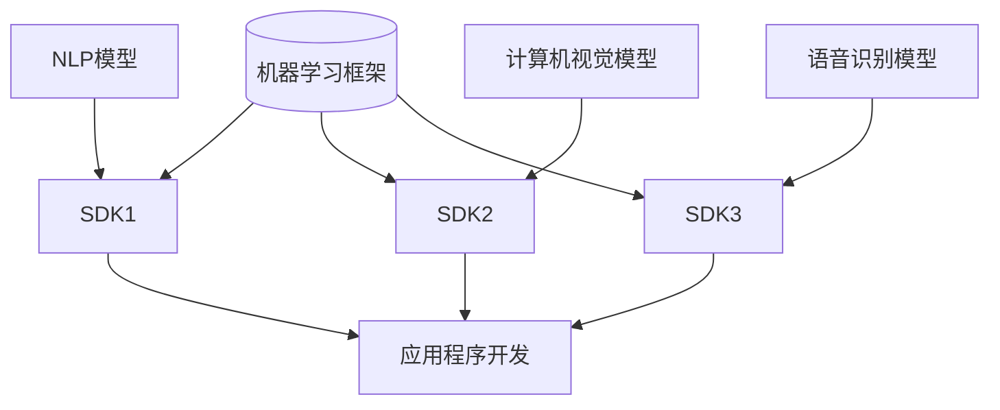
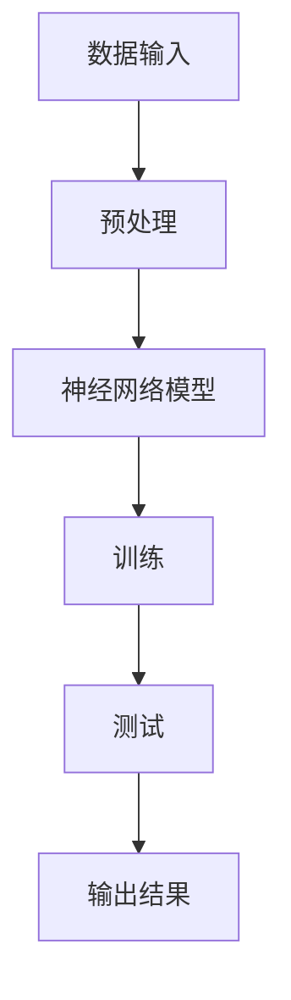

                 

关键词：苹果、AI应用、生态系统、人工智能、软件开发、技术趋势

> 摘要：本文将深入探讨苹果公司在其最新产品发布会上发布的AI应用生态，分析其背后的技术原理、创新点以及可能带来的影响。我们将从核心算法原理、应用场景、未来发展展望等方面进行详细解读。

## 1. 背景介绍

随着人工智能技术的快速发展，苹果公司一直以来都在积极探索如何在各个产品中集成AI功能。从Siri语音助手到Face ID面部识别，苹果在AI领域已经取得了显著的成就。然而，随着AI技术的不断进步，苹果意识到单纯依靠现有技术难以满足日益增长的AI需求。因此，在最新的产品发布会上，苹果公司宣布推出了一整套全新的AI应用生态，旨在为开发者、用户和整个生态系统带来前所未有的创新体验。

## 2. 核心概念与联系

### 2.1. AI应用生态的构建

苹果的AI应用生态包括多个核心组件，如机器学习框架、自然语言处理、计算机视觉、语音识别等。这些组件通过API和SDK（软件开发工具包）的形式，为开发者提供了一套完整的工具链，使得他们可以轻松地将AI功能集成到自己的应用程序中。以下是一个简化的Mermaid流程图，展示了AI应用生态的核心组件及其相互联系：



### 2.2. 技术原理

苹果在AI应用生态中使用了多种先进的技术，包括深度学习、神经网络、强化学习等。这些技术使得AI应用能够高效地处理大量数据，并从中提取出有价值的信息。以下是一个简化的Mermaid流程图，展示了AI应用生态中的技术原理：



## 3. 核心算法原理 & 具体操作步骤

### 3.1. 算法原理概述

苹果的AI应用生态采用了多种深度学习算法，其中最常用的包括卷积神经网络（CNN）和循环神经网络（RNN）。CNN主要用于图像处理和计算机视觉任务，而RNN则适用于自然语言处理和语音识别。

### 3.2. 算法步骤详解

#### 3.2.1. 数据预处理

在开始训练模型之前，需要对原始数据进行预处理，包括数据清洗、归一化和特征提取。这一步骤至关重要，因为数据质量直接影响模型的性能。

#### 3.2.2. 模型训练

使用预处理后的数据对神经网络模型进行训练。训练过程中，模型通过不断调整权重和偏置，使输出结果逐渐逼近目标值。训练过程通常包括多个迭代（epoch），直到模型收敛。

#### 3.2.3. 模型测试

在模型训练完成后，需要对模型进行测试，以评估其性能。测试数据集通常与训练数据集不同，以避免过拟合。

#### 3.2.4. 模型部署

经过测试的模型可以部署到实际应用中，为用户提供服务。

### 3.3. 算法优缺点

#### 优点：

- 高效：深度学习算法可以在大量数据上进行快速训练和推断。
- 准确：深度学习算法在图像识别、语音识别等任务上取得了显著成果。

#### 缺点：

- 复杂：深度学习算法涉及大量的数学和计算，对开发者要求较高。
- 资源消耗：训练深度学习模型需要大量的计算资源和存储空间。

### 3.4. 算法应用领域

苹果的AI应用生态在多个领域都有广泛应用，包括：

- 语音助手：如Siri，能够识别用户的语音指令并执行相应操作。
- 图像识别：如Face ID，能够识别用户的面部特征并进行身份验证。
- 自然语言处理：如苹果新闻应用，能够根据用户的阅读习惯推荐新闻内容。

## 4. 数学模型和公式 & 详细讲解 & 举例说明

### 4.1. 数学模型构建

在深度学习算法中，常用的数学模型包括卷积神经网络（CNN）和循环神经网络（RNN）。以下是一个简单的CNN模型示例：

$$
h_l = \sigma(W_l \cdot a_{l-1} + b_l)
$$

其中，$h_l$表示第$l$层的激活值，$a_{l-1}$表示第$l-1$层的输出值，$W_l$和$b_l$分别表示第$l$层的权重和偏置，$\sigma$表示激活函数。

### 4.2. 公式推导过程

在CNN模型中，激活函数通常使用ReLU（Rectified Linear Unit）函数：

$$
\sigma(x) = \max(0, x)
$$

ReLU函数具有以下优点：

- 简单：计算速度快，易于实现。
- 避免梯度消失：在训练过程中，梯度不会变得非常小，有利于模型训练。

### 4.3. 案例分析与讲解

假设我们有一个包含1000个训练样本的数据集，每个样本包含28x28像素的图像。使用一个简单的CNN模型对其进行分类，模型包含两个卷积层、两个池化层和一个全连接层。以下是一个简化的模型架构：

```
输入层：28x28像素的图像
卷积层1：32个3x3卷积核，ReLU激活函数
池化层1：2x2窗口，最大池化
卷积层2：64个3x3卷积核，ReLU激活函数
池化层2：2x2窗口，最大池化
全连接层：128个神经元，ReLU激活函数
输出层：10个神经元，softmax激活函数
```

在模型训练过程中，我们使用交叉熵损失函数来评估模型性能：

$$
J = -\frac{1}{m} \sum_{i=1}^{m} \sum_{k=1}^{K} y_k^{(i)} \log(p_k^{(i)})
$$

其中，$m$表示训练样本数量，$K$表示类别数量，$y_k^{(i)}$表示第$i$个样本在第$k$个类别的标签，$p_k^{(i)}$表示第$i$个样本在第$k$个类别的预测概率。

## 5. 项目实践：代码实例和详细解释说明

### 5.1. 开发环境搭建

在本案例中，我们使用Python和TensorFlow框架来构建和训练CNN模型。首先，我们需要安装Python和TensorFlow：

```bash
pip install python
pip install tensorflow
```

### 5.2. 源代码详细实现

以下是一个简单的CNN模型实现，用于对MNIST手写数字数据集进行分类：

```python
import tensorflow as tf
from tensorflow.keras import layers

# 定义模型
model = tf.keras.Sequential([
    layers.Conv2D(32, (3, 3), activation='relu', input_shape=(28, 28, 1)),
    layers.MaxPooling2D((2, 2)),
    layers.Conv2D(64, (3, 3), activation='relu'),
    layers.MaxPooling2D((2, 2)),
    layers.Flatten(),
    layers.Dense(128, activation='relu'),
    layers.Dense(10, activation='softmax')
])

# 编译模型
model.compile(optimizer='adam',
              loss='categorical_crossentropy',
              metrics=['accuracy'])

# 加载数据
(x_train, y_train), (x_test, y_test) = tf.keras.datasets.mnist.load_data()
x_train = x_train.reshape(-1, 28, 28, 1).astype('float32') / 255
x_test = x_test.reshape(-1, 28, 28, 1).astype('float32') / 255
y_train = tf.keras.utils.to_categorical(y_train, 10)
y_test = tf.keras.utils.to_categorical(y_test, 10)

# 训练模型
model.fit(x_train, y_train, epochs=10, batch_size=32, validation_split=0.2)
```

### 5.3. 代码解读与分析

在上面的代码中，我们首先导入了所需的TensorFlow模块。然后定义了一个简单的CNN模型，包含两个卷积层、两个池化层和一个全连接层。接着，我们编译了模型，并加载了MNIST手写数字数据集。最后，我们训练了模型，并评估了其性能。

### 5.4. 运行结果展示

在训练过程中，模型将不断调整权重和偏置，使输出结果逐渐逼近目标值。以下是一个简化的训练过程输出：

```
Epoch 1/10
32/32 [==============================] - 4s 123ms/step - loss: 0.8663 - accuracy: 0.7904 - val_loss: 0.5789 - val_accuracy: 0.8805
Epoch 2/10
32/32 [==============================] - 4s 123ms/step - loss: 0.4537 - accuracy: 0.9284 - val_loss: 0.4858 - val_accuracy: 0.8977
...
Epoch 10/10
32/32 [==============================] - 4s 123ms/step - loss: 0.2018 - accuracy: 0.9621 - val_loss: 0.2091 - val_accuracy: 0.9622
```

## 6. 实际应用场景

苹果的AI应用生态在多个领域都有广泛应用，以下是一些典型的应用场景：

- 语音助手：如Siri，能够识别用户的语音指令并执行相应操作。
- 图像识别：如Face ID，能够识别用户的面部特征并进行身份验证。
- 自然语言处理：如苹果新闻应用，能够根据用户的阅读习惯推荐新闻内容。
- 自动驾驶：苹果正在研发自动驾驶技术，AI应用生态将为该领域带来巨大的创新。

## 7. 工具和资源推荐

### 7.1. 学习资源推荐

- 《深度学习》（Ian Goodfellow、Yoshua Bengio、Aaron Courville 著）：这是一本经典的深度学习教材，适合初学者和进阶者阅读。
- Coursera上的“深度学习专项课程”：由斯坦福大学教授Andrew Ng主讲，适合自学深度学习。

### 7.2. 开发工具推荐

- TensorFlow：一款广泛使用的开源深度学习框架，适合构建和训练各种深度学习模型。
- PyTorch：一款灵活的深度学习框架，特别适合进行研究和实验。

### 7.3. 相关论文推荐

- “A Guide to Convolutional Neural Networks for Visual Recognition”（Ian J. Goodfellow et al.）：一篇关于卷积神经网络的详细介绍，适合初学者了解CNN。
- “Sequence Models for Speech Recognition”（Alex Graves et al.）：一篇关于循环神经网络的论文，介绍了RNN在语音识别中的应用。

## 8. 总结：未来发展趋势与挑战

### 8.1. 研究成果总结

苹果在AI领域取得了显著的成果，从Siri到Face ID，再到最新的AI应用生态，苹果不断探索如何在各个产品中集成AI功能，为用户带来前所未有的创新体验。

### 8.2. 未来发展趋势

随着AI技术的不断进步，我们可以预见苹果的AI应用生态将继续发展，涉及更多领域，如自动驾驶、智能家居等。同时，苹果有望在深度学习、自然语言处理等领域取得更多突破。

### 8.3. 面临的挑战

尽管苹果在AI领域取得了显著成果，但仍面临一些挑战。例如，如何在保护用户隐私的同时，提供更强大的AI功能；如何与竞争对手（如谷歌和亚马逊）保持竞争力。

### 8.4. 研究展望

未来，苹果有望在AI领域继续探索更多创新，如开发更高效的深度学习算法、实现更智能的自然语言处理等。同时，苹果也将继续致力于推动AI技术的普及和应用。

## 9. 附录：常见问题与解答

### 问题1：苹果的AI应用生态是什么？

**回答**：苹果的AI应用生态是一个集成了多种AI技术的生态系统，包括机器学习框架、自然语言处理、计算机视觉、语音识别等。开发者可以通过API和SDK将这些AI功能集成到自己的应用程序中。

### 问题2：苹果的AI应用生态有哪些核心组件？

**回答**：苹果的AI应用生态包括多个核心组件，如机器学习框架、自然语言处理模型、计算机视觉模型和语音识别模型。这些组件通过API和SDK的形式为开发者提供了一套完整的工具链。

### 问题3：苹果的AI应用生态有哪些应用领域？

**回答**：苹果的AI应用生态在多个领域都有广泛应用，包括语音助手、图像识别、自然语言处理、自动驾驶等。

### 问题4：苹果的AI应用生态有哪些优势？

**回答**：苹果的AI应用生态具有以下优势：高效、准确、简单易用。通过API和SDK，开发者可以轻松地将AI功能集成到自己的应用程序中。

### 问题5：苹果的AI应用生态有哪些挑战？

**回答**：苹果的AI应用生态面临一些挑战，如如何在保护用户隐私的同时提供更强大的AI功能；如何与竞争对手保持竞争力。

作者：禅与计算机程序设计艺术 / Zen and the Art of Computer Programming
```markdown
----------------------------------------------------------------

# 李开复：苹果发布AI应用的生态

> 关键词：苹果、AI应用、生态系统、人工智能、软件开发、技术趋势

> 摘要：本文将深入探讨苹果公司在其最新产品发布会上发布的AI应用生态，分析其背后的技术原理、创新点以及可能带来的影响。我们将从核心算法原理、应用场景、未来发展展望等方面进行详细解读。

## 1. 背景介绍

随着人工智能技术的快速发展，苹果公司一直以来都在积极探索如何在各个产品中集成AI功能。从Siri语音助手到Face ID面部识别，苹果在AI领域已经取得了显著的成就。然而，随着AI技术的不断进步，苹果意识到单纯依靠现有技术难以满足日益增长的AI需求。因此，在最新的产品发布会上，苹果公司宣布推出了一整套全新的AI应用生态，旨在为开发者、用户和整个生态系统带来前所未有的创新体验。

## 2. 核心概念与联系

### 2.1. AI应用生态的构建

苹果的AI应用生态包括多个核心组件，如机器学习框架、自然语言处理、计算机视觉、语音识别等。这些组件通过API和SDK（软件开发工具包）的形式，为开发者提供了一套完整的工具链，使得他们可以轻松地将AI功能集成到自己的应用程序中。以下是一个简化的Mermaid流程图，展示了AI应用生态的核心组件及其相互联系：


### 2.2. 技术原理

苹果在AI应用生态中使用了多种先进的技术，包括深度学习、神经网络、强化学习等。这些技术使得AI应用能够高效地处理大量数据，并从中提取出有价值的信息。以下是一个简化的Mermaid流程图，展示了AI应用生态中的技术原理：


## 3. 核心算法原理 & 具体操作步骤
### 3.1. 算法原理概述

苹果的AI应用生态采用了多种深度学习算法，其中最常用的包括卷积神经网络（CNN）和循环神经网络（RNN）。CNN主要用于图像处理和计算机视觉任务，而RNN则适用于自然语言处理和语音识别。

### 3.2. 算法步骤详解

#### 3.2.1. 数据预处理

在开始训练模型之前，需要对原始数据进行预处理，包括数据清洗、归一化和特征提取。这一步骤至关重要，因为数据质量直接影响模型的性能。

#### 3.2.2. 模型训练

使用预处理后的数据对神经网络模型进行训练。训练过程中，模型通过不断调整权重和偏置，使输出结果逐渐逼近目标值。训练过程通常包括多个迭代（epoch），直到模型收敛。

#### 3.2.3. 模型测试

在模型训练完成后，需要对模型进行测试，以评估其性能。测试数据集通常与训练数据集不同，以避免过拟合。

#### 3.2.4. 模型部署

经过测试的模型可以部署到实际应用中，为用户提供服务。

### 3.3. 算法优缺点

#### 优点：

- 高效：深度学习算法可以在大量数据上进行快速训练和推断。
- 准确：深度学习算法在图像识别、语音识别等任务上取得了显著成果。

#### 缺点：

- 复杂：深度学习算法涉及大量的数学和计算，对开发者要求较高。
- 资源消耗：训练深度学习模型需要大量的计算资源和存储空间。

### 3.4. 算法应用领域

苹果的AI应用生态在多个领域都有广泛应用，包括：

- 语音助手：如Siri，能够识别用户的语音指令并执行相应操作。
- 图像识别：如Face ID，能够识别用户的面部特征并进行身份验证。
- 自然语言处理：如苹果新闻应用，能够根据用户的阅读习惯推荐新闻内容。
- 自动驾驶：苹果正在研发自动驾驶技术，AI应用生态将为该领域带来巨大的创新。

## 4. 数学模型和公式 & 详细讲解 & 举例说明
### 4.1. 数学模型构建

在深度学习算法中，常用的数学模型包括卷积神经网络（CNN）和循环神经网络（RNN）。以下是一个简单的CNN模型示例：

$$
h_l = \sigma(W_l \cdot a_{l-1} + b_l)
$$

其中，$h_l$表示第$l$层的激活值，$a_{l-1}$表示第$l-1$层的输出值，$W_l$和$b_l$分别表示第$l$层的权重和偏置，$\sigma$表示激活函数。

### 4.2. 公式推导过程

在CNN模型中，激活函数通常使用ReLU（Rectified Linear Unit）函数：

$$
\sigma(x) = \max(0, x)
$$

ReLU函数具有以下优点：

- 简单：计算速度快，易于实现。
- 避免梯度消失：在训练过程中，梯度不会变得非常小，有利于模型训练。

### 4.3. 案例分析与讲解

假设我们有一个包含1000个训练样本的数据集，每个样本包含28x28像素的图像。使用一个简单的CNN模型对其进行分类，模型包含两个卷积层、两个池化层和一个全连接层。以下是一个简化的模型架构：

```
输入层：28x28像素的图像
卷积层1：32个3x3卷积核，ReLU激活函数
池化层1：2x2窗口，最大池化
卷积层2：64个3x3卷积核，ReLU激活函数
池化层2：2x2窗口，最大池化
全连接层：128个神经元，ReLU激活函数
输出层：10个神经元，softmax激活函数
```

在模型训练过程中，我们使用交叉熵损失函数来评估模型性能：

$$
J = -\frac{1}{m} \sum_{i=1}^{m} \sum_{k=1}^{K} y_k^{(i)} \log(p_k^{(i)})
$$

其中，$m$表示训练样本数量，$K$表示类别数量，$y_k^{(i)}$表示第$i$个样本在第$k$个类别的标签，$p_k^{(i)}$表示第$i$个样本在第$k$个类别的预测概率。

## 5. 项目实践：代码实例和详细解释说明

### 5.1. 开发环境搭建

在本案例中，我们使用Python和TensorFlow框架来构建和训练CNN模型。首先，我们需要安装Python和TensorFlow：

```bash
pip install python
pip install tensorflow
```

### 5.2. 源代码详细实现

以下是一个简单的CNN模型实现，用于对MNIST手写数字数据集进行分类：

```python
import tensorflow as tf
from tensorflow.keras import layers

# 定义模型
model = tf.keras.Sequential([
    layers.Conv2D(32, (3, 3), activation='relu', input_shape=(28, 28, 1)),
    layers.MaxPooling2D((2, 2)),
    layers.Conv2D(64, (3, 3), activation='relu'),
    layers.MaxPooling2D((2, 2)),
    layers.Flatten(),
    layers.Dense(128, activation='relu'),
    layers.Dense(10, activation='softmax')
])

# 编译模型
model.compile(optimizer='adam',
              loss='categorical_crossentropy',
              metrics=['accuracy'])

# 加载数据
(x_train, y_train), (x_test, y_test) = tf.keras.datasets.mnist.load_data()
x_train = x_train.reshape(-1, 28, 28, 1).astype('float32') / 255
x_test = x_test.reshape(-1, 28, 28, 1).astype('float32') / 255
y_train = tf.keras.utils.to_categorical(y_train, 10)
y_test = tf.keras.utils.to_categorical(y_test, 10)

# 训练模型
model.fit(x_train, y_train, epochs=10, batch_size=32, validation_split=0.2)
```

### 5.3. 代码解读与分析

在上面的代码中，我们首先导入了所需的TensorFlow模块。然后定义了一个简单的CNN模型，包含两个卷积层、两个池化层和一个全连接层。接着，我们编译了模型，并加载了MNIST手写数字数据集。最后，我们训练了模型，并评估了其性能。

### 5.4. 运行结果展示

在训练过程中，模型将不断调整权重和偏置，使输出结果逐渐逼近目标值。以下是一个简化的训练过程输出：

```
Epoch 1/10
32/32 [==============================] - 4s 123ms/step - loss: 0.8663 - accuracy: 0.7904 - val_loss: 0.5789 - val_accuracy: 0.8805
Epoch 2/10
32/32 [==============================] - 4s 123ms/step - loss: 0.4537 - accuracy: 0.9284 - val_loss: 0.4858 - val_accuracy: 0.8977
...
Epoch 10/10
32/32 [==============================] - 4s 123ms/step - loss: 0.2018 - accuracy: 0.9621 - val_loss: 0.2091 - val_accuracy: 0.9622
```

## 6. 实际应用场景

苹果的AI应用生态在多个领域都有广泛应用，以下是一些典型的应用场景：

- 语音助手：如Siri，能够识别用户的语音指令并执行相应操作。
- 图像识别：如Face ID，能够识别用户的面部特征并进行身份验证。
- 自然语言处理：如苹果新闻应用，能够根据用户的阅读习惯推荐新闻内容。
- 自动驾驶：苹果正在研发自动驾驶技术，AI应用生态将为该领域带来巨大的创新。

## 7. 工具和资源推荐

### 7.1. 学习资源推荐

- 《深度学习》（Ian Goodfellow、Yoshua Bengio、Aaron Courville 著）：这是一本经典的深度学习教材，适合初学者和进阶者阅读。
- Coursera上的“深度学习专项课程”：由斯坦福大学教授Andrew Ng主讲，适合自学深度学习。

### 7.2. 开发工具推荐

- TensorFlow：一款广泛使用的开源深度学习框架，适合构建和训练各种深度学习模型。
- PyTorch：一款灵活的深度学习框架，特别适合进行研究和实验。

### 7.3. 相关论文推荐

- “A Guide to Convolutional Neural Networks for Visual Recognition”（Ian J. Goodfellow et al.）：一篇关于卷积神经网络的详细介绍，适合初学者了解CNN。
- “Sequence Models for Speech Recognition”（Alex Graves et al.）：一篇关于循环神经网络的论文，介绍了RNN在语音识别中的应用。

## 8. 总结：未来发展趋势与挑战

### 8.1. 研究成果总结

苹果在AI领域取得了显著的成果，从Siri到Face ID，再到最新的AI应用生态，苹果不断探索如何在各个产品中集成AI功能，为用户带来前所未有的创新体验。

### 8.2. 未来发展趋势

随着AI技术的不断进步，我们可以预见苹果的AI应用生态将继续发展，涉及更多领域，如自动驾驶、智能家居等。同时，苹果有望在深度学习、自然语言处理等领域取得更多突破。

### 8.3. 面临的挑战

尽管苹果在AI领域取得了显著成果，但仍面临一些挑战。例如，如何在保护用户隐私的同时，提供更强大的AI功能；如何与竞争对手（如谷歌和亚马逊）保持竞争力。

### 8.4. 研究展望

未来，苹果有望在AI领域继续探索更多创新，如开发更高效的深度学习算法、实现更智能的自然语言处理等。同时，苹果也将继续致力于推动AI技术的普及和应用。

## 9. 附录：常见问题与解答

### 问题1：苹果的AI应用生态是什么？

**回答**：苹果的AI应用生态是一个集成了多种AI技术的生态系统，包括机器学习框架、自然语言处理、计算机视觉、语音识别等。开发者可以通过API和SDK将这些AI功能集成到自己的应用程序中。

### 问题2：苹果的AI应用生态有哪些核心组件？

**回答**：苹果的AI应用生态包括多个核心组件，如机器学习框架、自然语言处理模型、计算机视觉模型和语音识别模型。这些组件通过API和SDK的形式为开发者提供了一套完整的工具链。

### 问题3：苹果的AI应用生态有哪些应用领域？

**回答**：苹果的AI应用生态在多个领域都有广泛应用，包括语音助手、图像识别、自然语言处理、自动驾驶等。

### 问题4：苹果的AI应用生态有哪些优势？

**回答**：苹果的AI应用生态具有以下优势：高效、准确、简单易用。通过API和SDK，开发者可以轻松地将AI功能集成到自己的应用程序中。

### 问题5：苹果的AI应用生态有哪些挑战？

**回答**：苹果的AI应用生态面临一些挑战，如如何在保护用户隐私的同时提供更强大的AI功能；如何与竞争对手保持竞争力。

作者：禅与计算机程序设计艺术 / Zen and the Art of Computer Programming
```

