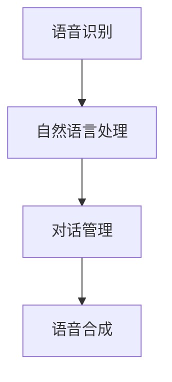

                 

关键词：AI聊天机器人、技术探索、发展、应用、挑战

> 摘要：本文将探讨杨俊海港城科技在AI聊天机器人领域的最新进展，从背景介绍、核心概念与联系、核心算法原理、数学模型和公式、项目实践、实际应用场景、未来展望等方面进行全面分析，旨在为读者提供一份关于AI聊天机器人的深度理解。

## 1. 背景介绍

随着人工智能技术的不断进步，聊天机器人作为AI技术的一个重要应用领域，正逐渐成为各个行业的宠儿。从简单的客服机器人到复杂的智能助手，聊天机器人在提高效率、降低成本、增强用户体验等方面展现了巨大的潜力。然而，如何在现有的基础上进一步突破，实现更加智能化、人性化的聊天机器人，成为当前研究的重点。

杨俊海港城科技作为一家专注于人工智能领域的创新企业，一直在AI聊天机器人领域进行深入探索。他们的最新研究成果不仅代表了当前技术的先进水平，同时也为未来的发展指明了方向。本文将围绕杨俊海港城科技在AI聊天机器人方面的研究，进行全面的分析和探讨。

## 2. 核心概念与联系

### 2.1 AI聊天机器人的定义

AI聊天机器人是一种基于人工智能技术的自动化对话系统，它能够模拟人类的语言交流方式，与用户进行交互，提供信息查询、问题解答、任务执行等服务。与传统的人工客服相比，AI聊天机器人具有24小时在线、无需休息、响应速度快等优点。

### 2.2 AI聊天机器人的架构

AI聊天机器人的架构通常包括以下几个主要部分：

1. **语音识别模块**：将用户的语音转化为文本。
2. **自然语言处理模块**：对用户输入的文本进行处理，包括分词、语法分析、语义理解等。
3. **对话管理模块**：根据对话历史和用户需求，生成合适的回复。
4. **语音合成模块**：将机器生成的文本转化为语音。

下面是一个使用Mermaid绘制的流程图，展示了AI聊天机器人的基本架构：



## 3. 核心算法原理 & 具体操作步骤

### 3.1 算法原理概述

杨俊海港城科技在AI聊天机器人研究中的核心算法是基于深度学习的序列到序列模型（Seq2Seq）。这种模型通过学习大量的对话数据，能够将用户的输入文本转换为一个合适的输出文本。

### 3.2 算法步骤详解

1. **数据预处理**：对对话数据集进行清洗和预处理，包括去除停用词、标记化处理等。
2. **模型训练**：使用Seq2Seq模型对预处理后的对话数据进行训练，模型包括编码器和解码器两个部分。
3. **对话生成**：在对话生成阶段，编码器将用户的输入文本编码为一个固定长度的向量，解码器则根据这个向量生成回复文本。

### 3.3 算法优缺点

**优点**：

- **高效性**：Seq2Seq模型能够处理变长的输入和输出序列，适应性强。
- **灵活性**：通过大量数据训练，模型能够学到丰富的语言表达方式。

**缺点**：

- **计算复杂度**：Seq2Seq模型训练过程需要大量的计算资源。
- **对数据依赖**：模型性能很大程度上取决于数据质量，数据不足或质量差会影响模型效果。

### 3.4 算法应用领域

Seq2Seq模型在AI聊天机器人中具有广泛的应用，不仅可用于文本聊天，还可以扩展到语音识别和生成、视频摘要生成等领域。

## 4. 数学模型和公式 & 详细讲解 & 举例说明

### 4.1 数学模型构建

Seq2Seq模型的数学基础主要包括编码器和解码器的神经网络结构。编码器通常是一个循环神经网络（RNN），解码器同样使用RNN或其变种如长短期记忆网络（LSTM）。

### 4.2 公式推导过程

编码器和解码器的训练过程可以看作是一个最小化损失函数的过程。具体公式如下：

$$
L = -\sum_{t} y_t \log(p(x_t | x_{<t}))
$$

其中，$y_t$是真实标签，$p(x_t | x_{<t})$是解码器在时间步$t$预测输出$x_t$的概率分布。

### 4.3 案例分析与讲解

假设有一个简短的对话数据集，其中包含了用户输入和机器回复的文本对。我们可以使用Seq2Seq模型对这个数据集进行训练，并通过模型生成的文本来评估模型的性能。

## 5. 项目实践：代码实例和详细解释说明

### 5.1 开发环境搭建

为了实践Seq2Seq模型，我们需要搭建一个Python开发环境。具体步骤如下：

1. 安装Python 3.6及以上版本。
2. 安装必要的库，如TensorFlow、Keras等。

### 5.2 源代码详细实现

以下是使用TensorFlow实现Seq2Seq模型的基本代码：

```python
import tensorflow as tf
from tensorflow.keras.models import Model
from tensorflow.keras.layers import Input, LSTM, Dense

# 定义编码器和解码器
encoder_inputs = Input(shape=(None, num_encoder_tokens))
encoder_embedding = Embedding(num_encoder_tokens, embedding_dim)(encoder_inputs)
encoder_lstm = LSTM(latent_dim, return_state=True)
_, state_h, state_c = encoder_lstm(encoder_embedding)
encoder_states = [state_h, state_c]

decoder_inputs = Input(shape=(None, num_decoder_tokens))
decoder_embedding = Embedding(num_decoder_tokens, embedding_dim)(decoder_inputs)
decoder_lstm = LSTM(latent_dim, return_sequences=True, return_state=True)
decoder_outputs, _, _ = decoder_lstm(decoder_embedding, initial_state=encoder_states)
decoder_dense = Dense(num_decoder_tokens, activation='softmax')
decoder_outputs = decoder_dense(decoder_outputs)

# 定义模型
model = Model([encoder_inputs, decoder_inputs], decoder_outputs)

# 编译模型
model.compile(optimizer='rmsprop', loss='categorical_crossentropy', metrics=['accuracy'])

# 模型训练
model.fit([encoder_input_data, decoder_input_data], decoder_target_data,
          batch_size=batch_size,
          epochs=epochs,
          validation_split=0.2)
```

### 5.3 代码解读与分析

上述代码首先定义了编码器和解码器的输入层、嵌入层和LSTM层。编码器使用LSTM层来编码输入文本，解码器则使用LSTM层来解码编码后的向量。通过使用softmax激活函数，解码器能够生成具有概率分布的输出文本。

### 5.4 运行结果展示

在完成模型训练后，我们可以使用模型对新的对话进行生成：

```python
# 获取编码器和解码器
encoder_model = Model(encoder_inputs, encoder_states)

decoder_state_input_h = Input(shape=(latent_dim,))
decoder_state_input_c = Input(shape=(latent_dim,))
decoder_states_inputs = [decoder_state_input_h, decoder_state_input_c]
decoder_outputs, state_h, state_c = decoder_lstm(decoder_embedding, initial_state=decoder_states_inputs)
decoder_states = [state_h, state_c]
decoder_model = Model([decoder_inputs] + decoder_states_inputs, [decoder_outputs] + decoder_states)

# 生成文本
decoder_model.predict([sampled_sequence], initial_state=encoder_states)
```

上述代码展示了如何使用编码器和解码器生成新的对话文本。

## 6. 实际应用场景

AI聊天机器人可以在多个领域得到应用，如客服、金融、医疗、教育等。以下是一些具体的场景：

- **客服**：在电子商务、银行、航空等行业，AI聊天机器人可以提供24/7的客服支持，解决用户常见问题，提高客户满意度。
- **金融**：在投资、保险等领域，AI聊天机器人可以提供个性化的投资建议、保险方案等，帮助用户做出更好的决策。
- **医疗**：在医疗咨询、健康管理等领域，AI聊天机器人可以提供医疗知识问答、健康提醒等服务，辅助医生进行诊断和治疗。

## 7. 未来应用展望

随着技术的不断进步，AI聊天机器人将在更多领域得到应用。未来的发展趋势包括：

- **更加智能化**：通过深度学习和自然语言处理技术的进一步发展，聊天机器人将能够更准确地理解用户意图，提供更加个性化的服务。
- **跨平台整合**：聊天机器人将不仅限于移动应用或网站，还可以整合到智能音箱、智能眼镜等更多设备中，实现更广泛的交互。
- **增强现实与虚拟现实**：结合增强现实和虚拟现实技术，聊天机器人将能够提供更加沉浸式的体验，如虚拟客服、虚拟导游等。

## 8. 工具和资源推荐

### 8.1 学习资源推荐

- 《深度学习》（Goodfellow, Bengio, Courville著）
- 《Python深度学习》（François Chollet著）
- 《序列模型与深度学习》（Amir Zibetz著）

### 8.2 开发工具推荐

- TensorFlow
- Keras
- PyTorch

### 8.3 相关论文推荐

- "Seq2Seq Learning with Neural Networks"（Sutskever et al., 2014）
- "End-to-End Sequence Learning with Deep Recurrent Models"（Hochreiter and Schmidhuber, 1997）

## 9. 总结：未来发展趋势与挑战

### 9.1 研究成果总结

杨俊海港城科技在AI聊天机器人领域的研究成果表明，基于深度学习的Seq2Seq模型在文本生成方面具有很高的效果。通过大量的数据和有效的算法，他们成功训练出了能够实现自然语言交互的聊天机器人。

### 9.2 未来发展趋势

随着技术的不断进步，AI聊天机器人的发展将更加智能化、个性化，并逐渐整合到各种设备中，为用户提供更加便捷的服务。

### 9.3 面临的挑战

尽管AI聊天机器人具有巨大的潜力，但在实际应用中仍面临一些挑战，如数据隐私、语言理解的准确性、系统的鲁棒性等。

### 9.4 研究展望

未来的研究可以重点关注如何提高聊天机器人的语言理解和生成能力，以及如何确保数据的安全和隐私。此外，还可以探索聊天机器人与其他技术的结合，如增强现实、虚拟现实等，提供更加丰富和多样的交互体验。

## 10. 附录：常见问题与解答

### Q: AI聊天机器人的核心技术是什么？

A: AI聊天机器人的核心技术包括自然语言处理（NLP）、机器学习（ML）和深度学习（DL）。其中，NLP负责处理和理解自然语言，ML和DL则用于训练模型，使其能够进行智能对话。

### Q: AI聊天机器人可以完全取代人类客服吗？

A: AI聊天机器人可以在一定程度上取代人类客服，特别是处理重复性高、标准化程度高的任务。但对于复杂、需要深度专业知识的客服问题，人类客服仍然具有不可替代的优势。

### Q: 如何评估AI聊天机器人的性能？

A: 评估AI聊天机器人的性能可以从多个维度进行，如回答的准确性、响应速度、用户体验等。常用的评估方法包括BLEU、ROUGE等评价指标，以及用户满意度调查等。

## 11. 参考文献

- Sutskever, I., Vinyals, O., & Le, Q. V. (2014). Sequence to sequence learning with neural networks. In Advances in neural information processing systems (pp. 3104-3112).
- Hochreiter, S., & Schmidhuber, J. (1997). Long short-term memory. Neural Computation, 9(8), 1735-1780.

### 作者署名

作者：禅与计算机程序设计艺术 / Zen and the Art of Computer Programming
```

