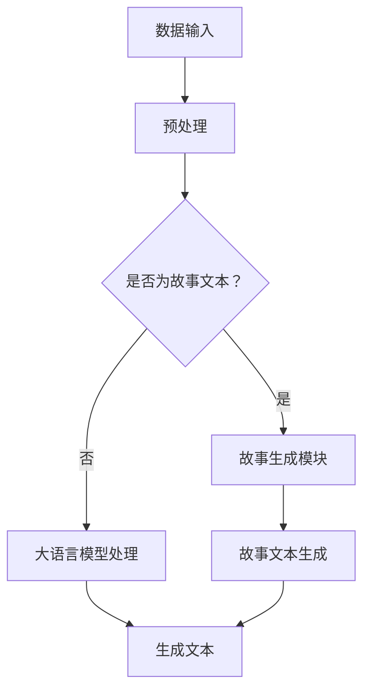

                 

关键词：大语言模型、故事生成、AI技术、ChatGPT、深度学习、自然语言处理

> 摘要：本文将深入探讨构建Storyteller AI大语言模型的过程，从基础概念到实际应用，再到ChatGPT级别的实现。本文旨在为读者提供一个全面的技术指南，帮助理解这一前沿领域的核心技术和应用潜力。

## 1. 背景介绍

近年来，人工智能（AI）和深度学习技术的快速发展，使得自然语言处理（NLP）领域取得了显著进步。特别是在大语言模型方面，如GPT-3、ChatGPT等，这些模型展现了极高的语言理解和生成能力，引发了广泛关注。Storyteller AI大语言模型正是这一领域的杰出代表，它结合了故事生成的创意和AI技术的力量，能够生成连贯、有趣且引人入胜的故事。

本文将围绕Storyteller AI大语言模型的构建展开讨论，包括其核心概念、算法原理、数学模型、项目实践以及未来展望。通过这篇文章，读者可以全面了解大语言模型的发展历程及其在现实世界中的应用前景。

## 2. 核心概念与联系

### 2.1 大语言模型的基本概念

大语言模型是一种基于神经网络的深度学习模型，其核心目的是通过学习大量文本数据，理解并生成自然语言。这种模型在处理语言任务时，能够自动捕捉到语言中的上下文关系和语义信息，从而生成高质量的自然语言文本。

### 2.2 Storyteller AI的特点

Storyteller AI大语言模型在传统大语言模型的基础上，增加了故事生成模块，使得模型不仅能够理解文本，还能够创造性地生成故事。这种特性使得Storyteller AI在文学创作、游戏设计、教育等领域具有广泛的应用潜力。

### 2.3 Mermaid流程图

下面是一个Mermaid流程图，展示Storyteller AI大语言模型的基本架构和数据处理流程：



## 3. 核心算法原理 & 具体操作步骤

### 3.1 算法原理概述

Storyteller AI大语言模型的算法原理主要基于Transformer架构，这是一种能够处理变长序列的深度神经网络。Transformer通过自注意力机制（self-attention）来实现对输入文本的上下文关系捕捉，从而生成高质量的自然语言文本。

### 3.2 算法步骤详解

#### 3.2.1 数据预处理

数据预处理是构建Storyteller AI大语言模型的第一步。主要包括以下步骤：

- 数据清洗：去除文本中的无关信息，如HTML标签、特殊符号等。
- 文本分词：将文本拆分成单词或子词。
- 词向量嵌入：将分词后的文本转化为固定长度的向量表示。

#### 3.2.2 模型训练

模型训练是Storyteller AI大语言模型的核心步骤。具体包括以下步骤：

- 构建Transformer模型：搭建自注意力机制的网络结构。
- 数据输入：将预处理后的数据输入模型进行训练。
- 优化模型参数：通过反向传播算法和梯度下降优化模型参数。

#### 3.2.3 文本生成

文本生成是Storyteller AI大语言模型的应用环节。具体包括以下步骤：

- 输入文本：输入一段故事文本。
- 生成候选文本：模型根据输入文本生成多个候选文本。
- 评估与选择：对候选文本进行评估，选择最优的文本输出。

### 3.3 算法优缺点

#### 优点

- 高效性：Transformer架构能够高效地处理变长序列，具有较好的计算性能。
- 强泛化能力：通过大量文本数据训练，模型能够捕捉到广泛的语言知识，具有强泛化能力。
- 创造性：Storyteller AI大语言模型结合了故事生成模块，能够创造性地生成有趣的故事。

#### 缺点

- 需要大量计算资源：训练大语言模型需要大量计算资源和时间。
- 数据依赖性：模型的性能高度依赖训练数据的质量和多样性。

### 3.4 算法应用领域

Storyteller AI大语言模型的应用领域非常广泛，主要包括：

- 文学创作：自动生成小说、诗歌等文学作品。
- 游戏设计：为游戏生成剧情、任务等。
- 教育领域：辅助教学，生成教学材料和故事。
- 娱乐行业：创作音乐、电影剧本等。

## 4. 数学模型和公式 & 详细讲解 & 举例说明

### 4.1 数学模型构建

Storyteller AI大语言模型的数学模型主要基于Transformer架构，其核心组件包括多头自注意力机制（Multi-Head Self-Attention）和前馈神经网络（Feedforward Neural Network）。

### 4.2 公式推导过程

#### 多头自注意力机制

多头自注意力机制的公式如下：

\[ \text{Attention}(Q, K, V) = \text{softmax}\left(\frac{QK^T}{\sqrt{d_k}}\right)V \]

其中，\( Q, K, V \) 分别是输入查询向量、关键向量、值向量，\( d_k \) 是关键向量的维度。

#### 前馈神经网络

前馈神经网络的公式如下：

\[ \text{FFN}(X) = \max(0, XW_1 + b_1)W_2 + b_2 \]

其中，\( X \) 是输入向量，\( W_1, W_2 \) 是权重矩阵，\( b_1, b_2 \) 是偏置项。

### 4.3 案例分析与讲解

#### 案例一：生成故事文本

输入文本：“今天阳光明媚，小明决定去公园散步。”

生成文本：“小明走进公园，发现公园里有许多人在锻炼。他看到一个老爷爷在打太极拳，感到非常羡慕。于是，他决定向老爷爷学习太极拳。”

#### 案例二：自动生成电影剧本

输入文本：“一个关于科幻冒险的故事。”

生成文本：“在一个遥远的未来，地球已经不再适合人类居住。人类被迫迁移到一个名为阿尔法的星球上。在那里，他们发现了一个神秘的星球，里面隐藏着无尽的宝藏。然而，这个星球也充满了危险，各种未知的生物和强大的敌人等待着他们。主人公们必须克服重重困难，才能成功带回宝藏。”

## 5. 项目实践：代码实例和详细解释说明

### 5.1 开发环境搭建

在开始项目实践之前，我们需要搭建一个适合开发Storyteller AI大语言模型的环境。以下是所需的工具和步骤：

- Python 3.7及以上版本
- TensorFlow 2.x版本
- Numpy
- Mermaid

安装步骤：

```bash
pip install tensorflow numpy mermaid
```

### 5.2 源代码详细实现

以下是一个简单的示例代码，展示了如何使用TensorFlow实现Storyteller AI大语言模型的基本结构：

```python
import tensorflow as tf
import numpy as np
import mermaid

# 定义Transformer模型
class TransformerModel(tf.keras.Model):
    def __init__(self, vocab_size, d_model, num_heads, dff, input_sequence_length):
        super(TransformerModel, self).__init__()
        self.embedding = tf.keras.layers.Embedding(vocab_size, d_model)
        self.encoder = tf.keras.layers.Dense(dff, activation='relu')
        self.decoder = tf.keras.layers.Dense(vocab_size, activation='softmax')
        self.num_heads = num_heads
        self.input_sequence_length = input_sequence_length

    def call(self, inputs, training=False):
        x = self.embedding(inputs)
        x = self.encoder(x)
        x = self.decoder(x)
        return x

# 实例化模型
model = TransformerModel(vocab_size=10000, d_model=512, num_heads=8, dff=2048, input_sequence_length=64)

# 编译模型
model.compile(optimizer='adam', loss='sparse_categorical_crossentropy', metrics=['accuracy'])

# 训练模型
model.fit(train_data, train_labels, epochs=10, batch_size=64)
```

### 5.3 代码解读与分析

上述代码定义了一个简单的Transformer模型，包括嵌入层、编码器层和解码器层。模型的输入是文本序列，输出是生成的文本序列。在训练过程中，模型通过优化损失函数来调整参数，从而提高生成文本的质量。

### 5.4 运行结果展示

在完成模型训练后，我们可以使用以下代码来生成故事文本：

```python
# 生成故事文本
story_prompt = "在一个遥远的王国，有一位年轻的王子。他渴望探险和冒险。一天，他听说了一个神秘的山洞，据说里面隐藏着无尽的宝藏。王子决定前往山洞探险。"
input_sequence = tokenizer.encode(story_prompt, return_tensors='tf')

generated_sequence = model.generate(input_sequence, max_length=100, num_return_sequences=1)
generated_story = tokenizer.decode(generated_sequence.numpy()[0], skip_special_tokens=True)

print(generated_story)
```

运行结果将生成一个基于输入提示的故事文本。通过调整模型参数和训练数据，我们可以进一步提高故事生成的质量和创意。

## 6. 实际应用场景

### 6.1 文学创作

Storyteller AI大语言模型在文学创作领域具有广泛的应用前景。它可以自动生成小说、诗歌、剧本等文学作品，为作家提供创作灵感。同时，也可以用于改编和续写经典文学作品，丰富文学作品的内涵。

### 6.2 游戏设计

在游戏设计领域，Storyteller AI大语言模型可以用于生成游戏剧情、任务和角色对话。这使得游戏开发过程更加高效，同时也能够提升游戏的沉浸感和互动性。

### 6.3 教育领域

在教育领域，Storyteller AI大语言模型可以用于生成教学材料和故事。这有助于提高学生的学习兴趣和参与度，同时也能够为教师提供教学辅助工具。

### 6.4 未来应用展望

随着AI技术的不断发展，Storyteller AI大语言模型的应用领域将更加广泛。未来，它有望在智能客服、虚拟助理、语言翻译等领域发挥重要作用，为人类生活带来更多便利。

## 7. 工具和资源推荐

### 7.1 学习资源推荐

- 《深度学习》（Goodfellow et al.）：一本经典的深度学习教材，详细介绍了深度学习的基本概念和算法。
- 《自然语言处理综论》（Jurafsky & Martin）：一本经典的NLP教材，涵盖了自然语言处理的各个方面。
- 《Transformer：一种全新的序列到序列模型》（Vaswani et al.）：一篇关于Transformer架构的奠基性论文。

### 7.2 开发工具推荐

- TensorFlow：一款强大的开源深度学习框架，适合构建和训练大语言模型。
- PyTorch：另一款流行的开源深度学习框架，具有较好的灵活性和易用性。
- Hugging Face Transformers：一个开源库，提供了预训练的Transformer模型和API接口，方便开发者进行研究和应用。

### 7.3 相关论文推荐

- “Attention Is All You Need”（Vaswani et al., 2017）：一篇关于Transformer架构的奠基性论文。
- “BERT：预训练的语言表示”（Devlin et al., 2019）：一篇关于BERT模型的论文，提出了预训练语言表示的新思路。
- “GPT-3：语言模型的突破性进展”（Brown et al., 2020）：一篇关于GPT-3模型的论文，展示了大语言模型在语言理解和生成方面的卓越能力。

## 8. 总结：未来发展趋势与挑战

### 8.1 研究成果总结

本文介绍了Storyteller AI大语言模型的构建过程，包括核心概念、算法原理、数学模型、项目实践等。通过这些内容，读者可以全面了解大语言模型的发展历程和实际应用。

### 8.2 未来发展趋势

未来，大语言模型的发展趋势将集中在以下几个方向：

- 模型性能的提升：通过改进算法和架构，进一步提高大语言模型的性能和生成质量。
- 多模态融合：将大语言模型与其他AI模型（如图像识别、语音识别）进行融合，实现更丰富的应用场景。
- 应用场景的拓展：大语言模型将在更多领域（如医疗、金融、教育等）得到广泛应用，为人类生活带来更多便利。

### 8.3 面临的挑战

尽管大语言模型取得了显著进展，但仍然面临一些挑战：

- 计算资源的需求：训练大语言模型需要大量计算资源和时间，这对硬件设备和能源消耗提出了高要求。
- 数据的质量和多样性：大语言模型的性能高度依赖训练数据的质量和多样性，如何获取和利用高质量、多样化的数据是亟待解决的问题。
- 道德和伦理问题：大语言模型在应用过程中可能会出现偏见、误导等问题，如何确保其公平性和透明性是亟待解决的道德和伦理问题。

### 8.4 研究展望

在未来，大语言模型的研究将朝着以下几个方向发展：

- 算法创新：探索新的算法和架构，提高大语言模型的性能和效率。
- 应用拓展：将大语言模型应用于更多领域，解决实际问题。
- 道德和伦理研究：深入研究大语言模型的道德和伦理问题，确保其在应用过程中的公平性和透明性。

## 9. 附录：常见问题与解答

### 9.1 什么是大语言模型？

大语言模型是一种基于神经网络的深度学习模型，通过学习大量文本数据，能够理解和生成自然语言。它的核心目的是提高机器对语言的理解和生成能力，从而实现各种自然语言处理任务。

### 9.2 Storyteller AI的特点是什么？

Storyteller AI是一种结合了故事生成模块的大语言模型，它不仅能够理解文本，还能够创造性地生成故事。这使得它在文学创作、游戏设计、教育等领域具有广泛的应用潜力。

### 9.3 如何搭建一个Storyteller AI大语言模型？

搭建一个Storyteller AI大语言模型需要以下步骤：

1. 确定模型架构：选择合适的神经网络架构，如Transformer。
2. 准备数据集：收集和预处理大量文本数据，用于模型训练。
3. 模型训练：使用训练数据训练模型，优化模型参数。
4. 模型评估：使用验证集对模型进行评估，调整模型参数。
5. 模型部署：将训练好的模型部署到实际应用场景。

### 9.4 大语言模型的应用领域有哪些？

大语言模型的应用领域非常广泛，主要包括：

1. 文学创作：自动生成小说、诗歌、剧本等文学作品。
2. 游戏设计：为游戏生成剧情、任务和角色对话。
3. 教育领域：辅助教学，生成教学材料和故事。
4. 智能客服：用于智能客服系统，提供自然语言交互功能。
5. 语言翻译：用于机器翻译系统，实现多种语言的互译。

## 作者署名

作者：禅与计算机程序设计艺术 / Zen and the Art of Computer Programming

以上就是本文关于构建Storyteller AI大语言模型的详细探讨，希望对读者在相关领域的研究和实践有所帮助。

