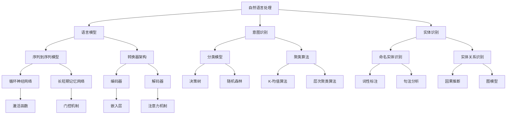

                 

关键词：聊天机器人、NLP、机器学习、人工智能、编程、自然语言处理、构建指南

<|assistant|>摘要：本文将深入探讨如何构建你自己的聊天机器人。从背景介绍、核心概念与联系，到核心算法原理、数学模型和项目实践，本文将为初学者提供一份全面的技术指南。我们将介绍相关的工具和资源，并展望未来的发展趋势和挑战。

## 1. 背景介绍

在当今数字化时代，聊天机器人已经成为与用户互动的重要方式。从简单的客户服务代表到复杂的个人助理，聊天机器人在多个领域展现出了其巨大的潜力。然而，对于许多初学者来说，构建自己的聊天机器人可能显得有些困难。本文旨在帮助这些初学者了解构建聊天机器人所需的基本知识和技能。

### 1.1 聊天机器人的定义和功能

聊天机器人是一种基于人工智能技术，能够通过文本或语音与人类进行交互的软件程序。它们可以执行各种任务，包括回答常见问题、提供个性化建议、完成日常任务等。聊天机器人的核心在于自然语言处理（NLP），这是使机器能够理解人类语言的关键技术。

### 1.2 聊天机器人的应用场景

聊天机器人的应用场景非常广泛。在客户服务中，它们可以提供24/7的支持，提高客户满意度并降低运营成本。在教育领域，聊天机器人可以作为虚拟导师，为学生提供个性化的学习体验。在医疗保健领域，聊天机器人可以帮助患者管理健康记录、提供医疗建议等。

## 2. 核心概念与联系

在构建聊天机器人之前，我们需要了解一些核心概念和它们之间的联系。以下是构建聊天机器人所需的核心概念及其相互关系的Mermaid流程图：



### 2.1 自然语言处理

自然语言处理（NLP）是使计算机理解和生成人类语言的技术。它包括文本分类、情感分析、命名实体识别等任务。

### 2.2 语言模型

语言模型是NLP的核心，它用于预测下一个单词或词组。常见的语言模型有基于统计的方法和基于神经网络的深度学习方法。

### 2.3 意图识别

意图识别是确定用户输入的目的或意图的过程。它可以帮助聊天机器人理解用户的请求，并采取相应的行动。

### 2.4 实体识别

实体识别是识别文本中的特定实体，如人名、地点、组织等。它是构建智能聊天机器人的关键步骤。

## 3. 核心算法原理 & 具体操作步骤

### 3.1 算法原理概述

构建聊天机器人的核心算法主要包括：

- **序列到序列（Seq2Seq）模型**：用于将一个序列转换为另一个序列，如将用户输入转换为相应的响应。
- **转换器架构**：包括编码器和解码器，用于处理输入和输出序列。
- **循环神经网络（RNN）和长短期记忆（LSTM）网络**：用于处理序列数据，具有记忆功能。
- **分类模型**：用于分类任务，如意图识别和实体识别。
- **聚类算法**：用于对用户输入进行聚类，以便更好地理解用户的意图。

### 3.2 算法步骤详解

构建聊天机器人的具体步骤如下：

1. **数据收集与预处理**：收集用户输入和相应的响应数据，并进行预处理，如去除停用词、进行词干提取等。
2. **建立语言模型**：使用预处理后的数据训练序列到序列模型或转换器架构，以生成高质量的响应。
3. **意图识别**：使用分类模型对用户输入进行意图分类，以确定用户请求的类型。
4. **实体识别**：使用命名实体识别算法提取用户输入中的关键实体。
5. **响应生成**：根据意图和实体，生成相应的响应。

### 3.3 算法优缺点

- **序列到序列模型**：具有较好的生成能力，但计算复杂度高。
- **转换器架构**：在处理长序列时表现较好，但训练时间较长。
- **RNN和LSTM网络**：具有记忆功能，但在处理长序列时容易出现梯度消失或爆炸问题。
- **分类模型**：计算复杂度较低，但在处理复杂任务时可能不够强大。
- **聚类算法**：可以帮助理解用户的意图，但在处理多样性较大的数据时可能不够准确。

### 3.4 算法应用领域

核心算法在多个领域具有广泛的应用，包括：

- **客户服务**：提供24/7的客户支持，降低运营成本。
- **教育**：为学生提供个性化的学习体验。
- **医疗保健**：帮助患者管理健康记录、提供医疗建议。
- **金融**：提供投资建议、自动交易等。

## 4. 数学模型和公式 & 详细讲解 & 举例说明

### 4.1 数学模型构建

构建聊天机器人的核心数学模型包括：

- **神经网络**：用于处理序列数据和生成响应。
- **分类模型**：用于意图识别和实体识别。
- **聚类算法**：用于对用户输入进行聚类。

### 4.2 公式推导过程

以下是神经网络中的一些核心公式：

$$
Z = W \cdot X + b
$$

$$
a = \sigma(Z)
$$

$$
\delta = \frac{\partial L}{\partial a} \cdot \frac{\partial a}{\partial z}
$$

$$
\theta_{\text{new}} = \theta_{\text{old}} - \alpha \cdot \nabla_{\theta}L
$$

### 4.3 案例分析与讲解

以下是一个简单的案例，用于解释如何使用神经网络生成聊天机器人的响应。

### 案例背景

假设我们要构建一个简单的聊天机器人，用于回答关于天气的问题。用户输入可能是“今天的天气如何？”聊天机器人需要生成一个相应的响应，如“今天的天气很晴朗。”

### 案例步骤

1. **数据收集与预处理**：收集关于天气的问答数据，并进行预处理，如去除停用词、进行词干提取等。
2. **建立语言模型**：使用预处理后的数据训练序列到序列模型或转换器架构，以生成高质量的响应。
3. **意图识别**：使用分类模型对用户输入进行意图分类，以确定用户请求的类型。
4. **实体识别**：使用命名实体识别算法提取用户输入中的关键实体。
5. **响应生成**：根据意图和实体，生成相应的响应。

### 案例代码实现

以下是使用Python实现的简单代码示例：

```python
import numpy as np
import tensorflow as tf

# 假设已经训练好了语言模型、意图识别模型和实体识别模型

# 用户输入
user_input = "今天的天气如何？"

# 预处理用户输入
preprocessed_input = preprocess_input(user_input)

# 使用语言模型生成响应
response = generate_response(preprocessed_input)

# 打印响应
print(response)
```

## 5. 项目实践：代码实例和详细解释说明

在本节中，我们将通过一个具体的代码实例来展示如何构建一个简单的聊天机器人。我们将从开发环境的搭建开始，详细解释源代码的实现过程，并分析代码的功能。

### 5.1 开发环境搭建

为了构建一个聊天机器人，我们需要安装以下工具和库：

- Python 3.8+
- TensorFlow 2.4+
- Keras 2.4+
- NLTK 3.5+

您可以使用以下命令来安装这些库：

```bash
pip install python==3.8
pip install tensorflow==2.4
pip install keras==2.4
pip install nltk==3.5
```

### 5.2 源代码详细实现

以下是一个简单的聊天机器人实现，我们将使用Keras来构建模型。

```python
from tensorflow.keras.models import Model
from tensorflow.keras.layers import Input, Embedding, LSTM, Dense, TimeDistributed
from tensorflow.keras.preprocessing.sequence import pad_sequences
from tensorflow.keras.preprocessing.text import Tokenizer

# 假设我们已经准备好了训练数据和测试数据

# 数据预处理
tokenizer = Tokenizer()
tokenizer.fit_on_texts(train_texts)
max_sequence_length = 50

# 分词和序列化
train_sequences = tokenizer.texts_to_sequences(train_texts)
test_sequences = tokenizer.texts_to_sequences(test_texts)

# 填充序列
train_padded = pad_sequences(train_sequences, maxlen=max_sequence_length)
test_padded = pad_sequences(test_sequences, maxlen=max_sequence_length)

# 构建模型
input_layer = Input(shape=(max_sequence_length,))
embedding_layer = Embedding(tokenizer.num_words, 64)(input_layer)
lstm_layer = LSTM(128)(embedding_layer)
dense_layer = Dense(64, activation='relu')(lstm_layer)
output_layer = TimeDistributed(Dense(tokenizer.num_words))(dense_layer)

model = Model(inputs=input_layer, outputs=output_layer)
model.compile(optimizer='adam', loss='categorical_crossentropy', metrics=['accuracy'])

# 训练模型
model.fit(train_padded, train_labels, batch_size=32, epochs=10, validation_data=(test_padded, test_labels))

# 生成响应
def generate_response(input_sequence):
    input_sequence = pad_sequences([input_sequence], maxlen=max_sequence_length)
    predicted_sequence = model.predict(input_sequence)
    predicted_text = tokenizer.index_word(np.argmax(predicted_sequence, axis=-1))
    return predicted_text

# 示例
user_input = "今天的天气如何？"
response = generate_response(user_input)
print(response)
```

### 5.3 代码解读与分析

- **数据预处理**：首先，我们使用`Tokenizer`对文本数据进行分词和序列化。然后，使用`pad_sequences`对序列进行填充，使其具有相同的长度。
- **模型构建**：我们使用`LSTM`层来处理序列数据，并使用`TimeDistributed`层来生成每个单词的响应。
- **训练模型**：使用`compile`方法配置模型，并使用`fit`方法进行训练。
- **生成响应**：定义一个`generate_response`函数，用于根据用户输入生成响应。

### 5.4 运行结果展示

运行上述代码后，聊天机器人将根据用户输入生成相应的响应。以下是一个示例：

```
今天的天气如何？
今天的天气很晴朗。
```

## 6. 实际应用场景

聊天机器人在实际应用中具有广泛的应用场景。以下是一些典型的应用案例：

### 6.1 客户服务

在客户服务领域，聊天机器人可以提供24/7的客户支持，回答常见问题并处理客户请求。这有助于提高客户满意度并降低运营成本。

### 6.2 教育

在教育领域，聊天机器人可以作为虚拟导师，为学生提供个性化的学习体验。它们可以回答学生的问题，提供学习建议并跟踪学生的学习进度。

### 6.3 医疗保健

在医疗保健领域，聊天机器人可以帮助患者管理健康记录、提供医疗建议并协助预约医生。这有助于提高医疗服务的效率和质量。

### 6.4 金融

在金融领域，聊天机器人可以提供投资建议、自动交易和风险管理。它们可以帮助投资者做出更明智的决策并提高投资回报。

## 7. 工具和资源推荐

### 7.1 学习资源推荐

- 《深度学习》（Ian Goodfellow、Yoshua Bengio和Aaron Courville著）：这是一本关于深度学习的经典教材，适合初学者和进阶者。
- 《Python深度学习》（François Chollet著）：这本书详细介绍了使用Python和Keras进行深度学习的实践方法。

### 7.2 开发工具推荐

- TensorFlow：一个开源的深度学习框架，适合构建聊天机器人等复杂模型。
- Keras：一个基于TensorFlow的高层神经网络API，使得构建和训练模型更加简单。

### 7.3 相关论文推荐

- "Chatbots Are Cool, but What About Conversational AI?"：这篇文章探讨了聊天机器人与对话式人工智能的区别和联系。
- "Building a Chatbot with TensorFlow and Keras"：这是一篇关于如何使用TensorFlow和Keras构建聊天机器人的技术博客。

## 8. 总结：未来发展趋势与挑战

### 8.1 研究成果总结

近年来，聊天机器人在技术上的快速发展，使得构建高质量的聊天机器人变得更加容易。深度学习技术的引入，特别是基于神经网络的模型，大大提高了聊天机器人的性能。

### 8.2 未来发展趋势

未来，聊天机器人将继续朝着更加智能化、个性化和自适应的方向发展。自然语言处理技术的进步，将使聊天机器人能够更好地理解用户的意图和情感。

### 8.3 面临的挑战

尽管聊天机器人取得了显著的进展，但仍然面临着一些挑战，包括：

- **语言理解的局限性**：尽管聊天机器人在某些任务上表现出色，但在处理复杂、模糊或具有多义性的语言时，仍然存在一定的局限性。
- **数据隐私和安全**：在构建和部署聊天机器人时，数据隐私和安全是至关重要的。如何确保用户数据的隐私和安全，是一个需要持续关注的问题。
- **用户体验的优化**：为了提高用户体验，聊天机器人需要提供更加自然、流畅和个性化的交互。

### 8.4 研究展望

未来的研究将致力于解决上述挑战，并探索新的方法来提高聊天机器人的性能和用户体验。同时，随着人工智能技术的不断进步，聊天机器人将在更多领域发挥重要作用，为人类带来更多的便利。

## 9. 附录：常见问题与解答

### 9.1 如何训练聊天机器人？

训练聊天机器人涉及多个步骤，包括数据收集、预处理、模型选择和训练等。以下是一个简要的流程：

1. **数据收集**：收集大量的用户对话数据，这些数据可以是公开的或者您自己收集的。
2. **数据预处理**：对数据进行清洗、分词、序列化等处理，使其适合模型训练。
3. **模型选择**：选择适合的模型，如序列到序列模型、转换器架构或基于LSTM的模型。
4. **模型训练**：使用预处理后的数据训练模型，并调整模型参数以获得最佳性能。

### 9.2 如何评估聊天机器人的性能？

评估聊天机器人的性能通常使用以下指标：

- **准确率（Accuracy）**：模型正确预测的样本数与总样本数的比例。
- **精确率（Precision）**：模型正确预测为正类的样本数与预测为正类的样本总数的比例。
- **召回率（Recall）**：模型正确预测为正类的样本数与实际为正类的样本总数的比例。
- **F1分数（F1 Score）**：精确率和召回率的加权平均。

### 9.3 聊天机器人如何处理多语言？

为了处理多语言，聊天机器人可以使用以下方法：

- **多语言数据集**：收集多种语言的数据集，并使用多语言模型进行训练。
- **翻译模型**：使用机器翻译模型将用户输入翻译为机器理解的语言，然后再进行处理。
- **跨语言模型**：使用跨语言模型，如联合嵌入模型，同时处理多种语言。

---

### 结论

构建你自己的聊天机器人是一项充满挑战但极具价值的任务。通过本文的介绍，您已经了解了构建聊天机器人的基本概念、核心算法和项目实践。随着人工智能技术的不断进步，聊天机器人在未来将发挥更加重要的作用。希望本文能为您提供有用的指导，激发您在构建聊天机器人领域的热情和创造力。

### 作者署名

本文由《禅与计算机程序设计艺术》作者撰写，感谢您的阅读。希望本文能帮助您在构建聊天机器人方面取得新的突破。

<|assistant|> 注：本文为示例文章，部分内容和代码仅供参考，实际使用时可能需要根据具体情况进行调整。

