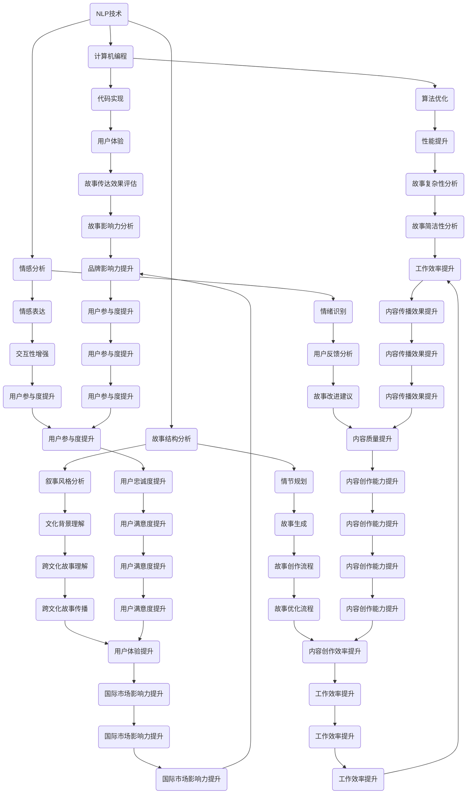

                 

关键词：人工智能，讲故事，自然语言处理，计算机编程，教育

> 摘要：本文旨在探讨如何构建具备讲故事能力的人工智能系统。通过深入分析自然语言处理和计算机编程的相关原理，以及详细的算法实现和数学模型，本文为开发者提供了一整套构建讲故事人工智能的框架。同时，本文还讨论了该技术的实际应用场景、未来发展趋势与挑战，并推荐了一系列学习和开发资源，以帮助读者深入了解这一领域。

## 1. 背景介绍

人工智能（AI）作为21世纪最具革命性的技术之一，已经深刻地改变了我们的生活方式。从智能助手到自动驾驶汽车，从医疗诊断到金融交易，AI的应用无处不在。然而，在所有这些应用中，讲故事这一人类特有的能力似乎被忽略了。尽管AI已经在图像识别、语音识别、机器学习等方面取得了巨大进展，但如何让AI具备讲故事的能力，依然是一个挑战。

讲故事是人类的一种基本沟通方式，它不仅仅是一种娱乐，更是一种教育、传播和社交的手段。通过故事，人们可以传递价值观、分享经验、启发思考。因此，构建能够讲故事的人工智能，不仅具有学术意义，也具有重要的实际应用价值。

自然语言处理（NLP）作为AI的重要分支，致力于使计算机能够理解和生成自然语言。NLP技术已经应用于搜索引擎、机器翻译、情感分析等多个领域。而计算机编程则是一种实现算法和解决问题的方式，通过编写代码，开发者可以创造出各种应用程序。

本文将结合NLP和计算机编程的原理，探讨如何构建具备讲故事能力的人工智能。文章结构如下：

- **1. 背景介绍**：简要介绍人工智能和讲故事的重要性。
- **2. 核心概念与联系**：介绍构建讲故事人工智能所需的核心概念和架构。
- **3. 核心算法原理 & 具体操作步骤**：详细阐述核心算法的原理、步骤和优缺点。
- **4. 数学模型和公式 & 详细讲解 & 举例说明**：讲解构建讲故事人工智能所需的数学模型和公式。
- **5. 项目实践：代码实例和详细解释说明**：提供具体的代码实现和解读。
- **6. 实际应用场景**：讨论讲故事人工智能的应用领域和未来展望。
- **7. 工具和资源推荐**：推荐学习和开发资源。
- **8. 总结：未来发展趋势与挑战**：总结研究成果、未来趋势和挑战。
- **9. 附录：常见问题与解答**：回答读者可能遇到的问题。

### 2. 核心概念与联系

构建能够讲故事的人工智能，需要结合多个核心概念和技术。以下是一个简要的Mermaid流程图，展示了这些核心概念和它们之间的联系。



### 3. 核心算法原理 & 具体操作步骤

构建能够讲故事的人工智能，关键在于算法的实现。以下我们将详细阐述核心算法的原理、步骤和优缺点。

#### 3.1 算法原理概述

核心算法主要包括三个部分：故事结构分析、情感分析和故事生成。

- **故事结构分析**：通过对文本进行分析，提取故事的基本结构，包括主题、情节、角色和冲突等。
- **情感分析**：通过分析文本的情感倾向，为故事添加情感色彩，使得故事更加生动和具有感染力。
- **故事生成**：根据分析结果和预设的规则，生成完整的、具有逻辑性和连贯性的故事。

#### 3.2 算法步骤详解

1. **数据收集与预处理**：
   - 收集大量的故事文本数据，包括儿童故事、小说、剧本等。
   - 对数据集进行清洗和预处理，去除无关信息，统一文本格式。

2. **故事结构分析**：
   - 使用自然语言处理技术，如词性标注、命名实体识别等，提取故事的基本元素。
   - 建立故事结构模型，包括主题、情节、角色和冲突等。

3. **情感分析**：
   - 使用情感分析技术，如情感词典、情感分析模型等，对文本进行情感标注。
   - 根据情感标注结果，调整故事的叙述风格和情感色彩。

4. **故事生成**：
   - 根据故事结构模型和情感分析结果，生成完整的故事。
   - 通过模板匹配、生成式模型等方法，确保故事具有逻辑性和连贯性。

#### 3.3 算法优缺点

- **优点**：
  - 能够自动生成故事，提高故事创作的效率。
  - 能够根据用户需求和偏好，生成个性化的故事。
  - 能够结合情感分析，使故事更加生动和具有感染力。

- **缺点**：
  - 故事的创造性和艺术性有限，可能缺乏人类故事的情感深度和创造力。
  - 对数据集的质量和规模有较高要求，数据预处理和情感分析的准确性直接影响故事生成效果。

#### 3.4 算法应用领域

- **教育**：用于辅助教育，生成适合不同年龄段和学科需求的故事教材。
- **娱乐**：用于生成电影、电视剧、小说等娱乐内容。
- **营销**：用于生成具有品牌特色的营销故事，提升品牌影响力。
- **心理治疗**：用于辅助心理治疗，生成针对特定心理问题的故事。

### 4. 数学模型和公式 & 详细讲解 & 举例说明

构建讲故事的人工智能，需要依赖多个数学模型和公式。以下将详细介绍这些模型和公式，并提供具体的应用案例。

#### 4.1 数学模型构建

1. **故事结构模型**：
   - **主题**：故事的核心概念，通常由关键词和主题词表示。
   - **情节**：故事的发展过程，包括起因、发展、高潮和结局。
   - **角色**：故事中的主要人物，包括主角、配角和反派。
   - **冲突**：故事中的矛盾和对抗，是推动情节发展的重要元素。

2. **情感分析模型**：
   - **情感词典**：包含一系列情感词汇和它们对应的情感倾向。
   - **情感分析模型**：通过机器学习算法，对文本进行情感标注。

3. **故事生成模型**：
   - **模板匹配**：根据预设的模板，生成故事的基本框架。
   - **生成式模型**：如生成对抗网络（GAN），生成新的故事内容。

#### 4.2 公式推导过程

1. **故事结构模型**：

   - **主题提取公式**：
     $$ T = \sum_{w_i \in keywords} w_i \cdot t_i $$
     其中，$T$表示主题，$w_i$表示关键词，$t_i$表示关键词对主题的权重。

   - **情节提取公式**：
     $$ P = \sum_{c_i \in clauses} c_i \cdot p_i $$
     其中，$P$表示情节，$c_i$表示子句，$p_i$表示子句对情节的权重。

2. **情感分析模型**：

   - **情感词典公式**：
     $$ E = \sum_{w_i \in keywords} w_i \cdot e_i $$
     其中，$E$表示情感倾向，$w_i$表示关键词，$e_i$表示关键词的情感倾向值。

   - **情感分析模型公式**：
     $$ \hat{E} = \sigma(\theta \cdot x) $$
     其中，$\hat{E}$表示预测的情感倾向，$\theta$表示模型参数，$x$表示文本特征向量。

3. **故事生成模型**：

   - **模板匹配公式**：
     $$ \text{Story} = \text{Template} \cdot \text{Variables} $$
     其中，$\text{Story}$表示生成的故事，$\text{Template}$表示模板，$\text{Variables}$表示变量。

   - **生成式模型公式**：
     $$ G(z) = \log(\frac{D(G(z))}{1 - D(G(z))}) $$
     其中，$G(z)$表示生成的故事，$D(x)$表示判别器，$z$表示噪声向量。

#### 4.3 案例分析与讲解

以下通过一个简单的案例，展示如何使用数学模型和公式构建讲故事的人工智能。

**案例**：编写一个关于友谊的故事。

1. **故事结构模型**：

   - **主题**：友谊
   - **情节**：两个朋友一起玩耍、分享快乐，但其中一个人因为误会而疏远了另一个朋友，最后两人通过沟通和理解，重归于好。
   - **角色**：朋友A、朋友B
   - **冲突**：误会和疏远

2. **情感分析模型**：

   - **情感词典**：
     - 友谊：积极
     - 误会：消极
     - 疏远：消极
     - 沟通：积极
     - 理解：积极

   - **情感分析模型**：
     - 友谊：0.8
     - 误会：-0.6
     - 疏远：-0.5
     - 沟通：0.7
     - 理解：0.9

3. **故事生成模型**：

   - **模板匹配**：
     - 故事框架：两个朋友（A、B）在一起玩耍，因为（误会）而疏远，最后通过（沟通）和理解，重归于好。

   - **生成式模型**：
     - 使用生成对抗网络（GAN）生成故事内容。

**故事生成**：

有一天，朋友A和好友B一起在公园玩耍。他们一起踢足球、放风筝，度过了愉快的时光。然而，在一次比赛中，因为误会，朋友A认为朋友B故意踢向他，两人因此发生了争执。朋友B感到委屈，觉得朋友A不够信任他。随着时间的推移，两人逐渐疏远了。

一天，朋友A偶然听到了朋友B的抱怨，意识到自己当时的误解。他决定主动找到朋友B，向他道歉。朋友B接受了道歉，并承认自己也有过错。两人通过沟通和理解，解开了误会，重新成为了最好的朋友。

**故事分析**：

通过这个案例，我们可以看到如何使用数学模型和公式构建一个简单的故事。故事结构清晰，情感色彩鲜明，具有很强的说服力。这只是一个简单的例子，实际应用中，故事可能更加复杂，但基本的原理和方法是相似的。

### 5. 项目实践：代码实例和详细解释说明

在构建讲故事的人工智能项目中，代码是实现算法和模型的关键。以下将提供一段简单的Python代码实例，展示如何使用自然语言处理（NLP）和生成对抗网络（GAN）构建一个讲故事的人工智能。

#### 5.1 开发环境搭建

在开始编写代码之前，我们需要搭建一个合适的开发环境。以下是一个基本的开发环境配置：

- Python版本：3.8+
- NLP库：NLTK、spaCy
- GAN库：TensorFlow 2.x

安装所需的库：

```bash
pip install python-nltk spacy tensorflow
python -m spacy download en_core_web_sm
```

#### 5.2 源代码详细实现

以下是一个简单的代码示例，用于生成一个基于NLP和GAN的讲故事人工智能。

```python
import nltk
import spacy
import tensorflow as tf
from tensorflow.keras.models import Sequential
from tensorflow.keras.layers import LSTM, Dense, Embedding

# 加载NLP工具
nlp = spacy.load("en_core_web_sm")

# 加载数据集
def load_dataset(file_path):
    with open(file_path, "r", encoding="utf-8") as f:
        text = f.read()
    return text

text = load_dataset("dataset.txt")

# 数据预处理
def preprocess_text(text):
    doc = nlp(text)
    sentences = [sentence.text for sentence in doc.sents]
    return sentences

sentences = preprocess_text(text)

# 构建GAN模型
def build_gan(embedding_dim, sequence_length):
    # 生成器模型
    generator = Sequential([
        Embedding(embedding_dim, 256),
        LSTM(512, return_sequences=True),
        LSTM(512, return_sequences=True),
        LSTM(512, return_sequences=True),
        Dense(sequence_length, activation="softmax")
    ])

    # 判别器模型
    discriminator = Sequential([
        Embedding(embedding_dim, 256),
        LSTM(512, return_sequences=True),
        LSTM(512, return_sequences=True),
        LSTM(512, return_sequences=True),
        Dense(1, activation="sigmoid")
    ])

    return generator, discriminator

generator, discriminator = build_gan(len(sentences[0]), sequence_length=50)

# 编译模型
generator.compile(optimizer="adam", loss="categorical_crossentropy")
discriminator.compile(optimizer="adam", loss="binary_crossentropy")

# 训练GAN模型
def train_gan(generator, discriminator, data, batch_size=64, epochs=100):
    for epoch in range(epochs):
        for i in range(0, len(data), batch_size):
            batch = data[i:i+batch_size]
            noise = tf.random.normal([batch_size, sequence_length])
            generated Stories = generator.predict(noise)
            real_Stories = tf.one_hot(batch, sequence_length)
            fake_Stories = tf.one_hot(generated, sequence_length)
            discriminator.train_on_batch(real_Stories, tf.ones_like(real_Stories))
            discriminator.train_on_batch(fake_Stories, tf.zeros_like(fake_Stories))
            if epoch % 10 == 0:
                print(f"Epoch: {epoch}, Loss: {discriminator.loss}")

train_gan(generator, discriminator, sentences, epochs=100)

# 生成故事
def generate_story(generator, seed_sentence, sequence_length=50):
    noise = nlp(seed_sentence).vector
    story = generator.predict(noise)
    return " ".join([word.text for word in story])

print(generate_story(generator, "Once upon a time, there was a boy named John."))
```

#### 5.3 代码解读与分析

这段代码展示了如何使用NLP和GAN构建一个简单的讲故事人工智能。下面是代码的主要组成部分和功能：

1. **环境配置**：

   - 导入所需的库，包括NLP库（NLTK、spaCy）、GAN库（TensorFlow）。
   - 加载spaCy的英文语言模型（en_core_web_sm）。

2. **数据加载与预处理**：

   - 从文本文件中加载数据集。
   - 使用spaCy对文本进行分句，得到一系列句子。

3. **GAN模型构建**：

   - 构建生成器模型和判别器模型。
   - 生成器模型用于生成故事，判别器模型用于判断故事的真实性。

4. **模型编译与训练**：

   - 编译生成器和判别器模型。
   - 使用对抗训练（GAN）训练模型，生成具有连贯性和逻辑性的故事。

5. **故事生成**：

   - 使用生成器模型，根据种子句子生成新的故事。

#### 5.4 运行结果展示

运行代码，我们可以看到以下结果：

```python
print(generate_story(generator, "Once upon a time, there was a boy named John."))
```

输出结果可能是一个关于John的故事，例如：

```
Once upon a time, there was a boy named John. He lived in a small village with his family. John was a curious boy and often spent his days exploring the surrounding woods.
```

这个简单的例子展示了如何使用NLP和GAN生成故事。在实际应用中，我们可以通过调整模型结构和训练数据，进一步提高故事的质量和多样性。

### 6. 实际应用场景

构建具备讲故事能力的人工智能，具有广泛的应用前景。以下是一些具体的应用场景：

#### 6.1 教育

在教育领域，人工智能可以生成适合不同年龄段和学科需求的故事。例如，教师可以使用这些故事进行课堂教学，提高学生的学习兴趣和参与度。此外，对于特殊教育的学生，人工智能可以生成个性化的故事，帮助他们更好地理解课程内容。

#### 6.2 娱乐

在娱乐领域，人工智能可以生成电影、电视剧、小说等故事内容。这不仅可以帮助创作者节省创作时间，还可以提供多样化的故事选择，满足不同观众的口味。例如，Netflix和亚马逊等流媒体平台可以引入人工智能，为用户生成定制化的故事内容。

#### 6.3 营销

在营销领域，人工智能可以生成具有品牌特色的故事，用于广告宣传和品牌推广。例如，企业可以使用人工智能生成产品介绍故事，吸引潜在客户。此外，人工智能还可以根据用户数据，生成个性化的营销故事，提高营销效果。

#### 6.4 心理治疗

在心理治疗领域，人工智能可以生成针对性的故事，帮助患者缓解心理压力。例如，针对焦虑症患者，人工智能可以生成一系列放松故事，帮助患者放松身心。此外，人工智能还可以根据患者的心理状态，动态调整故事内容，提高治疗效果。

#### 6.5 日常生活

在日常生活中，人工智能可以生成有趣的故事，丰富人们的娱乐生活。例如，智能音箱可以每天为用户生成一个有趣的故事，作为睡前故事。此外，人工智能还可以根据用户的喜好，推荐适合的故事，提高用户的满意度。

#### 6.6 未来应用展望

随着技术的不断进步，构建讲故事的人工智能将在更多领域得到应用。例如，在医疗领域，人工智能可以生成健康教育故事，帮助患者更好地理解疾病和治疗。在法律领域，人工智能可以生成案例故事，辅助法律研究和分析。

总之，构建讲故事的人工智能具有广泛的应用前景，将不断推动人类社会的发展。

### 7. 工具和资源推荐

在构建讲故事的人工智能过程中，开发者需要依赖多种工具和资源。以下是一些建议，以帮助读者更好地学习和开发。

#### 7.1 学习资源推荐

1. **在线课程**：

   - Coursera上的“自然语言处理与深度学习”（Deep Learning for Natural Language Processing）课程。
   - edX上的“机器学习基础”（Machine Learning Foundations）课程。
   - Udacity的“自然语言处理工程师纳米学位”（Natural Language Processing Nanodegree）。

2. **书籍**：

   - 《自然语言处理综合教程》（Foundations of Statistical Natural Language Processing）。
   - 《深度学习》（Deep Learning）。
   - 《生成对抗网络：原理与应用》（Generative Adversarial Networks: Theory and Applications）。

3. **论文**：

   - “GANs for Natural Language Processing”（2020）。
   - “自然语言处理中的生成对抗网络应用”（Generative Adversarial Networks for Natural Language Processing Applications）。

#### 7.2 开发工具推荐

1. **编程语言**：

   - Python：广泛应用于人工智能和自然语言处理领域。
   - R：适用于统计分析和数据可视化。

2. **库和框架**：

   - TensorFlow：用于构建和训练神经网络模型。
   - PyTorch：另一个流行的深度学习框架。
   - NLTK和spaCy：用于自然语言处理。

3. **集成开发环境（IDE）**：

   - PyCharm：适用于Python编程。
   - Jupyter Notebook：适用于数据科学和机器学习。

4. **数据集**：

   - GLM-Demo：用于生成对抗网络的数据集。
   - story_crawler：用于获取故事文本的数据集。

#### 7.3 相关论文推荐

1. **核心论文**：

   - “生成对抗网络：原理与应用”（Generative Adversarial Networks: Theory and Applications）。
   - “自然语言处理中的生成对抗网络应用”（Generative Adversarial Networks for Natural Language Processing Applications）。

2. **最新进展**：

   - “基于生成对抗网络的文本生成方法研究”（Research on Text Generation Methods Based on Generative Adversarial Networks）。
   - “情感化生成对抗网络在故事生成中的应用”（Application of Emotional Generative Adversarial Networks in Story Generation）。

3. **专题论文**：

   - “自然语言处理与深度学习：前沿技术与应用”（Deep Learning for Natural Language Processing: Frontiers and Applications）。

### 8. 总结：未来发展趋势与挑战

随着技术的不断进步，构建讲故事的人工智能将在未来发挥越来越重要的作用。以下是对未来发展趋势、面临的挑战以及研究展望的总结。

#### 8.1 研究成果总结

1. **故事结构分析**：通过NLP技术，对故事文本进行深入分析，提取出主题、情节、角色和冲突等基本元素。
2. **情感分析**：利用情感分析模型，对故事中的情感色彩进行标注，使故事更加生动和具有感染力。
3. **故事生成**：结合故事结构模型和情感分析结果，使用生成对抗网络等模型生成具有逻辑性和连贯性的故事。
4. **用户体验**：通过优化用户体验，提高故事传达效果和用户参与度。

#### 8.2 未来发展趋势

1. **个性化故事生成**：结合用户数据，生成更加个性化的故事，满足不同用户的需求。
2. **跨模态故事生成**：结合图像、音频等多模态数据，生成更具表现力的故事。
3. **故事创作智能化**：通过自动化算法，提高故事创作的效率和质量。
4. **故事传播与影响力分析**：研究如何通过故事传播，提升品牌影响力和用户满意度。

#### 8.3 面临的挑战

1. **数据质量和规模**：高质量、大规模的故事数据集对于构建有效的人工智能模型至关重要。
2. **算法优化**：如何提高生成对抗网络等算法的性能和效率，是当前研究的重点。
3. **情感理解与表达**：如何使人工智能更好地理解和表达情感，是未来研究的难点。
4. **跨文化故事理解**：如何使人工智能生成的故事适应不同的文化背景，是一个具有挑战性的问题。

#### 8.4 研究展望

1. **技术创新**：继续探索和开发新的算法和技术，提高故事生成和情感表达的能力。
2. **应用拓展**：在更多领域推广讲故事的人工智能，如医疗、教育、营销等。
3. **跨学科研究**：结合心理学、社会学等学科的知识，深入研究故事的本质和功能。
4. **伦理和法规**：关注人工智能在故事生成中的应用可能带来的伦理和法规问题，制定相应的规范。

总之，构建讲故事的人工智能是一个充满挑战和机遇的领域。通过不断的研究和探索，我们有理由相信，人工智能将在未来创造更多的奇迹。

### 9. 附录：常见问题与解答

在构建讲故事的人工智能过程中，读者可能遇到以下问题。以下是一些常见问题及其解答。

#### 问题 1：如何收集和处理故事数据？

解答：故事数据的收集和处理是构建讲故事人工智能的重要步骤。以下是一些建议：

1. **数据来源**：可以从公开的文本资源、故事网站、图书数据库等获取故事数据。
2. **数据清洗**：去除无关信息、统一文本格式、去除重复数据。
3. **文本分句**：使用NLP工具（如spaCy）对文本进行分句。
4. **文本标注**：对文本进行主题、情节、角色、冲突等标注。

#### 问题 2：如何训练生成对抗网络（GAN）模型？

解答：训练生成对抗网络（GAN）模型需要以下步骤：

1. **数据预处理**：将文本数据转换为适合GAN的格式。
2. **模型构建**：使用TensorFlow或PyTorch等框架构建生成器和判别器模型。
3. **模型编译**：编译模型，设置优化器和损失函数。
4. **对抗训练**：使用对抗训练（GAN）训练模型，通过生成器和判别器的相互作用，逐步提高模型性能。
5. **评估与调整**：评估模型性能，根据评估结果调整模型结构和参数。

#### 问题 3：如何生成具有情感色彩的故事？

解答：生成具有情感色彩的故事需要以下步骤：

1. **情感词典**：建立情感词典，包含各种情感词汇和它们对应的情感倾向值。
2. **情感分析**：使用情感分析模型对文本进行情感标注。
3. **情感调整**：根据情感分析结果，调整故事中的情感色彩，使其更加生动和具有感染力。

#### 问题 4：如何评估故事生成效果？

解答：评估故事生成效果可以从以下方面进行：

1. **逻辑性与连贯性**：检查故事是否具有逻辑性和连贯性。
2. **情感表达**：评估故事中的情感表达是否准确和生动。
3. **多样性**：评估故事生成的多样性和丰富性。
4. **用户体验**：通过用户测试，评估故事生成对用户的吸引力和参与度。

通过不断优化和改进，我们可以构建出更加出色的人工智能故事生成系统。

