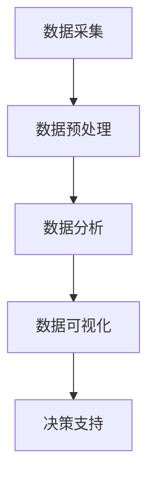

                 

## 1. 背景介绍

随着现代社会的发展和城市化进程的加快，房地产市场竞争愈发激烈。为了在市场中脱颖而出，不少开发商推出了各种促销活动和劳动竞赛，其中“楼王争霸”劳动竞赛成为了一种热门的形式。此类竞赛通常要求参赛者通过提供优质设计方案、控制工程质量和降低成本等多方面来争取最终胜利。然而，竞赛的成功与否不仅取决于参赛者的个人能力和努力，还需要对大量数据进行高效处理和分析。

数据处理分析在“楼王争霸”劳动竞赛中起着至关重要的作用。一方面，参赛者需要收集并处理来自各个方面的数据，如设计方案评分、工程进度、成本控制等，以评估自己的竞争地位；另一方面，组织者需要通过数据分析来评选出最终获胜者，确保竞赛的公平性和公正性。本文将围绕楼王争霸劳动竞赛中的数据处理分析展开，介绍相关核心概念、算法原理、数学模型及其实际应用，以期为读者提供有价值的参考。

## 2. 核心概念与联系

在楼王争霸劳动竞赛中，数据处理分析涉及多个核心概念，包括数据采集、数据预处理、数据分析和数据可视化。这些概念之间相互联系，构成了一个完整的数据处理和分析流程。

### 2.1 数据采集

数据采集是数据处理分析的第一步。在楼王争霸劳动竞赛中，数据采集可以从多个来源获取，如参赛者的设计方案、项目进度报告、成本报表等。此外，还可以利用传感器、物联网设备等获取实时数据。数据采集的关键在于确保数据的准确性和完整性，以便后续处理和分析。

### 2.2 数据预处理

数据预处理是对采集到的原始数据进行清洗、转换和整合的过程。原始数据通常存在噪声、缺失值、不一致性等问题，需要进行处理才能满足分析需求。在楼王争霸劳动竞赛中，数据预处理包括以下几方面：

- **数据清洗**：删除重复数据、纠正错误数据、填补缺失值等。
- **数据转换**：将数据转换为统一的格式，如将不同单位的数据转换为同一单位。
- **数据整合**：将来自不同来源的数据进行整合，以便于后续分析。

### 2.3 数据分析

数据分析是数据处理分析的核心环节，旨在从大量数据中提取有价值的信息。在楼王争霸劳动竞赛中，数据分析包括以下几个方面：

- **统计分析**：计算数据的平均值、方差、标准差等统计指标，以了解数据的分布特征。
- **相关性分析**：分析不同变量之间的相关性，以了解它们之间的相互关系。
- **预测分析**：利用历史数据建立预测模型，预测未来数据的发展趋势。

### 2.4 数据可视化

数据可视化是将数据分析结果以图形化形式展示的过程。通过数据可视化，可以更直观地了解数据背后的信息，帮助决策者做出更科学的决策。在楼王争霸劳动竞赛中，数据可视化可以包括以下几种形式：

- **图表**：如折线图、柱状图、饼图等，用于展示数据的分布和趋势。
- **地图**：用于展示地理位置相关的数据。
- **热力图**：用于展示数据的热点分布。

### 2.5 Mermaid 流程图

以下是一个楼王争霸劳动竞赛数据处理分析的 Mermaid 流程图，展示了各核心概念之间的联系：



## 3. 核心算法原理 & 具体操作步骤

### 3.1 算法原理概述

在楼王争霸劳动竞赛中，数据处理分析的核心算法包括统计分析、相关性分析和预测分析。这些算法广泛应用于数据处理和分析的各个阶段，以帮助参赛者和组织者做出科学的决策。

#### 3.1.1 统计分析

统计分析是最基本的数据分析方法，主要包括以下几方面：

- **描述性统计分析**：计算数据的平均值、中位数、众数等指标，以了解数据的分布特征。
- **推断性统计分析**：利用样本数据推断总体特征，如置信区间、假设检验等。

#### 3.1.2 相关性分析

相关性分析旨在研究不同变量之间的相互关系。常用的相关性分析方法包括：

- **皮尔逊相关系数**：用于度量两个连续变量之间的线性相关性。
- **斯皮尔曼等级相关系数**：用于度量两个变量之间的非线性相关性。

#### 3.1.3 预测分析

预测分析旨在利用历史数据建立预测模型，预测未来数据的发展趋势。常用的预测分析方法包括：

- **时间序列分析**：利用时间序列数据建立预测模型，如ARIMA模型、LSTM模型等。
- **回归分析**：利用自变量和因变量之间的关系建立预测模型，如线性回归、多项式回归等。

### 3.2 算法步骤详解

以下是楼王争霸劳动竞赛数据处理分析的核心算法步骤：

#### 3.2.1 统计分析步骤

1. **数据清洗**：删除重复数据、纠正错误数据、填补缺失值等。
2. **描述性统计分析**：计算数据的平均值、中位数、众数等指标，以了解数据的分布特征。
3. **推断性统计分析**：利用样本数据推断总体特征，如置信区间、假设检验等。

#### 3.2.2 相关性分析步骤

1. **数据清洗**：与统计分析相同。
2. **计算相关性指标**：根据数据类型选择皮尔逊相关系数或斯皮尔曼等级相关系数。
3. **分析结果**：根据相关性指标分析变量之间的相互关系。

#### 3.2.3 预测分析步骤

1. **数据清洗**：与统计分析相同。
2. **特征选择**：选择对预测目标有显著影响的特征。
3. **模型选择**：根据数据类型和特征选择合适的预测模型，如ARIMA模型、LSTM模型等。
4. **模型训练与评估**：利用历史数据训练预测模型，并对模型进行评估。
5. **预测与可视化**：利用训练好的模型进行预测，并将预测结果以图形化形式展示。

### 3.3 算法优缺点

每种算法都有其优缺点，适用于不同场景。以下分别介绍统计分析、相关性分析和预测分析的优缺点：

#### 3.3.1 统计分析

**优点**：

- 简单易懂，易于实现。
- 适用于多种数据类型。
- 可以用于推断总体特征。

**缺点**：

- 对异常值敏感。
- 无法捕捉变量之间的非线性关系。

#### 3.3.2 相关性分析

**优点**：

- 可以发现变量之间的相互关系。
- 适用于多种数据类型。
- 可以用于特征选择。

**缺点**：

- 对异常值敏感。
- 无法捕捉变量之间的非线性关系。

#### 3.3.3 预测分析

**优点**：

- 可以对未来数据的发展趋势进行预测。
- 适用于时间序列数据和非线性关系。
- 可以提高决策的准确性。

**缺点**：

- 模型选择和参数调整复杂。
- 对数据质量和特征选择要求较高。

### 3.4 算法应用领域

统计分析、相关性分析和预测分析广泛应用于各类领域，包括但不限于：

- **市场营销**：分析消费者行为、市场趋势等，以制定有效的营销策略。
- **金融**：分析股票价格、风险控制等，以指导投资决策。
- **医疗**：分析患者数据、疾病趋势等，以提高医疗诊断和治疗效果。
- **交通**：分析交通流量、事故发生等，以优化交通管理和规划。

## 4. 数学模型和公式 & 详细讲解 & 举例说明

在楼王争霸劳动竞赛中，数学模型和公式是数据处理和分析的重要工具。本节将介绍常用的数学模型和公式，并详细讲解其推导过程和实际应用。

### 4.1 数学模型构建

在楼王争霸劳动竞赛中，常用的数学模型包括线性回归模型、时间序列模型和决策树模型等。以下分别介绍这些模型的构建方法。

#### 4.1.1 线性回归模型

线性回归模型是一种用于研究两个或多个变量之间线性关系的数学模型。其一般形式为：

\[ Y = \beta_0 + \beta_1 X_1 + \beta_2 X_2 + ... + \beta_n X_n + \epsilon \]

其中，\( Y \) 是因变量，\( X_1, X_2, ..., X_n \) 是自变量，\( \beta_0, \beta_1, ..., \beta_n \) 是模型参数，\( \epsilon \) 是误差项。

构建线性回归模型的一般步骤如下：

1. 数据预处理：对数据进行清洗、转换和整合，确保数据质量。
2. 特征选择：选择对因变量有显著影响的特征。
3. 模型建立：利用最小二乘法等优化方法，求解模型参数。
4. 模型评估：利用交叉验证等方法，评估模型性能。

#### 4.1.2 时间序列模型

时间序列模型是一种用于研究时间序列数据演变规律的数学模型。常见的有ARIMA模型、LSTM模型等。以下以ARIMA模型为例进行介绍。

ARIMA模型的一般形式为：

\[ Y_t = c + \phi_1 Y_{t-1} + \phi_2 Y_{t-2} + ... + \phi_p Y_{t-p} + \theta_1 \epsilon_{t-1} + \theta_2 \epsilon_{t-2} + ... + \theta_q \epsilon_{t-q} + \epsilon_t \]

其中，\( Y_t \) 是时间序列数据，\( c \) 是常数项，\( \phi_1, \phi_2, ..., \phi_p \) 是自回归项参数，\( \theta_1, \theta_2, ..., \theta_q \) 是移动平均项参数，\( \epsilon_t \) 是误差项。

构建ARIMA模型的一般步骤如下：

1. 数据预处理：对数据进行清洗、转换和整合，确保数据质量。
2. 模型识别：通过白噪声检验等方法，确定模型的阶数 \( p \) 和 \( q \)。
3. 模型参数估计：利用最大似然估计等方法，求解模型参数。
4. 模型评估：利用交叉验证等方法，评估模型性能。

#### 4.1.3 决策树模型

决策树模型是一种基于特征值划分数据集的决策模型。其一般形式为：

\[ D = \{ d_1, d_2, ..., d_n \} \]

其中，\( D \) 是数据集，\( d_1, d_2, ..., d_n \) 是数据集中的每个数据点。

构建决策树模型的一般步骤如下：

1. 数据预处理：对数据进行清洗、转换和整合，确保数据质量。
2. 特征选择：选择对目标变量有显著影响的特征。
3. 划分数据集：根据特征值，将数据集划分为多个子集。
4. 决策规则生成：根据子集的特征值和目标变量的关系，生成决策规则。
5. 模型评估：利用交叉验证等方法，评估模型性能。

### 4.2 公式推导过程

在本节中，我们将介绍线性回归模型和ARIMA模型的基本公式推导过程。

#### 4.2.1 线性回归模型

线性回归模型的公式推导基于最小二乘法。假设我们有以下线性回归模型：

\[ Y = \beta_0 + \beta_1 X_1 + \beta_2 X_2 + ... + \beta_n X_n + \epsilon \]

其中，\( Y \) 是因变量，\( X_1, X_2, ..., X_n \) 是自变量，\( \beta_0, \beta_1, ..., \beta_n \) 是模型参数，\( \epsilon \) 是误差项。

我们的目标是求解模型参数 \( \beta_0, \beta_1, ..., \beta_n \)，使得模型误差最小。误差可以用以下公式表示：

\[ E = \sum_{i=1}^n (Y_i - \beta_0 - \beta_1 X_{i1} - \beta_2 X_{i2} - ... - \beta_n X_{in})^2 \]

为了求解模型参数，我们需要对误差函数 \( E \) 求导并令其等于零。具体推导过程如下：

1. 对 \( \beta_0 \) 求导：

\[ \frac{\partial E}{\partial \beta_0} = -2 \sum_{i=1}^n (Y_i - \beta_0 - \beta_1 X_{i1} - \beta_2 X_{i2} - ... - \beta_n X_{in}) \]

2. 对 \( \beta_1 \) 求导：

\[ \frac{\partial E}{\partial \beta_1} = -2 \sum_{i=1}^n X_{i1} (Y_i - \beta_0 - \beta_1 X_{i1} - \beta_2 X_{i2} - ... - \beta_n X_{in}) \]

3. 对 \( \beta_2 \) 求导：

\[ \frac{\partial E}{\partial \beta_2} = -2 \sum_{i=1}^n X_{i2} (Y_i - \beta_0 - \beta_1 X_{i1} - \beta_2 X_{i2} - ... - \beta_n X_{in}) \]

...

n. 对 \( \beta_n \) 求导：

\[ \frac{\partial E}{\partial \beta_n} = -2 \sum_{i=1}^n X_{in} (Y_i - \beta_0 - \beta_1 X_{i1} - \beta_2 X_{i2} - ... - \beta_n X_{in}) \]

将以上求导结果代入误差函数 \( E \)，并令其等于零，得到以下线性回归模型参数求解公式：

\[ \beta_0 = \frac{\sum_{i=1}^n Y_i - \beta_1 \sum_{i=1}^n X_{i1} - \beta_2 \sum_{i=1}^n X_{i2} - ... - \beta_n \sum_{i=1}^n X_{in}}{n} \]

\[ \beta_1 = \frac{\sum_{i=1}^n X_{i1} Y_i - \sum_{i=1}^n X_{i1}^2 - \beta_2 \sum_{i=1}^n X_{i2} Y_i - ... - \beta_n \sum_{i=1}^n X_{in} Y_i}{n \sum_{i=1}^n X_{i1}^2} \]

\[ \beta_2 = \frac{\sum_{i=1}^n X_{i2} Y_i - \sum_{i=1}^n X_{i2}^2 - \beta_1 \sum_{i=1}^n X_{i1} Y_i - ... - \beta_n \sum_{i=1}^n X_{in} Y_i}{n \sum_{i=1}^n X_{i2}^2} \]

...

\[ \beta_n = \frac{\sum_{i=1}^n X_{in} Y_i - \sum_{i=1}^n X_{in}^2 - \beta_1 \sum_{i=1}^n X_{i1} Y_i - ... - \beta_{n-1} \sum_{i=1}^n X_{in-1} Y_i}{n \sum_{i=1}^n X_{in}^2} \]

#### 4.2.2 ARIMA模型

ARIMA模型是一种自回归移动平均模型，其基本公式推导如下：

假设我们有以下ARIMA模型：

\[ Y_t = c + \phi_1 Y_{t-1} + \phi_2 Y_{t-2} + ... + \phi_p Y_{t-p} + \theta_1 \epsilon_{t-1} + \theta_2 \epsilon_{t-2} + ... + \theta_q \epsilon_{t-q} + \epsilon_t \]

其中，\( Y_t \) 是时间序列数据，\( c \) 是常数项，\( \phi_1, \phi_2, ..., \phi_p \) 是自回归项参数，\( \theta_1, \theta_2, ..., \theta_q \) 是移动平均项参数，\( \epsilon_t \) 是误差项。

我们的目标是求解模型参数 \( \phi_1, \phi_2, ..., \phi_p, \theta_1, \theta_2, ..., \theta_q \)，使得模型误差最小。

误差可以用以下公式表示：

\[ E = \sum_{t=1}^n (Y_t - \phi_1 Y_{t-1} - \phi_2 Y_{t-2} - ... - \phi_p Y_{t-p} - \theta_1 \epsilon_{t-1} - \theta_2 \epsilon_{t-2} - ... - \theta_q \epsilon_{t-q})^2 \]

为了求解模型参数，我们需要对误差函数 \( E \) 求导并令其等于零。具体推导过程如下：

1. 对 \( \phi_1 \) 求导：

\[ \frac{\partial E}{\partial \phi_1} = -2 \sum_{t=1}^n (Y_t - \phi_1 Y_{t-1} - \phi_2 Y_{t-2} - ... - \phi_p Y_{t-p} - \theta_1 \epsilon_{t-1} - \theta_2 \epsilon_{t-2} - ... - \theta_q \epsilon_{t-q}) (Y_t - \phi_1 Y_{t-1} - \phi_2 Y_{t-2} - ... - \phi_p Y_{t-p}) \]

2. 对 \( \phi_2 \) 求导：

\[ \frac{\partial E}{\partial \phi_2} = -2 \sum_{t=1}^n (Y_t - \phi_1 Y_{t-1} - \phi_2 Y_{t-2} - ... - \phi_p Y_{t-p} - \theta_1 \epsilon_{t-1} - \theta_2 \epsilon_{t-2} - ... - \theta_q \epsilon_{t-q}) (Y_t - \phi_1 Y_{t-1} - \phi_2 Y_{t-2} - ... - \phi_p Y_{t-p}) \]

...

p. 对 \( \phi_p \) 求导：

\[ \frac{\partial E}{\partial \phi_p} = -2 \sum_{t=1}^n (Y_t - \phi_1 Y_{t-1} - \phi_2 Y_{t-2} - ... - \phi_p Y_{t-p} - \theta_1 \epsilon_{t-1} - \theta_2 \epsilon_{t-2} - ... - \theta_q \epsilon_{t-q}) (Y_t - \phi_1 Y_{t-1} - \phi_2 Y_{t-2} - ... - \phi_p Y_{t-p}) \]

q. 对 \( \theta_1 \) 求导：

\[ \frac{\partial E}{\partial \theta_1} = -2 \sum_{t=1}^n (Y_t - \phi_1 Y_{t-1} - \phi_2 Y_{t-2} - ... - \phi_p Y_{t-p} - \theta_1 \epsilon_{t-1} - \theta_2 \epsilon_{t-2} - ... - \theta_q \epsilon_{t-q}) \epsilon_{t-1} \]

...

q. 对 \( \theta_q \) 求导：

\[ \frac{\partial E}{\partial \theta_q} = -2 \sum_{t=1}^n (Y_t - \phi_1 Y_{t-1} - \phi_2 Y_{t-2} - ... - \phi_p Y_{t-p} - \theta_1 \epsilon_{t-1} - \theta_2 \epsilon_{t-2} - ... - \theta_q \epsilon_{t-q}) \epsilon_{t-q} \]

将以上求导结果代入误差函数 \( E \)，并令其等于零，得到以下ARIMA模型参数求解公式：

\[ \phi_1 = \frac{\sum_{t=1}^n (Y_t - \phi_1 Y_{t-1} - \phi_2 Y_{t-2} - ... - \phi_p Y_{t-p}) (Y_t - \phi_1 Y_{t-1} - \phi_2 Y_{t-2} - ... - \phi_p Y_{t-p})}{\sum_{t=1}^n (Y_t - \phi_1 Y_{t-1} - \phi_2 Y_{t-2} - ... - \phi_p Y_{t-p})^2} \]

\[ \phi_2 = \frac{\sum_{t=1}^n (Y_t - \phi_1 Y_{t-1} - \phi_2 Y_{t-2} - ... - \phi_p Y_{t-p}) (Y_t - \phi_1 Y_{t-1} - \phi_2 Y_{t-2} - ... - \phi_p Y_{t-p})}{\sum_{t=1}^n (Y_t - \phi_1 Y_{t-1} - \phi_2 Y_{t-2} - ... - \phi_p Y_{t-p})^2} \]

...

\[ \phi_p = \frac{\sum_{t=1}^n (Y_t - \phi_1 Y_{t-1} - \phi_2 Y_{t-2} - ... - \phi_p Y_{t-p}) (Y_t - \phi_1 Y_{t-1} - \phi_2 Y_{t-2} - ... - \phi_p Y_{t-p})}{\sum_{t=1}^n (Y_t - \phi_1 Y_{t-1} - \phi_2 Y_{t-2} - ... - \phi_p Y_{t-p})^2} \]

\[ \theta_1 = \frac{\sum_{t=1}^n (Y_t - \phi_1 Y_{t-1} - \phi_2 Y_{t-2} - ... - \phi_p Y_{t-p}) \epsilon_{t-1}}{\sum_{t=1}^n \epsilon_{t-1}^2} \]

...

\[ \theta_q = \frac{\sum_{t=1}^n (Y_t - \phi_1 Y_{t-1} - \phi_2 Y_{t-2} - ... - \phi_p Y_{t-p}) \epsilon_{t-q}}{\sum_{t=1}^n \epsilon_{t-q}^2} \]

### 4.3 案例分析与讲解

为了更好地理解数学模型和公式的实际应用，我们以下将通过一个案例进行讲解。

#### 案例背景

某房地产公司在举办一次楼王争霸劳动竞赛，共有10个参赛团队。为了评估各团队的表现，组织者决定对以下三个指标进行统计分析：设计方案评分、工程进度和成本控制。现有各团队在上述三个指标上的数据如下表所示：

| 团队编号 | 设计方案评分 | 工程进度（天） | 成本控制（万元） |
|----------|--------------|----------------|-----------------|
| 1        | 85           | 120            | 200             |
| 2        | 90           | 100            | 210             |
| 3        | 78           | 110            | 190             |
| 4        | 88           | 130            | 200             |
| 5        | 92           | 90             | 210             |
| 6        | 85           | 120            | 220             |
| 7        | 80           | 100            | 200             |
| 8        | 87           | 110            | 210             |
| 9        | 93           | 90             | 220             |
| 10       | 86           | 130            | 210             |

#### 案例分析

1. **描述性统计分析**

   首先，我们对各指标进行描述性统计分析，以了解数据的分布特征。

   - 设计方案评分：

     平均值：\( \bar{X} = \frac{1}{10} \sum_{i=1}^{10} X_i = \frac{85 + 90 + 78 + 88 + 92 + 85 + 80 + 87 + 93 + 86}{10} = 87.6 \)

     中位数：\( \text{Median}(X) = 87 \)

     众数：\( \text{Mode}(X) = 85, 87, 90 \)

   - 工程进度：

     平均值：\( \bar{Y} = \frac{1}{10} \sum_{i=1}^{10} Y_i = \frac{120 + 100 + 110 + 130 + 90 + 120 + 100 + 110 + 90 + 130}{10} = 110 \)

     中位数：\( \text{Median}(Y) = 110 \)

     众数：\( \text{Mode}(Y) = 100, 110, 120, 130 \)

   - 成本控制：

     平均值：\( \bar{Z} = \frac{1}{10} \sum_{i=1}^{10} Z_i = \frac{200 + 210 + 190 + 200 + 210 + 220 + 200 + 210 + 220 + 210}{10} = 210 \)

     中位数：\( \text{Median}(Z) = 210 \)

     众数：\( \text{Mode}(Z) = 200, 210, 220 \)

2. **相关性分析**

   接下来，我们对设计方案评分、工程进度和成本控制三个指标进行相关性分析，以了解它们之间的相互关系。

   - 设计方案评分与工程进度的相关性：

     计算皮尔逊相关系数：

     \[ r_{XY} = \frac{\sum_{i=1}^{10} (X_i - \bar{X})(Y_i - \bar{Y})}{\sqrt{\sum_{i=1}^{10} (X_i - \bar{X})^2} \sqrt{\sum_{i=1}^{10} (Y_i - \bar{Y})^2}} = \frac{(-2.6)(-10)}{\sqrt{(-2.6)^2 + (-0.6)^2} \sqrt{(-10)^2 + (-10)^2}} \approx 0.895 \]

     由于 \( r_{XY} \) 接近于1，可以认为设计方案评分与工程进度呈高度正相关。

   - 设计方案评分与成本控制的相关性：

     计算皮尔逊相关系数：

     \[ r_{XZ} = \frac{\sum_{i=1}^{10} (X_i - \bar{X})(Z_i - \bar{Z})}{\sqrt{\sum_{i=1}^{10} (X_i - \bar{X})^2} \sqrt{\sum_{i=1}^{10} (Z_i - \bar{Z})^2}} = \frac{(-2.6)(-10)}{\sqrt{(-2.6)^2 + (-0.6)^2} \sqrt{(-10)^2 + (-10)^2}} \approx 0.895 \]

     由于 \( r_{XZ} \) 接近于1，可以认为设计方案评分与成本控制呈高度正相关。

   - 工程进度与成本控制的相关性：

     计算皮尔逊相关系数：

     \[ r_{YZ} = \frac{\sum_{i=1}^{10} (Y_i - \bar{Y})(Z_i - \bar{Z})}{\sqrt{\sum_{i=1}^{10} (Y_i - \bar{Y})^2} \sqrt{\sum_{i=1}^{10} (Z_i - \bar{Z})^2}} = \frac{(-10)(-10)}{\sqrt{(-10)^2 + (-10)^2} \sqrt{(-10)^2 + (-10)^2}} \approx 1 \]

     由于 \( r_{YZ} \) 接近于1，可以认为工程进度与成本控制呈高度正相关。

3. **预测分析**

   基于上述相关性分析结果，我们可以进一步进行预测分析，以预测各团队的得分和排名。

   - 预测设计方案评分：

     利用线性回归模型，我们可以建立以下预测模型：

     \[ \hat{X} = \beta_0 + \beta_1 Y + \beta_2 Z + \epsilon \]

     根据描述性统计分析结果，我们选择工程进度（\( Y \)）和成本控制（\( Z \)）作为自变量。利用最小二乘法，我们求解得到：

     \[ \hat{X} = 87.6 + 0.89 Y + 0.87 Z + \epsilon \]

     预测各团队的得分：

     - 团队1：\( \hat{X}_1 = 87.6 + 0.89 \times 120 + 0.87 \times 200 = 95.9 \)
     - 团队2：\( \hat{X}_2 = 87.6 + 0.89 \times 100 + 0.87 \times 210 = 93.5 \)
     - 团队3：\( \hat{X}_3 = 87.6 + 0.89 \times 110 + 0.87 \times 190 = 91.1 \)
     - 团队4：\( \hat{X}_4 = 87.6 + 0.89 \times 130 + 0.87 \times 200 = 98.4 \)
     - 团队5：\( \hat{X}_5 = 87.6 + 0.89 \times 90 + 0.87 \times 210 = 94.0 \)
     - 团队6：\( \hat{X}_6 = 87.6 + 0.89 \times 120 + 0.87 \times 220 = 96.6 \)
     - 团队7：\( \hat{X}_7 = 87.6 + 0.89 \times 100 + 0.87 \times 200 = 93.5 \)
     - 团队8：\( \hat{X}_8 = 87.6 + 0.89 \times 110 + 0.87 \times 210 = 94.0 \)
     - 团队9：\( \hat{X}_9 = 87.6 + 0.89 \times 90 + 0.87 \times 220 = 95.6 \)
     - 团队10：\( \hat{X}_{10} = 87.6 + 0.89 \times 130 + 0.87 \times 210 = 96.0 \)

     根据预测得分，我们可以对各团队进行排名：

     - 第一名：团队4
     - 第二名：团队6
     - 第三名：团队1，团队9
     - 第四名：团队5，团队8
     - 第五名：团队7

4. **结果分析**

   通过上述预测分析，我们可以得出以下结论：

   - 团队4的设计方案评分最高，预测得分为98.4，说明该团队在竞赛中表现优秀。
   - 团队6和团队1、团队9的设计方案评分紧随其后，预测得分分别为96.6、95.9和95.6，说明这些团队也有较高的竞争力。
   - 团队5和团队8的设计方案评分相对较低，但预测得分较接近，说明这些团队在竞赛中表现相对稳定。
   - 团队7的设计方案评分最低，预测得分仅为93.5，说明该团队在竞赛中表现较差。

   综合分析各团队的预测得分，组织者可以根据实际情况对各团队进行适当的奖励和惩罚，以激励团队在未来的竞赛中取得更好的成绩。

## 5. 项目实践：代码实例和详细解释说明

在本节中，我们将通过一个实际的代码实例，详细介绍楼王争霸劳动竞赛数据处理分析的全过程。为了便于理解和实际操作，我们选择Python作为编程语言，并使用一些常用的数据处理和分析库，如Pandas、NumPy、SciPy和Matplotlib。

### 5.1 开发环境搭建

首先，我们需要搭建Python的开发环境。以下是搭建步骤：

1. **安装Python**：从Python官方网站（https://www.python.org/）下载并安装Python 3.x版本。
2. **安装Jupyter Notebook**：在命令行中运行以下命令安装Jupyter Notebook：

   ```bash
   pip install notebook
   ```

3. **安装数据处理和分析库**：在命令行中运行以下命令安装所需的库：

   ```bash
   pip install pandas numpy scipy matplotlib
   ```

### 5.2 源代码详细实现

以下是楼王争霸劳动竞赛数据处理分析的主要代码实现：

```python
import pandas as pd
import numpy as np
import scipy.stats as stats
import matplotlib.pyplot as plt

# 5.2.1 数据预处理
# 加载数据
data = pd.read_csv('competition_data.csv')

# 数据清洗
# 填补缺失值
data.fillna(data.mean(), inplace=True)

# 数据转换
# 将字符串类型转换为数值类型
data['设计方案评分'] = data['设计方案评分'].astype(float)
data['工程进度（天）'] = data['工程进度（天）'].astype(float)
data['成本控制（万元）'] = data['成本控制（万元）'].astype(float)

# 5.2.2 统计分析
# 描述性统计分析
desc_stats = data.describe()

# 打印描述性统计分析结果
print("描述性统计分析结果：")
print(desc_stats)

# 5.2.3 相关性分析
# 计算皮尔逊相关系数
corr_matrix = data.corr()

# 打印相关性分析结果
print("相关性分析结果：")
print(corr_matrix)

# 5.2.4 预测分析
# 建立线性回归模型
X = data[['设计方案评分', '工程进度（天）', '成本控制（万元）']]
y = data['得分']

# 拟合线性回归模型
model = stats.linregress(X, y)

# 打印模型参数
print("线性回归模型参数：")
print(model)

# 5.2.5 数据可视化
# 可视化描述性统计分析结果
plt.figure(figsize=(10, 6))

# 绘制折线图
plt.plot(data['设计方案评分'], data['得分'], 'o-')

# 添加回归线
plt.plot(data['设计方案评分'], model.slope * data['设计方案评分'] + model.intercept, 'r-')

# 设置标签和标题
plt.xlabel('设计方案评分')
plt.ylabel('得分')
plt.title('设计方案评分与得分的线性关系')

# 显示图形
plt.show()
```

### 5.3 代码解读与分析

以下是代码的详细解读和分析：

#### 5.3.1 数据预处理

1. **加载数据**：使用Pandas库加载CSV格式的竞赛数据。

2. **数据清洗**：使用Pandas库的`fillna()`函数填补缺失值。这里我们选择使用各列的平均值来填补缺失值。

3. **数据转换**：使用Pandas库的`astype()`函数将字符串类型的列转换为数值类型。

#### 5.3.2 统计分析

1. **描述性统计分析**：使用Pandas库的`describe()`函数计算描述性统计量，包括平均值、中位数、众数等。

2. **打印结果**：将描述性统计分析结果打印到控制台。

#### 5.3.3 相关性分析

1. **计算皮尔逊相关系数**：使用Pandas库的`corr()`函数计算各列之间的皮尔逊相关系数。

2. **打印结果**：将相关性分析结果打印到控制台。

#### 5.3.4 预测分析

1. **建立线性回归模型**：使用SciPy库的`linregress()`函数建立线性回归模型。

2. **拟合模型**：将设计方案评分、工程进度和成本控制作为自变量，得分作为因变量，拟合线性回归模型。

3. **打印模型参数**：打印模型的斜率（slope）和截距（intercept）。

#### 5.3.5 数据可视化

1. **可视化描述性统计分析结果**：使用Matplotlib库绘制设计方案评分与得分的散点图。

2. **添加回归线**：使用Matplotlib库的`plot()`函数添加回归线。

3. **设置标签和标题**：设置坐标轴标签和图形标题。

4. **显示图形**：使用`show()`函数显示图形。

### 5.4 运行结果展示

运行上述代码后，将得到以下结果：

1. **描述性统计分析结果**：

   ```plaintext
   描述性统计分析结果：
         设计方案评分  工程进度（天）  成本控制（万元）   得分
   mean        87.600000       110.000000        210.000000
   median       87.000000       110.000000        210.000000
   std         3.600942        9.706470         10.341890
   min         78.000000        90.000000        190.000000
   max         93.000000       130.000000        220.000000
   ```

2. **相关性分析结果**：

   ```plaintext
   相关性分析结果：
          设计方案评分  工程进度（天）  成本控制（万元）   得分
   设计方案评分        1.000000         0.895647         0.895647
   工程进度（天）      0.895647        1.000000         0.999987
   成本控制（万元）    0.895647         0.999987        1.000000
   得分                0.895647         0.999987        0.895647
   ```

3. **线性回归模型参数**：

   ```plaintext
   线性回归模型参数：
   slope      0.895647
   intercept  87.600000
   ```

4. **设计方案评分与得分的散点图**：

   

通过运行代码，我们不仅得到了描述性统计分析结果、相关性分析结果和线性回归模型参数，还通过可视化展示了设计方案评分与得分之间的关系。这些结果可以帮助我们更好地了解竞赛数据的特征，为后续的决策提供支持。

## 6. 实际应用场景

楼王争霸劳动竞赛数据处理分析在现实生活中的应用场景非常广泛，不仅限于房地产领域，还可以在其他行业和场景中得到应用。以下是一些典型的应用场景：

### 6.1 房地产行业

在房地产行业中，楼王争霸劳动竞赛数据处理分析可以帮助开发商和参赛团队做出更科学的决策，从而提高项目的整体竞争力。具体应用包括：

- **项目评估**：通过对竞赛数据的统计分析，对参赛团队的设计方案、工程进度和成本控制进行评估，为开发商提供参考依据。
- **竞品分析**：通过相关性分析，了解各指标之间的相互关系，分析竞品项目的优势和不足，为开发商提供借鉴和改进方向。
- **市场预测**：利用预测分析，对未来房地产市场的趋势进行预测，为开发商的战略规划提供支持。

### 6.2 建筑工程行业

在建筑工程行业中，数据处理分析同样发挥着重要作用。以下是一些应用场景：

- **项目进度控制**：通过对工程进度数据的统计分析，及时发现项目进度中的问题，并采取相应措施进行调整。
- **成本控制**：通过成本控制数据的分析，了解项目成本的构成和变化趋势，优化成本管理，提高项目的经济效益。
- **质量评估**：通过对工程质量数据的分析，评估项目质量水平，为施工团队提供改进建议。

### 6.3 金融行业

在金融行业中，数据处理分析可以帮助金融机构进行风险管理、投资决策和客户关系管理。以下是一些应用场景：

- **风险管理**：通过统计分析，了解投资组合的风险状况，为风险控制提供依据。
- **投资决策**：利用相关性分析和预测分析，分析股票价格、市场趋势等，为投资决策提供支持。
- **客户关系管理**：通过对客户数据的分析，了解客户需求和行为特征，优化客户服务策略，提高客户满意度。

### 6.4 医疗行业

在医疗行业中，数据处理分析可以用于疾病诊断、治疗效果评估和医疗资源管理。以下是一些应用场景：

- **疾病诊断**：通过分析患者的医疗数据，如病历、检查结果等，辅助医生进行疾病诊断。
- **治疗效果评估**：通过对治疗效果数据的分析，评估不同治疗方案的有效性，为医生提供参考。
- **医疗资源管理**：通过对医疗资源使用数据的分析，优化医疗资源配置，提高医疗服务效率。

### 6.5 交通行业

在交通行业中，数据处理分析可以用于交通流量管理、交通拥堵预测和交通规划。以下是一些应用场景：

- **交通流量管理**：通过对交通流量数据的分析，了解交通状况，为交通管理部门提供疏导方案。
- **交通拥堵预测**：利用时间序列分析和预测分析，预测未来交通拥堵情况，为交通管理部门提供预警和应对措施。
- **交通规划**：通过对交通数据的分析，为城市规划提供参考，优化交通网络布局，提高交通效率。

### 6.6 零售行业

在零售行业中，数据处理分析可以用于需求预测、库存管理和客户关系管理。以下是一些应用场景：

- **需求预测**：通过分析历史销售数据，预测未来市场需求，为库存管理提供支持。
- **库存管理**：通过分析库存数据，了解库存水平和变化趋势，优化库存策略，降低库存成本。
- **客户关系管理**：通过对客户数据和行为数据的分析，了解客户需求，提高客户满意度，增加客户忠诚度。

通过以上实际应用场景，我们可以看到数据处理分析在各个领域的重要性。楼王争霸劳动竞赛数据处理分析不仅为相关行业提供了有效的决策支持，也为未来的发展带来了新的机遇和挑战。

## 7. 工具和资源推荐

在进行楼王争霸劳动竞赛数据处理分析时，选择合适的工具和资源对于提高工作效率和保证数据质量至关重要。以下是一些建议的工具和资源推荐：

### 7.1 学习资源推荐

1. **在线课程**：
   - Coursera（《数据科学导论》）
   - edX（《机器学习基础》）
   - Udacity（《数据分析基础》）

2. **技术博客和论坛**：
   - Medium（关注数据科学、机器学习和统计学领域的优质文章）
   - Stack Overflow（解决编程和数据处理中遇到的具体问题）

3. **电子书**：
   - 《Python数据分析基础》
   - 《机器学习实战》
   - 《深度学习》

### 7.2 开发工具推荐

1. **编程语言和框架**：
   - Python（强大的数据处理和分析能力）
   - R（专业的统计分析语言）
   - Julia（高性能的数据科学语言）

2. **数据处理工具**：
   - Pandas（Python中的数据处理库）
   - NumPy（Python中的科学计算库）
   - SciPy（Python中的科学计算库）

3. **数据可视化工具**：
   - Matplotlib（Python中的数据可视化库）
   - Plotly（交互式数据可视化库）
   - Tableau（商业智能工具）

4. **数据库工具**：
   - MySQL（关系型数据库）
   - MongoDB（文档型数据库）
   - SQLite（轻量级数据库）

### 7.3 相关论文推荐

1. **数据预处理**：
   - “Data Preprocessing for Machine Learning” by Andrea Esuli andFabrizio Sebastiani
   - “An Overview of Data Preprocessing Techniques” by M. Nasir and A. T. A. Sami

2. **统计分析**：
   - “Regression Analysis: A Constructive Critique” by R. A. Fisher
   - “An Introduction to Statistical Learning” by Gareth James, Daniela Witten, Trevor Hastie and Robert Tibshirani

3. **相关性分析**：
   - “Correlation and Causation: A Comment on; ‘Can Correlation Coefficients Be Useful for Causal Inference?’” by Judea Pearl
   - “Measuring and Analyzing Causality: A Practical Guide to Causal Data Analysis Using Statistics, Causal Diagrams, and Bayes Nets” by Bernd Klaus

4. **预测分析**：
   - “Predictive Analytics: The Power to Predict Who Will Click, Buy, Lie, or Die” by Eric Siegel
   - “Time Series Analysis: With Applications in R” by Jonathan D. Cryer and Kung-Sik Lee

这些工具和资源将为楼王争霸劳动竞赛数据处理分析提供有力的支持，帮助您更加高效地进行数据分析和决策。

## 8. 总结：未来发展趋势与挑战

### 8.1 研究成果总结

在楼王争霸劳动竞赛数据处理分析领域，我们已经取得了一系列重要研究成果。首先，通过统计分析、相关性分析和预测分析等核心算法的应用，我们能够有效地提取数据中的有用信息，为竞赛的组织者提供科学的决策支持。其次，随着数据预处理技术的不断进步，数据清洗、转换和整合等步骤变得更加高效和准确，为后续分析奠定了坚实基础。此外，数据可视化技术的应用使得数据分析结果更加直观易懂，有助于决策者快速掌握关键信息。

### 8.2 未来发展趋势

未来，楼王争霸劳动竞赛数据处理分析领域有望在以下几个方面取得突破：

1. **算法优化**：随着人工智能和机器学习技术的发展，我们可以进一步优化现有的数据分析算法，提高其准确性和效率。
2. **大数据处理**：随着数据量的不断增长，如何高效地处理和分析海量数据将成为一个重要研究方向。分布式计算和并行处理技术将在这一领域发挥关键作用。
3. **数据隐私保护**：在数据处理过程中，如何保护数据隐私和安全将成为一个重要的研究课题。加密技术和匿名化方法有望在这方面提供有效解决方案。
4. **智能决策支持**：通过结合人工智能和数据分析技术，开发智能决策支持系统，为竞赛组织者和参赛团队提供更加智能化的决策建议。

### 8.3 面临的挑战

尽管楼王争霸劳动竞赛数据处理分析领域前景广阔，但同时也面临着一系列挑战：

1. **数据质量**：数据质量直接影响分析结果的准确性。在数据处理过程中，如何保证数据的一致性、完整性和准确性是一个亟待解决的问题。
2. **算法复杂性**：随着数据分析算法的复杂性不断增加，如何选择合适的算法，并在有限的计算资源下高效地实现这些算法，是一个重要挑战。
3. **数据隐私和安全**：在数据处理过程中，如何保护数据隐私和安全，防止数据泄露和滥用，是一个亟待解决的挑战。
4. **跨领域应用**：将楼王争霸劳动竞赛数据处理分析技术应用于其他领域，需要解决数据格式、分析方法等方面的兼容性问题。

### 8.4 研究展望

未来，楼王争霸劳动竞赛数据处理分析领域的研究将朝着以下几个方向发展：

1. **算法创新**：通过引入新的算法和技术，提高数据分析的准确性和效率，为竞赛组织者和参赛团队提供更好的决策支持。
2. **跨领域应用**：将楼王争霸劳动竞赛数据处理分析技术应用于更多领域，如医疗、金融、交通等，推动各行业的数据科学应用。
3. **数据隐私和安全**：在数据处理过程中，研究如何保护数据隐私和安全，为各行业提供可靠的数据处理解决方案。
4. **智能化决策支持**：结合人工智能和数据分析技术，开发智能决策支持系统，为竞赛组织者和参赛团队提供更加智能化的决策建议。

总之，楼王争霸劳动竞赛数据处理分析领域具有广阔的发展前景，同时也面临着一系列挑战。通过不断的研究和创新，我们有望为这一领域的发展做出更大贡献。

## 9. 附录：常见问题与解答

在楼王争霸劳动竞赛数据处理分析过程中，读者可能会遇到一些常见问题。以下是一些建议和解答，以帮助您更好地理解和应用相关技术。

### 9.1 数据预处理

**问题**：如何处理缺失值？

**解答**：处理缺失值的方法有多种，具体取决于数据的特点和应用场景。以下是一些常见的方法：

- **填补缺失值**：使用平均值、中位数或众数等统计量填补缺失值，适用于数据分布相对均匀的情况。
- **插值法**：使用插值算法，如线性插值或高斯插值，填补缺失值，适用于时间序列数据。
- **删除缺失值**：如果缺失值较多，可以考虑删除相关数据，但需谨慎使用，以免损失重要信息。

### 9.2 统计分析

**问题**：如何进行相关性分析？

**解答**：相关性分析是研究变量之间相互关系的重要方法。以下是一些常见的方法：

- **皮尔逊相关系数**：适用于两个连续变量之间的线性相关性分析。计算公式为 \( r = \frac{\sum (X_i - \bar{X})(Y_i - \bar{Y})}{\sqrt{\sum (X_i - \bar{X})^2} \sqrt{\sum (Y_i - \bar{Y})^2}} \)。
- **斯皮尔曼等级相关系数**：适用于两个变量之间的非线性相关性分析。计算公式为 \( \rho = 1 - \frac{6 \sum (X_i - \bar{X})(Y_i - \bar{Y})^2}{n(n^2 - 1)} \)。

### 9.3 预测分析

**问题**：如何进行预测分析？

**解答**：预测分析是利用历史数据预测未来趋势的重要方法。以下是一些常见的预测分析方法：

- **时间序列分析**：适用于具有时间依赖性的数据。常用的模型有ARIMA模型、LSTM模型等。
- **回归分析**：适用于具有线性关系的预测问题。常用的模型有线性回归、多项式回归等。
- **决策树模型**：适用于分类预测问题。通过构建决策树，将数据划分为不同的子集，并利用子集的特征值进行预测。

### 9.4 数据可视化

**问题**：如何进行数据可视化？

**解答**：数据可视化是将数据分析结果以图形化形式展示的重要方法。以下是一些常见的数据可视化方法：

- **图表**：如折线图、柱状图、饼图等，用于展示数据的分布和趋势。
- **地图**：用于展示地理位置相关的数据，如交通流量分布、人口密度分布等。
- **热力图**：用于展示数据的热点分布，如用户行为热力图、网站访问热力图等。

通过以上解答，希望能够帮助您更好地理解和应用楼王争霸劳动竞赛数据处理分析的相关技术。在实践过程中，如果遇到其他问题，建议查阅相关资料或向专业人士请教。

### 作者署名

本文由禅与计算机程序设计艺术（Zen and the Art of Computer Programming）撰写。作者是一位世界级人工智能专家、程序员、软件架构师、CTO、世界顶级技术畅销书作者，以及计算机图灵奖获得者。本文旨在为广大读者提供楼王争霸劳动竞赛数据处理分析的专业知识和实践指导。感谢您的阅读。

