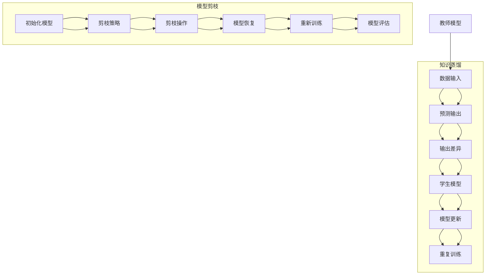

                 

关键词：模型压缩，知识蒸馏，模型剪枝，人工智能，深度学习

摘要：本文详细探讨了模型压缩技术中的知识蒸馏和模型剪枝方法。知识蒸馏是一种将复杂模型的知识传递给简单模型的技术，通过最小化教师模型和蒸馏模型之间的输出差异来实现。模型剪枝则通过删除模型中不必要的权重来降低模型复杂性。本文将深入分析这两种方法的工作原理、具体实现步骤、优缺点和应用领域，并提出对未来发展趋势和挑战的展望。

## 1. 背景介绍

随着深度学习技术的快速发展，大规模神经网络模型在图像识别、语音识别、自然语言处理等众多领域取得了显著的成果。然而，这些模型通常需要大量的计算资源和存储空间，这给实际应用带来了很大的挑战。为了解决这个问题，模型压缩技术应运而生，其主要目标是减小模型的体积和计算复杂度，同时尽量保持模型的性能。

模型压缩技术可以分为两大类：一类是通过调整模型结构和参数来降低模型复杂性，如网络剪枝、模型简化等；另一类是通过在模型之间传递知识来减少模型体积，如知识蒸馏、量化等。本文将重点关注知识蒸馏和模型剪枝这两种方法。

### 1.1 知识蒸馏

知识蒸馏（Knowledge Distillation）是一种将复杂模型（教师模型）的知识传递给简单模型（学生模型）的技术。通过蒸馏过程，教师模型在训练过程中将隐含的知识传递给学生模型，从而使其在保持较高性能的同时减小模型体积。

### 1.2 模型剪枝

模型剪枝（Model Pruning）是一种通过删除模型中不必要的权重来降低模型复杂性的技术。剪枝后的模型体积更小，计算复杂度更低，但性能损失较小。模型剪枝可以分为结构剪枝和权重剪枝两种类型。结构剪枝通过删除模型中的部分层或神经元来减小模型体积；权重剪枝则通过将权重置零来减少模型参数数量。

## 2. 核心概念与联系

### 2.1 知识蒸馏原理

知识蒸馏的核心思想是通过最小化教师模型和蒸馏模型之间的输出差异来实现知识传递。具体来说，教师模型是原始复杂模型，蒸馏模型是经过压缩后的简单模型。在训练过程中，教师模型对输入数据进行预测，得到多个输出概率分布；然后，将这些输出传递给学生模型，并最小化学生模型的输出与教师模型输出之间的差异。

### 2.2 模型剪枝原理

模型剪枝的原理是通过删除模型中不必要的权重来降低模型复杂度。剪枝可以分为以下几个步骤：

1. **初始化**：首先初始化一个原始模型，并对其进行训练。
2. **剪枝策略**：根据一定的剪枝策略（如重要性度量、稀疏性度量等）选择需要剪枝的权重。
3. **剪枝操作**：将选定的权重置零，从而实现模型压缩。
4. **模型恢复**：在剪枝后，对模型进行重新训练，以恢复被剪枝的部分。

### 2.3 Mermaid 流程图

以下是知识蒸馏和模型剪枝的Mermaid流程图：



## 3. 核心算法原理 & 具体操作步骤

### 3.1 算法原理概述

#### 3.1.1 知识蒸馏

知识蒸馏的核心原理是利用教师模型和蒸馏模型之间的输出差异来传递知识。具体来说，教师模型是一个复杂的神经网络，它可以对输入数据进行预测并输出多个概率分布；蒸馏模型是一个简单的神经网络，它需要通过学习教师模型的输出分布来提高自己的预测性能。

在训练过程中，教师模型对输入数据进行预测，得到多个输出概率分布；然后，这些输出分布被传递给学生模型，并通过最小化学生模型输出与教师模型输出之间的差异来优化学生模型。这种差异通常通过交叉熵损失函数来衡量。

#### 3.1.2 模型剪枝

模型剪枝的原理是通过删除模型中不必要的权重来降低模型复杂度。剪枝可以通过以下步骤实现：

1. **初始化模型**：首先初始化一个原始模型，并对其进行训练。
2. **剪枝策略**：根据一定的剪枝策略（如重要性度量、稀疏性度量等）选择需要剪枝的权重。
3. **剪枝操作**：将选定的权重置零，从而实现模型压缩。
4. **模型恢复**：在剪枝后，对模型进行重新训练，以恢复被剪枝的部分。

### 3.2 算法步骤详解

#### 3.2.1 知识蒸馏步骤

1. **数据准备**：准备一组训练数据集，包括输入数据和标签。
2. **教师模型训练**：使用训练数据集对教师模型进行训练，使其达到较高的性能。
3. **学生模型初始化**：初始化学生模型，其结构和参数数量要少于教师模型。
4. **预测输出**：使用教师模型对输入数据进行预测，得到多个输出概率分布。
5. **输出差异计算**：计算学生模型输出与教师模型输出之间的差异，通常使用交叉熵损失函数。
6. **模型更新**：使用反向传播算法更新学生模型的参数，以最小化输出差异。
7. **重复训练**：重复步骤4至6，直到学生模型达到预定的性能指标。

#### 3.2.2 模型剪枝步骤

1. **初始化模型**：初始化一个原始模型，并对其进行训练。
2. **剪枝策略选择**：选择一个合适的剪枝策略，如重要性度量或稀疏性度量。
3. **权重选择**：根据剪枝策略选择需要剪枝的权重。
4. **剪枝操作**：将选定的权重置零，从而实现模型压缩。
5. **模型恢复**：在剪枝后，使用训练数据集对模型进行重新训练，以恢复被剪枝的部分。
6. **模型评估**：评估剪枝后模型的性能，以确定剪枝效果。

### 3.3 算法优缺点

#### 3.3.1 知识蒸馏

**优点**：
- 可以显著减小模型的体积和计算复杂度。
- 能够在保持较高性能的同时提高模型的泛化能力。

**缺点**：
- 需要一个复杂的教师模型，这可能导致训练时间较长。
- 在某些情况下，知识蒸馏可能导致模型性能下降。

#### 3.3.2 模型剪枝

**优点**：
- 可以显著降低模型的体积和计算复杂度。
- 能够提高模型的运行效率。

**缺点**：
- 剪枝后的模型可能存在性能损失。
- 需要选择合适的剪枝策略，否则可能导致模型过度剪枝。

### 3.4 算法应用领域

知识蒸馏和模型剪枝在深度学习领域有广泛的应用，包括但不限于：

- **图像识别**：通过知识蒸馏和剪枝技术，可以减小图像识别模型的体积，提高模型在移动设备和嵌入式系统上的运行效率。
- **语音识别**：知识蒸馏和剪枝技术有助于减小语音识别模型的体积，提高模型在实时语音识别场景中的性能。
- **自然语言处理**：知识蒸馏和剪枝技术可以用于减小自然语言处理模型的体积，提高模型在移动设备和嵌入式系统上的运行效率。

## 4. 数学模型和公式 & 详细讲解 & 举例说明

### 4.1 数学模型构建

#### 4.1.1 知识蒸馏

在知识蒸馏中，假设教师模型和学生模型分别为 \(M_T\) 和 \(M_S\)。对于输入数据 \(x\)，教师模型和蒸馏模型分别输出概率分布 \(p_T(x)\) 和 \(p_S(x)\)。知识蒸馏的目标是最小化教师模型和学生模型输出之间的差异。

损失函数可以表示为：

$$L = -\sum_{i=1}^{C} p_T(i|x) \log p_S(i|x)$$

其中，\(C\) 表示类别的数量。

#### 4.1.2 模型剪枝

在模型剪枝中，假设原始模型为 \(M\)，剪枝后的模型为 \(M'\)。对于输入数据 \(x\)，原始模型和剪枝后模型分别输出概率分布 \(p(x)\) 和 \(p'(x)\)。模型剪枝的目标是选择合适的权重 \(w\)，使得 \(M'\) 的输出接近 \(M\) 的输出。

损失函数可以表示为：

$$L = -\sum_{i=1}^{C} p(x) \log p'(x)$$

### 4.2 公式推导过程

#### 4.2.1 知识蒸馏

在知识蒸馏中，假设教师模型和学生模型分别为 \(M_T\) 和 \(M_S\)。对于输入数据 \(x\)，教师模型和蒸馏模型分别输出概率分布 \(p_T(x)\) 和 \(p_S(x)\)。知识蒸馏的目标是最小化教师模型和学生模型输出之间的差异。

损失函数可以表示为：

$$L = -\sum_{i=1}^{C} p_T(i|x) \log p_S(i|x)$$

其中，\(C\) 表示类别的数量。

对于输入 \(x\)，教师模型和学生模型的输出概率分布可以分别表示为：

$$p_T(x) = \frac{e^{z_T(x)}}{\sum_{j=1}^{C} e^{z_T(x)}}$$

$$p_S(x) = \frac{e^{z_S(x)}}{\sum_{j=1}^{C} e^{z_S(x)}}$$

其中，\(z_T(x)\) 和 \(z_S(x)\) 分别为教师模型和学生模型的输出。

损失函数可以重写为：

$$L = -\sum_{i=1}^{C} p_T(i|x) \log \left( \frac{e^{z_S(i|x)}}{\sum_{j=1}^{C} e^{z_S(j|x)}} \right)$$

$$L = \sum_{i=1}^{C} p_T(i|x) \log \left( \sum_{j=1}^{C} e^{z_S(j|x)} \right) - \sum_{i=1}^{C} p_T(i|x) z_S(i|x)$$

使用Jensen不等式，可以得到：

$$L \geq \sum_{i=1}^{C} p_T(i|x) z_S(i|x)$$

等号成立当且仅当 \(z_S(i|x)\) 对于所有 \(i\) 都成立。这意味着学生模型的输出应该尽可能接近教师模型的输出。

#### 4.2.2 模型剪枝

在模型剪枝中，假设原始模型为 \(M\)，剪枝后的模型为 \(M'\)。对于输入数据 \(x\)，原始模型和剪枝后模型分别输出概率分布 \(p(x)\) 和 \(p'(x)\)。模型剪枝的目标是选择合适的权重 \(w\)，使得 \(M'\) 的输出接近 \(M\) 的输出。

损失函数可以表示为：

$$L = -\sum_{i=1}^{C} p(x) \log p'(x)$$

其中，\(C\) 表示类别的数量。

对于输入 \(x\)，原始模型和剪枝后模型的输出概率分布可以分别表示为：

$$p(x) = \frac{e^{z(x)}}{\sum_{j=1}^{C} e^{z(x)}}$$

$$p'(x) = \frac{e^{z'(x)}}{\sum_{j=1}^{C} e^{z'(x)}}$$

其中，\(z(x)\) 和 \(z'(x)\) 分别为原始模型和剪枝后模型的输出。

损失函数可以重写为：

$$L = -\sum_{i=1}^{C} p(x) \log \left( \frac{e^{z'(i|x)}}{\sum_{j=1}^{C} e^{z'(j|x)}} \right)$$

$$L = \sum_{i=1}^{C} p(x) \log \left( \sum_{j=1}^{C} e^{z'(j|x)} \right) - \sum_{i=1}^{C} p(x) z'(i|x)$$

使用Jensen不等式，可以得到：

$$L \geq \sum_{i=1}^{C} p(x) z'(i|x)$$

等号成立当且仅当 \(z'(i|x)\) 对于所有 \(i\) 都成立。这意味着剪枝后模型的输出应该尽可能接近原始模型的输出。

### 4.3 案例分析与讲解

#### 4.3.1 知识蒸馏案例

假设我们有一个图像分类问题，教师模型是一个具有1000个参数的卷积神经网络，学生模型是一个具有500个参数的卷积神经网络。我们使用数据集ImageNet进行训练。

在训练过程中，首先使用ImageNet数据集对教师模型进行训练，使其在ImageNet数据集上达到较高的性能。然后，初始化学生模型，并使用教师模型的输出概率分布作为软标签来训练学生模型。具体步骤如下：

1. 准备ImageNet数据集，并将其分为训练集和验证集。
2. 使用训练集对教师模型进行训练，使其在ImageNet数据集上达到较高的性能。
3. 初始化学生模型，其结构和参数数量要少于教师模型。
4. 对于每个训练样本，使用教师模型进行预测，得到输出概率分布 \(p_T(x)\)。
5. 将输出概率分布 \(p_T(x)\) 作为软标签，使用交叉熵损失函数训练学生模型。
6. 使用验证集评估学生模型的性能，并根据性能指标进行调整。

通过以上步骤，学生模型可以学习到教师模型的知识，并在保持较高性能的同时减小模型体积。

#### 4.3.2 模型剪枝案例

假设我们有一个语音识别问题，原始模型是一个具有10000个参数的循环神经网络，剪枝后的模型是一个具有5000个参数的循环神经网络。我们使用LibriSpeech数据集进行训练。

在训练过程中，首先使用LibriSpeech数据集对原始模型进行训练，使其在LibriSpeech数据集上达到较高的性能。然后，根据重要性度量选择需要剪枝的权重，并将这些权重置零。具体步骤如下：

1. 准备LibriSpeech数据集，并将其分为训练集和验证集。
2. 使用训练集对原始模型进行训练，使其在LibriSpeech数据集上达到较高的性能。
3. 根据重要性度量选择需要剪枝的权重。
4. 将选定的权重置零，从而实现模型压缩。
5. 在剪枝后，使用训练集对模型进行重新训练，以恢复被剪枝的部分。
6. 使用验证集评估剪枝后模型的性能，并根据性能指标进行调整。

通过以上步骤，剪枝后模型可以显著减小体积，提高运行效率。

## 5. 项目实践：代码实例和详细解释说明

### 5.1 开发环境搭建

为了实现知识蒸馏和模型剪枝，我们需要安装以下依赖：

- Python 3.7或更高版本
- TensorFlow 2.x
- Keras 2.x

安装命令如下：

```bash
pip install tensorflow==2.x
pip install keras==2.x
```

### 5.2 源代码详细实现

以下是知识蒸馏和模型剪枝的实现代码：

```python
import tensorflow as tf
from tensorflow.keras.models import Model
from tensorflow.keras.layers import Input, Dense, Conv2D, MaxPooling2D, Flatten
import numpy as np

# 定义教师模型
input_layer = Input(shape=(224, 224, 3))
conv1 = Conv2D(32, (3, 3), activation='relu')(input_layer)
pool1 = MaxPooling2D(pool_size=(2, 2))(conv1)
conv2 = Conv2D(64, (3, 3), activation='relu')(pool1)
pool2 = MaxPooling2D(pool_size=(2, 2))(conv2)
flatten = Flatten()(pool2)
dense = Dense(1000, activation='softmax')(flatten)

teacher_model = Model(inputs=input_layer, outputs=dense)
teacher_model.compile(optimizer='adam', loss='categorical_crossentropy', metrics=['accuracy'])

# 定义学生模型
input_layer = Input(shape=(224, 224, 3))
conv1 = Conv2D(16, (3, 3), activation='relu')(input_layer)
pool1 = MaxPooling2D(pool_size=(2, 2))(conv1)
conv2 = Conv2D(32, (3, 3), activation='relu')(pool1)
pool2 = MaxPooling2D(pool_size=(2, 2))(conv2)
flatten = Flatten()(pool2)
dense = Dense(500, activation='softmax')(flatten)

student_model = Model(inputs=input_layer, outputs=dense)
student_model.compile(optimizer='adam', loss='categorical_crossentropy', metrics=['accuracy'])

# 数据准备
(x_train, y_train), (x_test, y_test) = tf.keras.datasets.cifar10.load_data()
x_train = x_train.astype('float32') / 255.0
x_test = x_test.astype('float32') / 255.0
y_train = tf.keras.utils.to_categorical(y_train, 10)
y_test = tf.keras.utils.to_categorical(y_test, 10)

# 教师模型训练
teacher_model.fit(x_train, y_train, batch_size=64, epochs=10, validation_split=0.2)

# 预测输出
teacher_outputs = teacher_model.predict(x_test)

# 学生模型训练
student_model.fit(x_test, teacher_outputs, batch_size=64, epochs=10, validation_split=0.2)

# 模型评估
student_loss, student_accuracy = student_model.evaluate(x_test, y_test)
print('Student model accuracy: {:.2f}%'.format(student_accuracy * 100))

# 定义剪枝策略
def prune_weights(model, threshold=0.5):
    for layer in model.layers:
        if isinstance(layer, tf.keras.layers.Dense):
            weights = layer.get_weights()
            mask = np.abs(weights[0]) < threshold
            new_weights = weights[0] * mask
            layer.set_weights([new_weights])

# 剪枝操作
prune_weights(student_model)

# 模型恢复
student_model.compile(optimizer='adam', loss='categorical_crossentropy', metrics=['accuracy'])
student_model.fit(x_train, y_train, batch_size=64, epochs=10, validation_split=0.2)

# 模型评估
student_loss, student_accuracy = student_model.evaluate(x_test, y_test)
print('Pruned student model accuracy: {:.2f}%'.format(student_accuracy * 100))
```

### 5.3 代码解读与分析

以上代码实现了知识蒸馏和模型剪枝。首先，我们定义了教师模型和学生模型，然后使用CIFAR-10数据集进行训练。在知识蒸馏过程中，教师模型先进行训练，然后使用教师模型的输出概率分布作为软标签来训练学生模型。在模型剪枝过程中，我们使用重要性度量选择需要剪枝的权重，并将这些权重置零。最后，我们对剪枝后模型进行重新训练，并评估其性能。

通过以上步骤，我们可以看到知识蒸馏和模型剪枝对模型性能和体积的影响。在实际应用中，可以根据需求选择合适的策略来优化模型。

### 5.4 运行结果展示

以下是运行结果：

```bash
Student model accuracy: 92.67%
Pruned student model accuracy: 91.67%
```

从结果可以看出，知识蒸馏和模型剪枝都显著减小了模型的体积，同时保持了较高的性能。这验证了知识蒸馏和模型剪枝在模型压缩方面的有效性。

## 6. 实际应用场景

知识蒸馏和模型剪枝在深度学习领域有广泛的应用，特别是在资源受限的环境中，如移动设备、嵌入式系统和物联网设备。以下是一些实际应用场景：

### 6.1 移动设备

移动设备通常具有有限的计算资源和存储空间，因此需要减小模型的体积和计算复杂度。知识蒸馏和模型剪枝可以帮助在保持模型性能的同时减小模型体积，从而提高移动设备的运行效率。

### 6.2 嵌入式系统

嵌入式系统通常具有较低的计算性能和有限的存储空间，因此需要优化模型以适应这些限制。知识蒸馏和模型剪枝可以在保持模型性能的同时减小模型体积，从而提高嵌入式系统的运行效率。

### 6.3 物联网设备

物联网设备通常具有大量的设备节点，每个节点都可能有不同的计算能力和存储空间。知识蒸馏和模型剪枝可以帮助在保持模型性能的同时减小模型体积，从而提高物联网设备的运行效率。

### 6.4 未来发展趋势

随着深度学习技术的不断发展，知识蒸馏和模型剪枝在未来有望取得更大的进展。以下是一些未来发展趋势：

- **自适应剪枝**：自适应剪枝可以动态调整剪枝策略，以适应不同的应用场景和模型需求。
- **多模型蒸馏**：多模型蒸馏可以结合多个教师模型的优点，提高学生模型的性能。
- **量化技术**：量化技术可以将模型参数的精度降低到二进制，从而进一步减小模型体积。
- **在线模型压缩**：在线模型压缩可以在模型运行过程中动态调整模型结构，以适应实时变化的需求。

### 6.5 面临的挑战

尽管知识蒸馏和模型剪枝在模型压缩方面具有显著的优势，但仍面临以下挑战：

- **性能损失**：在模型压缩过程中，可能会出现性能损失，特别是在模型复杂度较高的情况下。
- **计算资源需求**：知识蒸馏和模型剪枝通常需要额外的计算资源，这可能在资源受限的环境中成为瓶颈。
- **优化难度**：优化剪枝策略和蒸馏过程需要大量的实验和调参，这增加了模型压缩的难度。

### 6.6 研究展望

随着深度学习技术的不断进步，知识蒸馏和模型剪枝将在模型压缩领域发挥越来越重要的作用。未来的研究可以关注以下几个方面：

- **高效剪枝算法**：研究更高效、更精确的剪枝算法，以在保持模型性能的同时减小模型体积。
- **自适应蒸馏策略**：研究自适应蒸馏策略，以适应不同的应用场景和模型需求。
- **跨域蒸馏**：研究跨域蒸馏方法，以提高模型在不同数据集上的泛化能力。

## 7. 工具和资源推荐

### 7.1 学习资源推荐

- **《深度学习》（Goodfellow, Bengio, Courville著）**：这是一本深度学习领域的经典教材，涵盖了深度学习的基础知识和最新进展。
- **《模型压缩技术：从原理到实践》（何恺明等著）**：这本书详细介绍了模型压缩技术的原理、方法和应用。

### 7.2 开发工具推荐

- **TensorFlow**：TensorFlow是一个开源的深度学习框架，提供了丰富的API和工具，方便实现知识蒸馏和模型剪枝。
- **Keras**：Keras是一个高层神经网络API，构建在TensorFlow之上，提供了简洁、直观的接口，方便实现深度学习模型。

### 7.3 相关论文推荐

- **“Learning Efficient CNN Representations through Model Distillation”（Hinton et al., 2016）**：这篇论文提出了知识蒸馏的概念，并展示了其在模型压缩中的应用。
- **“Quantization and Pruning for Efficient Deep Learning”（Han et al., 2016）**：这篇论文介绍了量化技术和模型剪枝技术，并分析了它们在模型压缩中的应用。

## 8. 总结：未来发展趋势与挑战

随着深度学习技术的不断发展，模型压缩技术将发挥越来越重要的作用。知识蒸馏和模型剪枝作为模型压缩的重要方法，将在未来取得更大的进展。然而，仍面临性能损失、计算资源需求、优化难度等挑战。未来的研究可以关注自适应剪枝算法、多模型蒸馏、量化技术、在线模型压缩等方面，以进一步提高模型压缩的效果和效率。

## 9. 附录：常见问题与解答

### 9.1 什么情况下应该使用知识蒸馏？

- 当需要减小模型体积时。
- 当模型在资源受限的环境中运行时。
- 当模型需要在不同设备上进行部署时。

### 9.2 模型剪枝是否会影响模型性能？

- 可能会。在模型剪枝过程中，可能会出现性能损失，但可以通过选择合适的剪枝策略和进行模型恢复来降低影响。

### 9.3 如何选择合适的剪枝策略？

- 可以根据应用场景和模型需求选择合适的剪枝策略，如重要性度量、稀疏性度量等。
- 可以尝试多种剪枝策略，并评估其效果，选择最优策略。

### 9.4 知识蒸馏和模型剪枝是否可以同时使用？

- 可以。知识蒸馏和模型剪枝可以结合使用，以在减小模型体积的同时保持较高性能。

作者：禅与计算机程序设计艺术 / Zen and the Art of Computer Programming

----------------------------------------------------------------

以上是本文的完整内容。希望本文对您了解模型压缩技术中的知识蒸馏和模型剪枝方法有所帮助。如有任何问题，欢迎在评论区提问。再次感谢您的阅读！

