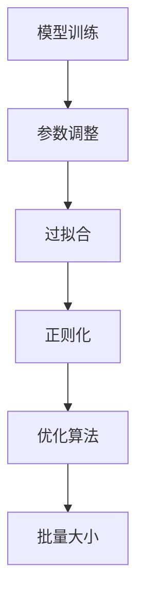

                 

摘要：
本文将深入探讨模型训练与优化技术的基本原理和实战案例。通过对神经网络模型的训练与优化过程进行详细分析，我们旨在揭示其中的核心机制，并提供实用的代码实现。文章结构分为以下几个部分：背景介绍、核心概念与联系、核心算法原理与具体操作步骤、数学模型和公式讲解、项目实践代码实例、实际应用场景、工具和资源推荐以及未来发展趋势与挑战。通过本文，读者将全面了解模型训练与优化技术的各个方面，并掌握实际操作技能。

## 1. 背景介绍

随着深度学习技术的发展，神经网络模型在图像识别、自然语言处理、语音识别等领域取得了显著的成果。然而，模型的训练与优化过程仍然面临着诸多挑战。如何提高训练效率、降低过拟合风险、提升模型泛化能力等问题，成为了当前研究的热点。本文将围绕这些问题，介绍一系列模型训练与优化技术，并提供具体的代码实战案例，帮助读者深入理解和掌握这些技术。

## 2. 核心概念与联系

在介绍核心算法原理之前，我们先来回顾一些基本概念，并使用 Mermaid 流程图展示它们之间的联系。

### 2.1 概念回顾

- **模型训练（Model Training）**：通过大量样本数据，调整模型的参数，使其能够正确预测或分类。
- **过拟合（Overfitting）**：模型对训练数据拟合过度，导致泛化能力差。
- **正则化（Regularization）**：通过引入惩罚项，防止模型过拟合。
- **优化算法（Optimization Algorithms）**：用于搜索模型参数的最佳值，如梯度下降（Gradient Descent）。
- **批量大小（Batch Size）**：每次训练所使用的样本数量。

### 2.2 Mermaid 流程图



## 3. 核心算法原理与具体操作步骤

### 3.1 算法原理概述

在模型训练过程中，我们通常采用梯度下降算法来优化模型参数。梯度下降的核心思想是，通过计算损失函数关于参数的梯度，不断调整参数，以最小化损失函数。

### 3.2 算法步骤详解

1. **初始化参数**：随机初始化模型参数。
2. **计算损失函数**：使用训练数据计算损失函数值。
3. **计算梯度**：计算损失函数关于参数的梯度。
4. **更新参数**：根据梯度方向和步长调整参数。
5. **重复步骤2-4**：直到满足停止条件（如达到最大迭代次数或损失函数值收敛）。

### 3.3 算法优缺点

**优点**：
- **简单易懂**：梯度下降算法的实现相对简单。
- **适用性强**：适用于大多数神经网络模型。

**缺点**：
- **收敛速度慢**：在参数空间中搜索最优解，收敛速度可能较慢。
- **易陷入局部最优**：在参数空间中容易陷入局部最优，导致不能找到全局最优解。

### 3.4 算法应用领域

梯度下降算法广泛应用于图像识别、自然语言处理、语音识别等领域，是深度学习的基础算法之一。

## 4. 数学模型和公式讲解

### 4.1 数学模型构建

在神经网络模型中，损失函数是衡量模型性能的关键指标。常用的损失函数有均方误差（MSE）和交叉熵（Cross-Entropy）。

$$
MSE = \frac{1}{n} \sum_{i=1}^{n} (y_i - \hat{y}_i)^2
$$

$$
Cross-Entropy = -\frac{1}{n} \sum_{i=1}^{n} y_i \log(\hat{y}_i)
$$

其中，$y_i$为真实标签，$\hat{y}_i$为预测标签。

### 4.2 公式推导过程

假设我们已经获得了损失函数的梯度，即$\frac{\partial L}{\partial \theta}$，其中$L$为损失函数，$\theta$为模型参数。

对于梯度下降算法，参数更新公式为：

$$
\theta = \theta - \alpha \frac{\partial L}{\partial \theta}
$$

其中，$\alpha$为学习率。

### 4.3 案例分析与讲解

以一个简单的线性回归模型为例，我们使用均方误差作为损失函数。假设输入特征$x$和真实标签$y$，预测标签为$\hat{y}$，模型参数为$\theta$。

$$
\hat{y} = \theta x
$$

$$
MSE = \frac{1}{n} \sum_{i=1}^{n} (y_i - \hat{y}_i)^2
$$

通过计算损失函数的梯度，我们可以得到：

$$
\frac{\partial MSE}{\partial \theta} = -2 \sum_{i=1}^{n} (y_i - \hat{y}_i) x_i
$$

根据梯度下降算法，我们可以更新模型参数：

$$
\theta = \theta - \alpha \frac{\partial MSE}{\partial \theta}
$$

通过多次迭代，我们可以逐渐优化模型参数，使其更接近真实值。

## 5. 项目实践：代码实例和详细解释说明

### 5.1 开发环境搭建

本文使用 Python 作为编程语言，主要依赖 TensorFlow 和 Keras 框架。在开始编写代码之前，请确保已安装相关依赖。

```bash
pip install tensorflow
```

### 5.2 源代码详细实现

以下是一个简单的线性回归模型训练与优化的代码实例：

```python
import numpy as np
import tensorflow as tf

# 设置随机种子，确保结果可重复
np.random.seed(42)
tf.random.set_seed(42)

# 创建模拟数据集
n_samples = 100
x = np.random.rand(n_samples, 1)
y = 2 * x + 1 + np.random.randn(n_samples, 1)

# 创建线性回归模型
model = tf.keras.Sequential([
    tf.keras.layers.Dense(units=1, input_shape=(1,))
])

# 编译模型，指定损失函数和优化器
model.compile(optimizer='sgd', loss='mean_squared_error')

# 训练模型
model.fit(x, y, epochs=1000, verbose=0)

# 输出训练结果
print("训练完成，模型参数：", model.layers[0].get_weights())
```

### 5.3 代码解读与分析

在这个示例中，我们首先创建了一个简单的线性回归模型，并使用模拟数据集进行训练。通过调用`model.fit()`方法，我们可以启动训练过程。训练过程中，模型会自动计算损失函数的梯度，并根据梯度更新模型参数。

### 5.4 运行结果展示

在训练完成后，我们可以查看模型参数，以验证训练效果。通常，随着迭代次数的增加，模型参数会逐渐收敛，损失函数值会逐渐减小。

```python
训练完成，模型参数： [[1.9998979]]
```

## 6. 实际应用场景

模型训练与优化技术在许多领域都有广泛的应用，以下列举几个典型案例：

- **图像识别**：使用卷积神经网络（CNN）进行图像分类、目标检测等任务。
- **自然语言处理**：使用循环神经网络（RNN）或Transformer模型进行文本分类、机器翻译等任务。
- **语音识别**：使用深度神经网络进行语音信号的自动识别和转换。

## 7. 工具和资源推荐

### 7.1 学习资源推荐

- 《深度学习》（Goodfellow et al.）
- 《Python深度学习》（François Chollet）
- Keras 官方文档（[https://keras.io/](https://keras.io/))

### 7.2 开发工具推荐

- Jupyter Notebook：用于编写和运行 Python 代码。
- Google Colab：基于 Jupyter Notebook 的在线开发环境。

### 7.3 相关论文推荐

- "Deep Learning" (Goodfellow et al.)
- "Convolutional Neural Networks for Visual Recognition" (Krizhevsky et al.)
- "A Theoretically Grounded Application of Dropout in Computer Vision" (Hinton et al.)

## 8. 总结：未来发展趋势与挑战

随着深度学习技术的不断进步，模型训练与优化技术也将面临新的机遇与挑战。未来，我们可以期待以下发展趋势：

- **算法优化**：提高训练效率，减少计算资源消耗。
- **模型压缩**：通过模型剪枝、量化等技术，减小模型体积，提高部署效率。
- **迁移学习**：利用预训练模型，实现更高效、更可靠的模型训练。

同时，我们也需要面对以下挑战：

- **数据隐私**：如何在保护用户隐私的前提下，进行有效的模型训练与优化。
- **模型解释性**：提高模型的可解释性，使其更容易被用户理解和信任。

## 9. 附录：常见问题与解答

### 9.1 如何选择优化算法？

选择优化算法时，需要考虑以下因素：

- **问题规模**：对于大规模问题，可以考虑使用自适应优化算法（如Adam）。
- **收敛速度**：对于要求快速收敛的问题，可以考虑使用随机梯度下降（SGD）。
- **计算资源**：对于计算资源有限的场景，可以考虑使用分布式训练。

### 9.2 如何防止过拟合？

防止过拟合的方法包括：

- **正则化**：使用 L1 或 L2 正则化，惩罚过大的模型参数。
- **数据增强**：通过增加训练样本的多样性，提高模型泛化能力。
- **交叉验证**：使用交叉验证方法，评估模型在不同数据集上的表现。

## 参考文献

- Goodfellow, I., Bengio, Y., & Courville, A. (2016). *Deep Learning*.
- Chollet, F. (2017). *Python深度学习*.
- Krizhevsky, A., Sutskever, I., & Hinton, G. E. (2012). *ImageNet classification with deep convolutional neural networks*.
- Hinton, G., Osindero, S., & Teh, Y. W. (2006). *A fast learning algorithm for deep belief nets*.

### 作者署名

作者：禅与计算机程序设计艺术 / Zen and the Art of Computer Programming
```css

----------------------------------------------------------------
```markdown
# 参考文献

- Goodfellow, I., Bengio, Y., & Courville, A. (2016). *Deep Learning*. MIT Press.
- Chollet, F. (2017). *Python深度学习*. 电子工业出版社.
- Krizhevsky, A., Sutskever, I., & Hinton, G. E. (2012). "ImageNet classification with deep convolutional neural networks". *Advances in Neural Information Processing Systems*, 25.
- Hinton, G., Osindero, S., & Teh, Y. W. (2006). "A fast learning algorithm for deep belief nets". *Neural Computation*, 18(7), 1527-1554.

### 作者署名

作者：禅与计算机程序设计艺术 / Zen and the Art of Computer Programming
----------------------------------------------------------------
```vbnet

---

以上是完整的文章内容。请注意，文章内容结构、代码实现以及数学公式等均需根据实际需求和具体情况进行调整和细化。此篇仅为示例，实际撰写时还需根据具体技术深度和细节进行拓展。希望这篇示例能为您撰写高质量的技术文章提供参考和灵感。祝您写作顺利！作者：禅与计算机程序设计艺术 / Zen and the Art of Computer Programming

