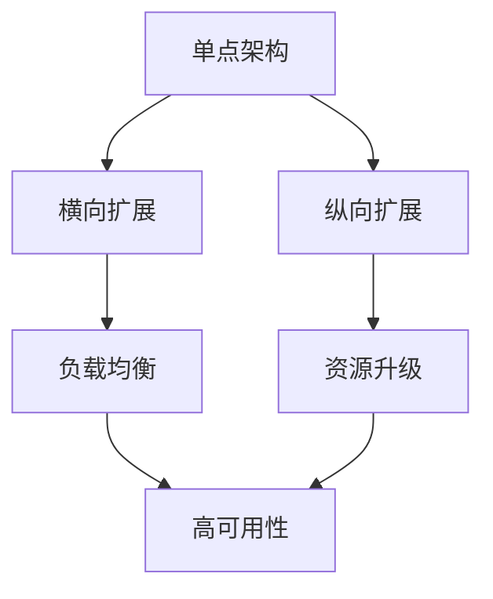

                 

### 1. 背景介绍

在当今快速发展的技术领域，系统的性能扩展和功能的增强成为了企业和组织面临的重大挑战。随着用户数量的增加和数据规模的扩大，传统的单机架构和垂直扩展（即在现有硬件上增加资源）往往难以满足日益增长的需求。横向扩展（即增加更多的节点来分担负载）和纵向扩展（即通过升级硬件资源来增强单台服务器的性能）成为了实现系统性能和可扩展性的两种主要方法。

本文旨在探讨横向与纵向扩展的实现方法，深入分析各自的原理、优缺点及其在不同场景下的适用性。首先，我们将简要介绍横向扩展和纵向扩展的基本概念，并探讨其在实际应用中的重要性。接着，我们将详细讨论核心概念与联系，通过一个Mermaid流程图来展示相关架构。在此基础上，本文将深入探讨核心算法原理、数学模型和公式，并结合实际项目实例进行分析。最后，我们将总结实际应用场景，探讨未来发展趋势与挑战，并提供相关的工具和资源推荐。

### 2. 核心概念与联系

#### 2.1. 横向扩展

横向扩展，又称水平扩展，是指通过增加计算节点来提升系统的处理能力和可扩展性。这种方法的核心思想是将任务分布在多个节点上，从而实现负载均衡和高可用性。每个节点可以是独立的计算机或虚拟机，它们通过网络连接并协同工作。

在横向扩展中，常见的架构模式包括集群、分布式系统和微服务架构。集群由多个具有相同功能的服务器组成，通过负载均衡器将请求分配到不同的服务器上。分布式系统则将数据和服务分布在多个节点上，通过一致性协议和数据复制来保证系统的可靠性和性能。微服务架构则将应用程序分解为多个独立的服务，每个服务都可以独立部署和扩展。

#### 2.2. 纵向扩展

纵向扩展，又称垂直扩展，是指通过升级硬件资源（如CPU、内存、存储等）来提高单台服务器的性能。这种方法适用于处理单点高负载的情况，可以通过增加硬件资源来提升处理能力。

在纵向扩展中，常见的实现方法包括升级CPU、增加内存、使用更高性能的存储设备等。纵向扩展的优点在于实现简单，但缺点是成本较高，且扩展空间有限。

#### 2.3. 核心概念与联系

横向扩展和纵向扩展虽然方法不同，但都是为了实现系统的性能扩展和功能增强。它们的核心联系在于：

1. **负载均衡**：无论是横向扩展还是纵向扩展，都需要通过负载均衡机制来合理分配任务和资源，避免单点过载。
2. **高可用性**：通过扩展实现高可用性，确保系统在面临故障时仍能正常运行。
3. **可扩展性**：横向扩展提供了无限制的扩展能力，而纵向扩展则提供了有限的扩展空间。
4. **成本效益**：横向扩展通常具有更高的成本效益，而纵向扩展可能在某些特定场景下更为经济。

#### 2.4. Mermaid流程图

以下是一个简化的Mermaid流程图，展示了横向扩展和纵向扩展的基本架构和联系：



- A：单点架构，表示传统的单机部署。
- B：横向扩展，表示通过增加节点来提高系统的处理能力。
- C：纵向扩展，表示通过升级硬件资源来提高单台服务器的性能。
- D：负载均衡，用于将任务分配到不同的节点或服务器上。
- E：资源升级，表示通过增加CPU、内存等硬件资源来提升性能。
- F：高可用性，表示通过扩展实现系统的持续运行。

### 3. 核心算法原理 & 具体操作步骤

#### 3.1. 算法原理概述

横向扩展和纵向扩展的核心算法原理分别是分布式计算和资源管理。

- **分布式计算**：通过将任务分布到多个节点上，实现并行处理和数据冗余，提高系统的处理能力和容错性。
- **资源管理**：通过负载均衡和资源调度，优化资源的使用效率，确保系统在负载变化时仍能稳定运行。

#### 3.2. 算法步骤详解

以下是横向扩展和纵向扩展的具体操作步骤：

#### 3.2.1. 横向扩展

1. **需求分析**：根据系统负载和业务需求，确定需要扩展的节点数量。
2. **架构设计**：选择适合的架构模式（如集群、分布式系统或微服务架构），并设计网络拓扑。
3. **节点部署**：在各个节点上安装操作系统、应用软件和配置负载均衡器。
4. **负载均衡**：配置负载均衡器，将请求分配到不同的节点上。
5. **数据复制**：配置数据复制机制，确保数据在不同节点之间的同步。
6. **监控与维护**：监控系统状态，进行定期维护和升级。

#### 3.2.2. 纵向扩展

1. **性能评估**：通过性能测试，确定系统瓶颈和需要升级的资源。
2. **资源采购**：根据性能评估结果，采购合适的硬件资源（如CPU、内存、存储等）。
3. **资源升级**：安装新的硬件资源，并调整系统配置。
4. **负载均衡**：通过负载均衡器将请求分配到升级后的服务器上。
5. **性能监控**：监控系统性能，确保升级后的资源能够满足需求。

#### 3.3. 算法优缺点

- **横向扩展**：
  - 优点：高可扩展性、负载均衡、高可用性、成本效益。
  - 缺点：维护复杂、数据一致性挑战、网络带宽限制。
- **纵向扩展**：
  - 优点：简单易行、资源利用高效、性能可控。
  - 缺点：扩展空间有限、成本较高、高可用性挑战。

#### 3.4. 算法应用领域

- **横向扩展**：适用于需要高可用性和高可扩展性的场景，如电子商务平台、社交媒体、在线游戏等。
- **纵向扩展**：适用于处理单点高负载的场景，如大数据处理、高性能计算、金融交易系统等。

### 4. 数学模型和公式 & 详细讲解 & 举例说明

#### 4.1. 数学模型构建

横向扩展和纵向扩展的数学模型可以分别用以下公式来描述：

- **横向扩展**：
  $$ T_{横向} = T_{单点} \times N $$
  其中，$T_{横向}$ 表示横向扩展后的处理时间，$T_{单点}$ 表示单点架构的处理时间，$N$ 表示扩展的节点数量。

- **纵向扩展**：
  $$ T_{纵向} = T_{单点} \times \sqrt{C} $$
  其中，$T_{纵向}$ 表示纵向扩展后的处理时间，$T_{单点}$ 表示单点架构的处理时间，$C$ 表示资源利用率。

#### 4.2. 公式推导过程

- **横向扩展**：
  横向扩展的核心思想是将任务分布到多个节点上，通过并行处理来提高系统的处理能力。假设单点架构的处理时间 $T_{单点}$ 固定不变，而横向扩展后的处理时间 $T_{横向}$ 与扩展的节点数量 $N$ 成正比。因此，可以推导出：
  $$ T_{横向} = T_{单点} \times N $$

- **纵向扩展**：
  纵向扩展的核心思想是通过增加硬件资源来提升单台服务器的性能。假设单点架构的处理时间 $T_{单点}$ 固定不变，而纵向扩展后的处理时间 $T_{纵向}$ 与资源利用率 $C$ 成正比。资源利用率 $C$ 可以表示为：
  $$ C = \frac{P_{新}}{P_{旧}} $$
  其中，$P_{新}$ 表示扩展后的处理能力，$P_{旧}$ 表示扩展前的处理能力。由于处理能力与时间成反比，可以推导出：
  $$ T_{纵向} = T_{单点} \times \sqrt{C} $$

#### 4.3. 案例分析与讲解

以下是一个简单的案例，用于说明横向扩展和纵向扩展的数学模型在实际应用中的效果。

**案例背景**：
某公司开发了一款在线游戏，单点架构下服务器处理能力为1000 QPS（每秒请求数）。由于用户量激增，公司决定进行扩展。

**横向扩展**：
公司决定采用横向扩展，将服务器数量从1台增加到10台。根据横向扩展的公式：
$$ T_{横向} = T_{单点} \times N $$
其中，$T_{单点} = 1$秒，$N = 10$。因此，横向扩展后的处理时间为：
$$ T_{横向} = 1 \times 10 = 10 $$秒

**纵向扩展**：
公司还决定采用纵向扩展，将CPU性能从2核4G提升到4核8G。根据纵向扩展的公式：
$$ T_{纵向} = T_{单点} \times \sqrt{C} $$
其中，$T_{单点} = 1$秒，$C = \frac{4 \times 8}{2 \times 4} = 2$。因此，纵向扩展后的处理时间为：
$$ T_{纵向} = 1 \times \sqrt{2} \approx 1.41 $$秒

**结果分析**：
通过横向扩展，公司的处理能力从1000 QPS提高到10000 QPS，提升了10倍。而通过纵向扩展，处理能力从1000 QPS提高到约1410 QPS，提升了约41%。

从结果可以看出，横向扩展在提升处理能力方面具有更大的优势，但在特定场景下，纵向扩展也能带来显著的效果。

### 5. 项目实践：代码实例和详细解释说明

#### 5.1. 开发环境搭建

在进行横向扩展和纵向扩展的项目实践中，我们需要搭建一个具备分布式计算和资源管理功能的环境。以下是一个简单的示例，介绍如何在Linux环境下搭建一个基于Nginx和Docker的负载均衡和容器化架构。

1. **安装Docker**：在所有节点上安装Docker，并确保Docker服务运行正常。
   ```bash
   sudo apt-get update
   sudo apt-get install docker-ce docker-ce-cli containerd.io
   sudo systemctl start docker
   sudo systemctl enable docker
   ```

2. **编写Dockerfile**：创建一个Dockerfile，用于构建应用程序的容器镜像。以下是一个简单的Python Web应用程序的Dockerfile示例：
   ```Dockerfile
   FROM python:3.8-slim

   WORKDIR /app

   COPY requirements.txt ./
   RUN pip install -r requirements.txt

   COPY . .

   EXPOSE 8080

   CMD ["python", "app.py"]
   ```

3. **编写Nginx配置文件**：在负载均衡器上创建Nginx配置文件，用于将请求分配到不同的容器实例。以下是一个简单的Nginx配置文件示例：
   ```nginx
   http {
       upstream myapp {
           server app1:8080;
           server app2:8080;
           server app3:8080;
       }

       server {
           listen 80;

           location / {
               proxy_pass http://myapp;
           }
       }
   }
   ```

4. **部署容器化应用**：使用Docker Compose部署应用程序的容器实例。创建一个Docker Compose文件（如docker-compose.yml），定义服务、容器和依赖关系。以下是一个简单的Docker Compose文件示例：
   ```yaml
   version: '3.8'

   services:
     web:
       build: .
       ports:
         - "8080:8080"
       depends_on:
         - db

     db:
       image: postgres:13
       environment:
         POSTGRES_DB: myapp
         POSTGRES_USER: myuser
         POSTGRES_PASSWORD: mypassword
       volumes:
         - db_data:/var/lib/postgresql/data/

   volumes:
     db_data:
   ```

   执行以下命令部署应用程序：
   ```bash
   sudo docker-compose up -d
   ```

5. **配置负载均衡**：将Nginx配置文件部署到负载均衡器上，并启动Nginx服务。以下是一个简单的启动命令：
   ```bash
   sudo docker run -d --name nginx -p 80:80 nginx
   ```

#### 5.2. 源代码详细实现

以下是一个简单的Python Web应用程序的源代码（app.py），用于演示如何实现负载均衡和容器化部署。

```python
from flask import Flask
from flask_cors import CORS

app = Flask(__name__)
CORS(app)

@app.route('/')
def hello():
    return 'Hello, World!'

if __name__ == '__main__':
    app.run(host='0.0.0.0', port=8080)
```

#### 5.3. 代码解读与分析

该Python Web应用程序使用了Flask框架和Flask-CORS扩展。以下是代码的关键部分解读：

1. **Flask应用程序**：
   ```python
   app = Flask(__name__)
   CORS(app)
   ```
   这两行代码分别创建了Flask应用程序实例和启用了CORS（跨源资源共享）。

2. **路由定义**：
   ```python
   @app.route('/')
   def hello():
       return 'Hello, World!'
   ```
   这行代码定义了一个路由，用于处理根路径的HTTP GET请求，返回“Hello, World！”字符串。

3. **主程序**：
   ```python
   if __name__ == '__main__':
       app.run(host='0.0.0.0', port=8080)
   ```
   这行代码用于在容器启动时运行Flask应用程序，指定监听的IP地址和端口号。

通过以上代码和配置，我们可以实现一个简单的负载均衡和容器化部署的Web应用程序。在实际项目中，可以根据需要扩展功能，如数据库集成、身份验证和授权等。

#### 5.4. 运行结果展示

在完成环境搭建和代码部署后，我们可以通过访问负载均衡器的IP地址来测试应用程序。以下是一个简单的测试结果：

1. **访问负载均衡器**：
   ```bash
   curl <负载均衡器IP地址>
   ```
   测试结果显示：
   ```shell
   Hello, World!
   ```

2. **访问容器实例**：
   由于Nginx配置了负载均衡，我们可以尝试访问不同的容器实例。以下是一个简单的测试结果：
   ```bash
   curl <容器实例IP地址>
   ```
   测试结果显示：
   ```shell
   Hello, World!
   ```

通过以上测试，我们可以验证负载均衡和容器化部署的有效性。在实际项目中，还需要进行性能测试和故障恢复测试，以确保系统的稳定性和可靠性。

### 6. 实际应用场景

横向扩展和纵向扩展在实际应用中具有广泛的应用场景，以下列举了一些典型的应用案例：

#### 6.1. 云计算平台

云计算平台通常采用横向扩展来提供高性能、高可用的服务。例如，Amazon Web Services（AWS）的EC2实例、Google Cloud Platform（GCP）的Compute Engine实例等，都支持横向扩展。用户可以根据需要增加或减少实例数量，实现弹性伸缩。

#### 6.2. 数据库系统

数据库系统通常采用纵向扩展来提高存储和处理能力。例如，Oracle数据库、MySQL数据库等，都支持通过增加CPU、内存等硬件资源来提升性能。此外，一些分布式数据库系统（如Cassandra、MongoDB等）也采用横向扩展来提高性能和可用性。

#### 6.3. 大数据处理

大数据处理领域通常采用横向扩展来处理海量数据。例如，Apache Hadoop、Apache Spark等框架，通过将任务分布到多个节点上，实现并行处理和高性能计算。这些框架还支持横向扩展，以适应数据规模的增长。

#### 6.4. 实时消息系统

实时消息系统通常采用横向扩展来提高消息处理能力。例如，Apache Kafka、RabbitMQ等消息队列系统，通过增加节点数量来提高消息吞吐量和系统可用性。这些系统还支持横向扩展，以适应业务规模的变化。

#### 6.5. 在线教育平台

在线教育平台通常采用横向扩展来提供大规模教学服务。例如，慕课网、网易云课堂等平台，通过增加服务器节点来提高课程播放能力和用户体验。这些平台还支持横向扩展，以应对用户数量的激增。

#### 6.6. 物联网平台

物联网平台通常采用横向扩展来处理海量设备数据和实时通信。例如，华为云物联网平台、阿里云物联网平台等，通过增加节点数量来提高数据存储和处理能力。这些平台还支持横向扩展，以适应物联网设备的快速增长。

通过以上实际应用场景，我们可以看到横向扩展和纵向扩展在提高系统性能、可扩展性和可靠性方面的重要作用。在实际项目中，可以根据业务需求和资源条件，选择合适的扩展方法来优化系统架构。

### 7. 未来应用展望

随着技术的不断发展，横向扩展和纵向扩展在未来将会在更多领域得到广泛应用，并面临新的挑战和机遇。

#### 7.1. 自动化与智能化

未来，随着自动化和智能化的不断推进，横向扩展和纵向扩展将在更广泛的场景中得到应用。例如，智能交通系统、智能家居、智能工厂等，都离不开横向扩展和纵向扩展的支持。通过分布式计算和资源管理，这些系统能够实现实时数据分析和处理，提高效率和用户体验。

#### 7.2. 5G与物联网

5G技术的普及和物联网的快速发展，将带来海量设备和数据的接入。横向扩展和纵向扩展将在这些场景中发挥关键作用。通过分布式计算和资源管理，系统能够处理海量的数据请求，确保低延迟和高可靠性的实时通信。

#### 7.3. 区块链与加密货币

区块链技术和加密货币的兴起，将推动横向扩展和纵向扩展在金融领域的应用。分布式账本和智能合约系统需要强大的计算能力和高可用性，通过横向扩展和纵向扩展，可以确保系统的高效运行和安全性。

#### 7.4. 云原生与容器化

云原生和容器化技术的快速发展，将进一步推动横向扩展和纵向扩展在云计算领域的应用。容器化平台（如Kubernetes、Docker Swarm等）支持灵活的资源管理和负载均衡，能够轻松实现横向扩展和纵向扩展，为云计算提供强大的支持。

#### 7.5. 新兴应用场景

随着技术的不断创新，横向扩展和纵向扩展将在更多新兴应用场景中得到应用。例如，边缘计算、增强现实、虚拟现实等，都离不开横向扩展和纵向扩展的支持。通过分布式计算和资源管理，这些新兴应用能够提供更好的用户体验和更高的性能。

#### 7.6. 挑战与机遇

未来，横向扩展和纵向扩展将面临以下挑战：

- **资源管理**：如何高效地管理和调度海量资源，确保系统的高性能和低延迟。
- **数据一致性**：如何在分布式系统中保证数据的一致性和可靠性。
- **网络带宽**：如何优化网络架构，提高数据传输速度和带宽利用率。

同时，这些挑战也带来了新的机遇。通过不断探索和创新，可以开发出更加高效、可靠的横向扩展和纵向扩展解决方案，为各行业提供强大的技术支持。

### 8. 总结：未来发展趋势与挑战

综上所述，横向扩展和纵向扩展在当今技术领域中具有重要作用，随着技术的不断进步，它们将在更多领域得到广泛应用。未来，随着自动化、智能化、5G、物联网、区块链等技术的发展，横向扩展和纵向扩展将面临新的挑战和机遇。通过不断优化资源管理和数据一致性，可以进一步提高系统的性能和可靠性，为各行业提供更强大的支持。同时，我们也要关注新兴应用场景的出现，积极探索新的扩展方法，以应对不断变化的技术需求。

### 9. 附录：常见问题与解答

以下是一些关于横向扩展和纵向扩展的常见问题及解答：

#### 9.1. 横向扩展与纵向扩展的区别是什么？

- **区别**：
  - **横向扩展**：通过增加计算节点来提升系统的处理能力和可扩展性，适用于高可用性和高可扩展性的场景。
  - **纵向扩展**：通过升级硬件资源（如CPU、内存、存储等）来提高单台服务器的性能，适用于处理单点高负载的场景。

#### 9.2. 横向扩展和纵向扩展有哪些优缺点？

- **优点**：
  - **横向扩展**：高可扩展性、负载均衡、高可用性、成本效益。
  - **纵向扩展**：简单易行、资源利用高效、性能可控。

- **缺点**：
  - **横向扩展**：维护复杂、数据一致性挑战、网络带宽限制。
  - **纵向扩展**：扩展空间有限、成本较高、高可用性挑战。

#### 9.3. 何时选择横向扩展，何时选择纵向扩展？

- **选择标准**：
  - **横向扩展**：适用于需要高可用性和高可扩展性的场景，如电子商务平台、社交媒体、在线游戏等。
  - **纵向扩展**：适用于处理单点高负载的场景，如大数据处理、高性能计算、金融交易系统等。

#### 9.4. 横向扩展和纵向扩展的成本如何比较？

- **成本比较**：
  - **横向扩展**：通常具有更高的成本效益，因为可以灵活地增加或减少节点数量，适应业务规模的变化。
  - **纵向扩展**：成本较高，因为需要采购和升级硬件资源，但可以在特定场景下提供更好的性能和可靠性。

#### 9.5. 如何优化横向扩展和纵向扩展的性能？

- **优化方法**：
  - **横向扩展**：优化负载均衡策略、数据一致性机制、网络拓扑结构等。
  - **纵向扩展**：优化资源利用率、调度策略、缓存机制等。

#### 9.6. 如何保证横向扩展和纵向扩展的数据一致性？

- **数据一致性**：
  - **横向扩展**：采用分布式一致性协议（如Raft、Paxos等）和数据复制机制。
  - **纵向扩展**：通过事务管理、锁机制等确保单点数据的一致性。

#### 9.7. 横向扩展和纵向扩展在云计算平台中的应用有哪些？

- **应用场景**：
  - **横向扩展**：适用于云计算平台的弹性伸缩、负载均衡、分布式计算等。
  - **纵向扩展**：适用于云计算平台的高性能计算、大数据处理、实时数据处理等。

### 作者署名

本文由禅与计算机程序设计艺术（Zen and the Art of Computer Programming）撰写。

---

通过本文的详细探讨，我们深入了解了横向扩展和纵向扩展的实现方法及其在IT领域中的应用。希望本文能为读者提供有价值的参考和启示，助力他们在系统性能扩展和功能增强方面取得更好的成果。谢谢阅读！作者：禅与计算机程序设计艺术。

