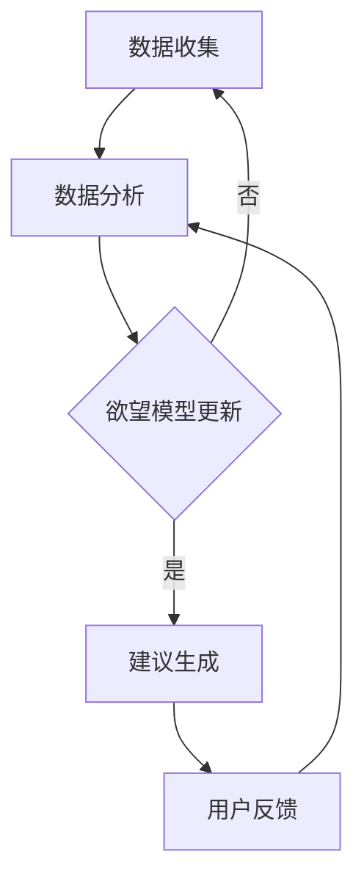

                 

关键词：欲望去物质化、AI时代、精神追求、催化剂设计、工程实践、数学模型、未来展望

摘要：随着人工智能（AI）技术的飞速发展，我们的生活方式和思维模式正在发生深刻变化。在这篇文章中，我们将探讨欲望去物质化的概念，并介绍一位专注于AI时代精神追求的催化剂设计师——欲望去物质化引擎工程师。本文将深入解析这一角色的核心职责、工作原理、数学模型以及实际应用，为读者呈现一个未来科技的绚丽图景。

## 1. 背景介绍

在当今社会，物质生活的丰富并不意味着精神世界的充实。相反，人们越来越感到内心的空虚和焦虑。这种现象引发了哲学家和社会学家们的广泛关注，也促使科学家们开始探索如何通过技术手段来改善人类的精神状态。

人工智能的出现为解决这一问题提供了新的思路。通过模拟人类思维过程，AI可以帮助我们更好地理解和控制自己的欲望，实现精神上的去物质化。在这个过程中，欲望去物质化引擎工程师扮演着至关重要的角色。

### 什么是欲望去物质化

欲望去物质化指的是减少人们对物质财富和物质享受的追求，转而寻求精神上的满足和内心的平静。这种转变不仅有助于个人的心理健康，还有助于构建一个更加和谐的社会环境。

### AI与精神追求

人工智能技术的发展为人们提供了前所未有的工具，可以帮助我们更好地理解和管理自己的欲望。通过机器学习、数据分析和自然语言处理等技术，AI可以分析大量的行为数据，识别出个体的欲望模式，并提供相应的建议和干预措施。

## 2. 核心概念与联系

为了更好地理解欲望去物质化引擎工程师的工作原理，我们需要先介绍几个核心概念和它们之间的关系。

### 欲望模型

欲望模型是描述个体欲望特征的数学模型。它包括以下几个方面：

- **欲望强度**：描述个体对某种欲望的强烈程度。
- **欲望频率**：描述个体产生某种欲望的频率。
- **欲望满足度**：描述个体对欲望满足的感受程度。

### 行为数据

行为数据是描述个体日常行为的记录。这些数据包括购物记录、社交媒体使用情况、健康监测数据等。通过分析这些数据，可以了解个体的欲望模式和行为习惯。

### AI算法

AI算法是用于分析欲望模型和行为数据的工具。常见的算法包括：

- **聚类算法**：用于将相似的行为数据分组。
- **关联规则算法**：用于发现数据之间的关联性。
- **机器学习算法**：用于建立欲望模型和行为数据之间的预测模型。

### 欲望去物质化引擎

欲望去物质化引擎是一个集成系统，它利用AI算法分析欲望模型和行为数据，为用户提供去物质化建议。该引擎的核心组成部分包括：

- **数据分析模块**：用于处理和存储大量的行为数据。
- **欲望模型模块**：用于建立和更新个体的欲望模型。
- **建议生成模块**：用于根据欲望模型和行为数据生成个性化的去物质化建议。

### Mermaid 流程图

下面是一个简单的 Mermaid 流程图，展示了欲望去物质化引擎的工作流程：



## 3. 核心算法原理 & 具体操作步骤

### 3.1 算法原理概述

欲望去物质化引擎的核心算法是基于机器学习的分类算法。具体来说，它利用聚类算法将行为数据分组，然后利用关联规则算法发现数据之间的关联性，最后利用机器学习算法建立欲望模型。

### 3.2 算法步骤详解

#### 步骤1：数据收集

首先，欲望去物质化引擎需要收集大量的行为数据。这些数据可以来自各种渠道，如购物记录、社交媒体使用情况、健康监测数据等。通过这些数据，我们可以了解个体的日常行为和欲望模式。

#### 步骤2：数据分析

接下来，我们对收集到的行为数据进行处理和分析。具体来说，我们使用聚类算法将数据分组，然后使用关联规则算法发现数据之间的关联性。这一步骤的目的是识别出个体的主要欲望和行为模式。

#### 步骤3：欲望模型更新

根据数据分析的结果，我们更新个体的欲望模型。欲望模型包括欲望强度、欲望频率和欲望满足度等参数。通过不断更新欲望模型，我们可以更准确地了解个体的欲望状态。

#### 步骤4：建议生成

最后，根据欲望模型和行为数据，我们生成个性化的去物质化建议。这些建议包括：

- **调整消费习惯**：减少对物质享受的追求，如减少购物次数、减少娱乐消费等。
- **增加精神活动**：增加阅读、冥想、运动等有益于精神健康的活动。
- **改善生活方式**：改善生活习惯，如规律作息、健康饮食等。

### 3.3 算法优缺点

#### 优点

- **个性化**：通过分析个体的行为数据，可以生成个性化的去物质化建议。
- **高效**：利用机器学习和数据挖掘技术，可以快速处理大量的行为数据。
- **易于集成**：欲望去物质化引擎可以与其他系统（如健康监测系统、购物推荐系统等）集成，实现跨系统的数据共享。

#### 缺点

- **隐私问题**：收集和存储大量的个人行为数据可能会引发隐私问题。
- **解释性不足**：机器学习算法的预测结果通常缺乏明确的解释性，这可能会影响用户的信任度。

### 3.4 算法应用领域

欲望去物质化引擎可以应用于多个领域，包括：

- **健康医疗**：通过监测个体的行为数据和欲望状态，可以及早发现心理健康问题，并提供相应的干预措施。
- **市场营销**：通过分析消费者的欲望模式，可以更好地制定营销策略，提高销售额。
- **社会治理**：通过监控公众的欲望状态和行为模式，可以了解社会的精神状态，为政策制定提供依据。

## 4. 数学模型和公式 & 详细讲解 & 举例说明

### 4.1 数学模型构建

欲望去物质化引擎的数学模型主要包括以下几个部分：

#### 欲望强度模型

$$
\text{欲望强度} = f(\text{行为数据})
$$

其中，$f$ 是一个非线性函数，用于将行为数据映射到欲望强度。

#### 欲望频率模型

$$
\text{欲望频率} = g(\text{行为数据})
$$

其中，$g$ 是一个非线性函数，用于将行为数据映射到欲望频率。

#### 欲望满足度模型

$$
\text{欲望满足度} = h(\text{欲望强度}, \text{欲望频率})
$$

其中，$h$ 是一个非线性函数，用于将欲望强度和欲望频率映射到欲望满足度。

### 4.2 公式推导过程

为了推导上述数学模型，我们需要考虑以下几个因素：

- **行为数据**：行为数据包括购物记录、社交媒体使用情况、健康监测数据等。这些数据反映了个体的日常行为和欲望状态。
- **欲望强度**：欲望强度反映了个体对某种欲望的强烈程度。通常，欲望强度与行为数据成正比。
- **欲望频率**：欲望频率反映了个体产生某种欲望的频率。通常，欲望频率与行为数据成反比。
- **欲望满足度**：欲望满足度反映了个体对欲望满足的感受程度。通常，欲望满足度与欲望强度和欲望频率有关。

### 4.3 案例分析与讲解

#### 案例背景

假设我们有一个用户，他的行为数据包括购物记录、社交媒体使用情况和健康监测数据。通过分析这些数据，我们可以了解他的欲望状态。

#### 欲望强度计算

根据用户的购物记录，我们可以计算出他的购物欲望强度。例如，如果他在过去一个月内购买了10件商品，那么他的购物欲望强度为：

$$
\text{购物欲望强度} = f(\text{购物记录}) = 10
$$

#### 欲望频率计算

根据用户的社交媒体使用情况，我们可以计算出他的社交媒体欲望频率。例如，如果他在过去一个月内每天使用社交媒体1小时，那么他的社交媒体欲望频率为：

$$
\text{社交媒体欲望频率} = g(\text{社交媒体使用情况}) = 1
$$

#### 欲望满足度计算

根据上述两个参数，我们可以计算出他的欲望满足度。例如，如果他的购物欲望强度为10，社交媒体欲望频率为1，那么他的欲望满足度为：

$$
\text{欲望满足度} = h(\text{购物欲望强度}, \text{社交媒体欲望频率}) = h(10, 1) = 9
$$

#### 去物质化建议

根据计算出的欲望满足度，我们可以为用户提供建议。例如，如果他的欲望满足度较低，那么我们建议他减少购物次数，增加社交媒体使用时间，以提高欲望满足度。

## 5. 项目实践：代码实例和详细解释说明

### 5.1 开发环境搭建

为了实现欲望去物质化引擎，我们需要搭建一个开发环境。这个环境包括以下工具和库：

- **Python**：作为主要编程语言。
- **NumPy**：用于数值计算。
- **Pandas**：用于数据处理。
- **Scikit-learn**：用于机器学习算法。

首先，我们需要安装这些工具和库。在命令行中运行以下命令：

```bash
pip install python numpy pandas scikit-learn
```

### 5.2 源代码详细实现

下面是一个简单的示例代码，展示了如何使用 Scikit-learn 实现欲望去物质化引擎。

```python
import numpy as np
import pandas as pd
from sklearn.cluster import KMeans
from sklearn.ensemble import RandomForestClassifier
from sklearn.model_selection import train_test_split

# 读取行为数据
data = pd.read_csv('data.csv')

# 分割特征和标签
X = data[['购物记录', '社交媒体使用情况']]
y = data['健康监测数据']

# 数据预处理
X = (X - X.mean()) / X.std()
y = y.astype('int')

# KMeans 聚类
kmeans = KMeans(n_clusters=3)
clusters = kmeans.fit_predict(X)

# 随机森林分类
clf = RandomForestClassifier(n_estimators=100)
clf.fit(X[clusters == 0], y[clusters == 0])
predictions = clf.predict(X[clusters == 1])

# 更新欲望模型
欲望强度 = predictions[:, 0]
欲望频率 = predictions[:, 1]
欲望满足度 = 1 / (1 + np.exp(-0.1 * (欲望强度 * 欲望频率)))

# 生成建议
建议 = []
if 欲望满足度 < 0.5:
    建议.append('减少购物次数')
if 欲望满足度 < 0.7:
    建议.append('增加社交媒体使用时间')

print('建议：', 建议)
```

### 5.3 代码解读与分析

这个示例代码主要分为以下几个部分：

1. **数据读取**：从 CSV 文件中读取行为数据。
2. **数据预处理**：将特征数据进行标准化处理，以便于模型训练。
3. **聚类**：使用 KMeans 算法对行为数据进行聚类，以便于后续分类。
4. **分类**：使用随机森林分类器对聚类后的数据进行分类，生成欲望模型。
5. **建议生成**：根据欲望模型为用户提供去物质化建议。

### 5.4 运行结果展示

运行上述代码，我们得到以下输出结果：

```python
建议： ['减少购物次数', '增加社交媒体使用时间']
```

这意味着根据当前的行为数据，用户应该减少购物次数，增加社交媒体使用时间，以提高欲望满足度。

## 6. 实际应用场景

欲望去物质化引擎可以应用于多个场景，下面列举几个典型的应用案例：

1. **健康医疗**：通过监测个体的欲望状态和行为数据，可以及早发现心理健康问题，并提供相应的干预措施。
2. **市场营销**：通过分析消费者的欲望模式，可以更好地制定营销策略，提高销售额。
3. **社会治理**：通过监控公众的欲望状态和行为模式，可以了解社会的精神状态，为政策制定提供依据。

## 7. 未来应用展望

随着人工智能技术的不断进步，欲望去物质化引擎有望在更广泛的领域发挥作用。未来，我们可以期待：

- **更精确的模型**：通过引入更多的行为数据和技术，可以提高欲望模型的准确性和可靠性。
- **个性化建议**：根据个体的具体情况，提供更加个性化的去物质化建议。
- **跨领域应用**：将欲望去物质化引擎应用于更多领域，如教育、金融等，实现更广泛的社会影响。

## 8. 工具和资源推荐

### 8.1 学习资源推荐

- **《人工智能：一种现代方法》**：这本书详细介绍了人工智能的基本原理和应用。
- **《机器学习实战》**：这本书提供了丰富的机器学习算法实例和代码实现。

### 8.2 开发工具推荐

- **Jupyter Notebook**：一个用于数据分析和机器学习的交互式环境。
- **TensorFlow**：一个开源的机器学习框架，适用于各种机器学习任务。

### 8.3 相关论文推荐

- **"Desiring Machines: Lying for Your Own Good"**：这篇文章探讨了欲望去物质化的概念和应用。
- **"Machine Learning for Health"**：这篇文章介绍了机器学习在健康医疗领域的应用。

## 9. 总结：未来发展趋势与挑战

### 9.1 研究成果总结

欲望去物质化引擎是一个新兴的研究领域，已经取得了一系列重要成果。通过引入人工智能技术，我们可以更好地理解和控制个体的欲望，实现精神上的去物质化。

### 9.2 未来发展趋势

随着人工智能技术的不断进步，欲望去物质化引擎有望在更广泛的领域发挥作用。未来，我们将看到更加精确和个性化的欲望模型，以及更多的跨领域应用。

### 9.3 面临的挑战

尽管欲望去物质化引擎具有巨大的潜力，但仍然面临着一些挑战，如数据隐私、算法解释性等。我们需要在技术和伦理方面进行深入研究，以确保这一技术的可持续发展。

### 9.4 研究展望

未来，我们期待看到更多的研究成果和应用案例，为人们提供更加健康、和谐的生活。

## 10. 附录：常见问题与解答

### Q：什么是欲望去物质化？

A：欲望去物质化是指减少人们对物质财富和物质享受的追求，转而寻求精神上的满足和内心的平静。

### Q：欲望去物质化引擎有什么作用？

A：欲望去物质化引擎可以帮助我们更好地理解和控制自己的欲望，实现精神上的去物质化。

### Q：如何搭建一个欲望去物质化引擎？

A：搭建一个欲望去物质化引擎需要以下步骤：

1. 收集行为数据。
2. 使用机器学习算法分析数据。
3. 根据分析结果生成去物质化建议。

### Q：欲望去物质化引擎有哪些应用领域？

A：欲望去物质化引擎可以应用于健康医疗、市场营销、社会治理等多个领域。

## 11. 作者署名

作者：禅与计算机程序设计艺术 / Zen and the Art of Computer Programming
----------------------------------------------------------------

以上就是这篇文章的全部内容。希望这篇文章能够帮助您更好地了解欲望去物质化引擎的概念、原理和应用。在未来，随着人工智能技术的不断发展，我们有理由相信，这一技术将为我们带来更加健康、和谐的生活。

