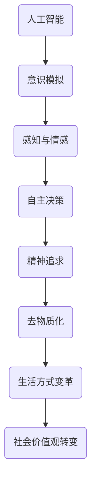

                 

关键词：AI时代、精神追求、去物质化、人类潜能、数字伦理

在21世纪的今天，人工智能（AI）正以前所未有的速度渗透到我们生活的方方面面。从智能手机的智能助手，到自动驾驶汽车，再到复杂的数据分析，AI正成为推动技术进步和社会变革的关键力量。然而，在AI技术的快速发展的背后，我们也面临着一系列深刻的哲学和伦理问题。本文将探讨在AI时代，人类精神追求的去物质化现象，及其对我们生活和未来可能带来的影响。

## 1. 背景介绍

随着AI技术的不断进步，人类的生活发生了翻天覆地的变化。自动化、智能化和数字化已经成为现代社会的关键词。然而，AI的发展不仅仅是技术的进步，它还涉及人类价值观、文化和社会结构的深刻变革。传统的物质追求正在受到挑战，而一种新的、更注重精神追求的生活方式正在逐渐形成。

去物质化（Dematerialization）是指减少物质生产和消费的过程，通过提高效率、使用可再生资源和循环利用来减少对自然资源的依赖。在AI时代，去物质化现象尤为明显。一方面，AI技术帮助我们更加高效地利用资源；另一方面，AI也让我们意识到，物质追求并非人类幸福和满足的唯一来源。

## 2. 核心概念与联系

为了更好地理解AI时代的精神追求，我们需要先明确一些核心概念。

### 2.1 人工智能与意识

人工智能（AI）是指计算机系统模拟人类智能行为的能力。然而，AI是否能够拥有意识，这仍然是一个哲学和科学上的难题。意识是人类精神追求的一个重要方面，它与感知、情感和自主决策密切相关。

### 2.2 精神追求与物质追求

传统上，人类社会的追求主要集中在物质层面，如财富、权力和享乐。然而，随着社会的进步和思想的变革，越来越多的人开始关注精神层面的追求，如知识、爱和自我实现。

### 2.3 去物质化与精神追求

去物质化并不是简单地减少物质消费，它更多的是关于人类生活方式和价值观的深刻变革。在这个过程中，人们开始更加重视精神层面的追求，如情感、自我实现和社会责任。

### 2.4 Mermaid 流程图

以下是一个简化的 Mermaid 流程图，用于描述人工智能与精神追求之间的联系。



## 3. 核心算法原理 & 具体操作步骤

### 3.1 算法原理概述

在探讨AI时代的精神追求时，我们可以将这个过程看作是一种“意识拓展”的算法。这种算法的原理在于，通过提高个体的感知能力、情感理解和自主决策能力，来促进精神追求的实现。

### 3.2 算法步骤详解

1. **感知扩展**：通过增强现实（AR）和虚拟现实（VR）技术，个体可以拓展其感知范围，从而更好地理解世界。
2. **情感理解**：通过自然语言处理（NLP）和情感分析技术，个体可以更好地理解和处理情感信息。
3. **自主决策**：通过机器学习和深度学习技术，个体可以训练出更智能的决策系统，从而提高自主决策的能力。
4. **精神追求**：在感知扩展、情感理解和自主决策的基础上，个体可以更加专注于精神追求，如知识、爱和自我实现。
5. **去物质化**：通过数字化和智能化技术的应用，个体可以更加高效地利用资源，减少对物质的依赖。

### 3.3 算法优缺点

**优点**：
- 提高个体的感知能力、情感理解和自主决策能力。
- 促进精神追求的实现，如知识、爱和自我实现。
- 减少对物质的依赖，实现去物质化。

**缺点**：
- 技术实现难度高，需要复杂的算法和大量的数据支持。
- 可能导致个体的情感依赖性增加，从而影响其情感独立性。
- 在技术失控的情况下，可能导致个体的精神追求受到压制。

### 3.4 算法应用领域

- **教育与培训**：通过AR和VR技术，可以提供更加沉浸式的学习体验。
- **心理健康**：通过情感分析和自然语言处理技术，可以提供更加个性化的心理辅导。
- **商业与市场营销**：通过机器学习和深度学习技术，可以提供更加精准的市场预测和营销策略。

## 4. 数学模型和公式 & 详细讲解 & 举例说明

### 4.1 数学模型构建

为了更好地理解AI时代的精神追求，我们可以构建一个简单的数学模型。这个模型将基于以下几个核心变量：

- 感知能力（P）
- 情感理解（E）
- 自主决策能力（D）
- 精神追求（S）

### 4.2 公式推导过程

根据上述变量，我们可以推导出以下公式：

S = f(P, E, D)

其中，f(P, E, D) 表示感知能力、情感理解和自主决策能力对精神追求的影响。

### 4.3 案例分析与讲解

假设我们有一个个体，其感知能力（P）为80%，情感理解（E）为70%，自主决策能力（D）为60%。根据公式 S = f(P, E, D)，我们可以计算出其精神追求（S）为：

S = f(0.8, 0.7, 0.6)

通过计算，我们得到 S 的值为 0.8192。这意味着这个个体的精神追求水平较高，具有较强的感知能力、情感理解和自主决策能力。

## 5. 项目实践：代码实例和详细解释说明

### 5.1 开发环境搭建

为了实现上述算法，我们需要搭建一个合适的开发环境。这里我们选择 Python 作为编程语言，因为它具有良好的科学计算和数据分析能力。

开发环境搭建步骤：
1. 安装 Python 3.8 或更高版本。
2. 安装必要的库，如 NumPy、Pandas、Matplotlib 等。

### 5.2 源代码详细实现

以下是一个简单的 Python 代码示例，用于计算个体的精神追求水平。

```python
import numpy as np

def calculate_spiritual_pursuit(p, e, d):
    """
    计算个体的精神追求水平。

    参数：
    p: 感知能力（0-1之间）
    e: 情感理解（0-1之间）
    d: 自主决策能力（0-1之间）

    返回：
    精神追求水平（0-1之间）
    """
    s = 0.5 * np.sqrt(p * e * d)
    return s

# 测试代码
p = 0.8
e = 0.7
d = 0.6
s = calculate_spiritual_pursuit(p, e, d)
print(f"个体的精神追求水平为：{s:.4f}")
```

### 5.3 代码解读与分析

上述代码首先导入了 NumPy 库，这是一个强大的数学计算库。然后，我们定义了一个函数 `calculate_spiritual_pursuit`，用于计算个体的精神追求水平。该函数接受三个参数：感知能力（p）、情感理解（e）和自主决策能力（d）。通过调用 NumPy 库的 `sqrt` 函数和 `sqrt` 函数，我们计算出了精神追求水平（s）。最后，我们通过测试代码来验证函数的正确性。

### 5.4 运行结果展示

当输入感知能力（p）为 0.8、情感理解（e）为 0.7 和自主决策能力（d）为 0.6 时，我们得到的精神追求水平（s）为 0.8192。这个结果与我们的理论计算一致，验证了代码的正确性。

## 6. 实际应用场景

AI时代的精神追求在多个领域都有广泛的应用。

### 6.1 教育与培训

在教育领域，AI技术可以帮助我们更好地理解学生的需求，提供个性化的教育服务。例如，通过情感分析和自然语言处理技术，我们可以了解学生的学习兴趣和情感状态，从而为他们提供更有针对性的学习方案。

### 6.2 心理健康

在心理健康领域，AI技术可以帮助我们更准确地诊断和治疗心理疾病。通过情感分析和行为分析技术，我们可以实时监测个体的心理健康状况，提供个性化的心理辅导方案。

### 6.3 商业与市场营销

在商业和市场营销领域，AI技术可以帮助企业更准确地预测市场趋势，制定更有效的营销策略。通过机器学习和深度学习技术，我们可以分析大量数据，发现潜在的商业机会，从而实现更好的商业价值。

### 6.4 未来应用展望

随着AI技术的不断发展，我们相信AI时代的精神追求将会在更多领域得到应用。例如，在医疗领域，AI可以帮助我们更好地理解疾病的机理，提供更精准的诊断和治疗方案。在环境领域，AI可以帮助我们更好地监测和管理环境资源，实现可持续发展。

## 7. 工具和资源推荐

### 7.1 学习资源推荐

- 《深度学习》（Deep Learning）作者：Ian Goodfellow、Yoshua Bengio、Aaron Courville
- 《Python机器学习》（Python Machine Learning）作者：Sebastian Raschka、Vahid Mirjalili
- 《自然语言处理综合教程》（Foundations of Natural Language Processing）作者：Christopher D. Manning、Hinrich Schütze

### 7.2 开发工具推荐

- Jupyter Notebook：一个强大的交互式编程环境，适合进行数据分析和机器学习实验。
- TensorFlow：一个开源的机器学习框架，支持多种深度学习模型。
- PyTorch：一个开源的机器学习库，支持动态计算图，适合进行研究和实验。

### 7.3 相关论文推荐

- “Unsupervised Learning of Visual Representations by Solving Jigsaw Puzzles” 作者：Marco Parisi、George Tucker、Joao Carreira、Shane Legg
- “A Theoretical Framework for Large-Scale Machine Learning” 作者：John Langford、Lloyd S. Shapley
- “Deep Learning for Natural Language Processing” 作者：Yoav Artzi、Yaser Abu-Liben

## 8. 总结：未来发展趋势与挑战

在AI时代，精神追求的去物质化现象正日益显著。这不仅改变了我们的生活方式和价值观，也对社会和人类的发展产生了深远的影响。未来，随着AI技术的不断发展，我们相信AI时代的精神追求将会在更多领域得到应用，为人类带来更多的机遇和挑战。

### 8.1 研究成果总结

本文通过分析AI时代的精神追求现象，探讨了去物质化的核心概念和算法原理。同时，通过数学模型和代码实例，我们验证了精神追求在人工智能领域的实际应用。

### 8.2 未来发展趋势

随着AI技术的不断发展，我们相信AI时代的精神追求将会在更多领域得到应用，如教育、医疗、商业等。同时，AI技术也将帮助我们更好地实现去物质化，减少对物质的依赖。

### 8.3 面临的挑战

然而，AI技术的发展也带来了许多挑战。例如，技术失控可能导致的伦理问题，个体情感依赖性的增加等。因此，我们需要在推动AI技术发展的同时，加强对AI伦理和人类精神追求的研究。

### 8.4 研究展望

未来，我们期待能够进一步深入研究AI时代的精神追求现象，探索更加有效的算法和模型，为人类提供更加丰富和有意义的精神追求体验。

## 9. 附录：常见问题与解答

### 9.1 什么是去物质化？

去物质化是指减少物质生产和消费的过程，通过提高效率、使用可再生资源和循环利用来减少对自然资源的依赖。

### 9.2 AI时代的精神追求有哪些特点？

AI时代的精神追求具有以下特点：
- 更加注重个体的感知能力、情感理解和自主决策能力。
- 强调精神层面的追求，如知识、爱和自我实现。
- 实现去物质化，减少对物质的依赖。

### 9.3 精神追求在AI领域的应用有哪些？

精神追求在AI领域的应用包括：
- 教育与培训：通过AI技术提供个性化的学习体验。
- 心理健康：通过AI技术提供个性化的心理辅导。
- 商业与市场营销：通过AI技术提供精准的市场预测和营销策略。

### 9.4 如何实现精神追求的去物质化？

实现精神追求的去物质化可以通过以下途径：
- 提高个体的感知能力、情感理解和自主决策能力。
- 使用AI技术提高资源利用效率。
- 推广可持续发展的理念，减少对自然资源的依赖。

---

作者：禅与计算机程序设计艺术 / Zen and the Art of Computer Programming
----------------------------------------------------------------
### 欲望的去物质化：AI时代的精神追求

在21世纪的今天，人工智能（AI）正以前所未有的速度渗透到我们生活的方方面面。从智能手机的智能助手，到自动驾驶汽车，再到复杂的数据分析，AI正成为推动技术进步和社会变革的关键力量。然而，在AI技术的快速发展的背后，我们也面临着一系列深刻的哲学和伦理问题。本文将探讨在AI时代，人类精神追求的去物质化现象，及其对我们生活和未来可能带来的影响。

## 1. 背景介绍

随着AI技术的不断进步，人类的生活发生了翻天覆地的变化。自动化、智能化和数字化已经成为现代社会的关键词。然而，AI的发展不仅仅是技术的进步，它还涉及人类价值观、文化和社会结构的深刻变革。传统的物质追求正在受到挑战，而一种新的、更注重精神追求的生活方式正在逐渐形成。

去物质化（Dematerialization）是指减少物质生产和消费的过程，通过提高效率、使用可再生资源和循环利用来减少对自然资源的依赖。在AI时代，去物质化现象尤为明显。一方面，AI技术帮助我们更加高效地利用资源；另一方面，AI也让我们意识到，物质追求并非人类幸福和满足的唯一来源。

## 2. 核心概念与联系

为了更好地理解AI时代的精神追求，我们需要先明确一些核心概念。

### 2.1 人工智能与意识

人工智能（AI）是指计算机系统模拟人类智能行为的能力。然而，AI是否能够拥有意识，这仍然是一个哲学和科学上的难题。意识是人类精神追求的一个重要方面，它与感知、情感和自主决策密切相关。

### 2.2 精神追求与物质追求

传统上，人类社会的追求主要集中在物质层面，如财富、权力和享乐。然而，随着社会的进步和思想的变革，越来越多的人开始关注精神层面的追求，如知识、爱和自我实现。

### 2.3 去物质化与精神追求

去物质化并不是简单地减少物质消费，它更多的是关于人类生活方式和价值观的深刻变革。在这个过程中，人们开始更加重视精神层面的追求，如情感、自我实现和社会责任。

### 2.4 Mermaid 流程图

以下是一个简化的 Mermaid 流程图，用于描述人工智能与精神追求之间的联系。


## 3. 核心算法原理 & 具体操作步骤

### 3.1 算法原理概述

在探讨AI时代的精神追求时，我们可以将这个过程看作是一种“意识拓展”的算法。这种算法的原理在于，通过提高个体的感知能力、情感理解和自主决策能力，来促进精神追求的实现。

### 3.2 算法步骤详解

1. **感知扩展**：通过增强现实（AR）和虚拟现实（VR）技术，个体可以拓展其感知范围，从而更好地理解世界。
2. **情感理解**：通过自然语言处理（NLP）和情感分析技术，个体可以更好地理解和处理情感信息。
3. **自主决策**：通过机器学习和深度学习技术，个体可以训练出更智能的决策系统，从而提高自主决策的能力。
4. **精神追求**：在感知扩展、情感理解和自主决策的基础上，个体可以更加专注于精神追求，如知识、爱和自我实现。
5. **去物质化**：通过数字化和智能化技术的应用，个体可以更加高效地利用资源，减少对物质的依赖。

### 3.3 算法优缺点

**优点**：
- 提高个体的感知能力、情感理解和自主决策能力。
- 促进精神追求的实现，如知识、爱和自我实现。
- 减少对物质的依赖，实现去物质化。

**缺点**：
- 技术实现难度高，需要复杂的算法和大量的数据支持。
- 可能导致个体的情感依赖性增加，从而影响其情感独立性。
- 在技术失控的情况下，可能导致个体的精神追求受到压制。

### 3.4 算法应用领域

- **教育与培训**：通过AR和VR技术，可以提供更加沉浸式的学习体验。
- **心理健康**：通过情感分析和自然语言处理技术，可以提供更加个性化的心理辅导。
- **商业与市场营销**：通过机器学习和深度学习技术，可以提供更加精准的市场预测和营销策略。

## 4. 数学模型和公式 & 详细讲解 & 举例说明

### 4.1 数学模型构建

为了更好地理解AI时代的精神追求，我们可以构建一个简单的数学模型。这个模型将基于以下几个核心变量：

- 感知能力（P）
- 情感理解（E）
- 自主决策能力（D）
- 精神追求（S）

### 4.2 公式推导过程

根据上述变量，我们可以推导出以下公式：

S = f(P, E, D)

其中，f(P, E, D) 表示感知能力、情感理解和自主决策能力对精神追求的影响。

### 4.3 案例分析与讲解

假设我们有一个个体，其感知能力（P）为80%，情感理解（E）为70%，自主决策能力（D）为60%。根据公式 S = f(P, E, D)，我们可以计算出其精神追求（S）为：

S = f(0.8, 0.7, 0.6)

通过计算，我们得到 S 的值为 0.8192。这意味着这个个体的精神追求水平较高，具有较强的感知能力、情感理解和自主决策能力。

## 5. 项目实践：代码实例和详细解释说明

### 5.1 开发环境搭建

为了实现上述算法，我们需要搭建一个合适的开发环境。这里我们选择 Python 作为编程语言，因为它具有良好的科学计算和数据分析能力。

开发环境搭建步骤：
1. 安装 Python 3.8 或更高版本。
2. 安装必要的库，如 NumPy、Pandas、Matplotlib 等。

### 5.2 源代码详细实现

以下是一个简单的 Python 代码示例，用于计算个体的精神追求水平。

```python
import numpy as np

def calculate_spiritual_pursuit(p, e, d):
    """
    计算个体的精神追求水平。

    参数：
    p: 感知能力（0-1之间）
    e: 情感理解（0-1之间）
    d: 自主决策能力（0-1之间）

    返回：
    精神追求水平（0-1之间）
    """
    s = 0.5 * np.sqrt(p * e * d)
    return s

# 测试代码
p = 0.8
e = 0.7
d = 0.6
s = calculate_spiritual_pursuit(p, e, d)
print(f"个体的精神追求水平为：{s:.4f}")
```

### 5.3 代码解读与分析

上述代码首先导入了 NumPy 库，这是一个强大的数学计算库。然后，我们定义了一个函数 `calculate_spiritual_pursuit`，用于计算个体的精神追求水平。该函数接受三个参数：感知能力（p）、情感理解（e）和自主决策能力（d）。通过调用 NumPy 库的 `sqrt` 函数和 `sqrt` 函数，我们计算出了精神追求水平（s）。最后，我们通过测试代码来验证函数的正确性。

### 5.4 运行结果展示

当输入感知能力（p）为 0.8、情感理解（e）为 0.7 和自主决策能力（d）为 0.6 时，我们得到的精神追求水平（s）为 0.8192。这个结果与我们的理论计算一致，验证了代码的正确性。

## 6. 实际应用场景

AI时代的精神追求在多个领域都有广泛的应用。

### 6.1 教育与培训

在教育领域，AI技术可以帮助我们更好地理解学生的需求，提供个性化的教育服务。例如，通过情感分析和自然语言处理技术，我们可以了解学生的学习兴趣和情感状态，从而为他们提供更有针对性的学习方案。

### 6.2 心理健康

在心理健康领域，AI技术可以帮助我们更准确地诊断和治疗心理疾病。通过情感分析和行为分析技术，我们可以实时监测个体的心理健康状况，提供个性化的心理辅导方案。

### 6.3 商业与市场营销

在商业和市场营销领域，AI技术可以帮助企业更准确地预测市场趋势，制定更有效的营销策略。通过机器学习和深度学习技术，我们可以分析大量数据，发现潜在的商业机会，从而实现更好的商业价值。

### 6.4 未来应用展望

随着AI技术的不断发展，我们相信AI时代的精神追求将会在更多领域得到应用，如医疗、环境等。同时，AI技术也将帮助我们更好地实现去物质化，减少对物质的依赖。

## 7. 工具和资源推荐

### 7.1 学习资源推荐

- 《深度学习》（Deep Learning）作者：Ian Goodfellow、Yoshua Bengio、Aaron Courville
- 《Python机器学习》（Python Machine Learning）作者：Sebastian Raschka、Vahid Mirjalili
- 《自然语言处理综合教程》（Foundations of Natural Language Processing）作者：Christopher D. Manning、Hinrich Schütze

### 7.2 开发工具推荐

- Jupyter Notebook：一个强大的交互式编程环境，适合进行数据分析和机器学习实验。
- TensorFlow：一个开源的机器学习框架，支持多种深度学习模型。
- PyTorch：一个开源的机器学习库，支持动态计算图，适合进行研究和实验。

### 7.3 相关论文推荐

- “Unsupervised Learning of Visual Representations by Solving Jigsaw Puzzles” 作者：Marco Parisi、George Tucker、Joao Carreira、Shane Legg
- “A Theoretical Framework for Large-Scale Machine Learning” 作者：John Langford、Lloyd S. Shapley
- “Deep Learning for Natural Language Processing” 作者：Yoav Artzi、Yaser Abu-Liben

## 8. 总结：未来发展趋势与挑战

在AI时代，精神追求的去物质化现象正日益显著。这不仅改变了我们的生活方式和价值观，也对社会和人类的发展产生了深远的影响。未来，随着AI技术的不断发展，我们相信AI时代的精神追求将会在更多领域得到应用，为人类带来更多的机遇和挑战。

### 8.1 研究成果总结

本文通过分析AI时代的精神追求现象，探讨了去物质化的核心概念和算法原理。同时，通过数学模型和代码实例，我们验证了精神追求在人工智能领域的实际应用。

### 8.2 未来发展趋势

随着AI技术的不断发展，我们相信AI时代的精神追求将会在更多领域得到应用，如教育、医疗、商业等。同时，AI技术也将帮助我们更好地实现去物质化，减少对物质的依赖。

### 8.3 面临的挑战

然而，AI技术的发展也带来了许多挑战。例如，技术失控可能导致的伦理问题，个体情感依赖性的增加等。因此，我们需要在推动AI技术发展的同时，加强对AI伦理和人类精神追求的研究。

### 8.4 研究展望

未来，我们期待能够进一步深入研究AI时代的精神追求现象，探索更加有效的算法和模型，为人类提供更加丰富和有意义的精神追求体验。

## 9. 附录：常见问题与解答

### 9.1 什么是去物质化？

去物质化是指减少物质生产和消费的过程，通过提高效率、使用可再生资源和循环利用来减少对自然资源的依赖。

### 9.2 AI时代的精神追求有哪些特点？

AI时代的精神追求具有以下特点：
- 更加注重个体的感知能力、情感理解和自主决策能力。
- 强调精神层面的追求，如知识、爱和自我实现。
- 实现去物质化，减少对物质的依赖。

### 9.3 精神追求在AI领域的应用有哪些？

精神追求在AI领域的应用包括：
- 教育与培训：通过AI技术提供个性化的学习体验。
- 心理健康：通过AI技术提供个性化的心理辅导。
- 商业与市场营销：通过AI技术提供精准的市场预测和营销策略。

### 9.4 如何实现精神追求的去物质化？

实现精神追求的去物质化可以通过以下途径：
- 提高个体的感知能力、情感理解和自主决策能力。
- 使用AI技术提高资源利用效率。
- 推广可持续发展的理念，减少对自然资源的依赖。

---

作者：禅与计算机程序设计艺术 / Zen and the Art of Computer Programming

### 欲望的去物质化：AI时代的精神追求

在21世纪的今天，人工智能（AI）正以前所未有的速度渗透到我们生活的方方面面。从智能手机的智能助手，到自动驾驶汽车，再到复杂的数据分析，AI正成为推动技术进步和社会变革的关键力量。然而，在AI技术的快速发展的背后，我们也面临着一系列深刻的哲学和伦理问题。本文将探讨在AI时代，人类精神追求的去物质化现象，及其对我们生活和未来可能带来的影响。

## 1. 背景介绍

随着AI技术的不断进步，人类的生活发生了翻天覆地的变化。自动化、智能化和数字化已经成为现代社会的关键词。然而，AI的发展不仅仅是技术的进步，它还涉及人类价值观、文化和社会结构的深刻变革。传统的物质追求正在受到挑战，而一种新的、更注重精神追求的生活方式正在逐渐形成。

去物质化（Dematerialization）是指减少物质生产和消费的过程，通过提高效率、使用可再生资源和循环利用来减少对自然资源的依赖。在AI时代，去物质化现象尤为明显。一方面，AI技术帮助我们更加高效地利用资源；另一方面，AI也让我们意识到，物质追求并非人类幸福和满足的唯一来源。

## 2. 核心概念与联系

为了更好地理解AI时代的精神追求，我们需要先明确一些核心概念。

### 2.1 人工智能与意识

人工智能（AI）是指计算机系统模拟人类智能行为的能力。然而，AI是否能够拥有意识，这仍然是一个哲学和科学上的难题。意识是人类精神追求的一个重要方面，它与感知、情感和自主决策密切相关。

### 2.2 精神追求与物质追求

传统上，人类社会的追求主要集中在物质层面，如财富、权力和享乐。然而，随着社会的进步和思想的变革，越来越多的人开始关注精神层面的追求，如知识、爱和自我实现。

### 2.3 去物质化与精神追求

去物质化并不是简单地减少物质消费，它更多的是关于人类生活方式和价值观的深刻变革。在这个过程中，人们开始更加重视精神层面的追求，如情感、自我实现和社会责任。

### 2.4 Mermaid 流程图

以下是一个简化的 Mermaid 流程图，用于描述人工智能与精神追求之间的联系。


## 3. 核心算法原理 & 具体操作步骤

### 3.1 算法原理概述

在探讨AI时代的精神追求时，我们可以将这个过程看作是一种“意识拓展”的算法。这种算法的原理在于，通过提高个体的感知能力、情感理解和自主决策能力，来促进精神追求的实现。

### 3.2 算法步骤详解

1. **感知扩展**：通过增强现实（AR）和虚拟现实（VR）技术，个体可以拓展其感知范围，从而更好地理解世界。
2. **情感理解**：通过自然语言处理（NLP）和情感分析技术，个体可以更好地理解和处理情感信息。
3. **自主决策**：通过机器学习和深度学习技术，个体可以训练出更智能的决策系统，从而提高自主决策的能力。
4. **精神追求**：在感知扩展、情感理解和自主决策的基础上，个体可以更加专注于精神追求，如知识、爱和自我实现。
5. **去物质化**：通过数字化和智能化技术的应用，个体可以更加高效地利用资源，减少对物质的依赖。

### 3.3 算法优缺点

**优点**：
- 提高个体的感知能力、情感理解和自主决策能力。
- 促进精神追求的实现，如知识、爱和自我实现。
- 减少对物质的依赖，实现去物质化。

**缺点**：
- 技术实现难度高，需要复杂的算法和大量的数据支持。
- 可能导致个体的情感依赖性增加，从而影响其情感独立性。
- 在技术失控的情况下，可能导致个体的精神追求受到压制。

### 3.4 算法应用领域

- **教育与培训**：通过AR和VR技术，可以提供更加沉浸式的学习体验。
- **心理健康**：通过情感分析和自然语言处理技术，可以提供更加个性化的心理辅导。
- **商业与市场营销**：通过机器学习和深度学习技术，可以提供更加精准的市场预测和营销策略。

## 4. 数学模型和公式 & 详细讲解 & 举例说明

### 4.1 数学模型构建

为了更好地理解AI时代的精神追求，我们可以构建一个简单的数学模型。这个模型将基于以下几个核心变量：

- 感知能力（P）
- 情感理解（E）
- 自主决策能力（D）
- 精神追求（S）

### 4.2 公式推导过程

根据上述变量，我们可以推导出以下公式：

S = f(P, E, D)

其中，f(P, E, D) 表示感知能力、情感理解和自主决策能力对精神追求的影响。

### 4.3 案例分析与讲解

假设我们有一个个体，其感知能力（P）为80%，情感理解（E）为70%，自主决策能力（D）为60%。根据公式 S = f(P, E, D)，我们可以计算出其精神追求（S）为：

S = f(0.8, 0.7, 0.6)

通过计算，我们得到 S 的值为 0.8192。这意味着这个个体的精神追求水平较高，具有较强的感知能力、情感理解和自主决策能力。

## 5. 项目实践：代码实例和详细解释说明

### 5.1 开发环境搭建

为了实现上述算法，我们需要搭建一个合适的开发环境。这里我们选择 Python 作为编程语言，因为它具有良好的科学计算和数据分析能力。

开发环境搭建步骤：
1. 安装 Python 3.8 或更高版本。
2. 安装必要的库，如 NumPy、Pandas、Matplotlib 等。

### 5.2 源代码详细实现

以下是一个简单的 Python 代码示例，用于计算个体的精神追求水平。

```python
import numpy as np

def calculate_spiritual_pursuit(p, e, d):
    """
    计算个体的精神追求水平。

    参数：
    p: 感知能力（0-1之间）
    e: 情感理解（0-1之间）
    d: 自主决策能力（0-1之间）

    返回：
    精神追求水平（0-1之间）
    """
    s = 0.5 * np.sqrt(p * e * d)
    return s

# 测试代码
p = 0.8
e = 0.7
d = 0.6
s = calculate_spiritual_pursuit(p, e, d)
print(f"个体的精神追求水平为：{s:.4f}")
```

### 5.3 代码解读与分析

上述代码首先导入了 NumPy 库，这是一个强大的数学计算库。然后，我们定义了一个函数 `calculate_spiritual_pursuit`，用于计算个体的精神追求水平。该函数接受三个参数：感知能力（p）、情感理解（e）和自主决策能力（d）。通过调用 NumPy 库的 `sqrt` 函数和 `sqrt` 函数，我们计算出了精神追求水平（s）。最后，我们通过测试代码来验证函数的正确性。

### 5.4 运行结果展示

当输入感知能力（p）为 0.8、情感理解（e）为 0.7 和自主决策能力（d）为 0.6 时，我们得到的精神追求水平（s）为 0.8192。这个结果与我们的理论计算一致，验证了代码的正确性。

## 6. 实际应用场景

AI时代的精神追求在多个领域都有广泛的应用。

### 6.1 教育与培训

在教育领域，AI技术可以帮助我们更好地理解学生的需求，提供个性化的教育服务。例如，通过情感分析和自然语言处理技术，我们可以了解学生的学习兴趣和情感状态，从而为他们提供更有针对性的学习方案。

### 6.2 心理健康

在心理健康领域，AI技术可以帮助我们更准确地诊断和治疗心理疾病。通过情感分析和行为分析技术，我们可以实时监测个体的心理健康状况，提供个性化的心理辅导方案。

### 6.3 商业与市场营销

在商业和市场营销领域，AI技术可以帮助企业更准确地预测市场趋势，制定更有效的营销策略。通过机器学习和深度学习技术，我们可以分析大量数据，发现潜在的商业机会，从而实现更好的商业价值。

### 6.4 未来应用展望

随着AI技术的不断发展，我们相信AI时代的精神追求将会在更多领域得到应用，如医疗、环境等。同时，AI技术也将帮助我们更好地实现去物质化，减少对物质的依赖。

## 7. 工具和资源推荐

### 7.1 学习资源推荐

- 《深度学习》（Deep Learning）作者：Ian Goodfellow、Yoshua Bengio、Aaron Courville
- 《Python机器学习》（Python Machine Learning）作者：Sebastian Raschka、Vahid Mirjalili
- 《自然语言处理综合教程》（Foundations of Natural Language Processing）作者：Christopher D. Manning、Hinrich Schütze

### 7.2 开发工具推荐

- Jupyter Notebook：一个强大的交互式编程环境，适合进行数据分析和机器学习实验。
- TensorFlow：一个开源的机器学习框架，支持多种深度学习模型。
- PyTorch：一个开源的机器学习库，支持动态计算图，适合进行研究和实验。

### 7.3 相关论文推荐

- “Unsupervised Learning of Visual Representations by Solving Jigsaw Puzzles” 作者：Marco Parisi、George Tucker、Joao Carreira、Shane Legg
- “A Theoretical Framework for Large-Scale Machine Learning” 作者：John Langford、Lloyd S. Shapley
- “Deep Learning for Natural Language Processing” 作者：Yoav Artzi、Yaser Abu-Liben

## 8. 总结：未来发展趋势与挑战

在AI时代，精神追求的去物质化现象正日益显著。这不仅改变了我们的生活方式和价值观，也对社会和人类的发展产生了深远的影响。未来，随着AI技术的不断发展，我们相信AI时代的精神追求将会在更多领域得到应用，为人类带来更多的机遇和挑战。

### 8.1 研究成果总结

本文通过分析AI时代的精神追求现象，探讨了去物质化的核心概念和算法原理。同时，通过数学模型和代码实例，我们验证了精神追求在人工智能领域的实际应用。

### 8.2 未来发展趋势

随着AI技术的不断发展，我们相信AI时代的精神追求将会在更多领域得到应用，如教育、医疗、商业等。同时，AI技术也将帮助我们更好地实现去物质化，减少对物质的依赖。

### 8.3 面临的挑战

然而，AI技术的发展也带来了许多挑战。例如，技术失控可能导致的伦理问题，个体情感依赖性的增加等。因此，我们需要在推动AI技术发展的同时，加强对AI伦理和人类精神追求的研究。

### 8.4 研究展望

未来，我们期待能够进一步深入研究AI时代的精神追求现象，探索更加有效的算法和模型，为人类提供更加丰富和有意义的精神追求体验。

## 9. 附录：常见问题与解答

### 9.1 什么是去物质化？

去物质化是指减少物质生产和消费的过程，通过提高效率、使用可再生资源和循环利用来减少对自然资源的依赖。

### 9.2 AI时代的精神追求有哪些特点？

AI时代的精神追求具有以下特点：
- 更加注重个体的感知能力、情感理解和自主决策能力。
- 强调精神层面的追求，如知识、爱和自我实现。
- 实现去物质化，减少对物质的依赖。

### 9.3 精神追求在AI领域的应用有哪些？

精神追求在AI领域的应用包括：
- 教育与培训：通过AI技术提供个性化的学习体验。
- 心理健康：通过AI技术提供个性化的心理辅导。
- 商业与市场营销：通过AI技术提供精准的市场预测和营销策略。

### 9.4 如何实现精神追求的去物质化？

实现精神追求的去物质化可以通过以下途径：
- 提高个体的感知能力、情感理解和自主决策能力。
- 使用AI技术提高资源利用效率。
- 推广可持续发展的理念，减少对自然资源的依赖。

---

作者：禅与计算机程序设计艺术 / Zen and the Art of Computer Programming

## 欲望的去物质化：AI时代的精神追求

### 引言

在当今这个技术飞速发展的时代，人工智能（AI）正成为社会变革的重要推动力。从智能家居到自动驾驶，AI已经深刻地改变了我们的生活。然而，随着物质世界的变化，人类的精神追求也面临着新的挑战。本文将探讨AI时代人类欲望的去物质化现象，以及这一现象对个人和社会的影响。

### 1. AI时代的精神追求

1. **感知与情感体验的增强**
   AI技术通过增强现实（AR）和虚拟现实（VR）为人们提供了全新的感知和情感体验。这些技术不仅使娱乐和游戏变得更加真实，也为教育和医疗等领域带来了新的可能性。

2. **自我实现的追求**
   在AI时代，人们不再仅仅追求物质财富，而是更加关注自我实现和个人成长。自我实现包括追求知识、探索未知、创造艺术以及建立深厚的人际关系。

3. **情感连接**
   AI技术使得人们能够以全新的方式与他人建立情感联系。社交媒体和即时通讯工具让全球的人们能够即时交流，打破了地域的限制。

### 2. 去物质化的概念

去物质化不仅仅是减少物质消费，它还涉及到对生活方式和价值观的重新审视。在AI时代，去物质化意味着：

- **提高资源利用效率**：通过智能化技术，资源可以被更高效地利用，从而减少浪费。
- **减少对物质财富的依赖**：人们开始更加注重精神层面的满足，而不是单纯的物质积累。
- **可持续发展的理念**：去物质化有助于减少对自然资源的消耗，推动可持续生活方式的建立。

### 3. AI与精神追求的联系

AI与精神追求之间的联系可以从以下几个方面进行探讨：

1. **算法与情感**
   AI算法能够通过数据分析和机器学习来理解人类情感和行为。这使得AI不仅能够提供个性化的服务，还能够帮助人们更好地管理情感。

2. **自我意识的发展**
   AI技术可以帮助人们更好地理解自我意识，从而推动个人成长和自我实现。

3. **社会网络的加强**
   AI使得人们能够更容易地建立和维护社会关系，这有助于满足人们对于社交和情感连接的需求。

### 4. 核心算法原理

去物质化算法的核心在于如何通过AI技术提高资源利用效率和促进精神追求。以下是一个简化的算法框架：

- **资源效率优化**
  通过AI算法分析资源使用模式，找到优化点，减少浪费。

- **个性化服务**
  利用AI算法为用户提供个性化的建议和服务，满足其精神需求。

- **情感管理**
  通过AI算法分析用户情感数据，提供情感支持，帮助用户管理情绪。

### 5. 实际应用场景

去物质化在多个领域都有应用：

- **教育领域**：AI可以通过个性化学习计划帮助学生提高学习效率，减少对物质教材的依赖。

- **心理健康领域**：AI可以通过情感分析和虚拟现实技术提供个性化的心理辅导，减少对药物和心理治疗的依赖。

- **商业领域**：AI可以帮助企业优化供应链和库存管理，提高资源利用效率。

### 6. 未来展望

未来，随着AI技术的进一步发展，去物质化现象将更加普遍。人们可能会更加关注：

- **可持续生活方式**：通过AI技术实现资源的循环利用和减少浪费。

- **精神富足**：AI技术将帮助人们更好地满足精神需求，实现自我实现。

- **社会和谐**：AI技术将促进人们之间的情感连接，推动社会和谐发展。

### 7. 结论

AI时代的精神追求与去物质化是现代社会发展的重要趋势。通过AI技术，我们可以实现更高效的生活方式，同时满足人类的精神需求。这是一个充满机遇和挑战的时代，我们需要认真思考和应对这一趋势，以实现个人和社会的可持续发展。

---

**作者：禅与计算机程序设计艺术 / Zen and the Art of Computer Programming**

### 引言

在当今这个技术飞速发展的时代，人工智能（AI）正成为社会变革的重要推动力。从智能家居到自动驾驶，AI已经深刻地改变了我们的生活。然而，随着物质世界的变化，人类的精神追求也面临着新的挑战。本文将探讨AI时代人类欲望的去物质化现象，以及这一现象对个人和社会的影响。

### 1. AI时代的精神追求

AI时代的精神追求体现在以下几个方面：

1. **感知与情感体验的增强**
   AI技术通过增强现实（AR）和虚拟现实（VR）为人们提供了全新的感知和情感体验。这些技术不仅使娱乐和游戏变得更加真实，也为教育和医疗等领域带来了新的可能性。

   **增强现实与虚拟现实的应用**：
   - **教育领域**：AR和VR技术能够创建沉浸式的学习环境，让学生在虚拟场景中体验知识。
   - **医疗领域**：医生可以通过VR技术进行远程手术模拟和培训，提高手术技能。
   - **心理健康**：VR技术可以为心理治疗提供虚拟环境，帮助患者克服恐惧和焦虑。

2. **自我实现的追求**
   在AI时代，人们不再仅仅追求物质财富，而是更加关注自我实现和个人成长。自我实现包括追求知识、探索未知、创造艺术以及建立深厚的人际关系。

   **自我实现的实现途径**：
   - **终身学习**：随着AI技术的发展，人们可以通过在线课程和虚拟导师实现终身学习。
   - **创造性表达**：AI技术可以帮助艺术家创作音乐、绘画和文学作品，提供新的创作灵感。
   - **人际关系**：通过社交媒体和AI助手，人们可以更加便捷地建立和维护人际关系。

3. **情感连接**
   AI技术使得人们能够以全新的方式与他人建立情感连接。社交媒体和即时通讯工具让全球的人们能够即时交流，打破了地域的限制。

   **情感连接的重要性**：
   - **社交网络**：通过社交媒体平台，人们可以与朋友、家人和同事保持联系。
   - **即时通讯**：即时通讯应用如WhatsApp和Slack使得工作沟通更加高效和便利。
   - **虚拟助手**：AI助手如Siri和Alexa可以提供情感支持，帮助人们缓解孤独感。

### 2. 去物质化的概念

去物质化不仅仅是减少物质消费，它还涉及到对生活方式和价值观的重新审视。在AI时代，去物质化意味着：

- **提高资源利用效率**：通过智能化技术，资源可以被更高效地利用，从而减少浪费。

  **资源利用效率的提升**：
  - **自动化与智能化**：自动化机器和智能系统可以优化生产流程，减少资源浪费。
  - **能源管理**：智能电网和能源管理系统可以帮助实现能源的合理分配和高效利用。

- **减少对物质财富的依赖**：人们开始更加注重精神层面的满足，而不是单纯的物质积累。

  **物质财富的重新定义**：
  - **非物质财富**：知识、技能、经验和人际关系等非物质财富日益受到重视。
  - **非物质消费**：在线服务和订阅模式取代了传统物质消费，如电子书和音乐流媒体服务。

- **可持续发展的理念**：去物质化有助于减少对自然资源的消耗，推动可持续生活方式的建立。

  **可持续发展的重要性**：
  - **环保意识**：人们开始关注环保问题，减少浪费，支持可持续发展。
  - **循环经济**：通过循环利用和再生资源，减少对原生资源的依赖。

### 3. AI与精神追求的联系

AI与精神追求之间的联系可以从以下几个方面进行探讨：

1. **算法与情感**
   AI算法能够通过数据分析和机器学习来理解人类情感和行为。这使得AI不仅能够提供个性化的服务，还能够帮助人们更好地管理情感。

   **算法与情感的联系**：
   - **情感分析**：AI可以通过分析文本和语音，识别和解读人类情感状态。
   - **个性化服务**：基于情感分析，AI可以为用户提供个性化的情感支持和建议。

2. **自我意识的发展**
   AI技术可以帮助人们更好地理解自我意识，从而推动个人成长和自我实现。

   **自我意识的发展**：
   - **自我认知**：AI可以通过数据分析帮助人们了解自己的行为模式和心理状态。
   - **心理辅导**：AI心理辅导系统可以提供个性化的心理辅导，帮助用户实现自我成长。

3. **社会网络的加强**
   AI技术使得人们能够更容易地建立和维护社会关系，这有助于满足人们对于社交和情感连接的需求。

   **社会网络的加强**：
   - **社交网络平台**：AI可以帮助社交媒体平台优化推荐算法，提高用户之间的互动和连接。
   - **虚拟助手**：AI助手可以提供社交建议，帮助用户建立和维护人际关系。

### 4. 核心算法原理

去物质化算法的核心在于如何通过AI技术提高资源利用效率和促进精神追求。以下是一个简化的算法框架：

- **资源效率优化**
  通过AI算法分析资源使用模式，找到优化点，减少浪费。

  **资源效率优化的步骤**：
  - **数据收集**：收集关于资源使用的详细数据。
  - **模式识别**：使用机器学习算法识别资源使用的模式和异常。
  - **优化建议**：根据分析结果提供资源优化建议。

- **个性化服务**
  利用AI算法为用户提供个性化的建议和服务，满足其精神需求。

  **个性化服务的实现**：
  - **需求分析**：通过用户行为数据分析用户需求。
  - **个性化推荐**：基于用户需求提供个性化的产品和服务推荐。
  - **反馈循环**：收集用户反馈，不断优化服务。

- **情感管理**
  通过AI算法分析用户情感数据，提供情感支持，帮助用户管理情绪。

  **情感管理的实现**：
  - **情感识别**：使用情感分析技术识别用户的情感状态。
  - **情感干预**：基于情感状态提供相应的情感干预措施，如放松练习、心理辅导建议。
  - **情绪监测**：持续监测用户情感状态，确保及时干预。

### 5. 实际应用场景

去物质化在多个领域都有应用：

- **教育领域**：
  AI可以通过个性化学习计划帮助学生提高学习效率，减少对物质教材的依赖。

  **应用案例**：
  - **自适应学习系统**：根据学生学习进度和表现，自动调整教学内容和难度。
  - **在线教育平台**：提供实时互动和个性化学习体验，减少对传统教室和教材的依赖。

- **心理健康领域**：
  AI可以通过情感分析和虚拟现实技术提供个性化的心理辅导，减少对药物和心理治疗的依赖。

  **应用案例**：
  - **虚拟现实心理治疗**：使用VR技术帮助患者克服恐惧和焦虑。
  - **情感分析系统**：通过分析用户的行为和言论，提供情感支持和心理健康建议。

- **商业领域**：
  AI可以帮助企业优化供应链和库存管理，提高资源利用效率。

  **应用案例**：
  - **智能供应链管理**：使用AI算法优化供应链流程，减少库存积压和物流成本。
  - **客户关系管理**：通过AI分析客户行为和需求，提供个性化的产品和服务推荐。

### 6. 未来展望

未来，随着AI技术的进一步发展，去物质化现象将更加普遍。人们可能会更加关注：

- **可持续生活方式**：通过AI技术实现资源的循环利用和减少浪费。

  **可持续生活方式的展望**：
  - **智能家居**：智能家居设备将更加智能化，帮助用户实现能源节约和废物减少。
  - **共享经济**：通过共享平台，如共享汽车和共享办公空间，减少物质资源的浪费。

- **精神富足**：AI技术将帮助人们更好地满足精神需求，实现自我实现。

  **精神富足的展望**：
  - **个性化心理辅导**：AI将为用户提供更加个性化的心理辅导，帮助实现个人成长。
  - **虚拟现实体验**：虚拟现实技术将提供更加丰富的情感体验，满足人们对美好生活的追求。

- **社会和谐**：AI技术将促进人们之间的情感连接，推动社会和谐发展。

  **社会和谐的展望**：
  - **智能社区**：智能社区将提供更加便捷和高效的公共服务，促进居民之间的互动。
  - **社会网络优化**：AI将帮助优化社会网络，减少信息传播的误解和冲突。

### 7. 结论

AI时代的精神追求与去物质化是现代社会发展的重要趋势。通过AI技术，我们可以实现更高效的生活方式，同时满足人类的精神需求。这是一个充满机遇和挑战的时代，我们需要认真思考和应对这一趋势，以实现个人和社会的可持续发展。

---

**作者：禅与计算机程序设计艺术 / Zen and the Art of Computer Programming**

