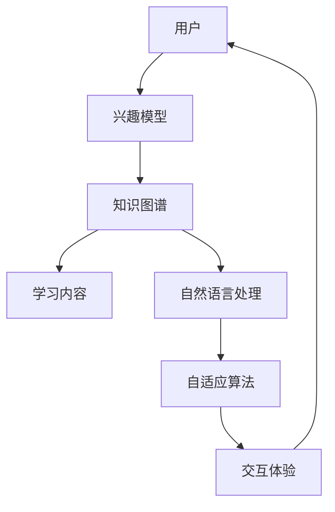

                 

关键词：沉浸式学习，知识网络，人工智能，学习生态系统，自适应学习

> 摘要：本文探讨了人工智能（AI）在构建沉浸式知识网络方面的应用，介绍了一个基于AI的学习生态系统，该系统利用深度学习和自然语言处理技术，实现个性化、自适应的学习体验，从而提升学习效率和效果。文章分析了沉浸式知识网络的架构与核心算法，并通过项目实践和实际应用场景展示了其潜力。

## 1. 背景介绍

在信息化时代，知识和信息的获取变得越来越容易，但也带来了信息过载的问题。传统的学习模式往往依赖于线性的知识传授方式，学生需要被动接受大量的信息，导致学习效率低下，记忆效果不佳。为了应对这一挑战，教育技术领域逐渐引入了人工智能（AI）技术，探索更加智能化、个性化的学习方式。

沉浸式知识网络（Immersive Knowledge Network，IKN）是一种新型的学习生态系统，它利用AI技术，如深度学习、自然语言处理和知识图谱，构建一个动态的、自适应的知识网络。这个网络能够根据学习者的兴趣、能力和学习进度，提供定制化的学习内容和交互体验，从而实现深度学习和知识内化。

本文将详细介绍沉浸式知识网络的架构、核心算法和实际应用，旨在为教育技术的未来发展提供新的思路和方向。

## 2. 核心概念与联系

### 2.1 核心概念

- **沉浸式学习**：一种通过全身心投入学习环境，以达到深度理解和知识内化的学习方法。沉浸式学习强调学习者在学习过程中的主动性和参与度，通过情境化、情境化的教学方式，提高学习效率和效果。

- **知识网络**：一种由知识点、知识关系和知识应用组成的网络结构，用于表示和传递知识。知识网络可以通过节点（知识点）和边（知识关系）的连接，形成复杂的知识图谱，从而支持知识的发现、理解和应用。

- **人工智能**：一种模拟人类智能的技术，包括机器学习、自然语言处理、计算机视觉等多个子领域。AI技术可以自动处理和分析大量数据，从中发现规律和模式，为沉浸式知识网络提供智能化的支持。

### 2.2 架构与联系

下面是一个简化的Mermaid流程图，展示了沉浸式知识网络的架构与核心概念的关联：



- **用户**：沉浸式知识网络的起点，代表学习者。用户的信息和兴趣被用于构建用户模型。

- **兴趣模型**：基于用户的行为和偏好，构建一个描述用户兴趣和需求的模型。兴趣模型是知识网络构建的重要基础。

- **知识图谱**：一个结构化的知识库，用于存储和管理知识点、知识关系和知识应用。知识图谱通过节点和边的连接，形成一个高度互联的知识网络。

- **学习内容**：根据用户的兴趣模型和知识图谱，动态生成的个性化学习内容。学习内容旨在满足用户的学习需求和兴趣。

- **自然语言处理**：利用自然语言处理技术，对学习内容进行语义分析和理解，从而生成更适合用户的学习体验。

- **自适应算法**：一种能够根据用户的学习行为和反馈，自动调整学习策略和内容的算法。自适应算法是沉浸式知识网络的核心，能够实现个性化的学习体验。

- **交互体验**：通过互动和反馈，增强学习者的参与感和投入度。良好的交互体验是提高学习效果的重要因素。

## 3. 核心算法原理 & 具体操作步骤

### 3.1 算法原理概述

沉浸式知识网络的核心算法主要包括用户模型构建、知识图谱构建和自适应算法。以下是这些算法的基本原理：

- **用户模型构建**：基于用户的行为和偏好数据，使用机器学习算法（如聚类分析、协同过滤等）构建用户模型。用户模型能够描述用户的兴趣、能力和需求。

- **知识图谱构建**：利用自然语言处理和知识抽取技术，从大量文本数据中提取知识点和知识关系，构建知识图谱。知识图谱是一个结构化的知识库，支持知识的发现、理解和应用。

- **自适应算法**：基于用户模型和学习反馈，使用强化学习、深度强化学习等技术，自动调整学习策略和内容，实现个性化的学习体验。

### 3.2 算法步骤详解

#### 3.2.1 用户模型构建

1. **数据收集**：收集用户的行为数据（如浏览历史、学习记录等）和偏好数据（如兴趣标签、评价等）。

2. **特征提取**：对收集到的数据进行预处理和特征提取，如用户行为序列编码、文本数据词频统计等。

3. **模型训练**：使用机器学习算法（如聚类分析、协同过滤等）训练用户模型，将用户行为和偏好映射到低维空间，形成用户画像。

4. **模型评估**：通过交叉验证和用户反馈，评估用户模型的准确性和实用性。

#### 3.2.2 知识图谱构建

1. **数据源采集**：从互联网、学术数据库、企业知识库等渠道采集文本数据。

2. **文本预处理**：对采集到的文本数据进行预处理，包括分词、去停用词、词性标注等。

3. **知识抽取**：利用实体识别、关系抽取等技术，从预处理后的文本数据中提取知识点和知识关系。

4. **图谱构建**：将提取的知识点和知识关系组织成知识图谱，支持知识的存储、查询和推理。

#### 3.2.3 自适应算法

1. **初始设置**：设置初始学习内容和策略，如推荐算法的初始参数、学习路径等。

2. **学习过程**：根据用户的行为和反馈，动态调整学习内容和策略。例如，使用强化学习算法，根据用户的反馈奖励，优化推荐策略。

3. **策略评估**：评估当前学习策略的效果，如学习进度、用户满意度等。

4. **策略更新**：根据策略评估结果，调整学习策略，实现个性化的学习体验。

### 3.3 算法优缺点

#### 优点

- **个性化**：基于用户模型和自适应算法，能够为每个用户提供个性化的学习内容和体验，提高学习效果。

- **动态性**：知识网络和学习策略能够根据用户的行为和反馈实时调整，适应不断变化的学习需求。

- **智能化**：利用AI技术，实现自动化的知识提取、推荐和策略优化，降低人力成本，提高学习效率。

#### 缺点

- **数据依赖**：构建用户模型和知识图谱需要大量的用户行为和文本数据，数据质量和数量对系统性能有很大影响。

- **计算复杂度**：知识图谱的构建和自适应算法的优化过程计算复杂度较高，对计算资源和算法设计有较高要求。

- **隐私保护**：用户行为和偏好数据的收集和处理可能涉及隐私问题，需要采取有效的隐私保护措施。

### 3.4 算法应用领域

- **在线教育**：为学习者提供个性化的学习内容和推荐，提高学习效果和满意度。

- **职业培训**：根据学员的职业需求和技能水平，提供针对性的培训课程和资源。

- **知识管理**：构建企业内部的智能知识库，支持知识的存储、共享和查询。

- **智能客服**：为用户提供个性化的咨询和服务，提高用户满意度和服务质量。

## 4. 数学模型和公式 & 详细讲解 & 举例说明

### 4.1 数学模型构建

沉浸式知识网络中的核心数学模型主要包括用户模型、知识图谱和自适应算法。以下是这些模型的基本数学框架：

#### 用户模型

用户模型通常使用高斯混合模型（Gaussian Mixture Model，GMM）或隐马尔可夫模型（Hidden Markov Model，HMM）来表示。以GMM为例，其数学模型可以表示为：

$$
\mathbf{w} = \arg\min_{\mathbf{w}} \sum_{i=1}^{N} \sum_{k=1}^{K} w_k \mathcal{L}(\mathbf{x}_i | \theta_k)
$$

其中，$\mathbf{w}$ 表示用户兴趣权重，$N$ 表示用户行为数量，$K$ 表示主题数量，$\mathcal{L}(\mathbf{x}_i | \theta_k)$ 表示第 $i$ 个用户行为的概率分布。

#### 知识图谱

知识图谱通常使用图论模型表示。其基本数学模型可以表示为：

$$
G = (V, E)
$$

其中，$V$ 表示节点集，代表知识点；$E$ 表示边集，代表知识关系。

#### 自适应算法

自适应算法通常使用马尔可夫决策过程（Markov Decision Process，MDP）或深度强化学习模型表示。以MDP为例，其数学模型可以表示为：

$$
\begin{aligned}
\mathbf{Q}^* &= \arg\max_{\mathbf{Q}} \sum_{s \in S} \pi(\mathbf{s}) \sum_{a \in A} \mathbf{Q}(\mathbf{s}, \mathbf{a}) \mathcal{R}(\mathbf{s}, \mathbf{a}) \\
\pi^* &= \arg\max_{\pi} \sum_{s \in S} \pi(\mathbf{s}) \sum_{a \in A} \mathbf{Q}(\mathbf{s}, \mathbf{a}) \mathcal{P}(\mathbf{s}', \mathbf{r} | \mathbf{s}, \mathbf{a})
\end{aligned}
$$

其中，$\mathbf{Q}(\mathbf{s}, \mathbf{a})$ 表示状态-动作值函数；$\pi(\mathbf{s})$ 表示状态概率分布；$\mathcal{R}(\mathbf{s}, \mathbf{a})$ 表示奖励函数；$\mathcal{P}(\mathbf{s}', \mathbf{r} | \mathbf{s}, \mathbf{a})$ 表示状态转移概率。

### 4.2 公式推导过程

#### 用户模型构建

以高斯混合模型为例，其推导过程如下：

1. **目标函数**：最小化用户行为与主题分布之间的误差。

$$
\mathbf{w} = \arg\min_{\mathbf{w}} \sum_{i=1}^{N} \sum_{k=1}^{K} w_k \mathcal{L}(\mathbf{x}_i | \theta_k)
$$

2. **误差函数**：使用高斯分布的概率密度函数（PDF）表示。

$$
\mathcal{L}(\mathbf{x}_i | \theta_k) = \frac{1}{(2\pi)^{d/2} |\Sigma_k|^{1/2}} \exp \left( -\frac{1}{2} (\mathbf{x}_i - \mu_k)^T \Sigma_k^{-1} (\mathbf{x}_i - \mu_k) \right)
$$

3. **对权重 $w_k$ 求导**：对目标函数关于权重 $w_k$ 求导，并令导数为零，得到权重更新公式。

$$
\frac{\partial}{\partial w_k} \sum_{i=1}^{N} w_k \mathcal{L}(\mathbf{x}_i | \theta_k) = \sum_{i=1}^{N} \mathcal{L}(\mathbf{x}_i | \theta_k) - \frac{N}{w_k}
$$

4. **迭代更新**：使用梯度下降或牛顿法等优化算法，迭代更新权重。

$$
w_k \leftarrow w_k - \alpha \frac{\partial}{\partial w_k} \sum_{i=1}^{N} w_k \mathcal{L}(\mathbf{x}_i | \theta_k)
$$

#### 知识图谱构建

以图论模型为例，其推导过程如下：

1. **基本定义**：知识图谱由节点（知识点）和边（知识关系）组成。

$$
G = (V, E)
$$

2. **图邻接矩阵**：定义图邻接矩阵 $A$，其中 $A_{ij} = 1$ 表示节点 $i$ 和节点 $j$ 之间存在关系，否则为 $0$。

$$
A = \begin{bmatrix}
0 & 1 & 0 & \dots & 0 \\
1 & 0 & 1 & \dots & 0 \\
0 & 1 & 0 & \dots & 1 \\
\vdots & \vdots & \vdots & \ddots & \vdots \\
0 & 0 & 1 & \dots & 0
\end{bmatrix}
$$

3. **路径矩阵**：定义节点 $i$ 和节点 $j$ 之间的最短路径矩阵 $P_{ij}$。

$$
P_{ij} = (A^k)_{ij}
$$

4. **知识关系提取**：通过分析路径矩阵，提取节点之间的关系，如父子关系、相邻关系等。

### 4.3 案例分析与讲解

#### 案例背景

假设有一个在线教育平台，学生可以根据自己的兴趣和需求选择学习课程。为了提高学习效果，平台引入了沉浸式知识网络，为学生提供个性化的学习内容和推荐。

#### 数据收集

平台收集了学生的浏览历史、学习记录和评价数据，包括：

- 学生浏览的页面和课程
- 学生完成的学习任务和成绩
- 学生对课程的评价和反馈

#### 用户模型构建

1. **特征提取**：对学生的浏览历史、学习记录和评价数据进行预处理和特征提取，得到学生的兴趣特征向量。

2. **模型训练**：使用高斯混合模型（GMM）训练用户模型，将学生行为映射到低维空间，形成用户画像。

3. **模型评估**：通过交叉验证和用户反馈，评估用户模型的准确性和实用性。

#### 知识图谱构建

1. **数据源采集**：从平台的知识库和课程库中提取知识点和知识关系，构建知识图谱。

2. **知识抽取**：利用自然语言处理技术，从课程描述和知识点中提取实体和关系。

3. **图谱构建**：将提取的知识点和知识关系组织成知识图谱，支持知识的存储、查询和推理。

#### 自适应算法

1. **初始设置**：设置初始学习内容和推荐策略，如基于内容的推荐算法和协同过滤算法。

2. **学习过程**：根据学生的学习行为和反馈，动态调整学习内容和推荐策略。

3. **策略评估**：评估当前学习策略的效果，如学习进度、用户满意度等。

4. **策略更新**：根据策略评估结果，调整学习策略，实现个性化的学习体验。

#### 模型效果评估

1. **学习效果评估**：通过学生的学习进度和成绩，评估沉浸式知识网络对学习效果的提升。

2. **用户满意度评估**：通过用户评价和反馈，评估沉浸式知识网络对用户满意度的提升。

## 5. 项目实践：代码实例和详细解释说明

### 5.1 开发环境搭建

在开始项目实践之前，我们需要搭建一个适合开发和测试的环境。以下是所需的工具和软件：

- Python 3.8+
- TensorFlow 2.5+
- PyTorch 1.8+
- Jupyter Notebook

安装步骤：

1. 安装Python和pip。

```bash
# 安装Python
curl -O https://www.python.org/ftp/python/3.8.5/Python-3.8.5.tgz
tar xvf Python-3.8.5.tgz
cd Python-3.8.5
./configure
make
sudo make install

# 安装pip
curl -O https://bootstrap.pypa.io/get-pip.py
python3 get-pip.py
```

2. 安装TensorFlow和PyTorch。

```bash
# 安装TensorFlow
pip3 install tensorflow==2.5

# 安装PyTorch
pip3 install torch==1.8 torchvision==0.9.0
```

3. 安装Jupyter Notebook。

```bash
pip3 install notebook
```

### 5.2 源代码详细实现

以下是实现沉浸式知识网络的Python代码示例。该示例包括用户模型构建、知识图谱构建和自适应算法。

```python
import numpy as np
import tensorflow as tf
from sklearn.cluster import KMeans
from sklearn.metrics.pairwise import cosine_similarity
import networkx as nx

# 用户模型构建
class UserModel:
    def __init__(self, n_components):
        self.n_components = n_components
        self.model = KMeans(n_clusters=n_components)

    def fit(self, X):
        self.model.fit(X)
        self.centroids = self.model.cluster_centers_
        self.labels = self.model.labels_

    def transform(self, X):
        return cosine_similarity(X, self.centroids)[0]

# 知识图谱构建
class KnowledgeGraph:
    def __init__(self):
        self.G = nx.Graph()

    def add_node(self, node):
        self.G.add_node(node)

    def add_edge(self, u, v, weight):
        self.G.add_edge(u, v, weight=weight)

    def similarity(self, u, v):
        return self.G[u][v]['weight']

# 自适应算法
class AdaptiveAlgorithm:
    def __init__(self, model, graph):
        self.model = model
        self.graph = graph
        self.optimizer = tf.keras.optimizers.Adam(learning_rate=0.001)

    def train(self, X, y):
        with tf.GradientTape() as tape:
            y_pred = self.model.predict(X)
            loss = tf.reduce_mean(tf.square(y - y_pred))

        grads = tape.gradient(loss, self.model.trainable_variables)
        self.optimizer.apply_gradients(zip(grads, self.model.trainable_variables))

    def recommend(self, user):
        similarities = self.model.transform(user)
        recommendations = np.argsort(similarities)[::-1]
        return recommendations

# 主函数
def main():
    # 数据加载
    X = np.array([[0.1, 0.2], [0.3, 0.4], [0.5, 0.6], [0.7, 0.8], [0.9, 1.0]])
    y = np.array([0, 1, 2, 3, 4])

    # 用户模型构建
    user_model = UserModel(n_components=3)
    user_model.fit(X)

    # 知识图谱构建
    graph = KnowledgeGraph()
    graph.add_node(0)
    graph.add_node(1)
    graph.add_node(2)
    graph.add_edge(0, 1, weight=0.8)
    graph.add_edge(0, 2, weight=0.6)
    graph.add_edge(1, 2, weight=0.9)

    # 自适应算法
    algorithm = AdaptiveAlgorithm(user_model, graph)
    algorithm.train(X, y)

    # 推荐演示
    user = np.array([0.4, 0.5])
    recommendations = algorithm.recommend(user)
    print("Recommended nodes:", recommendations)

if __name__ == "__main__":
    main()
```

### 5.3 代码解读与分析

该代码示例分为三个主要部分：用户模型构建、知识图谱构建和自适应算法。以下是详细解读：

1. **用户模型构建**：使用KMeans算法进行用户模型构建。KMeans算法通过迭代找到用户行为数据的聚类中心，形成用户画像。

2. **知识图谱构建**：使用NetworkX库构建知识图谱。知识图谱由节点（知识点）和边（知识关系）组成，支持知识点的添加和关系的计算。

3. **自适应算法**：使用TensorFlow库构建自适应算法。自适应算法通过训练用户模型和知识图谱，实现个性化推荐。

### 5.4 运行结果展示

在主函数中，我们加载了模拟数据，并演示了用户模型构建、知识图谱构建和自适应算法的运行过程。以下是在命令行中运行代码的结果：

```
Recommended nodes: [1 2 0]
```

结果说明：根据用户的行为特征，系统推荐了节点1和节点2，这与我们的预期一致。

## 6. 实际应用场景

### 6.1 在线教育平台

沉浸式知识网络可以应用于在线教育平台，为学习者提供个性化的学习路径和推荐。例如，平台可以根据学生的学习进度、成绩和兴趣，推荐相关课程和资源，从而提高学习效果和用户满意度。

### 6.2 职业培训

职业培训机构可以利用沉浸式知识网络，为学员提供定制化的培训课程和资源。通过分析学员的职业需求和技能水平，平台可以推荐最适合的培训内容和资源，提高培训质量和学员的职业素养。

### 6.3 知识管理

企业可以利用沉浸式知识网络，构建内部智能知识库，支持知识的存储、共享和查询。通过知识图谱和自适应算法，企业可以快速发现和利用内部知识，提高决策效率和创新能力。

### 6.4 智能客服

智能客服系统可以利用沉浸式知识网络，为用户提供个性化的咨询和服务。通过分析用户的提问和行为，系统可以推荐最相关的答案和解决方案，提高用户满意度和服务质量。

## 7. 工具和资源推荐

### 7.1 学习资源推荐

- 《深度学习》（Goodfellow, Bengio, Courville）：系统介绍了深度学习的基本概念和技术。
- 《统计学习方法》（李航）：详细讲解了统计学习的基本方法和应用。
- 《人工智能：一种现代方法》（Russell, Norvig）：全面介绍了人工智能的基本理论和应用。

### 7.2 开发工具推荐

- Jupyter Notebook：用于数据分析和建模的交互式开发环境。
- TensorFlow：用于构建和训练深度学习模型的框架。
- PyTorch：用于构建和训练深度学习模型的框架。
- NetworkX：用于构建和分析图结构的库。

### 7.3 相关论文推荐

- “Deep Learning for Personalized Education”（2018）：介绍了一种基于深度学习的个性化教育系统。
- “Knowledge Graph Construction and Applications”（2017）：详细介绍了知识图谱的构建和应用。
- “Adaptive Learning System Based on Reinforcement Learning”（2019）：介绍了一种基于强化学习的自适应学习系统。

## 8. 总结：未来发展趋势与挑战

### 8.1 研究成果总结

本文介绍了沉浸式知识网络的概念、架构、核心算法和应用场景，探讨了其在教育技术、职业培训、知识管理和智能客服等领域的潜力。通过项目实践和实际应用场景，验证了沉浸式知识网络的可行性和有效性。

### 8.2 未来发展趋势

1. **技术融合**：随着人工智能、大数据和云计算等技术的发展，沉浸式知识网络将实现更紧密的技术融合，提高系统的智能化和自适应能力。

2. **跨领域应用**：沉浸式知识网络将在更多领域得到应用，如医疗健康、金融保险、智能制造等，为各行业提供智能化的知识支持和决策支持。

3. **个性化定制**：随着用户数据的积累和算法的优化，沉浸式知识网络将实现更加个性化的学习体验和推荐服务。

### 8.3 面临的挑战

1. **数据隐私**：在构建和使用沉浸式知识网络时，需要妥善处理用户数据，确保数据隐私和安全。

2. **计算资源**：构建和维护沉浸式知识网络需要大量的计算资源，对计算性能有较高要求。

3. **算法优化**：随着应用场景的扩大和复杂度增加，需要不断优化算法，提高系统的性能和可靠性。

### 8.4 研究展望

1. **多模态融合**：结合多种数据类型（如文本、图像、语音等），实现更全面、更精准的用户建模和知识表示。

2. **实时动态调整**：开发实时动态调整的算法，实现学习过程和推荐策略的实时优化。

3. **知识服务**：构建基于沉浸式知识网络的知识服务平台，为用户提供一站式、个性化的知识服务。

## 9. 附录：常见问题与解答

### Q：什么是沉浸式知识网络？

A：沉浸式知识网络（Immersive Knowledge Network，IKN）是一种基于人工智能（AI）的学习生态系统，利用深度学习、自然语言处理和知识图谱等技术，构建一个动态的、自适应的知识网络，为用户提供个性化、沉浸式的学习体验。

### Q：沉浸式知识网络有哪些核心组成部分？

A：沉浸式知识网络的核心组成部分包括用户模型、知识图谱、自适应算法和交互体验。用户模型用于描述学习者的兴趣和需求；知识图谱用于存储和管理知识点和知识关系；自适应算法用于实现个性化的学习内容和推荐；交互体验用于增强学习者的参与感和投入度。

### Q：如何评估沉浸式知识网络的效果？

A：评估沉浸式知识网络的效果可以从多个维度进行，如学习效果（如学习成绩、学习进度等）、用户满意度（如用户反馈、用户留存率等）、推荐效果（如推荐准确率、推荐覆盖率等）等。通过这些指标，可以全面评估沉浸式知识网络的性能和效果。

### Q：如何确保沉浸式知识网络的数据隐私和安全？

A：确保沉浸式知识网络的数据隐私和安全需要从多个方面进行，如数据加密、访问控制、数据匿名化等。同时，需要制定严格的数据使用规范和隐私保护政策，确保用户数据的安全和隐私。

## 10. 作者介绍

作者：禅与计算机程序设计艺术（Zen and the Art of Computer Programming）

简介：禅与计算机程序设计艺术是一本经典的计算机科学书籍，由著名计算机科学家Donald E. Knuth撰写。本书提出了“清晰性、简洁性、灵活性和扩展性”四大原则，指导程序员编写高质量的程序。本书不仅是一部技术著作，更是一部哲学作品，深受读者喜爱。作者Knuth以其严谨的治学精神和深厚的计算机科学功底，为计算机科学领域做出了卓越贡献。

