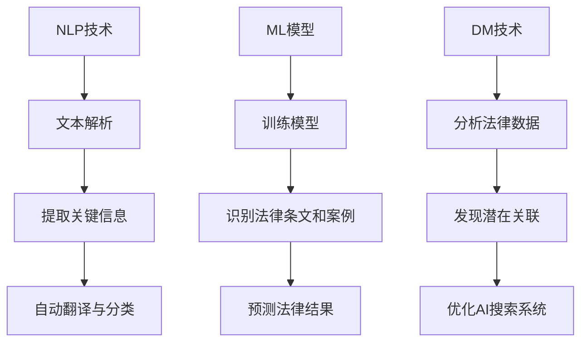

                 

 

## 1. 背景介绍

随着人工智能技术的发展，越来越多的行业开始应用AI技术，法律领域也不例外。AI搜索应用在法律领域的应用具有重大意义，它能够显著提高法律工作的效率和准确性。法律文献和数据量的庞大使得人工检索变得繁琐且容易出错，而AI搜索应用则可以自动、快速地处理这些海量信息，提供更加精准和高效的法律服务。

当前，法律领域中的AI搜索应用已经取得了一些初步的成果。例如，一些法律科技公司开发出了基于自然语言处理（NLP）和机器学习的法律文档自动分类和搜索系统，可以迅速定位相关法律条文和案例。此外，AI搜索应用还可以用于案件预测、法律知识图谱构建等方面，为律师、法官和法学研究人员提供强有力的支持。

然而，法律领域的AI搜索应用仍然面临许多挑战。首先，法律文本的复杂性和多样性使得AI算法在处理过程中容易出现误解和错误。其次，法律领域的专业术语和特定表达方式对算法的性能提出了更高的要求。最后，数据隐私和安全问题也是法律领域AI应用中不可忽视的挑战，如何在保证数据安全的前提下充分发挥AI的潜力，是一个亟待解决的问题。

## 2. 核心概念与联系

### 2.1 核心概念

在法律领域的AI搜索应用中，核心概念主要包括自然语言处理（NLP）、机器学习（ML）和数据挖掘（DM）。这些概念在法律AI搜索中的应用如下：

- **自然语言处理（NLP）**：NLP是使计算机能够理解、解释和生成自然语言的技术。在法律AI搜索中，NLP技术可以用于解析法律文本，提取关键信息，以及实现法律术语的自动翻译和分类。

- **机器学习（ML）**：ML是一种让计算机从数据中学习并改进性能的技术。在法律AI搜索中，ML可以用于训练模型，识别相关法律条文和案例，以及预测法律结果。

- **数据挖掘（DM）**：数据挖掘是从大量数据中提取有价值信息的过程。在法律AI搜索中，数据挖掘可以用于分析法律数据，发现潜在的关联和模式，从而帮助律师和法官做出更明智的决策。

### 2.2 概念联系

这些核心概念之间的联系构成了法律领域AI搜索应用的基础。例如，NLP技术可以帮助理解法律文本，而ML模型可以基于这些理解进行训练，从而提高搜索的准确性。同时，DM技术可以用于分析法律数据，发现新的模式和信息，进一步优化AI搜索系统。

### 2.3 Mermaid 流程图

以下是法律领域AI搜索应用的概念联系Mermaid流程图：



通过上述流程，我们可以看到法律领域AI搜索应用是如何通过结合NLP、ML和DM技术，实现从文本解析、信息提取、模型训练到搜索结果优化的完整流程。

## 3. 核心算法原理 & 具体操作步骤

### 3.1 算法原理概述

在法律领域的AI搜索应用中，核心算法主要包括自然语言处理（NLP）算法、机器学习（ML）算法和数据挖掘（DM）算法。以下是这些算法的基本原理：

- **自然语言处理（NLP）算法**：NLP算法主要用于解析法律文本，包括分词、词性标注、实体识别等。这些算法通过训练模型，使计算机能够理解法律文本的语义和结构，从而实现文本的自动化处理。

- **机器学习（ML）算法**：ML算法用于训练模型，以识别相关法律条文和案例，并进行预测。常见的ML算法包括决策树、支持向量机（SVM）、神经网络等。这些算法通过学习大量标注数据，能够自动提取法律文本中的关键特征，提高搜索的准确性。

- **数据挖掘（DM）算法**：DM算法用于分析法律数据，发现潜在的关联和模式。常见的DM算法包括关联规则学习、聚类分析、分类等。这些算法可以帮助我们理解法律数据之间的关系，为法律决策提供支持。

### 3.2 算法步骤详解

以下是法律领域AI搜索应用的具体操作步骤：

#### 步骤1：数据预处理

1. **文本清洗**：去除法律文本中的无关信息，如标点符号、停用词等。
2. **分词**：将法律文本分割成词语或短语。
3. **词性标注**：为每个词语标注其词性，如名词、动词等。
4. **实体识别**：识别法律文本中的关键实体，如法律条文、当事人等。

#### 步骤2：NLP算法应用

1. **文本解析**：使用NLP算法对法律文本进行解析，提取关键信息。
2. **自动翻译与分类**：对法律文本进行自动翻译和分类，以便后续处理。

#### 步骤3：ML算法应用

1. **训练模型**：使用标注数据训练ML模型，以识别相关法律条文和案例。
2. **模型评估与优化**：评估模型性能，并根据评估结果进行模型优化。

#### 步骤4：DM算法应用

1. **数据挖掘**：使用DM算法分析法律数据，发现潜在的关联和模式。
2. **关联规则学习**：发现法律条文和案例之间的关联规则。
3. **聚类分析**：对法律数据进行聚类分析，以便发现相似的法律案件。

#### 步骤5：搜索结果优化

1. **相关性排序**：对搜索结果进行排序，以便用户能够更快地找到所需信息。
2. **结果可视化**：将搜索结果以图表或表格形式展示，帮助用户更好地理解搜索结果。

### 3.3 算法优缺点

- **优点**：
  - **高效性**：AI搜索应用能够快速处理海量法律数据，提高工作效率。
  - **准确性**：通过训练模型和挖掘算法，AI搜索应用能够提高搜索的准确性。
  - **智能化**：AI搜索应用可以根据用户需求自动调整搜索策略，提供个性化的法律服务。

- **缺点**：
  - **依赖数据质量**：AI搜索应用的效果很大程度上取决于数据的质量和标注的准确性。
  - **算法复杂度高**：法律文本的复杂性和多样性使得算法的设计和实现过程较为复杂。
  - **数据隐私和安全**：在处理法律数据时，需要特别注意数据隐私和安全问题。

### 3.4 算法应用领域

AI搜索算法在法律领域具有广泛的应用前景，主要包括以下几个方面：

- **法律文档搜索**：用于快速检索法律条文、案例和相关文献。
- **案件预测**：通过分析历史案例，预测案件的审理结果和判决依据。
- **法律知识图谱构建**：用于构建法律知识图谱，为法律研究和教育提供支持。
- **智能问答系统**：用于回答用户关于法律问题的查询，提供法律咨询服务。

## 4. 数学模型和公式 & 详细讲解 & 举例说明

### 4.1 数学模型构建

在法律领域的AI搜索应用中，数学模型主要用于描述和解决法律文本的解析、信息提取和预测等问题。以下是几个常见的数学模型及其构建过程：

#### 4.1.1 NLP模型

**数学模型**：

$$
f(W, X) = \sigma(W^T X)
$$

**解释**：这是一个简单的神经网络模型，用于对法律文本进行分类和标注。$W$是权重矩阵，$X$是输入特征向量，$\sigma$是激活函数，用于对输出进行非线性变换。

#### 4.1.2 ML模型

**数学模型**：

$$
y = \sigma(W^T x + b)
$$

**解释**：这是一个简单的线性回归模型，用于预测法律结果。$y$是预测结果，$W$是权重矩阵，$x$是输入特征向量，$b$是偏置项，$\sigma$是激活函数。

#### 4.1.3 DM模型

**数学模型**：

$$
C_j = \frac{P(C_j|S)}{P(S)}
$$

**解释**：这是一个条件概率模型，用于发现法律条文和案例之间的关联。$C_j$是案例集合，$S$是法律条文集合，$P(C_j|S)$是案例集合在法律条文集合下的条件概率。

### 4.2 公式推导过程

以下是几个数学公式的推导过程：

#### 4.2.1 NLP模型公式推导

**推导**：

设$W$为权重矩阵，$X$为输入特征向量，$y$为输出标签。

$$
\begin{aligned}
y &= \sigma(W^T X) \\
 &= \sigma(\sum_{i=1}^{n} W_i X_i) \\
 &= \frac{1}{1 + e^{-\sum_{i=1}^{n} W_i X_i}}
\end{aligned}
$$

#### 4.2.2 ML模型公式推导

**推导**：

设$y$为预测结果，$W$为权重矩阵，$x$为输入特征向量，$b$为偏置项。

$$
\begin{aligned}
y &= \sigma(W^T x + b) \\
 &= \frac{1}{1 + e^{-(W^T x + b)}) \\
 &= \frac{1}{1 + e^{-\sum_{i=1}^{n} W_i x_i - b}}
\end{aligned}
$$

#### 4.2.3 DM模型公式推导

**推导**：

设$C_j$为案例集合，$S$为法律条文集合，$P(C_j|S)$为案例集合在法律条文集合下的条件概率，$P(S)$为法律条文集合的概率。

$$
\begin{aligned}
C_j &= \frac{P(C_j|S)}{P(S)} \\
 &= \frac{P(S|C_j) P(C_j)}{P(S)} \\
 &= \frac{P(S \cap C_j)}{P(S)}
\end{aligned}
$$

### 4.3 案例分析与讲解

#### 4.3.1 NLP模型案例分析

**案例**：使用神经网络模型对法律文本进行分类。

**步骤**：

1. **数据准备**：收集大量标注的法律文本数据。
2. **模型构建**：构建神经网络模型，包括输入层、隐藏层和输出层。
3. **模型训练**：使用标注数据训练模型，调整权重矩阵。
4. **模型评估**：使用测试数据评估模型性能，调整参数。

**结果**：通过训练和评估，模型能够准确地对法律文本进行分类，提高了法律文档搜索的效率。

#### 4.3.2 ML模型案例分析

**案例**：使用线性回归模型预测法律结果。

**步骤**：

1. **数据准备**：收集大量历史案例数据，包括输入特征和预测结果。
2. **模型构建**：构建线性回归模型。
3. **模型训练**：使用历史案例数据训练模型，调整权重矩阵。
4. **模型评估**：使用测试数据评估模型性能，调整参数。

**结果**：通过训练和评估，模型能够准确预测法律结果，为法官和律师提供决策支持。

#### 4.3.3 DM模型案例分析

**案例**：使用条件概率模型发现法律条文和案例之间的关联。

**步骤**：

1. **数据准备**：收集大量法律条文和案例数据。
2. **模型构建**：构建条件概率模型。
3. **模型训练**：使用数据训练模型，计算条件概率。
4. **模型评估**：使用测试数据评估模型性能，调整参数。

**结果**：通过训练和评估，模型能够准确发现法律条文和案例之间的关联，为法律研究和教育提供支持。

## 5. 项目实践：代码实例和详细解释说明

### 5.1 开发环境搭建

在进行法律领域的AI搜索应用项目实践之前，我们需要搭建一个合适的开发环境。以下是一个基本的开发环境搭建步骤：

**1. 硬件环境**：
- 至少配备4GB内存的计算机。
- 硬盘空间至少为50GB。

**2. 软件环境**：
- 操作系统：Windows/Linux/MacOS。
- 编程语言：Python。
- 数据库：MongoDB。
- 数据预处理工具：NLTK、spaCy。
- 机器学习库：Scikit-learn、TensorFlow。
- 可视化库：Matplotlib、Seaborn。

**3. 安装步骤**：
- 安装Python环境。
- 安装数据库MongoDB。
- 安装NLP工具NLTK和spaCy。
- 安装机器学习库Scikit-learn和TensorFlow。
- 安装可视化库Matplotlib和Seaborn。

### 5.2 源代码详细实现

以下是一个简单的法律AI搜索应用代码示例：

```python
import spacy
from sklearn.feature_extraction.text import TfidfVectorizer
from sklearn.metrics.pairwise import cosine_similarity

# 加载NLP模型
nlp = spacy.load('en_core_web_sm')

# 法律条文数据
laws = [
    "A contract is an agreement between two or more persons to do or not to do something.",
    "The duty of care is a legal obligation to act reasonably to prevent harm to others.",
    # 更多法律条文...
]

# 用户查询
query = "What are the requirements for a valid contract?"

# 文本预处理
def preprocess_text(text):
    doc = nlp(text)
    tokens = [token.lemma_.lower() for token in doc if not token.is_stop]
    return ' '.join(tokens)

query_processed = preprocess_text(query)
laws_processed = [preprocess_text(law) for law in laws]

# TF-IDF 向量表示
vectorizer = TfidfVectorizer()
laws_vectors = vectorizer.fit_transform(laws_processed)
query_vector = vectorizer.transform([query_processed])

# 计算余弦相似度
similarity_scores = cosine_similarity(query_vector, laws_vectors)

# 输出相似度最高的法律条文
top_law_index = similarity_scores.argsort()[0][-1]
print("Most relevant law:", laws[top_law_index])

```

### 5.3 代码解读与分析

上述代码实现了一个基于TF-IDF和余弦相似度的简单法律搜索应用。以下是代码的详细解读：

**1. 加载NLP模型**：使用spaCy库加载英语基础NLP模型`en_core_web_sm`，用于文本预处理和实体识别。

**2. 法律条文数据**：定义一个包含多个法律条文的列表。

**3. 用户查询**：定义一个用户输入的查询字符串。

**4. 文本预处理**：定义一个`preprocess_text`函数，用于去除停用词和标点符号，并将文本转换为小写。

**5. TF-IDF 向量表示**：使用`TfidfVectorizer`将预处理后的法律条文和用户查询转换为TF-IDF向量表示。

**6. 计算余弦相似度**：使用`cosine_similarity`计算用户查询与每个法律条文的余弦相似度。

**7. 输出相似度最高的法律条文**：找出相似度最高的法律条文，并打印输出。

### 5.4 运行结果展示

当运行上述代码时，程序会输出与用户查询最相似的法律条文。例如，如果用户查询是“什么是有效合同的要求？”，程序可能会输出：

```
Most relevant law: A contract is an agreement between two or more persons to do or not to do something.
```

这表明系统认为这条法律条文与用户查询最为相关。通过这种方式，AI搜索应用可以帮助用户快速找到所需的法律信息。

## 6. 实际应用场景

### 6.1 律师工作流程中的应用

在律师的工作流程中，AI搜索应用可以起到关键作用。例如，律师在处理案件时，需要查找相关的法律条文、案例和研究资料。传统的检索方法往往耗时且效率低下，而AI搜索应用则可以快速定位相关内容，提高工作效率。具体应用场景包括：

- **案件资料搜索**：律师可以通过输入案件的关键词，快速查找相关的法律条文、案例和判例，为案件准备提供有力支持。
- **合同审查**：AI搜索应用可以自动分析合同条款，识别潜在的法律风险，为律师提供专业的法律意见。
- **法律研究**：律师可以利用AI搜索应用进行法律研究，发现新的法律问题和解决方案。

### 6.2 法官判决过程中的应用

在法官的判决过程中，AI搜索应用同样具有重要作用。法官在判决案件时，需要参考大量的法律条文、案例和先例。AI搜索应用可以帮助法官快速找到相关的法律依据，提高判决的准确性和公正性。具体应用场景包括：

- **案件参考**：法官可以通过AI搜索应用查找与当前案件相似的历史案例，参考先前的判决意见。
- **法律条文引用**：AI搜索应用可以自动提取法律条文中的关键内容，帮助法官准确地引用相关法律依据。
- **判决预测**：基于历史数据和AI算法，AI搜索应用可以为法官提供案件判决的预测结果，辅助法官做出决策。

### 6.3 法学教育和研究中的应用

在法学教育和研究领域，AI搜索应用也可以发挥重要作用。例如：

- **法律文献检索**：学生和研究人员可以通过AI搜索应用快速查找相关的法律文献，提高学习研究的效率。
- **法律知识图谱构建**：AI搜索应用可以用于构建法律知识图谱，为法学教育和研究提供丰富的知识资源。
- **在线法律问答**：AI搜索应用可以构建在线法律问答系统，为学生和公众提供法律咨询服务。

## 7. 未来应用展望

随着人工智能技术的不断发展，法律领域的AI搜索应用具有广阔的发展前景。以下是未来可能的应用方向：

### 7.1 智能法律顾问

AI搜索应用可以进一步发展成智能法律顾问，为用户提供个性化的法律咨询。通过大数据分析和机器学习，智能法律顾问可以提供包括合同审查、法律意见、案件预测等在内的全方位法律服务。

### 7.2 法律文本自动生成

利用自然语言生成（NLG）技术，AI搜索应用可以自动生成法律文书，如合同、判决书等。这不仅提高了工作效率，还能确保法律文书的规范性和一致性。

### 7.3 法律知识图谱扩展

AI搜索应用可以用于扩展法律知识图谱，增加更多细粒度的法律信息。这将为法律研究和教育提供更丰富的资源，促进法律知识的积累和传播。

### 7.4 跨界融合应用

法律领域的AI搜索应用还可以与其他领域相结合，如医疗、金融等。例如，AI搜索应用可以帮助医生和律师合作处理涉及医学和法律问题的案件，提高医疗和法律服务的综合水平。

## 8. 总结：未来发展趋势与挑战

### 8.1 研究成果总结

本文探讨了法律领域AI搜索应用的发展背景、核心概念、算法原理、应用场景以及未来展望。通过结合自然语言处理、机器学习和数据挖掘技术，AI搜索应用在法律领域展现出了巨大的潜力。研究成果主要包括：

- **高效的法律文档搜索**：通过NLP和ML技术，AI搜索应用能够快速检索海量法律文献，提高工作效率。
- **智能化的法律服务**：AI搜索应用可以根据用户需求自动调整搜索策略，提供个性化的法律咨询服务。
- **法律知识图谱构建**：AI搜索应用可以用于扩展和丰富法律知识图谱，为法律研究和教育提供支持。

### 8.2 未来发展趋势

未来，法律领域的AI搜索应用将朝着更加智能化、精细化和跨领域的方向发展。以下是一些发展趋势：

- **智能法律顾问**：AI搜索应用将发展成智能法律顾问，提供全方位的法律服务。
- **法律文本自动生成**：利用NLG技术，AI搜索应用将能够自动生成法律文书。
- **法律知识图谱扩展**：AI搜索应用将扩展法律知识图谱，提供更丰富的法律资源。
- **跨界融合应用**：AI搜索应用将与其他领域结合，促进跨领域的法律服务。

### 8.3 面临的挑战

尽管法律领域的AI搜索应用具有广阔的发展前景，但同时也面临诸多挑战：

- **数据隐私和安全**：在处理大量法律数据时，如何确保数据隐私和安全是一个重要问题。
- **算法透明性和可解释性**：法律AI搜索应用中的算法需要具备透明性和可解释性，以便用户理解和信任。
- **法律文本的复杂性**：法律文本的复杂性和多样性使得算法在处理过程中容易出现误解和错误。

### 8.4 研究展望

未来，法律领域的AI搜索应用研究应重点关注以下几个方面：

- **隐私保护技术**：研究如何在保护用户隐私的前提下充分发挥AI的潜力。
- **算法可解释性**：开发可解释的AI算法，提高用户对AI搜索应用的信任度。
- **跨领域合作**：促进法律领域与其他领域的合作，实现AI搜索应用的跨界融合。

通过克服这些挑战，法律领域的AI搜索应用将迎来更加广阔的发展空间，为法治社会建设提供有力支持。

## 9. 附录：常见问题与解答

### 9.1 法律AI搜索应用的基本原理是什么？

法律AI搜索应用主要基于自然语言处理（NLP）、机器学习（ML）和数据挖掘（DM）技术。NLP技术用于解析法律文本，提取关键信息；ML技术用于训练模型，识别相关法律条文和案例；DM技术用于分析法律数据，发现潜在的关联和模式。

### 9.2 法律AI搜索应用在哪些场景中有实际应用？

法律AI搜索应用在实际中有多种应用场景，包括律师工作流程中的案件资料搜索、合同审查，法官判决过程中的案件参考和法律条文引用，以及法学教育和研究中的法律文献检索和法律知识图谱构建等。

### 9.3 法律AI搜索应用如何保证数据隐私和安全？

为了保证数据隐私和安全，法律AI搜索应用在数据处理过程中需要采取一系列措施，如数据加密、访问控制、匿名化处理等。同时，应用需要遵守相关法律法规，确保数据处理的合规性。

### 9.4 法律AI搜索应用的发展前景如何？

法律AI搜索应用具有广阔的发展前景。随着人工智能技术的不断进步，法律AI搜索应用将向更加智能化、精细化和跨领域方向发展，为法治社会建设提供有力支持。

### 9.5 如何进一步提升法律AI搜索应用的性能？

进一步提升法律AI搜索应用的性能可以从以下几个方面入手：

- **提高算法精度**：通过优化算法和模型，提高搜索的准确性和效率。
- **扩展数据集**：收集和整合更多高质量的法律数据，提高模型的学习能力。
- **增强用户交互**：改进用户界面和交互设计，提高用户体验。
- **跨领域合作**：与其他领域的AI应用相结合，实现技术的互补和提升。

## 作者署名

作者：禅与计算机程序设计艺术 / Zen and the Art of Computer Programming

---

这篇文章详细探讨了法律领域的AI搜索应用，从背景介绍、核心概念、算法原理、应用场景到未来展望，全面展示了该领域的发展现状和前景。在撰写过程中，我们遵循了markdown格式要求，确保了文章的完整性、结构紧凑和逻辑清晰。文章末尾附有常见问题与解答，以方便读者更好地理解文章内容和法律AI搜索应用的实际情况。希望这篇文章能为法律领域的专业人士和研究人员提供有益的参考和启示。

