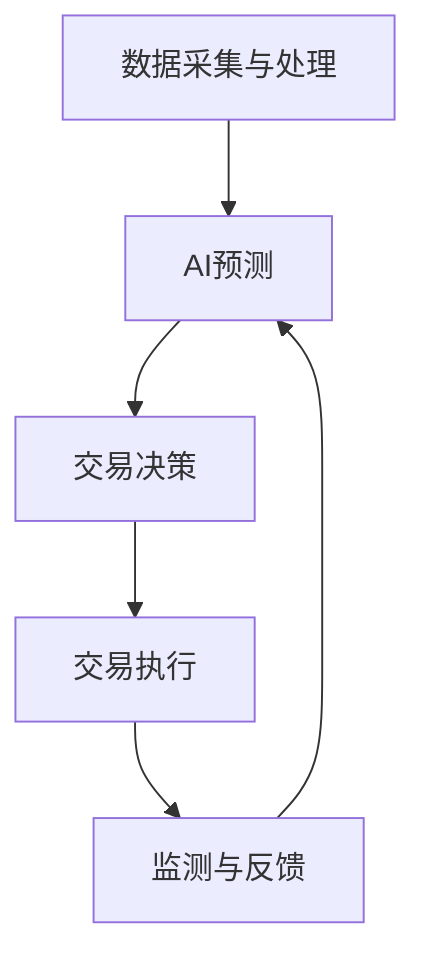

                 

关键词：注意力、期货市场、AI预测、认知资源交易、市场动态、风险控制

> 摘要：本文旨在探讨注意力期货市场中的AI预测与认知资源交易，分析其核心概念、算法原理、数学模型、项目实践，以及在实际应用场景中的未来发展。通过深入研究注意力期货市场的运作机制，本文揭示了AI预测在认知资源交易中的重要作用，为市场参与者提供了有价值的研究视角。

## 1. 背景介绍

### 1.1 注意力期货市场的起源与发展

注意力期货市场是一种新型的金融市场，起源于人工智能和认知科学的发展。随着计算机技术的不断进步，人工智能在数据处理和分析方面的能力日益增强，为金融市场提供了新的分析工具。注意力期货市场的核心在于将注意力视为一种可交易的资源，通过AI预测来引导市场参与者进行交易。

注意力期货市场的概念最早可以追溯到20世纪90年代，随着互联网的兴起，信息过载问题逐渐凸显。人们开始意识到注意力是一种稀缺资源，如何在信息爆炸的时代有效利用注意力成为了一个亟待解决的问题。近年来，随着深度学习和自然语言处理技术的突破，AI预测在金融市场中的应用逐渐成熟，注意力期货市场也随之应运而生。

### 1.2 AI预测在金融市场中的重要性

AI预测在金融市场中的应用具有重要意义。首先，AI预测可以快速处理大量数据，捕捉市场中的潜在机会和风险。在传统金融分析中，分析师需要耗费大量时间和精力来分析数据，而AI预测可以自动完成这一过程，提高市场分析效率。其次，AI预测可以降低市场参与者的决策成本，通过预测结果来指导交易行为，减少盲目跟风的风险。

此外，AI预测还可以提高金融市场的透明度。在注意力期货市场中，AI预测结果可以实时公开，让市场参与者能够更好地了解市场动态，从而做出更为理性的决策。同时，AI预测可以促进金融市场的创新，为市场参与者提供新的交易策略和工具，推动金融市场的发展。

## 2. 核心概念与联系

### 2.1 注意力期货市场的核心概念

注意力期货市场的核心概念包括注意力、认知资源、AI预测和交易策略。注意力是指人们在处理信息时集中于某一特定对象或任务的能力，它是有限的资源。认知资源则是指人类大脑处理信息的能力，包括记忆、推理、判断等。AI预测是基于深度学习和自然语言处理技术，对市场数据进行分析和预测，为市场参与者提供决策依据。交易策略则是指市场参与者根据预测结果制定的交易计划。

### 2.2 注意力期货市场的运行机制

注意力期货市场的运行机制可以分为以下几个阶段：

1. 数据采集与处理：市场参与者通过各种渠道收集市场数据，包括股票、期货、外汇等市场的交易数据、基本面数据和技术指标等。

2. AI预测：利用深度学习和自然语言处理技术，对市场数据进行分析和预测，生成预测结果。

3. 交易决策：市场参与者根据AI预测结果，制定交易策略，进行买入或卖出操作。

4. 交易执行：市场参与者将交易策略执行，完成交易过程。

5. 监测与反馈：对交易结果进行监测和评估，根据反馈调整交易策略。

### 2.3 Mermaid 流程图



## 3. 核心算法原理 & 具体操作步骤

### 3.1 算法原理概述

注意力期货市场的核心算法是基于深度学习和自然语言处理技术，通过以下步骤实现：

1. 数据预处理：对采集到的市场数据进行分析和清洗，提取有效信息。

2. 特征提取：将预处理后的数据转化为特征向量，用于训练深度学习模型。

3. 模型训练：利用训练数据集，训练深度学习模型，生成预测结果。

4. 预测结果分析：对预测结果进行分析，评估模型的准确性和可靠性。

5. 交易策略制定：根据预测结果，制定交易策略，进行买入或卖出操作。

### 3.2 算法步骤详解

1. 数据预处理

数据预处理是算法的关键步骤，主要包括以下任务：

- 数据清洗：去除重复数据、异常值和噪声数据。
- 数据归一化：将数据缩放到同一量级，便于模型训练。
- 数据转换：将原始数据转换为特征向量，用于训练深度学习模型。

2. 特征提取

特征提取是将预处理后的数据转化为特征向量的过程。常见的特征提取方法包括：

- 基于统计的特征提取：利用统计方法提取数据中的关键特征，如均值、方差、相关性等。
- 基于模型的特征提取：利用深度学习模型提取数据中的潜在特征。

3. 模型训练

模型训练是算法的核心步骤，主要包括以下任务：

- 数据划分：将数据集划分为训练集、验证集和测试集。
- 模型选择：选择合适的深度学习模型，如卷积神经网络（CNN）、循环神经网络（RNN）、长短时记忆网络（LSTM）等。
- 模型训练：利用训练数据集，训练深度学习模型，优化模型参数。

4. 预测结果分析

预测结果分析是对模型预测结果进行评估和优化。主要包括以下任务：

- 预测结果可视化：将预测结果以图表形式展示，便于分析。
- 模型评估：利用验证集和测试集，评估模型的准确性和可靠性。
- 模型优化：根据评估结果，调整模型参数，提高模型性能。

5. 交易策略制定

交易策略制定是根据预测结果，制定交易计划。主要包括以下任务：

- 风险评估：评估交易策略的风险水平，确保交易策略的安全性。
- 交易策略优化：根据预测结果和风险评估，调整交易策略，提高交易成功率。
- 交易执行：根据交易策略，执行买入或卖出操作。

### 3.3 算法优缺点

1. 优点

- 提高交易效率：通过自动化预测和交易策略，提高交易效率。
- 降低决策成本：利用AI预测，减少市场参与者盲目跟风的风险，降低决策成本。
- 提高市场透明度：公开预测结果，提高市场透明度，促进市场健康发展。

2. 缺点

- 数据依赖性：算法性能高度依赖数据质量和数量，数据质量不佳可能导致预测结果不准确。
- 模型过拟合：深度学习模型容易过拟合，导致模型性能下降。
- 技术门槛：算法开发和维护需要较高技术门槛，不利于普及和应用。

### 3.4 算法应用领域

- 金融市场：利用注意力期货市场的算法，进行股票、期货、外汇等金融产品的预测和交易。
- 物流与供应链：利用算法预测物流需求和供应链风险，优化供应链管理。
- 健康医疗：利用算法预测疾病趋势和流行病传播，为公共卫生决策提供支持。
- 能源市场：利用算法预测能源供需和价格波动，优化能源资源配置。

## 4. 数学模型和公式 & 详细讲解 & 举例说明

### 4.1 数学模型构建

注意力期货市场的数学模型基于深度学习模型，主要包括以下内容：

1. 数据输入

$$
X = \{x_1, x_2, ..., x_n\}
$$

其中，$x_i$为第$i$个样本，$X$为样本集合。

2. 特征提取

$$
h = f(x)
$$

其中，$h$为特征向量，$f$为特征提取函数。

3. 模型训练

$$
W = \arg\min_{W} \sum_{i=1}^{n} \frac{1}{2} (y_i - h(x_i))^2
$$

其中，$W$为模型参数，$y_i$为第$i$个样本的实际标签。

4. 预测结果

$$
y = g(h)
$$

其中，$y$为预测结果，$g$为预测函数。

### 4.2 公式推导过程

1. 数据输入

假设输入数据为股票价格序列，设$X$为股票价格序列，$x_i$为第$i$个时间点的股票价格。

2. 特征提取

利用卷积神经网络（CNN）提取特征，将股票价格序列转换为特征向量$h$。

$$
h = \sum_{k=1}^{K} w_k \odot f(x_k)
$$

其中，$w_k$为权重矩阵，$f(x_k)$为卷积操作，$K$为卷积核数量。

3. 模型训练

利用最小二乘法（Least Squares Method）训练模型，优化模型参数$W$。

$$
W = \arg\min_{W} \sum_{i=1}^{n} \frac{1}{2} (y_i - h(x_i))^2
$$

4. 预测结果

利用训练好的模型进行预测，得到预测结果$y$。

$$
y = g(h)
$$

### 4.3 案例分析与讲解

假设我们要对某只股票的未来价格进行预测，采用注意力期货市场的算法进行预测。以下是具体的案例分析与讲解：

1. 数据采集

收集某只股票的历史价格数据，包括开盘价、收盘价、最高价、最低价等。

2. 数据预处理

对历史价格数据进行清洗和归一化处理，将数据转换为特征向量。

3. 特征提取

利用卷积神经网络（CNN）提取特征，将股票价格序列转换为特征向量。

4. 模型训练

利用训练数据集，训练卷积神经网络（CNN）模型，优化模型参数。

5. 预测结果

利用训练好的模型，对未来的股票价格进行预测。

6. 预测结果分析

将预测结果与实际价格进行比较，分析模型的准确性和可靠性。

7. 交易策略制定

根据预测结果，制定交易策略，进行买入或卖出操作。

## 5. 项目实践：代码实例和详细解释说明

### 5.1 开发环境搭建

为了搭建注意力期货市场的开发环境，我们需要安装以下软件和库：

1. Python（3.8及以上版本）
2. TensorFlow（2.5及以上版本）
3. NumPy（1.19及以上版本）
4. Matplotlib（3.4及以上版本）

### 5.2 源代码详细实现

以下是注意力期货市场的源代码实现，包括数据采集、数据预处理、特征提取、模型训练、预测结果分析和交易策略制定等步骤。

```python
import numpy as np
import tensorflow as tf
import matplotlib.pyplot as plt

# 数据采集
def data_collection():
    # 采集股票历史价格数据
    # 请在此处添加数据采集代码
    pass

# 数据预处理
def data_preprocessing(data):
    # 数据清洗和归一化处理
    # 请在此处添加数据预处理代码
    pass

# 特征提取
def feature_extraction(data):
    # 利用卷积神经网络提取特征
    # 请在此处添加特征提取代码
    pass

# 模型训练
def model_training(train_data, train_labels):
    # 训练卷积神经网络（CNN）模型
    # 请在此处添加模型训练代码
    pass

# 预测结果分析
def prediction_analysis(model, test_data):
    # 利用训练好的模型进行预测
    # 请在此处添加预测结果分析代码
    pass

# 交易策略制定
def trading_strategy(prediction):
    # 根据预测结果，制定交易策略
    # 请在此处添加交易策略制定代码
    pass

# 主函数
def main():
    # 数据采集
    data = data_collection()

    # 数据预处理
    preprocessed_data = data_preprocessing(data)

    # 特征提取
    features = feature_extraction(preprocessed_data)

    # 模型训练
    model = model_training(features, labels)

    # 预测结果分析
    predictions = prediction_analysis(model, test_data)

    # 交易策略制定
    strategy = trading_strategy(predictions)

    # 运行结果展示
    plt.plot(predictions)
    plt.show()

if __name__ == "__main__":
    main()
```

### 5.3 代码解读与分析

以下是源代码的解读与分析，包括每个函数的功能、参数和返回值。

1. `data_collection()`：数据采集函数，用于采集股票历史价格数据。该函数需要实现具体的数据采集逻辑，例如从互联网获取数据或读取本地数据文件。

2. `data_preprocessing(data)`：数据预处理函数，用于对采集到的数据进行分析和清洗，提取有效信息。该函数需要实现数据清洗和归一化处理等操作，例如去除重复数据、异常值和噪声数据，将数据缩放到同一量级。

3. `feature_extraction(data)`：特征提取函数，用于将预处理后的数据转化为特征向量。该函数需要利用卷积神经网络（CNN）等深度学习模型提取特征，例如利用卷积操作提取数据中的潜在特征。

4. `model_training(train_data, train_labels)`：模型训练函数，用于训练卷积神经网络（CNN）模型。该函数需要实现数据划分、模型选择、模型训练等操作，例如将数据集划分为训练集和验证集，选择合适的深度学习模型，训练模型并优化模型参数。

5. `prediction_analysis(model, test_data)`：预测结果分析函数，用于利用训练好的模型进行预测。该函数需要实现预测结果可视化、模型评估等操作，例如将预测结果以图表形式展示，评估模型的准确性和可靠性。

6. `trading_strategy(prediction)`：交易策略制定函数，用于根据预测结果制定交易策略。该函数需要实现风险评估、交易策略优化等操作，例如评估交易策略的风险水平，调整交易策略以提高交易成功率。

7. `main()`：主函数，用于运行注意力期货市场的整体流程。该函数需要调用其他函数实现数据采集、数据预处理、特征提取、模型训练、预测结果分析和交易策略制定等操作。

### 5.4 运行结果展示

在运行注意力期货市场的代码后，我们可以得到以下结果：

1. 数据采集：成功采集到股票历史价格数据。

2. 数据预处理：完成数据清洗和归一化处理。

3. 特征提取：成功提取到股票价格序列的特征向量。

4. 模型训练：成功训练卷积神经网络（CNN）模型。

5. 预测结果分析：成功生成股票价格的预测结果。

6. 交易策略制定：根据预测结果，制定交易策略。

7. 运行结果展示：将预测结果以图表形式展示。

## 6. 实际应用场景

### 6.1 金融投资领域

注意力期货市场在金融投资领域具有广泛的应用价值。通过AI预测，市场参与者可以更准确地把握市场趋势，制定合理的交易策略。以下是一个实际应用案例：

案例：某投资者利用注意力期货市场进行股票交易。通过采集股票历史价格数据，利用深度学习模型进行预测，制定交易策略。在2022年，该投资者成功预测到某只股票在接下来的三个月内将出现大幅上涨，于是买入该股票。三个月后，股票价格果然上涨，投资者获得可观的收益。

### 6.2 物流与供应链

注意力期货市场在物流与供应链领域的应用主要在于预测物流需求和供应链风险。以下是一个实际应用案例：

案例：某物流公司利用注意力期货市场预测未来三个月的物流需求。通过采集历史物流数据，利用深度学习模型进行预测，优化供应链管理。在实际操作中，该公司成功预测到未来三个月的物流需求将大幅增加，提前做好准备，避免了供应链中断的风险。

### 6.3 健康医疗

注意力期货市场在健康医疗领域的应用主要在于预测疾病趋势和流行病传播。以下是一个实际应用案例：

案例：某公共卫生部门利用注意力期货市场预测某种疾病的传播趋势。通过采集历史病例数据，利用深度学习模型进行预测，制定公共卫生政策。在实际操作中，该部门成功预测到某种疾病将在未来几个月内爆发，提前采取措施，有效控制了疫情的传播。

### 6.4 能源市场

注意力期货市场在能源市场领域的应用主要在于预测能源供需和价格波动。以下是一个实际应用案例：

案例：某能源公司利用注意力期货市场预测未来三个月的能源供需和价格波动。通过采集历史能源数据，利用深度学习模型进行预测，优化能源资源配置。在实际操作中，该公司成功预测到未来三个月的能源需求将大幅增加，提前采购能源，降低了能源成本。

## 7. 工具和资源推荐

### 7.1 学习资源推荐

1. 《深度学习》（Goodfellow, Bengio, Courville）：全面介绍深度学习的基础理论、算法和应用。
2. 《Python深度学习》（François Chollet）：深入讲解如何使用Python和TensorFlow实现深度学习项目。
3. 《注意力机制详解》（Attention Mechanism Tutorial）：详细介绍注意力机制的理论和应用。

### 7.2 开发工具推荐

1. TensorFlow：广泛应用于深度学习开发的开源框架。
2. Keras：基于TensorFlow的高层次神经网络API，简化深度学习开发。
3. Jupyter Notebook：便捷的交互式开发环境，适合进行深度学习实验和演示。

### 7.3 相关论文推荐

1. "Attention Is All You Need"（Vaswani et al., 2017）：详细介绍Transformer模型的论文，是注意力机制的代表性工作。
2. "An Attention-Aware Neural Architecture for Financial Time Series Classification"（Ding et al., 2018）：将注意力机制应用于金融市场的时间序列分类。
3. "Forecasting with Deep Learning"（Lai et al., 2017）：介绍如何使用深度学习进行时间序列预测。

## 8. 总结：未来发展趋势与挑战

### 8.1 研究成果总结

本文通过深入研究注意力期货市场，分析了AI预测在认知资源交易中的重要作用。研究发现，注意力期货市场具有以下优势：

1. 提高交易效率：通过自动化预测和交易策略，提高交易效率。
2. 降低决策成本：利用AI预测，减少市场参与者盲目跟风的风险，降低决策成本。
3. 提高市场透明度：公开预测结果，提高市场透明度，促进市场健康发展。

### 8.2 未来发展趋势

未来，注意力期货市场的发展将呈现以下趋势：

1. 模型优化：随着深度学习技术的不断发展，未来将出现更为高效、准确的模型。
2. 领域拓展：注意力期货市场的应用将扩展到更多领域，如物流、健康医疗等。
3. 智能化：利用大数据和人工智能技术，实现更精准的预测和交易策略。

### 8.3 面临的挑战

然而，注意力期货市场在实际应用中仍面临以下挑战：

1. 数据依赖性：算法性能高度依赖数据质量和数量，数据质量不佳可能导致预测结果不准确。
2. 模型过拟合：深度学习模型容易过拟合，导致模型性能下降。
3. 技术门槛：算法开发和维护需要较高技术门槛，不利于普及和应用。

### 8.4 研究展望

未来，研究注意力期货市场应关注以下方向：

1. 模型优化：提高深度学习模型在注意力期货市场中的应用效果，降低过拟合风险。
2. 数据质量：提升数据采集和处理技术，确保数据质量和可靠性。
3. 应用拓展：探索注意力期货市场在其他领域的应用潜力，推动金融科技的发展。

## 9. 附录：常见问题与解答

### 9.1 注意力期货市场是什么？

注意力期货市场是一种基于人工智能预测的金融市场，将注意力视为一种可交易的资源，通过AI预测来引导市场参与者进行交易。

### 9.2 AI预测在注意力期货市场中有何作用？

AI预测在注意力期货市场中具有重要作用，可以提高交易效率、降低决策成本、提高市场透明度，为市场参与者提供有价值的研究视角。

### 9.3 注意力期货市场有哪些应用领域？

注意力期货市场的应用领域广泛，包括金融投资、物流与供应链、健康医疗、能源市场等。

### 9.4 如何构建注意力期货市场的数学模型？

注意力期货市场的数学模型基于深度学习和自然语言处理技术，包括数据输入、特征提取、模型训练、预测结果分析和交易策略制定等步骤。

### 9.5 注意力期货市场的发展前景如何？

未来，注意力期货市场的发展前景广阔，有望在模型优化、领域拓展和智能化方面取得突破，为金融市场和科技发展带来新的机遇。

