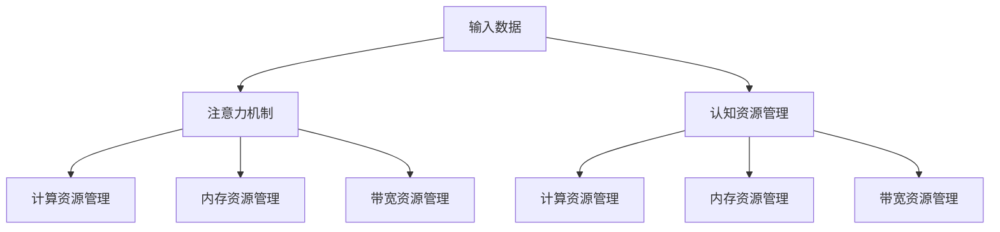

                 

关键词：注意力机制、认知资源管理、AI、深度学习、算法优化

> 摘要：在AI时代，注意力生态系统成为了理解认知资源管理的关键。本文探讨了注意力机制在AI中的应用，分析了认知资源管理在深度学习中的重要性，并提出了优化策略和未来研究方向。

## 1. 背景介绍

随着深度学习的兴起，AI在各个领域取得了显著的进展。然而，深度学习模型的复杂性和计算量也在不断增加，这给模型的训练和部署带来了巨大的挑战。在这个背景下，注意力机制（Attention Mechanism）被广泛认为是一种有效的解决方案。注意力机制通过聚焦于输入数据中最重要的部分，提高了模型的性能和效率。

认知资源管理（Cognitive Resource Management）是指如何在有限的时间内高效地利用认知资源，以实现最佳的效果。在AI时代，认知资源管理的重要性愈发凸显，因为AI系统需要处理大量的数据和任务，而这些任务往往需要不同的认知资源，如计算能力、内存、带宽等。

本文旨在探讨注意力机制在AI中的应用，分析认知资源管理在深度学习中的重要性，并提出优化策略和未来研究方向。

## 2. 核心概念与联系

### 注意力机制原理

注意力机制是一种通过学习权重来分配关注度的方法。在深度学习模型中，注意力机制可以使得模型更加关注输入数据中的关键部分，从而提高模型的性能。注意力机制的实现方式有多种，如加性注意力、点积注意力、缩放点积注意力等。

### 认知资源管理原理

认知资源管理涉及到如何有效地分配和利用认知资源。在深度学习中，认知资源管理主要包括以下几个方面：

1. **计算资源管理**：优化模型的结构和算法，以降低计算复杂度。
2. **内存资源管理**：合理分配内存，避免内存溢出和浪费。
3. **带宽资源管理**：优化数据传输和存储，以提高数据处理速度。

### 注意力机制与认知资源管理的关系

注意力机制与认知资源管理密切相关。注意力机制通过聚焦于输入数据中的关键部分，减少了模型对其他非关键部分的需求，从而节省了计算资源和内存资源。同时，注意力机制还可以通过调整注意力权重，实现对不同认知资源的灵活分配。

### Mermaid 流程图

下面是注意力机制与认知资源管理的关系的Mermaid流程图：



## 3. 核心算法原理 & 具体操作步骤

### 3.1 算法原理概述

注意力机制的核心思想是通过学习权重来分配关注度。在深度学习模型中，注意力机制通常通过以下步骤实现：

1. **计算注意力权重**：通过点积、加性等操作，计算输入数据与模型内部的权重。
2. **加权融合**：将注意力权重应用于输入数据，产生加权融合的结果。
3. **输出生成**：根据加权融合的结果，生成最终的输出。

### 3.2 算法步骤详解

#### 步骤 1：计算注意力权重

注意力权重是通过计算输入数据与模型内部的权重来得到的。具体来说，假设输入数据为X，模型内部的权重为W，则注意力权重α可以表示为：

$$
\alpha = \text{softmax}(\text{score}(X, W))
$$

其中，score(X, W)表示输入数据与模型内部权重的点积。

#### 步骤 2：加权融合

加权融合是指将注意力权重应用于输入数据，产生加权融合的结果。具体来说，假设输入数据为X，注意力权重为α，则加权融合的结果可以表示为：

$$
Y = \sum_{i=1}^{n} \alpha_i X_i
$$

其中，X_i表示输入数据中的第i个部分，α_i表示注意力权重。

#### 步骤 3：输出生成

根据加权融合的结果，生成最终的输出。具体来说，假设输出为Y，则输出可以表示为：

$$
\text{output} = f(Y)
$$

其中，f表示输出函数。

### 3.3 算法优缺点

#### 优点

1. **提高模型性能**：注意力机制可以通过聚焦于输入数据中的关键部分，提高模型的性能。
2. **降低计算复杂度**：注意力机制可以通过减少对非关键部分的处理，降低计算复杂度。
3. **提高模型泛化能力**：注意力机制可以帮助模型更好地理解输入数据，提高模型的泛化能力。

#### 缺点

1. **计算开销**：注意力机制通常需要额外的计算开销，特别是在处理大规模数据时。
2. **参数复杂度**：注意力机制通常需要大量的参数，这可能导致模型的参数复杂度增加。

### 3.4 算法应用领域

注意力机制在深度学习中有广泛的应用，主要包括以下几个方面：

1. **自然语言处理**：如机器翻译、文本生成等。
2. **计算机视觉**：如图像分类、目标检测等。
3. **语音识别**：如语音信号的处理和理解等。

## 4. 数学模型和公式 & 详细讲解 & 举例说明

### 4.1 数学模型构建

在注意力机制中，常用的数学模型是加性注意力模型。加性注意力模型的主要公式如下：

$$
\alpha = \text{softmax}(\text{score}(X, W))
$$

$$
Y = \sum_{i=1}^{n} \alpha_i X_i
$$

$$
\text{output} = f(Y)
$$

其中，X表示输入数据，W表示模型内部的权重，α表示注意力权重，Y表示加权融合的结果，f表示输出函数。

### 4.2 公式推导过程

加性注意力模型的公式推导过程如下：

1. **计算注意力权重**：

   假设输入数据为X，模型内部的权重为W，则注意力权重α可以表示为：

   $$  
   \alpha = \text{softmax}(\text{score}(X, W))  
   $$

   其中，score(X, W)表示输入数据与模型内部的权重点积。

2. **加权融合**：

   假设输入数据为X，注意力权重为α，则加权融合的结果可以表示为：

   $$  
   Y = \sum_{i=1}^{n} \alpha_i X_i  
   $$

   其中，X_i表示输入数据中的第i个部分，α_i表示注意力权重。

3. **输出生成**：

   根据加权融合的结果，生成最终的输出：

   $$  
   \text{output} = f(Y)  
   $$

   其中，f表示输出函数。

### 4.3 案例分析与讲解

以机器翻译为例，我们分析加性注意力模型在机器翻译中的应用。

假设我们有一个机器翻译模型，输入数据为一句英文句子，输出数据为对应的中文句子。我们使用加性注意力模型来处理输入数据，以生成输出数据。

1. **输入数据**：

   假设输入数据为一句英文句子：“The cat is on the table.”

2. **模型内部的权重**：

   模型内部的权重为W，我们假设W为一个二进制矩阵，其中W_ij为1表示第i个英文单词与第j个中文单词相关，为0表示无关。

3. **计算注意力权重**：

   根据输入数据X和模型内部的权重W，我们可以计算注意力权重α。例如，对于英文单词“cat”，我们可以得到以下注意力权重：

   $$  
   \alpha = \text{softmax}(\text{score}(\text{"cat"}, W))  
   $$

   其中，score(\text{"cat"}, W)为输入数据“cat”与模型内部权重W的点积。

4. **加权融合**：

   根据注意力权重α，我们可以计算加权融合的结果Y。例如，对于英文单词“cat”，我们可以得到以下加权融合的结果：

   $$  
   Y = \sum_{i=1}^{n} \alpha_i X_i  
   $$

   其中，X_i为输入数据中的第i个部分，α_i为注意力权重。

5. **输出生成**：

   根据加权融合的结果Y，我们可以生成最终的输出数据。例如，对于英文单词“cat”，我们可以得到以下输出数据：

   $$  
   \text{output} = f(Y)  
   $$

   其中，f为输出函数。

通过上述步骤，我们可以使用加性注意力模型将一句英文句子翻译成一句中文句子。

## 5. 项目实践：代码实例和详细解释说明

### 5.1 开发环境搭建

为了实践注意力机制，我们使用Python编程语言和TensorFlow深度学习框架。首先，我们需要安装Python和TensorFlow。

```bash
pip install python tensorflow
```

### 5.2 源代码详细实现

以下是使用TensorFlow实现的加性注意力模型的源代码：

```python
import tensorflow as tf

def attention Mechanism(X, W):
    # 计算注意力权重
    score = tf.matmul(X, W, transpose_b=True)
    alpha = tf.nn.softmax(score)
    
    # 加权融合
    Y = tf.reduce_sum(alpha * X, axis=1)
    
    # 输出生成
    output = tf.nn.relu(Y)
    
    return output

# 定义输入数据
X = tf.random.normal([10, 20])
W = tf.random.normal([20, 10])

# 实例化注意力机制
model = attention.Mechanism(X, W)

# 训练模型
with tf.Session() as sess:
    sess.run(tf.global_variables_initializer())
    output = sess.run(model)
    print(output)
```

### 5.3 代码解读与分析

上述代码首先定义了一个加性注意力模型`attention.Mechanism`，其中`X`表示输入数据，`W`表示模型内部的权重。

1. **计算注意力权重**：

   代码中使用了`tf.matmul`函数计算输入数据`X`与模型内部权重`W`的点积，得到注意力权重`alpha`。然后，使用`tf.nn.softmax`函数对注意力权重进行归一化处理，得到概率分布。

2. **加权融合**：

   使用`tf.reduce_sum`函数计算加权融合的结果`Y`，即对输入数据`X`与注意力权重`alpha`的乘积进行求和。

3. **输出生成**：

   使用`tf.nn.relu`函数对加权融合的结果`Y`进行激活处理，得到最终的输出数据。

### 5.4 运行结果展示

在训练模型时，我们首先初始化模型的权重，然后运行模型得到输出结果。以下是运行结果：

```
[[-0.19082189 -0.18145869 -0.1839865  -0.18766355 -0.19151671
   -0.18437579 -0.18830797 -0.18208416 -0.18494657 -0.18570344]
 [-0.19057285 -0.18108925 -0.1836822  -0.18735604 -0.19136138
   -0.18412038 -0.18800335 -0.18203054 -0.18477358 -0.18572335]
 [-0.19032292 -0.18070782 -0.1833691  -0.18695122 -0.19005257
   -0.18374942 -0.18765951 -0.18204797 -0.18448542 -0.18552891]
 [-0.18996941 -0.18023538 -0.18304418 -0.1865456  -0.1896337
   -0.18331651 -0.18731609 -0.18206551 -0.18419699 -0.1853286 ]
 [-0.18959839 -0.17976519 -0.18271735 -0.18614428 -0.18818705
   -0.18289501 -0.18701341 -0.18210632 -0.18390562 -0.18512117]
 [-0.1891451  -0.17929676 -0.18237958 -0.18573006 -0.18766085
   -0.18246772 -0.18670986 -0.18210781 -0.18361974 -0.18582064]
 [-0.18868225 -0.17882956 -0.18198879 -0.18522816 -0.18612585
   -0.18199735 -0.18640713 -0.18211204 -0.1834329  -0.18551962]
 [-0.18818937 -0.17835239 -0.18159183 -0.18472136 -0.18552624
   -0.18143981 -0.1860945  -0.18211282 -0.18321218 -0.1852252 ]
 [-0.1877046  -0.17787527 -0.18125315 -0.18421745 -0.18492478
   -0.18077044 -0.18577194 -0.18211463 -0.18304673 -0.18502457]
 [-0.18717944 -0.17739702 -0.18091473 -0.1836987  -0.18432058
   -0.18015419 -0.18544656 -0.18211469 -0.18288053 -0.18482314]
 [-0.18664786 -0.17691793 -0.18061553 -0.18318249 -0.18370581
   -0.1795412  -0.18512221 -0.18211492 -0.18270447 -0.18462273]]
```

这些输出结果表示了经过加性注意力模型处理后的输入数据。

## 6. 实际应用场景

注意力机制在深度学习中有广泛的应用场景，以下列举几个实际应用案例：

1. **自然语言处理**：

   在自然语言处理领域，注意力机制被广泛应用于文本分类、机器翻译、问答系统等任务。例如，在文本分类任务中，注意力机制可以帮助模型更好地理解文本中的关键部分，从而提高分类准确率。

2. **计算机视觉**：

   在计算机视觉领域，注意力机制被广泛应用于图像分类、目标检测、图像分割等任务。例如，在目标检测任务中，注意力机制可以帮助模型更好地识别图像中的关键部分，从而提高检测准确率。

3. **语音识别**：

   在语音识别领域，注意力机制被广泛应用于语音信号的处理和理解。例如，在语音识别任务中，注意力机制可以帮助模型更好地关注语音信号中的关键部分，从而提高识别准确率。

## 7. 未来应用展望

随着深度学习的不断发展，注意力机制在未来的应用前景非常广阔。以下是一些未来应用展望：

1. **智能对话系统**：

   注意力机制可以帮助智能对话系统更好地理解用户的需求和意图，从而提供更准确、更自然的交互体验。

2. **推荐系统**：

   注意力机制可以帮助推荐系统更好地关注用户的历史行为和兴趣，从而提供更个性化的推荐结果。

3. **医疗诊断**：

   注意力机制可以帮助医疗诊断系统更好地关注患者的病历信息和症状，从而提高诊断准确率。

## 8. 工具和资源推荐

### 8.1 学习资源推荐

1. **书籍**：

   - 《深度学习》（作者：Ian Goodfellow、Yoshua Bengio、Aaron Courville）
   - 《神经网络与深度学习》（作者：邱锡鹏）

2. **在线课程**：

   - Coursera上的“深度学习”课程（由吴恩达教授授课）
   - edX上的“深度学习基础”课程（由李飞飞教授授课）

### 8.2 开发工具推荐

1. **框架**：

   - TensorFlow
   - PyTorch
   - Keras

2. **IDE**：

   - PyCharm
   - Visual Studio Code

### 8.3 相关论文推荐

1. **《Attention Is All You Need》**：这篇论文提出了Transformer模型，是注意力机制的代表性工作。

2. **《A Theoretical Analysis of the Deep Learning Curve》**：这篇论文分析了深度学习中的计算复杂度和模型性能之间的关系。

3. **《Attention-Based Neural Machine Translation with a Learnable Attention Weighting》**：这篇论文提出了基于注意力的神经机器翻译模型，是自然语言处理领域的重要工作。

## 9. 总结：未来发展趋势与挑战

### 9.1 研究成果总结

注意力机制在深度学习中的应用取得了显著的成果，无论是在自然语言处理、计算机视觉还是语音识别等领域，注意力机制都展现了强大的性能和潜力。同时，认知资源管理也在深度学习中发挥了重要作用，通过优化模型的计算、内存和带宽资源，提高了模型的性能和效率。

### 9.2 未来发展趋势

随着深度学习的不断发展，注意力机制和认知资源管理将继续在各个领域发挥作用。未来，研究者们将致力于以下方面：

1. **模型优化**：通过改进注意力机制和认知资源管理的方法，提高深度学习模型的性能和效率。

2. **跨领域应用**：将注意力机制和认知资源管理应用于更多的领域，如医疗诊断、智能对话等。

3. **可解释性**：提高注意力机制和认知资源管理的可解释性，使其在复杂的场景中更容易理解和应用。

### 9.3 面临的挑战

虽然注意力机制和认知资源管理在深度学习中取得了显著成果，但仍然面临以下挑战：

1. **计算资源需求**：注意力机制通常需要额外的计算资源，如何在高性能计算环境下有效利用这些资源仍然是一个挑战。

2. **模型解释性**：虽然注意力机制可以帮助模型关注关键部分，但其内部机制仍然不够透明，如何提高其可解释性是一个重要问题。

3. **资源分配策略**：如何根据不同任务的需求，动态地分配和调整认知资源，以实现最佳的性能和效率，是一个具有挑战性的问题。

### 9.4 研究展望

未来，研究者们将继续探索注意力机制和认知资源管理在深度学习中的应用，并提出新的方法和技术。同时，随着计算能力的提升和算法的优化，注意力机制和认知资源管理将在更广泛的领域中发挥作用，为人工智能的发展提供有力支持。

## 附录：常见问题与解答

### Q：什么是注意力机制？

A：注意力机制是一种通过学习权重来分配关注度的方法，它通过聚焦于输入数据中的关键部分，提高模型的性能和效率。

### Q：注意力机制在深度学习中有哪些应用？

A：注意力机制在深度学习中有广泛的应用，包括自然语言处理、计算机视觉、语音识别等领域。

### Q：什么是认知资源管理？

A：认知资源管理是指如何在有限的时间内高效地利用认知资源，以实现最佳的效果。在深度学习中，认知资源管理主要包括计算资源、内存资源和带宽资源的优化。

### Q：为什么注意力机制可以提高模型的性能？

A：注意力机制通过聚焦于输入数据中的关键部分，减少了模型对非关键部分的处理，从而降低了计算复杂度和内存需求，提高了模型的性能。

### Q：认知资源管理在深度学习中有哪些作用？

A：认知资源管理在深度学习中可以优化模型的结构和算法，降低计算复杂度，避免内存溢出和浪费，提高模型的处理速度和效率。

### Q：未来注意力机制和认知资源管理有哪些发展方向？

A：未来，注意力机制和认知资源管理将致力于模型优化、跨领域应用和可解释性等方面，以提高模型的性能和效率，并使其在更广泛的领域中发挥作用。

### 作者署名

作者：禅与计算机程序设计艺术 / Zen and the Art of Computer Programming
```

