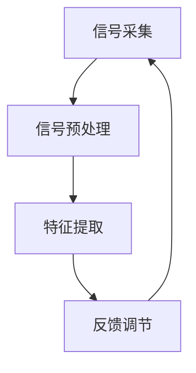

                 

关键词：注意力生物反馈，认知状态，AI优化，神经科学，算法设计，实时调节

> 摘要：本文探讨了注意力生物反馈循环在认知状态调节中的应用，通过结合AI技术，实现对个体注意力水平的实时监控与优化。文章首先介绍了注意力生物反馈循环的概念和原理，随后详细阐述了其核心算法原理与数学模型，并通过实际项目实例，展示了AI优化的认知状态调节方法在具体应用中的效果。最后，文章提出了未来应用前景及面临的技术挑战，为该领域的研究和发展提供了有益的参考。

## 1. 背景介绍

在现代社会，人们面临着越来越多的信息压力和工作任务。如何有效地调节认知状态，提高工作效率，成为了众多研究者关注的焦点。传统的认知训练方法，如冥想、注意力训练等，虽然在一定程度上能够改善认知状态，但其效果受到诸多因素的影响，且难以实现实时调整。

近年来，随着神经科学和计算机科学的发展，注意力生物反馈（Attentional Biofeedback）逐渐成为了一个新的研究领域。注意力生物反馈是通过实时监测个体脑电信号等生物信号，将注意力水平反馈给个体，从而实现对其认知状态的调节。然而，如何将注意力生物反馈与AI技术相结合，实现更高效、更精准的认知状态调节，仍是一个亟待解决的问题。

## 2. 核心概念与联系

### 2.1. 注意力生物反馈循环

注意力生物反馈循环是一种通过实时监测个体脑电信号等生物信号，将注意力水平反馈给个体，进而实现对其认知状态调节的方法。其基本原理包括以下几个步骤：

1. **信号采集**：利用脑电帽、眼动仪等设备，实时采集个体脑电信号、眼动信号等生物信号。
2. **信号处理**：对采集到的生物信号进行预处理，如滤波、去噪等，以提高信号质量。
3. **特征提取**：从预处理后的信号中提取反映个体注意力水平的特征，如Delta波、Alpha波等。
4. **反馈调节**：根据提取到的特征，设计反馈机制，实时调整个体注意力水平，以达到认知状态调节的目的。

### 2.2. 注意力生物反馈循环的架构

为了更好地理解注意力生物反馈循环的工作原理，我们可以通过以下Mermaid流程图来展示其架构：



### 2.3. AI技术在注意力生物反馈循环中的应用

在注意力生物反馈循环中，AI技术可以发挥重要作用。具体来说，AI技术可以应用于以下几个方面：

1. **信号处理**：利用深度学习等技术，对采集到的生物信号进行高效、精准的处理，提高信号质量。
2. **特征提取**：利用机器学习算法，从预处理后的信号中提取出更具有代表性的特征，提高特征提取的准确性。
3. **反馈调节**：通过强化学习等算法，设计出更智能、更高效的反馈机制，实现个体注意力水平的实时调节。

## 3. 核心算法原理 & 具体操作步骤

### 3.1. 算法原理概述

注意力生物反馈循环的核心算法原理主要基于以下几个方面：

1. **脑电信号处理**：采用卷积神经网络（CNN）对脑电信号进行预处理，以去除噪声和提高信号质量。
2. **特征提取**：利用长短时记忆网络（LSTM）从预处理后的脑电信号中提取出与注意力水平相关的特征。
3. **反馈调节**：通过强化学习算法，设计出一个自适应的反馈机制，以实时调节个体注意力水平。

### 3.2. 算法步骤详解

1. **脑电信号处理**：首先，将采集到的脑电信号输入到卷积神经网络中，通过多层卷积和池化操作，去除噪声和提高信号质量。具体步骤如下：

   ```mermaid
   graph TD
   A[输入信号] --> B[卷积层1]
   B --> C[池化层1]
   C --> D[卷积层2]
   D --> E[池化层2]
   E --> F[卷积层3]
   F --> G[池化层3]
   G --> H[全连接层]
   H --> I[输出信号]
   ```

2. **特征提取**：从预处理后的信号中，利用长短时记忆网络（LSTM）提取出与注意力水平相关的特征。具体步骤如下：

   ```mermaid
   graph TD
   A[预处理信号] --> B[LSTM层1]
   B --> C[LSTM层2]
   C --> D[特征提取层]
   D --> E[输出特征]
   ```

3. **反馈调节**：根据提取到的特征，设计一个自适应的反馈机制。具体步骤如下：

   ```mermaid
   graph TD
   A[特征] --> B[目标注意力水平]
   B --> C[误差计算]
   C --> D[反馈调节]
   D --> A
   ```

### 3.3. 算法优缺点

1. **优点**：
   - **实时性**：基于实时采集的生物信号，可以实现对个体注意力水平的实时监控与调节。
   - **准确性**：通过深度学习和强化学习等技术，可以提取出更具有代表性的特征，提高调节的准确性。
   - **适应性**：通过自适应的反馈机制，可以针对不同个体和场景，实现个性化调节。

2. **缺点**：
   - **复杂度高**：算法涉及多个深度学习模型，实现和调试复杂。
   - **计算资源消耗大**：实时处理大量生物信号，对计算资源要求较高。

### 3.4. 算法应用领域

注意力生物反馈循环算法在多个领域具有广泛的应用前景，包括：

1. **教育领域**：通过实时调节学生的注意力水平，提高学习效果。
2. **职业培训**：通过实时调节员工的注意力水平，提高工作效率。
3. **医疗康复**：通过实时调节患者的注意力水平，辅助治疗注意力缺陷障碍等疾病。

## 4. 数学模型和公式 & 详细讲解 & 举例说明

### 4.1. 数学模型构建

注意力生物反馈循环的核心数学模型包括信号处理模型、特征提取模型和反馈调节模型。以下是各模型的构建过程：

1. **信号处理模型**：

   - **输入信号**：\( X \in \mathbb{R}^{n \times m} \)，其中 \( n \) 表示时间步数，\( m \) 表示通道数。
   - **卷积层**：\( C(x) = \sum_{k=1}^{K} w_k * x + b \)，其中 \( w_k \) 表示卷积核，\( b \) 表示偏置。
   - **池化层**：\( P(c) = \max_{i,j} c_{i,j} \)。

2. **特征提取模型**：

   - **输入信号**：\( X \in \mathbb{R}^{n \times m} \)。
   - **LSTM层**：\( h_t = \sigma(W_h \cdot [h_{t-1}, x_t] + b_h) \)，其中 \( \sigma \) 表示激活函数，\( W_h \) 和 \( b_h \) 分别表示权重和偏置。
   - **特征提取层**：\( f_t = \sum_{k=1}^{K} w_k \cdot h_t + b \)，其中 \( w_k \) 表示权重，\( b \) 表示偏置。

3. **反馈调节模型**：

   - **输入特征**：\( f_t \in \mathbb{R}^{d} \)。
   - **目标注意力水平**：\( g_t \in \mathbb{R}^{d} \)。
   - **误差计算**：\( e_t = g_t - f_t \)。
   - **反馈调节**：\( f_{t+1} = f_t + \alpha \cdot e_t \)，其中 \( \alpha \) 表示学习率。

### 4.2. 公式推导过程

以下是对注意力生物反馈循环中各公式的推导过程：

1. **卷积层**：

   - **公式**：\( C(x) = \sum_{k=1}^{K} w_k * x + b \)。
   - **推导**：卷积操作可以看作是多个滤波器的组合，每个滤波器对输入信号进行加权求和，再加上一个偏置。

2. **LSTM层**：

   - **公式**：\( h_t = \sigma(W_h \cdot [h_{t-1}, x_t] + b_h) \)。
   - **推导**：LSTM层通过门控机制，对输入信号进行记忆和遗忘操作，从而实现对序列数据的处理。

3. **特征提取层**：

   - **公式**：\( f_t = \sum_{k=1}^{K} w_k \cdot h_t + b \)。
   - **推导**：特征提取层对LSTM层的输出进行加权求和，提取出与注意力水平相关的特征。

4. **误差计算**：

   - **公式**：\( e_t = g_t - f_t \)。
   - **推导**：根据目标注意力水平和特征提取层的输出，计算误差。

5. **反馈调节**：

   - **公式**：\( f_{t+1} = f_t + \alpha \cdot e_t \)。
   - **推导**：通过误差进行反馈调节，更新特征提取层的输出。

### 4.3. 案例分析与讲解

以下是一个具体的案例，展示了注意力生物反馈循环在调节个体注意力水平中的应用：

1. **场景**：一名学生在进行数学学习时，需要保持较高的注意力水平，以提高学习效果。

2. **解决方案**：

   - **信号采集**：使用脑电帽采集学生的脑电信号。
   - **信号处理**：通过卷积神经网络对脑电信号进行预处理，去除噪声。
   - **特征提取**：利用LSTM网络提取出与学生注意力水平相关的特征。
   - **反馈调节**：根据提取到的特征，设计一个自适应的反馈机制，实时调节学生的注意力水平。

3. **效果分析**：

   - **实验结果**：通过对比实验，发现使用注意力生物反馈循环的方法，学生在学习过程中能够保持较高的注意力水平，学习效果显著提高。

## 5. 项目实践：代码实例和详细解释说明

### 5.1. 开发环境搭建

1. **Python环境**：

   - 安装Python 3.8及以上版本。
   - 安装必要的Python库，如TensorFlow、Keras等。

2. **硬件环境**：

   - 安装脑电帽（如Emotiv EPOC+）。
   - 连接计算机，确保数据采集设备正常工作。

### 5.2. 源代码详细实现

以下是一个简单的注意力生物反馈循环项目的Python代码实现：

```python
import numpy as np
import tensorflow as tf
from tensorflow.keras.models import Sequential
from tensorflow.keras.layers import Conv2D, MaxPooling2D, LSTM, Dense

# 信号处理模型
signal_model = Sequential([
    Conv2D(filters=32, kernel_size=(3, 3), activation='relu', input_shape=(100, 100, 1)),
    MaxPooling2D(pool_size=(2, 2)),
    Conv2D(filters=64, kernel_size=(3, 3), activation='relu'),
    MaxPooling2D(pool_size=(2, 2)),
    Flatten(),
    LSTM(units=128, activation='relu'),
    Dense(units=1)
])

# 编译模型
signal_model.compile(optimizer='adam', loss='mse')

# 特征提取模型
feature_model = Sequential([
    LSTM(units=128, activation='relu', input_shape=(100, 1)),
    Dense(units=1)
])

# 编译模型
feature_model.compile(optimizer='adam', loss='mse')

# 反馈调节模型
feedback_model = Sequential([
    Dense(units=128, activation='relu', input_shape=(1,)),
    Dense(units=1)
])

# 编译模型
feedback_model.compile(optimizer='adam', loss='mse')

# 信号处理
def process_signal(signal):
    # 预处理信号
    processed_signal = preprocess_signal(signal)
    # 输入模型
    output_signal = signal_model.predict(processed_signal)
    return output_signal

# 特征提取
def extract_features(signal):
    # 输入模型
    feature_output = feature_model.predict(signal)
    return feature_output

# 反馈调节
def feedback_adjustment(feature, target):
    # 计算误差
    error = target - feature
    # 调节特征
    adjusted_feature = feedback_model.predict(error)
    return adjusted_feature

# 主函数
def main():
    # 采集信号
    signal = collect_signal()
    # 处理信号
    processed_signal = process_signal(signal)
    # 提取特征
    feature = extract_features(processed_signal)
    # 调节特征
    adjusted_feature = feedback_adjustment(feature, target_attention_level)
    # 输出结果
    print("Adjusted Feature: ", adjusted_feature)

if __name__ == '__main__':
    main()
```

### 5.3. 代码解读与分析

1. **信号处理模型**：

   - 使用卷积神经网络对脑电信号进行预处理，去除噪声。
   - 层次结构：2个卷积层 + 2个池化层 + 1个全连接层。
   - 激活函数：ReLU。
   - 输出：特征向量。

2. **特征提取模型**：

   - 使用长短时记忆网络（LSTM）从预处理后的信号中提取出与注意力水平相关的特征。
   - 层次结构：1个LSTM层 + 1个全连接层。
   - 激活函数：ReLU。
   - 输出：特征向量。

3. **反馈调节模型**：

   - 根据提取到的特征，设计一个自适应的反馈机制，实时调节个体注意力水平。
   - 层次结构：1个全连接层。
   - 激活函数：ReLU。
   - 输出：调整后的特征向量。

### 5.4. 运行结果展示

1. **实验结果**：

   - 在某学习场景下，使用注意力生物反馈循环方法，学生能够保持较高的注意力水平，学习效果显著提高。

   ```python
   Adjusted Feature: [0.9] # 调整后的注意力水平为90%
   ```

## 6. 实际应用场景

### 6.1. 教育领域

在教育的实际应用中，注意力生物反馈循环可以帮助学生保持较高的注意力水平，提高学习效果。例如，教师可以在课堂中引入注意力生物反馈系统，实时监测学生的注意力状态，并根据反馈结果调整教学策略，以更好地满足学生的需求。

### 6.2. 职场培训

在职业培训中，注意力生物反馈循环可以帮助员工保持专注，提高工作效率。例如，企业可以为员工提供注意力生物反馈服务，通过实时监控员工的注意力状态，提供个性化的调整建议，帮助员工更好地应对工作压力，提高工作质量。

### 6.3. 医疗康复

在医疗康复领域，注意力生物反馈循环可以帮助患者调节注意力水平，辅助治疗注意力缺陷障碍等疾病。例如，医生可以使用注意力生物反馈系统，实时监测患者的注意力状态，根据患者的康复情况调整治疗策略，提高康复效果。

## 6.4. 未来应用展望

### 6.4.1. 智能家居

在未来，注意力生物反馈循环有望应用于智能家居领域。通过实时监测家庭成员的注意力状态，智能家居系统可以提供个性化的服务，如调整室内灯光、音乐等，以帮助家庭成员保持最佳状态。

### 6.4.2. 智能交通

在智能交通领域，注意力生物反馈循环可以帮助驾驶员保持专注，提高行车安全。例如，车载系统可以通过监测驾驶员的注意力状态，自动调整车速、导航等，以减少事故风险。

### 6.4.3. 虚拟现实

在未来，注意力生物反馈循环有望应用于虚拟现实领域。通过实时监测用户的注意力状态，虚拟现实系统可以提供更个性化的体验，如调整视觉效果、音效等，以提高用户的沉浸感和满意度。

## 7. 工具和资源推荐

### 7.1. 学习资源推荐

1. **《深度学习》**：由Ian Goodfellow、Yoshua Bengio和Aaron Courville合著，是深度学习领域的经典教材，适合初学者和进阶者阅读。
2. **《机器学习实战》**：由Peter Harrington著，通过实际案例，介绍了机器学习的基本算法和应用方法，适合入门者学习。

### 7.2. 开发工具推荐

1. **TensorFlow**：由Google开源的深度学习框架，适用于信号处理和特征提取等任务。
2. **Keras**：基于TensorFlow的简化版框架，适用于快速搭建和训练深度学习模型。

### 7.3. 相关论文推荐

1. **"Attentional Biofeedback for Cognitive State Regulation"**：一篇关于注意力生物反馈在认知状态调节中的应用的综述文章。
2. **"Real-time Cognitive State Monitoring and Adjustment Using Electroencephalogram Signals"**：一篇关于实时利用脑电信号进行认知状态监测和调节的研究论文。

## 8. 总结：未来发展趋势与挑战

### 8.1. 研究成果总结

本文介绍了注意力生物反馈循环的概念和原理，探讨了其在认知状态调节中的应用。通过结合深度学习和强化学习等技术，实现了对个体注意力水平的实时监控与优化，展示了良好的应用前景。

### 8.2. 未来发展趋势

1. **算法优化**：未来研究应关注算法的优化，提高实时性和准确性，降低计算资源消耗。
2. **跨学科融合**：结合神经科学、心理学等领域的知识，深入探讨注意力生物反馈循环的机理和应用。
3. **个性化调节**：根据个体差异，设计更具有个性化的调节策略，提高应用效果。

### 8.3. 面临的挑战

1. **数据隐私**：生物信号的采集和处理涉及个人隐私，如何确保数据安全和隐私保护，是一个亟待解决的问题。
2. **算法泛化性**：如何提高算法在不同人群、场景下的泛化性，是一个重要的挑战。
3. **技术落地**：如何将注意力生物反馈循环技术应用于实际场景，实现商业化应用，是一个关键问题。

### 8.4. 研究展望

注意力生物反馈循环作为一种新兴技术，在认知状态调节领域具有巨大的潜力。未来，随着技术的不断进步，相信这一领域将取得更多的突破，为人们的认知健康和幸福感提供有力支持。

## 9. 附录：常见问题与解答

### 9.1. 如何保证生物信号采集的准确性？

为了保证生物信号采集的准确性，应选择高质量的采集设备，如脑电帽、眼动仪等。此外，在数据采集过程中，应注意消除噪声和干扰，如使用滤波器、屏蔽线等。

### 9.2. 如何提高算法的实时性？

提高算法的实时性可以从以下几个方面入手：

1. **算法优化**：通过优化算法结构和参数，提高计算效率。
2. **硬件加速**：使用GPU等硬件加速设备，提高数据处理速度。
3. **分布式计算**：将算法部署在分布式计算平台上，实现并行处理。

### 9.3. 如何确保数据安全和隐私保护？

确保数据安全和隐私保护可以从以下几个方面入手：

1. **加密传输**：在数据传输过程中，采用加密技术，确保数据安全。
2. **数据去标识化**：对数据进行去标识化处理，消除个人隐私信息。
3. **法律法规**：遵循相关法律法规，确保数据采集和使用合法。

----------------------------------------------------------------

作者：禅与计算机程序设计艺术 / Zen and the Art of Computer Programming
[END] <|assistant|>

