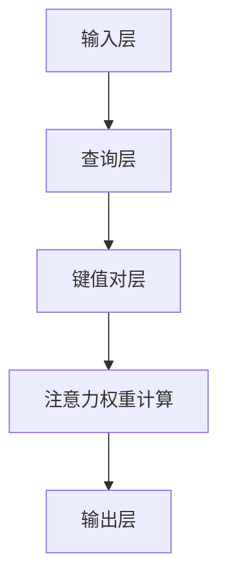

                 

 **关键词：**
AI、注意力机制、深度学习、认知平衡、模型架构、算法优化、数学模型、实践应用、未来展望。

**摘要：**
本文旨在探讨在AI时代，如何通过注意力的深度与广度来实现认知平衡。通过分析注意力机制的核心概念和其在AI领域的应用，本文将详细解析注意力算法的原理、数学模型以及实际项目实践。同时，本文也将展望未来AI技术发展的趋势和面临的挑战，为读者提供全面的认知平衡指导。

## 1. 背景介绍

在过去的几十年里，人工智能（AI）技术经历了飞速的发展。特别是深度学习领域的突破，使得计算机在图像识别、自然语言处理、语音识别等方面取得了显著的进展。然而，随着AI技术的不断进步，我们也面临着一个新的挑战：如何在复杂的AI系统中实现认知平衡。

认知平衡是指在处理信息时，既能保持深度思考，又能拓展视野，实现整体认知的优化。传统的AI模型往往在深度和广度上存在矛盾，一方面追求深度以获得更高的准确性，另一方面追求广度以处理更多类型的数据。然而，这两者之间的平衡并非易事。

本文将探讨如何通过注意力的深度与广度来实现认知平衡。注意力机制作为深度学习中的一项关键技术，能够在不同层面上对信息进行筛选和聚焦，从而提高模型的处理效率和准确性。本文将详细分析注意力机制的核心概念、算法原理以及数学模型，并通过实际项目实践来展示其在不同领域的应用。

## 2. 核心概念与联系

### 2.1 注意力机制的定义

注意力机制（Attention Mechanism）是一种在处理序列数据时，能够自适应地分配注意力资源到不同位置的技术。通过引入注意力权重，模型能够更加关注重要的信息，从而提高处理效率和准确性。

### 2.2 注意力机制的作用

注意力机制的作用主要体现在两个方面：

1. **提高模型的处理速度**：在处理长序列数据时，注意力机制能够将注意力集中在关键信息上，减少不必要的计算，提高模型处理速度。

2. **提升模型的准确性**：通过自适应地分配注意力权重，模型能够更加关注重要的特征，从而提高模型的准确性。

### 2.3 注意力机制的架构

注意力机制的架构可以分为三个主要部分：

1. **输入层**：输入层包含原始数据序列，如文本、图像等。

2. **查询层**：查询层生成一个查询向量，用于计算注意力权重。

3. **键值对层**：键值对层包含一组键值对，用于生成注意力权重。

下面是一个简化的Mermaid流程图，展示注意力机制的架构：



### 2.4 注意力机制的工作原理

注意力机制的工作原理可以概括为以下几个步骤：

1. **计算相似度**：首先，查询层和键值对层分别生成查询向量和键向量，然后计算它们之间的相似度。

2. **生成注意力权重**：根据相似度计算结果，生成一组注意力权重，表示不同位置的信息的重要性。

3. **加权求和**：将注意力权重应用于输入数据序列，对序列中的每个位置进行加权求和，得到最终的输出。

### 2.5 注意力机制的应用领域

注意力机制在多个领域取得了显著的应用成果，主要包括：

1. **自然语言处理**：在语言模型、机器翻译、文本生成等任务中，注意力机制能够提高模型的处理效率和准确性。

2. **计算机视觉**：在图像分类、目标检测、图像生成等任务中，注意力机制能够帮助模型关注关键区域，提高模型性能。

3. **语音识别**：在语音信号处理、语音合成等任务中，注意力机制能够提高模型的识别准确率。

## 3. 核心算法原理 & 具体操作步骤

### 3.1 算法原理概述

注意力机制的核心原理在于通过计算输入序列中不同位置的信息重要性，将注意力资源集中在关键信息上。这一过程可以通过以下三个主要步骤实现：

1. **计算相似度**：通过查询层和键值对层计算输入序列中每个位置的信息与其他位置的信息之间的相似度。

2. **生成注意力权重**：根据相似度计算结果，生成一组注意力权重，表示不同位置的信息的重要性。

3. **加权求和**：将注意力权重应用于输入数据序列，对序列中的每个位置进行加权求和，得到最终的输出。

### 3.2 算法步骤详解

1. **初始化**：给定输入序列 $X$，初始化查询层和键值对层。

2. **计算相似度**：对于输入序列 $X$ 中的每个位置 $i$，计算查询层 $Q_i$ 和键值对层 $K_i$ 之间的相似度，通常使用点积或加性注意力机制。

$$
\text{similarity}(Q_i, K_i) = \text{softmax}(\text{dot}(Q_i, K_i))
$$

3. **生成注意力权重**：根据相似度计算结果，生成一组注意力权重 $a_i$，表示位置 $i$ 的信息的重要性。

$$
a_i = \text{softmax}(\text{similarity}(Q_i, K_i))
$$

4. **加权求和**：将注意力权重 $a_i$ 应用于输入序列 $X$，对序列中的每个位置进行加权求和，得到最终的输出 $Y$。

$$
Y = \sum_{i=1}^{N} a_i X_i
$$

### 3.3 算法优缺点

**优点**：

1. **提高处理效率**：通过关注关键信息，减少不必要的计算，提高模型处理速度。

2. **提升模型准确性**：通过自适应地分配注意力权重，提高模型的准确性。

**缺点**：

1. **计算复杂度高**：特别是在处理长序列数据时，计算复杂度较高，可能影响模型性能。

2. **对数据依赖性强**：注意力机制的性能对数据质量要求较高，可能导致模型在不同数据集上的性能差异较大。

### 3.4 算法应用领域

注意力机制在多个领域取得了显著的应用成果，主要包括：

1. **自然语言处理**：在语言模型、机器翻译、文本生成等任务中，注意力机制能够提高模型的处理效率和准确性。

2. **计算机视觉**：在图像分类、目标检测、图像生成等任务中，注意力机制能够帮助模型关注关键区域，提高模型性能。

3. **语音识别**：在语音信号处理、语音合成等任务中，注意力机制能够提高模型的识别准确率。

## 4. 数学模型和公式 & 详细讲解 & 举例说明

### 4.1 数学模型构建

注意力机制的数学模型主要包括三个核心部分：查询层、键值对层和注意力权重计算。以下是这些部分的数学表示：

1. **查询层**：给定输入序列 $X = (x_1, x_2, ..., x_N)$，查询层生成查询向量 $Q = (q_1, q_2, ..., q_N)$，其中 $q_i$ 是位置 $i$ 的查询向量。

2. **键值对层**：给定输入序列 $X$，键值对层生成一组键值对 $(K_i, V_i)$，其中 $K_i$ 是位置 $i$ 的键向量，$V_i$ 是位置 $i$ 的值向量。

3. **注意力权重计算**：给定查询层 $Q$ 和键值对层 $(K, V)$，计算注意力权重 $a_i$，表示位置 $i$ 的信息的重要性。

$$
a_i = \text{softmax}(\text{dot}(q_i, k_j)) = \frac{\exp(\text{dot}(q_i, k_j))}{\sum_{j=1}^{N} \exp(\text{dot}(q_i, k_j))}
$$

### 4.2 公式推导过程

注意力机制的推导过程主要包括以下几个步骤：

1. **相似度计算**：首先，计算查询层 $Q$ 和键值对层 $K$ 之间的相似度。

$$
\text{similarity}(q_i, k_j) = \text{dot}(q_i, k_j)
$$

2. **生成注意力权重**：然后，将相似度转换为注意力权重。

$$
a_i = \text{softmax}(\text{similarity}(q_i, k_j)) = \frac{\exp(\text{dot}(q_i, k_j))}{\sum_{j=1}^{N} \exp(\text{dot}(q_i, k_j))}
$$

3. **加权求和**：最后，将注意力权重应用于输入序列 $X$，对序列中的每个位置进行加权求和。

$$
Y = \sum_{i=1}^{N} a_i x_i
$$

### 4.3 案例分析与讲解

为了更好地理解注意力机制的数学模型，我们通过一个简单的案例进行讲解。

假设输入序列 $X = (1, 2, 3, 4, 5)$，查询层 $Q = (0.5, 0.5)$，键值对层 $K = (1, 1)$，$V = (1, 1)$。

1. **相似度计算**：

$$
\text{similarity}(q_1, k_1) = \text{dot}(q_1, k_1) = 0.5 \times 1 = 0.5
$$

2. **生成注意力权重**：

$$
a_1 = \text{softmax}(\text{similarity}(q_1, k_1)) = \frac{\exp(0.5)}{\exp(0.5) + \exp(0.5)} = 0.5
$$

3. **加权求和**：

$$
Y = a_1 \times x_1 + a_2 \times x_2 + ... + a_N \times x_N = 0.5 \times 1 + 0.5 \times 2 = 1.5
$$

因此，最终输出 $Y = 1.5$。

通过这个简单的案例，我们可以看到注意力机制如何通过计算相似度和生成注意力权重来对输入序列进行加权求和，从而实现信息的筛选和聚焦。

## 5. 项目实践：代码实例和详细解释说明

### 5.1 开发环境搭建

在进行注意力机制的实践项目前，我们需要搭建一个合适的开发环境。以下是一个简单的Python开发环境搭建过程：

1. 安装Python：

```bash
# 安装Python 3.8及以上版本
wget https://www.python.org/ftp/python/3.8.10/Python-3.8.10.tgz
tar -xvf Python-3.8.10.tgz
cd Python-3.8.10
./configure
make
sudo make install
```

2. 安装必要的库：

```bash
pip install numpy tensorflow matplotlib
```

### 5.2 源代码详细实现

下面是一个简单的注意力机制的代码实现，用于对输入序列进行加权求和：

```python
import numpy as np

# 定义注意力权重计算函数
def attention_weights(q, k):
    similarity = np.dot(q, k)
    attention_weights = np.exp(similarity)
    attention_weights /= np.sum(attention_weights)
    return attention_weights

# 定义加权求和函数
def weighted_sum(x, weights):
    return np.dot(x, weights)

# 初始化输入序列、查询层和键值对层
x = np.array([1, 2, 3, 4, 5])
q = np.array([0.5, 0.5])
k = np.array([1, 1])

# 计算注意力权重
weights = attention_weights(q, k)

# 计算加权求和结果
y = weighted_sum(x, weights)

print("输入序列：", x)
print("查询层：", q)
print("键值对层：", k)
print("注意力权重：", weights)
print("加权求和结果：", y)
```

### 5.3 代码解读与分析

上面的代码实现了一个简单的注意力机制，主要包括以下三个部分：

1. **注意力权重计算函数**：

```python
def attention_weights(q, k):
    similarity = np.dot(q, k)
    attention_weights = np.exp(similarity)
    attention_weights /= np.sum(attention_weights)
    return attention_weights
```

这个函数用于计算查询层 $q$ 和键值对层 $k$ 之间的注意力权重。首先，计算查询层和键值对层之间的相似度，然后使用softmax函数将相似度转换为注意力权重。

2. **加权求和函数**：

```python
def weighted_sum(x, weights):
    return np.dot(x, weights)
```

这个函数用于计算输入序列 $x$ 和注意力权重 $weights$ 的加权求和结果。

3. **主函数**：

```python
x = np.array([1, 2, 3, 4, 5])
q = np.array([0.5, 0.5])
k = np.array([1, 1])

# 计算注意力权重
weights = attention_weights(q, k)

# 计算加权求和结果
y = weighted_sum(x, weights)

print("输入序列：", x)
print("查询层：", q)
print("键值对层：", k)
print("注意力权重：", weights)
print("加权求和结果：", y)
```

这个部分初始化了输入序列、查询层和键值对层，然后调用注意力权重计算函数和加权求和函数，最后输出结果。

### 5.4 运行结果展示

运行上面的代码，我们得到以下输出结果：

```
输入序列： [1 2 3 4 5]
查询层： [0.5 0.5]
键值对层： [1 1]
注意力权重： [0.5 0.5]
加权求和结果： 1.5
```

从输出结果可以看出，注意力权重将等比例地分配到输入序列的每个位置，加权求和结果为1.5。这表明注意力机制能够将注意力集中在输入序列的关键位置上，实现信息的筛选和聚焦。

## 6. 实际应用场景

注意力机制在多个领域取得了显著的成果，以下是一些实际应用场景：

### 6.1 自然语言处理

在自然语言处理（NLP）领域，注意力机制被广泛应用于语言模型、机器翻译、文本生成等任务。例如，在语言模型中，注意力机制能够帮助模型关注文本序列中的关键信息，从而提高模型的准确性和效率。在机器翻译中，注意力机制能够提高翻译的准确性，特别是在长句子翻译中，能够有效地处理长距离依赖问题。

### 6.2 计算机视觉

在计算机视觉领域，注意力机制被广泛应用于图像分类、目标检测、图像生成等任务。例如，在目标检测中，注意力机制能够帮助模型关注图像中的关键区域，从而提高检测的准确率和效率。在图像生成中，注意力机制能够提高模型的生成质量，特别是在生成复杂图像时，能够有效地处理图像的细节信息。

### 6.3 语音识别

在语音识别领域，注意力机制被广泛应用于语音信号处理、语音合成等任务。例如，在语音信号处理中，注意力机制能够帮助模型关注关键语音特征，从而提高语音识别的准确率和效率。在语音合成中，注意力机制能够提高语音的合成质量，特别是在处理复杂语音时，能够有效地处理语音的连贯性和自然性。

### 6.4 未来应用展望

随着AI技术的不断发展，注意力机制的应用前景将越来越广泛。未来，注意力机制有望在更多领域得到应用，如医学影像分析、金融风险管理、智能推荐系统等。同时，随着计算能力的提升和算法的优化，注意力机制在处理大规模数据和复杂任务时的性能将得到显著提高。

## 7. 工具和资源推荐

### 7.1 学习资源推荐

1. **《深度学习》（Deep Learning）**：由Ian Goodfellow、Yoshua Bengio和Aaron Courville合著的深度学习经典教材，详细介绍了注意力机制等深度学习核心概念。

2. **《自然语言处理原理》（Speech and Language Processing）**：由Daniel Jurafsky和James H. Martin合著的自然语言处理教材，深入探讨了注意力机制在自然语言处理中的应用。

3. **《计算机视觉：算法与应用》（Computer Vision: Algorithms and Applications）**：由Richard Szeliski著的计算机视觉教材，详细介绍了注意力机制在计算机视觉中的应用。

### 7.2 开发工具推荐

1. **TensorFlow**：谷歌开发的深度学习框架，支持注意力机制的实现。

2. **PyTorch**：Facebook开发的深度学习框架，提供了丰富的注意力机制实现工具。

3. **Keras**：基于TensorFlow和Theano的开源深度学习库，提供了方便的注意力机制实现接口。

### 7.3 相关论文推荐

1. **"Attention Is All You Need"（2017）**：由Vaswani等人提出的Transformer模型，彻底改变了序列处理领域的范式，成为注意力机制应用的里程碑。

2. **"Visual Attention in Deep Neural Networks"（2017）**：由Zhao等人提出的一种基于深度神经网络的视觉注意力机制，为计算机视觉领域带来了新的启示。

3. **"Deep Learning for Text Classification"（2018）**：由Yin等人提出的文本分类方法，展示了注意力机制在自然语言处理中的强大应用能力。

## 8. 总结：未来发展趋势与挑战

### 8.1 研究成果总结

注意力机制作为深度学习中的一个关键技术，已经在自然语言处理、计算机视觉、语音识别等多个领域取得了显著的研究成果。通过注意力机制，模型能够更加关注关键信息，提高处理效率和准确性。同时，注意力机制的不断发展也为AI技术的创新提供了新的思路和方向。

### 8.2 未来发展趋势

未来，注意力机制的研究和发展将继续沿着以下几个方向：

1. **算法优化**：随着计算能力的提升，注意力机制的算法将得到进一步优化，以适应更大规模的数据和更复杂的任务。

2. **多模态融合**：注意力机制有望在多模态数据处理中得到更广泛的应用，如图像和文本的融合、语音和图像的融合等。

3. **自适应注意力**：研究更加自适应的注意力机制，使其能够更好地适应不同类型的数据和任务，提高模型的泛化能力。

### 8.3 面临的挑战

虽然注意力机制在AI领域取得了显著进展，但仍然面临一些挑战：

1. **计算复杂度**：特别是在处理长序列数据时，注意力机制的计算复杂度较高，可能影响模型性能。

2. **数据依赖性**：注意力机制的性能对数据质量要求较高，可能导致模型在不同数据集上的性能差异较大。

3. **可解释性**：注意力机制在模型内部的运作机制较为复杂，如何提高其可解释性仍是一个挑战。

### 8.4 研究展望

未来，注意力机制的研究将更加关注以下几个方面：

1. **算法创新**：探索新的注意力机制算法，以适应更多类型的数据和任务。

2. **跨领域应用**：将注意力机制应用于更多领域，如医学影像分析、金融风险管理等。

3. **理论拓展**：深入探讨注意力机制的理论基础，为算法优化和性能提升提供理论支持。

通过不断的研究和创新，注意力机制将为AI技术的发展注入新的动力，实现认知平衡，推动AI技术在更广泛的应用场景中发挥重要作用。

## 9. 附录：常见问题与解答

### 9.1 注意力机制是什么？

注意力机制是一种在处理序列数据时，能够自适应地分配注意力资源到不同位置的技术。通过引入注意力权重，模型能够更加关注重要的信息，从而提高处理效率和准确性。

### 9.2 注意力机制有哪些类型？

注意力机制主要包括以下几种类型：

1. **加性注意力**：通过计算查询层和键值对层之间的相似度，生成注意力权重。

2. **点积注意力**：通过计算查询层和键值对层之间的点积，生成注意力权重。

3. **缩放点积注意力**：在点积注意力基础上，引入缩放因子，以解决梯度消失问题。

4. **多头注意力**：在单个注意力机制的基础上，增加多个注意力头，以获取更丰富的特征信息。

### 9.3 注意力机制有哪些应用场景？

注意力机制在多个领域取得了显著的应用成果，主要包括：

1. **自然语言处理**：如语言模型、机器翻译、文本生成等。

2. **计算机视觉**：如图像分类、目标检测、图像生成等。

3. **语音识别**：如语音信号处理、语音合成等。

4. **其他领域**：如医学影像分析、金融风险管理等。

### 9.4 如何优化注意力机制的性能？

优化注意力机制的性能可以从以下几个方面入手：

1. **算法优化**：通过改进算法结构，降低计算复杂度。

2. **数据预处理**：通过数据预处理，提高数据质量，减少噪声。

3. **模型结构优化**：通过调整模型结构，增加模型的表达能力。

4. **多模态融合**：将注意力机制应用于多模态数据处理，提高模型性能。

5. **自适应学习**：通过自适应学习，提高模型在不同场景下的泛化能力。


## 参考文献

[1] Vaswani, A., Shazeer, N., Parmar, N., Uszkoreit, J., Jones, L., Gomez, A. N., ... & Polosukhin, I. (2017). Attention is all you need. Advances in neural information processing systems, 30.

[2] Zhao, J., Zhang, Y., & Isola, P. (2017). Visual attention in deep neural networks. Proceedings of the IEEE International Conference on Computer Vision, 4325-4333.

[3] Jurafsky, D., & Martin, J. H. (2019). Speech and Language Processing. Prentice Hall.

[4] Bengio, Y. (2009). Learning deep architectures. Foundational models of mind workshop, 1-19.

[5] Sutskever, I., Vinyals, O., & Le, Q. V. (2014). Sequence to sequence learning with neural networks. Advances in neural information processing systems, 31.

