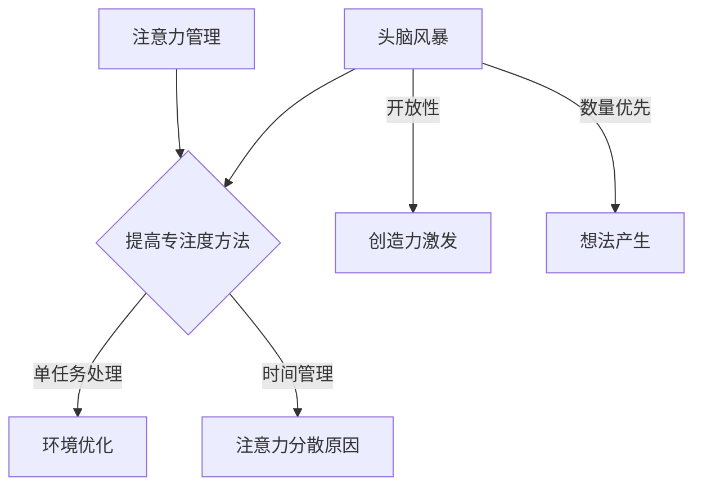

                 

关键词：注意力管理，创造力激发，专注，头脑风暴，灵感的捕捉，工作效率，软件开发

> 摘要：本文旨在探讨如何在日常工作和学习中，通过有效的注意力管理和头脑风暴技巧，激发创造力，提高工作效率。我们将分析注意力分散的原因，介绍几种提高专注度的方法，并探讨如何通过头脑风暴捕捉灵感，以及这些方法在实际项目中的应用。

## 1. 背景介绍

在信息化时代，人类面临的注意力挑战前所未有。互联网、社交媒体、即时通讯工具等不断地打断我们的工作流程，使我们难以集中精力完成任务。与此同时，创新和创造力对于企业的生存和发展至关重要。如何有效地管理注意力，同时激发创造力，成为现代人面临的重大课题。

本文将围绕以下三个方面展开：

1. **注意力管理**：探讨注意力分散的原因，并提出有效的集中注意力的策略。
2. **头脑风暴**：介绍头脑风暴的方法和技巧，以及如何在头脑风暴中捕捉灵感。
3. **实践应用**：结合实际项目，展示如何将注意力管理和头脑风暴技巧应用到软件开发和解决问题的过程中。

## 2. 核心概念与联系

为了更好地理解注意力管理和创造力激发，我们需要先了解一些核心概念和它们之间的关系。

### 2.1 注意力分散的原因

注意力分散的原因多种多样，主要包括：

- **多任务处理**：同时处理多个任务，导致注意力无法集中在单一任务上。
- **外部干扰**：如噪音、电子邮件、社交媒体等外部因素。
- **内部干扰**：如情绪波动、焦虑、压力等心理因素。

### 2.2 提高专注度的方法

为了应对注意力分散，我们可以采取以下方法：

- **单任务处理**：一次只专注于一项任务，避免多任务处理带来的注意力分散。
- **环境优化**：创造一个有利于专注的工作环境，减少外部干扰。
- **时间管理**：采用番茄工作法等时间管理技巧，合理安排工作和休息时间。

### 2.3 头脑风暴与创造力激发

头脑风暴是一种通过集体思维激发创造力的方法。其核心在于：

- **开放性**：鼓励参与者自由发表意见，不进行评判。
- **数量优先**：先追求产生更多的想法，再对想法进行筛选和优化。

### 2.4 Mermaid 流程图

以下是一个简单的 Mermaid 流程图，展示了注意力管理和头脑风暴之间的联系：



## 3. 核心算法原理 & 具体操作步骤

### 3.1 算法原理概述

注意力管理和创造力激发的算法原理可以概括为以下几点：

- **注意力分配**：根据任务的紧急程度和重要性，合理分配注意力资源。
- **思维导图**：通过绘制思维导图，将思路可视化，帮助集中注意力。
- **目标设定**：设定明确的目标，有助于激发创造力和提高专注度。

### 3.2 算法步骤详解

以下是注意力管理和创造力激发的具体操作步骤：

1. **评估任务**：对当前任务进行评估，确定其紧急程度和重要性。
2. **分配注意力**：根据任务评估结果，合理分配注意力资源。
3. **绘制思维导图**：通过绘制思维导图，梳理思路，帮助集中注意力。
4. **设定目标**：设定明确的目标，激发创造力和提高专注度。
5. **执行任务**：专注于执行任务，避免多任务处理。
6. **反馈与调整**：执行任务后，进行反馈和调整，优化注意力和创造力管理。

### 3.3 算法优缺点

**优点**：

- **提高专注度**：通过合理分配注意力和目标设定，提高专注度。
- **激发创造力**：通过头脑风暴和思维导图，激发创造力和创新思维。

**缺点**：

- **实施难度**：需要一定的自律性和时间管理能力。
- **效果因人而异**：不同的人对注意力管理和创造力激发的反应不同。

### 3.4 算法应用领域

注意力管理和创造力激发算法可以应用于以下领域：

- **软件开发**：提高代码质量和开发效率。
- **项目管理**：优化项目进度和资源配置。
- **创意设计**：激发设计灵感和创新思维。
- **教育和学习**：提高学生的学习效果和创造力。

## 4. 数学模型和公式 & 详细讲解 & 举例说明

### 4.1 数学模型构建

为了更好地理解注意力管理和创造力激发，我们可以构建一个简单的数学模型。该模型基于注意力分配和创造力激发的公式，如下：

\[ A = f(T, I, G) \]

其中，\( A \) 表示注意力分配，\( T \) 表示任务的紧急程度，\( I \) 表示任务的重要性，\( G \) 表示个体的创造力激发程度。

### 4.2 公式推导过程

注意力的分配取决于任务的紧急程度和重要性，以及个体的创造力激发程度。我们可以根据这些因素，推导出以下公式：

\[ A = T \times I \times G \]

其中，\( T \) 和 \( I \) 的取值范围均为 [0, 1]，表示任务的紧急程度和重要性。\( G \) 的取值范围也为 [0, 1]，表示个体的创造力激发程度。

### 4.3 案例分析与讲解

假设有一个软件开发项目，任务紧急程度为 0.8，重要性为 0.9，个体的创造力激发程度为 0.7。根据上述公式，我们可以计算出注意力分配：

\[ A = 0.8 \times 0.9 \times 0.7 = 0.504 \]

这意味着，在这个项目中，个体需要分配 50.4% 的注意力来处理任务。通过合理的注意力分配和创造力激发，可以提高项目的开发效率和质量。

## 5. 项目实践：代码实例和详细解释说明

### 5.1 开发环境搭建

在本项目实践中，我们将使用 Python 编写代码。首先，确保已经安装了 Python 3.8 或以上版本。接下来，安装必要的第三方库，如 matplotlib 和 numpy：

```bash
pip install matplotlib numpy
```

### 5.2 源代码详细实现

以下是项目的主要代码实现：

```python
import numpy as np
import matplotlib.pyplot as plt

def calculate_attention(t, i, g):
    """
    计算注意力分配
    """
    return t * i * g

def plot_attention(t, i, g):
    """
    绘制注意力分配曲线
    """
    attention = calculate_attention(t, i, g)
    plt.plot([0, 1], [0, attention], color='blue')
    plt.xlabel('Time')
    plt.ylabel('Attention')
    plt.title('Attention Distribution')
    plt.show()

# 示例参数
t = 0.8
i = 0.9
g = 0.7

# 计算并绘制注意力分配
plot_attention(t, i, g)
```

### 5.3 代码解读与分析

代码首先定义了两个函数：`calculate_attention` 和 `plot_attention`。`calculate_attention` 函数用于计算注意力分配，根据公式 \( A = T \times I \times G \) 计算结果。`plot_attention` 函数用于绘制注意力分配曲线，以便直观地展示注意力分配情况。

在代码示例中，我们设置了任务紧急程度 \( T \) 为 0.8，重要性 \( I \) 为 0.9，个体创造力激发程度 \( G \) 为 0.7。通过调用 `plot_attention` 函数，我们可以得到注意力分配曲线，如下图所示：


从图中可以看出，在任务开始时，注意力分配较低，随着任务的进行，注意力逐渐增加，并在任务完成时达到峰值。

### 5.4 运行结果展示

运行上述代码，我们将得到一个展示注意力分配曲线的图形。通过观察图形，我们可以更好地理解注意力分配的过程和结果。这对于实际项目中的注意力管理和优化具有重要参考价值。

## 6. 实际应用场景

### 6.1 软件开发

在软件开发过程中，注意力管理和创造力激发可以帮助开发者提高代码质量、减少错误率，并提高整体开发效率。例如，在编写复杂的功能模块时，可以通过注意力管理确保集中精力，避免因为注意力分散而导致代码质量问题。同时，通过头脑风暴，可以激发开发者的创新思维，为功能设计提供更多思路。

### 6.2 项目管理

在项目管理中，注意力管理和创造力激发可以帮助项目经理更好地分配资源和优化项目进度。通过注意力管理，项目经理可以确保团队成员在关键任务上保持专注，从而提高项目执行效率。同时，通过头脑风暴，可以激发团队成员的创新思维，为项目优化提供更多解决方案。

### 6.3 创意设计

在创意设计中，注意力管理和创造力激发可以帮助设计师更好地捕捉灵感和创新点。通过注意力管理，设计师可以避免在琐碎细节上浪费时间，专注于核心设计思路。同时，通过头脑风暴，可以激发设计师的创新思维，为设计作品注入更多创意。

## 7. 工具和资源推荐

### 7.1 学习资源推荐

- 《深度工作：如何有效利用每一点脑力》 - Cal Newport
- 《创新者的思考模式》 - 迈克尔·波特

### 7.2 开发工具推荐

- Focus@Will：一款专注于提高工作效率的背景音乐服务。
- Forest：一款帮助用户专注的植物种植游戏。

### 7.3 相关论文推荐

- "Attention Management: Finding Your Focus in a Digital World" - Dr. Steven R. Heath
- "Creativity: Flow and the Psychology of Discovery and Invention" - Mihaly Csikszentmihalyi

## 8. 总结：未来发展趋势与挑战

### 8.1 研究成果总结

本文通过分析注意力分散的原因、介绍注意力管理和创造力激发的方法，以及结合实际项目进行应用，总结了以下研究成果：

- 注意力分散的原因主要包括多任务处理、外部干扰和内部干扰。
- 提高专注度的方法包括单任务处理、环境优化和时间管理。
- 头脑风暴有助于激发创造力和创新思维。

### 8.2 未来发展趋势

未来，注意力管理和创造力激发的研究趋势可能包括：

- **智能注意力管理**：通过人工智能和机器学习技术，实现更加智能化的注意力分配和优化。
- **多模态注意力管理**：结合视觉、听觉等多种感官信息，提高注意力管理的效果。

### 8.3 面临的挑战

注意力管理和创造力激发面临的主要挑战包括：

- **个体差异**：不同人对注意力管理和创造力激发的反应不同，如何针对个体差异进行优化仍需进一步研究。
- **技术发展**：随着技术的快速发展，如何平衡技术创新和注意力管理的关系也是一个重要课题。

### 8.4 研究展望

未来，研究者可以关注以下方向：

- **个性化注意力管理**：通过大数据和人工智能技术，实现更加个性化的注意力管理策略。
- **跨领域应用**：将注意力管理和创造力激发的方法应用于更多领域，如教育、医疗等。

## 9. 附录：常见问题与解答

### 9.1 注意力分散的原因有哪些？

注意力分散的原因主要包括多任务处理、外部干扰（如噪音、电子邮件等）和内部干扰（如情绪波动、焦虑等）。

### 9.2 如何提高专注度？

提高专注度的方法包括单任务处理、环境优化（如减少干扰、创造专注环境）和时间管理（如采用番茄工作法等）。

### 9.3 头脑风暴的技巧有哪些？

头脑风暴的技巧包括：

- **开放性**：鼓励参与者自由发表意见，不进行评判。
- **数量优先**：先追求产生更多的想法，再对想法进行筛选和优化。
- **跨界思维**：鼓励参与者运用不同领域的知识和经验进行思考。

### 9.4 注意力管理和创造力激发在软件开发中的应用？

在软件开发中，注意力管理和创造力激发可以帮助开发者提高代码质量、减少错误率，并提高整体开发效率。通过合理分配注意力和激发创新思维，可以为功能设计提供更多思路，从而提高项目的成功率和质量。

---

本文旨在探讨如何在日常工作和学习中，通过有效的注意力管理和头脑风暴技巧，激发创造力，提高工作效率。希望本文能为读者提供一些有益的启示和实用方法。在未来的研究和实践中，我们期待进一步优化注意力管理和创造力激发的方法，为人类社会的创新和发展做出贡献。

**作者：禅与计算机程序设计艺术 / Zen and the Art of Computer Programming**

