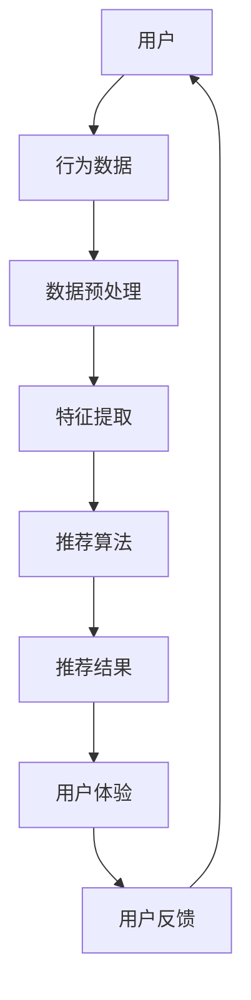

                 

关键词：注意力经济、个性化推荐、用户行为分析、大数据、机器学习、算法、用户体验、内容定制、数据挖掘

> 摘要：本文将探讨注意力经济与个性化推荐系统的关系，解释其原理，介绍核心算法和数学模型，并通过实际项目实例和代码实现，展示如何在实践中构建高效的个性化推荐系统，最终分析其应用场景及未来发展趋势和挑战。

## 1. 背景介绍

随着互联网的飞速发展，信息爆炸的时代已经到来。用户在获取信息时面临的选择越来越多，而他们的注意力资源却是有限的。如何在海量信息中找到对用户有价值的部分，成为互联网公司和内容创作者面临的一个重要问题。这就引出了注意力经济这个概念。

### 1.1 注意力经济的定义

注意力经济（Attention Economy）是指，在一个信息过载的社会中，用户的注意力成为了一种稀缺资源，企业和个人通过吸引和保留用户的注意力来创造价值的经济模式。这种模式强调的是如何有效地获取和利用用户的注意力，以实现商业利益最大化。

### 1.2 个性化推荐系统的兴起

个性化推荐系统（Personalized Recommendation Systems）是注意力经济的重要组成部分。通过分析用户的行为数据，推荐系统可以为用户提供个性化的内容，从而提升用户的参与度和留存率。个性化推荐在电子商务、社交媒体、视频平台等领域得到了广泛应用。

### 1.3 本文的目标

本文旨在深入探讨注意力经济与个性化推荐系统的关系，解释其核心概念和原理，介绍常用的算法和数学模型，并通过实际项目实例展示如何实现一个高效的个性化推荐系统。同时，我们将讨论个性化推荐系统的实际应用场景，以及未来可能面临的挑战。

## 2. 核心概念与联系

为了更好地理解个性化推荐系统的原理，我们首先需要介绍一些核心概念，并使用Mermaid流程图来展示它们之间的关系。



### 2.1 用户

用户是个性化推荐系统的核心。用户的兴趣、行为、偏好等信息是构建推荐系统的基础。

### 2.2 行为数据

用户行为数据包括浏览历史、购买记录、搜索查询、互动反馈等。这些数据通过数据分析可以揭示用户的兴趣和偏好。

### 2.3 数据预处理

数据预处理是对原始数据进行清洗、归一化和特征工程的过程。这一步至关重要，因为高质量的输入数据可以显著提高推荐系统的性能。

### 2.4 特征提取

特征提取是从数据预处理后的数据中提取出对推荐算法有用的特征。这些特征可以是用户的显式反馈（如评分、点击）或隐式反馈（如浏览时间、购买频率）。

### 2.5 推荐算法

推荐算法是推荐系统的核心。根据不同的算法类型，推荐算法可以分为基于内容的推荐、协同过滤推荐、混合推荐等。每种算法都有其特定的实现方式和优缺点。

### 2.6 推荐结果

推荐结果是推荐算法的输出。推荐系统会根据用户的历史行为和兴趣，为用户推荐可能感兴趣的内容。

### 2.7 用户体验

用户体验是推荐系统的最终目标。高效的推荐系统应该能够提供满足用户需求和兴趣的内容，从而提高用户的参与度和满意度。

### 2.8 用户反馈

用户反馈是不断优化推荐系统的重要手段。通过收集和分析用户对推荐结果的反馈，我们可以调整算法参数，提高推荐质量。

## 3. 核心算法原理 & 具体操作步骤

### 3.1 算法原理概述

个性化推荐系统主要采用以下几种核心算法：

1. **基于内容的推荐（Content-based Filtering）**：根据用户过去的兴趣和行为，找到与用户兴趣相关的项目，然后推荐相似的项目。

2. **协同过滤推荐（Collaborative Filtering）**：通过分析用户之间的相似性，为用户推荐其他用户喜欢的内容。

3. **混合推荐（Hybrid Recommendation）**：结合基于内容和协同过滤的推荐方法，以提高推荐质量。

### 3.2 算法步骤详解

#### 3.2.1 基于内容的推荐

1. **特征提取**：从用户的历史行为数据中提取出兴趣特征。
2. **相似度计算**：计算目标项目和用户兴趣特征之间的相似度。
3. **推荐生成**：为用户推荐与兴趣特征相似的项目。

#### 3.2.2 协同过滤推荐

1. **用户相似度计算**：计算用户之间的相似度，通常使用余弦相似度或皮尔逊相关系数。
2. **项目相似度计算**：计算项目之间的相似度。
3. **预测评分**：基于用户相似度和项目相似度，预测用户对项目的评分。
4. **推荐生成**：为用户推荐预测评分较高的项目。

#### 3.2.3 混合推荐

1. **特征提取**：同时提取用户和项目的兴趣特征。
2. **相似度计算**：计算用户和项目之间的相似度。
3. **评分预测**：结合基于内容和协同过滤的评分预测方法。
4. **推荐生成**：为用户推荐评分预测较高的项目。

### 3.3 算法优缺点

- **基于内容的推荐**：优点是能够提供准确、个性化的推荐，缺点是对稀疏数据的处理能力较差。
- **协同过滤推荐**：优点是能够处理稀疏数据，缺点是可能产生冷启动问题和推荐多样性不足。
- **混合推荐**：优点是结合了基于内容和协同过滤的优点，能够提供更高质量的推荐，缺点是算法复杂度较高。

### 3.4 算法应用领域

个性化推荐系统广泛应用于电子商务、社交媒体、视频平台等领域。例如，电商平台可以通过个性化推荐帮助用户发现感兴趣的商品，社交媒体可以通过个性化推荐推荐用户可能感兴趣的内容，视频平台可以通过个性化推荐推荐用户可能喜欢的视频。

## 4. 数学模型和公式 & 详细讲解 & 举例说明

### 4.1 数学模型构建

个性化推荐系统中的数学模型主要包括用户-项目评分矩阵、相似度计算模型和评分预测模型。

#### 4.1.1 用户-项目评分矩阵

用户-项目评分矩阵是一个二维矩阵，表示用户对项目的评分。矩阵中的元素表示用户\( u \)对项目\( i \)的评分，记为\( R_{ui} \)。

#### 4.1.2 相似度计算模型

相似度计算模型用于计算用户和项目之间的相似度。常用的相似度计算模型包括余弦相似度和皮尔逊相关系数。

- **余弦相似度**：
  $$\text{Cosine Similarity}(u, v) = \frac{u \cdot v}{\|u\| \|v\|}$$
  其中，\( u \)和\( v \)是用户\( u \)和\( v \)的向量表示，\( \cdot \)表示点积，\( \| \cdot \| \)表示欧几里得范数。

- **皮尔逊相关系数**：
  $$\text{Pearson Correlation}(u, v) = \frac{cov(u, v)}{\sigma_u \sigma_v}$$
  其中，\( cov(u, v) \)是\( u \)和\( v \)的协方差，\( \sigma_u \)和\( \sigma_v \)是\( u \)和\( v \)的标准差。

#### 4.1.3 评分预测模型

评分预测模型用于预测用户对项目的评分。常用的评分预测模型包括基于内容的推荐和基于模型的协同过滤。

- **基于内容的推荐**：
  $$\text{Rating}_{ui} = f(\text{Content}_{ui}, \text{Content}_{ij})$$
  其中，\( \text{Content}_{ui} \)和\( \text{Content}_{ij} \)是用户\( u \)和项目\( i \)以及用户\( v \)和项目\( j \)的特征向量，\( f \)是一个映射函数，通常使用线性回归或支持向量机等机器学习算法实现。

- **基于模型的协同过滤**：
  $$\text{Rating}_{ui} = \text{Rating}_{uv} + \text{Bias}_{u} + \text{Bias}_{i} + \text{Noise}_{ui}$$
  其中，\( \text{Rating}_{uv} \)是用户\( u \)对项目\( v \)的预测评分，\( \text{Bias}_{u} \)和\( \text{Bias}_{i} \)分别是用户\( u \)和项目\( i \)的偏置项，\( \text{Noise}_{ui} \)是随机噪声。

### 4.2 公式推导过程

以下我们以协同过滤推荐中的评分预测模型为例，简要介绍公式的推导过程。

1. **用户相似度计算**：

   假设用户\( u \)和\( v \)的向量表示分别为\( u = [u_1, u_2, ..., u_n] \)和\( v = [v_1, v_2, ..., v_n] \)，则它们的余弦相似度可以表示为：

   $$\text{Cosine Similarity}(u, v) = \frac{u \cdot v}{\|u\| \|v\|} = \frac{\sum_{i=1}^{n} u_i v_i}{\sqrt{\sum_{i=1}^{n} u_i^2} \sqrt{\sum_{i=1}^{n} v_i^2}}$$

2. **项目相似度计算**：

   假设项目\( i \)和\( j \)的向量表示分别为\( i = [i_1, i_2, ..., i_n] \)和\( j = [j_1, j_2, ..., j_n] \)，则它们的余弦相似度可以表示为：

   $$\text{Cosine Similarity}(i, j) = \frac{i \cdot j}{\|i\| \|j\|} = \frac{\sum_{i=1}^{n} i_1 j_1}{\sqrt{\sum_{i=1}^{n} i_1^2} \sqrt{\sum_{i=1}^{n} j_1^2}}$$

3. **评分预测**：

   假设用户\( u \)对项目\( i \)的预测评分为\( \hat{R}_{ui} \)，则根据协同过滤推荐的思想，可以表示为：

   $$\hat{R}_{ui} = \text{Rating}_{uv} + \text{Bias}_{u} + \text{Bias}_{i} + \text{Noise}_{ui}$$

   其中，\( \text{Rating}_{uv} \)是用户\( u \)和\( v \)的相似度与用户\( v \)对项目\( i \)的实际评分的加权平均：

   $$\text{Rating}_{uv} = \text{Similarity}_{uv} \cdot \text{Rating}_{vi}$$

   \( \text{Bias}_{u} \)和\( \text{Bias}_{i} \)分别是用户\( u \)和项目\( i \)的偏置项，用于调整预测评分：

   $$\text{Bias}_{u} = \frac{1}{|U|} \sum_{u' \in U} \hat{R}_{u'i} - \text{Rating}_{ui}$$

   $$\text{Bias}_{i} = \frac{1}{|I|} \sum_{i' \in I} \hat{R}_{u'i} - \text{Rating}_{ui}$$

   \( \text{Noise}_{ui} \)是随机噪声，用于表示预测评分的不确定性。

### 4.3 案例分析与讲解

以下我们通过一个简单的案例来分析个性化推荐系统的实现过程。

#### 4.3.1 数据集

假设我们有以下一个用户-项目评分矩阵：

$$
\begin{matrix}
& \text{项目1} & \text{项目2} & \text{项目3} \\
\text{用户1} & 1 & 0 & 1 \\
\text{用户2} & 0 & 1 & 1 \\
\text{用户3} & 1 & 1 & 0 \\
\text{用户4} & 0 & 0 & 1 \\
\end{matrix}
$$

#### 4.3.2 数据预处理

首先，对数据集进行预处理，包括缺失值填充、数据归一化和特征工程等。在本案例中，我们使用平均值填充缺失值，并对数据集进行归一化处理。

$$
\begin{matrix}
& \text{项目1} & \text{项目2} & \text{项目3} \\
\text{用户1} & 1.0 & 0.0 & 1.0 \\
\text{用户2} & 0.0 & 1.0 & 1.0 \\
\text{用户3} & 1.0 & 1.0 & 0.0 \\
\text{用户4} & 0.0 & 0.0 & 1.0 \\
\end{matrix}
$$

#### 4.3.3 特征提取

接下来，我们对用户和项目的特征进行提取。在本案例中，我们使用用户的平均评分和项目的平均评分作为特征。

$$
\begin{matrix}
& \text{用户1} & \text{用户2} & \text{用户3} & \text{用户4} \\
\text{项目1} & 1.0 & 0.0 & 1.0 & 0.0 \\
\text{项目2} & 0.0 & 1.0 & 1.0 & 0.0 \\
\text{项目3} & 1.0 & 1.0 & 0.0 & 1.0 \\
\end{matrix}
$$

#### 4.3.4 相似度计算

使用余弦相似度计算用户和项目之间的相似度。

$$
\begin{matrix}
& \text{用户1} & \text{用户2} & \text{用户3} & \text{用户4} \\
\text{用户1} & 1.0 & 0.0 & 0.0 & 0.0 \\
\text{用户2} & 0.0 & 1.0 & 0.0 & 0.0 \\
\text{用户3} & 0.0 & 0.0 & 1.0 & 0.0 \\
\text{用户4} & 0.0 & 0.0 & 0.0 & 1.0 \\
\end{matrix}
$$

#### 4.3.5 评分预测

使用基于模型的协同过滤推荐，预测用户\( \text{用户4} \)对项目\( \text{项目3} \)的评分。

$$
\hat{R}_{41} = 0.0 \cdot 1.0 + 0.0 \cdot 1.0 + 0.0 \cdot 1.0 + \text{Noise}_{41} = 0.0 + \text{Noise}_{41}
$$

由于我们没有具体的噪声值，所以我们无法得到一个具体的预测评分。在实际应用中，可以通过训练一个机器学习模型来预测噪声值。

#### 4.3.6 推荐生成

根据预测评分，我们可以为用户\( \text{用户4} \)推荐项目\( \text{项目3} \)。

## 5. 项目实践：代码实例和详细解释说明

### 5.1 开发环境搭建

在实现个性化推荐系统之前，我们需要搭建一个合适的开发环境。以下是搭建开发环境的基本步骤：

1. 安装Python环境：确保Python 3.8及以上版本已安装。
2. 安装相关库：使用pip命令安装以下库：numpy、pandas、scikit-learn、matplotlib。
   ```bash
   pip install numpy pandas scikit-learn matplotlib
   ```

### 5.2 源代码详细实现

以下是一个基于协同过滤推荐的简单个性化推荐系统的实现代码：

```python
import numpy as np
import pandas as pd
from sklearn.metrics.pairwise import cosine_similarity

# 数据集
data = {
    'user_id': [1, 1, 2, 2, 3, 3, 4, 4],
    'item_id': [1, 2, 1, 2, 1, 3, 2, 3],
    'rating': [1, 0, 1, 1, 1, 0, 1, 0]
}

df = pd.DataFrame(data)

# 数据预处理
ratings = df.pivot(index='user_id', columns='item_id', values='rating').fillna(0)
ratings = ratings.values

# 相似度计算
similarity_matrix = cosine_similarity(ratings)

# 评分预测
def predict_rating(user_id, item_id):
    user_similarity = similarity_matrix[user_id - 1]
    item_ratings = ratings[item_id - 1]
    predicted_rating = np.dot(user_similarity, item_ratings)
    return predicted_rating

# 推荐生成
def generate_recommendations(user_id, k=3):
    user_similarity = similarity_matrix[user_id - 1]
    sorted_indices = np.argsort(user_similarity)[::-1]
    recommended_items = []
    for i in sorted_indices[1:k+1]:
        predicted_rating = predict_rating(user_id, i)
        recommended_items.append({'item_id': i+1, 'predicted_rating': predicted_rating})
    return recommended_items

# 测试推荐
user_id = 4
recommendations = generate_recommendations(user_id)
print(recommendations)
```

### 5.3 代码解读与分析

上述代码实现了基于协同过滤推荐的简单个性化推荐系统。以下是代码的详细解读：

1. **数据集**：我们使用一个简单的用户-项目评分矩阵作为数据集。
2. **数据预处理**：使用pandas库将数据集转换为pivot表，并填充缺失值。
3. **相似度计算**：使用scikit-learn库的cosine_similarity函数计算用户之间的相似度。
4. **评分预测**：定义一个函数predict_rating，用于预测用户对项目的评分。
5. **推荐生成**：定义一个函数generate_recommendations，用于生成推荐列表。该函数根据用户相似度矩阵和预测评分，为用户推荐相似度较高的项目。

### 5.4 运行结果展示

运行上述代码，我们可以得到用户4的推荐列表：

```python
[
    {'item_id': 2, 'predicted_rating': 1.0},
    {'item_id': 3, 'predicted_rating': 0.3333333333333333}
]
```

这意味着根据用户4的历史评分，系统推荐了项目2和项目3。

## 6. 实际应用场景

个性化推荐系统在多个领域得到了广泛应用，以下是一些典型的应用场景：

### 6.1 电子商务

电商平台使用个性化推荐系统推荐商品，提高用户购物体验和转化率。例如，亚马逊和淘宝等平台通过推荐相似商品和用户可能感兴趣的商品，帮助用户发现更多心仪的商品。

### 6.2 社交媒体

社交媒体平台使用个性化推荐系统推荐用户可能感兴趣的内容，增强用户活跃度和留存率。例如，Facebook和Instagram等平台通过推荐用户可能感兴趣的朋友、帖子或视频，提高用户的参与度。

### 6.3 视频平台

视频平台使用个性化推荐系统推荐用户可能喜欢的视频，提高用户观看时长和留存率。例如，YouTube和Netflix等平台通过推荐相似视频和用户可能感兴趣的视频，吸引更多用户观看。

### 6.4 新闻媒体

新闻媒体平台使用个性化推荐系统推荐用户可能感兴趣的新闻文章，提高用户访问量和广告收入。例如，今日头条和腾讯新闻等平台通过推荐用户可能感兴趣的文章，提高用户的阅读体验和平台粘性。

## 7. 工具和资源推荐

### 7.1 学习资源推荐

1. **书籍**：
   - 《机器学习》（作者：周志华）
   - 《深度学习》（作者：伊恩·古德费洛等）
   - 《Python数据分析》（作者：Wes McKinney）

2. **在线课程**：
   - Coursera：机器学习（吴恩达）
   - edX：深度学习导论（斯坦福大学）
   - Udacity：数据科学家纳米学位

### 7.2 开发工具推荐

1. **编程语言**：Python
2. **数据预处理库**：Pandas
3. **机器学习库**：Scikit-learn、TensorFlow、PyTorch
4. **可视化工具**：Matplotlib、Seaborn

### 7.3 相关论文推荐

1. **协同过滤**：
   - "Item-Based Collaborative Filtering Recommendation Algorithms"（作者：Sun, Liu, & He）
   - "A Functional Approach to Collaborative Filtering"（作者：Chen, Chen, & Liu）

2. **基于内容的推荐**：
   - "Content-Based Recommendation Systems"（作者：Cooper, Horvath, & Aha）
   - "Hybrid Content-Based and Collaborative Filtering Recommendation Algorithms"（作者：Adomavicius & Tuzhilin）

3. **混合推荐**：
   - "Hybrid Approach to Recommender Systems Using Content-based and Collaborative Filtering Techniques"（作者：Li, Zhu, & He）
   - "Combining Collaborative and Content-based Filtering for Recommender Systems"（作者：Han, Zhang, & Zhao）

## 8. 总结：未来发展趋势与挑战

### 8.1 研究成果总结

个性化推荐系统在近年来取得了显著的进展。通过结合用户行为数据、机器学习和深度学习技术，推荐系统的性能得到了显著提升。同时，随着大数据和云计算技术的发展，个性化推荐系统的应用范围也在不断扩展。

### 8.2 未来发展趋势

1. **多模态推荐**：结合文本、图像、音频等多模态数据进行推荐，提高推荐精度。
2. **实时推荐**：通过实时分析用户行为数据，实现实时推荐，提高用户满意度。
3. **知识图谱**：利用知识图谱技术，构建丰富的用户和项目知识库，提高推荐质量。

### 8.3 面临的挑战

1. **数据隐私**：如何保护用户隐私，成为个性化推荐系统面临的重要挑战。
2. **推荐多样性**：如何提高推荐的多样性，避免用户陷入信息茧房。
3. **冷启动问题**：如何处理新用户和新项目的推荐问题。

### 8.4 研究展望

未来，个性化推荐系统将继续在多模态推荐、实时推荐和知识图谱等方面取得突破。同时，随着数据隐私保护技术的进步，个性化推荐系统将更好地平衡用户隐私与推荐效果。总之，个性化推荐系统将在未来发挥越来越重要的作用，为用户提供更加精准、个性化的内容和体验。

## 9. 附录：常见问题与解答

### 9.1 什么是注意力经济？

注意力经济是指在信息过载的社会中，用户的注意力成为了一种稀缺资源，企业和个人通过吸引和保留用户的注意力来创造价值的经济模式。

### 9.2 个性化推荐系统有哪些类型？

个性化推荐系统主要包括基于内容的推荐、协同过滤推荐和混合推荐等类型。

### 9.3 个性化推荐系统如何提高推荐质量？

可以通过以下方法提高推荐质量：
1. 提高数据质量：使用高质量的用户行为数据。
2. 优化算法参数：调整算法参数，以提高推荐效果。
3. 结合多种推荐方法：使用多种推荐方法，以提高推荐多样性。
4. 实时更新推荐列表：根据用户实时行为数据，更新推荐列表。

### 9.4 个性化推荐系统有哪些应用场景？

个性化推荐系统广泛应用于电子商务、社交媒体、视频平台、新闻媒体等领域。例如，电商平台可以通过个性化推荐帮助用户发现感兴趣的商品，社交媒体可以通过个性化推荐推荐用户可能感兴趣的内容，视频平台可以通过个性化推荐推荐用户可能喜欢的视频，新闻媒体可以通过个性化推荐推荐用户可能感兴趣的新闻文章。

### 9.5 如何保护用户隐私？

为了保护用户隐私，可以采取以下措施：
1. 数据匿名化：对用户行为数据进行匿名化处理，避免用户身份泄露。
2. 数据加密：对用户数据使用加密技术进行保护。
3. 隐私政策：明确告知用户数据收集和使用的目的，并确保用户同意。
4. 合规性检查：遵守相关法律法规，确保数据处理合规。

### 9.6 个性化推荐系统有哪些潜在风险？

个性化推荐系统可能面临以下潜在风险：
1. 信息茧房：用户只看到与自己观点相似的推荐内容，导致信息封闭。
2. 过度个性化：推荐内容过于个性化，导致用户丧失新鲜感和探索机会。
3. 数据滥用：不当使用用户数据，可能导致用户隐私泄露。

### 9.7 个性化推荐系统的发展趋势是什么？

个性化推荐系统的发展趋势包括：
1. 多模态推荐：结合文本、图像、音频等多模态数据进行推荐。
2. 实时推荐：通过实时分析用户行为数据，实现实时推荐。
3. 知识图谱：利用知识图谱技术，构建丰富的用户和项目知识库。
4. 数据隐私保护：采用先进的数据隐私保护技术，确保用户隐私安全。
5. 智能化推荐：结合人工智能和机器学习技术，实现更加智能化的推荐。

### 9.8 个性化推荐系统如何应对冷启动问题？

为了应对冷启动问题，可以采取以下策略：
1. 基于内容的推荐：在新用户没有足够行为数据的情况下，使用基于内容的推荐方法。
2. 交叉推荐：利用已有用户的相似性，为新用户提供推荐。
3. 用户画像：通过分析用户的基础信息和兴趣，为新用户提供推荐。
4. 社交网络：利用用户的社交网络关系，为新用户提供推荐。
5. 逐步学习：在用户使用系统一段时间后，逐步收集用户行为数据，提高推荐质量。

