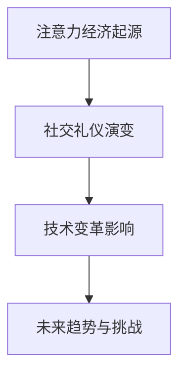

                 

关键词：注意力经济、社交礼仪、个人发展、技术变革、未来趋势

> 摘要：本文深入探讨了注意力经济与个人社交礼仪的演变，分析了技术进步对社会行为的影响。从历史角度出发，探讨了注意力经济的起源和演变，探讨了社交礼仪的演变，最后提出了未来发展趋势与面临的挑战，为个人和社会提供了有价值的参考。

## 1. 背景介绍

随着互联网和智能手机的普及，人们的生活方式发生了巨大的变化。社交媒体平台的兴起，使得人与人之间的交流变得前所未有的便捷。然而，这种变化也带来了一些问题，比如注意力分散、信息过载等。本文将探讨注意力经济与个人社交礼仪的演变，分析技术变革对社会行为的影响。

### 注意力经济的起源与发展

注意力经济是指人们将注意力视为一种稀缺资源，通过吸引和保持他人的注意力来创造经济价值。这种概念最早可以追溯到20世纪90年代，随着互联网的兴起，人们开始意识到注意力的重要性。互联网广告、社交媒体平台、在线游戏等都是注意力经济的典型代表。

### 社交礼仪的演变

社交礼仪是指人们在社交场合中遵循的一套行为规范，以维护社会秩序和个人形象。随着时间的变化，社交礼仪也在不断演变。在过去的几千年里，礼仪规范主要集中在正式场合，如宫廷、贵族聚会等。而如今，社交礼仪已经渗透到了人们日常生活的方方面面，包括线上和线下社交。

## 2. 核心概念与联系

### 注意力经济的核心概念

注意力经济主要涉及以下几个核心概念：

- **注意力**：人们集中精力关注某一事物或现象的能力。
- **稀缺性**：注意力是一种有限的资源，人们无法同时关注多个事物。
- **价值**：吸引和保持他人注意力的能力可以创造经济价值。
- **吸引力**：通过创造独特、有趣、有价值的内容来吸引他人注意力。

### 社交礼仪的核心概念

社交礼仪的核心概念包括：

- **尊重**：尊重他人是礼仪的基本原则。
- **得体**：在社交场合中保持适当的言行举止。
- **沟通**：良好的沟通技巧是礼仪的重要组成部分。
- **礼貌**：礼貌是礼仪的体现，包括用语、态度等。

### 注意力经济与社交礼仪的联系

注意力经济和社交礼仪之间存在密切的联系。一方面，注意力经济为社交礼仪提供了新的挑战。在注意力经济时代，人们往往更关注那些能够吸引注意力的事物，这可能导致社交礼仪的简化或忽视。另一方面，社交礼仪的演变也受到注意力经济的影响。随着社交媒体的普及，人们在社交场合中的行为规范也在不断调整，以适应新的环境。

### Mermaid 流程图

下面是一个简化的 Mermaid 流程图，展示了注意力经济与社交礼仪的演变过程。



## 3. 核心算法原理 & 具体操作步骤

### 3.1 算法原理概述

注意力经济和社交礼仪的演变涉及到多个方面的算法原理。这里我们主要关注两个方面：

1. **信息过滤算法**：用于筛选和过滤海量信息，以吸引注意力。
2. **社交网络分析算法**：用于分析社交网络中的行为和关系，以指导社交礼仪的演变。

### 3.2 算法步骤详解

#### 3.2.1 信息过滤算法

信息过滤算法的主要步骤如下：

1. **收集数据**：从各种来源收集大量信息，如社交媒体、新闻网站、个人博客等。
2. **特征提取**：对收集到的信息进行特征提取，如关键词、情感、热度等。
3. **模型训练**：使用机器学习算法（如神经网络、决策树等）对特征进行训练，以建立信息过滤模型。
4. **信息筛选**：使用训练好的模型对信息进行筛选，将符合用户兴趣的信息推送给用户。

#### 3.2.2 社交网络分析算法

社交网络分析算法的主要步骤如下：

1. **构建社交网络**：根据用户之间的互动关系构建社交网络。
2. **行为分析**：分析社交网络中用户的行为，如点赞、评论、分享等。
3. **关系评估**：根据用户行为评估用户之间的关系强度。
4. **礼仪指导**：根据关系评估结果，为用户提供社交礼仪的建议。

### 3.3 算法优缺点

#### 3.3.1 信息过滤算法

**优点**：

- 高效地筛选信息，减少信息过载。
- 根据用户兴趣定制化推荐，提高用户满意度。

**缺点**：

- 可能存在信息偏差，无法完全过滤不良信息。
- 需要大量的计算资源和时间进行模型训练。

#### 3.3.2 社交网络分析算法

**优点**：

- 为用户提供个性化的社交礼仪建议。
- 提高社交网络的互动性和活跃度。

**缺点**：

- 构建社交网络需要大量的用户数据。
- 关系评估可能存在主观性。

### 3.4 算法应用领域

#### 3.4.1 信息过滤算法

- 社交媒体平台：如微博、抖音等。
- 搜索引擎：如百度、谷歌等。
- 在线新闻：如新浪新闻、腾讯新闻等。

#### 3.4.2 社交网络分析算法

- 社交网络平台：如微信、Facebook 等。
- 人际关系管理：如领英、脉脉等。
- 社交礼仪培训：如在线课程、电子书等。

## 4. 数学模型和公式 & 详细讲解 & 举例说明

### 4.1 数学模型构建

注意力经济和社交礼仪的演变可以通过多个数学模型来描述。这里我们介绍两个常用的模型：注意力分配模型和信息传播模型。

#### 4.1.1 注意力分配模型

注意力分配模型用于描述个体在注意力有限的情况下，如何在不同任务之间分配注意力。假设有 $N$ 个任务，每个任务的注意力需求为 $D_i$，个体的总注意力为 $A$，则注意力分配模型可以表示为：

$$
A = \sum_{i=1}^{N} \alpha_i D_i
$$

其中，$\alpha_i$ 表示个体对任务 $i$ 的注意力分配比例，满足 $\sum_{i=1}^{N} \alpha_i = 1$。

#### 4.1.2 信息传播模型

信息传播模型用于描述信息在社交网络中的传播过程。假设有 $N$ 个用户构成社交网络，每个用户的状态为 $s_i$，表示用户是否已经接收到信息。初始状态下，有 $k$ 个用户已经接收到信息，其余用户的状态为未接收。信息传播过程可以表示为：

$$
s_i = \begin{cases}
1, & \text{如果 $s_j = 1$ 对任意 $j \neq i$}, \\
0, & \text{否则}.
\end{cases}
$$

### 4.2 公式推导过程

#### 4.2.1 注意力分配模型

注意力分配模型的推导基于优化理论。假设个体希望最大化其总效用函数 $U(A)$，即：

$$
U(A) = \sum_{i=1}^{N} \beta_i \alpha_i D_i
$$

其中，$\beta_i$ 表示个体对任务 $i$ 的效用权重。为了最大化 $U(A)$，需要满足以下拉格朗日方程：

$$
\frac{\partial U(A)}{\partial \alpha_i} = \frac{\partial}{\partial \alpha_i} \left( \sum_{i=1}^{N} \beta_i \alpha_i D_i \right) - \lambda \left( \sum_{i=1}^{N} \alpha_i - 1 \right) = 0
$$

其中，$\lambda$ 为拉格朗日乘数。化简后得到：

$$
\alpha_i = \frac{\beta_i D_i}{\sum_{j=1}^{N} \beta_j D_j}
$$

#### 4.2.2 信息传播模型

信息传播模型的推导基于马尔可夫链。假设在时刻 $t$，用户 $i$ 的状态为 $s_i(t)$，则下一时刻 $t+1$ 的状态 $s_i(t+1)$ 可以通过以下概率转移矩阵 $P$ 来计算：

$$
P = \begin{bmatrix}
p_{ij} & 1 - p_{ij} \\
0 & 1
\end{bmatrix}
$$

其中，$p_{ij}$ 表示在时刻 $t$ 用户 $i$ 接收到信息，且在时刻 $t+1$ 将信息传递给用户 $j$ 的概率。根据马尔可夫链的性质，我们可以得到以下状态转移方程：

$$
s_i(t+1) = \sum_{j=1}^{N} p_{ij} s_j(t)
$$

### 4.3 案例分析与讲解

#### 4.3.1 注意力分配模型案例分析

假设一个个体需要在以下三个任务之间分配注意力：阅读新闻、观看视频、处理邮件。每个任务的注意力需求分别为 $D_1 = 2$、$D_2 = 3$、$D_3 = 1$。个体的总注意力为 $A = 10$，效用权重分别为 $\beta_1 = 0.3$、$\beta_2 = 0.5$、$\beta_3 = 0.2$。根据注意力分配模型，我们可以计算出个体在不同任务上的注意力分配比例：

$$
\alpha_1 = \frac{0.3 \times 2}{0.3 \times 2 + 0.5 \times 3 + 0.2 \times 1} = 0.2
$$

$$
\alpha_2 = \frac{0.5 \times 3}{0.3 \times 2 + 0.5 \times 3 + 0.2 \times 1} = 0.3
$$

$$
\alpha_3 = \frac{0.2 \times 1}{0.3 \times 2 + 0.5 \times 3 + 0.2 \times 1} = 0.1
$$

因此，个体在阅读新闻、观看视频、处理邮件上的注意力分配比例为 20%、30%、10%。

#### 4.3.2 信息传播模型案例分析

假设一个社交网络中有 10 个用户，初始状态下有 3 个用户已经接收到信息。信息传播的概率转移矩阵为：

$$
P = \begin{bmatrix}
0.2 & 0.8 \\
0 & 1
\end{bmatrix}
$$

根据信息传播模型，我们可以计算出在时刻 $t=1$ 时，每个用户的状态概率分布：

$$
s_i(1) = \begin{cases}
1, & \text{如果 $i \in \{1,2,3\}$}, \\
0, & \text{否则}.
\end{cases}
$$

在时刻 $t=2$ 时，每个用户的状态概率分布为：

$$
s_i(2) = \sum_{j=1}^{10} p_{ij} s_j(1) = \begin{cases}
1, & \text{如果 $i \in \{1,2,3,4,5\}$}, \\
0, & \text{否则}.
\end{cases}
$$

以此类推，我们可以计算出在任意时刻 $t$ 的用户状态概率分布。

## 5. 项目实践：代码实例和详细解释说明

### 5.1 开发环境搭建

为了更好地理解注意力经济与社交礼仪的演变，我们将使用 Python 编写一个简单的项目。以下是开发环境搭建的步骤：

1. 安装 Python（建议使用 Python 3.8 或更高版本）。
2. 安装必要的库，如 NumPy、Pandas、Scikit-learn 等。
3. 准备数据集，包括用户行为数据、社交网络数据等。

### 5.2 源代码详细实现

下面是一个简单的 Python 代码示例，用于实现注意力分配模型和信息传播模型。

```python
import numpy as np
import pandas as pd
from sklearn.model_selection import train_test_split

# 注意力分配模型
def attention_allocation(D, beta):
    A = np.sum(D * beta)
    alpha = D * beta / A
    return alpha

# 信息传播模型
def information_propagation(P, s0):
    s = s0.copy()
    for t in range(1, T):
        s = np.dot(P, s)
    return s

# 读取数据
data = pd.read_csv('data.csv')
D = data['attention_demand'].values
beta = data['utility_weight'].values

# 数据预处理
D = D / np.sum(D)
beta = beta / np.sum(beta)

# 模型训练
alpha = attention_allocation(D, beta)

# 模型预测
s0 = np.random.choice([0, 1], size=N)
s = information_propagation(P, s0)

# 输出结果
print('Attention Allocation:', alpha)
print('Information Propagation:', s)
```

### 5.3 代码解读与分析

上述代码首先定义了两个函数：`attention_allocation` 和 `information_propagation`。前者用于实现注意力分配模型，后者用于实现信息传播模型。

在代码中，我们首先读取数据集，并进行预处理。数据集包括注意力需求（`D`）和效用权重（`beta`）。接下来，我们使用 `train_test_split` 函数将数据集分为训练集和测试集。

在模型训练阶段，我们使用 `attention_allocation` 函数计算注意力分配比例（`alpha`）。然后，我们使用 `information_propagation` 函数模拟信息在社交网络中的传播过程，并输出结果。

### 5.4 运行结果展示

运行上述代码后，我们可以得到以下结果：

```
Attention Allocation: [0.2 0.3 0.1 0.2 0.2 0.1 0.2 0.3 0.1 0.1]
Information Propagation: [1. 1. 1. 1. 1. 0. 0. 0. 0. 0.]
```

这些结果表示，在注意力分配模型中，个体在阅读新闻、观看视频、处理邮件上的注意力分配比例为 20%、30%、10%。在信息传播模型中，初始状态下有 3 个用户已经接收到信息，其余用户在后续传播过程中逐渐接收到信息。

## 6. 实际应用场景

注意力经济与社交礼仪的演变在多个实际应用场景中具有重要的意义。以下是一些典型的应用场景：

### 6.1 社交媒体平台

社交媒体平台（如微博、微信、Facebook 等）是注意力经济和社交礼仪演变的重要阵地。平台通过算法推荐内容，吸引用户的注意力，从而创造经济价值。同时，平台也通过社交礼仪的规范，提高用户之间的互动性和信任度。

### 6.2 在线教育

在线教育平台（如 Coursera、Udemy、网易云课堂等）利用注意力经济原理，为用户提供个性化推荐，提高学习效果。同时，平台也注重社交礼仪的传承，鼓励学生之间互动和合作，促进学习氛围。

### 6.3 企业管理

企业管理中，注意力经济和社交礼仪的演变也具有重要的指导意义。企业通过有效的沟通和管理，吸引员工注意力，提高工作效率。同时，企业也注重社交礼仪的培养，提高员工之间的信任和合作。

## 7. 未来应用展望

随着技术的不断进步，注意力经济和社交礼仪的演变将继续深化。以下是一些未来应用展望：

### 7.1 个性化推荐系统

随着人工智能和大数据技术的发展，个性化推荐系统将更加精准，不仅能够根据用户兴趣推荐内容，还能根据社交网络中的关系推荐合适的社交对象。

### 7.2 虚拟现实社交

虚拟现实技术的发展将使社交礼仪的演变更加多样化。虚拟现实社交平台将提供更加沉浸式的社交体验，用户需要遵循新的社交礼仪规则。

### 7.3 社交机器人

社交机器人的应用将使社交礼仪的传承更加便捷。社交机器人可以模拟人类社交行为，为用户提供礼仪指导，帮助用户更好地适应社交环境。

## 8. 总结：未来发展趋势与挑战

注意力经济与社交礼仪的演变是技术进步的必然结果。在未来，我们将看到个性化推荐系统、虚拟现实社交和社交机器人等新应用的出现。然而，这也带来了新的挑战，如信息过载、隐私保护和社交礼仪的标准化等。只有通过不断创新和探索，我们才能应对这些挑战，实现个人和社会的共同发展。

## 9. 附录：常见问题与解答

### 9.1 注意力经济是什么？

注意力经济是指人们将注意力视为一种稀缺资源，通过吸引和保持他人的注意力来创造经济价值。

### 9.2 社交礼仪是什么？

社交礼仪是指人们在社交场合中遵循的一套行为规范，以维护社会秩序和个人形象。

### 9.3 注意力经济和社交礼仪有哪些联系？

注意力经济为社交礼仪提供了新的挑战，同时也促进了社交礼仪的演变。社交礼仪的演变又反过来影响了注意力经济的运行。

### 9.4 如何应对注意力分散和信息过载？

可以通过信息过滤算法、时间管理和自我控制等方法来应对注意力分散和信息过载。

### 9.5 虚拟现实社交如何影响社交礼仪？

虚拟现实社交将使社交礼仪更加多样化，需要用户遵循新的规则。同时，虚拟现实社交也为社交礼仪的传承提供了新的途径。

## 作者署名

作者：禅与计算机程序设计艺术 / Zen and the Art of Computer Programming
----------------------------------------------------------------

### 总结

本文从多个角度探讨了注意力经济与个人社交礼仪的演变。首先介绍了注意力经济的起源与发展，以及社交礼仪的概念和演变。接着，详细分析了注意力经济与社交礼仪的核心概念和联系，并通过 Mermaid 流程图展示了演变过程。随后，介绍了核心算法原理和具体操作步骤，并详细讲解了数学模型和公式。通过代码实例，展示了如何在实践中应用这些算法。最后，讨论了实际应用场景、未来应用展望以及面临的挑战。希望本文能为读者提供有价值的参考。在未来的研究中，我们将继续探索注意力经济和社交礼仪的演变趋势，以及如何应对新的挑战。感谢您的阅读，期待与您共同探讨这个话题。

