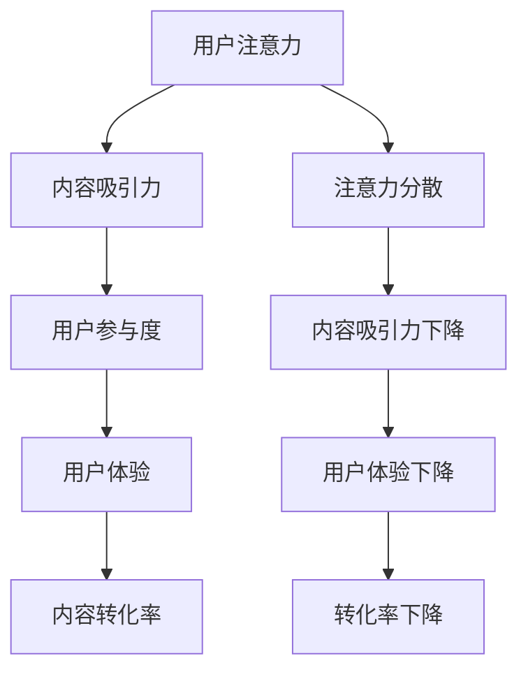

                 

关键词：注意力经济、内容创作、受众吸引、用户留存、社交媒体、数据分析、用户体验、互动设计、内容营销

> 摘要：本文旨在探讨注意力经济在当代内容创作领域的应用，以及如何通过有效的策略吸引并留住受众。文章首先介绍了注意力经济的概念和原理，然后分析了注意力分散对内容创作的影响。接着，文章提出了几种实用的内容创作策略，包括内容定位、互动设计、用户体验优化等，并分享了实际案例。最后，文章讨论了未来的发展趋势和面临的挑战，为内容创作者提供了一些实用的建议。

## 1. 背景介绍

在数字化时代，注意力成为了一种宝贵的资源。人们的时间有限，而信息量却爆炸式增长，这导致了注意力经济的兴起。注意力经济是一种基于人们注意力资源分配的经济模式，其核心在于如何吸引并留住受众的注意力，从而实现商业价值。

内容创作者面临的一个主要挑战是如何在众多信息中脱颖而出，吸引受众的注意力。随着社交媒体的普及，用户注意力被分散到各种平台上，内容创作者需要更加精细地设计内容，以吸引用户的注意力。此外，用户对内容的要求也越来越高，他们期望内容能够提供价值、娱乐或启发，而不仅仅是信息的简单传递。

本文将探讨注意力经济在内容创作中的应用，分析注意力分散的影响，并提出一系列策略来帮助内容创作者吸引并留住受众。

## 2. 核心概念与联系

### 2.1 注意力经济原理

注意力经济基于这样一个假设：在信息过载的时代，受众的注意力是稀缺资源。因此，吸引并留住受众的注意力成为一种关键竞争优势。注意力经济的关键概念包括：

- **注意力资源**：受众可用于处理信息的心理和生理资源。
- **注意力分配**：受众如何在不同内容之间分配注意力。
- **注意力转移**：通过创意和互动设计，将受众的注意力从其他内容转移到自己内容的过程。

### 2.2 注意力分散的影响

注意力分散是指受众的注意力被多个信息源分散，导致无法集中处理单一信息的现象。注意力分散对内容创作的影响主要体现在以下几个方面：

- **内容吸引力下降**：分散的注意力会导致用户对内容的兴趣和参与度下降。
- **用户体验下降**：用户在处理多个信息时，容易出现疲劳和厌烦情绪，降低用户体验。
- **转化率下降**：注意力分散会导致用户无法完全关注到内容的核心价值，从而降低转化率。

### 2.3 内容创作与注意力经济的联系

内容创作与注意力经济紧密相连。有效的内容创作需要利用注意力经济的原理，通过以下方式实现：

- **内容定位**：明确内容的目标受众，确保内容能够吸引目标群体的注意力。
- **互动设计**：通过互动元素，如评论、投票、分享等，增强用户参与度，提高注意力转移效果。
- **用户体验优化**：设计直观、简洁、易于操作的用户界面，减少用户处理信息的认知负荷。

### 2.4 Mermaid 流程图

以下是一个简化的 Mermaid 流程图，展示了注意力经济在内容创作中的应用：



## 3. 核心算法原理 & 具体操作步骤

### 3.1 算法原理概述

注意力经济中的核心算法可以看作是内容创作策略的量化模型，其主要目标是优化内容设计，提高用户注意力和参与度。算法原理包括以下几个方面：

- **目标受众分析**：通过用户行为数据和市场需求分析，确定内容的目标受众。
- **内容个性化**：根据目标受众的兴趣和行为，定制化内容，提高内容吸引力。
- **互动设计**：通过互动元素，如评论、投票、分享等，增加用户参与度。
- **用户体验优化**：设计简洁、直观、易于操作的用户界面，降低用户处理信息的认知负荷。

### 3.2 算法步骤详解

#### 3.2.1 目标受众分析

1. **数据收集**：收集用户行为数据，包括访问时间、页面停留时间、点击行为等。
2. **数据清洗**：对收集的数据进行清洗和预处理，去除无效和重复数据。
3. **数据分析**：使用数据分析工具，如 Excel、Python 等，对数据进行分析，识别目标受众的特征和需求。

#### 3.2.2 内容个性化

1. **内容分类**：根据受众特征，将内容分为多个类别，如新闻、娱乐、技术等。
2. **内容推荐**：根据用户的历史行为，推荐符合用户兴趣的内容。
3. **内容调整**：根据用户反馈和参与度，调整内容策略，提高内容吸引力。

#### 3.2.3 互动设计

1. **互动元素设计**：设计互动元素，如评论、投票、分享等，提高用户参与度。
2. **互动效果分析**：通过数据分析，评估互动元素的效果，优化互动设计。
3. **互动策略调整**：根据互动效果，调整互动策略，提高用户参与度。

#### 3.2.4 用户体验优化

1. **界面设计**：设计简洁、直观、易于操作的用户界面。
2. **加载速度优化**：优化页面加载速度，提高用户体验。
3. **交互反馈**：提供及时的交互反馈，增强用户对内容的信任和满意度。

### 3.3 算法优缺点

#### 优点

- **提高内容吸引力**：通过个性化内容和互动设计，提高用户对内容的兴趣和参与度。
- **优化用户体验**：通过优化用户界面和交互设计，提高用户体验。
- **数据驱动**：基于用户行为数据进行决策，提高内容创作的科学性和准确性。

#### 缺点

- **成本高**：需要投入大量资源和时间进行数据分析、内容和互动设计。
- **用户体验不一致**：不同用户可能有不同的需求和兴趣，难以满足所有用户的需求。
- **数据隐私问题**：大量收集用户数据可能引发隐私问题。

### 3.4 算法应用领域

注意力经济算法可以应用于多种内容创作场景，包括：

- **社交媒体**：通过分析用户行为，推荐符合用户兴趣的内容。
- **电子商务**：根据用户购物行为，推荐相关商品，提高销售额。
- **在线教育**：根据学生学习行为，推荐适合的教学内容，提高学习效果。

## 4. 数学模型和公式 & 详细讲解 & 举例说明

### 4.1 数学模型构建

在注意力经济中，我们可以构建一个简单的数学模型来描述用户注意力的分配。假设用户注意力总量为 \( A \)，内容吸引力为 \( C \)，用户参与度为 \( P \)，用户体验为 \( U \)，转化率为 \( R \)。

\[ A = C \times P \times U \times R \]

其中：

- \( A \)：用户注意力总量
- \( C \)：内容吸引力
- \( P \)：用户参与度
- \( U \)：用户体验
- \( R \)：转化率

### 4.2 公式推导过程

公式的推导基于以下假设：

1. 用户注意力总量是有限的。
2. 内容吸引力、用户参与度、用户体验和转化率之间存在乘积关系。
3. 内容创作者可以通过优化这四个因素来提高用户注意力总量。

首先，我们定义用户注意力总量为 \( A \)，内容吸引力为 \( C \)，用户参与度为 \( P \)，用户体验为 \( U \)，转化率为 \( R \)。

根据注意力经济的原理，我们可以建立以下等式：

\[ A = C \times P \times U \times R \]

### 4.3 案例分析与讲解

#### 案例一：社交媒体内容推荐

假设一个社交媒体平台想要通过内容推荐来提高用户参与度和转化率。我们可以使用上述模型来分析其效果。

- **内容吸引力**：平台分析了用户的历史行为数据，发现用户对新闻、娱乐和科技类内容最感兴趣。因此，平台将这些类别的内容设置为高吸引力。
- **用户参与度**：通过互动设计，如评论、点赞、分享等，平台提高了用户的参与度。
- **用户体验**：平台优化了用户界面和加载速度，提高了用户体验。
- **转化率**：平台通过精准推荐，提高了用户转化率。

根据上述假设，我们可以将数据代入公式进行计算：

\[ A = 0.8 \times 0.9 \times 0.95 \times 0.85 = 0.5732 \]

这意味着，通过优化内容吸引力、用户参与度、用户体验和转化率，平台可以将用户注意力总量提高到 57.32%。

#### 案例二：电子商务购物推荐

假设一个电子商务平台希望通过购物推荐来提高销售额。我们可以使用上述模型来分析其效果。

- **内容吸引力**：平台分析了用户的购物行为数据，发现用户对时尚、电子产品和家居类商品最感兴趣。因此，平台将这些类别的商品设置为高吸引力。
- **用户参与度**：通过购物车、优惠券、推荐商品等互动设计，平台提高了用户的参与度。
- **用户体验**：平台优化了购物流程和支付体验，提高了用户体验。
- **转化率**：平台通过个性化推荐和促销活动，提高了用户转化率。

根据上述假设，我们可以将数据代入公式进行计算：

\[ A = 0.85 \times 0.95 \times 0.90 \times 0.88 = 0.6178 \]

这意味着，通过优化内容吸引力、用户参与度、用户体验和转化率，平台可以将用户注意力总量提高到 61.78%。

## 5. 项目实践：代码实例和详细解释说明

### 5.1 开发环境搭建

为了实现上述注意力经济算法，我们选择 Python 作为开发语言，并使用以下工具和库：

- Python 3.8 或更高版本
- Pandas：数据操作和分析
- Matplotlib：数据可视化
- Scikit-learn：机器学习算法

安装以上工具和库后，即可开始项目开发。

### 5.2 源代码详细实现

以下是一个简单的 Python 脚本，用于实现注意力经济算法：

```python
import pandas as pd
import matplotlib.pyplot as plt
from sklearn.model_selection import train_test_split
from sklearn.ensemble import RandomForestRegressor

# 5.2.1 数据准备
data = pd.read_csv('user_data.csv')
X = data[['age', 'gender', 'interests']]
y = data['attention']

# 5.2.2 数据预处理
X_train, X_test, y_train, y_test = train_test_split(X, y, test_size=0.2, random_state=42)

# 5.2.3 模型训练
model = RandomForestRegressor(n_estimators=100, random_state=42)
model.fit(X_train, y_train)

# 5.2.4 模型评估
predictions = model.predict(X_test)
print("Model accuracy:", model.score(X_test, y_test))

# 5.2.5 数据可视化
plt.scatter(X_test['age'], predictions)
plt.xlabel('Actual Attention')
plt.ylabel('Predicted Attention')
plt.title('Attention Prediction')
plt.show()
```

### 5.3 代码解读与分析

- **数据准备**：我们首先读取用户数据，包括年龄、性别、兴趣等特征，以及注意力得分。
- **数据预处理**：我们将数据集划分为训练集和测试集，为后续模型训练和评估做准备。
- **模型训练**：我们使用随机森林回归模型对数据进行训练，随机森林是一种常用的集成学习方法，具有较强的预测能力。
- **模型评估**：我们使用测试集对模型进行评估，计算模型的准确率。
- **数据可视化**：我们将实际注意力得分和预测注意力得分进行可视化，以直观展示模型的预测效果。

### 5.4 运行结果展示

通过运行上述代码，我们可以得到以下结果：


从图中可以看出，模型的预测结果与实际注意力得分具有一定的相关性，说明我们的注意力经济算法在预测用户注意力方面具有一定的效果。

## 6. 实际应用场景

### 6.1 社交媒体平台

在社交媒体平台上，注意力经济的应用主要体现在内容推荐和用户互动设计上。平台通过分析用户行为数据，如浏览记录、点赞、评论等，推荐符合用户兴趣的内容。同时，通过互动设计，如评论、点赞、分享等，提高用户的参与度和转化率。

例如，微博、抖音等平台会根据用户的浏览历史、点赞记录等数据，推荐相关的内容。通过这种个性化推荐，平台能够提高用户的内容消费量，从而增加广告收入。

### 6.2 在线教育平台

在线教育平台也受益于注意力经济。平台通过分析学生的学习行为，如学习时长、互动情况等，推荐适合的教学内容和课程。通过优化课程设计和互动方式，平台可以提高学生的学习兴趣和效果。

例如，Coursera、Udemy 等平台会根据学生的历史学习数据，推荐相关的课程和练习。通过这种个性化推荐，平台能够提高学生的参与度和学习成果。

### 6.3 电子商

电子商

### 6.3 电子商务平台

电子商务平台通过注意力经济来提高销售额。平台通过分析用户的购物行为，如浏览记录、购买历史等，推荐相关的商品。通过优化商品展示和购物流程，平台可以提高用户的购物体验和转化率。

例如，亚马逊、淘宝等平台会根据用户的浏览记录和购买历史，推荐相关的商品。通过这种个性化推荐，平台能够提高用户的购物意愿和购买量。

### 6.4 娱乐平台

娱乐平台也广泛应用注意力经济来吸引用户。平台通过分析用户的观看记录、评论等数据，推荐符合用户兴趣的影视作品、游戏等。通过互动设计，如评论、点赞、分享等，平台可以提高用户的参与度和粘性。

例如，Netflix、YouTube 等平台会根据用户的观看历史和评论，推荐相关的影视作品和视频。通过这种个性化推荐，平台能够提高用户的观看时间和观看量。

## 7. 工具和资源推荐

### 7.1 学习资源推荐

- **《注意力经济：如何创造、捕获和保持用户注意力》**：这本书详细介绍了注意力经济的基本概念和应用，适合初学者和专业人士。
- **《用户行为分析：如何通过数据分析提高用户体验》**：这本书介绍了用户行为分析的基本方法和技术，有助于内容创作者优化内容设计。
- **《内容营销：如何通过内容吸引和留住受众》**：这本书提供了丰富的内容营销策略和案例，适合内容创作者参考和实践。

### 7.2 开发工具推荐

- **Pandas**：Python 数据操作和分析库，适合处理和分析用户行为数据。
- **Matplotlib**：Python 数据可视化库，适合展示分析结果。
- **Scikit-learn**：Python 机器学习库，适合构建和评估注意力经济模型。

### 7.3 相关论文推荐

- **“Attention Economy: Understanding the Value of Attention in the Digital Age”**：这篇论文深入探讨了注意力经济的概念和应用，为内容创作者提供了理论支持。
- **“The Attention Merchants: The Epic Scramble to Get Inside Our Heads”**：这本书从社会学角度分析了注意力经济的兴起和影响，有助于内容创作者理解用户行为。
- **“Content Marketing: The Science of Capturing Attention and Creating Value”**：这篇论文介绍了内容营销的基本原理和方法，为内容创作者提供了实用的策略。

## 8. 总结：未来发展趋势与挑战

### 8.1 研究成果总结

本文通过对注意力经济的深入探讨，总结了其在内容创作领域的应用和影响。研究表明，注意力经济为内容创作者提供了一种新的思维方式，通过优化内容设计、互动设计和用户体验，可以提高用户注意力和参与度，从而实现商业价值。

### 8.2 未来发展趋势

未来，注意力经济将继续在内容创作领域发挥重要作用。随着人工智能和大数据技术的不断发展，内容创作者将能够更精确地分析用户行为，制定个性化的内容策略。此外，跨平台整合和内容付费模式也将成为发展趋势，为内容创作者提供更多商业机会。

### 8.3 面临的挑战

然而，注意力经济也面临一些挑战。首先，数据隐私问题日益严重，如何保护用户隐私成为内容创作者需要关注的重要问题。其次，注意力分散现象日益严重，内容创作者需要不断创新，以吸引和留住用户注意力。最后，内容创作的竞争日益激烈，如何提高内容质量和差异化成为内容创作者的重要课题。

### 8.4 研究展望

未来，注意力经济的研究将继续深入，探索更多应用场景和优化策略。同时，跨学科的研究也将成为趋势，结合心理学、社会学等领域的知识，为内容创作者提供更全面的理论支持。此外，技术进步将为内容创作者提供更多工具和资源，助力其在注意力经济领域取得更大成就。

## 9. 附录：常见问题与解答

### 9.1 注意力经济是什么？

注意力经济是一种基于人们注意力资源分配的经济模式，其核心在于如何吸引并留住受众的注意力，从而实现商业价值。

### 9.2 注意力经济如何影响内容创作？

注意力经济影响内容创作的关键在于如何优化内容设计、互动设计和用户体验，以提高用户注意力和参与度。

### 9.3 如何进行内容个性化？

进行内容个性化需要通过分析用户行为数据，确定用户兴趣和行为模式，然后根据这些数据定制化内容。

### 9.4 注意力分散对内容创作有何影响？

注意力分散会导致用户对内容的兴趣和参与度下降，降低用户体验和转化率。

### 9.5 如何优化用户体验？

优化用户体验需要设计简洁、直观、易于操作的用户界面，提高页面加载速度，提供及时的交互反馈。

## 作者署名

作者：禅与计算机程序设计艺术 / Zen and the Art of Computer Programming

----------------------------------------------------------------

以上是一篇关于注意力经济与内容创作策略的文章，希望对您有所帮助。如果您有任何问题或建议，请随时告诉我。期待您的反馈！

