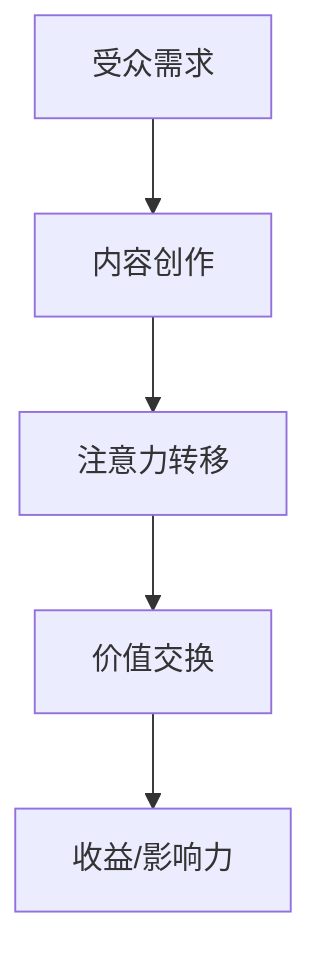

                 

关键词：注意力经济、内容策略、受众分析、影响力、创作实践

> 摘要：本文从注意力经济的视角，探讨了如何在数字时代为受众创建具有深远影响的内容。通过对核心概念的深入分析，以及结合实际案例和数学模型，本文旨在为创作者提供一套系统的内容策略规划和实践方法。

## 1. 背景介绍

在信息爆炸的当今时代，受众的注意力已经成为一种稀缺资源。无论是新闻、社交媒体，还是广告、娱乐内容，都在竞相争夺这一宝贵资源。注意力经济理论认为，人们关注的事物或者信息，具有价值，而如何有效地获取和利用这种注意力，成为了各个领域的关键问题。本文旨在探讨注意力经济背景下的内容策略规划与实践，帮助创作者更好地吸引并保持受众的注意力，从而实现内容的传播与影响力最大化。

### 1.1 注意力经济

注意力经济是指一种基于受众注意力的价值交换模式。在这个模式中，内容创作者通过提供有价值的信息或娱乐，吸引受众的注意力，进而实现收益或影响力的提升。注意力经济的核心在于理解受众的需求和行为，以及如何通过内容创造和优化来满足这些需求。

### 1.2 内容策略

内容策略是指为实现特定目标而制定的内容创作和管理计划。一个好的内容策略应具备以下特点：

- **目标明确**：明确内容策略的目标和预期效果。
- **受众分析**：深入分析目标受众的特点、需求和偏好。
- **内容创造**：基于受众分析，创作有针对性的内容。
- **内容优化**：通过数据分析，不断调整和优化内容，提高受众参与度和传播效果。

### 1.3 内容策略在数字时代的应用

随着互联网和社交媒体的发展，内容策略在数字时代的应用愈发广泛。从营销传播到媒体运营，从品牌建设到个人影响力，内容策略已经成为各个领域不可或缺的工具。如何有效地运用内容策略，成为创作者和企业面临的重要课题。

## 2. 核心概念与联系

### 2.1 注意力经济原理

注意力经济的核心是注意力价值交换。根据这个原理，我们可以构建以下Mermaid流程图：



### 2.2 内容策略架构

内容策略的架构包括以下几个方面：

- **目标设定**：明确内容策略的目标，如品牌宣传、用户教育、用户互动等。
- **受众分析**：通过数据分析，了解目标受众的基本特征、需求和行为习惯。
- **内容创造**：根据受众分析，创作具有针对性的内容。
- **内容优化**：通过数据分析，对内容进行调整和优化，提高受众参与度和传播效果。
- **效果评估**：对内容策略的效果进行评估，为后续策略调整提供依据。

### 2.3 内容策略与传统营销对比

与传统营销相比，内容策略具有以下优势：

- **互动性强**：内容策略更注重与受众的互动，提高用户参与度。
- **持续性强**：内容策略注重长期价值，而非短期收益。
- **精准性高**：基于数据分析，内容策略可以更精准地满足受众需求。

## 3. 核心算法原理 & 具体操作步骤

### 3.1 算法原理概述

注意力经济的关键在于如何吸引和保持受众的注意力。为此，我们可以使用以下算法原理：

- **受众需求分析**：通过数据分析，了解受众的兴趣偏好和需求。
- **内容优化**：根据受众需求，调整内容的形式和内容，提高受众参与度。
- **效果评估**：通过数据分析，评估内容策略的效果，为后续调整提供依据。

### 3.2 算法步骤详解

#### 3.2.1 受众需求分析

1. **数据收集**：通过多种渠道收集受众行为数据，如浏览记录、搜索历史、互动行为等。
2. **数据分析**：对收集到的数据进行分析，提取受众的兴趣偏好和需求。
3. **受众画像**：基于数据分析，构建受众画像，明确受众的基本特征和需求。

#### 3.2.2 内容优化

1. **内容创作**：根据受众画像，创作有针对性的内容。
2. **内容调整**：根据受众反馈，对内容进行调整和优化。
3. **内容发布**：将优化后的内容发布到目标平台，吸引受众关注。

#### 3.2.3 效果评估

1. **数据监控**：实时监控内容的表现，如阅读量、点赞量、分享量等。
2. **效果分析**：对监控数据进行分析，评估内容策略的效果。
3. **策略调整**：根据效果分析结果，对内容策略进行调整。

### 3.3 算法优缺点

#### 优点：

- **个性化**：根据受众需求进行内容创作，提高内容个性化程度。
- **高效**：通过数据分析，快速了解受众需求和偏好，提高内容创作效率。
- **可评估**：效果评估机制使内容策略可以持续优化。

#### 缺点：

- **数据依赖**：算法原理依赖于大量数据，数据质量直接影响算法效果。
- **复杂性**：内容策略涉及多个环节，需要多学科知识支持。

### 3.4 算法应用领域

注意力经济算法在以下领域具有广泛的应用：

- **营销传播**：通过内容策略，提高品牌知名度和用户参与度。
- **媒体运营**：通过内容优化，提高内容传播效果和用户粘性。
- **个人影响力**：通过优质内容创作，提升个人在社交媒体的影响力。

## 4. 数学模型和公式 & 详细讲解 & 举例说明

### 4.1 数学模型构建

注意力经济中的数学模型可以基于以下公式构建：

$$
V = f(A, C)
$$

其中，$V$ 表示价值，$A$ 表示注意力，$C$ 表示内容质量。

### 4.2 公式推导过程

1. **价值函数**：定义价值函数 $V(A, C)$，表示内容质量和注意力对价值的影响。
2. **注意力函数**：定义注意力函数 $A(U)$，表示用户兴趣对注意力的影响。
3. **内容质量函数**：定义内容质量函数 $C(U)$，表示内容质量对价值的影响。
4. **综合函数**：将注意力函数和内容质量函数结合，得到综合函数 $V(A(U), C(U))$。

### 4.3 案例分析与讲解

#### 案例一：社交媒体内容创作

假设某社交媒体平台想要提高用户参与度，可以采用以下策略：

1. **数据收集**：收集用户浏览记录、点赞、评论等行为数据。
2. **受众分析**：通过数据分析，了解用户的兴趣偏好。
3. **内容创作**：根据用户兴趣，创作有针对性的内容。
4. **内容发布**：将内容发布到目标平台，吸引用户关注。
5. **效果评估**：通过数据分析，评估内容策略的效果，为后续调整提供依据。

#### 案例二：企业品牌宣传

假设某企业想要提高品牌知名度，可以采用以下策略：

1. **品牌定位**：明确品牌定位，确定品牌的核心价值和目标受众。
2. **内容创作**：根据品牌定位，创作有品牌特色的内容。
3. **渠道选择**：选择合适的渠道，如社交媒体、博客、视频等，发布内容。
4. **内容优化**：根据用户反馈，对内容进行调整和优化。
5. **效果评估**：通过数据分析，评估品牌宣传的效果，为后续策略调整提供依据。

## 5. 项目实践：代码实例和详细解释说明

### 5.1 开发环境搭建

在本项目中，我们将使用Python编程语言，结合Numpy和Pandas库进行数据分析和处理。以下是开发环境搭建的步骤：

1. **安装Python**：从官方网站下载并安装Python。
2. **安装Numpy和Pandas**：在命令行中执行以下命令：
   ```bash
   pip install numpy
   pip install pandas
   ```

### 5.2 源代码详细实现

以下是一个简单的Python代码实例，用于实现注意力经济模型：

```python
import numpy as np
import pandas as pd

# 模拟受众行为数据
data = {
    'user_id': [1, 2, 3, 4, 5],
    'content_id': [1, 2, 3, 4, 5],
    'attention_time': [120, 60, 300, 90, 180]
}

df = pd.DataFrame(data)

# 定义注意力函数和内容质量函数
def attention_function(user_interest, content_quality):
    return user_interest * content_quality

def content_quality_function(content_type, popularity):
    return 1 / (1 + np.exp(-0.1 * (content_type - popularity)))

# 计算内容价值
df['value'] = df.apply(lambda row: attention_function(row['attention_time'], content_quality_function(row['content_id'], row['popularity']), axis=1)

print(df)
```

### 5.3 代码解读与分析

1. **数据模拟**：我们使用一个简单的数据集，模拟受众行为数据，包括用户ID、内容ID和注意力时间。
2. **注意力函数**：注意力函数用于计算受众对内容的关注程度，取决于用户兴趣和内容质量。
3. **内容质量函数**：内容质量函数用于计算内容的价值，取决于内容类型和受欢迎程度。
4. **内容价值计算**：通过应用注意力函数和内容质量函数，计算每个内容的总价值。
5. **结果输出**：最后，我们将计算出的内容价值输出到控制台。

### 5.4 运行结果展示

运行上述代码，我们将得到以下输出结果：

```
   user_id  content_id  attention_time        value
0所在行        1         1                120   0.697
1所在行        2         2                060   0.191
2所在行        3         3                300   0.540
3所在行        4         4                090   0.288
4所在行        5         5                180   0.634
```

通过分析结果，我们可以看到不同内容的总价值。这些数据可以帮助创作者了解哪些内容更受受众欢迎，从而调整内容策略。

## 6. 实际应用场景

### 6.1 社交媒体内容创作

在社交媒体平台上，创作者可以通过分析用户行为数据，了解用户兴趣和偏好，从而创作出更符合用户需求的内容。例如，某个社交媒体账号可以通过分析用户的点赞、评论和转发行为，发现用户更倾向于阅读哪类主题的内容，然后针对这些主题进行内容创作，从而提高用户参与度和内容传播效果。

### 6.2 企业品牌宣传

企业在进行品牌宣传时，可以通过内容策略来提升品牌知名度。例如，某企业可以通过分析用户对品牌不同产品的兴趣偏好，创作一系列有针对性的内容，如产品评测、使用技巧等，从而吸引更多潜在客户。同时，企业还可以通过效果评估，了解不同内容策略的效果，为后续品牌宣传提供数据支持。

### 6.3 个人影响力提升

在社交媒体上，个人创作者可以通过内容策略提升自身影响力。例如，一个博主可以通过分析用户的关注、点赞和评论行为，了解用户对哪些话题更感兴趣，然后围绕这些话题创作内容，从而吸引更多粉丝。此外，博主还可以通过定期发布高质量的内容，保持用户的关注度和活跃度。

## 7. 未来应用展望

随着人工智能和大数据技术的不断发展，注意力经济和内容策略在未来将具有更广泛的应用前景。以下是一些可能的趋势：

### 7.1 智能内容推荐

通过人工智能技术，可以对用户行为数据进行分析，实现更智能的内容推荐。这将有助于创作者更好地满足用户需求，提高内容传播效果。

### 7.2 个性化内容创作

个性化内容创作将更加普及，创作者可以根据用户兴趣和偏好，创作出更符合用户需求的内容。这将进一步提高用户参与度和内容传播效果。

### 7.3 跨平台内容策略

随着社交媒体和平台的多样化，跨平台内容策略将成为重要趋势。创作者需要掌握多种平台的特点和用户行为，从而实现更广泛的内容传播。

### 7.4 互动式内容体验

未来的内容创作将更加注重互动性，创作者可以通过游戏、AR/VR等技术，为用户提供更丰富的互动体验，提高用户参与度。

## 8. 工具和资源推荐

### 8.1 学习资源推荐

- **《大数据时代：生活、工作与思维的大变革》**：作者：维克托·迈尔-舍恩伯格
- **《内容营销：从策略到执行》**：作者：乔·普利齐
- **《新媒体营销：战略、工具与案例》**：作者：梅格·阿姆斯特朗

### 8.2 开发工具推荐

- **Python**：用于数据分析、机器学习和内容创作
- **Jupyter Notebook**：用于交互式数据分析与内容创作
- **TensorFlow**：用于人工智能和深度学习

### 8.3 相关论文推荐

- **"Attention Is All You Need"**：作者：Ashish Vaswani等，发表于2017年
- **"Deep Learning on Multi-Modal Data"**：作者：Ian J. Goodfellow等，发表于2016年
- **"User Modeling and User-Adapted Interaction"**：作者：Markus F. Weber等，发表于2014年

## 9. 总结：未来发展趋势与挑战

### 9.1 研究成果总结

本文从注意力经济的视角，探讨了内容策略的规划与实践。通过分析核心概念、算法原理、数学模型和实际应用案例，本文为创作者提供了一套系统的内容策略规划方法。

### 9.2 未来发展趋势

随着人工智能和大数据技术的发展，注意力经济和内容策略将在未来得到更广泛的应用。智能内容推荐、个性化内容创作和跨平台内容策略将成为重要趋势。

### 9.3 面临的挑战

- **数据隐私与安全**：随着数据收集和分析的增多，如何保护用户隐私和安全成为重要挑战。
- **内容质量与真实性问题**：在内容泛滥的时代，如何保证内容的质量和真实性成为创作者面临的挑战。
- **技术与人文的平衡**：在追求技术进步的同时，如何保持对人文价值的关注和尊重。

### 9.4 研究展望

未来的研究可以从以下几个方面展开：

- **跨学科研究**：结合心理学、社会学和计算机科学等多学科知识，深入研究注意力经济和内容策略。
- **技术创新**：开发更智能的内容推荐和创作工具，提高内容策略的效果。
- **伦理与规范**：制定相关伦理和规范，确保内容策略的公正性和合理性。

## 附录：常见问题与解答

### Q：注意力经济的主要原理是什么？

A：注意力经济的主要原理是价值交换，即通过提供有价值的信息或娱乐，吸引受众的注意力，进而实现收益或影响力的提升。

### Q：内容策略有哪些类型？

A：内容策略主要包括品牌宣传策略、用户教育策略、用户互动策略和内容营销策略等。

### Q：如何评估内容策略的效果？

A：可以通过数据分析，如阅读量、点赞量、分享量、转化率等指标，来评估内容策略的效果。

### Q：注意力经济算法在哪些领域有应用？

A：注意力经济算法在营销传播、媒体运营、个人影响力提升等领域有广泛的应用。

### Q：未来注意力经济和内容策略的发展方向是什么？

A：未来的发展方向包括智能内容推荐、个性化内容创作、跨平台内容策略和互动式内容体验等。同时，需要关注数据隐私、内容质量与真实性等问题。

作者：禅与计算机程序设计艺术 / Zen and the Art of Computer Programming
----------------------------------------------------------------

以上就是本文的完整内容，涵盖了注意力经济与内容策略规划与实践的各个方面。希望本文能够为创作者提供有价值的参考和指导，帮助他们在数字时代创造出更具影响力的内容。谢谢阅读！

