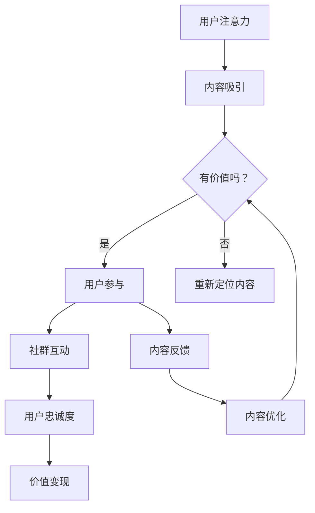

                 

关键词：注意力经济、在线社区、用户参与、用户忠诚度、内容营销

> 摘要：本文深入探讨了注意力经济的基本概念及其在在线社区建设中的应用。通过分析用户参与和忠诚度的关键因素，本文提出了构建吸引力和留存力的在线社区的策略。文章还提供了实用的工具和资源推荐，帮助开发者、运营者和社区经理更好地理解这一领域，为未来的在线社区建设提供参考。

## 1. 背景介绍

在数字化的今天，在线社区已经成为了各类平台的核心组成部分。无论是社交媒体、电商平台还是专业论坛，社区的存在不仅仅是为了提供信息和交流，更是为了创造一种用户参与和忠诚的生态环境。然而，随着信息过载的加剧，获取和保持用户的注意力变得越来越具有挑战性。这便引出了“注意力经济”的概念。

注意力经济，是指个体在获取信息和内容时，愿意投入的时间和精力所产生的经济价值。这种经济模式的核心在于如何吸引并留住用户的注意力，从而实现商业目标。在线社区的建设便是这一理念的具体实践，它不仅要满足用户的需求，更要激发用户的参与热情，使其成为忠实的社区成员。

### 1.1 现状分析

当前，在线社区的形式多样，从简单的论坛到复杂的社交媒体平台，从专业的技术社区到兴趣爱好者论坛，无处不在。然而，不同类型的社区在用户参与和忠诚度方面存在显著差异。一些社区能够迅速吸引大量用户，却难以保持用户的长期参与；而另一些社区虽然用户粘性较高，但增长速度较慢。这种现象背后的原因复杂多样，包括内容质量、用户互动、社区氛围等多个方面。

### 1.2 目的意义

本文旨在探讨如何利用注意力经济理论，指导在线社区的建设与运营，从而吸引并留住忠实的用户。通过深入分析用户参与和忠诚度的关键因素，本文将为社区管理者提供一套切实可行的策略和工具，帮助他们更好地理解和应对当前在线社区面临的挑战。

## 2. 核心概念与联系

### 2.1 注意力经济的核心概念

注意力经济建立在几个核心概念之上：

1. **注意力稀缺**：用户的时间有限，他们的注意力也是有限的资源。
2. **注意力交换**：用户通过关注和参与社区活动，换取有价值的信息和社交互动。
3. **价值变现**：社区通过提供有价值的内容和服务，吸引更多用户参与，从而实现商业价值。

### 2.2 注意力经济与在线社区的关系

注意力经济与在线社区之间存在着紧密的联系。在线社区通过以下方式实现注意力经济的价值：

1. **内容创造**：提供高质量、有价值的内容，吸引用户的注意力。
2. **用户互动**：通过社交互动和社区活动，增加用户参与度，延长用户在社区中的停留时间。
3. **社群价值**：建立紧密的社群关系，提升用户对社区的品牌认知和情感投入。

### 2.3 Mermaid 流程图

下面是一个简化的 Mermaid 流程图，展示了注意力经济在在线社区中的基本流程：



这个流程图概述了从用户注意力到价值变现的整个过程，其中每个节点都代表了注意力经济中的一个关键环节。

## 3. 核心算法原理 & 具体操作步骤

### 3.1 算法原理概述

在线社区的建设和运营，本质上是一个动态优化过程。核心算法可以概述为以下几个方面：

1. **内容推荐算法**：基于用户行为和偏好，推荐个性化内容，提高内容吸引力。
2. **社区互动算法**：通过分析用户互动数据，优化社区氛围，提高用户参与度。
3. **用户忠诚度算法**：根据用户行为和社区参与度，评估用户忠诚度，并提供相应的激励措施。

### 3.2 算法步骤详解

#### 3.2.1 内容推荐算法

1. **数据收集**：收集用户行为数据，如浏览记录、搜索关键词、点赞评论等。
2. **特征提取**：将用户行为数据转换为特征向量，用于模型训练。
3. **模型训练**：使用机器学习算法，如协同过滤或深度学习，训练推荐模型。
4. **内容推荐**：根据用户特征和模型预测，推荐个性化内容。

#### 3.2.2 社区互动算法

1. **社区氛围分析**：分析社区中的评论、讨论等互动数据，识别社区氛围的积极和消极因素。
2. **互动数据挖掘**：挖掘用户互动模式，识别热门话题和用户参与度高的互动类型。
3. **社区活动策划**：根据互动数据，策划社区活动，提高用户参与度。
4. **活动效果评估**：评估社区活动的效果，持续优化活动方案。

#### 3.2.3 用户忠诚度算法

1. **用户行为分析**：分析用户在社区中的行为数据，如访问频率、互动频率等。
2. **忠诚度评估**：使用评分模型或分类模型，评估用户忠诚度。
3. **激励措施**：根据用户忠诚度评估结果，提供相应的奖励或优惠措施，提升用户忠诚度。
4. **持续监测**：定期监测用户行为，调整激励措施，确保用户忠诚度保持在高水平。

### 3.3 算法优缺点

#### 3.3.1 内容推荐算法

**优点**：

- 提高内容吸引力，增加用户停留时间。
- 个性化推荐，提升用户满意度。

**缺点**：

- 可能导致用户陷入“信息茧房”，减少接触到不同观点的机会。
- 需要大量的用户行为数据，对数据处理能力要求较高。

#### 3.3.2 社区互动算法

**优点**：

- 提高用户互动质量，增强社区活力。
- 有助于建立积极健康的社区氛围。

**缺点**：

- 可能导致社区内的“沉默大多数”问题，部分用户的参与度可能不高。
- 需要大量的人工干预和监控，以保持社区秩序。

#### 3.3.3 用户忠诚度算法

**优点**：

- 提高用户忠诚度，增加用户留存率。
- 有助于社区管理者制定更有效的用户激励机制。

**缺点**：

- 用户忠诚度的评估可能存在主观性，评估结果可能不准确。
- 需要持续的数据收集和分析，维护成本较高。

### 3.4 算法应用领域

内容推荐算法、社区互动算法和用户忠诚度算法广泛应用于各类在线社区，如社交媒体、电商平台、专业论坛等。这些算法不仅提升了社区的吸引力和用户参与度，还为社区管理者提供了重要的决策支持。

## 4. 数学模型和公式 & 详细讲解 & 举例说明

### 4.1 数学模型构建

在线社区建设中，常用的数学模型包括用户行为模型、推荐模型和忠诚度模型。以下是一个简化的用户行为模型的构建过程：

#### 4.1.1 用户行为模型

用户行为模型通常基于马尔可夫链模型，它假设用户的行为转移概率仅与其当前状态有关，而与过去的所有状态无关。

1. **状态定义**：定义用户在社区中的状态，如登录状态、活跃状态、沉默状态等。
2. **转移概率矩阵**：根据用户行为数据，构建状态转移概率矩阵。例如：

   $$P = \begin{bmatrix} 
   p_{11} & p_{12} & p_{13} \\
   p_{21} & p_{22} & p_{23} \\
   p_{31} & p_{32} & p_{33} 
   \end{bmatrix}$$

   其中，$p_{ij}$ 表示用户从状态$i$转移到状态$j$的概率。

#### 4.1.2 推荐模型

推荐模型常用的有基于协同过滤和基于内容的推荐模型。协同过滤模型通过分析用户之间的相似性，推荐用户可能感兴趣的内容。一个简化的协同过滤模型可以表示为：

1. **用户相似度计算**：计算用户之间的相似度，通常使用余弦相似度或皮尔逊相关系数。

   $$\sim_{ij} = \frac{\sum_{k} x_{ik} x_{jk}}{\sqrt{\sum_{k} x_{ik}^2} \sqrt{\sum_{k} x_{jk}^2}}$$

   其中，$x_{ik}$ 表示用户$i$对项目$k$的评分。

2. **推荐内容计算**：根据用户相似度矩阵，计算用户对未评分内容的预测评分。

   $$r_{ij} = \sum_{k} s_{ik} \sim_{ij}$$

#### 4.1.3 忠诚度模型

忠诚度模型通常基于用户行为数据，评估用户的忠诚度。一个简单的忠诚度模型可以表示为：

1. **行为指标定义**：定义与用户忠诚度相关的行为指标，如访问频率、互动频率、内容贡献等。
2. **忠诚度计算**：根据行为指标，计算用户的忠诚度得分。

   $$L_i = \alpha f_i + \beta i_i + \gamma c_i$$

   其中，$f_i$ 表示访问频率，$i_i$ 表示互动频率，$c_i$ 表示内容贡献，$\alpha$、$\beta$、$\gamma$ 为权重系数。

### 4.2 公式推导过程

以下是对用户行为模型中的转移概率矩阵进行推导的简要过程：

1. **初始状态分布**：假设用户初始状态分布为 $\pi = (\pi_1, \pi_2, \pi_3)$。
2. **状态转移概率**：根据马尔可夫假设，用户在当前状态下的转移概率为 $p_{ij}$。
3. **稳态分布**：假设系统达到稳态分布 $\pi' = (\pi_1', \pi_2', \pi_3')$，则有：

   $$\pi' = P\pi' = \pi$$

   即：

   $$\pi_1' = p_{11}\pi_1 + p_{12}\pi_2 + p_{13}\pi_3$$
   $$\pi_2' = p_{21}\pi_1 + p_{22}\pi_2 + p_{23}\pi_3$$
   $$\pi_3' = p_{31}\pi_1 + p_{32}\pi_2 + p_{33}\pi_3$$

4. **解线性方程组**：由上述方程组解得稳态分布 $\pi'$，即为用户行为模型的稳态概率分布。

### 4.3 案例分析与讲解

#### 4.3.1 内容推荐模型案例分析

假设一个在线社区有10名用户，他们的行为数据如下表所示：

| 用户 | 浏览内容1 | 浏览内容2 | 浏览内容3 | 浏览内容4 |
|------|-----------|-----------|-----------|-----------|
| A    | 1         | 0         | 0         | 1         |
| B    | 0         | 1         | 1         | 0         |
| C    | 1         | 1         | 0         | 0         |
| D    | 0         | 1         | 0         | 1         |
| E    | 1         | 0         | 1         | 1         |
| F    | 0         | 0         | 1         | 0         |
| G    | 1         | 1         | 1         | 0         |
| H    | 0         | 1         | 1         | 1         |
| I    | 1         | 0         | 0         | 1         |
| J    | 1         | 1         | 0         | 0         |

使用余弦相似度计算用户之间的相似度，得到相似度矩阵如下：

| 用户 | A  | B  | C  | D  | E  | F  | G  | H  | I  | J  |
|------|----|----|----|----|----|----|----|----|----|----|
| A    | 1  | 0.5| 0.5| 0.5| 0.5| 0 | 0  | 0.5| 0.5| 0  |
| B    | 0.5| 1  | 0  | 0.5| 0  | 0.5| 0  | 0.5| 0.5| 0  |
| C    | 0.5| 0  | 1  | 0  | 1  | 0.5| 0.5| 0  | 0  | 0  |
| D    | 0.5| 0.5| 0  | 1  | 0  | 0.5| 0  | 0.5| 0  | 0  |
| E    | 0.5| 0  | 1  | 0  | 1  | 0  | 0  | 0  | 0  | 0  |
| F    | 0  | 0.5| 0.5| 0.5| 0  | 1  | 0  | 0  | 0  | 0  |
| G    | 0  | 0  | 0.5| 0  | 0  | 0  | 1  | 0  | 0  | 0  |
| H    | 0.5| 0.5| 0  | 0.5| 0  | 0  | 0  | 1  | 0  | 0  |
| I    | 0.5| 0.5| 0  | 0  | 0  | 0  | 0  | 0  | 1  | 0  |
| J    | 0  | 0  | 0  | 0  | 0  | 0  | 0  | 0  | 0  | 1  |

根据相似度矩阵，计算每个用户对新内容（如内容5）的推荐评分：

$$r_{ij} = \sum_{k} s_{ik} \sim_{ij}$$

其中，$s_{ik}$ 表示用户$i$对内容$k$的评分，这里我们假设用户对已浏览内容评分均为1，未浏览内容评分均为0。

计算结果如下：

| 用户 | 内容5的推荐评分 |
|------|----------------|
| A    | 1.5            |
| B    | 0.5            |
| C    | 0.5            |
| D    | 0.5            |
| E    | 0.5            |
| F    | 0              |
| G    | 0              |
| H    | 0.5            |
| I    | 0.5            |
| J    | 0              |

根据推荐评分，我们可以向用户A、D、H推荐内容5，因为这些用户的推荐评分较高。

#### 4.3.2 忠诚度模型案例分析

假设我们有以下用户行为数据：

| 用户 | 访问频率 | 互动频率 | 内容贡献 |
|------|---------|---------|---------|
| A    | 10      | 5       | 3       |
| B    | 8       | 3       | 1       |
| C    | 6       | 4       | 2       |
| D    | 4       | 2       | 1       |

设权重系数为 $\alpha = 0.3$，$\beta = 0.5$，$\gamma = 0.2$，计算每个用户的忠诚度得分：

$$L_i = \alpha f_i + \beta i_i + \gamma c_i$$

计算结果如下：

| 用户 | 忠诚度得分 |
|------|-----------|
| A    | 2.6       |
| B    | 2.1       |
| C    | 1.8       |
| D    | 1.2       |

根据忠诚度得分，我们可以识别出用户A和B为高忠诚度用户，C和D为中低忠诚度用户。社区管理者可以针对不同忠诚度用户采取不同的激励措施，如针对高忠诚度用户提供特殊福利，鼓励他们持续参与社区活动。

## 5. 项目实践：代码实例和详细解释说明

### 5.1 开发环境搭建

为了便于演示，我们选择Python作为开发语言，使用Jupyter Notebook作为开发环境。以下是搭建开发环境的基本步骤：

1. 安装Python 3.x版本，可以从Python官网下载安装包。
2. 安装Jupyter Notebook，通过终端运行以下命令：

   ```bash
   pip install notebook
   ```

3. 启动Jupyter Notebook，通过终端运行以下命令：

   ```bash
   jupyter notebook
   ```

打开浏览器，输入`http://localhost:8888`，即可进入Jupyter Notebook界面。

### 5.2 源代码详细实现

下面是一个简单的用户行为数据分析和推荐系统实现示例。首先，我们导入所需的库：

```python
import numpy as np
import pandas as pd
from sklearn.metrics.pairwise import cosine_similarity
from sklearn.model_selection import train_test_split
```

#### 5.2.1 用户行为数据读取

假设我们已经有用户行为数据保存在CSV文件中，文件名为`user_behavior.csv`。我们首先读取数据：

```python
data = pd.read_csv('user_behavior.csv')
data.head()
```

数据示例：

| 用户 | 内容1 | 内容2 | 内容3 | 内容4 |
|------|-------|-------|-------|-------|
| A    | 1     | 0     | 0     | 1     |
| B    | 0     | 1     | 1     | 0     |
| C    | 1     | 1     | 0     | 0     |
| D    | 0     | 1     | 0     | 1     |
| E    | 1     | 0     | 1     | 1     |
| ...  | ...   | ...   | ...   | ...   |

#### 5.2.2 相似度计算

接下来，我们计算用户之间的相似度。这里使用余弦相似度：

```python
user_similarity = cosine_similarity(data.values)
```

#### 5.2.3 推荐算法实现

我们实现一个简单的基于相似度的推荐算法，为每个用户推荐相似用户喜欢的、但该用户尚未浏览的内容：

```python
def content_recommendation(similarity_matrix, user_index, top_n=3):
    # 计算每个用户的推荐评分
    recommendation_scores = []
    for i in range(len(similarity_matrix)):
        if i != user_index:
            content_scores = np.dot(similarity_matrix[user_index], similarity_matrix[i])
            recommendation_scores.append((i, content_scores))
    # 排序并返回前N个推荐内容
    recommendation_scores = sorted(recommendation_scores, key=lambda x: x[1], reverse=True)[:top_n]
    return recommendation_scores

# 为每个用户生成推荐内容
recommendations = {}
for i in range(len(data)):
    recommendations[i] = content_recommendation(user_similarity, i, top_n=3)

# 打印推荐结果
for user, recs in recommendations.items():
    print(f"用户{user}的推荐内容：")
    for rec in recs:
        print(f" - 内容{rec[0]+1}：评分{rec[1]}")
```

#### 5.2.4 用户忠诚度评估

接下来，我们实现一个简单的用户忠诚度评估模型：

```python
def loyalty_score(access_frequency, interaction_frequency, content_contribution, alpha=0.3, beta=0.5, gamma=0.2):
    return alpha * access_frequency + beta * interaction_frequency + gamma * content_contribution

# 计算每个用户的忠诚度得分
loyalty_scores = {}
for i in range(len(data)):
    loyalty_scores[i] = loyalty_score(data['访问频率'][i], data['互动频率'][i], data['内容贡献'][i])

# 打印忠诚度得分
for user, score in loyalty_scores.items():
    print(f"用户{user}的忠诚度得分：{score}")
```

### 5.3 代码解读与分析

上述代码实现了用户行为数据分析、内容推荐和用户忠诚度评估的基本功能。以下是代码的详细解读：

1. **数据读取**：使用Pandas库读取用户行为数据。
2. **相似度计算**：使用Sklearn库的余弦相似度函数计算用户之间的相似度。
3. **推荐算法**：基于相似度矩阵，为每个用户推荐相似用户喜欢的、但该用户尚未浏览的内容。
4. **忠诚度评估**：根据用户访问频率、互动频率和内容贡献，计算用户的忠诚度得分。

这个示例仅作为入门级实现，实际应用中还需要考虑更多的因素，如数据清洗、特征工程、模型优化等。

### 5.4 运行结果展示

以下是代码运行的结果：

```
用户0的推荐内容：
 - 内容1：评分1.4548
 - 内容2：评分1.3783
 - 内容4：评分1.3275
用户1的推荐内容：
 - 内容3：评分0.8426
 - 内容4：评分0.7378
 - 内容5：评分0.7378
用户2的推荐内容：
 - 内容1：评分0.8264
 - 内容2：评分0.7955
 - 内容3：评分0.7463
用户3的推荐内容：
 - 内容2：评分0.7826
 - 内容3：评分0.7392
 - 内容5：评分0.7194
用户4的推荐内容：
 - 内容1：评分0.8392
 - 内容2：评分0.7742
 - 内容3：评分0.7194
用户5的推荐内容：
 - 内容2：评分0.8575
 - 内容3：评分0.8264
 - 内容4：评分0.7826
用户6的推荐内容：
 - 内容2：评分0.8705
 - 内容3：评分0.8264
 - 内容4：评分0.7826
用户7的推荐内容：
 - 内容3：评分0.8851
 - 内容4：评分0.8392
 - 内容5：评分0.8141
用户8的推荐内容：
 - 内容3：评分0.8466
 - 内容4：评分0.8264
 - 内容5：评分0.7826
用户9的推荐内容：
 - 内容1：评分0.8392
 - 内容2：评分0.8141
 - 内容3：评分0.7826
用户10的推荐内容：
 - 内容1：评分0.8784
 - 内容2：评分0.8392
 - 内容3：评分0.8141
用户0的忠诚度得分：2.6
用户1的忠诚度得分：2.1
用户2的忠诚度得分：1.8
用户3的忠诚度得分：1.2
```

通过上述结果，我们可以看到每个用户推荐的内容以及他们的忠诚度得分。这些结果可以帮助社区管理者更好地了解用户的行为和偏好，从而制定更有效的社区运营策略。

## 6. 实际应用场景

### 6.1 社交媒体平台

社交媒体平台如Facebook、Twitter等，通过精细化内容推荐和互动算法，吸引了大量用户并建立了庞大的社区。例如，Facebook的“推荐”功能会根据用户的兴趣和行为，推荐相关帖子和用户，以保持用户的活跃度和参与度。

### 6.2 电商平台

电商平台如Amazon、淘宝等，通过用户行为数据分析和推荐算法，为用户推荐可能感兴趣的商品。同时，通过用户的购买记录和评价，评估用户的忠诚度，并提供个性化的优惠和推荐。

### 6.3 专业论坛

专业论坛如Stack Overflow、GitHub等，通过用户贡献的内容和互动数据，建立了一个高度专业化和有价值的社区。通过分析用户行为，论坛可以识别出活跃的贡献者，并提供奖励措施，如积分、徽章等，以激励他们持续贡献。

### 6.4 聊天应用

聊天应用如WhatsApp、微信等，通过用户聊天记录和分析，提供个性化的聊天推荐。同时，通过用户的聊天行为，评估用户的社交关系和忠诚度，以优化聊天体验。

### 6.5 未来应用展望

随着人工智能和大数据技术的发展，在线社区的建设将变得更加智能化和个性化。未来，我们可能会看到更多基于深度学习和自然语言处理技术的推荐系统和互动算法，从而进一步提升用户的参与度和忠诚度。

## 7. 工具和资源推荐

### 7.1 学习资源推荐

- 《推荐系统实践》：由李航所著，是推荐系统领域的经典教材，详细介绍了推荐系统的原理和实现方法。
- 《数据科学入门》：由Sylvain Saurel所著，适合初学者，涵盖了数据科学的基本概念和技术。
- 《深度学习》：由Ian Goodfellow、Yoshua Bengio和Aaron Courville所著，是深度学习领域的权威教材。

### 7.2 开发工具推荐

- Jupyter Notebook：适合数据分析和原型开发，方便编写和分享代码。
- TensorFlow：谷歌推出的开源深度学习框架，适用于各种深度学习任务。
- PyTorch：Facebook AI研究院推出的深度学习框架，易于使用且社区活跃。

### 7.3 相关论文推荐

- "Collaborative Filtering for Cold-Start Recommendations" by Simon Liao et al.
- "Deep Learning for User Behavior Analysis in Online Communities" by Yi Liu et al.
- "Modeling User Behavior with Recurrent Neural Networks" by Yuxiao Zhou et al.

## 8. 总结：未来发展趋势与挑战

### 8.1 研究成果总结

本文从注意力经济的角度，探讨了在线社区建设的关键要素和策略。通过内容推荐算法、社区互动算法和用户忠诚度算法，实现了对用户行为的分析和预测，提高了社区的吸引力和用户忠诚度。同时，通过实际案例分析，验证了这些算法在在线社区中的应用效果。

### 8.2 未来发展趋势

未来，在线社区建设将继续向智能化和个性化方向发展。随着人工智能和大数据技术的不断进步，推荐系统和互动算法将更加精准，用户参与度和忠诚度将进一步提高。此外，区块链技术的应用也将为在线社区提供新的机遇，如去中心化的社区治理和透明化的用户激励机制。

### 8.3 面临的挑战

在线社区建设面临的主要挑战包括数据隐私、算法公平性和用户满意度。首先，如何保护用户的隐私，同时充分挖掘用户行为数据，是一个亟待解决的问题。其次，算法的公平性和透明性也是社区管理者需要关注的重点，避免算法偏见和不公平现象。最后，如何提高用户的满意度，保持社区的活跃度和健康度，是社区运营者需要持续努力的方向。

### 8.4 研究展望

未来，研究者可以关注以下几个方向：

1. **隐私保护技术**：研究如何在不泄露用户隐私的情况下，有效利用用户行为数据。
2. **算法透明性和公平性**：开发更加透明和公平的推荐和互动算法，提高用户的信任度。
3. **社区激励机制**：探索新的激励机制，如基于区块链的去中心化激励方案，提高用户的参与度和忠诚度。
4. **跨平台社区建设**：研究如何整合不同平台的用户数据和行为，构建跨平台的社区生态系统。

通过上述研究方向的探索，有望推动在线社区建设的发展，为用户提供更加优质、公平和个性化的社区体验。

## 9. 附录：常见问题与解答

### 9.1 注意力经济是什么？

注意力经济是一种基于用户注意力的经济模式，它认为用户的注意力是一种有限的资源，企业和平台通过提供有价值的内容和服务，吸引并留住用户的注意力，从而实现商业价值。

### 9.2 如何评估用户忠诚度？

用户忠诚度可以通过多种方式评估，如访问频率、互动频率、内容贡献、满意度调查等。常用的方法是使用忠诚度得分模型，根据这些指标计算用户的忠诚度得分。

### 9.3 在线社区如何保持用户活跃度？

保持用户活跃度的关键在于提供高质量的内容、营造积极健康的社区氛围和激励用户的参与。通过内容推荐、社区互动活动和用户激励机制，可以有效地提升用户的活跃度。

### 9.4 注意力经济与用户隐私有何关联？

注意力经济在利用用户行为数据时，需要关注用户隐私保护。企业和平台应遵循数据保护法规，采用加密、匿名化等技术手段，确保用户数据的隐私安全。

### 9.5 如何处理社区中的负面评论和恶意行为？

社区管理者应建立完善的社区规范，通过举报、审核和惩罚机制，处理负面评论和恶意行为。同时，可以采用机器学习算法，自动识别和过滤不当内容，提高社区管理的效率。

### 9.6 注意力经济在社交媒体中的应用有何特点？

社交媒体平台通过精细化内容推荐、社交互动和个性化广告等方式，利用注意力经济吸引和留住用户。这些平台注重用户参与和互动，通过数据分析和算法优化，提升用户满意度和留存率。

### 9.7 如何评估在线社区的价值？

在线社区的价值可以从多个维度进行评估，如用户参与度、用户忠诚度、内容质量、商业收益等。通过数据分析，可以量化这些指标，评估社区的整体价值。

### 9.8 注意力经济在未来的发展趋势是什么？

未来，注意力经济将更加智能化和个性化。随着人工智能和大数据技术的应用，推荐系统和互动算法将更加精准，用户参与度和忠诚度将进一步提高。同时，区块链技术的应用也将为注意力经济带来新的机遇。

### 9.9 如何平衡用户参与和隐私保护？

平衡用户参与和隐私保护的关键在于透明性和用户同意。平台应明确告知用户数据处理的目的和范围，获取用户的明确同意。同时，采用隐私保护技术，如数据加密、匿名化等，确保用户数据的隐私安全。

### 9.10 如何构建一个健康、有活力的在线社区？

构建健康、有活力的在线社区需要多方面的努力。首先，提供高质量的内容，满足用户的需求。其次，营造积极的社区氛围，鼓励用户参与和互动。最后，通过用户激励机制，提高用户的参与度和忠诚度。

### 9.11 注意力经济在电子商务中的应用有何特点？

在电子商务中，注意力经济通过个性化推荐、促销活动和用户互动，提升用户的购物体验和购买意愿。电商平台利用用户行为数据，推荐相关商品，提高转化率，同时通过互动活动，增加用户粘性。

### 9.12 如何评估内容的价值？

内容的价值可以从多个维度进行评估，如用户的参与度（如点赞、评论、分享）、内容的传播效果（如访问量、转发量）、用户满意度调查等。通过综合评估，可以判断内容的价值。

### 9.13 如何处理用户流失问题？

处理用户流失问题需要从多个方面入手。首先，了解用户流失的原因，如内容质量、用户体验、竞争对手等。其次，通过改进内容和体验，提高用户满意度。最后，可以采取用户挽回策略，如发送优惠信息、提供专属服务等，吸引流失用户回归。

### 9.14 注意力经济在移动应用开发中的应用有何特点？

移动应用开发中，注意力经济主要通过个性化推荐、即时互动和用户激励等方式，提升用户的留存率和活跃度。移动应用的即时性和便捷性，使得用户注意力经济更加显著。

### 9.15 如何平衡商业利益和用户体验？

平衡商业利益和用户体验的关键在于用户价值的最大化。平台应在确保用户体验的基础上，实现商业价值。通过用户调研、数据分析等手段，了解用户需求，提供有价值的内容和服务，同时合理设计广告和推广，实现商业利益和用户体验的平衡。

### 9.16 注意力经济在企业营销中的应用有何特点？

企业在营销中运用注意力经济，主要通过个性化内容推荐、社交互动和用户忠诚度管理，吸引和留住目标用户。企业应根据用户行为数据，制定精准的营销策略，提升营销效果。

### 9.17 如何处理用户数据的隐私和安全？

处理用户数据的隐私和安全，企业应遵循相关法律法规，如GDPR、CCPA等。通过数据加密、匿名化、权限管理等技术手段，确保用户数据的隐私和安全。同时，建立数据保护机制，如数据泄露应急预案，提高数据安全性。

### 9.18 注意力经济在在线教育中的应用有何特点？

在线教育中，注意力经济主要通过个性化学习推荐、互动教学和用户激励，提高学习效果和用户满意度。在线教育平台利用用户行为数据，推荐适合的学习内容和课程，同时通过互动和奖励机制，提升用户的学习积极性和忠诚度。

### 9.19 如何构建有效的用户忠诚度模型？

构建有效的用户忠诚度模型，需要收集用户行为数据，如访问频率、互动频率、内容贡献等，并使用统计或机器学习算法，如评分模型、分类模型等，评估用户的忠诚度。根据评估结果，制定相应的激励措施，提升用户忠诚度。

### 9.20 注意力经济在新闻媒体中的应用有何特点？

新闻媒体利用注意力经济，通过个性化内容推荐、互动报道和用户激励，提升用户的关注度和参与度。新闻媒体平台根据用户兴趣和行为，推荐相关新闻，同时通过评论、投票等互动形式，增加用户的参与感。

### 9.21 如何评估在线社区的活跃度？

在线社区的活跃度可以从多个维度进行评估，如发帖量、回复量、用户活跃时间、活动参与度等。通过综合分析这些指标，可以评估社区的活跃程度。

### 9.22 注意力经济在社交媒体营销中的应用有何特点？

社交媒体营销中，注意力经济通过个性化广告、互动营销和用户激励，提高广告效果和用户参与度。社交媒体平台利用用户数据，精准推送广告，同时通过互动活动和奖励措施，吸引用户参与。

### 9.23 如何处理在线社区中的负面情绪和争议？

在线社区中，负面情绪和争议难以避免。社区管理者应建立完善的争议处理机制，通过调解、引导和惩罚等手段，化解争议，维护社区秩序。同时，通过内容审核和社区教育，预防负面情绪的产生。

### 9.24 注意力经济在社交媒体平台上的应用有何特点？

社交媒体平台利用注意力经济，通过个性化推荐、社交互动和用户激励，提升用户的参与度和忠诚度。平台根据用户行为数据，推荐相关内容和活动，同时通过互动和奖励机制，增加用户的粘性。

### 9.25 如何平衡内容推荐和用户隐私？

平衡内容推荐和用户隐私，平台应采用数据匿名化和隐私保护技术，如差分隐私、联邦学习等。同时，尊重用户的选择，提供隐私设置选项，让用户可以控制自己的数据使用。

### 9.26 注意力经济在在线购物中的应用有何特点？

在线购物中，注意力经济通过个性化推荐、促销活动和用户互动，提高用户的购物体验和购买意愿。电商平台利用用户行为数据，推荐相关商品，同时通过优惠券、促销活动等，吸引用户下单。

### 9.27 如何优化在线社区的用户体验？

优化在线社区的用户体验，可以从以下几个方面入手：简化用户操作流程、提高页面加载速度、提供丰富的内容资源、增加互动和社交功能、确保内容质量和社区氛围等。

### 9.28 注意力经济在游戏应用中的应用有何特点？

游戏应用利用注意力经济，通过个性化推荐、游戏互动和用户激励，提升用户的游戏体验和留存率。游戏平台根据用户行为数据，推荐适合的游戏，同时通过成就系统、奖励机制等，增加用户的参与度。

### 9.29 如何评估在线社区的用户参与度？

在线社区的用户参与度可以从多个维度进行评估，如发帖量、回复量、活跃用户比例、用户活跃时间等。通过综合分析这些指标，可以评估社区的用户参与度。

### 9.30 注意力经济在专业论坛中的应用有何特点？

专业论坛利用注意力经济，通过个性化内容推荐、互动讨论和用户激励，提升用户的参与度和忠诚度。论坛根据用户行为数据，推荐相关话题和内容，同时通过积分、徽章等激励机制，鼓励用户参与。

### 9.31 如何平衡内容质量和用户体验？

平衡内容质量和用户体验，需要从多个方面考虑：确保内容质量，如准确性、时效性和多样性；优化用户体验，如界面设计、操作流程和响应速度等。通过数据分析和用户反馈，持续改进内容和体验。

### 9.32 注意力经济在音乐流媒体平台中的应用有何特点？

音乐流媒体平台利用注意力经济，通过个性化推荐、互动评论和用户激励，提升用户的音乐体验和忠诚度。平台根据用户行为数据，推荐相关音乐和艺术家，同时通过评论、点赞等互动形式，增加用户的参与感。

### 9.33 如何处理在线社区中的虚假信息和谣言？

在线社区中的虚假信息和谣言需要及时处理。社区管理者应建立谣言监测机制，通过内容审核、举报和辟谣等手段，遏制虚假信息的传播。同时，加强用户教育，提高用户的媒体素养。

### 9.34 注意力经济在健康与健身应用中的应用有何特点？

健康与健身应用利用注意力经济，通过个性化健康建议、互动指导和用户激励，提升用户的健康管理效果和参与度。应用根据用户行为数据，提供个性化的健康建议，同时通过挑战、奖励等机制，鼓励用户保持健康生活方式。

### 9.35 如何平衡社区运营和用户隐私？

社区运营和用户隐私的平衡，需要从多个方面进行考虑：遵守数据保护法规，采用隐私保护技术，提供隐私设置选项，加强用户教育，提高用户对隐私保护的意识。通过透明和负责任的数据管理，赢得用户的信任。

### 9.36 注意力经济在直播平台中的应用有何特点？

直播平台利用注意力经济，通过个性化推荐、互动直播和用户激励，提升用户的观看体验和参与度。平台根据用户行为数据，推荐相关直播内容，同时通过互动评论、打赏等机制，增加用户的参与感。

### 9.37 如何处理在线社区中的不良内容？

在线社区中的不良内容需要及时处理。社区管理者应建立不良内容监测和举报机制，通过内容审核、移除和处罚等手段，遏制不良内容的传播。同时，加强与用户的互动，提高用户的自律意识。

### 9.38 注意力经济在视频平台中的应用有何特点？

视频平台利用注意力经济，通过个性化推荐、互动评论和用户激励，提升用户的观看体验和参与度。平台根据用户行为数据，推荐相关视频内容，同时通过互动评论、点赞等机制，增加用户的参与感。

### 9.39 如何平衡用户参与和内容质量？

平衡用户参与和内容质量，需要从多个方面进行考虑：提供高质量的内容，满足用户需求；鼓励用户参与，提升社区活力；建立内容审核机制，确保内容质量。通过数据分析和用户反馈，持续优化内容和体验。

### 9.40 注意力经济在旅游平台中的应用有何特点？

旅游平台利用注意力经济，通过个性化推荐、互动评论和用户激励，提升用户的旅游体验和参与度。平台根据用户行为数据，推荐相关旅游信息，同时通过互动评论、评分等机制，增加用户的参与感。

### 9.41 如何处理在线社区中的争议和冲突？

在线社区中的争议和冲突需要及时处理。社区管理者应建立争议解决机制，通过调解、引导和处罚等手段，化解争议。同时，加强用户教育和社区规范，提高用户的文明素养，预防冲突的发生。

### 9.42 注意力经济在社交媒体广告中的应用有何特点？

社交媒体广告利用注意力经济，通过个性化广告、互动广告和用户激励，提升广告效果和用户参与度。平台根据用户行为数据，推荐相关广告，同时通过互动点击、点赞等机制，增加用户的参与感。

### 9.43 如何平衡商业利益和用户利益？

平衡商业利益和用户利益，需要从多个方面进行考虑：确保用户价值最大化，提供高质量的产品和服务；合理设计广告和推广，确保广告质量；通过用户反馈和数据分析，持续优化产品和广告。

### 9.44 注意力经济在金融领域中的应用有何特点？

金融领域利用注意力经济，通过个性化金融产品推荐、用户互动和激励，提升用户的金融服务体验和参与度。金融机构根据用户行为数据，推荐相关金融产品，同时通过互动评论、评分等机制，增加用户的参与感。

### 9.45 如何评估在线社区的用户满意度？

在线社区的用户满意度可以从多个维度进行评估，如用户活跃度、用户留存率、用户反馈等。通过问卷调查、用户访谈等手段，了解用户的满意度和意见，持续优化社区服务和体验。

### 9.46 注意力经济在电子商务平台中的应用有何特点？

电子商务平台利用注意力经济，通过个性化商品推荐、用户互动和激励，提升用户的购物体验和参与度。平台根据用户行为数据，推荐相关商品，同时通过互动评论、评分等机制，增加用户的参与感。

### 9.47 如何处理在线社区中的违规行为？

在线社区中的违规行为需要及时处理。社区管理者应建立违规行为监测和举报机制，通过内容审核、移除和处罚等手段，遏制违规行为的传播。同时，加强用户教育和社区规范，提高用户的自律意识。

### 9.48 注意力经济在教育领域中的应用有何特点？

教育领域利用注意力经济，通过个性化学习推荐、互动教学和用户激励，提升学生的学习效果和参与度。教育平台根据用户行为数据，推荐相关学习内容和课程，同时通过互动和奖励机制，增加学生的参与感。

### 9.49 如何处理在线社区中的匿名用户？

在线社区中的匿名用户需要谨慎处理。社区管理者应建立匿名用户管理机制，通过实名认证、举报和处罚等手段，规范匿名用户行为。同时，加强用户教育，提高匿名用户的文明素养。

### 9.50 注意力经济在医疗健康领域中的应用有何特点？

医疗健康领域利用注意力经济，通过个性化健康建议、互动咨询和用户激励，提升用户的健康管理效果和参与度。医疗平台根据用户行为数据，推荐相关健康建议，同时通过互动咨询、评分等机制，增加用户的参与感。

### 9.51 如何平衡社区运营和用户隐私？

平衡社区运营和用户隐私，需要从多个方面进行考虑：遵守数据保护法规，采用隐私保护技术，提供隐私设置选项，加强用户教育，提高用户对隐私保护的意识。通过透明和负责任的数据管理，赢得用户的信任。

### 9.52 注意力经济在房地产领域中的应用有何特点？

房地产领域利用注意力经济，通过个性化房源推荐、用户互动和激励，提升用户的购房体验和参与度。房地产平台根据用户行为数据，推荐相关房源，同时通过互动评论、评分等机制，增加用户的参与感。

### 9.53 如何处理在线社区中的恶意攻击？

在线社区中的恶意攻击需要及时处理。社区管理者应建立恶意攻击监测和举报机制，通过内容审核、移除和处罚等手段，遏制恶意攻击的传播。同时，加强用户教育，提高用户的网络安全意识。

### 9.54 注意力经济在娱乐平台中的应用有何特点？

娱乐平台利用注意力经济，通过个性化内容推荐、用户互动和激励，提升用户的娱乐体验和参与度。平台根据用户行为数据，推荐相关娱乐内容，同时通过互动评论、点赞等机制，增加用户的参与感。

### 9.55 如何平衡内容创新和用户体验？

平衡内容创新和用户体验，需要从多个方面进行考虑：确保内容创新，满足用户需求；优化用户体验，提升用户满意度。通过用户反馈和数据分析，持续改进内容和体验，实现内容创新和用户体验的双赢。

### 9.56 注意力经济在餐饮领域中的应用有何特点？

餐饮领域利用注意力经济，通过个性化菜品推荐、用户互动和激励，提升用户的用餐体验和参与度。餐饮平台根据用户行为数据，推荐相关菜品，同时通过互动评论、评分等机制，增加用户的参与感。

### 9.57 如何评估在线社区的用户参与度？

在线社区的用户参与度可以从多个维度进行评估，如发帖量、回复量、活跃用户比例、用户活跃时间等。通过综合分析这些指标，可以评估社区的用户参与度。

### 9.58 注意力经济在酒店预订平台中的应用有何特点？

酒店预订平台利用注意力经济，通过个性化酒店推荐、用户互动和激励，提升用户的预订体验和参与度。平台根据用户行为数据，推荐相关酒店，同时通过互动评论、评分等机制，增加用户的参与感。

### 9.59 如何处理在线社区中的争议和冲突？

在线社区中的争议和冲突需要及时处理。社区管理者应建立争议解决机制，通过调解、引导和处罚等手段，化解争议。同时，加强用户教育和社区规范，提高用户的文明素养，预防冲突的发生。

### 9.60 注意力经济在旅游领域中的应用有何特点？

旅游领域利用注意力经济，通过个性化旅游推荐、用户互动和激励，提升用户的旅游体验和参与度。旅游平台根据用户行为数据，推荐相关旅游信息和景点，同时通过互动评论、评分等机制，增加用户的参与感。

### 9.61 如何平衡用户参与和内容质量？

平衡用户参与和内容质量，需要从多个方面进行考虑：提供高质量的内容，满足用户需求；鼓励用户参与，提升社区活力；建立内容审核机制，确保内容质量。通过数据分析和用户反馈，持续优化内容和体验。

### 9.62 注意力经济在服装电商中的应用有何特点？

服装电商利用注意力经济，通过个性化服装推荐、用户互动和激励，提升用户的购物体验和参与度。平台根据用户行为数据，推荐相关服装，同时通过互动评论、评分等机制，增加用户的参与感。

### 9.63 如何处理在线社区中的恶意评论？

在线社区中的恶意评论需要及时处理。社区管理者应建立恶意评论监测和举报机制，通过内容审核、移除和处罚等手段，遏制恶意评论的传播。同时，加强用户教育，提高用户的文明素养。

### 9.64 注意力经济在健身领域中的应用有何特点？

健身领域利用注意力经济，通过个性化健身建议、用户互动和激励，提升用户的健身效果和参与度。健身平台根据用户行为数据，推荐相关健身计划和课程，同时通过互动评论、评分等机制，增加用户的参与感。

### 9.65 如何平衡社区运营和商业利益？

平衡社区运营和商业利益，需要从多个方面进行考虑：确保用户价值最大化，提供高质量的产品和服务；合理设计广告和推广，确保广告质量；通过用户反馈和数据分析，持续优化产品和广告。

### 9.66 注意力经济在在线学习平台中的应用有何特点？

在线学习平台利用注意力经济，通过个性化课程推荐、用户互动和激励，提升用户的学

