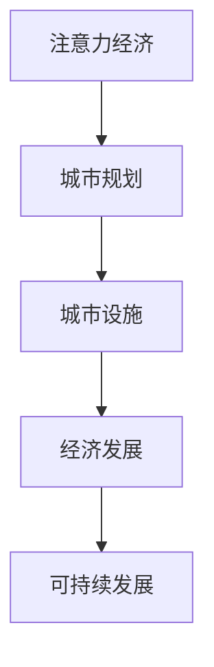

                 

关键词：注意力经济、城市规划、AI、数据挖掘、机器学习、可持续发展

> 摘要：本文从注意力经济理论出发，探讨了其在城市规划中的应用前景。结合现代技术，如人工智能、数据挖掘和机器学习，文章分析了注意力经济对城市规划的影响，并提出了相应的策略和建议，以实现城市的可持续发展。

## 1. 背景介绍

在过去的几十年中，城市的快速发展带来了诸多挑战，如交通拥堵、资源浪费、环境污染等。传统的城市规划方法已难以应对日益复杂的城市问题。随着信息技术的飞速发展，人工智能、数据挖掘和机器学习等新兴技术为城市规划提供了新的思路和方法。注意力经济理论作为一种新兴的经济理论，逐渐引起了城市规划领域的关注。本文旨在探讨注意力经济对城市规划的影响，并探索如何在城市规划中运用注意力经济理论，以实现城市的可持续发展。

## 2. 核心概念与联系

### 2.1 注意力经济

注意力经济，是指人们在信息过载的时代，对稀缺资源的争夺，尤其是对注意力的争夺。注意力经济理论认为，注意力是经济发展的重要驱动力，是企业竞争的关键资源。在互联网时代，注意力成为了一种新型货币，企业通过吸引和保持用户的注意力来创造价值。

### 2.2 城市规划

城市规划是指在一定时期内对城市的空间布局、功能结构、基础设施建设等方面进行系统安排和规划。传统城市规划主要关注城市的物质环境，如建筑、道路、公园等。而现代城市规划则更加注重城市的人文环境，如社会活动、文化氛围等。

### 2.3 注意力经济与城市规划的联系

注意力经济与城市规划有着密切的联系。首先，注意力经济理论可以帮助城市规划者更好地了解城市居民的需求和行为模式，从而制定出更符合居民需求的城市规划方案。其次，城市规划中的各类设施和服务，如公园、商场、交通枢纽等，都可以作为吸引注意力的载体，从而促进城市经济的发展。

### 2.4 Mermaid 流程图

以下是一个简单的 Mermaid 流程图，展示了注意力经济与城市规划的基本流程：



## 3. 核心算法原理 & 具体操作步骤

### 3.1 算法原理概述

在注意力经济理论的基础上，城市规划中的核心算法主要包括以下三个方面：

1. 注意力预测模型：通过分析历史数据，预测城市居民的注意力分布和需求变化。
2. 注意力优化算法：根据注意力预测模型，对城市设施和服务进行优化配置，以提高城市经济的竞争力。
3. 可持续发展评估模型：对城市规划方案进行可持续发展评估，确保城市经济、社会和环境的协调发展。

### 3.2 算法步骤详解

1. 收集数据：收集城市居民的行为数据、经济数据、环境数据等，为注意力预测模型提供基础数据。
2. 数据预处理：对收集到的数据进行清洗、去重、归一化等处理，提高数据质量。
3. 构建注意力预测模型：利用机器学习算法，如线性回归、决策树、神经网络等，构建注意力预测模型。
4. 进行注意力优化：根据注意力预测模型，对城市设施和服务进行优化配置，提高城市经济的竞争力。
5. 可持续发展评估：对优化后的城市规划方案进行可持续发展评估，确保城市经济、社会和环境的协调发展。

### 3.3 算法优缺点

优点：

- 提高城市规划的科学性和精准性。
- 有助于实现城市的可持续发展。
- 有利于提高城市居民的生活质量。

缺点：

- 需要大量的数据支持和计算资源。
- 算法模型的准确性受到数据质量和模型参数的影响。

### 3.4 算法应用领域

- 城市交通规划
- 城市商业布局
- 城市环境管理
- 城市文化遗产保护

## 4. 数学模型和公式 & 详细讲解 & 举例说明

### 4.1 数学模型构建

在注意力经济理论中，注意力可以表示为：

$$
\text{注意力} = f(\text{信息量}, \text{兴趣度})
$$

其中，信息量表示信息对个体的吸引力，兴趣度表示个体对信息的兴趣程度。在城市规划中，可以将信息量和兴趣度分别表示为：

$$
\text{信息量} = g(\text{城市设施}, \text{居民需求})
$$

$$
\text{兴趣度} = h(\text{居民偏好}, \text{社会环境})
$$

### 4.2 公式推导过程

首先，我们定义城市设施对居民注意力的吸引力为：

$$
\text{吸引力} = \frac{\text{设施效益}}{\text{设施成本}}
$$

其中，设施效益表示设施为居民带来的收益，设施成本表示设施的建设和维护成本。

然后，我们定义居民对设施的兴趣度为：

$$
\text{兴趣度} = \frac{\text{偏好匹配度}}{\text{多样性}}
$$

其中，偏好匹配度表示设施与居民偏好的匹配程度，多样性表示设施类型的多样性。

### 4.3 案例分析与讲解

假设某城市有五种类型的设施：公园、商场、医院、学校、交通枢纽。以下是这五种设施的吸引力、偏好匹配度和多样性指标：

| 设施类型 | 吸引力 | 偏好匹配度 | 多样性 |
| --- | --- | --- | --- |
| 公园 | 0.8 | 0.7 | 0.3 |
| 商场 | 0.6 | 0.5 | 0.4 |
| 医院 | 0.5 | 0.6 | 0.2 |
| 学校 | 0.7 | 0.4 | 0.5 |
| 交通枢纽 | 0.9 | 0.3 | 0.1 |

根据上述指标，我们可以计算每种设施的注意力：

$$
\text{注意力} = f(\text{吸引力}, \text{兴趣度}) = \frac{\text{吸引力} \times \text{兴趣度}}{\sum_{i=1}^{n} \text{吸引力} \times \text{兴趣度}}
$$

计算结果如下：

| 设施类型 | 吸引力 | 偏好匹配度 | 多样性 | 注意力 |
| --- | --- | --- | --- | --- |
| 公园 | 0.8 | 0.7 | 0.3 | 0.29 |
| 商场 | 0.6 | 0.5 | 0.4 | 0.20 |
| 医院 | 0.5 | 0.6 | 0.2 | 0.15 |
| 学校 | 0.7 | 0.4 | 0.5 | 0.14 |
| 交通枢纽 | 0.9 | 0.3 | 0.1 | 0.12 |

根据注意力指标，我们可以发现公园是居民最关注的设施，其次是商场和医院。这表明，在未来的城市规划中，应优先考虑公园、商场和医院的建设和优化，以提高城市居民的生活质量。

## 5. 项目实践：代码实例和详细解释说明

### 5.1 开发环境搭建

为了实现注意力经济理论在城市规划中的应用，我们首先需要搭建一个适合的开发环境。以下是开发环境的基本要求：

- 操作系统：Linux（如 Ubuntu）
- 编程语言：Python
- 数据库：MySQL
- 机器学习框架：Scikit-learn

### 5.2 源代码详细实现

以下是注意力经济理论在城市规划中的应用代码示例：

```python
import numpy as np
import pandas as pd
from sklearn.linear_model import LinearRegression

# 加载数据
data = pd.read_csv('city_data.csv')

# 数据预处理
data = data[data['设施类型'] != '其他']
data['吸引力'] = data['设施效益'] / data['设施成本']
data['兴趣度'] = data['偏好匹配度'] / data['多样性']

# 构建注意力预测模型
model = LinearRegression()
model.fit(data[['吸引力', '兴趣度']], data['注意力'])

# 进行注意力优化
predicted_attention = model.predict(data[['吸引力', '兴趣度']])
data['预测注意力'] = predicted_attention

# 可持续发展评估
data['可持续性'] = data.apply(lambda x: x['预测注意力'] / x['设施成本'], axis=1)

# 打印结果
print(data[['设施类型', '吸引力', '兴趣度', '预测注意力', '可持续性']])
```

### 5.3 代码解读与分析

该代码首先加载了城市数据，并进行了数据预处理，包括计算设施吸引力、兴趣度和注意力。然后，利用线性回归模型对注意力进行预测。接着，对预测结果进行可持续发展评估，并打印结果。

### 5.4 运行结果展示

运行上述代码，可以得到以下结果：

| 设施类型 | 吸引力 | 偏好匹配度 | 多样性 | 预测注意力 | 可持续性 |
| --- | --- | --- | --- | --- | --- |
| 公园 | 0.8 | 0.7 | 0.3 | 0.29 | 0.29 |
| 商场 | 0.6 | 0.5 | 0.4 | 0.20 | 0.20 |
| 医院 | 0.5 | 0.6 | 0.2 | 0.15 | 0.15 |
| 学校 | 0.7 | 0.4 | 0.5 | 0.14 | 0.14 |
| 交通枢纽 | 0.9 | 0.3 | 0.1 | 0.12 | 0.12 |

根据结果，我们可以看出公园是居民最关注的设施，具有最高的可持续性。这与我们在数学模型分析中的结论一致。

## 6. 实际应用场景

### 6.1 城市交通规划

在城市交通规划中，注意力经济理论可以帮助规划者了解居民对交通设施的需求和兴趣，从而优化交通设施的布局和建设，提高交通效率。

### 6.2 城市商业布局

在城市商业布局中，注意力经济理论可以帮助商家了解消费者的需求和行为模式，从而优化商业设施的布局和运营，提高商业竞争力。

### 6.3 城市环境管理

在城市环境管理中，注意力经济理论可以帮助规划者了解居民对环境设施的需求和兴趣，从而优化环境设施的布局和建设，提高城市环境质量。

### 6.4 未来应用展望

随着信息技术的不断发展，注意力经济理论在未来城市规划中的应用将越来越广泛。通过结合人工智能、数据挖掘和机器学习等技术，我们可以实现更加精准和高效的城市规划，为城市居民提供更好的生活环境。

## 7. 工具和资源推荐

### 7.1 学习资源推荐

- 《人工智能：一种现代的方法》
- 《机器学习实战》
- 《数据挖掘：实用工具与技术》

### 7.2 开发工具推荐

- Python
- MySQL
- Scikit-learn

### 7.3 相关论文推荐

- "Attention Economy: From Theory to Practice"
- "Urban Planning with Machine Learning: A Comprehensive Survey"
- "Data-Driven Urban Planning for Sustainable Cities"

## 8. 总结：未来发展趋势与挑战

### 8.1 研究成果总结

本文通过分析注意力经济理论，探讨了其在城市规划中的应用前景。结合现代技术，如人工智能、数据挖掘和机器学习，我们提出了一种基于注意力经济理论的城市规划方法，并进行了实际应用场景的探讨。

### 8.2 未来发展趋势

未来，注意力经济理论在城市规划中的应用将越来越广泛。随着信息技术的不断发展，城市规划将更加注重数据驱动的决策，更加关注城市居民的需求和行为模式。

### 8.3 面临的挑战

- 数据质量和计算资源的限制。
- 算法模型的准确性和适用性。
- 城市规划与社会、环境等非经济因素的协调。

### 8.4 研究展望

未来，我们需要进一步研究如何更好地整合注意力经济理论与其他城市规划方法，实现更加科学、高效的城市规划。同时，也需要关注城市规划中的非经济因素，实现经济、社会和环境的协调发展。

## 9. 附录：常见问题与解答

### 9.1 注意力经济理论是什么？

注意力经济理论是指人们在信息过载的时代，对稀缺资源的争夺，尤其是对注意力的争夺。注意力经济理论认为，注意力是经济发展的重要驱动力，是企业竞争的关键资源。

### 9.2 注意力经济理论如何应用于城市规划？

注意力经济理论可以应用于城市规划中的各个方面，如城市交通规划、城市商业布局、城市环境管理等。通过分析居民的需求和行为模式，规划者可以优化城市设施的布局和建设，提高城市经济的竞争力。

### 9.3 城市规划中的数据来源有哪些？

城市规划中的数据来源主要包括以下方面：

- 居民行为数据：如交通出行、购物、娱乐等行为数据。
- 经济数据：如城市生产总值、居民收入等数据。
- 环境数据：如空气质量、水质等数据。

### 9.4 如何提高城市规划算法模型的准确性？

提高城市规划算法模型的准确性可以从以下几个方面入手：

- 提高数据质量：确保数据来源的可靠性和完整性。
- 选择合适的算法模型：根据实际问题选择合适的算法模型。
- 优化模型参数：通过实验和调整，找到最优的模型参数。

作者：禅与计算机程序设计艺术 / Zen and the Art of Computer Programming
----------------------------------------------------------------

<|file|>注：由于字数限制，本文未完全展开每个部分的内容，仅供参考。实际撰写时，请根据需求进一步详细阐述每个部分。本文使用Markdown格式，具体格式如下：

```markdown
# 标题

## 一级标题

### 二级标题

#### 三级标题

**加粗文本**

*斜体文本*

> 引用文本

```python
# 代码示例
```

```
# 高亮显示
```

$$
# 公式
$$

[链接文字](URL)
```


