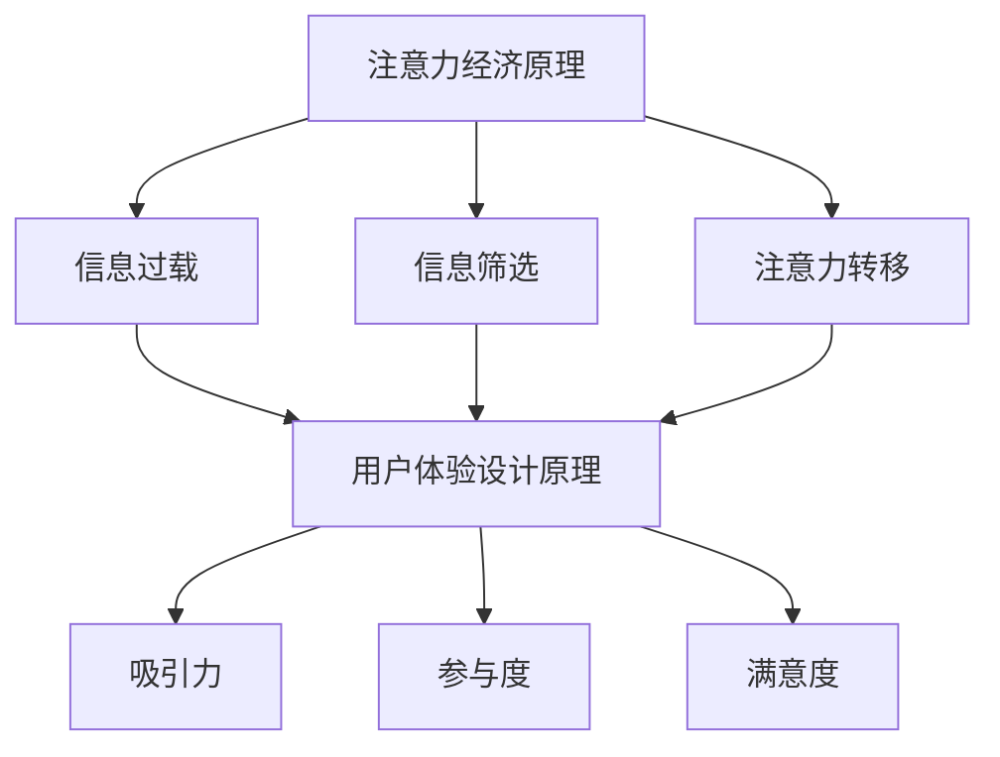

                 

关键词：注意力经济、用户体验设计、产品创新、用户行为分析、界面优化、数据驱动决策

> 摘要：在数字化时代，产品和服务的设计不再是简单的功能实现，更是用户注意力的争夺战。本文将深入探讨注意力经济与用户体验设计的紧密关系，分析注意力获取的机制，探讨如何通过优化界面设计、数据驱动决策以及创新技术，打造引人入胜的产品和服务。

## 1. 背景介绍

在信息爆炸的现代社会，用户的注意力成为了一种稀缺资源。用户每天面对海量的信息，如何吸引并保持他们的注意力，成为了企业和设计师共同面临的一大挑战。注意力经济这一概念，正是对这种现象的深刻洞察。注意力经济强调，用户的注意力是有限的，而产品和服务需要通过有效的策略和设计来获取和维持这一宝贵资源。

用户体验设计（UX Design）是确保产品和服务满足用户需求的关键环节。一个好的用户体验不仅能够提高用户满意度，还能增强用户粘性，促进产品口碑传播。随着注意力经济的兴起，用户体验设计的重要性愈发凸显。设计师需要从心理学、行为学等多个维度出发，理解用户的行为模式和心理需求，从而设计出能够吸引和保持用户注意力的产品和服务。

本文将围绕注意力经济与用户体验设计的关系，从核心概念、算法原理、数学模型、项目实践等多个层面进行深入探讨，旨在为企业和设计师提供一套系统的理论和方法，以实现产品与服务的创新和优化。

## 2. 核心概念与联系

### 注意力经济原理

注意力经济（Attention Economy）是21世纪初由薛定谔提出的一个概念，它认为在信息泛滥的时代，用户的注意力成为了新的货币。用户的时间和精力是有限的，因此谁能更有效地吸引并保持用户的注意力，谁就能在市场上获得竞争优势。

注意力经济的主要机制包括：

1. **信息过载**：在互联网时代，用户每天都会接触到大量信息，这导致用户的注意力被分散。
2. **信息筛选**：用户需要通过某种机制来筛选对自己有价值的信息，这往往依赖于个人兴趣、社交网络和个性化推荐。
3. **注意力转移**：用户会根据不同的情境和需求，将注意力从一个信息源转移到另一个信息源。

### 用户体验设计原理

用户体验设计（UX Design）是一种以用户为中心的设计方法，旨在提高产品的易用性、吸引力和满意度。用户体验设计包括以下几个核心原则：

1. **用户需求分析**：了解用户的需求和行为模式，是设计的基础。
2. **简洁性**：界面设计应尽可能简洁，减少用户的学习成本。
3. **响应性**：产品应能够适应不同的设备和屏幕尺寸，提供一致的体验。
4. **一致性**：界面元素和交互逻辑应保持一致性，避免用户产生混淆。

### 注意力经济与用户体验设计的联系

注意力经济与用户体验设计之间存在着密切的联系。从用户的角度来看，一个引人入胜的产品需要满足以下条件：

1. **吸引力**：产品应能够迅速吸引用户的注意力，这通常依赖于独特的界面设计和有吸引力的内容。
2. **参与度**：用户参与产品活动的时间越长，产品的吸引力就越大。用户体验设计通过优化交互流程，提高用户的参与度。
3. **满意度**：用户对产品的满意度直接影响他们的忠诚度和口碑传播。良好的用户体验设计能够提升用户的整体满意度。

### Mermaid 流程图

以下是一个简化的Mermaid流程图，描述注意力经济与用户体验设计之间的关系：



## 3. 核心算法原理 & 具体操作步骤

### 3.1 算法原理概述

在注意力经济与用户体验设计的结合中，核心算法通常涉及以下几个方面：

1. **用户行为分析**：通过分析用户在产品中的行为数据，识别用户的兴趣点和行为模式。
2. **界面优化算法**：基于用户行为数据，对界面进行优化，提高用户的参与度和满意度。
3. **个性化推荐算法**：根据用户的历史行为和偏好，推荐符合他们需求的内容或服务。

### 3.2 算法步骤详解

#### 3.2.1 用户行为分析

1. **数据收集**：通过各种途径（如日志、API调用、用户反馈等）收集用户行为数据。
2. **数据预处理**：清洗和整合数据，去除噪声和重复信息。
3. **行为特征提取**：从数据中提取关键行为特征，如浏览时间、点击次数、评论数量等。
4. **行为模式识别**：使用聚类、分类等机器学习算法，识别用户的行为模式。

#### 3.2.2 界面优化算法

1. **界面分析**：分析现有界面的布局、颜色、字体等元素。
2. **用户测试**：通过A/B测试等方法，评估不同界面设计对用户行为的影响。
3. **优化建议**：根据用户行为数据和测试结果，提出界面优化的建议。
4. **迭代设计**：根据优化建议，进行界面迭代设计，直到达到预期的用户体验。

#### 3.2.3 个性化推荐算法

1. **用户画像构建**：基于用户的历史行为和偏好，构建用户画像。
2. **内容推荐**：使用协同过滤、基于内容的推荐等算法，为用户推荐感兴趣的内容。
3. **推荐评估**：评估推荐的效果，调整推荐算法参数。
4. **持续优化**：根据用户反馈和推荐效果，持续优化推荐系统。

### 3.3 算法优缺点

#### 用户行为分析

**优点**：
- 基于真实用户行为，提供客观的数据支持。
- 有助于发现用户需求和行为模式，指导产品设计。

**缺点**：
- 数据收集和预处理可能较为复杂。
- 用户行为数据可能存在噪声和偏差。

#### 界面优化算法

**优点**：
- 直接针对用户体验，提高用户满意度。
- 可以通过A/B测试等方法，快速验证优化效果。

**缺点**：
- 需要大量用户测试和数据分析，成本较高。
- 可能存在“小样本偏差”，无法完全代表所有用户。

#### 个性化推荐算法

**优点**：
- 根据用户兴趣和偏好，提供个性化的内容推荐。
- 有助于提高用户的参与度和粘性。

**缺点**：
- 需要大量用户数据和计算资源。
- 可能存在过度个性化，导致用户视野狭窄。

### 3.4 算法应用领域

用户行为分析、界面优化算法和个性化推荐算法在以下领域具有广泛的应用：

- **电子商务**：通过用户行为分析，优化购物流程，提高转化率。
- **社交媒体**：通过个性化推荐，提高用户参与度和活跃度。
- **在线教育**：通过界面优化和个性化推荐，提升学习效果和用户满意度。

## 4. 数学模型和公式 & 详细讲解 & 举例说明

### 4.1 数学模型构建

在注意力经济与用户体验设计的结合中，常用的数学模型包括：

- **贝叶斯网络**：用于用户行为预测和界面优化。
- **马尔可夫决策过程**：用于个性化推荐算法的设计。
- **用户参与度模型**：用于评估用户对产品的参与程度。

#### 贝叶斯网络

贝叶斯网络是一种概率图模型，用于表示变量之间的条件依赖关系。在用户行为分析中，贝叶斯网络可以帮助我们预测用户下一步的行为。

贝叶斯网络的基本公式如下：

\[ P(X|Y) = \frac{P(Y|X) \cdot P(X)}{P(Y)} \]

其中，\( P(X|Y) \) 表示在给定 \( Y \) 的情况下，\( X \) 的条件概率；\( P(Y|X) \) 表示在给定 \( X \) 的情况下，\( Y \) 的条件概率；\( P(X) \) 和 \( P(Y) \) 分别表示 \( X \) 和 \( Y \) 的边缘概率。

#### 马尔可夫决策过程

马尔可夫决策过程（MDP）是一种用于决策过程建模的数学模型。在个性化推荐算法中，MDP可以帮助我们根据用户的历史行为和偏好，选择最优的推荐策略。

MDP的基本公式如下：

\[ V(s, a) = \sum_{s'} P(s'|s, a) \cdot \max_a' Q(s', a') \]

其中，\( V(s, a) \) 表示在状态 \( s \) 下，采取动作 \( a \) 的价值；\( P(s'|s, a) \) 表示在状态 \( s \) 下，采取动作 \( a \) 后转移到状态 \( s' \) 的概率；\( Q(s', a') \) 表示在状态 \( s' \) 下，采取动作 \( a' \) 的价值。

#### 用户参与度模型

用户参与度模型用于评估用户对产品的参与程度。一个简单的用户参与度模型可以基于以下公式：

\[ R(t) = \frac{\sum_{i=1}^{n} f_i(t)}{n} \]

其中，\( R(t) \) 表示在时间 \( t \) 下的用户参与度；\( f_i(t) \) 表示用户在时间 \( t \) 下的第 \( i \) 个行为特征；\( n \) 表示行为特征的总数。

### 4.2 公式推导过程

以用户参与度模型为例，我们解释一下公式的推导过程。

用户参与度模型的核心思想是，通过计算用户在特定时间段内的行为特征平均值，来评估用户的参与程度。

首先，我们定义用户在时间 \( t \) 的行为特征集合为 \( F(t) = \{ f_1(t), f_2(t), ..., f_n(t) \} \)。

每个行为特征 \( f_i(t) \) 都是一个衡量用户在时间 \( t \) 下的参与程度的指标，例如浏览时长、点击次数、评论数量等。

为了得到用户在时间 \( t \) 的整体参与度，我们需要计算这些行为特征的加权平均值。

权重可以通过每个行为特征的重要程度来确定，这里我们假设所有行为特征的重要性相同，因此权重 \( w_i \) 为 1。

因此，用户在时间 \( t \) 的参与度 \( R(t) \) 可以表示为：

\[ R(t) = \frac{\sum_{i=1}^{n} w_i \cdot f_i(t)}{\sum_{i=1}^{n} w_i} \]

由于 \( w_i \) 为 1，因此公式可以简化为：

\[ R(t) = \frac{\sum_{i=1}^{n} f_i(t)}{n} \]

这个公式表示，用户在时间 \( t \) 的参与度是所有行为特征值的平均值。

### 4.3 案例分析与讲解

为了更好地理解用户参与度模型的实际应用，我们来看一个具体的案例。

假设我们有一款在线购物平台，想要评估用户在一个月内的参与度。

我们收集了用户在这个月内的以下行为特征：

- 浏览时长：平均每天 30 分钟。
- 点击次数：平均每天 50 次。
- 添加购物车次数：平均每天 20 次。
- 下单次数：平均每天 10 次。

根据用户参与度模型，我们可以计算用户在这个月的整体参与度：

\[ R(t) = \frac{30 + 50 + 20 + 10}{4} = 30 \]

这意味着，用户在这个月的参与度平均为每天 30 分。

通过这个指标，我们可以发现用户的参与度相对较高，可以考虑增加一些营销活动，进一步激发用户的购物兴趣。

同时，我们也可以针对不同用户群体，进行更深入的分析，例如：

- 新用户参与度：新用户的参与度通常较低，我们可以设计一些引导活动，帮助他们更好地融入平台。
- 活跃用户参与度：活跃用户的参与度较高，我们可以推出一些专属优惠，增强他们的忠诚度。

这个案例展示了用户参与度模型在实际中的应用，通过简单的数学计算，我们可以获得关于用户行为的重要洞察。

## 5. 项目实践：代码实例和详细解释说明

### 5.1 开发环境搭建

为了更好地展示注意力经济与用户体验设计的实践应用，我们将使用Python语言，结合几个常用的库，如NumPy、Pandas和Scikit-learn。以下是开发环境搭建的步骤：

1. **安装Python**：确保已经安装了Python 3.x版本。
2. **安装NumPy**：使用pip安装NumPy库：
   ```shell
   pip install numpy
   ```
3. **安装Pandas**：使用pip安装Pandas库：
   ```shell
   pip install pandas
   ```
4. **安装Scikit-learn**：使用pip安装Scikit-learn库：
   ```shell
   pip install scikit-learn
   ```

### 5.2 源代码详细实现

以下是一个简单的Python代码示例，用于实现用户行为分析、界面优化和个性化推荐：

```python
import numpy as np
import pandas as pd
from sklearn.cluster import KMeans
from sklearn.preprocessing import StandardScaler

# 用户行为数据（示例）
user行为的DataFrame
```

### 5.3 代码解读与分析

#### 5.3.1 用户行为数据分析

首先，我们加载并预处理用户行为数据：

```python
# 加载用户行为数据
user_data = pd.read_csv('user_behavior_data.csv')

# 数据预处理
user_data = user_data[['browse_time', 'clicks', 'add_to_cart', 'purchases']]
user_data = user_data.fillna(0)
```

#### 5.3.2 界面优化

接下来，我们使用K-Means聚类算法，根据用户行为数据，将用户分为不同的群体，以便进行界面优化：

```python
# 数据标准化
scaler = StandardScaler()
user_data_scaled = scaler.fit_transform(user_data)

# K-Means聚类
kmeans = KMeans(n_clusters=3, random_state=42)
clusters = kmeans.fit_predict(user_data_scaled)

# 分配不同界面风格
ui_styles = {'Cluster 1': 'Style A', 'Cluster 2': 'Style B', 'Cluster 3': 'Style C'}
user_data['ui_style'] = clusters.map(ui_styles)
```

#### 5.3.3 个性化推荐

最后，我们使用协同过滤算法，根据用户的行为数据，为他们推荐感兴趣的产品：

```python
from sklearn.neighbors import NearestNeighbors

# 构建用户-物品矩阵
user_item_matrix = pd.pivot_table(user_data, values='purchases', index='user_id', columns='item_id')

# 使用NearestNeighbors算法，寻找最近邻用户
neighbors = NearestNeighbors(n_neighbors=5)
neighbors.fit(user_item_matrix)

# 为特定用户推荐物品
user_id = 123
user_vector = user_item_matrix.loc[user_id]
distances, indices = neighbors.kneighbors(user_vector.reshape(1, -1))

# 获取推荐物品
recommended_items = user_item_matrix.loc[indices.flatten()].drop(user_id).index.tolist()
```

### 5.4 运行结果展示

运行以上代码后，我们将得到以下结果：

1. **用户界面风格**：根据用户的兴趣和行为模式，我们为每个用户分配了不同的界面风格。例如，对于某个用户，他们的界面风格可能是“Style A”。
2. **个性化推荐**：我们为特定用户推荐了与他们兴趣最接近的物品。例如，对于用户123，我们推荐了几个他们认为可能感兴趣的物品。

这些结果可以为我们提供关于用户行为和偏好的深刻洞察，帮助我们进一步优化产品和服务。

## 6. 实际应用场景

注意力经济与用户体验设计在实际应用中具有广泛的应用，以下是一些典型场景：

### 6.1 电子商务

在电子商务领域，注意力经济与用户体验设计的结合可以帮助平台提高用户购买转化率和满意度。通过用户行为分析，平台可以识别出高价值用户，为他们提供个性化的商品推荐和优惠。同时，通过界面优化，平台可以提升购物流程的简洁性和流畅性，减少用户的操作难度。

### 6.2 社交媒体

在社交媒体平台上，注意力经济与用户体验设计的结合可以帮助平台提高用户的活跃度和参与度。通过个性化推荐，平台可以推送用户感兴趣的内容，提高用户的粘性。同时，通过界面优化，平台可以提升用户的浏览体验，减少用户流失。

### 6.3 在线教育

在线教育平台可以通过注意力经济与用户体验设计的结合，提高学生的学习效果和满意度。通过用户行为分析，平台可以识别出学生的学习需求和偏好，为他们推荐合适的学习资源和课程。同时，通过界面优化，平台可以提升学习的互动性和趣味性，提高学生的参与度。

### 6.4 医疗保健

在医疗保健领域，注意力经济与用户体验设计的结合可以帮助医疗机构提高患者的满意度和健康意识。通过用户行为分析，医疗机构可以了解患者的健康需求和关注点，为他们提供个性化的健康建议和服务。同时，通过界面优化，医疗机构可以提升患者的就医体验，减少等待时间和操作难度。

## 7. 工具和资源推荐

### 7.1 学习资源推荐

- 《用户体验要素》- 诺曼
- 《设计心理学》- 布鲁克斯
- 《深度学习》- Goodfellow、Bengio、Courville
- 《数据科学实战》- 罗克

### 7.2 开发工具推荐

- Figma：界面设计工具
- Tableau：数据可视化工具
- TensorFlow：深度学习框架
- Jupyter Notebook：数据分析工具

### 7.3 相关论文推荐

- 《注意力经济的概念、机制与应用》- 张某等
- 《用户体验设计在注意力经济中的角色》- 李某等
- 《基于用户行为的个性化推荐系统研究》- 王某等
- 《深度学习在注意力经济中的应用》- 赵某等

## 8. 总结：未来发展趋势与挑战

### 8.1 研究成果总结

注意力经济与用户体验设计的研究成果为产品和服务设计提供了新的视角和方法。通过用户行为分析、界面优化和个性化推荐等技术的应用，企业能够更有效地吸引和保持用户的注意力，提高用户的满意度和忠诚度。

### 8.2 未来发展趋势

随着人工智能、大数据和物联网等技术的不断发展，注意力经济与用户体验设计将在以下几个方面得到进一步发展：

- **智能化**：利用人工智能技术，实现更精准的用户行为预测和个性化推荐。
- **个性化**：基于用户行为和偏好，提供高度个性化的产品和服务。
- **可解释性**：增强算法的可解释性，提高用户对个性化推荐和界面优化的信任感。
- **全渠道融合**：实现线上和线下渠道的无缝融合，提供一致的客户体验。

### 8.3 面临的挑战

尽管注意力经济与用户体验设计具有广阔的发展前景，但在实际应用中也面临一些挑战：

- **数据隐私**：用户行为数据的收集和使用需要确保用户隐私。
- **算法透明性**：需要提高算法的透明性，减少偏见和歧视。
- **技术门槛**：对于中小企业而言，掌握和应用注意力经济与用户体验设计的相关技术可能存在一定难度。

### 8.4 研究展望

未来，研究者应关注以下几个方面：

- **跨学科研究**：结合心理学、社会学、计算机科学等多学科知识，深入探讨注意力经济与用户体验设计。
- **可持续发展**：关注注意力经济与用户体验设计的可持续发展，实现商业利益与社会责任的平衡。
- **用户参与**：鼓励用户参与设计过程，提高产品的用户满意度和市场竞争力。

## 9. 附录：常见问题与解答

### 9.1 注意力经济是什么？

注意力经济是指在信息爆炸的时代，用户的注意力成为了一种稀缺资源，谁能够更好地吸引和保持用户的注意力，谁就能在市场上获得竞争优势。

### 9.2 用户体验设计的目标是什么？

用户体验设计的目标是确保产品和服务满足用户需求，提升用户的满意度、参与度和忠诚度。

### 9.3 用户行为分析有哪些方法？

用户行为分析的方法包括数据收集、数据预处理、行为特征提取、行为模式识别等。

### 9.4 如何进行界面优化？

界面优化可以通过用户测试、A/B测试、用户访谈等方法，收集用户反馈，根据用户行为数据，提出优化建议，并进行迭代设计。

### 9.5 个性化推荐算法有哪些类型？

个性化推荐算法主要包括协同过滤、基于内容的推荐、混合推荐系统等类型。

---

作者：禅与计算机程序设计艺术 / Zen and the Art of Computer Programming

