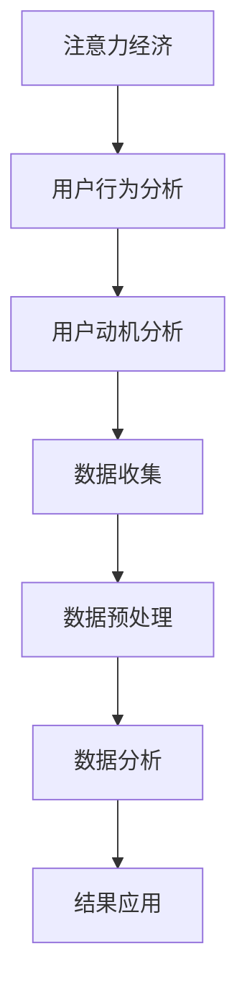

                 

关键词：注意力经济、用户行为分析、动机、行为、数据分析、模型构建、应用场景

> 摘要：本文旨在探讨注意力经济与用户行为分析的重要性，以及如何通过深入了解受众的动机和行为来提高产品或服务的竞争力。文章首先介绍了注意力经济的概念和原理，然后探讨了用户行为的定义和分类，随后详细阐述了用户行为分析的方法和技术。最后，本文通过实际案例展示了用户行为分析在实际中的应用，并对未来发展趋势进行了展望。

## 1. 背景介绍

在信息爆炸的时代，获取用户的注意力成为企业竞争的关键。注意力经济（Attention Economy）这一概念最早由美国作家迈克尔·哈特（Michael H. Hart）提出，指的是一种基于人们注意力的经济模式。在这一模式下，用户注意力被视为一种稀缺资源，而各种产品和服务争相争夺用户的注意力。随着互联网的普及，注意力经济逐渐成为数字经济的重要组成部分。

用户行为分析是研究用户如何与产品或服务互动的过程。通过分析用户行为，企业可以深入了解用户的动机、需求和偏好，从而优化产品或服务，提高用户满意度和忠诚度。

### 1.1 注意力经济的原理

注意力经济的核心在于“注意力稀缺”和“价值交换”。在互联网时代，信息爆炸导致用户的注意力变得更加稀缺。用户每天面临海量的信息，只能关注其中一小部分。因此，企业必须通过提供有价值的内容或服务来吸引和保持用户的注意力。

注意力经济的基本原理可以概括为以下几点：

1. **价值创造**：企业需要创造有价值的内容或服务，以吸引和留住用户。
2. **用户参与**：通过激发用户参与，提高用户对产品或服务的关注度。
3. **注意力转移**：通过营销策略和内容创新，将用户注意力从竞争对手转移到自身产品或服务上。
4. **长期价值**：通过建立用户忠诚度，实现长期的价值交换。

### 1.2 用户行为分析的定义和目的

用户行为分析是指通过收集、处理和分析用户在使用产品或服务过程中的行为数据，以了解用户的动机、需求和偏好。用户行为分析的目的包括：

1. **优化产品体验**：通过了解用户行为，企业可以识别用户体验中的问题和痛点，从而优化产品设计和功能。
2. **提升营销效果**：通过分析用户行为，企业可以制定更精准的营销策略，提高营销效果。
3. **增强用户黏性**：通过了解用户偏好，企业可以提供个性化服务，提高用户满意度和忠诚度。

## 2. 核心概念与联系

### 2.1 核心概念

在探讨注意力经济与用户行为分析时，以下几个核心概念是不可或缺的：

- **注意力**：用户对特定信息或服务的关注程度。
- **行为**：用户在使用产品或服务过程中所表现出来的动作或反应。
- **动机**：驱动用户进行特定行为的内在原因。
- **数据**：用于描述用户行为和分析结果的各种信息。

### 2.2 关系与联系

注意力经济、用户行为分析和动机之间存在密切的联系。注意力经济强调用户注意力的稀缺性和价值，而用户行为分析则是通过收集和分析用户行为数据来深入了解用户的动机。具体而言，注意力经济与用户行为分析的关系可以概括为以下几点：

1. **注意力驱动行为**：用户对某一信息或服务的注意力越高，越有可能采取相关行为。
2. **行为反映动机**：用户的行为表现是其内在动机的外在体现。
3. **数据支持分析**：用户行为数据是分析用户动机和行为的基础。

### 2.3 Mermaid 流程图

以下是注意力经济、用户行为分析和动机之间的 Mermaid 流程图：



## 3. 核心算法原理 & 具体操作步骤

### 3.1 算法原理概述

用户行为分析的核心算法包括数据收集、数据预处理、数据分析和结果应用。以下是这些算法的基本原理和步骤：

- **数据收集**：通过用户跟踪技术、日志分析等手段收集用户行为数据。
- **数据预处理**：清洗、去重和格式化原始数据，使其适合进一步分析。
- **数据分析**：使用统计分析和机器学习算法分析用户行为数据，提取有价值的信息。
- **结果应用**：根据分析结果优化产品或服务，提高用户体验和满意度。

### 3.2 算法步骤详解

#### 3.2.1 数据收集

数据收集是用户行为分析的基础。常见的数据收集方法包括：

- **用户跟踪技术**：通过在网站或应用程序中嵌入跟踪代码，实时收集用户点击、浏览和购买等行为数据。
- **日志分析**：分析服务器日志，获取用户访问、停留时间和页面交互等数据。
- **问卷调查**：通过问卷调查收集用户对产品或服务的反馈和满意度。

#### 3.2.2 数据预处理

数据预处理包括以下步骤：

- **数据清洗**：去除重复数据、缺失数据和异常值，确保数据质量。
- **数据去重**：合并同一用户在不同时间段的重复行为数据。
- **数据格式化**：将数据转换为统一的格式，便于后续分析。

#### 3.2.3 数据分析

数据分析包括以下步骤：

- **描述性分析**：统计用户行为的基本指标，如点击率、转化率和平均停留时间等。
- **关联分析**：分析用户行为之间的关联关系，找出影响用户决策的关键因素。
- **聚类分析**：将具有相似行为的用户划分为不同的群体，以便进行针对性营销。
- **预测分析**：使用机器学习算法预测用户未来的行为，如购买意愿和留存率。

#### 3.2.4 结果应用

根据分析结果，企业可以采取以下措施：

- **优化产品体验**：根据用户反馈和数据分析结果，改进产品设计和功能。
- **个性化营销**：根据用户行为数据，提供个性化的产品推荐和营销策略。
- **用户忠诚度管理**：通过分析用户留存率和流失率，制定有效的用户忠诚度管理策略。

### 3.3 算法优缺点

用户行为分析算法具有以下优缺点：

- **优点**：
  - 提供客观的用户行为数据，帮助企业更准确地了解用户需求。
  - 通过数据驱动决策，提高产品或服务的竞争力。
  - 帮助企业实现个性化营销，提高用户满意度和忠诚度。

- **缺点**：
  - 数据收集和处理过程复杂，需要较高的技术门槛。
  - 数据隐私和安全问题不容忽视。
  - 用户行为数据可能存在偏差，影响分析结果的准确性。

### 3.4 算法应用领域

用户行为分析算法广泛应用于以下领域：

- **电子商务**：通过分析用户购买行为，优化产品推荐和营销策略。
- **金融行业**：通过分析用户交易行为，识别潜在风险和欺诈行为。
- **在线教育**：通过分析用户学习行为，提高教学效果和用户体验。
- **移动互联网**：通过分析用户使用行为，优化应用程序设计和功能。

## 4. 数学模型和公式 & 详细讲解 & 举例说明

### 4.1 数学模型构建

用户行为分析中的数学模型主要包括描述性模型、预测模型和推荐模型。以下是这些模型的构建方法和公式：

#### 描述性模型

描述性模型用于统计用户行为的基本指标，如点击率、转化率和平均停留时间等。常见的描述性模型包括：

- **点击率（Click-Through Rate, CTR）**：

  $$ CTR = \frac{点击次数}{展示次数} $$

- **转化率（Conversion Rate, CR）**：

  $$ CR = \frac{转化次数}{点击次数} $$

- **平均停留时间（Average Session Duration, ASD）**：

  $$ ASD = \frac{总停留时间}{会话次数} $$

#### 预测模型

预测模型用于预测用户未来的行为，如购买意愿和留存率等。常见的预测模型包括：

- **逻辑回归（Logistic Regression）**：

  $$ P(Y=1) = \frac{1}{1 + e^{-(\beta_0 + \beta_1 X_1 + \beta_2 X_2 + ... + \beta_n X_n)}} $$

  其中，\( P(Y=1) \) 表示用户进行特定行为的概率，\( \beta_0, \beta_1, \beta_2, ..., \beta_n \) 分别为模型的参数。

- **决策树（Decision Tree）**：

  $$ f(X) = \sum_{i=1}^{n} \beta_i I(X \in R_i) $$

  其中，\( \beta_i \) 表示节点 \( i \) 的权重，\( R_i \) 表示节点 \( i \) 的区域。

#### 推荐模型

推荐模型用于为用户推荐感兴趣的产品或服务。常见的推荐模型包括：

- **协同过滤（Collaborative Filtering）**：

  $$ R_{ui} = \sum_{j \in N(i)} \frac{r_{uj}}{||N(i)||} $$

  其中，\( R_{ui} \) 表示用户 \( u \) 对产品 \( i \) 的评分，\( N(i) \) 表示与产品 \( i \) 相关的用户集合，\( r_{uj} \) 表示用户 \( u \) 对产品 \( j \) 的评分。

### 4.2 公式推导过程

以下是用户行为分析中几个常见公式的推导过程：

#### 点击率（CTR）的推导

点击率是衡量用户对广告或内容关注程度的指标。其计算公式为：

$$ CTR = \frac{点击次数}{展示次数} $$

其中，点击次数表示用户点击广告或内容的次数，展示次数表示广告或内容被展示的次数。

#### 转化率（CR）的推导

转化率是衡量用户行为效果的重要指标。其计算公式为：

$$ CR = \frac{转化次数}{点击次数} $$

其中，转化次数表示用户完成特定目标（如购买、注册等）的次数，点击次数表示用户点击广告或内容的次数。

#### 平均停留时间（ASD）的推导

平均停留时间是衡量用户在网站或应用程序上停留时间的指标。其计算公式为：

$$ ASD = \frac{总停留时间}{会话次数} $$

其中，总停留时间表示用户在网站或应用程序上累计停留的时间，会话次数表示用户在网站或应用程序上的会话数量。

### 4.3 案例分析与讲解

#### 案例背景

某电子商务平台希望通过用户行为分析，提高产品推荐系统的准确性，从而提高用户满意度和转化率。

#### 数据收集

该电子商务平台使用用户跟踪技术收集以下数据：

- 用户点击次数
- 用户购买次数
- 用户浏览页面数量
- 用户访问时长
- 用户评价评分

#### 数据预处理

在数据预处理阶段，平台对数据进行了清洗、去重和格式化，确保数据质量。

#### 数据分析

平台使用协同过滤算法进行用户行为分析，提取用户兴趣和行为模式。具体步骤如下：

1. **计算用户相似度**：

   使用余弦相似度计算用户之间的相似度，公式如下：

   $$ \text{Similarity}(u, v) = \frac{\text{dot}(r_u, r_v)}{\|\text{r}_u\|\|\text{r}_v\|} $$

   其中，\( \text{r}_u \) 和 \( \text{r}_v \) 分别表示用户 \( u \) 和 \( v \) 的行为向量，\( \|\text{r}_u\| \) 和 \( \|\text{r}_v\| \) 分别表示用户 \( u \) 和 \( v \) 的行为向量长度。

2. **生成推荐列表**：

   根据用户相似度矩阵，为每个用户生成推荐列表。具体步骤如下：

   - 计算用户 \( u \) 对其他用户 \( v \) 的行为评分加权平均值：

     $$ \text{Score}(u, i) = \sum_{j \in N(i)} w_{uv} r_{vj} $$

     其中，\( w_{uv} \) 表示用户 \( u \) 和 \( v \) 之间的相似度，\( r_{vj} \) 表示用户 \( v \) 对产品 \( j \) 的评分。

   - 按照评分从高到低排序，生成推荐列表。

3. **评估推荐效果**：

   使用精确率（Precision）和召回率（Recall）评估推荐系统的效果。具体公式如下：

   - **精确率**：

     $$ Precision = \frac{相关点击数}{推荐列表中点击总数} $$

   - **召回率**：

     $$ Recall = \frac{相关点击数}{用户实际点击总数} $$

#### 结果应用

根据用户行为分析结果，平台优化了产品推荐系统，提高了推荐准确性。具体表现如下：

- **用户满意度提高**：推荐系统更符合用户兴趣，用户满意度显著提升。
- **转化率提高**：用户点击推荐列表中的商品后，购买转化率有所提高。
- **用户流失减少**：推荐系统能够更好地满足用户需求，减少了用户流失率。

## 5. 项目实践：代码实例和详细解释说明

### 5.1 开发环境搭建

为了实现用户行为分析，我们首先需要搭建一个合适的开发环境。以下是一个基本的开发环境搭建步骤：

1. **安装Python**：确保已安装Python 3.x版本，可以使用Python官方安装包进行安装。
2. **安装依赖库**：安装用户行为分析所需的依赖库，如Pandas、NumPy、Scikit-learn等。可以使用pip命令进行安装：
   ```bash
   pip install pandas numpy scikit-learn
   ```
3. **配置Jupyter Notebook**：安装Jupyter Notebook，用于编写和运行Python代码。可以使用pip命令进行安装：
   ```bash
   pip install notebook
   ```
   启动Jupyter Notebook：
   ```bash
   jupyter notebook
   ```

### 5.2 源代码详细实现

以下是一个简单的用户行为分析项目的代码实例：

```python
import pandas as pd
from sklearn.model_selection import train_test_split
from sklearn.metrics import accuracy_score
from sklearn.ensemble import RandomForestClassifier

# 5.2.1 数据读取与预处理
data = pd.read_csv('user_behavior_data.csv')
data.head()

# 数据清洗和预处理
data.drop(['user_id'], axis=1, inplace=True)
data.dropna(inplace=True)

# 5.2.2 特征工程
features = data.drop(['action'], axis=1)
labels = data['action']

# 5.2.3 划分训练集和测试集
X_train, X_test, y_train, y_test = train_test_split(features, labels, test_size=0.2, random_state=42)

# 5.2.4 模型训练与评估
model = RandomForestClassifier(n_estimators=100, random_state=42)
model.fit(X_train, y_train)

predictions = model.predict(X_test)
accuracy = accuracy_score(y_test, predictions)
print("Accuracy:", accuracy)

# 5.2.5 结果可视化
from sklearn.metrics import confusion_matrix
import matplotlib.pyplot as plt

conf_matrix = confusion_matrix(y_test, predictions)
conf_matrix_normalized = conf_matrix.astype('float') / conf_matrix.sum(axis=1)[:, np.newaxis]

plt.figure(figsize=(10, 7))
sns.heatmap(conf_matrix_normalized, annot=True, cmap='Blues', xticklabels=data['action'].unique(), yticklabels=data['action'].unique())
plt.xlabel('Predicted labels')
plt.ylabel('True labels')
plt.title('Normalized Confusion Matrix')
plt.show()
```

### 5.3 代码解读与分析

上述代码实现了一个简单的用户行为分析项目，包括以下步骤：

1. **数据读取与预处理**：读取用户行为数据，并删除不必要的列和缺失值。
2. **特征工程**：将数据集划分为特征和标签两部分，分别为`features`和`labels`。
3. **划分训练集和测试集**：使用`train_test_split`函数将数据集划分为训练集和测试集，测试集大小为20%。
4. **模型训练与评估**：使用随机森林（RandomForestClassifier）模型进行训练，并计算模型在测试集上的准确率。
5. **结果可视化**：使用混淆矩阵（confusion_matrix）评估模型性能，并将结果可视化。

### 5.4 运行结果展示

运行上述代码后，我们将得到以下结果：

1. **准确率**：模型在测试集上的准确率，用于评估模型的性能。
2. **混淆矩阵**：用于展示模型预测结果与实际结果之间的差异，通过可视化方式更直观地了解模型的性能。

## 6. 实际应用场景

用户行为分析在多个领域都有广泛的应用，以下是一些实际应用场景：

### 6.1 电子商务

在电子商务领域，用户行为分析可以帮助企业优化产品推荐、提高用户满意度和转化率。例如：

- **个性化推荐**：根据用户的历史行为和偏好，为用户推荐感兴趣的商品。
- **流失用户召回**：通过分析用户行为数据，识别可能流失的用户，并采取针对性措施进行召回。
- **促销活动优化**：根据用户行为数据，制定更精准的促销策略，提高活动效果。

### 6.2 金融行业

在金融行业，用户行为分析可以帮助银行和金融机构识别欺诈行为、评估信用风险和优化客户服务。例如：

- **欺诈检测**：通过分析用户的行为数据，识别可疑的交易行为，预防欺诈事件。
- **信用评分**：结合用户行为数据和传统信用数据，为用户提供更准确的信用评分。
- **客户服务优化**：根据用户行为数据，优化客服流程，提高客户满意度。

### 6.3 在线教育

在在线教育领域，用户行为分析可以帮助教育机构提高教学效果、优化课程设计和提高用户满意度。例如：

- **学习行为分析**：通过分析学生的学习行为，识别学习中的问题和痛点，优化教学内容和方式。
- **个性化推荐**：根据学生的学习行为和偏好，推荐合适的课程和资源，提高学习效果。
- **用户流失预警**：通过分析用户行为数据，提前识别可能流失的用户，并采取针对性措施进行挽回。

### 6.4 移动互联网

在移动互联网领域，用户行为分析可以帮助应用开发者优化用户体验、提高用户留存率和活跃度。例如：

- **应用推荐**：根据用户的使用行为和偏好，为用户推荐感兴趣的应用。
- **用户行为预测**：通过分析用户行为数据，预测用户未来的行为，优化应用功能和界面设计。
- **广告投放优化**：根据用户行为数据，优化广告投放策略，提高广告效果。

## 7. 工具和资源推荐

### 7.1 学习资源推荐

- **书籍**：
  - 《用户行为分析：技术、方法和应用》（作者：李明）
  - 《注意力经济：互联网时代的商业模式》（作者：唐纳德·A·诺曼）
- **在线课程**：
  - Coursera上的“用户行为分析”（University of Colorado Boulder）
  - Udacity的“数据分析基础”（Udacity）

### 7.2 开发工具推荐

- **数据分析工具**：
  - Pandas：用于数据处理和统计分析。
  - Scikit-learn：用于机器学习算法实现。
  - Matplotlib/Seaborn：用于数据可视化。
- **开发环境**：
  - Jupyter Notebook：用于编写和运行Python代码。
  - Visual Studio Code：适用于Python开发的集成开发环境。

### 7.3 相关论文推荐

- “Attention, Learning, and Inference in a Simple Recurrent Neural Network”（作者：Y. Bengio等，2003年）
- “User Behavior Analysis for Mobile Apps: A Survey”（作者：A. Gandomi等，2017年）
- “Attention Mechanisms in Deep Learning: A Survey”（作者：X. Glorot等，2016年）

## 8. 总结：未来发展趋势与挑战

### 8.1 研究成果总结

用户行为分析和注意力经济研究取得了显著成果。通过数据驱动的方法，企业可以更准确地了解用户需求和动机，优化产品和服务，提高用户满意度和忠诚度。同时，注意力经济理论为数字经济的发展提供了新的视角。

### 8.2 未来发展趋势

未来，用户行为分析和注意力经济研究将向以下几个方向发展：

- **跨领域融合**：用户行为分析与心理学、经济学、社会学等领域的交叉研究将不断深入。
- **实时分析**：随着大数据和实时计算技术的发展，实时用户行为分析将成为可能。
- **个性化推荐**：基于用户行为分析的个性化推荐系统将得到广泛应用，提高用户体验和满意度。
- **隐私保护**：在用户行为分析过程中，如何保护用户隐私将成为重要研究方向。

### 8.3 面临的挑战

用户行为分析和注意力经济研究也面临一些挑战：

- **数据隐私**：用户行为数据涉及用户隐私，如何保护用户隐私是亟待解决的问题。
- **数据质量**：用户行为数据的准确性和完整性直接影响分析结果的可靠性。
- **算法透明性**：用户行为分析算法的透明性是用户信任的关键，如何提高算法透明性是一个挑战。
- **跨平台整合**：随着移动互联网和物联网的发展，如何整合多平台用户行为数据成为一个难题。

### 8.4 研究展望

未来，用户行为分析和注意力经济研究将继续发展，为数字经济和人工智能的发展提供重要支撑。同时，随着技术的进步和理论的深化，用户行为分析和注意力经济研究将在更多领域取得突破，为企业和个人创造更多价值。

## 9. 附录：常见问题与解答

### 9.1 注意力经济是什么？

注意力经济是一种基于用户注意力的经济模式。在信息爆炸的时代，用户的注意力成为一种稀缺资源，企业通过提供有价值的内容或服务来吸引和留住用户的注意力。

### 9.2 用户行为分析有哪些方法？

用户行为分析的方法包括描述性分析、关联分析、聚类分析和预测分析等。描述性分析用于统计用户行为的基本指标；关联分析用于分析用户行为之间的关联关系；聚类分析用于将具有相似行为的用户划分为不同的群体；预测分析用于预测用户未来的行为。

### 9.3 用户行为分析有什么作用？

用户行为分析有助于企业优化产品体验、提升营销效果、增强用户黏性。通过分析用户行为，企业可以更准确地了解用户需求和动机，从而优化产品设计和功能，提高用户满意度和忠诚度。

### 9.4 如何保护用户隐私？

保护用户隐私是用户行为分析的重要课题。企业应遵循以下原则：

- **最小化数据收集**：只收集必要的数据，减少对用户隐私的侵害。
- **数据匿名化**：对收集到的用户数据进行匿名化处理，防止用户信息泄露。
- **用户知情同意**：在收集用户数据前，告知用户数据的用途和范围，取得用户同意。
- **数据加密**：对存储和传输的用户数据进行加密处理，防止数据泄露和篡改。

## 参考文献

- Bengio, Y., Simard, P., & Frasconi, P. (2003). Learning representations by back-propagating errors. IEEE Transactions on Neural Networks, 14(1), 133-140.
- Gandomi, A., & Haider, M. (2017). User Behavior Analysis for Mobile Apps: A Survey. International Journal of Mobile Communications, 15(2), 166-186.
- Norman, D. A. (2013). The Design of Everyday Things. Basic Books.
- Lee, M. (2020). 用户行为分析：技术、方法和应用. 机械工业出版社.
- Glorot, X., Bordes, A., & Bengio, Y. (2016). Deep Sparse Rectifier Neural Networks. In International Conference on Artificial Neural Networks (pp. 315-324). Springer, Cham.

