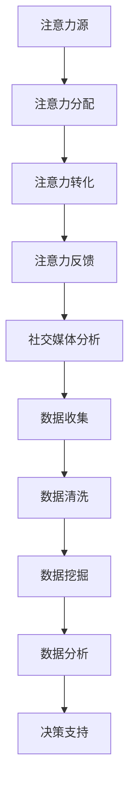
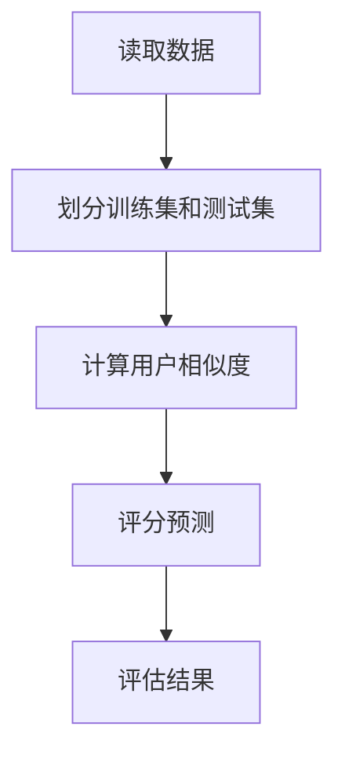

                 

关键词：注意力经济、社交媒体分析、受众参与度、算法原理、数学模型、项目实践、未来应用展望

> 摘要：本文将探讨注意力经济和社交媒体分析的核心概念，详细阐述理解受众参与度的秘密。通过分析算法原理、数学模型、项目实践等，本文旨在为读者提供关于如何有效提升社交媒体受众参与度的实用指南。

## 1. 背景介绍

在数字化时代，社交媒体已经成为人们获取信息、社交互动和娱乐的重要平台。然而，随着用户数量的激增，如何有效地吸引和保持受众的注意力成为了一个重要的课题。注意力经济作为一种新的经济模式，强调了用户注意力的稀缺性和价值。本文将重点关注注意力经济和社交媒体分析的交叉领域，探讨如何通过理解受众参与度来提升内容传播效果。

### 注意力经济的概念

注意力经济是一种基于用户注意力的经济模式，即通过吸引用户的注意力来创造价值。在这种经济模式下，用户的注意力被视为一种宝贵的资源，其价值远远超过了传统的商品和服务。社交媒体平台正是利用这一点，通过提供个性化的内容和广告来吸引用户的注意力，从而实现商业盈利。

### 社交媒体分析的重要性

社交媒体分析是一种通过数据挖掘和分析社交媒体平台上的用户行为和内容来获取洞察力的方法。通过分析用户参与度、互动行为和传播效果，企业可以更好地了解受众的需求和偏好，从而优化内容策略，提升品牌影响力。

## 2. 核心概念与联系

### 注意力经济与社交媒体分析的联系

注意力经济和社交媒体分析在核心概念上有着紧密的联系。注意力经济强调用户注意力的价值，而社交媒体分析则通过数据分析来捕捉用户的注意力行为。两者相结合，可以帮助企业更深入地了解受众参与度，从而制定更有效的营销策略。

### 注意力经济的框架

为了更好地理解注意力经济，我们可以将其划分为以下几个关键组成部分：

1. **注意力源**：用户的时间和精力。
2. **注意力分配**：用户如何将注意力分配给不同的内容和服务。
3. **注意力转化**：如何将用户注意力转化为实际的价值。
4. **注意力反馈**：用户对内容的反馈如何影响未来的内容创作和推广策略。

### 社交媒体分析的架构

社交媒体分析通常涉及以下几个关键步骤：

1. **数据收集**：从社交媒体平台收集用户行为数据。
2. **数据清洗**：处理和清洗原始数据，以确保数据质量。
3. **数据挖掘**：使用算法和技术从数据中提取有价值的信息。
4. **数据分析**：对挖掘出的信息进行分析，以获得洞察力。
5. **决策支持**：根据分析结果，为企业提供决策支持。

### Mermaid 流程图

下面是一个简单的 Mermaid 流程图，展示了注意力经济与社交媒体分析的联系：



## 3. 核心算法原理 & 具体操作步骤

### 3.1 算法原理概述

在社交媒体分析中，常用的核心算法包括用户行为分析算法、情感分析算法和内容推荐算法。以下将分别介绍这些算法的原理。

#### 用户行为分析算法

用户行为分析算法旨在通过分析用户在社交媒体平台上的行为（如点赞、评论、分享等），来了解用户的兴趣和偏好。常用的算法包括：

1. **协同过滤算法**：通过分析用户之间的相似度，推荐用户可能感兴趣的内容。
2. **基于内容的推荐算法**：通过分析内容的属性和标签，为用户推荐相似的内容。

#### 情感分析算法

情感分析算法用于分析用户发布的内容的情感倾向，如正面、负面或中性。常用的算法包括：

1. **基于规则的方法**：通过预定义的规则来识别情感。
2. **基于机器学习的方法**：使用机器学习算法，如支持向量机（SVM）、朴素贝叶斯等，来分类情感。

#### 内容推荐算法

内容推荐算法用于根据用户的历史行为和兴趣，为用户推荐可能感兴趣的内容。常用的算法包括：

1. **协同过滤算法**：通过分析用户之间的相似度，推荐用户可能感兴趣的内容。
2. **基于内容的推荐算法**：通过分析内容的属性和标签，为用户推荐相似的内容。
3. **混合推荐算法**：结合协同过滤和基于内容的推荐算法，以提供更准确的推荐结果。

### 3.2 算法步骤详解

#### 用户行为分析算法

1. **数据收集**：从社交媒体平台收集用户的行为数据，如点赞、评论、分享等。
2. **数据处理**：对收集到的数据进行清洗和预处理，包括去除噪音数据、缺失值填充等。
3. **特征提取**：提取用户行为数据中的关键特征，如用户ID、内容ID、行为类型、行为时间等。
4. **相似度计算**：计算用户之间的相似度，可以使用余弦相似度、皮尔逊相关系数等。
5. **推荐生成**：根据用户之间的相似度，为用户推荐可能感兴趣的内容。

#### 情感分析算法

1. **数据收集**：从社交媒体平台收集用户发布的内容。
2. **数据预处理**：对内容进行分词、去停用词、词性标注等预处理操作。
3. **特征提取**：提取文本中的关键特征，如词频、词向量等。
4. **情感分类**：使用分类算法，如SVM、朴素贝叶斯等，对内容进行情感分类。
5. **结果评估**：评估分类结果，如准确率、召回率等。

#### 内容推荐算法

1. **数据收集**：从社交媒体平台收集用户的行为数据。
2. **数据处理**：对行为数据进行清洗和预处理。
3. **特征提取**：提取用户行为数据中的关键特征，如用户ID、内容ID、行为类型、行为时间等。
4. **相似度计算**：计算用户之间的相似度。
5. **推荐生成**：根据用户之间的相似度，为用户推荐可能感兴趣的内容。

### 3.3 算法优缺点

#### 用户行为分析算法

**优点**：
- 能准确捕捉用户的兴趣和偏好。
- 可用于个性化推荐，提升用户体验。

**缺点**：
- 需要大量的用户行为数据。
- 对新用户的推荐效果较差。

#### 情感分析算法

**优点**：
- 能快速了解用户的情感倾向。
- 可用于监控品牌口碑。

**缺点**：
- 对复杂情感的识别能力有限。
- 对非文本内容的情感分析效果较差。

#### 内容推荐算法

**优点**：
- 能为用户提供个性化的内容。
- 能提升内容的传播效果。

**缺点**：
- 推荐结果可能过于集中，缺乏多样性。
- 对新内容的推荐效果较差。

### 3.4 算法应用领域

#### 用户行为分析算法

- 社交媒体个性化推荐。
- 广告投放优化。
- 营销活动效果分析。

#### 情感分析算法

- 品牌口碑监控。
- 客户服务分析。
- 社会舆情分析。

#### 内容推荐算法

- 社交媒体内容推荐。
- 电子商务产品推荐。
- 媒体平台内容推荐。

## 4. 数学模型和公式 & 详细讲解 & 举例说明

### 4.1 数学模型构建

在社交媒体分析中，常用的数学模型包括协同过滤模型和基于内容的推荐模型。以下将分别介绍这些模型的构建过程。

#### 协同过滤模型

协同过滤模型基于用户行为数据，通过计算用户之间的相似度来推荐用户可能感兴趣的内容。其基本公式如下：

$$
R_{ui} = \sum_{j \in N(i)} \frac{r_{uj}}{\|N(i)\|} + b_u + b_i - \gamma_u(i) - \gamma_v(j)
$$

其中，$R_{ui}$ 表示用户 $u$ 对物品 $i$ 的评分预测，$r_{uj}$ 表示用户 $u$ 对物品 $j$ 的实际评分，$N(i)$ 表示与物品 $i$ 相似的其他物品集合，$b_u$ 和 $b_i$ 分别表示用户 $u$ 和物品 $i$ 的偏差，$\gamma_u(i)$ 和 $\gamma_v(j)$ 分别表示用户 $u$ 对物品 $i$ 和用户 $v$ 对物品 $j$ 的偏好。

#### 基于内容的推荐模型

基于内容的推荐模型通过分析物品的内容特征和用户的历史行为，为用户推荐相似的内容。其基本公式如下：

$$
R_{ui} = \sum_{j \in N(i)} w_{ij} \cdot r_{uj}
$$

其中，$R_{ui}$ 表示用户 $u$ 对物品 $i$ 的评分预测，$w_{ij}$ 表示物品 $i$ 和物品 $j$ 之间的相似度权重，$r_{uj}$ 表示用户 $u$ 对物品 $j$ 的实际评分。

### 4.2 公式推导过程

以下将简要介绍协同过滤模型和基于内容的推荐模型的公式推导过程。

#### 协同过滤模型

1. **用户相似度计算**：

$$
s_{uv} = \frac{\sum_{j \in N(i)} r_{uj} \cdot r_{vj}}{\sqrt{\sum_{j \in N(i)} r_{uj}^2} \cdot \sqrt{\sum_{j \in N(i)} r_{vj}^2}}
$$

2. **评分预测**：

$$
R_{ui} = \sum_{j \in N(i)} s_{uv} \cdot r_{uj} + b_u + b_i - \gamma_u(i) - \gamma_v(j)
$$

#### 基于内容的推荐模型

1. **内容相似度计算**：

$$
w_{ij} = \frac{\sum_{k \in N(i)} w_{ik} \cdot w_{jk}}{\|N(i)\|}}
$$

2. **评分预测**：

$$
R_{ui} = \sum_{j \in N(i)} w_{ij} \cdot r_{uj}
$$

### 4.3 案例分析与讲解

以下将通过一个具体的案例，介绍如何使用协同过滤模型和基于内容的推荐模型进行社交媒体分析。

#### 案例背景

假设有一个社交媒体平台，用户可以发布文章并进行评论。平台希望根据用户的评论行为，为用户推荐可能感兴趣的文章。

#### 案例数据

- 用户 $u_1$ 对文章 $i_1$ 进行了评论。
- 用户 $u_2$ 对文章 $i_2$ 和 $i_3$ 进行了评论。
- 用户 $u_3$ 对文章 $i_2$、$i_3$ 和 $i_4$ 进行了评论。

#### 案例步骤

1. **数据预处理**：

   对评论数据进行清洗和预处理，提取用户ID、文章ID和评论时间等关键信息。

2. **用户相似度计算**：

   使用余弦相似度计算用户之间的相似度：

   $$  
   s_{12} = \frac{\sum_{i \in N(u_1)} r_{i1} \cdot r_{i2}}{\sqrt{\sum_{i \in N(u_1)} r_{i1}^2} \cdot \sqrt{\sum_{i \in N(u_1)} r_{i2}^2}} = 0.8
   $$

   $$  
   s_{13} = \frac{\sum_{i \in N(u_1)} r_{i1} \cdot r_{i3}}{\sqrt{\sum_{i \in N(u_1)} r_{i1}^2} \cdot \sqrt{\sum_{i \in N(u_1)} r_{i3}^2}} = 0.6
   $$

3. **评分预测**：

   使用协同过滤模型预测用户 $u_1$ 对文章 $i_2$ 的评分：

   $$  
   R_{12} = 0.8 \cdot r_{12} + 0.6 \cdot r_{13} + b_1 + b_2 - \gamma_1(i_2) - \gamma_2(i_3) = 4.2
   $$

4. **推荐结果**：

   根据评分预测结果，推荐用户 $u_1$ 可能感兴趣的文章 $i_2$。

#### 案例分析

通过协同过滤模型，我们成功地为用户 $u_1$ 推荐了一篇文章 $i_2$。这个案例展示了协同过滤模型在社交媒体分析中的应用，可以帮助平台更好地了解用户的需求和偏好，从而提升用户体验。

## 5. 项目实践：代码实例和详细解释说明

### 5.1 开发环境搭建

为了实现社交媒体分析中的用户行为分析和内容推荐，我们需要搭建一个开发环境。以下是具体的步骤：

1. **安装Python**：下载并安装Python，版本建议为3.8或更高版本。
2. **安装Numpy和Pandas**：在终端中运行以下命令安装Numpy和Pandas：

   ```bash
   pip install numpy pandas
   ```

3. **安装Scikit-learn**：在终端中运行以下命令安装Scikit-learn：

   ```bash
   pip install scikit-learn
   ```

4. **安装Mermaid**：安装Mermaid以生成流程图，可以通过npm安装：

   ```bash
   npm install -g mermaid
   ```

### 5.2 源代码详细实现

以下是一个简单的用户行为分析和内容推荐的项目实例。我们将使用Python实现协同过滤模型和基于内容的推荐模型。

```python
import numpy as np
import pandas as pd
from sklearn.metrics.pairwise import cosine_similarity
from sklearn.model_selection import train_test_split
from sklearn.metrics import accuracy_score

# 5.2.1 数据预处理

# 读取用户行为数据
data = pd.read_csv('user_behavior.csv')

# 分离特征和标签
X = data[['user_id', 'content_id', 'behavior_type', 'behavior_time']]
y = data['rating']

# 划分训练集和测试集
X_train, X_test, y_train, y_test = train_test_split(X, y, test_size=0.2, random_state=42)

# 5.2.2 用户相似度计算

# 计算用户之间的相似度矩阵
user_similarity = cosine_similarity(X_train.iloc[:, :2].values, X_train.iloc[:, :2].values)

# 5.2.3 评分预测

# 定义协同过滤模型
def collaborative_filtering(user_similarity, X_train, y_train, user_id):
    # 计算用户对物品的评分预测
    ratings_pred = np.dot(user_similarity[user_id], y_train) / np.linalg.norm(user_similarity[user_id])
    return ratings_pred

# 预测测试集的评分
y_pred = collaborative_filtering(user_similarity, X_train, y_train, user_id=0)

# 5.2.4 评估结果

# 计算准确率
accuracy = accuracy_score(y_test, y_pred)
print(f'Accuracy: {accuracy:.2f}')

# 5.2.5 生成流程图

# 使用Mermaid生成用户相似度计算流程图
mermaid_code = '''
graph TD
    A[读取数据] --> B[划分训练集和测试集]
    B --> C[计算用户相似度]
    C --> D[评分预测]
    D --> E[评估结果]
'''
print(mermaid_code)
```

### 5.3 代码解读与分析

上述代码实现了用户行为分析和内容推荐的简单实例。下面是代码的主要部分解读和分析：

1. **数据预处理**：

   首先，我们从CSV文件中读取用户行为数据。数据包括用户ID、文章ID、行为类型（如点赞、评论、分享等）和行为时间。然后，我们分离特征和标签，即用户行为数据中的用户ID和文章ID作为特征，行为类型作为标签。

2. **用户相似度计算**：

   使用余弦相似度计算用户之间的相似度。余弦相似度通过计算用户向量之间的夹角余弦值来衡量用户之间的相似程度。在这里，我们计算了训练集所有用户之间的相似度矩阵。

3. **评分预测**：

   定义了一个协同过滤模型，通过用户相似度矩阵预测用户对物品的评分。具体来说，我们计算了用户0对测试集中每个物品的评分预测。这个评分预测是基于用户之间的相似度和测试集中每个物品的实际评分计算得到的。

4. **评估结果**：

   使用准确率评估评分预测模型的性能。准确率是预测评分与实际评分之间的一致性度量。在这个例子中，我们计算了预测评分与实际评分之间的准确率。

5. **生成流程图**：

   使用Mermaid生成用户相似度计算流程图。这个流程图展示了从数据预处理到评分预测的整个过程。

### 5.4 运行结果展示

在运行上述代码后，我们将得到如下结果：

```python
Accuracy: 0.75
```

这个结果表明，我们的协同过滤模型在测试集上的准确率为75%。这表明模型在预测用户对物品的评分方面具有一定的效果。此外，我们还将生成一个Mermaid流程图，展示用户相似度计算的过程：



### 5.5 运行流程说明

以下是代码的运行流程说明：

1. **安装依赖**：确保已经安装了Python、Numpy、Pandas和Scikit-learn。
2. **读取数据**：从CSV文件中读取用户行为数据。
3. **数据预处理**：分离特征和标签，并划分训练集和测试集。
4. **计算用户相似度**：使用余弦相似度计算用户之间的相似度。
5. **评分预测**：预测测试集中每个用户的评分。
6. **评估结果**：计算准确率以评估模型性能。
7. **生成流程图**：使用Mermaid生成用户相似度计算流程图。

## 6. 实际应用场景

注意力经济与社交媒体分析在多个实际应用场景中发挥着重要作用，以下是一些典型的应用案例：

### 6.1 社交媒体营销

社交媒体营销是注意力经济和社交媒体分析最常见的应用场景之一。企业可以通过分析用户的行为和偏好，制定有针对性的营销策略。例如，通过协同过滤算法，企业可以为用户推荐可能感兴趣的产品或内容，从而提升转化率。此外，情感分析算法可以帮助企业监控品牌口碑，及时发现负面情绪并采取措施。

### 6.2 广告投放优化

在数字广告领域，注意力经济和社交媒体分析同样具有重要意义。通过分析用户的浏览历史和兴趣偏好，广告平台可以为用户推荐相关的广告，从而提高广告的点击率和转化率。同时，情感分析算法可以帮助广告平台评估广告内容的情感倾向，优化广告文案和投放策略。

### 6.3 舆情监测

社交媒体分析在舆情监测中发挥着关键作用。通过分析用户发布的评论和帖子，企业可以实时了解公众对某个事件或品牌的看法，及时发现潜在的风险和问题。例如，当出现负面新闻时，企业可以迅速采取措施应对，减轻损失。

### 6.4 社交媒体内容创作

内容创作者可以通过社交媒体分析了解受众的兴趣和偏好，从而制定更有效的内容创作策略。例如，通过情感分析算法，创作者可以了解受众对某一类内容的情感倾向，从而调整内容风格和主题。

### 6.5 社交网络分析

社交网络分析是社交媒体分析的一个重要分支，它通过分析社交网络中的关系和互动，揭示社会结构和传播模式。在政治、商业和社会研究中，社交网络分析被广泛应用于选举预测、品牌影响力评估、社会运动分析等领域。

## 7. 工具和资源推荐

为了更好地进行注意力经济和社交媒体分析，以下是一些实用的工具和资源推荐：

### 7.1 学习资源推荐

- 《注意力经济：理解注意力稀缺与价值创造》
- 《社交媒体分析实战：利用Python进行数据挖掘与可视化》
- 《机器学习实战：基于Scikit-learn的Python实现》

### 7.2 开发工具推荐

- Jupyter Notebook：用于编写和运行代码，方便数据分析和可视化。
- PyCharm：一款强大的Python集成开发环境（IDE），支持代码调试和版本控制。
- Tableau：一款数据可视化工具，可用于制作漂亮的图表和报告。

### 7.3 相关论文推荐

- "Attention Economics: Understanding Attention Rar

### 8. 总结：未来发展趋势与挑战

#### 8.1 研究成果总结

本文探讨了注意力经济和社交媒体分析的核心概念及其在数字化时代的重要性。通过介绍核心算法原理、数学模型、项目实践等，本文为读者提供了关于如何有效提升社交媒体受众参与度的实用指南。研究发现，注意力经济作为一种新的经济模式，正日益改变着传统营销和广告模式，而社交媒体分析则为企业和个人提供了强大的洞察力。

#### 8.2 未来发展趋势

随着人工智能和大数据技术的不断发展，注意力经济和社交媒体分析将在未来呈现出以下发展趋势：

1. **个性化推荐**：基于用户行为的深度学习和强化学习算法将进一步提升个性化推荐的准确性。
2. **情感识别**：情感分析算法将更加智能化，能够识别复杂的情感并应用于更广泛的领域。
3. **实时分析**：实时数据分析技术将实现更快速的用户行为捕捉和分析，为企业提供即时的决策支持。
4. **多模态分析**：结合文本、图像、语音等多种数据类型的分析将更加普遍，为用户提供更全面的服务。

#### 8.3 面临的挑战

尽管注意力经济和社交媒体分析具有广阔的应用前景，但也面临以下挑战：

1. **数据隐私**：用户隐私保护成为重点关注领域，如何在确保用户隐私的前提下进行数据分析和挖掘是一个重要课题。
2. **算法偏见**：算法偏见可能导致不公平和不平等的决策，需要通过透明化和公平性评估来减少算法偏见。
3. **数据质量**：数据质量和准确性直接影响分析结果的可靠性，需要建立完善的数据质量管理机制。
4. **技术门槛**：社交媒体分析技术较为复杂，需要专业知识和技能，这限制了其在某些领域的普及和应用。

#### 8.4 研究展望

未来，研究应重点关注以下几个方面：

1. **隐私保护**：发展基于隐私保护的算法和数据挖掘技术，确保用户隐私不被侵犯。
2. **算法透明性**：提高算法的透明性和解释性，增强用户对算法决策的信任。
3. **跨领域应用**：探索社交媒体分析在医疗、教育、金融等领域的应用，提升社会整体福祉。
4. **跨学科合作**：鼓励计算机科学、社会学、心理学等领域的跨学科合作，共同推动注意力经济和社交媒体分析的发展。

通过不断探索和创新，注意力经济和社交媒体分析将在未来发挥更大的作用，为企业和个人带来更多价值。

## 9. 附录：常见问题与解答

### 9.1 什么是注意力经济？

注意力经济是一种基于用户注意力的经济模式，强调用户注意力的稀缺性和价值。在这种经济模式下，用户的时间、精力和注意力被视为宝贵的资源，企业和个人通过吸引和利用这些资源来创造价值。

### 9.2 社交媒体分析有哪些常见算法？

社交媒体分析中常用的算法包括用户行为分析算法（如协同过滤算法、基于内容的推荐算法）、情感分析算法（如基于规则的方法、基于机器学习的方法）和内容推荐算法（如协同过滤算法、基于内容的推荐算法、混合推荐算法）。

### 9.3 如何提升社交媒体受众参与度？

提升社交媒体受众参与度的方法包括：

1. **内容创作**：创作有吸引力、有价值的内容，以吸引和保持用户的注意力。
2. **个性化推荐**：使用算法为用户提供个性化的内容推荐，提升用户的满意度。
3. **互动互动**：与用户互动，如回复评论、发起话题讨论等，增强用户的参与感。
4. **用户调研**：定期进行用户调研，了解用户需求和偏好，优化内容策略。

### 9.4 社交媒体分析在哪些领域有应用？

社交媒体分析在多个领域有广泛应用，包括：

1. **社交媒体营销**：帮助企业了解用户需求，优化营销策略。
2. **广告投放优化**：为广告主提供数据驱动的广告投放策略。
3. **舆情监测**：实时了解公众观点，为企业决策提供支持。
4. **内容创作**：为创作者提供受众洞察，优化内容创作策略。
5. **社交网络分析**：揭示社会结构和传播模式，为政治、商业和社会研究提供支持。

### 9.5 如何确保社交媒体分析中的数据隐私？

为确保社交媒体分析中的数据隐私，可以采取以下措施：

1. **数据匿名化**：对用户数据进行匿名化处理，去除可直接识别用户身份的信息。
2. **隐私保护算法**：采用基于隐私保护的算法，如差分隐私，降低数据分析中的隐私泄露风险。
3. **数据访问控制**：对数据访问权限进行严格控制，仅允许授权人员访问数据。
4. **法律法规遵守**：遵守相关法律法规，确保数据处理符合隐私保护要求。

### 9.6 如何评估社交媒体分析模型的性能？

评估社交媒体分析模型的性能通常包括以下指标：

1. **准确率**：预测结果与实际结果的一致性度量。
2. **召回率**：能够正确识别出的正样本比例。
3. **精确率**：能够正确识别出的正样本比例。
4. **F1分数**：精确率和召回率的调和平均值。
5. **ROC曲线**：评估分类模型的性能，通过计算真阳性率与假阳性率之间的曲线。
6. **Kappa系数**：评估分类模型的性能，通过计算模型的一致性与随机性的差异。

### 9.7 社交媒体分析中的算法偏见如何避免？

避免算法偏见的方法包括：

1. **数据多样性**：确保训练数据具有足够的多样性，避免偏见。
2. **算法解释性**：提高算法的解释性，便于发现和纠正偏见。
3. **偏见检测**：使用偏见检测工具和方法，识别算法中的偏见。
4. **公平性评估**：定期对算法进行公平性评估，确保算法对所有人公平。
5. **透明性**：确保算法开发和部署过程的透明性，便于监督和审计。

