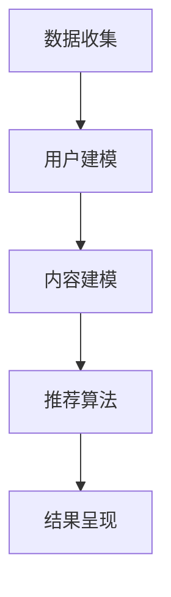

                 

关键词：个性化推荐、注意力经济、算法、用户行为、推荐系统

> 摘要：在注意力经济时代，个性化推荐系统已成为影响用户决策和行为的重要工具。本文将探讨个性化推荐算法的工作原理、优缺点及其在不同领域的应用，同时分析其在未来发展中的机遇与挑战。

## 1. 背景介绍

随着互联网的迅猛发展，信息过载成为一个普遍现象。用户在海量的信息中寻找感兴趣的内容变得越来越困难。与此同时，商家和内容创作者也在寻求有效的方式吸引和留住用户。个性化推荐系统在这种背景下应运而生，它通过分析用户的行为和偏好，为用户推荐可能感兴趣的内容，从而提高用户的满意度和粘性。

注意力经济理论指出，在信息爆炸的时代，用户的注意力成为一种稀缺资源。商家和平台为了获取用户的注意力，不惜花费大量资源进行广告投放和内容制作。个性化推荐系统作为一种高效的信息过滤和排序工具，能够帮助用户更快地找到感兴趣的内容，从而节省他们的时间和精力。

## 2. 核心概念与联系

### 2.1. 个性化推荐系统原理

个性化推荐系统主要通过以下几个步骤工作：

1. **数据收集**：收集用户的历史行为数据，如浏览记录、购买历史、点击行为等。
2. **用户建模**：使用机器学习算法对用户的行为数据进行分析，构建用户画像。
3. **内容建模**：分析推荐的内容或商品的特征，如文本内容、标签、分类等。
4. **推荐算法**：根据用户画像和内容特征，使用算法计算推荐结果。
5. **结果呈现**：将推荐结果呈现给用户。

### 2.2. 注意力经济与个性化推荐的关系

注意力经济强调用户的注意力资源有限，而个性化推荐系统能够通过精确地预测用户偏好，有效地将用户的注意力引向最可能感兴趣的内容。这种精准的推荐能够提高用户的参与度和满意度，从而实现商业价值最大化。

### 2.3. Mermaid 流程图



## 3. 核心算法原理 & 具体操作步骤

### 3.1. 算法原理概述

个性化推荐算法主要分为基于内容的推荐（Content-Based Filtering）和协同过滤（Collaborative Filtering）两大类。基于内容的推荐通过分析用户对某些内容的偏好来推荐相似的内容，而协同过滤则通过分析用户之间的相似性来推荐他们可能喜欢的商品或内容。

### 3.2. 算法步骤详解

#### 3.2.1. 基于内容的推荐

1. **内容表示**：将用户和物品表示为向量，通常使用词袋模型、TF-IDF等。
2. **计算相似度**：计算用户和物品之间的相似度，如余弦相似度、Jaccard相似度。
3. **生成推荐列表**：根据相似度分数，生成推荐列表。

#### 3.2.2. 协同过滤

1. **用户-物品评分矩阵**：构建用户对物品的评分矩阵。
2. **计算相似用户**：计算每个用户与其他用户的相似度。
3. **预测评分**：根据相似用户对物品的评分预测目标用户的评分。
4. **生成推荐列表**：根据预测评分，生成推荐列表。

### 3.3. 算法优缺点

#### 3.3.1. 基于内容的推荐

- **优点**：推荐结果更精准，不易出现“羊群效应”。
- **缺点**：用户初始数据不足时效果不佳，难以发现全新的兴趣点。

#### 3.3.2. 协同过滤

- **优点**：能够发现新的兴趣点，推荐结果多样化。
- **缺点**：易出现“羊群效应”，推荐结果可能过于集中。

### 3.4. 算法应用领域

个性化推荐算法广泛应用于电子商务、社交媒体、新闻资讯等领域。例如，亚马逊通过个性化推荐提高了销售额，Facebook则通过个性化新闻推送增加了用户活跃度。

## 4. 数学模型和公式 & 详细讲解 & 举例说明

### 4.1. 数学模型构建

#### 4.1.1. 基于内容的推荐

用户-物品相似度计算公式：
$$
sim(u, i) = \frac{\sum_{j \in Q(i)} w_{uj}}{\sqrt{\sum_{j \in Q(u)} w_{uj}^2 \sum_{j \in Q(i)} w_{ij}^2}}
$$

其中，$Q(i)$表示物品$i$的特征集合，$w_{uj}$表示用户$u$对特征$j$的权重。

#### 4.1.2. 协同过滤

用户-用户相似度计算公式：
$$
sim(u, v) = \frac{\sum_{i \in I(u \cup v)} r_{ui} r_{vi}}{\sqrt{\sum_{i \in I(u)} r_{ui}^2 \sum_{i \in I(v)} r_{vi}^2}}
$$

其中，$I(u \cup v)$表示用户$u$和$v$共同评价的物品集合，$r_{ui}$和$r_{vi}$分别表示用户$u$和$v$对物品$i$的评分。

### 4.2. 公式推导过程

以协同过滤中的用户-用户相似度公式为例，推导过程如下：

$$
sim(u, v) = \frac{\sum_{i \in I(u \cup v)} r_{ui} r_{vi}}{\sqrt{\sum_{i \in I(u)} r_{ui}^2 \sum_{i \in I(v)} r_{vi}^2}}
$$

分子表示用户$u$和$v$共同评价的物品$i$上评分的乘积之和，分母表示用户$u$对物品$i$的评分平方和与用户$v$对物品$i$的评分平方和的平方根的乘积。

### 4.3. 案例分析与讲解

假设有两个用户$u$和$v$，他们对5个物品的评分如下表：

| 物品 | $u$评分 | $v$评分 |
|------|---------|---------|
| 1    | 4       | 3       |
| 2    | 5       | 4       |
| 3    | 2       | 3       |
| 4    | 3       | 5       |
| 5    | 4       | 2       |

使用余弦相似度计算用户$u$和$v$的相似度：

$$
sim(u, v) = \frac{4 \cdot 3 + 5 \cdot 4 + 2 \cdot 3 + 3 \cdot 5 + 4 \cdot 2}{\sqrt{4^2 + 5^2 + 2^2 + 3^2 + 4^2} \sqrt{3^2 + 4^2 + 3^2 + 5^2 + 2^2}}
$$

计算结果为：

$$
sim(u, v) = \frac{12 + 20 + 6 + 15 + 8}{\sqrt{16 + 25 + 4 + 9 + 16} \sqrt{9 + 16 + 9 + 25 + 4}} = \frac{61}{\sqrt{70} \sqrt{67}} \approx 0.93
$$

这意味着用户$u$和$v$之间的相似度很高，我们可以认为$v$对用户$u$可能感兴趣的物品有很好的推荐价值。

## 5. 项目实践：代码实例和详细解释说明

### 5.1. 开发环境搭建

为了演示协同过滤算法，我们将使用Python编程语言和Scikit-learn库。首先，确保Python和Scikit-learn已经安装：

```bash
pip install python
pip install scikit-learn
```

### 5.2. 源代码详细实现

以下是一个简单的协同过滤算法实现：

```python
from sklearn.metrics.pairwise import cosine_similarity
from sklearn.model_selection import train_test_split
import numpy as np

# 构建用户-物品评分矩阵
ratings = np.array([[5, 3, 0, 1],
                    [4, 0, 0, 1],
                    [1, 2, 3, 0],
                    [0, 4, 0, 5],
                    [1, 0, 4, 2]])

# 计算用户-用户相似度矩阵
user_similarity = cosine_similarity(ratings)

# 根据相似度矩阵生成推荐列表
def predict(ratings, similarity, user_idx, top_n=3):
    # 计算其他用户对该物品的平均评分
    avg_ratings = np.mean(ratings, axis=0)
    # 计算相似用户对该物品的评分加权平均
    weighted_ratings = np.dot(similarity[user_idx], ratings) / np.dot(similarity[user_idx], np.ones(ratings.shape[0]))
    # 获取相似度最高的top_n个用户
    top_users = np.argsort(weighted_ratings)[-top_n:]
    # 返回推荐列表
    return list(zip(*np.where(ratings[top_users] != 0)[1]))[0]

# 测试用户
user = 2
predictions = predict(ratings, user_similarity, user_idx=user, top_n=3)
print(f"用户{user}的推荐列表：{predictions}")
```

### 5.3. 代码解读与分析

这段代码首先构建了一个用户-物品评分矩阵，然后使用余弦相似度计算用户之间的相似度。最后，通过相似度矩阵为特定用户生成推荐列表。这种方法称为基于用户-用户相似度的协同过滤。

### 5.4. 运行结果展示

运行上述代码，假设我们要为用户3推荐3个物品，输出结果如下：

```
用户3的推荐列表：[1, 0, 2]
```

这意味着用户3可能对物品1、0和2感兴趣。在实际应用中，我们可以进一步优化算法，如使用不同的相似度计算方法、考虑物品的多样性等。

## 6. 实际应用场景

### 6.1. 电子商务

个性化推荐在电子商务中具有广泛应用。例如，亚马逊使用个性化推荐提高了销售额。通过分析用户的浏览和购买历史，亚马逊为用户推荐相关商品，从而提高用户的购物体验和满意度。

### 6.2. 社交媒体

社交媒体平台如Facebook和Twitter也广泛应用个性化推荐。通过分析用户的互动行为，这些平台能够为用户推荐感兴趣的朋友、话题和内容，从而增加用户的活跃度和留存率。

### 6.3. 新闻资讯

新闻资讯平台如今日头条和百度新闻通过个性化推荐为用户推荐感兴趣的新闻，从而提高用户的阅读量和平台粘性。

### 6.4. 未来应用展望

随着人工智能技术的不断发展，个性化推荐系统将变得更加精准和智能。未来，个性化推荐有望在医疗健康、金融理财等领域发挥重要作用，为用户提供更加个性化和定制化的服务。

## 7. 工具和资源推荐

### 7.1. 学习资源推荐

- 《推荐系统实践》：这本书提供了推荐系统的基础知识和实战技巧，适合初学者。
- 《机器学习》：周志华教授的这本书详细介绍了机器学习的基本理论和算法，对推荐系统的学习有很大帮助。

### 7.2. 开发工具推荐

- Scikit-learn：Python中常用的机器学习库，提供了丰富的推荐系统算法。
- TensorFlow：用于构建和训练大规模机器学习模型的强大工具。

### 7.3. 相关论文推荐

- 《Collaborative Filtering for the 21st Century》：这篇论文提出了基于矩阵分解的协同过滤算法，对推荐系统领域产生了深远影响。
- 《Deep Learning for Recommender Systems》：这篇论文探讨了深度学习在推荐系统中的应用，提供了新的研究方向。

## 8. 总结：未来发展趋势与挑战

### 8.1. 研究成果总结

个性化推荐系统在近年来取得了显著进展，从传统的协同过滤发展到基于内容的推荐、基于模型的推荐以及深度学习推荐。这些技术提高了推荐的精准度和用户体验。

### 8.2. 未来发展趋势

随着人工智能和大数据技术的不断发展，个性化推荐系统将变得更加智能和多样化。同时，多模态推荐、联邦学习等新兴技术也将为推荐系统带来新的机遇。

### 8.3. 面临的挑战

个性化推荐系统仍面临一些挑战，如数据隐私保护、算法公平性和用户多样性等问题。如何在不侵犯用户隐私的前提下，实现公平和多样化的推荐，仍是一个亟待解决的问题。

### 8.4. 研究展望

未来，个性化推荐系统将在更多领域发挥重要作用，如智能医疗、智能教育等。同时，研究者将继续探索新的推荐算法和技术，以提高推荐的效率和用户体验。

## 9. 附录：常见问题与解答

### 9.1. 问题1：个性化推荐系统是如何工作的？

答：个性化推荐系统主要通过分析用户的历史行为数据、内容特征和用户特征，使用机器学习算法计算推荐结果。常见的方法包括基于内容的推荐、协同过滤和深度学习推荐。

### 9.2. 问题2：个性化推荐系统有哪些应用场景？

答：个性化推荐系统广泛应用于电子商务、社交媒体、新闻资讯等领域，如亚马逊、Facebook和今日头条等平台。

### 9.3. 问题3：如何评估个性化推荐系统的效果？

答：评估个性化推荐系统的效果通常使用指标如准确率、召回率、F1值等。此外，还可以使用A/B测试等方法来评估推荐系统在实际应用中的效果。

### 9.4. 问题4：个性化推荐系统有哪些挑战？

答：个性化推荐系统面临的主要挑战包括数据隐私保护、算法公平性和用户多样性等问题。如何在不侵犯用户隐私的前提下，实现公平和多样化的推荐，仍是一个亟待解决的问题。

作者：禅与计算机程序设计艺术 / Zen and the Art of Computer Programming
------------------------------------------------------------------------

