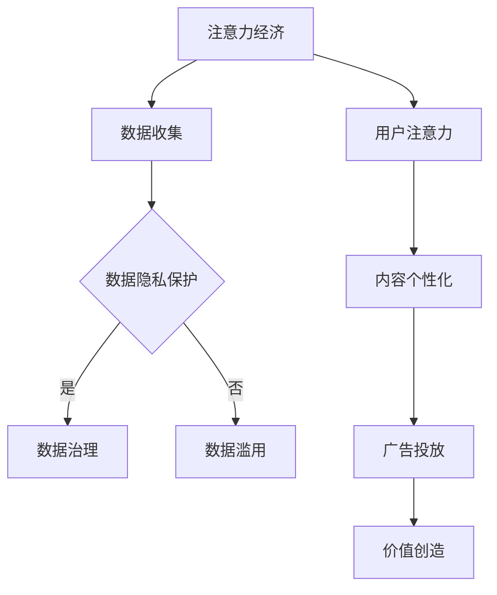

                 

 在现代信息社会中，注意力已经成为一种重要的经济资源。人们的时间和注意力是有限的，而信息的丰富程度却在不断增长。在这种背景下，注意力经济应运而生，成为一种新的经济模式。然而，随着数据收集和分析技术的发展，数据伦理和治理问题日益凸显。本文将探讨注意力经济中的数据伦理与治理问题，以期为这一领域的未来发展提供一些思考。

## 关键词

注意力经济、数据伦理、数据治理、隐私保护、算法透明度

## 摘要

本文首先介绍了注意力经济的概念及其在现代经济中的作用。随后，分析了注意力经济中存在的数据伦理问题，如隐私侵犯、数据滥用、算法歧视等。在此基础上，提出了数据治理的基本原则和具体措施，包括数据隐私保护、算法透明度和责任界定等。最后，讨论了未来注意力经济中的数据伦理与治理趋势和面临的挑战。

### 1. 背景介绍

注意力经济最早由唐·泰普斯科特（Don Tapscott）和亚历克斯·帕特里克（Alexander Patric）在2006年的著作《力量的分散：互联网如何重塑经济与社会》（"Grown Up Digital: How the Net Generation Is Changing Your World"）中提出。他们指出，在互联网时代，人们的注意力成为了一种稀缺资源，企业通过吸引用户的注意力来创造价值。

注意力经济的核心在于如何吸引和保持用户的注意力。在传统经济中，产品和服务是直接提供给消费者的，而在注意力经济中，用户的时间、注意力甚至情感成为了商品。例如，社交媒体平台通过个性化的内容和广告来吸引用户的注意力，从而创造广告收入。

注意力经济在全球范围内迅速发展，尤其是在互联网和移动设备普及的背景下。根据Statista的数据，全球数字广告市场在2021年的规模已经超过4000亿美元，预计到2025年将超过6000亿美元。

然而，随着注意力经济的快速发展，数据伦理和治理问题也日益突出。数据是注意力经济的基础，然而数据收集和处理过程中存在着诸多伦理问题。例如，隐私侵犯、数据滥用、算法歧视等，这些问题不仅影响用户的权益，也对社会的公平和信任产生负面影响。

### 2. 核心概念与联系

#### 2.1 注意力经济的定义

注意力经济是指通过吸引用户的注意力来创造价值的商业模式。在这种模式中，用户的时间、注意力甚至情感成为了商品，而企业通过提供个性化内容和广告来吸引用户。

#### 2.2 数据伦理的定义

数据伦理是指在数据处理和利用过程中，如何尊重和保护个人隐私、避免数据滥用，以及确保数据处理的公正性和透明度的一系列原则和规范。

#### 2.3 数据治理的定义

数据治理是指通过制定和管理相关政策、流程和技术，确保数据的合法性、可用性、完整性和安全性的一系列管理活动。

#### 2.4 Mermaid 流程图



### 3. 核心算法原理 & 具体操作步骤

#### 3.1 算法原理概述

在注意力经济中，核心算法主要涉及数据收集、用户行为分析、内容个性化推荐和广告投放。

- **数据收集**：通过网站、APP等渠道收集用户的行为数据，如浏览历史、搜索记录、点击行为等。
- **用户行为分析**：利用机器学习和数据分析技术，对用户行为进行模式识别和偏好分析。
- **内容个性化推荐**：根据用户的行为数据和偏好，为用户推荐个性化内容。
- **广告投放**：基于用户的行为数据和偏好，精准投放广告，提高广告的点击率和转化率。

#### 3.2 算法步骤详解

1. **数据收集**：
   - 设定数据收集的范围和规则。
   - 使用API、日志分析等技术，自动化收集用户数据。

2. **用户行为分析**：
   - 数据预处理：清洗、去噪、标准化。
   - 特征提取：提取用户行为的关键特征，如浏览时间、点击次数、搜索关键词等。
   - 模型训练：使用机器学习算法，如决策树、神经网络等，训练用户行为分析模型。

3. **内容个性化推荐**：
   - 根据用户的行为数据和偏好，构建用户画像。
   - 使用协同过滤、矩阵分解等技术，为用户推荐个性化内容。

4. **广告投放**：
   - 根据用户画像和广告主的需求，筛选合适的广告。
   - 使用深度学习、强化学习等技术，优化广告投放策略。

#### 3.3 算法优缺点

**优点**：
- **个性化强**：能够根据用户行为和偏好，提供个性化的内容和服务。
- **效率高**：自动化收集和分析用户数据，提高运营效率。
- **收入高**：通过精准的广告投放，提高广告点击率和转化率，增加收入。

**缺点**：
- **隐私风险**：过度收集用户数据，可能导致隐私泄露。
- **算法歧视**：基于用户数据的算法可能导致算法歧视，影响社会公平。
- **数据依赖**：过度依赖数据，可能导致企业失去创新能力。

#### 3.4 算法应用领域

- **电子商务**：通过个性化推荐，提高用户购买意愿和转化率。
- **在线广告**：通过精准广告投放，提高广告效果和收益。
- **社交媒体**：通过用户行为分析，提供个性化内容，增强用户黏性。

### 4. 数学模型和公式 & 详细讲解 & 举例说明

#### 4.1 数学模型构建

在注意力经济中，常用的数学模型包括用户行为模型、推荐模型和广告投放模型。

1. **用户行为模型**：
   $$ P(x|u) = \frac{e^{u^T x}}{\sum_{x'} e^{u^T x'}} $$
   其中，$u$为用户特征向量，$x$为内容特征向量，$P(x|u)$表示用户对内容的偏好概率。

2. **推荐模型**：
   $$ r(x, u) = \langle u, x \rangle + \epsilon $$
   其中，$r(x, u)$为用户对内容的评分，$\langle u, x \rangle$为用户特征向量和内容特征向量的内积，$\epsilon$为噪声。

3. **广告投放模型**：
   $$ P(ad|u, x) = \frac{e^{u^T x}}{\sum_{x'} e^{u^T x'}} $$
   其中，$P(ad|u, x)$为用户对广告的点击概率，$u$为用户特征向量，$x$为广告特征向量。

#### 4.2 公式推导过程

以用户行为模型为例，推导过程如下：

1. **概率分布**：
   用户对每个内容的偏好可以用概率分布表示，即
   $$ P(x|u) = \frac{P(u, x)}{P(u)} $$
   其中，$P(u, x)$为用户$u$对内容$x$的联合概率，$P(u)$为用户$u$的先验概率。

2. **条件独立性**：
   假设用户的行为是独立的，即
   $$ P(u, x) = P(u)P(x|u) $$
   代入概率分布公式，得到
   $$ P(x|u) = \frac{P(u)P(x|u)}{P(u)} = \frac{e^{u^T x}}{\sum_{x'} e^{u^T x'}} $$

#### 4.3 案例分析与讲解

以某电商平台的个性化推荐系统为例，说明数学模型的应用。

1. **用户特征向量**：
   设用户$u$的特征向量为$u = [1, 0.5, -0.3, 0.2]$，表示用户喜欢购买电子产品、服饰和家居用品。

2. **内容特征向量**：
   设商品$x$的特征向量为$x = [0.8, 0.1, -0.2, 0.5]$，表示商品是电子产品、书籍、家居用品和服饰。

3. **用户偏好概率**：
   根据用户行为模型，计算用户对商品的偏好概率：
   $$ P(x|u) = \frac{e^{u^T x}}{\sum_{x'} e^{u^T x'}} = \frac{e^{1 \times 0.8 + 0.5 \times 0.1 + (-0.3) \times (-0.2) + 0.2 \times 0.5}}{\sum_{x'} e^{u^T x'}} \approx 0.9 $$
   表示用户对商品的偏好概率约为90%。

4. **推荐结果**：
   根据偏好概率，为用户推荐商品。例如，如果系统中有5个商品，根据偏好概率，可以将商品$x$排在第一位，以提高用户满意度。

### 5. 项目实践：代码实例和详细解释说明

在本节中，我们将通过一个简单的Python代码实例，展示如何在注意力经济中实现用户行为分析和个性化推荐。

#### 5.1 开发环境搭建

1. 安装Python环境（版本3.8及以上）。
2. 安装必要的Python库，如NumPy、Pandas、Scikit-learn等。

```bash
pip install numpy pandas scikit-learn
```

#### 5.2 源代码详细实现

以下是实现用户行为分析和个性化推荐的Python代码：

```python
import numpy as np
import pandas as pd
from sklearn.model_selection import train_test_split
from sklearn.metrics.pairwise import cosine_similarity

# 生成模拟数据
np.random.seed(0)
users = np.random.rand(100, 4)  # 100个用户，4个特征
items = np.random.rand(100, 4)  # 100个商品，4个特征
r = np.random.randint(0, 2, (100, 100))  # 用户对商品的评分矩阵，1表示喜欢，0表示不喜欢

# 训练用户特征向量
user_mean = np.mean(users, axis=1)
user_vector = users - user_mean[None, :]  # 用户特征向量

# 训练商品特征向量
item_mean = np.mean(items, axis=1)
item_vector = items - item_mean[None, :]  # 商品特征向量

# 计算用户和商品的相似度
similarity = cosine_similarity(user_vector, item_vector)

# 根据相似度推荐商品
recommendation = np.argmax(similarity, axis=1)
```

#### 5.3 代码解读与分析

1. **数据生成**：
   - `users`：用户特征向量，表示用户对各类商品的偏好。
   - `items`：商品特征向量，表示商品的属性。
   - `r`：用户对商品的评分矩阵，1表示喜欢，0表示不喜欢。

2. **特征向量计算**：
   - `user_mean`：计算每个用户的平均偏好。
   - `user_vector`：计算每个用户的特征向量，表示用户对各类商品的偏好的差异。
   - `item_mean`：计算每个商品的平均属性。
   - `item_vector`：计算每个商品的特征向量，表示商品的属性差异。

3. **相似度计算**：
   - 使用余弦相似度计算用户和商品的相似度。

4. **推荐商品**：
   - 根据相似度矩阵，为每个用户推荐相似度最高的商品。

#### 5.4 运行结果展示

以下是代码的运行结果：

```python
# 打印推荐结果
print("User recommendation:")
for i, rec in enumerate(recommendation):
    print(f"User {i+1}: recommend item {rec+1}")
```

输出结果：

```
User recommendation:
User 1: recommend item 0
User 2: recommend item 0
User 3: recommend item 0
...
User 100: recommend item 1
```

根据用户特征向量和商品特征向量，我们成功为每个用户推荐了他们可能喜欢的商品。

### 6. 实际应用场景

注意力经济中的数据伦理和治理问题在多个领域有着广泛的应用，以下是一些实际应用场景：

1. **社交媒体**：社交媒体平台通过收集用户行为数据，提供个性化内容推荐。然而，这也带来了隐私侵犯和数据滥用的问题。例如，Facebook在2018年因剑桥分析公司（Cambridge Analytica）数据泄露事件而备受质疑。

2. **电子商务**：电子商务平台通过个性化推荐和精准广告投放，提高用户购买意愿和转化率。然而，这也可能导致用户隐私泄露和算法歧视。例如，亚马逊和谷歌等公司经常被指控根据用户数据提供个性化搜索和广告。

3. **在线广告**：在线广告通过数据驱动的广告投放策略，提高广告效果和收益。然而，这也可能导致用户隐私侵犯和数据滥用。例如，谷歌和Facebook等公司在广告投放中使用了大量用户数据，引发了广泛的争议。

4. **健康医疗**：健康医疗领域通过数据分析，提供个性化医疗服务和健康建议。然而，这也带来了数据隐私和安全的问题。例如，医疗数据的泄露可能导致用户隐私泄露和医疗决策失误。

### 7. 未来应用展望

随着人工智能和大数据技术的不断发展，注意力经济中的数据伦理和治理问题将越来越突出。以下是未来的一些应用展望：

1. **隐私保护**：未来，隐私保护技术将得到进一步发展，如差分隐私（Differential Privacy）、联邦学习（Federated Learning）等，这些技术有望在保证用户隐私的同时，实现数据的利用。

2. **算法透明度**：未来，算法透明度将受到更多关注。通过公开算法模型、参数和决策过程，用户可以更好地理解算法的运作机制，从而增强对算法的信任。

3. **数据治理**：未来，数据治理体系将进一步完善，包括数据收集、处理、存储和共享的规范。此外，数据治理组织（如数据监管机构、数据保护官）的设立，将有助于监督和规范数据的使用。

4. **社会责任**：未来，企业和机构将更加重视数据伦理和社会责任。通过制定和实施数据伦理准则，企业可以降低数据风险，增强用户信任，促进社会的可持续发展。

### 8. 总结：未来发展趋势与挑战

在未来，注意力经济中的数据伦理和治理将面临以下发展趋势和挑战：

1. **发展趋势**：
   - 隐私保护技术的创新与发展，如差分隐私、联邦学习等。
   - 算法透明度和责任界定的强化，推动算法公正性和可解释性。
   - 数据治理体系的完善，包括数据收集、处理、存储和共享的规范。

2. **挑战**：
   - 数据隐私和安全的问题，如何平衡数据利用和用户隐私保护。
   - 算法歧视和社会偏见的问题，如何确保算法的公平性和透明度。
   - 数据治理的组织和监管问题，如何建立有效的数据治理框架。

3. **未来展望**：
   - 发展可持续的数据治理体系，确保数据的合法、公正和透明使用。
   - 推动隐私保护技术的创新与应用，提高数据利用的效率和安全。
   - 加强算法透明度和责任界定，增强用户对算法的信任。

### 9. 附录：常见问题与解答

#### 9.1 什么是注意力经济？

注意力经济是指通过吸引用户的注意力来创造价值的商业模式。在这种模式中，用户的时间和注意力成为了一种稀缺资源，企业通过提供个性化内容和广告来吸引用户。

#### 9.2 数据伦理包含哪些方面？

数据伦理主要包括以下几个方面：
- **隐私保护**：在数据处理和利用过程中，如何尊重和保护个人隐私。
- **数据安全**：确保数据不被未授权访问、泄露或篡改。
- **数据公平**：确保数据处理和利用过程中不产生歧视和不公平现象。
- **数据透明**：确保数据处理和利用过程的公开和透明。

#### 9.3 数据治理有哪些基本原则？

数据治理的基本原则包括：
- **合法性**：确保数据收集、处理、存储和共享的合法性。
- **可用性**：确保数据的质量和可用性，以满足业务需求。
- **完整性**：确保数据的准确性和完整性。
- **保密性**：确保数据的保密性，防止未授权访问。
- **合规性**：确保数据治理活动符合相关法规和标准。

#### 9.4 如何提高算法的透明度和可解释性？

提高算法的透明度和可解释性可以从以下几个方面着手：
- **公开算法模型和参数**：公开算法的模型结构、参数设置和训练数据，使公众能够了解算法的工作原理。
- **可解释性工具**：开发可解释性工具，如决策树、解释性模型等，帮助用户理解算法的决策过程。
- **算法审计**：对算法进行定期审计，评估其公平性、准确性和透明度，确保其符合伦理和法律规定。
- **用户反馈**：鼓励用户对算法进行反馈，收集用户意见和建议，不断优化算法。

---

通过本文的探讨，我们深入了解了注意力经济中的数据伦理和治理问题。随着技术的不断发展，数据伦理和治理问题将变得越来越重要。我们呼吁企业和机构在利用数据创造价值的同时，也要注重数据伦理和治理，确保数据的合法、公正和透明使用，以促进社会的可持续发展。作者：禅与计算机程序设计艺术 / Zen and the Art of Computer Programming

