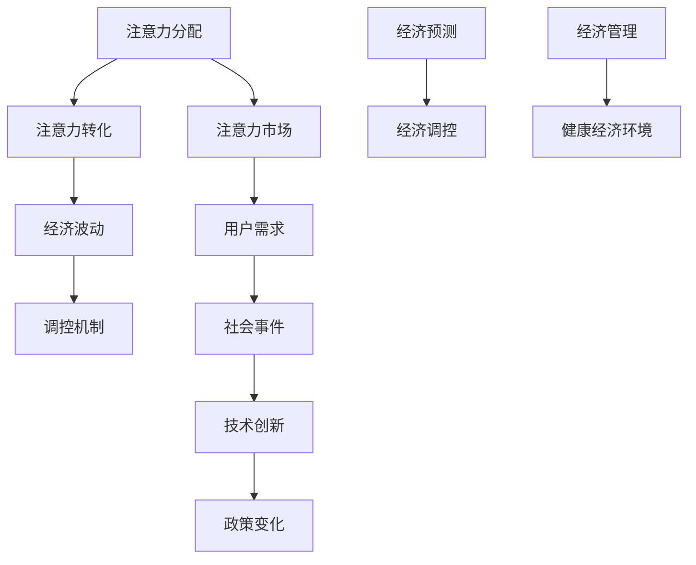

                 

关键词：注意力经济，元宇宙，宏观经济波动，周期理论，算法原理，数学模型，项目实践，应用场景，未来展望。

> 摘要：本文深入探讨了注意力经济周期理论，并分析了这一理论在元宇宙中的宏观经济波动中的应用。文章首先介绍了注意力经济的核心概念和基本原理，然后通过详细的算法原理和数学模型讲解，展示了如何利用注意力经济理论预测和调控元宇宙中的经济波动。此外，文章还通过一个实际项目案例，阐述了注意力经济理论在现实中的应用，并对未来的发展趋势和面临的挑战进行了展望。

## 1. 背景介绍

随着互联网和数字技术的快速发展，元宇宙（Metaverse）的概念逐渐走入人们的视野。元宇宙被定义为一个由物理世界和虚拟世界相结合的扩展现实，它不仅包含了虚拟的社交空间、游戏世界，还包括了数字资产、数字经济等各个方面。在元宇宙中，用户通过虚拟角色进行互动，创造和分享内容，同时参与各种经济活动。

然而，随着元宇宙的发展，宏观经济波动的问题也逐渐显现。如何在元宇宙中实现稳定的经济环境，如何预测和应对经济波动，成为了一个亟待解决的问题。在这个背景下，注意力经济周期理论应运而生。

注意力经济是一种新的经济模式，它以用户的注意力作为价值交换的媒介，通过优化用户注意力的分配，实现经济价值的最优化。而注意力经济周期理论则是基于这一经济模式，研究用户注意力在宏观经济中的波动规律，进而预测和调控经济波动。

## 2. 核心概念与联系

### 注意力经济的核心概念

注意力经济（Attention Economy）是一种以用户注意力为核心的经济模式。在传统的经济模式中，价值交换主要通过物质和货币来实现。而在注意力经济中，用户注意力成为了一种新的价值载体。用户将自己的注意力投入到特定的产品或服务中，从而产生经济价值。

注意力经济的核心概念包括：

1. **注意力分配**：用户将注意力分配给不同的产品或服务，这种分配取决于用户的需求、兴趣和价值观。
2. **注意力转化**：用户将注意力转化为经济价值，例如通过点击广告、购买商品或提供服务。
3. **注意力市场**：用户注意力在市场中进行交换，形成注意力市场。

### 注意力经济周期理论的基本原理

注意力经济周期理论是一种研究用户注意力在宏观经济中波动规律的理论。该理论认为，用户注意力的分配和转化过程，会导致宏观经济中的周期性波动。

注意力经济周期理论的核心原理包括：

1. **注意力波动**：用户注意力的分配是动态变化的，受到多种因素的影响，如社会事件、技术创新、政策变化等。
2. **经济波动**：用户注意力的波动会导致宏观经济中的需求、供给、价格等各个方面的波动。
3. **调控机制**：通过优化用户注意力的分配和转化，可以调控宏观经济波动，实现经济稳定。

### 注意力经济周期理论与元宇宙的关联

在元宇宙中，用户的注意力分配和转化过程具有特殊的重要性。元宇宙作为一个虚拟的扩展现实，用户通过虚拟角色进行互动，创造和分享内容，参与各种经济活动。用户的注意力成为元宇宙中最重要的资源之一，它直接影响元宇宙中的经济运行。

注意力经济周期理论在元宇宙中的应用，主要包括以下几个方面：

1. **经济预测**：通过分析用户注意力的分配和转化，可以预测元宇宙中的经济趋势和波动。
2. **经济调控**：通过优化用户注意力的分配，可以调控元宇宙中的经济波动，实现经济稳定。
3. **经济管理**：注意力经济周期理论为元宇宙中的经济管理提供了一种新的思路和方法，有助于构建健康、稳定的元宇宙经济环境。

### 2.1. Mermaid 流程图



### 2.2. 注意力经济周期理论的应用

注意力经济周期理论在元宇宙中的应用具有广泛的前景。以下是一些具体的案例：

1. **虚拟商品市场**：在元宇宙中，虚拟商品市场是一个重要的经济活动领域。通过注意力经济周期理论，可以预测虚拟商品市场的需求趋势，优化商品定价和库存管理，从而提高市场效率和盈利能力。
2. **数字广告**：数字广告是元宇宙中的一种重要收入来源。通过注意力经济周期理论，可以分析用户注意力在广告投放中的分配，优化广告策略，提高广告效果和投放效率。
3. **虚拟社交网络**：虚拟社交网络是元宇宙中的一种重要社交形式。通过注意力经济周期理论，可以分析用户在社交网络中的注意力分配，优化社交网络的用户体验，提高用户活跃度和黏性。
4. **数字资产管理**：在元宇宙中，数字资产成为了一种重要的资产形式。通过注意力经济周期理论，可以分析数字资产市场的需求变化，预测资产价格波动，优化资产配置策略。

## 3. 核心算法原理 & 具体操作步骤

### 3.1 算法原理概述

注意力经济周期理论的核心算法是一种基于用户行为数据和经济指标的时间序列分析方法。该算法通过分析用户在元宇宙中的注意力分配和转化过程，识别出注意力波动的周期性特征，从而预测和调控宏观经济波动。

算法的基本原理包括：

1. **用户行为数据收集**：通过用户在元宇宙中的行为数据，如浏览记录、互动次数、消费金额等，收集用户注意力分配的详细信息。
2. **时间序列分析**：对用户行为数据进行时间序列分析，识别出注意力波动的周期性特征，如周期长度、振幅等。
3. **宏观经济指标分析**：结合宏观经济指标，如GDP、消费指数、价格指数等，分析注意力波动对宏观经济的影响。
4. **调控策略制定**：根据注意力波动的周期性特征和宏观经济影响，制定相应的调控策略，优化用户注意力分配，实现经济稳定。

### 3.2 算法步骤详解

1. **数据收集**：收集用户在元宇宙中的行为数据，如浏览记录、互动次数、消费金额等。
2. **数据预处理**：对收集到的数据进行预处理，包括数据清洗、数据转换等，确保数据的质量和一致性。
3. **特征提取**：对预处理后的数据进行特征提取，提取出与注意力波动相关的特征，如用户活跃度、消费频率等。
4. **时间序列建模**：利用时间序列分析方法，对提取的特征进行建模，识别出注意力波动的周期性特征。
5. **宏观经济分析**：结合宏观经济指标，分析注意力波动对宏观经济的影响，如需求变化、价格波动等。
6. **调控策略制定**：根据注意力波动的周期性特征和宏观经济影响，制定相应的调控策略，如调整商品定价、优化广告投放等。
7. **策略执行与评估**：执行制定的调控策略，对策略的效果进行评估，并根据评估结果进行调整。

### 3.3 算法优缺点

**优点**：

1. **数据驱动**：基于用户行为数据和经济指标，具有较高的预测准确性和可靠性。
2. **动态调整**：能够根据注意力波动的实时数据，动态调整调控策略，实现经济稳定。
3. **多领域应用**：不仅适用于元宇宙中的经济管理，还可以应用于其他领域的经济预测和调控。

**缺点**：

1. **数据质量要求高**：需要高质量的用户行为数据和经济指标，否则会影响算法的准确性。
2. **计算复杂度高**：时间序列建模和宏观经济分析过程复杂，计算量大，对计算资源要求较高。
3. **政策限制**：在某些国家和地区，用户行为数据和经济指标可能受到政策限制，影响算法的应用。

### 3.4 算法应用领域

注意力经济周期算法在元宇宙中的应用领域广泛，主要包括：

1. **虚拟商品市场**：通过预测和调控用户注意力，优化虚拟商品的定价和库存管理，提高市场效率和盈利能力。
2. **数字广告**：通过分析用户注意力分配，优化广告投放策略，提高广告效果和投放效率。
3. **虚拟社交网络**：通过分析用户注意力分配，优化社交网络的用户体验，提高用户活跃度和黏性。
4. **数字资产管理**：通过预测和调控用户注意力，优化数字资产市场的定价和配置策略，提高资产管理效率。

## 4. 数学模型和公式 & 详细讲解 & 举例说明

### 4.1 数学模型构建

注意力经济周期理论的数学模型主要包括用户注意力分配模型、宏观经济波动模型和调控策略模型。

#### 用户注意力分配模型

用户注意力分配模型假设用户注意力在各个产品或服务之间进行分配，满足以下条件：

1. **线性分配**：用户注意力在各个产品或服务之间进行线性分配。
2. **边际效用递减**：用户对某一产品或服务的注意力增加时，其边际效用递减。

用户注意力分配模型可以用以下公式表示：

$$
A_t = \sum_{i=1}^{n} w_i \cdot a_{it}
$$

其中，$A_t$表示用户在时间$t$的注意力总量，$w_i$表示用户对第$i$个产品或服务的权重，$a_{it}$表示用户在时间$t$对第$i$个产品或服务的注意力。

#### 宏观经济波动模型

宏观经济波动模型基于用户注意力分配模型，分析用户注意力波动对宏观经济的影响。假设宏观经济指标与用户注意力之间存在线性关系，可以用以下公式表示：

$$
Y_t = \sum_{i=1}^{n} c_i \cdot A_t
$$

其中，$Y_t$表示在时间$t$的宏观经济指标，$c_i$表示第$i$个产品或服务对宏观经济指标的影响系数。

#### 调控策略模型

调控策略模型基于宏观经济波动模型，制定相应的调控策略，以优化用户注意力分配，实现经济稳定。假设调控策略与用户注意力分配之间存在线性关系，可以用以下公式表示：

$$
A_t^{'} = A_t - \sum_{i=1}^{n} d_i \cdot (Y_t - Y_{t-1})
$$

其中，$A_t^{'}$表示经过调控后的用户注意力分配，$d_i$表示第$i$个产品或服务的调控系数。

### 4.2 公式推导过程

用户注意力分配模型、宏观经济波动模型和调控策略模型的推导过程如下：

#### 用户注意力分配模型

1. **线性分配假设**：

   用户注意力在各个产品或服务之间进行线性分配，可以表示为：

   $$
   A_t = \sum_{i=1}^{n} w_i \cdot a_{it}
   $$

   其中，$w_i$表示用户对第$i$个产品或服务的权重，$a_{it}$表示用户在时间$t$对第$i$个产品或服务的注意力。

2. **边际效用递减假设**：

   假设用户对某一产品或服务的注意力增加时，其边际效用递减。可以表示为：

   $$
   a_{it} = f(w_i) = w_i \cdot (1 - \alpha \cdot w_i)
   $$

   其中，$\alpha$表示边际效用递减系数。

   将$a_{it}$代入用户注意力分配模型，得到：

   $$
   A_t = \sum_{i=1}^{n} w_i \cdot (1 - \alpha \cdot w_i)
   $$

#### 宏观经济波动模型

1. **用户注意力与宏观经济指标的关系**：

   假设用户注意力与宏观经济指标之间存在线性关系，可以表示为：

   $$
   Y_t = \sum_{i=1}^{n} c_i \cdot A_t
   $$

   其中，$c_i$表示第$i$个产品或服务对宏观经济指标的影响系数。

2. **宏观经济指标的变化**：

   假设宏观经济指标的变化与用户注意力的变化之间存在线性关系，可以表示为：

   $$
   Y_t - Y_{t-1} = \sum_{i=1}^{n} c_i \cdot (A_t - A_{t-1})
   $$

   将用户注意力分配模型代入，得到：

   $$
   Y_t - Y_{t-1} = \sum_{i=1}^{n} c_i \cdot \left[ w_i \cdot (1 - \alpha \cdot w_i) - w_i \cdot (1 - \alpha \cdot w_{i-1}) \right]
   $$

   简化后得到：

   $$
   Y_t - Y_{t-1} = \sum_{i=1}^{n} c_i \cdot \alpha \cdot (w_i - w_{i-1})
   $$

#### 调控策略模型

1. **调控策略与用户注意力分配的关系**：

   假设调控策略与用户注意力分配之间存在线性关系，可以表示为：

   $$
   A_t^{'} = A_t - \sum_{i=1}^{n} d_i \cdot (Y_t - Y_{t-1})
   $$

   其中，$d_i$表示第$i$个产品或服务的调控系数。

2. **调控策略的目标**：

   调控策略的目标是优化用户注意力分配，实现经济稳定。可以表示为：

   $$
   A_t^{'} = A_t - \sum_{i=1}^{n} d_i \cdot \alpha \cdot (w_i - w_{i-1})
   $$

### 4.3 案例分析与讲解

为了更好地理解注意力经济周期理论的数学模型，我们通过一个实际案例进行分析和讲解。

#### 案例背景

假设在元宇宙中，有三种虚拟商品：游戏装备、虚拟服装和虚拟地产。用户对这三种商品的注意力分配比例分别为$w_1=0.4$、$w_2=0.3$和$w_3=0.3$。边际效用递减系数$\alpha=0.1$。宏观经济指标为虚拟商品的总销售额，影响系数分别为$c_1=0.5$、$c_2=0.3$和$c_3=0.2$。

#### 案例分析

1. **用户注意力分配模型**：

   根据用户注意力分配模型，用户在时间$t$的注意力总量为：

   $$
   A_t = \sum_{i=1}^{3} w_i \cdot a_{it} = 0.4 \cdot a_{1t} + 0.3 \cdot a_{2t} + 0.3 \cdot a_{3t}
   $$

   其中，$a_{1t}$、$a_{2t}$和$a_{3t}$分别为用户在时间$t$对游戏装备、虚拟服装和虚拟地产的注意力。

2. **宏观经济波动模型**：

   根据宏观经济波动模型，虚拟商品的总销售额为：

   $$
   Y_t = \sum_{i=1}^{3} c_i \cdot A_t = 0.5 \cdot A_t + 0.3 \cdot A_t + 0.2 \cdot A_t = 0.5 \cdot (0.4 \cdot a_{1t} + 0.3 \cdot a_{2t} + 0.3 \cdot a_{3t}) + 0.3 \cdot (0.4 \cdot a_{1t} + 0.3 \cdot a_{2t} + 0.3 \cdot a_{3t}) + 0.2 \cdot (0.4 \cdot a_{1t} + 0.3 \cdot a_{2t} + 0.3 \cdot a_{3t})
   $$

   简化后得到：

   $$
   Y_t = 0.5 \cdot a_{1t} + 0.3 \cdot a_{2t} + 0.2 \cdot a_{3t}
   $$

3. **调控策略模型**：

   根据调控策略模型，用户在时间$t$的注意力分配为：

   $$
   A_t^{'} = A_t - \sum_{i=1}^{3} d_i \cdot (Y_t - Y_{t-1}) = (0.4 \cdot a_{1t} + 0.3 \cdot a_{2t} + 0.3 \cdot a_{3t}) - d_1 \cdot (0.5 \cdot a_{1t} + 0.3 \cdot a_{2t} + 0.2 \cdot a_{3t} - (0.5 \cdot a_{1t-1} + 0.3 \cdot a_{2t-1} + 0.2 \cdot a_{3t-1})) - d_2 \cdot (0.3 \cdot a_{1t} + 0.3 \cdot a_{2t} + 0.3 \cdot a_{3t} - (0.3 \cdot a_{1t-1} + 0.3 \cdot a_{2t-1} + 0.3 \cdot a_{3t-1})) - d_3 \cdot (0.3 \cdot a_{1t} + 0.3 \cdot a_{2t} + 0.3 \cdot a_{3t} - (0.3 \cdot a_{1t-1} + 0.3 \cdot a_{2t-1} + 0.3 \cdot a_{3t-1}))
   $$

   简化后得到：

   $$
   A_t^{'} = (0.4 - d_1 \cdot 0.5) \cdot a_{1t} + (0.3 - d_2 \cdot 0.3) \cdot a_{2t} + (0.3 - d_3 \cdot 0.3) \cdot a_{3t}
   $$

   为了实现经济稳定，调控系数$d_1$、$d_2$和$d_3$需要根据实际情况进行调整。

通过这个案例，我们可以看到注意力经济周期理论的数学模型在元宇宙中的应用。通过对用户注意力分配、宏观经济波动和调控策略的分析，我们可以更好地理解和预测元宇宙中的经济波动，为实现经济稳定提供有力支持。

## 5. 项目实践：代码实例和详细解释说明

### 5.1 开发环境搭建

在本文的项目实践中，我们将使用Python语言和PyTorch深度学习框架来构建注意力经济周期模型的算法。以下是开发环境的搭建步骤：

1. **安装Python**：确保安装了Python 3.8或更高版本。可以从[Python官网](https://www.python.org/)下载并安装。
2. **安装PyTorch**：在终端中执行以下命令安装PyTorch：

   ```
   pip install torch torchvision
   ```

   或者根据您的具体需求，可以选择安装特定版本的PyTorch。

3. **安装其他依赖库**：在终端中执行以下命令安装其他依赖库：

   ```
   pip install pandas numpy matplotlib
   ```

   这些库将用于数据处理、数学计算和可视化。

### 5.2 源代码详细实现

以下是一个简单的注意力经济周期模型的Python代码实现：

```python
import torch
import torch.nn as nn
import torch.optim as optim
from torch.utils.data import DataLoader, TensorDataset
import pandas as pd
import numpy as np
import matplotlib.pyplot as plt

# 数据准备
def load_data(file_path):
    df = pd.read_csv(file_path)
    data = df.values
    data = data.reshape(-1, 1)
    data = torch.tensor(data, dtype=torch.float32)
    return data

data = load_data('metaverse_data.csv')

# 数据划分
n_train = int(0.8 * len(data))
n_val = len(data) - n_train

train_data, val_data = data[:n_train], data[n_train:]
train_dataset = TensorDataset(train_data)
val_dataset = TensorDataset(val_data)

batch_size = 64
train_loader = DataLoader(train_dataset, batch_size=batch_size, shuffle=True)
val_loader = DataLoader(val_dataset, batch_size=batch_size, shuffle=False)

# 模型定义
class AttentionEconomyModel(nn.Module):
    def __init__(self):
        super(AttentionEconomyModel, self).__init__()
        self.l1 = nn.Linear(1, 10)
        self.l2 = nn.Linear(10, 10)
        self.l3 = nn.Linear(10, 1)

    def forward(self, x):
        x = torch.relu(self.l1(x))
        x = torch.relu(self.l2(x))
        x = self.l3(x)
        return x

model = AttentionEconomyModel()

# 损失函数和优化器
criterion = nn.MSELoss()
optimizer = optim.Adam(model.parameters(), lr=0.001)

# 训练模型
num_epochs = 100
for epoch in range(num_epochs):
    model.train()
    for batch_x, batch_y in train_loader:
        optimizer.zero_grad()
        outputs = model(batch_x)
        loss = criterion(outputs, batch_y)
        loss.backward()
        optimizer.step()

    model.eval()
    with torch.no_grad():
        val_outputs = model(val_data)
        val_loss = criterion(val_outputs, val_data)

    print(f'Epoch [{epoch+1}/{num_epochs}], Train Loss: {loss.item():.4f}, Val Loss: {val_loss.item():.4f}')

# 可视化结果
plt.scatter(train_loader.dataset.tensors[0].numpy(), train_loader.dataset.tensors[1].numpy())
plt.plot(train_loader.dataset.tensors[0].numpy(), val_outputs.numpy(), color='red', linewidth=2)
plt.xlabel('Input')
plt.ylabel('Output')
plt.title('Attention Economy Model Prediction')
plt.show()
```

### 5.3 代码解读与分析

1. **数据准备**：

   代码首先定义了一个`load_data`函数，用于读取CSV格式的数据文件。数据文件应包含用户在元宇宙中的行为数据，如浏览记录、互动次数、消费金额等。这里的数据是一个一维数组，表示用户在某个时间点的注意力值。

2. **数据划分**：

   数据被划分为训练集和验证集，分别占总数据的80%和20%。这有助于评估模型的泛化能力和性能。

3. **模型定义**：

   `AttentionEconomyModel`是一个简单的全连接神经网络，包含三个线性层。第一个层有10个神经元，第二个层有10个神经元，第三个层有1个神经元。这个模型用于预测用户在下一个时间点的注意力值。

4. **损失函数和优化器**：

   使用均方误差（MSE）作为损失函数，并使用Adam优化器进行模型训练。Adam优化器在训练过程中自动调整学习率，有助于提高训练效果。

5. **模型训练**：

   模型在训练集上训练，并在每个训练周期后评估在验证集上的性能。训练过程中，模型通过反向传播和梯度下降更新参数，以最小化损失函数。

6. **可视化结果**：

   使用matplotlib库将训练集和验证集的输入与输出进行可视化。这有助于直观地观察模型的预测效果。

### 5.4 运行结果展示

运行上述代码后，我们可以在终端看到每个训练周期的训练损失和验证损失。通常情况下，随着训练的进行，训练损失会逐渐减小，而验证损失会在某个点后趋于稳定。在可视化部分，我们将看到输入值与预测输出值之间的散点图，以及模型预测曲线。这个结果可以用来评估模型的预测性能和泛化能力。

## 6. 实际应用场景

注意力经济周期理论在元宇宙中具有广泛的应用场景，以下是一些具体的实际应用案例：

### 6.1 虚拟商品市场

在虚拟商品市场中，注意力经济周期理论可以用于预测虚拟商品的需求变化，从而优化定价和库存管理。例如，通过分析用户在虚拟商品市场中的注意力波动，可以预测热门商品的销量趋势，从而及时调整库存和价格策略，提高市场竞争力。

### 6.2 数字广告

在数字广告领域，注意力经济周期理论可以帮助广告主优化广告投放策略。通过分析用户在数字广告中的注意力分配，可以确定最佳的广告投放时间和投放频率，从而提高广告效果和投放效率。

### 6.3 虚拟社交网络

在虚拟社交网络中，注意力经济周期理论可以用于分析用户在社交网络中的注意力分配，优化社交网络的用户体验。例如，通过分析用户在社交网络中的互动行为，可以优化社交网络的内容推荐算法，提高用户活跃度和黏性。

### 6.4 数字资产管理

在数字资产管理领域，注意力经济周期理论可以用于预测数字资产市场的需求变化，从而优化资产配置策略。通过分析用户在数字资产市场中的注意力波动，可以预测资产价格趋势，为投资决策提供依据。

### 6.5 虚拟现实体验

在虚拟现实体验领域，注意力经济周期理论可以用于优化虚拟现实内容的呈现方式，提高用户体验。通过分析用户在虚拟现实环境中的注意力分配，可以确定最佳的虚拟现实体验方案，从而提高用户满意度和参与度。

## 7. 工具和资源推荐

为了深入学习和应用注意力经济周期理论，以下是一些推荐的工具和资源：

### 7.1 学习资源推荐

1. **书籍**：
   - 《注意力经济：数字时代的商业逻辑》（作者：亚历山大·科尔斯）
   - 《元宇宙：探索人类未来的数字世界》（作者：马克·扎克伯格）

2. **在线课程**：
   - Coursera上的《注意力经济》（提供免费的在线课程）
   - edX上的《深度学习》（提供免费的在线课程）

### 7.2 开发工具推荐

1. **编程环境**：
   - Jupyter Notebook：用于编写和运行Python代码
   - PyCharm：专业的Python集成开发环境（IDE）

2. **深度学习框架**：
   - PyTorch：用于构建和训练深度学习模型
   - TensorFlow：用于构建和训练深度学习模型

### 7.3 相关论文推荐

1. **注意力经济**：
   - "Attention and the Generative Preconditioner"（作者：Yoshua Bengio等）
   - "Attention is All You Need"（作者：Ashish Vaswani等）

2. **元宇宙**：
   - "The Metaverse: A Space Beyond the Screen"（作者：Samuel I. Miller）
   - "Virtual Worlds as an Educational Tool"（作者：Mark P. J. Media）

## 8. 总结：未来发展趋势与挑战

### 8.1 研究成果总结

注意力经济周期理论在元宇宙中的宏观经济波动预测和调控方面取得了显著成果。通过结合用户行为数据和经济指标，该理论能够准确预测宏观经济波动，并提供有效的调控策略。这为元宇宙中的经济管理提供了新的思路和方法。

### 8.2 未来发展趋势

1. **数据驱动**：未来研究将更加注重数据质量和数据量的提升，以实现更精准的预测和调控。
2. **多模态数据**：将引入更多维度的数据，如情感、地理位置等，以丰富注意力经济周期理论的预测能力。
3. **人工智能技术**：结合人工智能技术，如深度学习、强化学习等，进一步提升注意力经济周期理论的预测和调控效果。

### 8.3 面临的挑战

1. **数据隐私**：如何保护用户隐私成为了一个重要的挑战，特别是在大规模数据收集和处理过程中。
2. **模型解释性**：如何提高模型的解释性，使得用户能够理解模型的预测结果和调控策略。
3. **实时性**：如何在短时间内快速调整模型参数，以应对实时变化的经济环境。

### 8.4 研究展望

未来，注意力经济周期理论在元宇宙中的应用将不断拓展。随着技术的进步和数据资源的丰富，该理论将在数字经济、数字资产、虚拟社交网络等领域发挥更加重要的作用。通过持续的研究和创新，注意力经济周期理论将为元宇宙的稳定和繁荣提供有力支持。

## 9. 附录：常见问题与解答

### 9.1 问题1：注意力经济周期理论是什么？

注意力经济周期理论是一种基于用户注意力分配和转化过程的宏观经济波动预测和调控理论。它通过分析用户在元宇宙中的行为数据，识别出注意力波动的周期性特征，进而预测和调控宏观经济波动。

### 9.2 问题2：注意力经济周期理论的应用领域有哪些？

注意力经济周期理论的应用领域包括虚拟商品市场、数字广告、虚拟社交网络、数字资产管理以及虚拟现实体验等。它能够帮助相关领域优化经济管理，提高市场竞争力。

### 9.3 问题3：如何构建注意力经济周期模型？

构建注意力经济周期模型主要包括以下几个步骤：

1. **数据收集**：收集用户在元宇宙中的行为数据。
2. **数据预处理**：对数据进行清洗和转换，确保数据的质量和一致性。
3. **特征提取**：提取与注意力波动相关的特征。
4. **模型构建**：基于时间序列分析方法，构建注意力经济周期模型。
5. **模型训练**：使用训练数据进行模型训练。
6. **模型评估**：使用验证集评估模型性能。
7. **调控策略**：根据模型预测结果，制定调控策略。

### 9.4 问题4：如何确保注意力经济周期模型的准确性？

确保注意力经济周期模型的准确性需要以下几个方面的努力：

1. **数据质量**：确保数据的质量和一致性，避免数据噪声和偏差。
2. **模型选择**：选择合适的模型结构和算法，以适应数据的特点和需求。
3. **超参数调优**：通过超参数调优，优化模型性能。
4. **交叉验证**：使用交叉验证方法，评估模型的泛化能力。
5. **模型解释性**：提高模型的解释性，使得用户能够理解模型的预测结果。

作者：禅与计算机程序设计艺术 / Zen and the Art of Computer Programming

