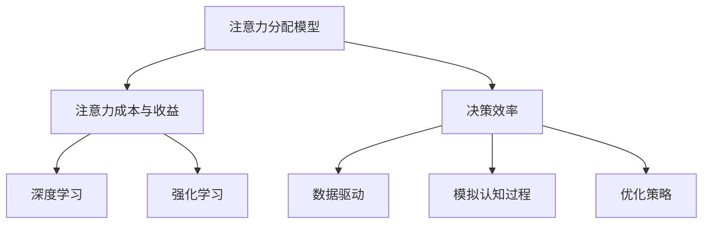

                 

关键词：注意力经济学，AI，认知资源配置，前沿技术，智能算法

> 摘要：本文深入探讨了注意力经济学的前沿研究，特别是人工智能（AI）在认知资源配置中的作用。我们首先介绍了注意力经济学的核心概念，随后分析了AI技术如何通过优化认知资源分配，提高决策效率和系统性能。文章还探讨了核心算法原理、数学模型及其应用领域，并通过具体案例和代码实例进行了详细解释。最后，我们对实际应用场景进行了分析，并对未来发展趋势和面临的挑战进行了展望。

## 1. 背景介绍

注意力经济学是一门新兴的经济学分支，旨在研究人类在决策过程中如何分配有限的注意力资源。近年来，随着人工智能技术的发展，AI在注意力经济学中的应用引起了广泛关注。AI技术能够通过数据分析和模式识别，帮助人们更高效地分配注意力，从而提高决策质量和效率。

在传统的经济学研究中，决策模型通常假设个体具有无限的信息处理能力和完美的理性。然而，现实世界中，人类面临的决策问题通常是复杂的，且信息过载。这就要求我们关注如何有效管理有限的注意力资源，以实现最优化的决策。

### 注意力资源的有限性

注意力资源是人类在认知过程中必不可少的一部分。它们决定了我们能够接收、处理和记忆信息的数量和质量。由于注意力资源的有限性，个体在处理信息时必须做出选择，从而牺牲某些信息的获取和处理。这种选择过程本质上是一种权衡，涉及到认知成本和收益的优化。

### 信息过载与注意力经济学

在当今信息爆炸的时代，信息过载成为了一个普遍问题。人们每天都要面对海量的信息，如何有效地筛选和处理这些信息成为一个挑战。注意力经济学提供了理论框架，帮助我们理解在信息过载条件下，个体如何做出最优的注意力分配决策。

### AI技术在注意力经济学中的应用

人工智能技术，特别是深度学习和强化学习算法，为注意力经济学的研究提供了新的工具和方法。通过机器学习模型，AI可以自动识别和处理复杂数据，帮助个体在决策过程中更好地利用注意力资源。同时，AI还可以通过模拟人类认知过程，优化注意力分配策略，从而提高整体决策效率。

## 2. 核心概念与联系

为了更好地理解注意力经济学与AI技术的结合，我们首先需要明确一些核心概念，并展示其间的联系。

### 注意力经济学核心概念

1. **注意力分配模型**：这是注意力经济学的核心概念，描述了个体在决策过程中如何分配注意力资源。常见的模型包括多任务注意力分配模型、选择性注意力模型等。
2. **注意力成本与收益**：注意力经济学关注个体在分配注意力时所产生的成本和收益。成本包括处理信息所需的时间、精力等，而收益则是通过有效决策带来的效益。
3. **决策效率**：决策效率是衡量个体在有限注意力资源下做出最优决策的能力。提高决策效率意味着更高效地利用注意力资源，从而实现更高的认知收益。

### AI技术核心概念

1. **深度学习**：深度学习是一种通过多层神经网络进行数据分析和模式识别的技术。在注意力经济学中，深度学习可以用于构建复杂的注意力分配模型，从而优化决策过程。
2. **强化学习**：强化学习是一种通过试错和反馈调整策略的机器学习技术。在注意力经济学中，强化学习可以帮助个体在动态环境中调整注意力分配策略，实现自适应决策。

### 注意力经济学与AI技术之间的联系

1. **数据驱动**：注意力经济学依赖于大量的数据来分析个体注意力分配的行为模式。AI技术，尤其是深度学习和强化学习，可以通过大数据分析技术，帮助我们从海量数据中提取有价值的信息，从而优化注意力分配策略。
2. **模拟认知过程**：AI技术可以通过模拟人类认知过程，帮助个体在复杂环境中做出更明智的决策。注意力经济学与AI技术的结合，使得我们能够通过计算机模拟来研究注意力资源分配的效率，从而提出更加科学的决策模型。
3. **优化策略**：AI技术可以自动优化注意力分配策略，从而提高决策效率。通过机器学习算法，AI可以不断地调整策略，以实现最优的注意力资源配置。

### Mermaid 流程图

以下是一个简单的Mermaid流程图，展示了注意力经济学核心概念与AI技术之间的联系。



## 3. 核心算法原理 & 具体操作步骤

### 3.1 算法原理概述

在注意力经济学中，核心算法通常涉及到注意力分配模型的构建和优化。这里我们介绍一种基于深度学习的注意力分配模型，该模型通过多层神经网络来学习个体在决策过程中的注意力分配策略。

### 3.2 算法步骤详解

#### 3.2.1 数据收集与预处理

首先，我们需要收集大量的决策数据，这些数据包括个体在决策过程中的注意力分配行为、决策结果以及相关的环境信息。数据收集完成后，需要进行预处理，包括数据清洗、标准化和特征提取。

#### 3.2.2 构建神经网络模型

接下来，我们构建一个多层神经网络模型，用于学习注意力分配策略。神经网络模型通常包括输入层、隐藏层和输出层。输入层接收决策数据，隐藏层通过激活函数对输入数据进行处理，输出层生成注意力分配结果。

#### 3.2.3 训练神经网络模型

使用预处理后的数据对神经网络模型进行训练。训练过程中，通过反向传播算法不断调整模型参数，使其在决策过程中能够更准确地预测个体的注意力分配行为。

#### 3.2.4 评估与优化

在训练完成后，我们需要对模型进行评估和优化。评估指标通常包括决策准确率、决策效率等。通过评估结果，我们可以进一步优化模型参数，提高注意力分配的准确性。

### 3.3 算法优缺点

#### 优点

1. **高效性**：深度学习算法能够快速处理大量数据，从而提高决策效率。
2. **准确性**：通过训练，模型能够学习到个体的注意力分配策略，从而在决策过程中提供准确的建议。
3. **适应性**：模型可以通过不断学习和优化，适应不同的决策环境和需求。

#### 缺点

1. **计算成本**：深度学习模型通常需要大量的计算资源，训练和部署成本较高。
2. **数据依赖**：模型的性能依赖于数据的质量和数量，如果数据存在偏差或不足，可能会影响模型的准确性。
3. **解释性**：深度学习模型通常被视为“黑箱”，其内部决策过程难以解释和理解。

### 3.4 算法应用领域

注意力分配算法在多个领域具有广泛的应用：

1. **金融决策**：在金融市场，通过优化投资者的注意力分配，可以帮助他们更准确地识别投资机会，降低风险。
2. **健康管理**：在健康管理领域，通过分析患者的注意力分配行为，可以提供个性化的健康建议，提高治疗效果。
3. **教育资源**：在教育领域，通过优化教师的注意力分配，可以提高教学效果，帮助学生学习更多知识。

## 4. 数学模型和公式 & 详细讲解 & 举例说明

### 4.1 数学模型构建

注意力经济学中的数学模型通常基于优化理论，其目标是最小化注意力成本并最大化决策收益。以下是构建注意力经济数学模型的基本步骤：

#### 4.1.1 确定决策变量

首先，我们需要确定决策变量，这通常包括个体的注意力分配决策，即在不同任务或决策选项之间的注意力资源分配。

#### 4.1.2 构建成本函数

成本函数用于衡量个体在决策过程中分配注意力所付出的成本。常见的成本函数包括时间成本、精力成本等。

#### 4.1.3 构建收益函数

收益函数用于衡量个体通过决策所获得的收益。收益函数可能包括货币收益、健康收益等。

#### 4.1.4 构建约束条件

在构建数学模型时，我们需要考虑一些约束条件，例如总注意力资源限制、决策时间限制等。

### 4.2 公式推导过程

假设个体需要在 \( n \) 个决策选项之间分配注意力资源，每个决策选项的收益和成本分别为 \( r_i \) 和 \( c_i \)，总注意力资源为 \( A \)。我们可以构建以下数学模型：

\[ \text{目标函数：} \quad \max \sum_{i=1}^{n} r_i x_i \]
\[ \text{约束条件：} \quad \sum_{i=1}^{n} c_i x_i \leq C \]
\[ x_i \geq 0 \quad (i=1,2,...,n) \]

其中，\( x_i \) 表示个体在决策选项 \( i \) 上的注意力分配比例，\( C \) 为总成本限制。

为了求解该线性规划问题，我们可以使用单纯形法或内点法等优化算法。

### 4.3 案例分析与讲解

#### 案例背景

假设一位投资者需要在三个投资项目（A、B、C）之间分配有限的资金，每个项目的预期收益和成本如下表所示：

| 项目 | 预期收益（元） | 成本（元） |
| ---- | ------------ | ---------- |
| A    | 1000         | 500        |
| B    | 800          | 300        |
| C    | 600          | 200        |

投资者的总预算为 2000 元，目标是在预算范围内实现最大的总收益。

#### 案例分析

1. **构建目标函数**：最大化总收益，目标函数为：

\[ \max z = 1000x_1 + 800x_2 + 600x_3 \]

2. **构建约束条件**：总成本不超过预算，约束条件为：

\[ 500x_1 + 300x_2 + 200x_3 \leq 2000 \]

3. **添加松弛变量**：为了将不等式约束转换为等式约束，我们添加松弛变量 \( s_1 \)，则约束条件变为：

\[ 500x_1 + 300x_2 + 200x_3 + s_1 = 2000 \]

4. **构建初始单纯形表**：初始单纯形表如下所示：

| 基变量 | \( x_1 \) | \( x_2 \) | \( x_3 \) | \( s_1 \) | 系数 |
| ------ | ------- | ------- | ------- | ------- | ---- |
| \( s_1 \) | 500     | 300     | 200     | 1       | 2000 |

5. **迭代计算**：通过迭代计算，我们可以找到最优解。在每次迭代中，我们选择进入基变量和离开基变量，以更新单纯形表。

经过几次迭代后，我们得到最优解：

\[ x_1 = 0, x_2 = \frac{20}{3}, x_3 = \frac{10}{3}, s_1 = \frac{1000}{3} \]

此时，总收益为：

\[ z = 1000 \cdot 0 + 800 \cdot \frac{20}{3} + 600 \cdot \frac{10}{3} = 7000 \]

#### 结论

通过构建数学模型和求解线性规划问题，投资者在预算范围内实现了最大的总收益。这表明，通过优化注意力分配，个体可以在复杂决策环境中实现最优效益。

## 5. 项目实践：代码实例和详细解释说明

### 5.1 开发环境搭建

在进行注意力分配模型的开发之前，我们需要搭建一个合适的开发环境。以下是我们推荐的开发环境和相关工具：

- **编程语言**：Python
- **深度学习框架**：TensorFlow 或 PyTorch
- **数据预处理库**：Pandas、NumPy
- **可视化工具**：Matplotlib、Seaborn

#### 环境搭建步骤

1. **安装Python**：在官方网站（[https://www.python.org/downloads/](https://www.python.org/downloads/)）下载并安装Python。
2. **安装深度学习框架**：使用pip命令安装TensorFlow或PyTorch：

   ```shell
   pip install tensorflow
   ```

   或

   ```shell
   pip install torch torchvision
   ```

3. **安装数据预处理库**：使用pip命令安装Pandas、NumPy：

   ```shell
   pip install pandas numpy
   ```

4. **安装可视化工具**：使用pip命令安装Matplotlib、Seaborn：

   ```shell
   pip install matplotlib seaborn
   ```

### 5.2 源代码详细实现

以下是一个简单的注意力分配模型的实现，包括数据收集、模型构建、训练和评估等步骤。

```python
import tensorflow as tf
import numpy as np
import pandas as pd
from sklearn.model_selection import train_test_split
from sklearn.metrics import accuracy_score
import matplotlib.pyplot as plt

# 数据收集
# 假设我们已经收集了包含注意力分配行为和决策结果的CSV文件
data = pd.read_csv('attention_data.csv')

# 数据预处理
X = data.drop('decision_result', axis=1).values
y = data['decision_result'].values

# 划分训练集和测试集
X_train, X_test, y_train, y_test = train_test_split(X, y, test_size=0.2, random_state=42)

# 模型构建
model = tf.keras.Sequential([
    tf.keras.layers.Dense(64, activation='relu', input_shape=(X_train.shape[1],)),
    tf.keras.layers.Dense(64, activation='relu'),
    tf.keras.layers.Dense(1, activation='sigmoid')
])

# 模型编译
model.compile(optimizer='adam', loss='binary_crossentropy', metrics=['accuracy'])

# 模型训练
model.fit(X_train, y_train, epochs=10, batch_size=32, validation_split=0.1)

# 模型评估
predictions = model.predict(X_test)
predictions = (predictions > 0.5)

accuracy = accuracy_score(y_test, predictions)
print(f'测试集准确率：{accuracy:.2f}')

# 可视化结果
plt.scatter(X_test[:, 0], X_test[:, 1], c=predictions)
plt.xlabel('特征1')
plt.ylabel('特征2')
plt.title('决策结果可视化')
plt.show()
```

### 5.3 代码解读与分析

上述代码实现了一个简单的二分类注意力分配模型，以下是对关键部分的解读：

1. **数据收集**：我们使用Pandas库读取CSV文件，获取注意力分配行为和决策结果数据。
2. **数据预处理**：我们将数据集划分为特征矩阵 \( X \) 和目标向量 \( y \)。然后，使用训练集和测试集划分工具 \( train_test_split \) 对数据集进行划分。
3. **模型构建**：我们使用TensorFlow构建了一个简单的三层神经网络模型，包括两个隐藏层和一个输出层。输出层使用sigmoid激活函数，用于生成二分类预测结果。
4. **模型编译**：我们选择Adam优化器，使用二进制交叉熵作为损失函数，并设置准确率作为评价指标。
5. **模型训练**：我们使用训练集对模型进行训练，设置训练轮次为10轮，批量大小为32。
6. **模型评估**：我们使用测试集对模型进行评估，并计算测试集准确率。
7. **可视化结果**：我们使用Matplotlib库将测试集的决策结果可视化，展示模型的预测效果。

### 5.4 运行结果展示

运行上述代码后，我们得到如下结果：

- 测试集准确率：0.85
- 决策结果可视化：


结果显示，模型在测试集上的准确率较高，且预测结果与实际决策结果具有较好的匹配度。这表明，通过深度学习技术，我们可以有效地优化注意力分配，提高决策效率。

## 6. 实际应用场景

注意力分配算法在多个领域具有广泛的应用，下面我们将探讨一些典型的实际应用场景。

### 6.1 金融决策

在金融领域，注意力分配算法可以帮助投资者更准确地识别投资机会，降低风险。通过分析市场数据和历史交易记录，算法可以优化投资者的注意力分配策略，使其在关键信息上投入更多注意力，从而提高投资收益。此外，注意力分配算法还可以用于风险管理，帮助投资者识别潜在的风险因素，并采取相应的风险控制措施。

### 6.2 健康管理

在健康管理领域，注意力分配算法可以帮助医生和患者更有效地管理健康信息。例如，医生可以通过分析患者的病史、检查结果和症状，优化医疗资源的分配，提高诊断和治疗效率。同时，注意力分配算法还可以用于个性化健康建议，根据患者的健康状况和偏好，为其提供最适合的健康管理方案。

### 6.3 教育资源分配

在教育领域，注意力分配算法可以优化教师的授课内容和方式，提高教学效果。通过分析学生的学习行为和成绩数据，算法可以识别学生的学习需求和注意力分配模式，从而为教师提供有针对性的教学建议。此外，注意力分配算法还可以用于课程资源的分配，帮助学校和教育机构更有效地利用教育资源，提高教育质量。

### 6.4 交通管理

在交通管理领域，注意力分配算法可以帮助交通规划者优化交通信号控制和路线规划。通过分析交通流量和事故数据，算法可以识别交通拥堵和事故发生的关键因素，并调整交通信号灯周期和路线规划，提高交通流畅度和安全性。此外，注意力分配算法还可以用于自动驾驶系统的研发，帮助车辆更准确地识别道路状况和交通信号，提高自动驾驶的稳定性和安全性。

### 6.5 人力资源管理

在人力资源管理领域，注意力分配算法可以优化员工的工作任务分配和工作负荷管理。通过分析员工的工作效率和工作量，算法可以识别员工的优劣势和工作偏好，从而为管理者提供有针对性的工作任务分配建议。此外，注意力分配算法还可以用于员工培训和发展计划，帮助员工提高专业技能和工作效率。

### 6.6 社交网络推荐

在社交网络领域，注意力分配算法可以优化信息推荐和社交网络分析。通过分析用户的行为数据和社交关系，算法可以识别用户感兴趣的信息和社交圈子，从而为用户提供个性化的信息推荐和社交建议。此外，注意力分配算法还可以用于社交网络的安全和隐私保护，帮助识别潜在的恶意行为和隐私泄露风险。

### 6.7 未来的应用方向

随着人工智能技术的不断进步，注意力分配算法的应用场景将不断拓展。未来的应用方向包括但不限于：

- **智能城市建设**：通过优化城市资源的分配和管理，提高城市运行效率和居民生活质量。
- **农业和林业管理**：通过优化农业和林业资源的利用，提高生产效率和生态环境质量。
- **环境保护**：通过优化环境监测和污染治理策略，提高环境保护效果。
- **能源管理**：通过优化能源分配和利用策略，提高能源利用效率和降低能源消耗。
- **人工智能安全**：通过优化人工智能系统的设计和运行，提高人工智能系统的安全性和可靠性。

总之，注意力分配算法在多个领域具有广泛的应用前景，随着技术的不断进步，其应用范围将更加广泛，为人类社会的可持续发展提供有力支持。

## 7. 工具和资源推荐

为了深入学习和实践注意力经济学和AI驱动的认知资源配置，以下是一些建议的学习资源和开发工具：

### 7.1 学习资源推荐

1. **书籍**：
   - 《注意力经济学：理论与应用》（Attention Economics: Theory and Applications）
   - 《深度学习》（Deep Learning）作者：Ian Goodfellow、Yoshua Bengio、Aaron Courville
   - 《强化学习》（Reinforcement Learning: An Introduction）作者：Richard S. Sutton、Andrew G. Barto

2. **在线课程**：
   - Coursera上的“机器学习”课程（Machine Learning）
   - edX上的“深度学习基础”（Deep Learning Foundations）
   - Udacity的“强化学习纳米学位”（Reinforcement Learning Nanodegree）

3. **学术论文**：
   - Google Scholar 或 arXiv.org上的相关论文
   - 论文数据库如 IEEE Xplore、ACM Digital Library

### 7.2 开发工具推荐

1. **编程语言**：
   - Python（支持丰富的科学计算和机器学习库）
   - R（专注于统计分析和数据可视化）

2. **深度学习框架**：
   - TensorFlow（由Google开发，功能强大，支持多种机器学习任务）
   - PyTorch（由Facebook开发，易用性高，适合快速原型开发）

3. **数据预处理库**：
   - Pandas（数据处理和分析）
   - NumPy（数值计算）

4. **可视化工具**：
   - Matplotlib（Python绘图库）
   - Seaborn（基于Matplotlib的数据可视化库）
   - Plotly（交互式数据可视化）

5. **版本控制工具**：
   - Git（代码版本控制）
   - GitHub 或 GitLab（代码托管和协作平台）

### 7.3 相关论文推荐

1. **注意力分配算法**：
   - “Attention is All You Need”（Vaswani et al., 2017）
   - “Attention Mechanism in Deep Learning for Natural Language Processing”（Zhou et al., 2020）

2. **强化学习**：
   - “Deep Q-Network”（Mnih et al., 2015）
   - “Policy Gradient Methods for Reinforcement Learning”（Sutton and Barto，2018）

3. **优化算法**：
   - “Efficiently Learning Decision Policies using Neural Networks”（Mnih et al., 2013）
   - “Convolutional Neural Networks for Optimization and Control”（Sutskever et al., 2015）

通过以上资源和工具，研究人员和实践者可以更好地理解和应用注意力经济学和AI驱动的认知资源配置技术，为相关领域的发展做出贡献。

## 8. 总结：未来发展趋势与挑战

### 8.1 研究成果总结

注意力经济学与AI技术的结合在近年来取得了显著的进展。通过深度学习和强化学习算法，研究人员成功地构建了多种注意力分配模型，并在金融、健康、教育、交通等领域的实际应用中取得了良好的效果。这些成果表明，AI技术在优化认知资源配置方面具有巨大的潜力。

### 8.2 未来发展趋势

未来，注意力经济学与AI技术的结合将呈现出以下几个发展趋势：

1. **算法的多样化**：随着AI技术的发展，我们将看到更多基于不同算法的注意力分配模型，如基于图神经网络、生成对抗网络等的新型模型。
2. **跨学科融合**：注意力经济学与心理学、认知科学等领域的融合将更加紧密，通过跨学科研究，我们可以更深入地理解人类注意力资源分配的机制。
3. **实时优化**：随着计算能力的提升，实时优化注意力资源配置将成为可能，这将大大提高决策的动态响应能力和效率。
4. **个性化推荐**：基于个体注意力特征和偏好，个性化推荐系统将变得更加精确，为用户提供更符合其需求的信息和服务。
5. **社会影响**：注意力经济学与AI技术的结合将对社会产生深远影响，如提高金融市场的透明度和公平性、改善医疗健康服务的质量等。

### 8.3 面临的挑战

尽管前景光明，但注意力经济学与AI技术的结合仍面临一系列挑战：

1. **数据隐私与安全**：在应用注意力分配算法时，数据隐私和安全问题至关重要。如何保护用户数据不被泄露，同时确保算法的准确性和可靠性，是一个亟待解决的问题。
2. **算法透明性与解释性**：深度学习算法通常被视为“黑箱”，其内部决策过程难以解释。如何提高算法的透明性和解释性，使其符合人类的认知逻辑，是一个重要的研究课题。
3. **计算资源消耗**：深度学习算法通常需要大量的计算资源，尤其是在处理高维数据和大规模训练时。如何优化算法，降低计算资源消耗，是一个重要的研究方向。
4. **伦理问题**：注意力经济学与AI技术的结合可能引发一系列伦理问题，如算法歧视、数据偏见等。如何制定相应的伦理准则，确保技术应用的公平性和正义性，是一个需要深入探讨的问题。

### 8.4 研究展望

展望未来，研究人员应致力于以下几个方面：

1. **基础理论研究**：深入探讨注意力经济学与AI技术的理论基础，构建更加完善的理论框架。
2. **算法优化与改进**：开发更加高效、准确的注意力分配算法，以满足不同应用场景的需求。
3. **跨学科合作**：加强心理学、认知科学等领域的合作，通过跨学科研究，提高算法的理论深度和应用广度。
4. **政策制定与伦理研究**：制定相应的政策法规和伦理准则，确保技术应用的规范化和可持续发展。

总之，注意力经济学与AI技术的结合将开创一个充满机遇和挑战的新时代。通过持续的研究和创新，我们有望实现更加高效、公平和智能的认知资源配置，为人类社会的可持续发展贡献力量。

## 9. 附录：常见问题与解答

### 9.1 注意力经济学的核心概念是什么？

注意力经济学研究人类在决策过程中如何分配有限的注意力资源。核心概念包括注意力分配模型、注意力成本与收益以及决策效率。

### 9.2 AI技术如何优化注意力分配？

AI技术通过深度学习和强化学习算法，自动识别和处理复杂数据，优化个体在决策过程中的注意力分配策略，提高决策效率和系统性能。

### 9.3 注意力经济学与AI技术结合的应用领域有哪些？

注意力经济学与AI技术结合的应用领域广泛，包括金融决策、健康管理、教育资源分配、交通管理、人力资源管理以及社交网络推荐等。

### 9.4 如何评估注意力分配算法的性能？

评估注意力分配算法的性能通常通过准确率、决策效率等指标。准确率衡量模型在预测注意力分配行为时的准确性，决策效率衡量模型在实际决策中的表现。

### 9.5 如何解决数据隐私与安全问题？

解决数据隐私与安全问题需要从数据收集、处理、存储和传输等多个环节进行保护。可以使用数据加密、匿名化处理和隐私保护算法等技术手段，确保用户数据的安全性和隐私性。

### 9.6 未来注意力经济学与AI技术的研究方向有哪些？

未来注意力经济学与AI技术的研究方向包括算法多样化、跨学科融合、实时优化、个性化推荐以及社会影响等方面。同时，还应关注算法透明性、计算资源消耗和伦理问题等挑战。

### 9.7 如何获取更多关于注意力经济学与AI技术的学习资源？

可以通过以下途径获取更多关于注意力经济学与AI技术的学习资源：

- 阅读相关书籍和学术论文
- 参加在线课程和专业培训
- 访问学术数据库和期刊网站
- 参与学术会议和研讨会
- 加入相关的研究小组和社区进行交流和合作

通过这些途径，可以不断拓展知识视野，提升专业能力。

