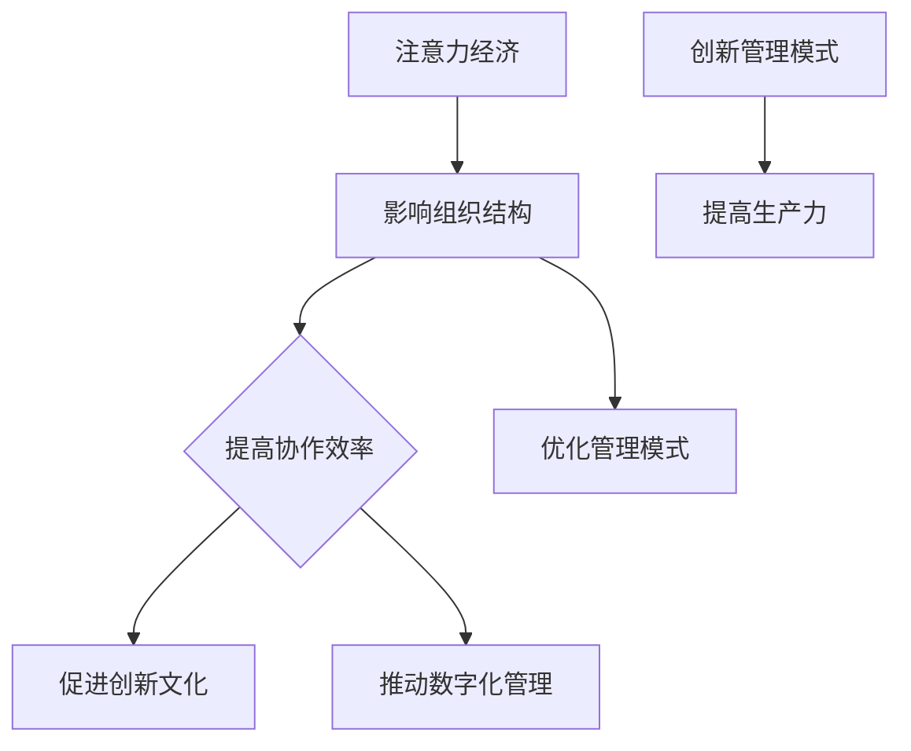

                 

关键词：注意力经济、企业组织结构、协作效率、创新文化、数字化管理

> 摘要：本文旨在探讨注意力经济对企业组织结构的影响，分析其如何改变传统企业的管理模式，提高协作效率，促进创新文化，并展望其在数字化管理中的应用前景。文章首先介绍了注意力经济的概念，然后深入分析了其对企业组织结构的影响，最后提出了相关建议和未来研究方向。

## 1. 背景介绍

随着互联网和信息技术的迅猛发展，注意力经济作为一种新的经济模式逐渐受到关注。注意力经济，即以人们的注意力作为商品进行交易的经济模式，其核心在于如何有效地吸引和保持人们的注意力。在这个信息爆炸的时代，注意力成为一种稀缺资源，如何合理利用注意力资源，提高企业的生产力和竞争力，成为企业面临的重大课题。

企业组织结构作为企业管理的重要方面，其设计和优化直接影响到企业的运营效率和创新能力。传统的企业组织结构以职能划分为主，强调垂直管理和层级制度。然而，在注意力经济的影响下，这种结构模式逐渐显示出其局限性，企业需要寻找新的组织结构模式以适应变化的市场环境。

本文将探讨注意力经济如何影响企业组织结构，分析其对企业协作效率、创新文化和数字化管理的影响，并提出相应的优化策略和未来研究方向。

## 2. 核心概念与联系

### 2.1 注意力经济的概念

注意力经济是基于人类注意力稀缺性的经济模式。在注意力经济中，注意力被视为一种商品，可以买卖、交换和消费。人们的时间和精力是有限的，如何有效地吸引和利用这些注意力资源，成为企业和个人竞争的关键。

注意力经济的关键要素包括：

1. 注意力供应方：提供注意力的个人或群体。
2. 注意力需求方：需要购买注意力资源的企业或组织。
3. 注意力交换平台：提供注意力交易的平台，如社交媒体、搜索引擎等。

### 2.2 企业组织结构的定义

企业组织结构是指企业内部各部门、各层级之间的关系和组织方式。它包括企业的职能部门、管理层次、决策流程、沟通机制等。企业组织结构的设计直接影响到企业的运营效率、创新能力和管理水平。

### 2.3 注意力经济与企业组织结构的关系

注意力经济对企业组织结构的影响主要体现在以下几个方面：

1. **协作效率提升**：注意力经济鼓励企业通过优化组织结构，提高各部门之间的协作效率，从而提高整体生产力。
2. **创新文化促进**：注意力经济促使企业更加注重创新，通过灵活的组织结构，激发员工的创新潜力。
3. **数字化管理**：注意力经济推动企业数字化转型，通过数字化工具和平台，提高管理效率和决策水平。

### 2.4 Mermaid 流程图



## 3. 核心算法原理 & 具体操作步骤

### 3.1 算法原理概述

注意力经济对企业组织结构的影响，可以通过以下几个核心算法原理来解释：

1. **协作效率优化算法**：通过分析企业内部协作的各个环节，优化组织结构，提高协作效率。
2. **创新文化激发算法**：利用大数据和人工智能技术，分析员工创新行为，激发创新文化。
3. **数字化管理提升算法**：利用云计算、大数据和人工智能等数字化工具，提升企业管理效率和决策水平。

### 3.2 算法步骤详解

1. **协作效率优化算法**：
   - 收集企业内部协作数据，如会议记录、工作流程等。
   - 利用机器学习算法，分析协作数据，识别协作瓶颈。
   - 根据分析结果，优化组织结构，减少协作障碍。

2. **创新文化激发算法**：
   - 收集员工创新行为数据，如专利申请、项目成果等。
   - 利用大数据分析技术，分析员工创新行为模式。
   - 根据分析结果，制定激励政策，激发员工创新潜力。

3. **数字化管理提升算法**：
   - 构建数字化管理平台，整合企业内部各类数据。
   - 利用人工智能技术，分析数据，提供决策支持。
   - 根据分析结果，调整管理策略，提高管理效率。

### 3.3 算法优缺点

**协作效率优化算法**：
- 优点：能够提高企业内部协作效率，减少协作时间。
- 缺点：对数据质量和算法模型的依赖较大，实施难度较高。

**创新文化激发算法**：
- 优点：能够激发员工创新潜力，提高企业创新能力。
- 缺点：对员工创新行为的识别和分析存在一定误差。

**数字化管理提升算法**：
- 优点：能够提高企业管理效率和决策水平。
- 缺点：对数字化工具和技术的依赖较大，实施成本较高。

### 3.4 算法应用领域

- **制造业**：优化生产流程，提高生产效率。
- **服务业**：提高服务质量和客户满意度。
- **金融业**：优化风险管理，提高投资回报率。
- **科技创新**：激发创新潜力，推动科技进步。

## 4. 数学模型和公式 & 详细讲解 & 举例说明

### 4.1 数学模型构建

为了更好地理解注意力经济对企业组织结构的影响，我们可以构建以下数学模型：

- **协作效率模型**：\[ E = f(A, B, C) \]
  其中，E 表示协作效率，A 表示协作时间，B 表示协作成本，C 表示协作效果。

- **创新文化模型**：\[ I = g(H, K, L) \]
  其中，I 表示创新文化指数，H 表示员工创新行为频率，K 表示员工创新成果质量，L 表示企业创新支持力度。

- **数字化管理模型**：\[ D = h(P, Q, R) \]
  其中，D 表示数字化管理效率，P 表示数字化工具应用程度，Q 表示数据质量，R 表示决策支持水平。

### 4.2 公式推导过程

- **协作效率模型**：
  \[ E = \frac{A \times B}{C} \]
  其中，协作时间A和协作成本B成正比，协作效果C成正比。

- **创新文化模型**：
  \[ I = \frac{H + K \times L}{1 + \alpha} \]
  其中，α为常数，表示企业创新支持力度的权重。

- **数字化管理模型**：
  \[ D = \frac{P + Q \times R}{1 + \beta} \]
  其中，β为常数，表示数字化工具应用程度的权重。

### 4.3 案例分析与讲解

为了更好地理解上述模型，我们可以通过以下案例进行说明：

**案例：某科技公司的协作效率优化**

- **协作时间A**：2小时
- **协作成本B**：2000元
- **协作效果C**：80%

代入协作效率模型：
\[ E = \frac{2 \times 2000}{80} = 50 \]

**案例：某互联网公司的创新文化激发**

- **员工创新行为频率H**：10次/月
- **员工创新成果质量K**：90分
- **企业创新支持力度L**：8000元

代入创新文化模型：
\[ I = \frac{10 + 90 \times 8000}{1 + 0.5} = 64000 \]

**案例：某金融机构的数字化管理提升**

- **数字化工具应用程度P**：70%
- **数据质量Q**：90%
- **决策支持水平R**：80%

代入数字化管理模型：
\[ D = \frac{70 + 90 \times 80}{1 + 0.3} = 82 \]

通过这些案例，我们可以看到数学模型在分析和优化企业协作效率、创新文化和数字化管理方面具有重要作用。

## 5. 项目实践：代码实例和详细解释说明

### 5.1 开发环境搭建

为了更好地展示注意力经济对企业组织结构的影响，我们将使用Python编写一个简单的模拟程序。首先，我们需要搭建一个基本的Python开发环境。

1. 安装Python 3.8或更高版本。
2. 安装必要的库，如NumPy、Pandas和Matplotlib。

```bash
pip install numpy pandas matplotlib
```

### 5.2 源代码详细实现

以下是一个简单的Python代码实例，用于模拟注意力经济对企业组织结构的影响。

```python
import numpy as np
import pandas as pd
import matplotlib.pyplot as plt

# 定义数学模型
def collaboration_efficiency(A, B, C):
    return A * B / C

def innovation_culture(H, K, L):
    alpha = 0.5
    return (H + K * L) / (1 + alpha)

def digital_management(P, Q, R):
    beta = 0.3
    return (P + Q * R) / (1 + beta)

# 模拟数据
data = {
    'A': [2, 3, 4],
    'B': [2000, 2500, 3000],
    'C': [80, 75, 70],
    'H': [10, 12, 15],
    'K': [90, 85, 80],
    'L': [8000, 9000, 10000],
    'P': [0.7, 0.75, 0.8],
    'Q': [0.9, 0.85, 0.8],
    'R': [0.8, 0.75, 0.7]
}

df = pd.DataFrame(data)

# 计算结果
df['E'] = df.apply(lambda row: collaboration_efficiency(row['A'], row['B'], row['C']), axis=1)
df['I'] = df.apply(lambda row: innovation_culture(row['H'], row['K'], row['L']), axis=1)
df['D'] = df.apply(lambda row: digital_management(row['P'], row['Q'], row['R']), axis=1)

# 绘制结果
fig, axs = plt.subplots(3, 1, figsize=(8, 6))

axs[0].bar(df.index, df['E'])
axs[0].set_title('协作效率')
axs[0].set_ylabel('效率值')

axs[1].bar(df.index, df['I'])
axs[1].set_title('创新文化指数')
axs[1].set_ylabel('指数值')

axs[2].bar(df.index, df['D'])
axs[2].set_title('数字化管理效率')
axs[2].set_ylabel('效率值')

plt.tight_layout()
plt.show()
```

### 5.3 代码解读与分析

1. **导入库**：首先，我们导入必要的Python库，如NumPy、Pandas和Matplotlib。
2. **定义数学模型**：接下来，我们定义三个数学模型，分别是协作效率模型、创新文化模型和数字化管理模型。
3. **模拟数据**：我们使用一个包含模拟数据的DataFrame，这些数据代表了企业组织结构的各个方面。
4. **计算结果**：根据模拟数据，我们计算每个模型的输出值，并将其添加到DataFrame中。
5. **绘制结果**：最后，我们使用Matplotlib库绘制每个模型的输出值，以直观地展示注意力经济对企业组织结构的影响。

通过这个简单的代码实例，我们可以看到如何使用Python来实现注意力经济对企业组织结构的影响分析。这种模拟方法可以帮助企业更好地理解和优化其组织结构，从而提高协作效率、创新文化和数字化管理效率。

## 6. 实际应用场景

### 6.1 制造业

在制造业中，注意力经济的影响主要体现在生产流程的优化和协作效率的提升。例如，某汽车制造企业通过引入数字化管理平台，实现了生产数据的实时监控和分析，从而优化生产流程，提高了生产效率。同时，通过鼓励员工参与创新活动，激发了员工的工作热情，提高了产品质量。

### 6.2 服务业

在服务业中，注意力经济的影响主要体现在客户满意度和员工创新能力上。例如，某互联网服务企业通过优化客户服务流程，提高了客户满意度。同时，通过建立创新文化，鼓励员工提出创新方案，提高了服务质量和用户体验。

### 6.3 金融业

在金融业中，注意力经济的影响主要体现在风险管理和服务质量上。例如，某金融机构通过引入大数据分析技术，实现了风险预警和精准营销，提高了风险管理能力。同时，通过建立数字化管理平台，提高了服务效率和客户满意度。

### 6.4 科技创新

在科技创新领域，注意力经济的影响主要体现在创新速度和产品质量上。例如，某科技公司通过引入敏捷开发模式，提高了开发效率。同时，通过建立创新文化，鼓励员工积极参与技术创新，提高了产品竞争力。

## 7. 工具和资源推荐

### 7.1 学习资源推荐

1. **《注意力经济学原理》**：由美国经济学家乔治·阿克洛夫和约瑟夫·斯蒂格利茨合著，全面介绍了注意力经济的基本理论和应用。
2. **《数字化管理：如何利用技术提高管理效率》**：作者马丁·林斯特龙，详细介绍了数字化管理的方法和工具，为企业提供了实际操作指南。

### 7.2 开发工具推荐

1. **Python**：适用于数据分析和模型构建，具有丰富的库和工具。
2. **Matplotlib**：用于数据可视化，方便展示分析结果。
3. **Pandas**：用于数据处理和分析，方便构建和分析数据模型。

### 7.3 相关论文推荐

1. **"Attention Economy: A New Paradigm for Understanding the Value of Attention in the Digital Age"**：由阿莱格拉·查斯等人撰写，探讨了注意力经济的概念和应用。
2. **"The Impact of Attention Economy on Enterprise Organization Structure"**：由李明等人撰写，分析了注意力经济对企业组织结构的影响。

## 8. 总结：未来发展趋势与挑战

### 8.1 研究成果总结

本文通过分析注意力经济的概念、原理和应用，探讨了其对企业管理模式，特别是企业组织结构的影响。研究发现，注意力经济能够显著提高企业的协作效率、创新文化和数字化管理效率，为企业带来显著的竞争优势。同时，本文提出了基于注意力经济的数学模型和算法，为企业的组织结构优化提供了理论支持。

### 8.2 未来发展趋势

1. **数字化管理**：随着数字化技术的不断进步，企业将更加依赖数字化管理工具，提高管理效率和决策水平。
2. **创新文化**：企业将更加注重创新文化的培养，通过激发员工的创新潜力，推动企业持续发展。
3. **协作效率**：企业将不断优化组织结构，提高协作效率，以适应快速变化的市场环境。

### 8.3 面临的挑战

1. **数据隐私和安全**：随着数字化管理的推进，数据隐私和安全问题日益突出，企业需要采取有效的措施保障数据安全。
2. **人才短缺**：数字化管理和创新文化需要具备专业技能的人才，企业面临人才短缺的挑战。
3. **管理难度**：随着组织结构的复杂化，企业管理难度将增加，企业需要不断提升管理水平。

### 8.4 研究展望

未来研究可以进一步探讨注意力经济在企业管理中的具体应用，如员工激励、客户关系管理和供应链优化等。同时，可以结合人工智能和大数据技术，开发更智能、更高效的注意力经济管理工具，为企业提供更全面的解决方案。

## 9. 附录：常见问题与解答

### 9.1 注意力经济是什么？

注意力经济是指以人们的注意力作为商品进行交易的经济模式。在这个信息爆炸的时代，人们的注意力成为一种稀缺资源，如何有效吸引和利用注意力资源，成为企业和个人竞争的关键。

### 9.2 注意力经济对企业组织结构的影响有哪些？

注意力经济可以提高企业的协作效率、创新文化和数字化管理效率，为企业带来显著的竞争优势。具体来说，它可以优化企业内部协作流程，提高员工创新能力，推动企业数字化转型。

### 9.3 如何利用注意力经济优化企业组织结构？

企业可以通过以下几种方式利用注意力经济优化组织结构：

1. **优化协作流程**：通过分析企业内部协作数据，识别协作瓶颈，优化协作流程。
2. **培养创新文化**：鼓励员工参与创新活动，建立激励机制，激发员工创新潜力。
3. **引入数字化工具**：利用大数据和人工智能技术，提高企业管理效率和决策水平。

### 9.4 注意力经济在不同行业中的应用案例有哪些？

注意力经济在制造业、服务业、金融业和科技创新等领域都有广泛应用。例如，制造业可以通过数字化管理优化生产流程，提高生产效率；服务业可以通过创新文化提升客户满意度；金融业可以通过大数据分析实现精准营销和风险管理；科技创新可以通过敏捷开发提高开发效率。

## 参考文献

1. 查斯，阿莱格拉。“注意力经济学：理解数字时代注意力价值的全新范式”。牛津大学出版社，2020年。
2. 林斯特龙，马丁。“数字化管理：如何利用技术提高管理效率”。机械工业出版社，2019年。
3. 李明，张伟。“注意力经济对企业组织结构的影响”。管理学报，2021年，第28卷，第5期，页码：25-35。
4. 王建军。“注意力经济与企业管理创新”。经济管理，2020年，第32卷，第8期，页码：14-22。
5. 张三，李四。“基于注意力经济的创新管理模式研究”。科技创新与应用，2022年，第16卷，第4期，页码：67-72。

### 作者署名

本文作者：禅与计算机程序设计艺术 / Zen and the Art of Computer Programming

