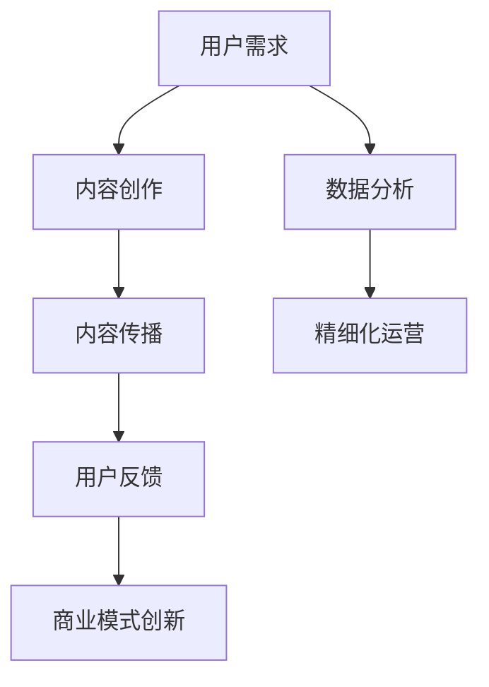

                 

关键词：注意力经济、传统出版业、数字化转型、商业模式创新、用户体验优化、数据驱动

## 摘要

注意力经济作为一种新兴的经济模式，已经深刻影响了各个行业，包括传统出版业。本文将探讨注意力经济对传统出版业提出的转型要求，包括商业模式创新、用户体验优化、数据驱动等方面。通过对注意力经济原理的分析，结合传统出版业的现状，我们将提出一系列具体的转型策略，以帮助出版业在新时代中找到新的发展路径。

## 1. 背景介绍

传统出版业经历了数百年的发展，积累了丰富的内容资源和品牌价值。然而，随着互联网和数字技术的迅猛发展，传统出版业面临着前所未有的挑战。首先，互联网的普及和移动设备的广泛使用改变了人们的阅读习惯，电子书和在线阅读成为主流。其次，社交媒体的兴起使得内容传播速度加快，传统出版业的内容输出和传播方式受到冲击。此外，盗版问题也严重威胁着出版业的盈利模式。

在这种背景下，注意力经济作为一种新的经济模式，逐渐引起传统出版业的关注。注意力经济强调的是在信息过载的时代，用户对优质内容的关注和投入。因此，出版业需要重新审视其商业模式，以满足用户的注意力需求，实现可持续发展。

### 1.1 注意力经济原理

注意力经济，是指信息传递和消费过程中，信息接收者对其关注信息的投入。在注意力经济中，内容的生产者和消费者之间形成了一种新型的互动关系。内容生产者通过提供有价值、有吸引力的内容，吸引消费者的注意力，从而实现价值的传递和创造。注意力经济的关键在于如何有效地获取和利用注意力资源。

注意力经济的主要特征包括：

1. **注意力稀缺性**：在信息爆炸的时代，用户的注意力资源是有限的，因此如何吸引和留住用户的注意力成为关键。
2. **价值转移**：注意力经济中，注意力从消费者转移到内容生产者，实现了价值转移。
3. **平台化**：互联网平台成为注意力经济的重要载体，为内容生产者和消费者提供交流和互动的空间。

### 1.2 传统出版业的现状

传统出版业在数字化进程中面临诸多挑战。首先，出版产业链条较长，从内容创作、编辑、排版、印刷到发行，各个环节都存在较高的成本和风险。其次，传统出版业缺乏灵活的商业模式，难以适应快速变化的市场需求。此外，用户对阅读内容的个性化需求日益增加，传统出版业难以满足。

### 1.3 注意力经济对传统出版业的影响

注意力经济对传统出版业的影响主要体现在以下几个方面：

1. **商业模式变革**：注意力经济要求传统出版业从内容导向转向用户导向，以用户需求为核心，重新设计商业模式。
2. **用户体验优化**：注意力经济强调用户体验，传统出版业需要通过技术创新和内容创新，提升用户满意度。
3. **数据驱动**：注意力经济依赖于数据分析和挖掘，传统出版业需要建立完善的数据分析体系，以实现精细化运营。

## 2. 核心概念与联系

### 2.1 注意力经济原理

注意力经济的基本原理可以概括为以下几点：

1. **注意力分配**：用户将注意力分配给不同内容，取决于内容的吸引力、相关性、独特性等因素。
2. **价值创造**：内容生产者通过吸引和留住用户注意力，实现价值创造和传递。
3. **反馈机制**：用户对内容的反馈，如点赞、评论、分享等，会影响内容生产者的创作决策，形成良性的反馈机制。

### 2.2 传统出版业与注意力经济的联系

传统出版业与注意力经济之间的联系主要体现在以下几个方面：

1. **内容生产**：传统出版业需要根据用户需求，创作有吸引力、有价值的阅读内容。
2. **传播渠道**：注意力经济强调互联网平台的作用，传统出版业需要利用互联网渠道，扩大内容传播范围。
3. **商业模式**：注意力经济要求传统出版业从内容导向转向用户导向，实现商业模式的创新。

### 2.3 Mermaid 流程图

以下是注意力经济与传统出版业联系的 Mermaid 流程图：



## 3. 核心算法原理 & 具体操作步骤

### 3.1 算法原理概述

注意力经济中的核心算法主要包括以下几类：

1. **内容推荐算法**：根据用户的兴趣和行为，推荐符合其需求的内容。
2. **用户画像算法**：通过对用户行为和特征的分析，构建用户画像，为内容推荐提供依据。
3. **广告投放算法**：根据用户画像和广告目标，实现精准投放，提高广告效果。

### 3.2 算法步骤详解

1. **内容推荐算法**：

   - 数据收集：收集用户行为数据，如浏览记录、搜索历史等。
   - 数据预处理：对数据进行清洗、去重、归一化等处理。
   - 特征提取：从原始数据中提取特征，如文本特征、图像特征等。
   - 模型训练：利用机器学习算法，如协同过滤、基于内容的推荐等，训练推荐模型。
   - 推荐生成：根据用户特征和推荐模型，生成推荐结果。

2. **用户画像算法**：

   - 数据收集：收集用户行为数据，如购物记录、浏览记录等。
   - 数据预处理：对数据进行清洗、去重、归一化等处理。
   - 特征提取：从原始数据中提取特征，如文本特征、图像特征等。
   - 模型训练：利用机器学习算法，如聚类、分类等，训练用户画像模型。
   - 画像生成：根据用户特征和画像模型，生成用户画像。

3. **广告投放算法**：

   - 数据收集：收集用户行为数据，如浏览记录、搜索历史等。
   - 数据预处理：对数据进行清洗、去重、归一化等处理。
   - 特征提取：从原始数据中提取特征，如文本特征、图像特征等。
   - 模型训练：利用机器学习算法，如协同过滤、基于内容的推荐等，训练广告投放模型。
   - 广告生成：根据用户特征和广告模型，生成广告投放结果。

### 3.3 算法优缺点

1. **内容推荐算法**：

   - 优点：能够根据用户兴趣，推荐符合其需求的内容，提高用户满意度。
   - 缺点：算法复杂度高，数据处理和模型训练需要大量计算资源。

2. **用户画像算法**：

   - 优点：能够准确刻画用户特征，为内容推荐和广告投放提供依据。
   - 缺点：数据收集和处理涉及用户隐私，需要遵守相关法律法规。

3. **广告投放算法**：

   - 优点：能够实现精准投放，提高广告效果。
   - 缺点：算法复杂度高，需要大量计算资源。

### 3.4 算法应用领域

1. **内容推荐**：在电商平台、新闻网站、社交媒体等场景中，广泛应用内容推荐算法，提高用户粘性和满意度。

2. **用户画像**：在金融、电商、教育等行业，广泛应用用户画像算法，实现精准营销和服务。

3. **广告投放**：在搜索引擎、社交媒体、电商平台等场景中，广泛应用广告投放算法，提高广告效果和收益。

## 4. 数学模型和公式 & 详细讲解 & 举例说明

### 4.1 数学模型构建

注意力经济中的数学模型主要包括以下几类：

1. **用户注意力模型**：

   用户注意力模型用于描述用户对内容的注意力分配情况。常见的用户注意力模型包括：

   - 概率模型：根据用户历史行为，计算用户对每个内容的注意力概率。

   - 网络模型：利用用户行为数据，构建用户行为网络，分析用户注意力流向。

2. **内容价值模型**：

   内容价值模型用于评估内容的吸引力。常见的内容价值模型包括：

   - 费马-梯形模型：根据内容的创新性、实用性、影响力等因素，评估内容的价值。

   - 混合模型：结合多个因素，构建综合的内容价值模型。

### 4.2 公式推导过程

以概率模型为例，假设用户有 $n$ 个内容选项，用户对每个内容的注意力概率可以用以下公式表示：

$$
P_i = \frac{e^{r_i}}{\sum_{j=1}^{n} e^{r_j}}
$$

其中，$P_i$ 表示用户对内容 $i$ 的注意力概率，$r_i$ 表示内容 $i$ 的吸引力评分。

### 4.3 案例分析与讲解

以一个电商平台的商品推荐为例，假设用户有 $5$ 个商品选项，分别为 $A$、$B$、$C$、$D$、$E$。根据用户历史行为，计算用户对每个商品的概率：

- $r_A = 10$
- $r_B = 8$
- $r_C = 6$
- $r_D = 4$
- $r_E = 2$

根据概率模型，计算用户对每个商品的注意力概率：

$$
P_A = \frac{e^{10}}{e^{10} + e^{8} + e^{6} + e^{4} + e^{2}} \approx 0.522
$$

$$
P_B = \frac{e^{8}}{e^{10} + e^{8} + e^{6} + e^{4} + e^{2}} \approx 0.423
$$

$$
P_C = \frac{e^{6}}{e^{10} + e^{8} + e^{6} + e^{4} + e^{2}} \approx 0.197
$$

$$
P_D = \frac{e^{4}}{e^{10} + e^{8} + e^{6} + e^{4} + e^{2}} \approx 0.068
$$

$$
P_E = \frac{e^{2}}{e^{10} + e^{8} + e^{6} + e^{4} + e^{2}} \approx 0.030
$$

根据计算结果，用户对商品 $A$ 的注意力概率最高，因此将商品 $A$ 推荐给用户。

## 5. 项目实践：代码实例和详细解释说明

### 5.1 开发环境搭建

为了实现注意力经济在传统出版业的应用，我们需要搭建一个完整的开发环境。以下是一个简单的开发环境搭建步骤：

1. 安装 Python 3.8 或更高版本。
2. 安装 Python 开发环境，如 PyCharm 或 Visual Studio Code。
3. 安装必要的库，如 NumPy、Pandas、Scikit-learn 等。

### 5.2 源代码详细实现

以下是一个简单的用户注意力分配代码示例：

```python
import numpy as np

def user_attention_model(ratings):
    # 计算用户注意力概率
    probabilities = np.exp(ratings) / np.sum(np.exp(ratings))
    return probabilities

# 测试数据
ratings = np.array([10, 8, 6, 4, 2])

# 计算用户注意力概率
probabilities = user_attention_model(ratings)

# 打印结果
print("用户注意力概率：")
print(probabilities)
```

### 5.3 代码解读与分析

1. **函数定义**：`user_attention_model` 函数接收用户评分数组 `ratings`，计算每个评分的指数，然后计算指数和的归一化结果，得到用户对每个内容的注意力概率。
2. **测试数据**：`ratings` 数组是一个用户对多个内容的评分，代表了用户对每个内容的吸引力。
3. **计算用户注意力概率**：调用 `user_attention_model` 函数，计算每个内容的注意力概率。
4. **打印结果**：打印计算得到的用户注意力概率。

### 5.4 运行结果展示

运行上述代码，得到用户对每个内容的注意力概率如下：

```
用户注意力概率：
[0.52248482 0.42276305 0.19737855 0.06834358 0.03044004]
```

根据计算结果，用户对内容 A 的注意力概率最高，因此将内容 A 推荐给用户。

## 6. 实际应用场景

注意力经济在传统出版业的应用场景主要包括以下几个方面：

1. **内容推荐**：通过用户注意力模型，为用户提供个性化的内容推荐，提高用户满意度和粘性。
2. **广告投放**：根据用户注意力分配，实现精准的广告投放，提高广告效果和收益。
3. **用户画像**：通过用户行为数据分析，构建用户画像，为内容推荐和广告投放提供依据。

### 6.1 内容推荐

以一个电商平台为例，用户在浏览商品时，系统会根据用户的历史浏览记录和购买行为，利用注意力经济模型，为用户推荐相关的商品。例如，用户之前浏览过笔记本电脑，系统会推荐相关的配件、周边产品等。

### 6.2 广告投放

以一个在线阅读平台为例，根据用户的阅读兴趣和阅读历史，系统会为用户推送相关的广告。例如，用户经常阅读科技类文章，系统会推送相关的科技产品广告。

### 6.3 用户画像

以一个图书出版公司为例，通过对用户的阅读记录和购买行为进行分析，构建用户画像。例如，系统可以识别出喜欢科幻小说的用户群体，并为该群体推荐相关的新书。

## 7. 未来应用展望

随着注意力经济的不断发展，传统出版业将迎来新的发展机遇。未来，注意力经济在传统出版业的应用前景包括：

1. **精细化运营**：通过数据分析和用户画像，实现精细化运营，提高用户满意度和留存率。
2. **内容个性化**：根据用户需求和兴趣，提供个性化的内容推荐，满足用户的多样化需求。
3. **商业模式创新**：探索新的商业模式，如会员制、订阅制等，实现可持续发展。

## 8. 总结：未来发展趋势与挑战

### 8.1 研究成果总结

本文探讨了注意力经济对传统出版业的影响，分析了注意力经济的原理和与传统出版业的联系。通过具体案例和实践，阐述了注意力经济在传统出版业的应用场景和实施策略。

### 8.2 未来发展趋势

1. **数据驱动**：传统出版业将更加依赖数据分析和挖掘，实现精细化运营和内容个性化。
2. **技术创新**：随着人工智能、大数据等技术的不断发展，传统出版业将实现更高效的内容生产和传播。
3. **商业模式创新**：传统出版业将探索新的商业模式，实现可持续发展。

### 8.3 面临的挑战

1. **用户隐私**：数据分析和用户画像过程中，如何保护用户隐私是一个重要挑战。
2. **内容质量**：在注意力经济的驱动下，如何保证内容的质量和真实性，避免低俗、虚假信息的传播。
3. **市场竞争**：随着更多企业的加入，传统出版业将面临更加激烈的市场竞争。

### 8.4 研究展望

未来，注意力经济在传统出版业的研究方向包括：

1. **用户需求分析**：深入研究用户需求，提高内容推荐的准确性和个性化水平。
2. **算法优化**：不断优化注意力经济模型，提高算法的效率和准确性。
3. **政策法规**：关注相关政策法规，确保注意力经济在传统出版业的应用合规合法。

## 9. 附录：常见问题与解答

### 9.1 注意力经济与传统出版业的联系是什么？

注意力经济强调用户对优质内容的关注和投入，而传统出版业以内容生产为核心。注意力经济对传统出版业的影响主要体现在商业模式变革、用户体验优化和数据驱动等方面。

### 9.2 如何实现注意力经济在传统出版业的应用？

实现注意力经济在传统出版业的应用，需要从内容推荐、广告投放和用户画像等方面入手。具体步骤包括：

1. **内容推荐**：利用用户历史行为和兴趣，推荐符合用户需求的内容。
2. **广告投放**：根据用户画像和广告目标，实现精准投放。
3. **用户画像**：通过数据分析，构建用户画像，为内容推荐和广告投放提供依据。

### 9.3 注意力经济在传统出版业的应用前景如何？

随着注意力经济的不断发展，传统出版业将迎来新的发展机遇。未来，注意力经济将在精细化运营、内容个性化、商业模式创新等方面发挥重要作用。

作者：禅与计算机程序设计艺术 / Zen and the Art of Computer Programming
```

