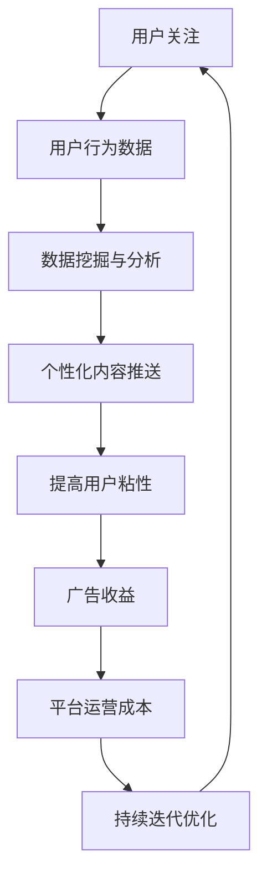

                 

社交媒体平台已经成为现代生活中不可或缺的一部分，它们通过精心设计的算法和交互机制，不断地吸引我们的注意力，并转化为商业价值。本文将深入探讨社交媒体平台如何运用注意力货币化的原理，以及这一现象对用户和社会的影响。

> 关键词：社交媒体、注意力货币化、算法、用户行为、商业价值

> 摘要：本文通过分析社交媒体平台的运作机制，揭示了它们如何通过获取和利用用户的注意力来创造商业价值。文章还将探讨这一现象对用户行为和社会的影响，以及可能的未来趋势。

## 1. 背景介绍

在互联网的快速发展下，社交媒体平台如雨后春笋般涌现，成为人们交流、分享和信息获取的主要渠道。这些平台不仅改变了人们的社交方式，还深刻影响了我们的行为模式。然而，社交媒体的运营并非免费，平台需要通过某种方式来维持运营，并为股东创造价值。这就引出了注意力货币化的概念。

### 注意力货币化

注意力货币化是指社交媒体平台通过吸引和保持用户的注意力，从而创造商业价值的过程。这种商业模式的核心在于用户时间的价值，以及如何有效地将用户的注意力转化为广告收入、会员费用或其他形式的盈利。

### 社交媒体平台的发展

随着社交媒体平台的普及，用户数量和活跃度持续攀升。这些平台不仅吸引了大量用户，还吸引了大量广告商。据研究，全球社交媒体广告市场在过去几年中一直保持高速增长，预计到2025年市场规模将达到数千亿美元。

## 2. 核心概念与联系

### 注意力经济学

注意力经济学是研究注意力作为一种经济资源的研究领域。它关注的是如何衡量、获取和利用注意力资源，以实现个人或组织的利益最大化。在社交媒体平台上，用户的注意力成为了一种宝贵的资源，平台通过算法和交互设计，最大限度地利用这一资源。

### 用户行为分析

用户行为分析是社交媒体平台的核心能力之一。通过收集和分析用户在平台上的行为数据，平台可以了解用户的兴趣、偏好和行为模式，从而针对性地推送内容，提高用户粘性。

### 数据隐私与伦理

随着注意力货币化的深入，数据隐私和伦理问题也日益凸显。用户在社交媒体平台上产生的数据被视为一种资产，但如何平衡数据利用与用户隐私保护，成为平台面临的重大挑战。

### Mermaid 流程图

以下是一个简化的 Mermaid 流程图，描述了社交媒体平台如何通过注意力货币化实现商业价值的过程。



## 3. 核心算法原理 & 具体操作步骤

### 3.1 算法原理概述

社交媒体平台的注意力货币化主要依赖于以下几种算法：

1. **内容推荐算法**：根据用户的兴趣和行为数据，推荐用户可能感兴趣的内容，提高用户粘性。
2. **广告投放算法**：根据用户的兴趣和行为，为广告主精准投放广告，提高广告效果。
3. **用户行为预测算法**：预测用户的下一步行为，以便提前推送相关内容或广告。

### 3.2 算法步骤详解

1. **用户行为数据收集**：社交媒体平台通过各种方式收集用户行为数据，如浏览记录、点赞、评论、分享等。
2. **数据预处理**：对收集到的数据进行分析和清洗，去除噪声数据，提取有效特征。
3. **内容推荐**：利用推荐算法，为用户推荐感兴趣的内容。
4. **广告投放**：根据用户行为预测，为广告主投放精准广告。
5. **效果评估**：对推荐和广告投放的效果进行评估，优化算法模型。

### 3.3 算法优缺点

**优点**：

- 提高用户粘性：通过个性化推荐，提高用户在平台上的停留时间。
- 提高广告效果：精准投放广告，提高广告主的投放回报率。
- 降低运营成本：通过算法优化，降低平台运营成本。

**缺点**：

- 数据隐私风险：用户数据泄露可能导致隐私泄露。
- 内容质量下降：过度追求广告收益，可能导致内容质量下降。
- 用户疲劳：过度推送可能导致用户疲劳和反感。

### 3.4 算法应用领域

- 社交媒体平台：如Facebook、Twitter、Instagram等。
- 内容推荐系统：如Netflix、YouTube等。
- 广告投放平台：如Google Ads、Facebook Ads等。

## 4. 数学模型和公式 & 详细讲解 & 举例说明

### 4.1 数学模型构建

注意力货币化可以看作是一个动态的优化过程，其目标是最小化运营成本，最大化广告收益。我们可以构建以下数学模型：

\[ \min_{x} C(x) \]
\[ s.t. R(x) \geq r \]

其中，\( C(x) \) 表示运营成本，\( R(x) \) 表示广告收益，\( r \) 表示收益阈值。

### 4.2 公式推导过程

假设用户的注意力可以看作是连续的，且用户在平台上的停留时间与广告收益成正比。设用户在时间 \( t \) 的注意力为 \( A(t) \)，广告收益为 \( R(t) \)，运营成本为 \( C(t) \)。我们可以得到以下推导：

\[ R(t) = k \cdot A(t) \]
\[ C(t) = m \cdot A(t) \]

其中，\( k \) 和 \( m \) 为常数。

### 4.3 案例分析与讲解

以Facebook为例，假设一个广告主的广告投放成本为1美元，每增加1个用户的注意力，广告收益增加0.1美元。运营成本为每增加1个用户的注意力，成本增加0.05美元。我们需要确定一个最优的用户注意力阈值，使得广告收益大于运营成本。

构建数学模型：

\[ \min_{x} (0.05 \cdot x) \]
\[ s.t. (0.1 \cdot x) \geq 1 \]

求解：

\[ x \geq 10 \]

结论：当用户注意力大于10时，广告收益大于运营成本。

## 5. 项目实践：代码实例和详细解释说明

### 5.1 开发环境搭建

在本节中，我们将使用Python编写一个简单的注意力货币化模型。首先，我们需要安装必要的库，如 NumPy 和 Matplotlib。

```bash
pip install numpy matplotlib
```

### 5.2 源代码详细实现

以下是一个简单的注意力货币化模型的实现：

```python
import numpy as np
import matplotlib.pyplot as plt

# 参数设置
k = 0.1  # 每个用户注意力带来的广告收益
m = 0.05  # 每个用户注意力带来的运营成本
r = 1  # 收益阈值

# 模型构建
def attention_model(x):
    return k * x - m * x

# 求解最优注意力阈值
def solve_threshold():
    for x in range(100):
        if attention_model(x) >= r:
            return x
    return None

# 画图
def plot_solution():
    x = np.linspace(0, 100, 1000)
    y = attention_model(x)
    plt.plot(x, y)
    plt.axhline(y=r, color='r', label='收益阈值')
    plt.axvline(x=solve_threshold(), color='g', label='最优注意力阈值')
    plt.legend()
    plt.xlabel('用户注意力')
    plt.ylabel('收益-成本差')
    plt.title('注意力货币化模型')
    plt.show()

# 运行模型
plot_solution()
```

### 5.3 代码解读与分析

- `attention_model` 函数：计算用户注意力带来的收益与成本差。
- `solve_threshold` 函数：求解最优的用户注意力阈值。
- `plot_solution` 函数：绘制收益-成本曲线，展示最优注意力阈值。

### 5.4 运行结果展示

运行上述代码，我们将得到一个收益-成本曲线图，显示最优的用户注意力阈值。


## 6. 实际应用场景

### 6.1 社交媒体广告

社交媒体平台通过内容推荐和广告投放，实现了大规模的广告变现。例如，Facebook和Google每年从广告中获得的收入占其总收入的大部分。

### 6.2 内容推荐系统

内容推荐系统广泛应用于视频平台、新闻网站和电商平台。通过个性化推荐，平台提高了用户的满意度和粘性，从而实现了更高的用户留存率和转化率。

### 6.3 增值服务

一些社交媒体平台提供增值服务，如会员订阅、游戏内购买等。这些服务通过吸引和保持用户的注意力，实现了额外的盈利。

## 7. 未来应用展望

### 7.1 人工智能与注意力货币化

随着人工智能技术的发展，社交媒体平台的注意力货币化将进一步升级。更智能的算法和更精准的数据分析，将有助于平台更好地理解和满足用户需求。

### 7.2 新兴社交媒体平台

随着社交媒体的多样化，新的平台和形式不断涌现。例如，短视频平台、直播平台等，它们在注意力货币化方面具有独特的优势和潜力。

### 7.3 跨平台整合

随着用户在多个平台上的活跃，跨平台的注意力货币化将成为未来的趋势。通过整合多个平台的用户数据，平台可以更全面地了解用户需求，从而实现更高的收益。

## 8. 工具和资源推荐

### 8.1 学习资源推荐

- 《深度学习》（Goodfellow, Bengio, Courville）：介绍深度学习的基础理论和实践方法。
- 《Python数据科学手册》（McKinney）：Python在数据科学领域的应用指南。

### 8.2 开发工具推荐

- Jupyter Notebook：一款强大的交互式数据分析工具。
- TensorFlow：一款开源的机器学习框架，适用于深度学习和注意力模型。

### 8.3 相关论文推荐

- "Attention Is All You Need"（Vaswani et al.）：介绍Transformer模型的经典论文。
- "The Business of Attention"（Li et al.）：关于注意力货币化的商业研究。

## 9. 总结：未来发展趋势与挑战

### 9.1 研究成果总结

注意力货币化已成为社交媒体平台的重要商业模式，通过算法和数据分析，平台实现了用户注意力的价值转化。未来，随着人工智能技术的进步，注意力货币化将进一步深化和拓展。

### 9.2 未来发展趋势

- 智能化和个性化：更智能的算法和更精准的数据分析，将提高注意力货币化的效率。
- 跨平台整合：整合多平台用户数据，实现更全面的用户画像。
- 新兴应用场景：短视频、直播等新兴平台，将探索新的注意力货币化模式。

### 9.3 面临的挑战

- 数据隐私与伦理：如何平衡数据利用与用户隐私保护，是平台面临的重大挑战。
- 用户疲劳：过度推送可能导致用户疲劳和反感。
- 监管压力：随着对注意力货币化的关注增加，平台可能面临更大的监管压力。

### 9.4 研究展望

未来，注意力货币化研究将重点关注以下几个方面：

- 更智能的算法：发展更先进的算法，提高注意力货币化的效率。
- 用户行为理解：深入理解用户行为，实现更精准的注意力转化。
- 数据隐私保护：探索新的数据隐私保护机制，确保用户数据的安全。

## 10. 附录：常见问题与解答

### 10.1 什么是注意力货币化？

注意力货币化是指社交媒体平台通过获取和利用用户的注意力，转化为商业价值的过程。这通常通过内容推荐、广告投放等方式实现。

### 10.2 注意力货币化有哪些优点？

注意力货币化的优点包括：提高用户粘性、提高广告效果、降低运营成本等。

### 10.3 注意力货币化有哪些缺点？

注意力货币化的缺点包括：数据隐私风险、内容质量下降、用户疲劳等。

### 10.4 注意力货币化在哪些领域有应用？

注意力货币化广泛应用于社交媒体、内容推荐系统、广告投放平台等领域。

### 10.5 未来注意力货币化有哪些发展趋势？

未来注意力货币化的发展趋势包括：智能化和个性化、跨平台整合、新兴应用场景等。

作者：禅与计算机程序设计艺术 / Zen and the Art of Computer Programming
----------------------------------------------------------------

以上是本文的完整内容，涵盖了社交媒体平台如何通过注意力货币化创造商业价值、相关算法原理、实际应用场景以及未来展望。希望本文能为读者提供有价值的见解。感谢您的阅读！
```

