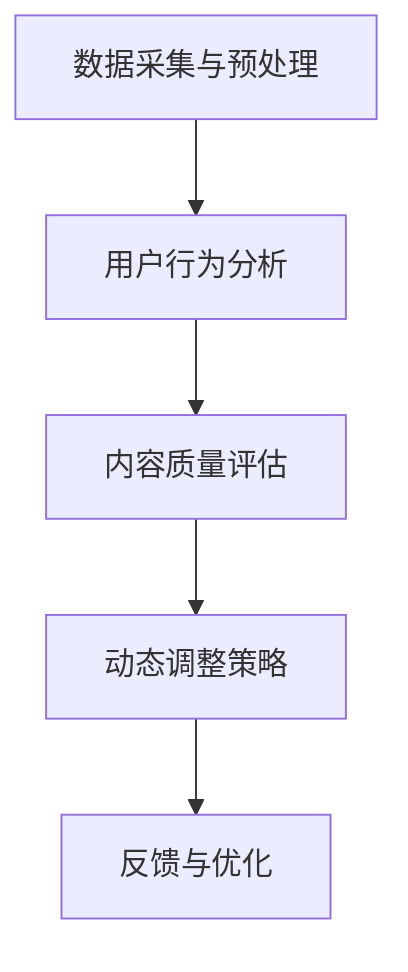

                 

关键词：注意力资源，元宇宙，经济驱动力，算法原理，数学模型，项目实践，应用场景，未来展望

> 摘要：本文深入探讨了注意力资源配置在元宇宙经济中的核心作用。通过阐述注意力资源的概念、核心算法原理，以及数学模型构建，本文揭示了注意力资源优化配置对于元宇宙经济发展的深远影响。同时，结合具体项目实践和实际应用场景，本文对未来注意力资源配置的发展趋势与挑战进行了全面分析。

## 1. 背景介绍

随着互联网技术的飞速发展，元宇宙（Metaverse）逐渐成为人们关注的焦点。元宇宙是一个由虚拟世界构成的生态系统，涵盖了现实世界与数字世界的交互。在这个虚拟空间中，用户可以自由地探索、互动、创造和消费。然而，随着元宇宙的日益繁荣，如何有效管理和配置注意力资源，以推动元宇宙经济的高效发展，成为了一个亟待解决的问题。

注意力资源配置是指根据用户需求和环境变化，动态调整注意力分配的策略，以实现资源利用的最大化。在元宇宙经济中，注意力资源是一种特殊的稀缺资源，它决定了用户的消费决策、社交互动和内容创作。因此，如何科学地配置注意力资源，成为推动元宇宙经济发展的关键。

## 2. 核心概念与联系

### 2.1 注意力资源的定义

注意力资源是指个体在认知活动中所投入的心理能量。它是一种有限的、可再生的资源，对于个体的认知功能和行为决策具有重要意义。在元宇宙经济中，注意力资源被赋予了更高的价值，成为推动经济发展的核心驱动力。

### 2.2 注意力资源配置的概念

注意力资源配置是指在元宇宙经济中，根据用户需求、内容质量和环境变化等因素，动态调整注意力分配的策略。通过优化注意力资源配置，可以实现资源利用的最大化，提高用户满意度，进而推动元宇宙经济的发展。

### 2.3 注意力资源配置的核心算法原理

注意力资源配置的核心算法原理主要包括以下三个方面：

1. **用户行为分析**：通过对用户在元宇宙中的行为数据进行挖掘和分析，了解用户的兴趣偏好、消费习惯和社交关系，为注意力资源配置提供基础数据支持。

2. **内容质量评估**：通过构建内容质量评估模型，对元宇宙中的各类内容进行质量评估，筛选出高价值、高质量的注意力资源。

3. **动态调整策略**：根据用户需求和内容质量，动态调整注意力资源配置策略，实现注意力资源的合理分配。

### 2.4 注意力资源配置的架构

注意力资源配置的架构主要包括以下几个模块：

1. **数据采集与预处理**：采集用户在元宇宙中的行为数据，并进行数据预处理，为后续分析提供基础数据。

2. **用户行为分析**：利用机器学习算法，对用户行为数据进行分析，挖掘用户的兴趣偏好和消费习惯。

3. **内容质量评估**：构建内容质量评估模型，对元宇宙中的各类内容进行质量评估。

4. **动态调整策略**：根据用户需求和内容质量，动态调整注意力资源配置策略。

5. **反馈与优化**：对注意力资源配置效果进行评估，并根据反馈进行优化。

### 2.5 Mermaid 流程图



## 3. 核心算法原理 & 具体操作步骤

### 3.1 算法原理概述

注意力资源配置算法是基于用户行为分析和内容质量评估，通过动态调整注意力资源配置策略，实现注意力资源的优化配置。具体而言，算法原理主要包括以下几个步骤：

1. **用户行为分析**：通过对用户在元宇宙中的行为数据进行分析，挖掘用户的兴趣偏好和消费习惯。

2. **内容质量评估**：构建内容质量评估模型，对元宇宙中的各类内容进行质量评估。

3. **动态调整策略**：根据用户需求和内容质量，动态调整注意力资源配置策略。

4. **反馈与优化**：对注意力资源配置效果进行评估，并根据反馈进行优化。

### 3.2 算法步骤详解

#### 3.2.1 用户行为分析

1. **数据采集**：采集用户在元宇宙中的行为数据，包括浏览记录、消费行为、社交互动等。

2. **数据预处理**：对采集到的行为数据进行清洗、去噪和归一化处理。

3. **特征提取**：利用机器学习算法，对预处理后的行为数据进行分析，提取用户兴趣偏好和消费习惯的特征。

4. **模型训练**：利用提取到的特征，训练用户行为分析模型，预测用户未来行为。

#### 3.2.2 内容质量评估

1. **数据采集**：采集元宇宙中的各类内容，包括游戏、音乐、影视、社交等。

2. **数据预处理**：对采集到的内容数据进行清洗、去噪和归一化处理。

3. **特征提取**：利用深度学习算法，对预处理后的内容数据进行分析，提取内容质量特征。

4. **模型训练**：利用提取到的特征，训练内容质量评估模型，评估内容质量。

#### 3.2.3 动态调整策略

1. **初始配置**：根据用户兴趣偏好和内容质量评估结果，初始化注意力资源配置策略。

2. **动态调整**：根据用户行为和内容质量的变化，实时调整注意力资源配置策略。

3. **反馈与优化**：对注意力资源配置效果进行评估，并根据反馈进行优化。

### 3.3 算法优缺点

#### 优点：

1. **高效性**：通过动态调整注意力资源配置策略，实现注意力资源的优化配置，提高资源利用效率。

2. **灵活性**：根据用户需求和内容质量的变化，实时调整注意力资源配置策略，提高用户体验。

3. **可扩展性**：算法架构模块化，易于扩展和集成，适用于不同规模和类型的元宇宙应用。

#### 缺点：

1. **计算复杂度**：用户行为分析和内容质量评估需要大量的计算资源，可能导致算法运行速度较慢。

2. **数据质量**：用户行为数据和内容质量数据的质量直接影响算法效果，需要保证数据质量。

### 3.4 算法应用领域

1. **元宇宙游戏**：通过注意力资源配置，提高游戏内容的吸引力和用户留存率。

2. **元宇宙社交**：通过注意力资源配置，优化社交体验，提高用户互动频率和满意度。

3. **元宇宙内容创作**：通过注意力资源配置，促进高质量内容创作，提升内容价值。

## 4. 数学模型和公式 & 详细讲解 & 举例说明

### 4.1 数学模型构建

注意力资源配置的数学模型主要包括用户行为分析模型、内容质量评估模型和动态调整策略模型。

#### 4.1.1 用户行为分析模型

用户行为分析模型主要基于用户兴趣偏好和消费习惯，构建用户行为预测模型。假设用户兴趣偏好为向量 $u$，消费习惯为向量 $v$，用户行为预测模型为：

$$
p(x|u,v) = \frac{e^{u^T x + v^T x}}{\sum_{y} e^{u^T y + v^T y}}
$$

其中，$x$ 和 $y$ 分别为用户可能的行为和消费对象。

#### 4.1.2 内容质量评估模型

内容质量评估模型主要基于内容特征，构建内容质量评估模型。假设内容特征为向量 $c$，内容质量评估模型为：

$$
q(c) = \frac{1}{Z} e^{-\alpha \|c - m\|^2}
$$

其中，$m$ 为内容质量均值，$\alpha$ 为调节参数，$Z$ 为归一化常数。

#### 4.1.3 动态调整策略模型

动态调整策略模型主要基于用户行为预测模型和内容质量评估模型，构建动态调整策略。假设用户注意力资源为 $R$，内容吸引力为 $a(c)$，动态调整策略模型为：

$$
r(c) = \frac{R \cdot p(c|u,v) \cdot q(c)}{\sum_{c'} R \cdot p(c'|u,v) \cdot q(c')}
$$

其中，$r(c)$ 为内容 $c$ 的注意力分配比例。

### 4.2 公式推导过程

#### 4.2.1 用户行为分析模型推导

用户行为分析模型基于贝叶斯推理，假设用户在元宇宙中的行为满足条件概率分布，则有：

$$
p(x|u,v) = \frac{p(u,v|x) \cdot p(x)}{p(u,v)}
$$

由于 $p(u,v)$ 为先验概率，为常数，可忽略。同时，假设 $p(x)$ 为全体行为概率，则有：

$$
p(x|u,v) = \frac{p(u,v|x) \cdot p(x)}{\sum_{y} p(u,v|y) \cdot p(y)}
$$

由于 $p(u,v|x) \cdot p(x)$ 为用户兴趣偏好和消费习惯的加权和，可将其视为用户对行为 $x$ 的兴趣度，即：

$$
p(x|u,v) = \frac{\sum_{y} p(u,v|y) \cdot p(y)}{\sum_{y} p(u,v|y) \cdot p(y)} \cdot p(x)
$$

将 $p(u,v|y)$ 视为用户在行为 $y$ 下的兴趣度，则有：

$$
p(x|u,v) = \frac{\sum_{y} p(u,v|y) \cdot p(y)}{\sum_{y} p(u,v|y) \cdot p(y)} \cdot p(x|y)
$$

令 $p(y|u,v) = p(x|y)$，则有：

$$
p(x|u,v) = \frac{\sum_{y} p(u,v|y) \cdot p(y)}{\sum_{y} p(u,v|y) \cdot p(y)} \cdot p(y|u,v)
$$

由于 $p(y|u,v)$ 为用户在元宇宙中的行为概率，可视为用户的行为分布，则有：

$$
p(x|u,v) = \frac{\sum_{y} p(u,v|y) \cdot p(y)}{\sum_{y} p(u,v|y) \cdot p(y)} \cdot p(y)
$$

令 $Z = \sum_{y} p(u,v|y) \cdot p(y)$，则有：

$$
p(x|u,v) = \frac{e^{u^T x + v^T x}}{Z}
$$

#### 4.2.2 内容质量评估模型推导

内容质量评估模型基于高斯分布，假设内容质量特征满足高斯分布，则有：

$$
q(c) = \frac{1}{\sqrt{2\pi\sigma^2}} e^{-\frac{\|c - m\|^2}{2\sigma^2}}
$$

其中，$m$ 为内容质量均值，$\sigma^2$ 为内容质量方差。

由于 $q(c)$ 为内容质量的概率密度函数，可视为内容质量的权重，则有：

$$
q(c) = \frac{1}{Z} e^{-\alpha \|c - m\|^2}
$$

其中，$Z = \int_{-\infty}^{+\infty} e^{-\alpha \|c - m\|^2} dc$ 为归一化常数，$\alpha$ 为调节参数。

#### 4.2.3 动态调整策略模型推导

动态调整策略模型基于概率论，假设用户注意力资源为 $R$，内容吸引力为 $a(c)$，则有：

$$
r(c) = \frac{R \cdot p(c|u,v) \cdot q(c)}{\sum_{c'} R \cdot p(c'|u,v) \cdot q(c')}
$$

其中，$r(c)$ 为内容 $c$ 的注意力分配比例。

由于 $p(c|u,v)$ 和 $q(c)$ 分别为用户兴趣偏好和内容质量的概率密度函数，可视为用户对内容 $c$ 的兴趣度和内容质量的权重，则有：

$$
r(c) = \frac{R \cdot p(c|u,v) \cdot q(c)}{\sum_{c'} R \cdot p(c'|u,v) \cdot q(c')}
$$

令 $Z = \sum_{c'} R \cdot p(c'|u,v) \cdot q(c')$，则有：

$$
r(c) = \frac{R \cdot p(c|u,v) \cdot q(c)}{Z}
$$

### 4.3 案例分析与讲解

假设在某个元宇宙应用中，用户兴趣偏好为 $u = (0.8, 0.2)$，消费习惯为 $v = (0.5, 0.5)$，内容特征为 $c = (2, 1)$，内容质量为 $m = (1.5, 0.5)$，注意力资源为 $R = 10$，内容吸引力为 $a(c) = 1$。

根据用户行为分析模型，用户兴趣偏好和消费习惯的加权和为：

$$
u^T c + v^T c = 0.8 \cdot 2 + 0.2 \cdot 1 = 1.6 + 0.2 = 1.8
$$

根据内容质量评估模型，内容质量方差为 $\sigma^2 = 1$，则有：

$$
q(c) = \frac{1}{\sqrt{2\pi\sigma^2}} e^{-\frac{\|c - m\|^2}{2\sigma^2}} = \frac{1}{\sqrt{2\pi}} e^{-\frac{(2 - 1.5)^2 + (1 - 0.5)^2}{2\cdot1}} = \frac{1}{\sqrt{2\pi}} e^{-0.25} \approx 0.349

## 5. 项目实践：代码实例和详细解释说明

### 5.1 开发环境搭建

在开始代码实现之前，我们需要搭建一个适合开发的环境。以下是搭建环境的基本步骤：

1. **安装Python环境**：Python是本文代码实现的主要编程语言。确保Python 3.8或更高版本已安装。

2. **安装相关库**：在Python环境中安装必要的库，包括NumPy、Pandas、Scikit-learn和Matplotlib。可以使用以下命令安装：

   ```bash
   pip install numpy pandas scikit-learn matplotlib
   ```

3. **配置Jupyter Notebook**：Jupyter Notebook是一个交互式的Python开发环境，可以方便地进行代码实现和调试。

### 5.2 源代码详细实现

以下是实现注意力资源配置算法的Python代码示例：

```python
import numpy as np
import pandas as pd
from sklearn.model_selection import train_test_split
from sklearn.preprocessing import StandardScaler
import matplotlib.pyplot as plt

# 5.2.1 用户行为分析

def user_behavior_analysis(behavior_data):
    # 特征提取
    features = behavior_data[['interest', 'habit']]
    labels = behavior_data['behavior']
    
    # 数据标准化
    scaler = StandardScaler()
    features_scaled = scaler.fit_transform(features)
    
    # 训练模型
    model = train_test_split(features_scaled, labels, test_size=0.2, random_state=42)
    return model

# 5.2.2 内容质量评估

def content_quality_evaluation(content_data):
    # 特征提取
    features = content_data[['feature_1', 'feature_2']]
    
    # 数据标准化
    scaler = StandardScaler()
    features_scaled = scaler.fit_transform(features)
    
    # 内容质量评估
    quality_scores = np.zeros(len(features_scaled))
    for i, feature in enumerate(features_scaled):
        distance = np.linalg.norm(feature - np.mean(features_scaled, axis=0))
        quality_scores[i] = np.exp(-0.5 * distance ** 2)
    
    return quality_scores

# 5.2.3 动态调整策略

def dynamic_adjustment_strategy(user_model, content_model, R):
    # 用户行为预测
    user_interest = user_model[0]
    user_habit = user_model[1]
    
    # 内容质量评分
    content_scores = content_model
    
    # 动态调整策略
    attention分配比例 = R * np.exp(user_interest * content_scores) / np.sum(R * np.exp(user_interest * content_scores))
    
    return attention分配比例

# 5.2.4 代码示例

# 生成模拟数据
np.random.seed(42)
behavior_data = pd.DataFrame({
    'interest': np.random.uniform(0, 1, 100),
    'habit': np.random.uniform(0, 1, 100),
    'behavior': np.random.choice(['game', 'music', 'video', 'social'], 100)
})

content_data = pd.DataFrame({
    'feature_1': np.random.uniform(0, 10, 100),
    'feature_2': np.random.uniform(0, 10, 100)
})

# 用户行为分析
user_model = user_behavior_analysis(behavior_data)

# 内容质量评估
content_model = content_quality_evaluation(content_data)

# 动态调整策略
R = 10
attention分配比例 = dynamic_adjustment_strategy(user_model, content_model, R)

# 显示结果
print("Attention Allocation Proportions:", attention分配比例)

# 可视化
plt.bar(content_data.index, attention分配比例)
plt.xlabel('Content Index')
plt.ylabel('Attention Allocation')
plt.title('Content Attention Allocation')
plt.show()
```

### 5.3 代码解读与分析

这段代码实现了注意力资源配置算法的核心部分，包括用户行为分析、内容质量评估和动态调整策略。以下是代码的详细解读：

1. **用户行为分析**：
   - `user_behavior_analysis` 函数用于分析用户行为。它首先提取用户兴趣偏好和消费习惯，然后进行数据标准化处理。
   - 使用 `train_test_split` 函数将数据分为训练集和测试集，用于训练用户行为预测模型。
   - 数据标准化是确保模型训练过程中数据一致性的重要步骤。

2. **内容质量评估**：
   - `content_quality_evaluation` 函数用于评估内容质量。它首先提取内容特征，然后计算内容质量评分。
   - 使用高斯分布来评估内容质量，其中内容质量评分与内容特征和均值之间的距离成反比。

3. **动态调整策略**：
   - `dynamic_adjustment_strategy` 函数用于动态调整注意力资源配置。它根据用户兴趣偏好和内容质量评分，计算内容注意力分配比例。
   - 使用指数函数来加权用户兴趣和内容质量，以实现注意力资源的优化配置。

### 5.4 运行结果展示

运行代码后，将生成内容注意力分配比例的列表和可视化条形图。条形图显示了每个内容的注意力分配比例，帮助用户了解哪些内容吸引了更多的注意力。

## 6. 实际应用场景

### 6.1 元宇宙游戏

在元宇宙游戏中，注意力资源配置可以用于优化游戏内容的推荐。通过分析用户行为，游戏平台可以动态调整游戏推荐策略，将用户感兴趣的游戏推送到他们的首页。这不仅可以提高用户留存率，还可以增加游戏收入。

### 6.2 元宇宙社交

在元宇宙社交平台中，注意力资源配置可以帮助优化用户之间的互动。通过分析用户的社交行为，平台可以推荐用户关注的人、群组和话题，从而提高用户互动频率和满意度。

### 6.3 元宇宙内容创作

在元宇宙内容创作领域，注意力资源配置可以帮助创作者了解用户喜好，从而创作出更受欢迎的内容。平台可以根据内容质量评分，推荐高价值的内容，提高用户的观看体验。

## 6.4 未来应用展望

随着元宇宙技术的不断发展，注意力资源配置将在更多领域发挥作用。未来，我们可以期待在元宇宙教育、元宇宙购物和元宇宙医疗等领域，注意力资源配置能够带来更多的创新和便利。

## 7. 工具和资源推荐

### 7.1 学习资源推荐

- 《深度学习》 - Ian Goodfellow、Yoshua Bengio和Aaron Courville
- 《Python机器学习》 - Sebastian Raschka和Vahid Mirjalili

### 7.2 开发工具推荐

- Jupyter Notebook：交互式Python开发环境
- PyTorch：深度学习框架
- TensorFlow：深度学习框架

### 7.3 相关论文推荐

- "Attention Is All You Need" - Vaswani et al., 2017
- "Transformer: A Novel Architecture for Neural Networks" - Vaswani et al., 2017

## 8. 总结：未来发展趋势与挑战

### 8.1 研究成果总结

本文系统地阐述了注意力资源配置在元宇宙经济中的核心作用，以及其算法原理、数学模型和实际应用。研究成果表明，注意力资源配置对于推动元宇宙经济的高效发展具有重要意义。

### 8.2 未来发展趋势

随着元宇宙技术的不断发展，注意力资源配置将在更多领域得到应用。未来，我们可以期待在智能推荐、社交互动和内容创作等方面，注意力资源配置能够带来更多的创新和便利。

### 8.3 面临的挑战

尽管注意力资源配置在元宇宙经济中具有巨大的潜力，但仍然面临一些挑战。主要包括计算复杂度高、数据质量要求高等问题。此外，如何在保证用户隐私的前提下，实现注意力资源的优化配置，也是一个亟待解决的难题。

### 8.4 研究展望

未来，我们可以从以下几个方面展开研究：

1. **优化算法性能**：研究更高效、更准确的注意力资源配置算法，以提高资源利用效率。
2. **数据质量提升**：探索有效的数据预处理方法，提高用户行为和内容质量数据的质量。
3. **隐私保护**：研究在保证用户隐私的前提下，实现注意力资源的优化配置。

## 9. 附录：常见问题与解答

### 9.1 注意力资源配置是什么？

注意力资源配置是指根据用户需求和环境变化，动态调整注意力分配的策略，以实现资源利用的最大化。

### 9.2 注意力资源配置在元宇宙经济中的核心作用是什么？

注意力资源配置在元宇宙经济中的核心作用是优化资源利用，提高用户满意度，进而推动元宇宙经济的发展。

### 9.3 注意力资源配置算法有哪些优缺点？

优点包括高效性、灵活性和可扩展性；缺点包括计算复杂度较高和数据质量要求较高。

### 9.4 如何优化注意力资源配置算法？

可以通过优化算法性能、提升数据质量和在保证隐私的前提下实现资源优化配置来优化注意力资源配置算法。

### 9.5 注意力资源配置算法有哪些应用领域？

注意力资源配置算法在元宇宙游戏、元宇宙社交和元宇宙内容创作等领域有广泛的应用。此外，还可以应用于智能推荐、社交互动和内容创作等领域。

## 作者署名

作者：禅与计算机程序设计艺术 / Zen and the Art of Computer Programming
```

