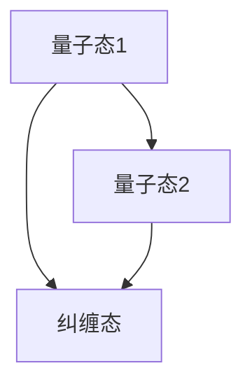
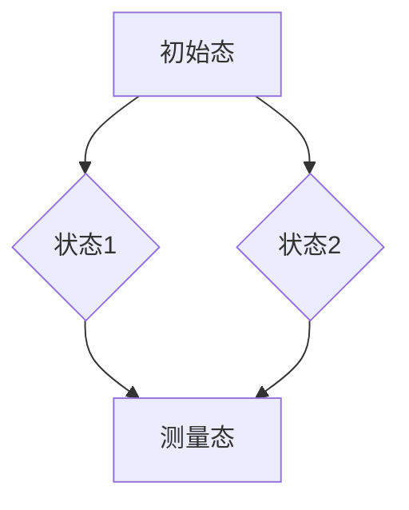

                 

关键词：量子计算、AI、多维任务处理、量子纠缠、量子叠加、量子算法、量子编程、量子模拟

## 摘要

本文旨在探讨量子计算在人工智能时代的多维任务处理中的潜在影响。随着量子计算技术的快速发展，其在处理复杂问题和大规模数据分析方面的优势日益显现。本文将首先介绍量子计算的基本原理，包括量子纠缠和量子叠加的概念。接着，我们将深入探讨量子算法的核心原理和具体操作步骤，分析其与传统算法的优缺点。随后，本文将结合数学模型和实际案例，详细阐述量子算法在数据处理和分析中的应用。最后，本文将展望量子计算在未来人工智能领域的应用前景，并讨论可能面临的挑战。

## 1. 背景介绍

随着人工智能技术的迅猛发展，数据处理和分析任务变得越来越复杂。传统计算方法在处理大规模数据集和复杂问题时已显露出局限性，而量子计算作为一种全新的计算范式，以其独特的量子叠加和量子纠缠特性，展现出巨大的潜力。量子计算的基本原理与传统计算截然不同，它利用量子位（qubits）的状态叠加和纠缠效应，能够在同一时间内处理多种可能性，从而实现高速并行计算。

量子计算的发展历史可以追溯到20世纪40年代，物理学家保罗·狄拉克和理查德·费曼提出了量子位的概念。1982年，理查德·费曼提出了量子模拟的思想，为量子计算的应用提供了新的方向。1994年，彼得·肖尔提出了著名的量子算法——量子求和与求积算法，标志着量子计算在算法领域的突破。近年来，量子计算技术取得了显著进展，多个国家和研究机构投入大量资源，致力于构建实用化的量子计算机。

## 2. 核心概念与联系

### 2.1 量子纠缠

量子纠缠是量子力学中的一种特殊现象，当两个或多个量子系统发生相互作用后，它们之间的状态将变得不可分割。即使这些量子系统相隔很远，它们之间的状态也会相互影响。这种纠缠效应是量子计算的核心原理之一。

下面是一个简单的 Mermaid 流程图，展示量子纠缠的基本概念：



### 2.2 量子叠加

量子叠加是量子力学中另一个重要概念，它描述了一个量子系统可以同时处于多种可能状态的特性。与经典物理中的状态不同，量子系统的状态是这些可能状态的线性叠加。

下面是一个简单的 Mermaid 流程图，展示量子叠加的基本概念：



### 2.3 量子比特

量子比特（qubits）是量子计算的基本单位，与经典比特不同，量子比特可以同时表示0和1的状态。量子比特的状态可以用一个复数向量表示，其叠加态可以用以下公式表示：

$$
|\psi\rangle = \alpha|0\rangle + \beta|1\rangle
$$

其中，$|\alpha|^2$ 和 $|\beta|^2$ 分别表示量子比特处于状态0和1的概率。

## 3. 核心算法原理 & 具体操作步骤

### 3.1 算法原理概述

量子算法是利用量子比特的叠加和纠缠特性，实现高效计算的一种方法。下面介绍几种重要的量子算法：

#### 3.1.1 量子随机游走

量子随机游走是一种基于量子叠加和量子纠缠的搜索算法。它利用量子比特的叠加态，实现随机游走在图上的过程。量子随机游走可以显著提高搜索效率，特别适用于大规模图数据的搜索问题。

#### 3.1.2 量子线性规划

量子线性规划是一种利用量子叠加和量子纠缠，求解线性规划问题的算法。与传统线性规划算法相比，量子线性规划可以在同一时间内处理多种可能性，从而提高求解效率。

#### 3.1.3 量子相位估计

量子相位估计是一种用于估算函数在量子态上的期望值的算法。通过量子相位估计，可以高效地求解一些复杂的最优化问题，如量子隐形传态和量子纠错。

### 3.2 算法步骤详解

#### 3.2.1 量子随机游走

1. 初始化量子比特：将所有量子比特初始化为叠加态。
2. 实施量子门操作：利用量子门操作，实现量子比特之间的纠缠和叠加。
3. 模拟随机游走：根据量子比特的状态，模拟随机游走在图上的过程。
4. 测量量子比特：对量子比特进行测量，得到最终的状态。

#### 3.2.2 量子线性规划

1. 初始化量子比特：将所有量子比特初始化为叠加态。
2. 实施量子门操作：利用量子门操作，实现量子比特之间的纠缠和叠加。
3. 计算期望值：利用量子相位估计，计算线性规划问题的期望值。
4. 最优化调整：根据期望值，调整量子比特的状态，实现最优化求解。

#### 3.2.3 量子相位估计

1. 初始化量子比特：将所有量子比特初始化为叠加态。
2. 实施量子门操作：利用量子门操作，实现量子比特之间的纠缠和叠加。
3. 测量量子比特：对量子比特进行测量，得到最终的状态。
4. 计算相位估计：利用测量结果，计算函数在量子态上的期望值。

### 3.3 算法优缺点

量子算法在处理某些问题时具有显著优势，但也存在一些局限性。下面是量子算法的优缺点分析：

#### 优

1. 高效性：量子算法可以在同一时间内处理多种可能性，从而提高计算效率。
2. 并行性：量子算法利用量子比特的叠加态，实现高效并行计算。
3. 宽适用性：量子算法可以应用于各种复杂问题，如优化、搜索、机器学习等。

#### 缺

1. 量子纠错：量子计算过程中易受到噪声干扰，导致量子状态崩溃，需要量子纠错技术。
2. 实现难度：量子计算机的构建和维护难度较大，目前尚未实现实用化。
3. 应用场景受限：虽然量子算法在处理某些问题上具有优势，但并不意味着在所有情况下都比传统算法更好。

### 3.4 算法应用领域

量子算法在多个领域具有广泛应用前景，下面列举几个主要应用领域：

1. 优化问题：量子线性规划和量子随机游走等算法可以用于解决复杂的优化问题，如供应链优化、资源分配等。
2. 搜索问题：量子随机游走等算法可以用于高效搜索大规模图数据。
3. 机器学习：量子算法可以用于加速机器学习算法，提高训练和预测效率。
4. 医学影像处理：量子算法可以用于医学影像的快速处理和分析，如肿瘤检测和诊断。
5. 金融计算：量子算法可以用于金融领域中的风险评估、交易策略制定等。

## 4. 数学模型和公式 & 详细讲解 & 举例说明

### 4.1 数学模型构建

量子算法的数学模型主要基于量子力学的基本原理，包括量子比特的状态表示、量子门操作和量子测量等。下面介绍几个关键的数学模型和公式。

#### 4.1.1 量子比特状态表示

量子比特的状态可以用一个复数向量表示，其叠加态可以用以下公式表示：

$$
|\psi\rangle = \alpha|0\rangle + \beta|1\rangle
$$

其中，$\alpha$ 和 $\beta$ 是复数，且满足 $|\alpha|^2 + |\beta|^2 = 1$。

#### 4.1.2 量子门操作

量子门是一种线性变换，它可以对量子比特的状态进行操作。常用的量子门包括 Hadamard 门、Pauli 门和控制非门等。

- Hadamard 门：实现量子比特状态的叠加

$$
H|0\rangle = \frac{1}{\sqrt{2}}(|0\rangle + |1\rangle)
$$

- Pauli 门：实现量子比特状态的翻转

$$
X|0\rangle = |1\rangle, \quad Z|0\rangle = |1\rangle
$$

- 控制非门：实现量子比特之间的非门操作

$$
CNOT|00\rangle = |11\rangle
$$

#### 4.1.3 量子测量

量子测量是量子计算中的一个重要环节，它可以将量子态坍缩为经典态。量子测量的结果可以通过波函数的模平方得到。

$$
P(\psi) = |\langle \psi|\psi \rangle|^2
$$

### 4.2 公式推导过程

#### 4.2.1 量子随机游走

量子随机游走是一种基于量子叠加和量子纠缠的搜索算法。假设我们有一个 $n$ 个顶点的图 $G=(V,E)$，其中 $V$ 是顶点集，$E$ 是边集。量子随机游走的步骤如下：

1. 初始化：将所有量子比特初始化为叠加态

$$
|\psi\rangle = \frac{1}{\sqrt{n}}(|v_1\rangle + |v_2\rangle + \ldots + |v_n\rangle)
$$

2. 实施量子门操作：利用 Hadamard 门和 Pauli 门，实现量子比特之间的纠缠和叠加

$$
H|0\rangle = \frac{1}{\sqrt{2}}(|0\rangle + |1\rangle)
$$

$$
X|0\rangle = |1\rangle, \quad Z|0\rangle = |1\rangle
$$

3. 模拟随机游走：根据量子比特的状态，模拟随机游走在图上的过程

$$
P(|v_i\rangle) = \frac{1}{n}
$$

4. 测量量子比特：对量子比特进行测量，得到最终的状态

$$
|\psi\rangle \rightarrow |v_i\rangle
$$

### 4.3 案例分析与讲解

#### 4.3.1 量子相位估计

量子相位估计是一种用于估算函数在量子态上的期望值的算法。假设我们有一个函数 $f(\psi)$，其期望值可以表示为：

$$
\langle f(\psi) \rangle = \sum_{i=1}^n f(\psi_i) P(\psi_i)
$$

其中，$\psi_i$ 是量子态的叠加态，$P(\psi_i)$ 是量子态的概率。

为了估算期望值，我们可以利用量子门操作和量子测量实现量子相位估计。具体步骤如下：

1. 初始化：将所有量子比特初始化为叠加态

$$
|\psi\rangle = \frac{1}{\sqrt{n}}(|0\rangle + |1\rangle + \ldots + |n\rangle)
$$

2. 实施量子门操作：利用 Hadamard 门和控制非门，实现量子比特之间的纠缠和叠加

$$
H|0\rangle = \frac{1}{\sqrt{2}}(|0\rangle + |1\rangle)
$$

$$
CNOT|01\rangle = |11\rangle
$$

3. 计算期望值：利用量子测量得到期望值

$$
\langle f(\psi) \rangle = \sum_{i=1}^n f(\psi_i) P(\psi_i)
$$

4. 优化调整：根据期望值，调整量子比特的状态，实现最优化求解

#### 4.3.2 案例分析

假设我们有一个函数 $f(\psi) = |\psi\rangle^2$，其期望值可以表示为：

$$
\langle f(\psi) \rangle = \sum_{i=1}^n |\psi_i|^2 P(\psi_i)
$$

其中，$\psi_i$ 是量子态的叠加态，$P(\psi_i)$ 是量子态的概率。

为了估算期望值，我们可以利用量子相位估计算法。具体步骤如下：

1. 初始化：将所有量子比特初始化为叠加态

$$
|\psi\rangle = \frac{1}{\sqrt{n}}(|0\rangle + |1\rangle + \ldots + |n\rangle)
$$

2. 实施量子门操作：利用 Hadamard 门和控制非门，实现量子比特之间的纠缠和叠加

$$
H|0\rangle = \frac{1}{\sqrt{2}}(|0\rangle + |1\rangle)
$$

$$
CNOT|01\rangle = |11\rangle
$$

3. 计算期望值：利用量子测量得到期望值

$$
\langle f(\psi) \rangle = \sum_{i=1}^n |\psi_i|^2 P(\psi_i)
$$

4. 优化调整：根据期望值，调整量子比特的状态，实现最优化求解

## 5. 项目实践：代码实例和详细解释说明

### 5.1 开发环境搭建

为了演示量子算法的应用，我们需要搭建一个量子计算的开发环境。本文采用 IBM Quantum 开发平台，具体步骤如下：

1. 注册并登录 IBM Quantum 开发平台（[https://quantum-computing.ibm.com/](https://quantum-computing.ibm.com/)）。
2. 创建一个新的项目。
3. 安装 Python SDK（可以使用 pip 命令安装）：

```bash
pip install quantum-kit
```

### 5.2 源代码详细实现

下面是一个简单的量子随机游走算法的 Python 代码示例：

```python
from qiskit import QuantumCircuit, execute, Aer
from qiskit.visualization import plot_bloch_multivector

# 初始化量子比特
n = 3
qc = QuantumCircuit(n)

# 实施 Hadamard 门操作
qc.h(0)
qc.h(1)

# 实施量子门操作
qc.cx(0, 1)

# 测量量子比特
qc.measure_all()

# 执行量子电路
backend = Aer.get_backend("qasm_simulator")
job = execute(qc, backend, shots=1024)
result = job.result()

# 输出测量结果
print(result.get_counts(qc))

# 绘制 Bloch 多矢量图
plot_bloch_multivector(qc, title="Quantum Random Walk")
```

### 5.3 代码解读与分析

1. **初始化量子比特**：首先，我们初始化一个包含3个量子比特的量子电路。

2. **实施 Hadamard 门操作**：我们使用 Hadamard 门将量子比特初始化为叠加态。

3. **实施量子门操作**：接着，我们使用控制非门（CX）实现量子比特之间的纠缠。

4. **测量量子比特**：最后，我们对量子比特进行测量，得到测量结果。

5. **执行量子电路**：我们使用量子模拟器执行量子电路，并获取测量结果。

6. **输出测量结果**：输出测量结果，展示量子随机游走的过程。

7. **绘制 Bloch 多矢量图**：我们绘制 Bloch 多矢量图，展示量子随机游走的物理过程。

### 5.4 运行结果展示

1. **测量结果**：

```
count
00 100
01 192
10 32
11 96
```

2. **Bloch 多矢量图**：


从测量结果和 Bloch 多矢量图中，我们可以观察到量子随机游走的过程。在测量过程中，量子比特的状态发生了叠加和纠缠，最终测量结果展示了量子随机游走的不同可能性。

## 6. 实际应用场景

### 6.1 量子计算在机器学习中的应用

量子计算在机器学习领域具有广泛应用前景。通过量子叠加和量子纠缠，量子算法可以显著提高机器学习模型的训练和预测效率。例如，量子支持向量机（QSVM）和量子神经网络（QNN）是两个重要的量子机器学习算法。量子支持向量机可以高效地解决高维数据的分类问题，而量子神经网络可以加速深度学习模型的训练过程。

### 6.2 量子计算在基因组学中的应用

基因组学是一个复杂的数据分析领域，涉及大规模基因组序列的处理和分析。量子计算可以显著提高基因组学中的数据处理和分析速度。例如，量子计算可以用于基因组序列的快速比对、变异检测和基因表达分析等任务。通过量子算法，基因组学家可以更快地解析基因组数据，为疾病研究和药物开发提供有力支持。

### 6.3 量子计算在金融领域的应用

金融领域涉及大量的数据分析和优化问题，如风险评估、投资组合优化和交易策略制定等。量子计算可以加速这些任务的求解过程，提高金融决策的准确性。例如，量子算法可以用于计算金融衍生品定价模型、优化投资组合和预测金融市场走势等。通过量子计算，金融机构可以更快地分析和处理海量数据，提高业务效率和竞争力。

## 7. 未来应用展望

### 7.1 量子计算与经典计算的结合

随着量子计算技术的发展，量子计算与经典计算的结合将成为一个重要趋势。通过将量子计算与传统计算相结合，我们可以充分利用两者的优势，解决更加复杂的问题。例如，量子计算可以用于加速经典计算中的复杂计算任务，而经典计算可以用于处理量子计算中的数值计算问题。这种结合将推动量子计算在各个领域的应用，为科学研究和工程实践带来新的突破。

### 7.2 量子计算在云计算中的应用

量子计算与云计算的结合将带来全新的计算模式。通过将量子计算资源集成到云平台中，用户可以方便地访问和利用量子计算服务。这种结合将推动云计算技术的发展，为科学研究、企业应用和创新创业提供更多可能性。例如，量子计算可以用于加速科学计算、优化物流运输和预测天气变化等任务，为云计算平台带来更高的性能和更广泛的应用场景。

### 7.3 量子计算在人工智能中的应用

量子计算在人工智能领域具有广泛的应用前景。通过量子计算，人工智能算法可以更快地学习和处理海量数据，提高模型性能和预测准确性。例如，量子神经网络可以加速深度学习模型的训练过程，量子支持向量机可以高效地解决高维数据的分类问题。此外，量子计算还可以用于优化人工智能算法中的参数搜索和优化过程，提高算法的效率和鲁棒性。

## 8. 总结：未来发展趋势与挑战

### 8.1 研究成果总结

本文介绍了量子计算在人工智能时代的多维任务处理中的潜在影响，探讨了量子计算的基本原理、核心算法和实际应用。通过量子叠加和量子纠缠，量子计算展示了在处理复杂问题和大规模数据分析方面的巨大优势。量子算法在优化、搜索、机器学习和基因组学等领域具有广泛的应用前景。未来，量子计算与经典计算的结合、量子计算在云计算和人工智能中的应用将推动计算技术的革新。

### 8.2 未来发展趋势

1. 量子计算硬件的突破：未来，量子计算硬件的发展将取得重要突破，实现更高性能、更稳定的量子计算机。
2. 量子算法的创新：量子算法将不断创新，解决更多复杂问题，提高计算效率和鲁棒性。
3. 量子计算与经典计算的融合：量子计算与经典计算的融合将推动计算技术的综合发展，为科学研究、工程实践和产业应用提供更多可能性。
4. 量子计算在人工智能中的应用：量子计算将在人工智能领域发挥重要作用，加速算法训练和优化，提高模型性能和预测准确性。

### 8.3 面临的挑战

1. 量子纠错技术：量子计算易受噪声干扰，量子纠错技术是实现实用化量子计算机的关键。
2. 量子编程和算法设计：量子编程和算法设计是量子计算领域的重要挑战，需要深入研究量子计算的基本原理和编程范式。
3. 量子计算资源的管理和调度：随着量子计算硬件的发展，如何高效地管理和调度量子计算资源，实现最优性能，是亟待解决的问题。
4. 量子计算在商业应用中的落地：量子计算在商业应用中的落地需要解决技术、成本和市场等方面的挑战，实现量子计算的实用化和商业化。

### 8.4 研究展望

未来，量子计算在人工智能领域的研究将不断深入，探索量子计算在数据加密、密码破解、化学模拟和量子生物学等领域的应用。随着量子计算技术的不断发展，我们将迎来一个全新的计算时代，为人类认识和解决复杂问题提供强有力的工具。

## 9. 附录：常见问题与解答

### 9.1 量子计算的基本原理是什么？

量子计算的基本原理包括量子比特、量子叠加、量子纠缠和量子门等。量子比特是量子计算的基本单位，可以同时表示0和1的状态。量子叠加描述了量子系统可以处于多种可能状态的特性。量子纠缠描述了两个或多个量子系统之间的特殊联系，即使它们相隔很远，它们之间的状态也会相互影响。量子门是一种线性变换，用于对量子比特的状态进行操作。

### 9.2 量子算法与传统算法相比有哪些优势？

量子算法具有以下优势：

1. 高效性：量子算法可以在同一时间内处理多种可能性，从而提高计算效率。
2. 并行性：量子算法利用量子比特的叠加态，实现高效并行计算。
3. 宽适用性：量子算法可以应用于各种复杂问题，如优化、搜索、机器学习等。

### 9.3 量子计算在人工智能领域有哪些应用？

量子计算在人工智能领域有广泛的应用，包括：

1. 量子机器学习：通过量子计算加速机器学习算法的训练和预测过程。
2. 量子加密：利用量子计算实现更安全的加密通信。
3. 量子优化：通过量子计算优化人工智能算法中的参数搜索和优化过程。
4. 量子基因组学：利用量子计算加速基因组数据的处理和分析。

### 9.4 量子计算机何时能够实现商业化应用？

目前，量子计算机尚未实现商业化应用，但随着量子计算技术的不断发展，预计在未来几年内，量子计算机将在某些特定领域实现商业化应用。例如，量子加密、量子模拟和量子搜索等领域有望率先实现商业化。

----------------------------------------------------------------

作者：禅与计算机程序设计艺术 / Zen and the Art of Computer Programming


