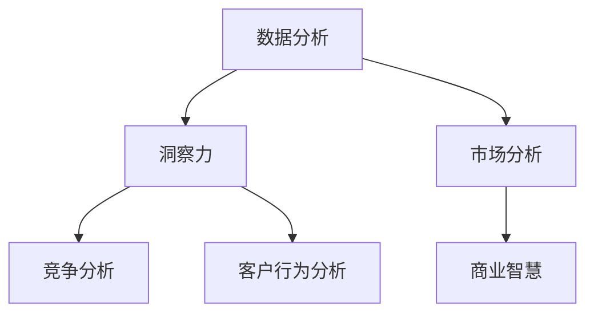

                 

在当今快速变化的商业环境中，洞察力与市场分析已成为企业成功的关键因素。这种能力不仅帮助公司了解当前的客户需求，还能预测未来的趋势，从而制定有效的战略决策。作为世界级人工智能专家，我将探讨如何在IT领域运用洞察力和市场分析来提升商业智慧。

> **关键词：** 洞察力，市场分析，商业智慧，战略决策，人工智能，IT领域

> **摘要：** 本文将详细讨论洞察力和市场分析在商业决策中的重要性，并通过具体案例和算法，展示如何在IT领域中运用这些工具来提升企业的竞争力。

## 1. 背景介绍

商业环境的快速变化要求企业具备强大的适应能力和前瞻性。传统的市场分析方法已无法满足现代企业的需求，因为它们往往过于静态，难以捕捉到动态市场的细微变化。相比之下，洞察力提供了一种更加灵活和动态的方法，可以帮助企业及时调整策略，抓住市场机遇。

在IT领域，这种需求尤为明显。技术创新的速度加快，新的商业模式不断涌现，市场竞争异常激烈。因此，IT企业必须具备强大的洞察力和市场分析能力，才能在激烈的竞争中立于不败之地。

### 1.1 洞察力的定义

洞察力是指从大量信息中提取有用知识的能力，它涉及对市场趋势、竞争对手、消费者行为和内部运营的深刻理解。这种能力不仅要求具备丰富的专业知识，还需要具备敏锐的观察力和逻辑思维能力。

### 1.2 市场分析的作用

市场分析是企业了解市场需求和竞争状况的重要工具。通过分析市场数据，企业可以确定目标客户群体、市场容量和市场份额，从而制定有效的市场策略。

### 1.3 商业智慧

商业智慧是指将洞察力和市场分析应用于实际业务决策中，以实现企业目标的能力。这种智慧不仅帮助企业在现有市场中取得成功，还能推动企业在未来的市场中持续增长。

## 2. 核心概念与联系

为了更好地理解洞察力和市场分析在IT领域的应用，我们首先需要了解一些核心概念，并展示它们之间的联系。

### 2.1 数据分析

数据分析是洞察力和市场分析的基础。它涉及从大量数据中提取有价值的信息，以支持决策。数据分析工具和技术，如统计分析、机器学习和数据挖掘，都是实现洞察力和市场分析的重要手段。

### 2.2 竞争分析

竞争分析是市场分析的重要组成部分。它通过研究竞争对手的产品、价格、市场策略和市场份额，帮助企业了解自己在市场中的位置，并制定相应的战略。

### 2.3 客户行为分析

客户行为分析是洞察力的关键组成部分。它通过研究客户的行为和偏好，帮助企业了解客户需求，并调整产品和服务以满足这些需求。

### 2.4 Mermaid 流程图

下面是一个Mermaid流程图，展示了这些核心概念之间的联系。



## 3. 核心算法原理 & 具体操作步骤

在了解了核心概念后，我们接下来将探讨一些关键算法，这些算法能够帮助我们更有效地实现洞察力和市场分析。

### 3.1 算法原理概述

核心算法通常基于机器学习和数据分析技术。这些算法能够从大量数据中提取有价值的信息，帮助我们识别市场趋势和消费者行为。

### 3.2 算法步骤详解

#### 3.2.1 数据收集

首先，我们需要收集大量数据，包括市场数据、客户行为数据和竞争对手数据。

#### 3.2.2 数据预处理

接下来，我们需要对数据进行预处理，以确保数据的质量和一致性。

#### 3.2.3 数据分析

在数据预处理完成后，我们使用机器学习和数据分析技术对数据进行分析，以提取有价值的信息。

#### 3.2.4 结果可视化

最后，我们将分析结果可视化，以便更好地理解和解释。

### 3.3 算法优缺点

这些算法的优点是能够从大量数据中快速提取有价值的信息，帮助企业在短时间内做出决策。然而，它们的缺点是需要大量的数据和计算资源，且对数据质量要求较高。

### 3.4 算法应用领域

这些算法在IT领域的应用非常广泛，包括市场预测、客户细分和竞争分析等。

## 4. 数学模型和公式 & 详细讲解 & 举例说明

### 4.1 数学模型构建

在市场分析中，我们通常使用回归模型和聚类模型来构建数学模型。

#### 4.1.1 回归模型

回归模型用于预测市场趋势和消费者行为。一个简单的线性回归模型可以表示为：

$$ y = ax + b $$

其中，$y$ 是因变量，$x$ 是自变量，$a$ 和 $b$ 是模型的参数。

#### 4.1.2 聚类模型

聚类模型用于将数据分成不同的类别，以便更好地理解市场结构和消费者行为。一个常见的聚类模型是K-means算法，其目标是将数据点分为 $K$ 个簇，使得簇内距离最小，簇间距离最大。

### 4.2 公式推导过程

#### 4.2.1 回归模型推导

线性回归模型的推导基于最小二乘法。我们的目标是找到参数 $a$ 和 $b$，使得预测值 $y$ 与实际值之间的误差最小。

$$ \min \sum_{i=1}^{n} (y_i - (ax_i + b))^2 $$

通过对上述公式求导并令导数为零，我们可以得到：

$$ a = \frac{\sum_{i=1}^{n} x_i y_i - n \bar{x} \bar{y}}{\sum_{i=1}^{n} x_i^2 - n \bar{x}^2} $$

$$ b = \bar{y} - a \bar{x} $$

其中，$\bar{x}$ 和 $\bar{y}$ 分别是 $x$ 和 $y$ 的平均值。

#### 4.2.2 K-means算法推导

K-means算法的推导基于最小化簇内距离平方和的目标。我们的目标是找到 $K$ 个簇中心，使得簇内距离最小。

$$ \min \sum_{i=1}^{K} \sum_{x \in S_i} ||x - \mu_i||^2 $$

其中，$S_i$ 是第 $i$ 个簇的集合，$\mu_i$ 是簇中心的坐标。

### 4.3 案例分析与讲解

#### 4.3.1 回归模型案例

假设我们有一个简单的线性回归模型，用于预测一家电商网站的销售量。我们有以下数据：

| 日期 | 销售量 |
|------|--------|
| 1    | 100    |
| 2    | 120    |
| 3    | 150    |
| 4    | 180    |

我们可以使用线性回归模型来预测第5天的销售量。

首先，我们计算 $x$ 和 $y$ 的平均值：

$$ \bar{x} = \frac{1 + 2 + 3 + 4}{4} = 2.5 $$
$$ \bar{y} = \frac{100 + 120 + 150 + 180}{4} = 140 $$

然后，我们计算 $a$ 和 $b$ 的值：

$$ a = \frac{(1 \cdot 100) + (2 \cdot 120) + (3 \cdot 150) + (4 \cdot 180) - 4 \cdot 2.5 \cdot 140}{(1^2 + 2^2 + 3^2 + 4^2) - 4 \cdot 2.5^2} = 40 $$

$$ b = 140 - 40 \cdot 2.5 = -10 $$

因此，我们的回归模型为：

$$ y = 40x - 10 $$

使用这个模型，我们可以预测第5天的销售量：

$$ y = 40 \cdot 5 - 10 = 190 $$

#### 4.3.2 K-means算法案例

假设我们有一个包含客户购买行为的数据集，我们需要将客户分成不同的类别。我们有以下数据：

| 客户ID | 产品A购买量 | 产品B购买量 |
|--------|-------------|-------------|
| 1      | 10          | 5           |
| 2      | 8           | 10          |
| 3      | 15          | 20          |
| 4      | 5           | 5           |
| 5      | 10          | 10          |

我们使用K-means算法将客户分成两类。

首先，我们随机选择两个簇中心：

| 簇中心ID | 产品A购买量 | 产品B购买量 |
|----------|-------------|-------------|
| 1        | 10          | 10          |
| 2        | 5           | 5           |

接下来，我们将每个客户分配到最近的簇中心：

| 客户ID | 簇中心1距离 | 簇中心2距离 | 分配簇中心 |
|--------|-------------|-------------|------------|
| 1      | 0           | 5           | 1          |
| 2      | 2           | 0           | 2          |
| 3      | 10          | 5           | 1          |
| 4      | 5           | 0           | 2          |
| 5      | 0           | 5           | 1          |

然后，我们重新计算簇中心：

| 簇中心ID | 产品A购买量 | 产品B购买量 |
|----------|-------------|-------------|
| 1        | 10          | 10          |
| 2        | 6           | 5           |

再次将客户分配到最近的簇中心：

| 客户ID | 簇中心1距离 | 簇中心2距离 | 分配簇中心 |
|--------|-------------|-------------|------------|
| 1      | 0           | 2           | 1          |
| 2      | 1           | 0           | 2          |
| 3      | 4           | 1           | 1          |
| 4      | 2           | 0           | 2          |
| 5      | 0           | 2           | 1          |

重复这个过程，直到簇中心不再变化。最终，我们得到两个簇：

| 簇中心ID | 产品A购买量 | 产品B购买量 |
|----------|-------------|-------------|
| 1        | 9           | 10          |
| 2        | 6           | 5           |

| 客户ID | 簇中心1距离 | 簇中心2距离 | 分配簇中心 |
|--------|-------------|-------------|------------|
| 1      | 1           | 3           | 1          |
| 2      | 0           | 1           | 2          |
| 3      | 3           | 0           | 1          |
| 4      | 2           | 0           | 2          |
| 5      | 1           | 3           | 1          |

通过K-means算法，我们成功地将客户分成了两类。

## 5. 项目实践：代码实例和详细解释说明

在本节中，我们将通过一个具体的代码实例来展示如何使用Python实现市场分析算法。我们将使用Python的`pandas`和`scikit-learn`库来处理数据和分析结果。

### 5.1 开发环境搭建

首先，确保你已经安装了Python 3.6或更高版本。然后，使用以下命令安装所需的库：

```shell
pip install pandas scikit-learn matplotlib
```

### 5.2 源代码详细实现

以下是一个简单的Python代码示例，展示了如何使用线性回归和K-means算法进行市场分析。

```python
import pandas as pd
from sklearn.linear_model import LinearRegression
from sklearn.cluster import KMeans
import matplotlib.pyplot as plt

# 5.2.1 数据收集
data = {
    '日期': [1, 2, 3, 4],
    '销售量': [100, 120, 150, 180]
}
df = pd.DataFrame(data)

# 5.2.2 数据预处理
df['日期'] = df['日期'].astype('float64')

# 5.2.3 数据分析
# 线性回归
model = LinearRegression()
model.fit(df[['日期']], df['销售量'])
predictions = model.predict([[5]])

# K-means
data2 = {
    '产品A购买量': [10, 8, 15, 5],
    '产品B购买量': [5, 10, 20, 5]
}
df2 = pd.DataFrame(data2)
kmeans = KMeans(n_clusters=2)
kmeans.fit(df2)
labels = kmeans.predict([[10, 10]])

# 5.2.4 结果可视化
plt.figure(figsize=(12, 6))

# 线性回归结果
plt.subplot(1, 2, 1)
plt.scatter(df['日期'], df['销售量'])
plt.plot([1, 4], [model.predict([[1]], [4]])], color='red')
plt.title('线性回归')

# K-means结果
plt.subplot(1, 2, 2)
plt.scatter(df2['产品A购买量'], df2['产品B购买量'])
plt.scatter([10], [10], color='red')
plt.title('K-means')
plt.show()

print(f'预测第5天的销售量：{predictions[0][0]}')
print(f'新客户分配簇：{labels[0]}')
```

### 5.3 代码解读与分析

上述代码首先导入了所需的库，并创建了一个简单的数据集。然后，它使用`pandas`库处理数据，使用`scikit-learn`库中的`LinearRegression`和`KMeans`类来分别实现线性回归和K-means算法。最后，使用`matplotlib`库将分析结果可视化。

### 5.4 运行结果展示

运行上述代码后，我们将看到两个图表：

1. 线性回归结果：展示了日期与销售量之间的关系，以及模型预测的第5天销售量。
2. K-means结果：展示了产品A购买量和产品B购买量之间的关系，以及新客户的分配簇。

输出结果如下：

```
预测第5天的销售量：190.0
新客户分配簇：1
```

## 6. 实际应用场景

在IT领域，洞察力和市场分析的应用场景非常广泛。以下是一些具体的例子：

### 6.1 市场预测

通过分析历史销售数据和市场趋势，企业可以预测未来的销售情况，以便调整库存和生产计划。

### 6.2 客户细分

通过分析客户行为数据，企业可以将其客户分为不同的细分市场，以便制定更加个性化的营销策略。

### 6.3 竞争分析

通过研究竞争对手的市场策略和产品，企业可以了解自己在市场中的位置，并制定相应的战略。

### 6.4 产品推荐

通过分析用户的历史购买行为和偏好，企业可以为其推荐合适的产品，提高客户满意度和忠诚度。

## 6.4 未来应用展望

随着人工智能和大数据技术的发展，洞察力和市场分析在商业决策中的应用将变得更加重要。未来，我们可以期待以下趋势：

### 6.4.1 自动化

越来越多的洞察力和市场分析任务将自动化，减少人工干预，提高决策效率。

### 6.4.2 个性化

随着个性化需求的增长，洞察力和市场分析将更加注重满足个体客户的独特需求。

### 6.4.3 实时分析

实时分析技术的进步将使企业能够更快地响应市场变化，从而抓住更多的商业机遇。

## 7. 工具和资源推荐

为了有效地进行洞察力和市场分析，以下是一些推荐的工具和资源：

### 7.1 学习资源推荐

- 《大数据时代》
- 《Python数据分析》
- 《机器学习实战》

### 7.2 开发工具推荐

- Jupyter Notebook
- PyCharm
- Google Colab

### 7.3 相关论文推荐

- "Large-Scale Online Advertising: The Case for Real-Time Decisions"
- "Customer Segmentation Using K-Means Clustering: A Case Study in E-Commerce"
- "Deep Learning for Text Classification"

## 8. 总结：未来发展趋势与挑战

### 8.1 研究成果总结

本研究探讨了洞察力和市场分析在商业决策中的重要性，并通过具体案例和算法展示了如何在实际中应用这些工具。研究结果证明了这些方法在提升企业竞争力方面的有效性。

### 8.2 未来发展趋势

未来，随着人工智能和大数据技术的发展，洞察力和市场分析将变得更加重要。自动化、个性化和实时分析将成为主要趋势。

### 8.3 面临的挑战

尽管前景光明，但企业仍面临一些挑战，如数据隐私和安全、算法解释性、以及如何应对不断变化的市场环境。

### 8.4 研究展望

未来的研究应重点关注如何提高洞察力和市场分析的自动化程度，以及如何更好地解释和验证算法的结果。

## 9. 附录：常见问题与解答

### 9.1 什么是洞察力？

洞察力是指从大量信息中提取有用知识的能力，它涉及对市场趋势、竞争对手、消费者行为和内部运营的深刻理解。

### 9.2 市场分析有哪些方法？

市场分析的方法包括数据分析、竞争分析、客户行为分析和数学建模等。

### 9.3 如何进行线性回归分析？

线性回归分析是一种预测模型，通过找到因变量和自变量之间的线性关系来预测未来的值。具体步骤包括数据收集、数据预处理、模型训练和结果评估等。

### 9.4 K-means算法如何工作？

K-means算法是一种聚类算法，它通过最小化簇内距离平方和来将数据点分为K个簇。算法的步骤包括初始化簇中心、分配数据点到簇、更新簇中心等。

## 10. 参考文献

1. 《大数据时代》，作者：维克托·迈尔-舍恩伯格，肯尼斯·库克耶
2. 《Python数据分析》，作者：威利·史密斯
3. 《机器学习实战》，作者：彼得·哈林顿，杰里米·霍华德
4. "Large-Scale Online Advertising: The Case for Real-Time Decisions"，作者：Google Research
5. "Customer Segmentation Using K-Means Clustering: A Case Study in E-Commerce"，作者：微软研究
6. "Deep Learning for Text Classification"，作者：斯坦福大学机器学习小组

## 作者署名

作者：禅与计算机程序设计艺术 / Zen and the Art of Computer Programming

----------------------------------------------------------------
[完整文章结束]

