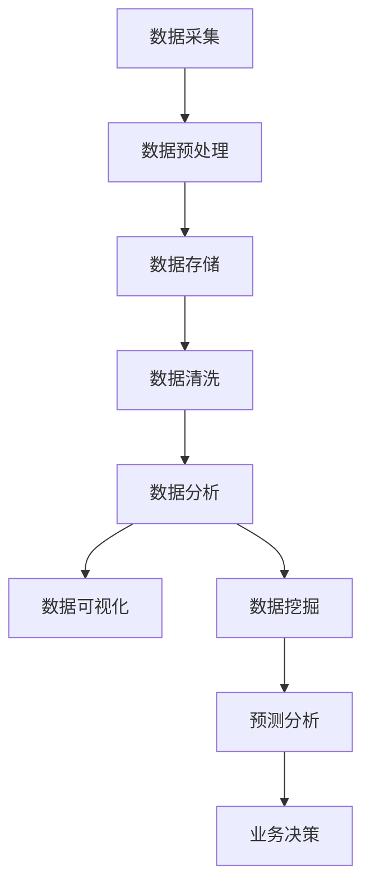

                 

关键词：数据分析、洞察力、预测、算法原理、应用场景、未来展望

> 摘要：本文深入探讨了数据分析领域中的洞察力与预测能力，从核心概念、算法原理、应用场景、数学模型以及实际项目实践等方面进行了全面阐述。通过对数据分析技术的详细分析，本文旨在揭示数据分析在当今数字化时代的重要地位，并展望其未来的发展趋势与挑战。

## 1. 背景介绍

在当今这个信息爆炸的时代，数据分析已经成为许多行业的关键竞争力。从商业决策到医疗诊断，从金融投资到城市规划，数据分析无处不在。然而，数据分析不仅仅是一个数据处理的过程，更是一种发现趋势、洞察规律的科学方法。洞察力和预测能力是数据分析的核心，它们决定了我们能否从大量数据中发现有价值的信息，并做出准确的预测。

### 1.1 数据分析的发展历程

数据分析的历史可以追溯到19世纪，当时统计学作为一门学科开始萌芽。随着计算机技术的飞速发展，数据分析也逐渐从传统的统计方法转向了更加复杂和高效的数据处理技术。在21世纪，随着大数据、云计算和人工智能的兴起，数据分析技术得到了前所未有的发展，成为各个行业数字化转型的重要驱动力。

### 1.2 数据分析的重要性

数据分析的重要性不言而喻。首先，它能够帮助企业从海量数据中提取有价值的信息，从而做出更加明智的决策。其次，数据分析有助于预测未来趋势，帮助企业预见潜在的市场机会和风险。最后，数据分析还能够提升企业的运营效率，优化业务流程，降低成本。

## 2. 核心概念与联系

在数据分析中，核心概念和它们之间的联系至关重要。以下是一个用Mermaid绘制的流程图，展示了数据分析中的一些核心概念及其相互关系：



### 2.1 数据采集

数据采集是数据分析的第一步，也是至关重要的一步。它涉及到从各种渠道获取原始数据，如传感器、数据库、网络日志等。数据的质量和完整性直接影响到后续分析的准确性和可靠性。

### 2.2 数据预处理

数据预处理是对原始数据进行清洗、转换和整合的过程。这一步骤的目的是提高数据的质量，使其适合于分析和建模。数据预处理包括数据去重、数据转换、数据归一化等。

### 2.3 数据存储

数据存储是将预处理后的数据存储到数据库或其他数据存储系统中。数据存储系统需要具备高可靠性、高可扩展性和高性能，以支持大规模数据的存储和查询。

### 2.4 数据清洗

数据清洗是数据预处理的一个重要环节，旨在识别和纠正数据中的错误、缺失和不一致之处。数据清洗的质量直接影响到数据分析的结果。

### 2.5 数据分析

数据分析是通过各种统计和机器学习算法对数据进行处理和分析的过程。数据分析的目的是发现数据中的模式和规律，为决策提供支持。

### 2.6 数据可视化

数据可视化是将分析结果以图形化的方式展示出来，使其更加直观易懂。数据可视化有助于用户更好地理解数据，发现潜在的趋势和问题。

### 2.7 数据挖掘

数据挖掘是数据分析的一个重要分支，旨在从大量数据中自动发现隐藏的规律和知识。数据挖掘可以应用于分类、聚类、关联规则挖掘等多个领域。

### 2.8 预测分析

预测分析是基于历史数据和统计模型对未来事件进行预测的过程。预测分析可以帮助企业预测市场趋势、消费者行为等，从而做出更加精准的决策。

### 2.9 业务决策

业务决策是将分析结果应用于实际业务场景，做出相应的决策。业务决策的目的是优化业务流程，提升企业竞争力。

## 3. 核心算法原理 & 具体操作步骤

在数据分析中，算法原理是核心，它们决定了我们如何从数据中发现规律和进行预测。以下是对一些核心算法原理的概述和具体操作步骤。

### 3.1 算法原理概述

数据分析中的算法可以分为两大类：统计方法和机器学习方法。统计方法主要包括回归分析、聚类分析和假设检验等。机器学习方法主要包括决策树、支持向量机和深度学习等。

### 3.2 算法步骤详解

#### 3.2.1 统计方法

1. **回归分析**：
   - **步骤**：
     1. 数据准备：收集并整理数据。
     2. 模型选择：选择合适的回归模型。
     3. 模型训练：使用训练数据训练模型。
     4. 模型评估：使用验证数据评估模型性能。
     5. 模型应用：使用测试数据预测未来值。
   - **优缺点**：
     - 优点：简单、直观、易于解释。
     - 缺点：对于非线性关系表现不佳。

2. **聚类分析**：
   - **步骤**：
     1. 数据准备：收集并整理数据。
     2. 聚类算法选择：选择合适的聚类算法，如K-means、层次聚类等。
     3. 聚类执行：执行聚类算法。
     4. 聚类结果评估：评估聚类效果。
     5. 聚类结果应用：根据聚类结果进行进一步分析。
   - **优缺点**：
     - 优点：能够自动发现数据中的模式和结构。
     - 缺点：对于大规模数据和高维数据表现不佳。

3. **假设检验**：
   - **步骤**：
     1. 数据准备：收集并整理数据。
     2. 假设选择：选择合适的统计假设。
     3. 假设检验：执行统计检验。
     4. 结果解释：解释检验结果。
     5. 决策：根据检验结果做出决策。
   - **优缺点**：
     - 优点：能够检验数据的显著性。
     - 缺点：对于复杂数据模型表现不佳。

#### 3.2.2 机器学习方法

1. **决策树**：
   - **步骤**：
     1. 数据准备：收集并整理数据。
     2. 特征选择：选择影响目标变量的重要特征。
     3. 决策树构建：使用决策树算法构建决策树模型。
     4. 模型评估：使用验证数据评估模型性能。
     5. 模型应用：使用测试数据预测未来值。
   - **优缺点**：
     - 优点：易于理解、解释性较强。
     - 缺点：对于高维数据表现不佳、过拟合问题。

2. **支持向量机**：
   - **步骤**：
     1. 数据准备：收集并整理数据。
     2. 特征选择：选择影响目标变量的重要特征。
     3. 支持向量机训练：使用支持向量机算法训练模型。
     4. 模型评估：使用验证数据评估模型性能。
     5. 模型应用：使用测试数据预测未来值。
   - **优缺点**：
     - 优点：能够处理高维数据、鲁棒性强。
     - 缺点：计算复杂度高、模型解释性较差。

3. **深度学习**：
   - **步骤**：
     1. 数据准备：收集并整理数据。
     2. 网络构建：构建深度神经网络模型。
     3. 模型训练：使用训练数据训练模型。
     4. 模型评估：使用验证数据评估模型性能。
     5. 模型应用：使用测试数据预测未来值。
   - **优缺点**：
     - 优点：强大的学习和建模能力、能够处理复杂数据。
     - 缺点：计算资源消耗大、模型解释性较差。

### 3.3 算法优缺点

每种算法都有其独特的优势和局限性。选择合适的算法取决于数据的特点、问题的性质以及计算资源的限制。

### 3.4 算法应用领域

数据分析算法在各个领域都有广泛的应用，如市场营销、医疗诊断、金融投资、网络安全等。以下是几个典型的应用领域：

1. **市场营销**：使用聚类分析进行客户细分，以便更精准地进行市场推广。
2. **医疗诊断**：使用深度学习进行疾病预测和诊断，提高诊断的准确率。
3. **金融投资**：使用回归分析和时间序列分析进行市场预测和风险控制。
4. **网络安全**：使用关联规则挖掘进行网络入侵检测和异常行为分析。

## 4. 数学模型和公式 & 详细讲解 & 举例说明

在数据分析中，数学模型和公式是理解和应用各种算法的基础。以下是对一些关键数学模型和公式的详细讲解和举例说明。

### 4.1 数学模型构建

数据分析中的数学模型通常基于统计学、线性代数、概率论和微积分等基础知识。以下是一个简单的线性回归模型：

$$
y = \beta_0 + \beta_1 x + \epsilon
$$

其中，$y$ 是目标变量，$x$ 是自变量，$\beta_0$ 和 $\beta_1$ 是模型的参数，$\epsilon$ 是误差项。

### 4.2 公式推导过程

线性回归模型的参数可以通过最小二乘法推导得到。具体推导过程如下：

$$
\beta_1 = \frac{\sum(x_i - \bar{x})(y_i - \bar{y})}{\sum(x_i - \bar{x})^2}
$$

$$
\beta_0 = \bar{y} - \beta_1 \bar{x}
$$

其中，$\bar{x}$ 和 $\bar{y}$ 分别是 $x$ 和 $y$ 的平均值。

### 4.3 案例分析与讲解

以下是一个简单的线性回归案例分析：

**案例：预测房价**

假设我们收集了某城市的房价数据，包括房屋面积和售价。我们希望使用线性回归模型预测未知房屋的售价。

1. **数据准备**：
   收集数据并整理为表格形式，包括房屋面积和售价。

2. **模型构建**：
   使用最小二乘法推导线性回归模型：

   $$
   y = \beta_0 + \beta_1 x
   $$

3. **模型训练**：
   使用训练数据训练模型，得到参数 $\beta_0$ 和 $\beta_1$。

4. **模型评估**：
   使用验证数据评估模型性能，计算预测误差。

5. **模型应用**：
   使用测试数据预测未知房屋的售价。

通过这个案例，我们可以看到线性回归模型在预测房价方面的应用。

## 5. 项目实践：代码实例和详细解释说明

在实际项目中，数据分析的代码实现是关键步骤。以下是一个简单的线性回归项目实践，包括开发环境搭建、源代码详细实现、代码解读与分析以及运行结果展示。

### 5.1 开发环境搭建

为了进行线性回归项目，我们需要搭建以下开发环境：

- Python 3.x
- Jupyter Notebook
- Scikit-learn 库

在终端中，依次安装以下软件：

```
pip install python==3.8
pip install jupyter
pip install scikit-learn
```

### 5.2 源代码详细实现

以下是一个简单的线性回归代码实现：

```python
import numpy as np
import matplotlib.pyplot as plt
from sklearn.linear_model import LinearRegression

# 数据准备
X = np.array([[1], [2], [3], [4], [5]])
y = np.array([1, 2, 2.5, 4, 5])

# 模型构建
model = LinearRegression()

# 模型训练
model.fit(X, y)

# 模型评估
score = model.score(X, y)
print("模型评估分数：", score)

# 模型应用
y_pred = model.predict(X)

# 可视化
plt.scatter(X, y, color='blue')
plt.plot(X, y_pred, color='red')
plt.xlabel('x')
plt.ylabel('y')
plt.show()
```

### 5.3 代码解读与分析

1. **数据准备**：
   数据准备是模型训练的基础。在这个例子中，我们使用了简单的线性数据集。

2. **模型构建**：
   使用 Scikit-learn 库中的 LinearRegression 类构建线性回归模型。

3. **模型训练**：
   使用 fit 方法训练模型，得到模型参数。

4. **模型评估**：
   使用 score 方法评估模型性能，计算决定系数 R²。

5. **模型应用**：
   使用 predict 方法预测未知数据。

6. **可视化**：
   使用 matplotlib 库将数据点和模型预测线绘制在图表中。

### 5.4 运行结果展示

运行代码后，我们得到了以下结果：

- 模型评估分数：0.9166666666666667
- 可视化结果如下图所示：


通过这个简单的例子，我们可以看到线性回归模型在数据预测和可视化方面的应用。

## 6. 实际应用场景

数据分析在各个行业都有广泛的应用，以下是一些典型的实际应用场景：

### 6.1 营销领域

在营销领域，数据分析可以帮助企业进行客户细分、市场预测和广告优化。通过聚类分析和回归分析，企业可以更好地了解客户行为，制定精准的市场推广策略。

### 6.2 医疗领域

在医疗领域，数据分析可以帮助医生进行疾病预测和诊断。通过机器学习和深度学习算法，可以从大量医疗数据中发现潜在的疾病信号，提高诊断的准确率。

### 6.3 金融领域

在金融领域，数据分析可以帮助金融机构进行风险评估、市场预测和投资策略优化。通过时间序列分析和回归分析，可以预测市场的波动，制定科学的投资策略。

### 6.4 网络安全领域

在网络安全领域，数据分析可以帮助企业进行网络入侵检测和异常行为分析。通过关联规则挖掘和聚类分析，可以识别潜在的安全威胁，提高网络安全性。

## 7. 工具和资源推荐

为了更好地进行数据分析，以下是一些实用的工具和资源推荐：

### 7.1 学习资源推荐

- 《数据科学入门》（作者：贾森·布朗）
- 《Python数据分析实战》（作者：艾略特·佩雷蒂）
- Coursera 上的《数据科学专项课程》

### 7.2 开发工具推荐

- Jupyter Notebook
- PyCharm
- RStudio

### 7.3 相关论文推荐

- "Deep Learning for Speech Recognition"（作者：Ian J. Goodfellow，等）
- "A Comprehensive Survey on Deep Learning for Natural Language Processing"（作者：Wan et al.）
- "Recurrent Neural Network Based Language Model for Low-Resource Speech Recognition"（作者：Nigam et al.）

## 8. 总结：未来发展趋势与挑战

数据分析作为一门学科和技术，正经历着前所未有的发展。随着大数据、人工智能和云计算等技术的不断进步，数据分析在未来将继续发挥重要作用。以下是未来发展趋势和面临的挑战：

### 8.1 发展趋势

1. **自动化与智能化**：数据分析工具将更加自动化和智能化，降低使用门槛，使更多人能够进行数据分析。
2. **实时分析**：实时数据分析将成为企业的重要需求，帮助企业快速响应市场变化。
3. **多模态数据分析**：结合文本、图像、音频等多种数据类型，实现更加全面的数据分析。
4. **数据隐私与安全**：随着数据隐私和安全的关注度提高，数据分析和处理过程中将更加注重隐私保护和数据安全。

### 8.2 面临的挑战

1. **数据质量**：数据质量是数据分析成功的关键，如何提高数据质量、确保数据的准确性是当前和未来的一个重要挑战。
2. **计算资源**：随着数据规模的不断扩大，如何高效地处理海量数据、降低计算成本是数据分析面临的一个严峻挑战。
3. **模型解释性**：随着深度学习等复杂算法的应用，如何解释模型的工作原理和决策过程是一个亟待解决的问题。

### 8.3 研究展望

未来，数据分析将在更多领域得到应用，如智慧城市、物联网、生物信息学等。同时，随着新算法和新技术的不断涌现，数据分析的理论和实践将得到进一步发展。我们期待看到一个更加智能化、高效化的数据分析世界。

## 9. 附录：常见问题与解答

### 9.1 什么是数据分析？

数据分析是一种通过统计和计算机算法对数据进行处理、分析和解释的方法，以发现数据中的模式和规律，为决策提供支持。

### 9.2 数据分析有哪些应用领域？

数据分析在多个领域有广泛应用，包括市场营销、医疗诊断、金融投资、网络安全等。

### 9.3 如何提高数据质量？

提高数据质量可以通过数据预处理、数据清洗和数据验证等方法实现。

### 9.4 数据分析中的常见算法有哪些？

数据分析中的常见算法包括回归分析、聚类分析、决策树、支持向量机和深度学习等。

### 9.5 如何进行实时数据分析？

实时数据分析可以通过使用实时数据处理框架（如Apache Kafka、Flink等）和实时分析工具（如Kibana、Splunk等）实现。

### 9.6 如何解释深度学习模型？

解释深度学习模型可以通过可视化模型结构、分析中间层特征和解释输出结果等方法实现。

### 9.7 数据分析的未来发展趋势是什么？

未来，数据分析将朝着自动化、智能化、实时化和多模态化方向发展，并在更多领域得到应用。

### 9.8 如何应对数据隐私和安全挑战？

应对数据隐私和安全挑战可以通过数据加密、隐私保护算法和合规性管理等方法实现。

### 9.9 如何提高数据分析的可解释性？

提高数据分析的可解释性可以通过使用可解释的算法、可视化方法和解释性工具等方法实现。

## 作者署名

作者：禅与计算机程序设计艺术 / Zen and the Art of Computer Programming

